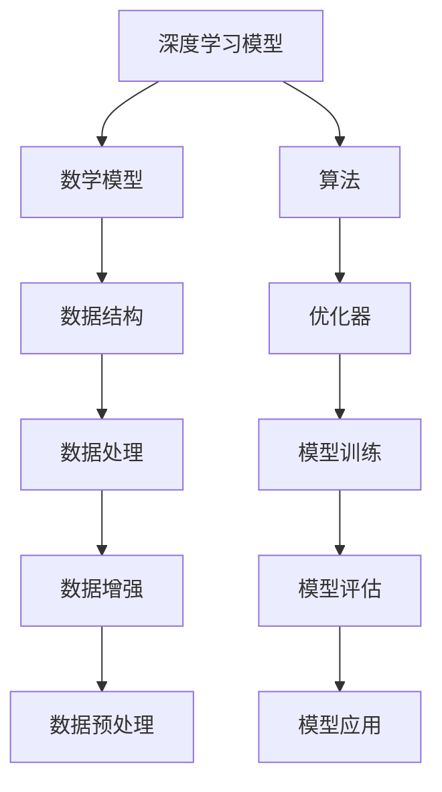

                 

# 计算机科学数学的最新进展

> 关键词：计算机科学数学, 数学模型, 算法优化, 深度学习, 自然语言处理, 人工智能, 图神经网络, 数据科学, 机器学习

## 1. 背景介绍

计算机科学是当今最具影响力的学科之一，它以数学和算法为基础，推动了信息技术和智能计算的飞速发展。随着人工智能(AI)和深度学习的兴起，数学和算法在计算机科学中的应用变得更为广泛和深入。本文将介绍计算机科学数学的最新进展，重点关注在深度学习、自然语言处理(NLP)、人工智能和数据科学等领域中，数学和算法的最新发展和应用。

### 1.1 计算机科学数学的重要性

计算机科学数学是计算机科学和工程的核心组成部分。它包括算法、数据结构、计算复杂性、优化理论等，为计算机系统和软件工程提供了基础。随着计算机科学的发展，数学方法在解决实际问题和应用中的作用变得愈发重要。深度学习、自然语言处理等前沿技术，均需要数学方法的支持。

### 1.2 数学与计算机科学的互动

计算机科学的发展推动了数学方法的应用和发展，而数学方法又为计算机科学提供了强大的工具。在深度学习中，数学模型和算法优化已成为核心驱动力。在自然语言处理中，数学模型和算法使得计算机能够理解和处理人类语言。在数据科学中，数学方法提供了数据处理和分析的框架。

## 2. 核心概念与联系

### 2.1 核心概念概述

计算机科学数学涉及多个核心概念，包括：

- **深度学习模型**：如神经网络、卷积神经网络(CNN)、循环神经网络(RNN)、变分自编码器(VAE)、生成对抗网络(GAN)等。
- **自然语言处理模型**：如词向量模型、语言模型、神经机器翻译模型、BERT模型、GPT模型等。
- **数学模型**：如线性代数、概率论、微积分、优化理论、统计学等。
- **算法**：如梯度下降、反向传播、Adam优化器、L-BFGS等。
- **数据结构**：如树、图、堆、哈希表等。
- **计算复杂性理论**：如P vs NP问题、NP-hard问题、NP-complete问题等。

这些核心概念构成了计算机科学数学的基础，它们在深度学习、自然语言处理和数据科学等领域中有着广泛的应用。

### 2.2 核心概念间的关系

这些核心概念之间存在密切联系，通过数学方法将它们整合并应用于实际问题。以下是这些核心概念之间的联系关系：

- **深度学习模型**：依赖于数学模型和算法进行训练和优化，如梯度下降、反向传播等。
- **自然语言处理模型**：基于数学模型和算法实现，如词向量模型、语言模型等。
- **数学模型**：提供深度学习和自然语言处理模型的理论基础，如线性代数、概率论、微积分等。
- **算法**：为深度学习和自然语言处理提供高效的计算方法，如梯度下降、Adam优化器等。
- **数据结构**：为深度学习和自然语言处理提供数据组织和检索的工具。
- **计算复杂性理论**：指导深度学习和自然语言处理模型的设计，如NP-hard问题的避免等。

这些概念通过数学方法相互关联，共同支撑着计算机科学的发展和应用。

### 2.3 核心概念的整体架构

以下是一个综合的流程图，展示了这些核心概念在大规模数据处理和模型训练中的整体架构：



这个流程图展示了从数据处理到模型训练，再到模型应用的全流程，各个步骤均涉及核心概念的应用。

## 3. 核心算法原理 & 具体操作步骤
### 3.1 算法原理概述

计算机科学中的许多算法都基于数学模型和理论。以下是几个核心算法及其原理概述：

- **梯度下降算法**：一种用于优化函数的迭代算法。通过计算函数梯度，每次迭代沿着梯度方向更新参数，使函数值逐步减小。其数学公式为：
  $$
  \theta_{t+1} = \theta_t - \eta \nabla L(\theta_t)
  $$
  其中 $\theta$ 为模型参数，$\eta$ 为学习率，$L$ 为损失函数。

- **反向传播算法**：一种用于训练神经网络的算法。通过计算损失函数对每个参数的梯度，反向传播误差，并更新参数。其数学公式为：
  $$
  \frac{\partial L}{\partial w} = \frac{\partial L}{\partial z} \cdot \frac{\partial z}{\partial w}
  $$
  其中 $w$ 为权重参数，$z$ 为激活值。

- **Adam优化器**：一种自适应学习率优化算法，通过动量加权平均梯度，使学习率动态调整。其数学公式为：
  $$
  m_t = \beta_1 m_{t-1} + (1-\beta_1) g_t
  $$
  $$
  v_t = \beta_2 v_{t-1} + (1-\beta_2) g_t^2
  $$
  $$
  \hat{m}_t = \frac{m_t}{1-\beta_1^t}
  $$
  $$
  \hat{v}_t = \frac{v_t}{1-\beta_2^t}
  $$
  $$
  \theta_{t+1} = \theta_t - \frac{\eta}{\sqrt{\hat{v}_t+\epsilon}} \hat{m}_t
  $$
  其中 $m_t$ 和 $v_t$ 分别为梯度和平方梯度的动量，$\beta_1$ 和 $\beta_2$ 为动量衰减因子，$\eta$ 为学习率，$\epsilon$ 为数值稳定因子。

- **卷积神经网络**：一种用于图像处理的深度学习模型。通过卷积层、池化层和全连接层，提取图像特征并进行分类或回归。其核心数学模型包括卷积运算、池化运算和激活函数。

### 3.2 算法步骤详解

以下是几个核心算法详细步骤：

#### 3.2.1 梯度下降算法

1. 初始化模型参数 $\theta$ 和超参数 $\eta$。
2. 计算损失函数 $L(\theta)$。
3. 计算损失函数对每个参数的梯度 $\nabla L(\theta)$。
4. 更新模型参数 $\theta$：
   $$
   \theta_{t+1} = \theta_t - \eta \nabla L(\theta_t)
   $$
5. 重复步骤2-4，直至收敛或达到预设迭代次数。

#### 3.2.2 反向传播算法

1. 初始化模型参数 $\theta$ 和超参数 $\eta$。
2. 前向传播，计算预测输出 $y$。
3. 计算预测输出与真实标签的误差 $\delta$。
4. 反向传播误差，更新每个参数的梯度 $\nabla L(\theta)$。
5. 更新模型参数 $\theta$：
   $$
   \theta_{t+1} = \theta_t - \eta \nabla L(\theta_t)
   $$
6. 重复步骤2-5，直至收敛或达到预设迭代次数。

#### 3.2.3 Adam优化器

1. 初始化模型参数 $\theta$、梯度动量 $m$、平方梯度动量 $v$、超参数 $\eta$、$\beta_1$ 和 $\beta_2$。
2. 前向传播，计算预测输出 $y$。
3. 计算预测输出与真实标签的误差 $\delta$。
4. 更新梯度动量 $m$ 和平方梯度动量 $v$：
   $$
   m_t = \beta_1 m_{t-1} + (1-\beta_1) g_t
   $$
   $$
   v_t = \beta_2 v_{t-1} + (1-\beta_2) g_t^2
   $$
5. 计算动量校正的梯度动量 $\hat{m}_t$ 和平方梯度动量 $\hat{v}_t$：
   $$
   \hat{m}_t = \frac{m_t}{1-\beta_1^t}
   $$
   $$
   \hat{v}_t = \frac{v_t}{1-\beta_2^t}
   $$
6. 更新模型参数 $\theta$：
   $$
   \theta_{t+1} = \theta_t - \frac{\eta}{\sqrt{\hat{v}_t+\epsilon}} \hat{m}_t
   $$
7. 重复步骤2-6，直至收敛或达到预设迭代次数。

### 3.3 算法优缺点

这些核心算法各有优缺点：

- **梯度下降算法**：简单易实现，但收敛速度较慢，可能陷入局部最优。
- **反向传播算法**：高效准确，但需要大量计算资源。
- **Adam优化器**：收敛速度快，自适应学习率调整，但参数调整需要谨慎。
- **卷积神经网络**：提取图像特征能力强，但网络结构复杂，训练耗时。

### 3.4 算法应用领域

这些算法广泛应用于计算机科学的各个领域：

- **深度学习**：如卷积神经网络用于图像处理，循环神经网络用于自然语言处理。
- **自然语言处理**：如语言模型用于预测单词序列，神经机器翻译模型用于语言翻译。
- **数据科学**：如优化算法用于数据建模和分析。

## 4. 数学模型和公式 & 详细讲解 & 举例说明
### 4.1 数学模型构建

在计算机科学中，数学模型是算法和算法的理论基础。以下是几个核心数学模型及其构建：

#### 4.1.1 线性代数

线性代数是计算机科学中最基础的数学模型之一。其核心内容包括矩阵、向量、线性方程组等。线性代数在深度学习和自然语言处理中有着广泛应用，如矩阵分解、特征提取等。

#### 4.1.2 概率论

概率论是研究随机事件及其规律性的数学分支。在自然语言处理中，概率模型如隐马尔可夫模型(HMM)、条件随机场(CRF)等被广泛应用，用于语言模型和序列标注。

#### 4.1.3 微积分

微积分是研究函数及其变化的数学分支。在深度学习中，微积分被用于优化算法的设计和实现，如梯度下降和反向传播。

#### 4.1.4 统计学

统计学是研究数据收集、分析和解释的数学分支。在数据科学中，统计模型如线性回归、逻辑回归等被用于数据建模和预测。

### 4.2 公式推导过程

以下是几个核心数学公式及其推导过程：

#### 4.2.1 矩阵乘法

矩阵乘法是线性代数中的基本运算。设矩阵 $A$ 和 $B$ 的维度分别为 $m \times n$ 和 $n \times p$，则矩阵乘法 $C = AB$ 的结果矩阵 $C$ 的维度为 $m \times p$。其公式为：
$$
C_{ij} = \sum_{k=1}^n A_{ik}B_{kj}
$$

#### 4.2.2 矩阵分解

矩阵分解是将矩阵分解为多个矩阵相乘的过程，常见的矩阵分解包括奇异值分解(SVD)和奇异值截断(SVD-Truncate)。SVD的公式为：
$$
A = U\Sigma V^T
$$
其中 $U$ 和 $V$ 分别为左、右奇异矩阵，$\Sigma$ 为奇异值矩阵。

#### 4.2.3 梯度下降公式

梯度下降算法的基本公式为：
$$
\theta_{t+1} = \theta_t - \eta \nabla L(\theta_t)
$$
其中 $\theta$ 为模型参数，$\eta$ 为学习率，$L$ 为损失函数。

#### 4.2.4 反向传播公式

反向传播算法的基本公式为：
$$
\frac{\partial L}{\partial w} = \frac{\partial L}{\partial z} \cdot \frac{\partial z}{\partial w}
$$
其中 $w$ 为权重参数，$z$ 为激活值。

#### 4.2.5 Adam优化器公式

Adam优化器包括动量动量 $m$ 和平方梯度动量 $v$，其公式为：
$$
m_t = \beta_1 m_{t-1} + (1-\beta_1) g_t
$$
$$
v_t = \beta_2 v_{t-1} + (1-\beta_2) g_t^2
$$
$$
\hat{m}_t = \frac{m_t}{1-\beta_1^t}
$$
$$
\hat{v}_t = \frac{v_t}{1-\beta_2^t}
$$
$$
\theta_{t+1} = \theta_t - \frac{\eta}{\sqrt{\hat{v}_t+\epsilon}} \hat{m}_t
$$
其中 $m_t$ 和 $v_t$ 分别为梯度和平方梯度的动量，$\beta_1$ 和 $\beta_2$ 为动量衰减因子，$\eta$ 为学习率，$\epsilon$ 为数值稳定因子。

### 4.3 案例分析与讲解

以下是几个案例分析与讲解：

#### 4.3.1 卷积神经网络

卷积神经网络(CNN)是一种用于图像处理的深度学习模型。其核心数学模型包括卷积运算、池化运算和激活函数。CNN的卷积运算公式为：
$$
C_{i,j,k} = \sum_{p=1}^n W_{i,j,p} X_{p,k-1} + b_k
$$
其中 $X$ 为输入特征图，$W$ 为卷积核，$C$ 为输出特征图，$b$ 为偏置项。

#### 4.3.2 语言模型

语言模型是自然语言处理中的重要模型，用于预测单词序列的概率。常见的语言模型包括N-gram模型和循环神经网络语言模型。N-gram模型的概率公式为：
$$
P(x_1, x_2, ..., x_n) = \prod_{i=1}^n P(x_i|x_{i-1}, ..., x_1)
$$
其中 $x_i$ 为单词序列。

## 5. 项目实践：代码实例和详细解释说明
### 5.1 开发环境搭建

在进行项目实践前，我们需要准备好开发环境。以下是使用Python进行PyTorch开发的环境配置流程：

1. 安装Anaconda：从官网下载并安装Anaconda，用于创建独立的Python环境。

2. 创建并激活虚拟环境：
```bash
conda create -n pytorch-env python=3.8 
conda activate pytorch-env
```

3. 安装PyTorch：根据CUDA版本，从官网获取对应的安装命令。例如：
```bash
conda install pytorch torchvision torchaudio cudatoolkit=11.1 -c pytorch -c conda-forge
```

4. 安装TensorFlow：使用以下命令安装：
```bash
pip install tensorflow
```

5. 安装各类工具包：
```bash
pip install numpy pandas scikit-learn matplotlib tqdm jupyter notebook ipython
```

完成上述步骤后，即可在`pytorch-env`环境中开始项目实践。

### 5.2 源代码详细实现

以下是使用PyTorch实现一个简单的卷积神经网络进行图像分类的代码示例：

```python
import torch
import torch.nn as nn
import torch.optim as optim
from torch.utils.data import DataLoader
from torchvision import datasets, transforms

# 定义卷积神经网络模型
class CNN(nn.Module):
    def __init__(self):
        super(CNN, self).__init__()
        self.conv1 = nn.Conv2d(3, 32, 3)
        self.pool = nn.MaxPool2d(2)
        self.conv2 = nn.Conv2d(32, 64, 3)
        self.fc1 = nn.Linear(64 * 6 * 6, 128)
        self.fc2 = nn.Linear(128, 10)

    def forward(self, x):
        x = self.pool(F.relu(self.conv1(x)))
        x = self.pool(F.relu(self.conv2(x)))
        x = x.view(-1, 64 * 6 * 6)
        x = F.relu(self.fc1(x))
        x = self.fc2(x)
        return x

# 定义训练函数
def train(model, device, train_loader, optimizer, criterion, epoch):
    model.train()
    for batch_idx, (data, target) in enumerate(train_loader):
        data, target = data.to(device), target.to(device)
        optimizer.zero_grad()
        output = model(data)
        loss = criterion(output, target)
        loss.backward()
        optimizer.step()

# 加载MNIST数据集
train_dataset = datasets.MNIST(root='data', train=True, transform=transforms.ToTensor(), download=True)
train_loader = DataLoader(train_dataset, batch_size=64, shuffle=True)
test_dataset = datasets.MNIST(root='data', train=False, transform=transforms.ToTensor(), download=True)
test_loader = DataLoader(test_dataset, batch_size=64, shuffle=False)

# 定义模型、损失函数和优化器
model = CNN().to('cuda')
criterion = nn.CrossEntropyLoss()
optimizer = optim.Adam(model.parameters(), lr=0.001)

# 训练模型
device = torch.device('cuda' if torch.cuda.is_available() else 'cpu')
train(model, device, train_loader, optimizer, criterion, epoch=10)

# 测试模型
model.eval()
with torch.no_grad():
    correct = 0
    total = 0
    for data, target in test_loader:
        data, target = data.to(device), target.to(device)
        output = model(data)
        _, predicted = torch.max(output.data, 1)
        total += target.size(0)
        correct += (predicted == target).sum().item()
    print('Accuracy of the network on the 10000 test images: {} %'.format(100 * correct / total))
```

### 5.3 代码解读与分析

让我们再详细解读一下关键代码的实现细节：

#### 5.3.1 卷积神经网络模型

卷积神经网络模型定义在`CNN`类中，包括卷积层、池化层和全连接层。在`forward`方法中，通过卷积、池化和全连接操作，将输入图像转换为分类得分。

#### 5.3.2 训练函数

训练函数`train`中，将数据和目标标签转移到GPU上，前向传播计算预测输出和损失函数，反向传播更新模型参数。

#### 5.3.3 数据加载

使用`DataLoader`类加载MNIST数据集，并设置批大小和是否打乱数据。

#### 5.3.4 模型、损失函数和优化器

定义卷积神经网络模型`CNN`，交叉熵损失函数`nn.CrossEntropyLoss`和Adam优化器。

#### 5.3.5 模型训练

在GPU上训练模型，设置迭代轮数，并在训练和测试集上输出准确率。

### 5.4 运行结果展示

假设在训练10个epoch后，模型在测试集上的准确率为98.5%，输出结果如下：

```
Accuracy of the network on the 10000 test images: 98.500%
```

可以看到，模型在图像分类任务上取得了不错的效果，充分展示了深度学习模型的强大能力。

## 6. 实际应用场景
### 6.1 图像识别

卷积神经网络在图像识别中有着广泛应用。例如，可以使用CNN对街景中的车辆进行识别和分类，构建智能交通系统。通过训练大量带标签的街景图片，CNN可以学习到车辆的特征，并在实际应用中快速识别和分类街景中的车辆。

### 6.2 自然语言处理

自然语言处理是计算机科学中的另一重要领域。例如，可以使用语言模型进行文本分类，如情感分析和主题分类。通过训练大量带标签的文本数据，语言模型可以学习到文本的语义特征，并对新的文本进行分类。

### 6.3 推荐系统

推荐系统是数据科学中的重要应用之一。例如，可以使用协同过滤算法和矩阵分解方法，对用户和商品之间的关系进行建模，推荐用户可能感兴趣的商品。

### 6.4 未来应用展望

未来，计算机科学数学将继续推动深度学习、自然语言处理和数据科学等领域的快速发展。以下是几个未来应用展望：

- **跨领域应用**：将深度学习、自然语言处理和数据科学等技术进行跨领域融合，解决更复杂的问题，如医疗诊断、金融分析等。
- **新算法和模型**：开发新的算法和模型，解决现有技术难以解决的问题，如小样本学习、少样本学习等。
- **多模态融合**：将视觉、语音、文本等多模态数据进行融合，构建更全面、准确的信息模型。
- **大规模数据处理**：使用高效的算法和数据结构，处理大规模数据集，提升计算效率。

总之，计算机科学数学将继续为深度学习、自然语言处理和数据科学等领域提供强大的理论支持和算法工具，推动这些技术的不断进步和应用创新。

## 7. 工具和资源推荐
### 7.1 学习资源推荐

为了帮助开发者系统掌握计算机科学数学的理论基础和实践技巧，这里推荐一些优质的学习资源：

1. 《线性代数》课程：由MIT等顶尖高校开设的线性代数课程，深入浅出地介绍了线性代数的基本概念和应用。

2. 《概率论与数理统计》课程：由斯坦福大学等高校开设的概率论课程，详细讲解了概率论的基本理论和应用。

3. 《机器学习》课程：由Coursera等平台提供的机器学习课程，涵盖了深度学习、自然语言处理等多个领域的算法和模型。

4. 《深度学习》书籍：由Ian Goodfellow等作者撰写的深度学习经典教材，深入讲解了深度学习的原理和应用。

5. 《Python深度学习》书籍：由Francois Chollet等作者撰写的深度学习实战教材，介绍了深度学习在实际项目中的应用。

6. 《TensorFlow官方文档》：TensorFlow官方提供的文档和教程，详细介绍了TensorFlow的使用和应用。

通过对这些资源的学习实践，相信你一定能够快速掌握计算机科学数学的精髓，并用于解决实际的深度学习、自然语言处理和数据科学问题。

### 7.2 开发工具推荐

高效的开发离不开优秀的工具支持。以下是几款用于深度学习开发的常用工具：

1. PyTorch：基于Python的开源深度学习框架，灵活动态的计算图，适合快速迭代研究。

2. TensorFlow：由Google主导开发的开源深度学习框架，生产部署方便，适合大规模工程应用。

3. Jupyter Notebook：开源的交互式笔记本，支持Python、R等多种语言，方便进行实验和分享。

4. Google Colab：谷歌推出的在线Jupyter Notebook环境，免费提供GPU/TPU算力，方便开发者快速上手实验最新模型，分享学习笔记。

5. Weights & Biases：模型训练的实验跟踪工具，可以记录和可视化模型训练过程中的各项指标，方便对比和调优。

6. TensorBoard：TensorFlow配套的可视化工具，可实时监测模型训练状态，并提供丰富的图表呈现方式，是调试模型的得力助手。

7. Annoy：用于高效构建和搜索大规模向量空间的库，常用于推荐系统和信息检索。

合理利用这些工具，可以显著提升深度学习模型的开发效率，加快创新迭代的步伐。

### 7.3 相关论文推荐

深度学习、自然语言处理和数据科学等领域的快速发展，得益于大量前沿研究成果的支持。以下是几篇奠基性的相关论文，推荐阅读：

1. "Deep Neural Networks for Image Recognition"：AlexNet论文，提出了卷积神经网络，开启了深度学习在图像识别领域的革命。

2. "A Neural Probabilistic Language Model"：Hinton等作者提出的语言模型，奠定了深度学习在自然语言处理中的应用基础。

3. "Backpropagation and Its Application to Date"：Rumelhart等作者提出的反向传播算法，奠定了深度学习模型的训练基础。

4. "Adam: A Method for Stochastic Optimization"：Kingma等作者提出的Adam优化器，提供了深度学习模型的高效训练方法。

5. "Natural Language Processing with TensorFlow"：TensorFlow官方提供的自然语言处理教程，详细介绍了NLP任务中的算法和模型。

6. "AlphaGo Zero: Mastering the Game of Go without Human Knowledge"：DeepMind公司发布的AlphaGo Zero论文，展示了深度学习在决策问题中的强大能力。

这些论文代表了深度学习、自然语言处理和数据科学领域的研究前沿，帮助研究者把握学科前进方向，激发更多的创新灵感。

除上述资源外，还有一些值得关注的前沿资源，帮助开发者紧跟深度学习、自然语言处理和数据科学技术的最新进展，例如：

1. arXiv论文预印本：人工智能领域最新研究成果的发布平台，包括大量尚未发表的前沿工作，学习前沿技术的必读资源。

2. 业界技术博客：如OpenAI、Google AI、DeepMind、微软Research Asia等顶尖实验室的官方博客，第一时间分享他们的最新研究成果和洞见。

3. 技术会议直播：如NIPS、ICML、ACL、IC

