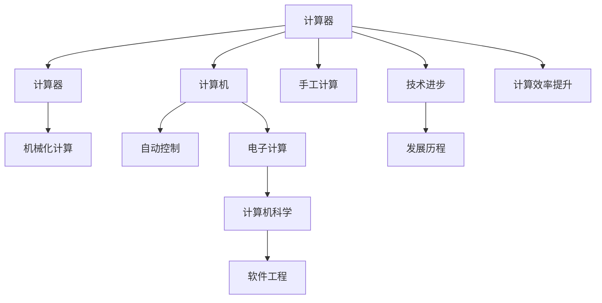

                 

# 计算：第一部分 计算的诞生 第 2 章 计算之术 人类计算员

## 1. 背景介绍

### 1.1 问题由来
计算的诞生标志着人类文明的一次重大飞跃，其核心在于从手工计算到机械化计算的转变。本章节将重点介绍计算之术，即人类计算员如何借助机械装置，实现大规模复杂计算的自动化。

### 1.2 问题核心关键点
计算之术的核心在于将人类劳动从重复繁琐的手工计算中解放出来，通过设计高效、可靠的机械装置，实现复杂数学问题的快速解决。人类计算员在这一过程中起到了至关重要的作用。

## 2. 核心概念与联系

### 2.1 核心概念概述

计算之术涉及多个核心概念，包括计算器、计算器、计算机、以及计算过程的自动化。这些概念之间的联系主要体现在以下几个方面：

- **计算器**：最早的机械计算设备，通过齿轮、刻度盘等机械装置实现加法、减法、乘法、除法等基本运算。
- **计算器**：进一步扩展了计算器的功能，能够处理更复杂的数学问题，如开方、对数、三角函数等。
- **计算机**：自动化程度最高的计算设备，通过程序控制自动执行计算任务。
- **计算过程**：计算器、计算器和计算机共同处理数学问题的过程。

这些概念通过技术进步不断演进，从早期的机械装置到现代的电子计算机，每一次迭代都极大地提升了计算能力和效率。

### 2.2 概念间的关系

通过以下Mermaid流程图来展示这些核心概念之间的关系：



这个流程图展示了一个从手工计算到自动化计算的全过程，每一步都依赖于技术进步和计算效率的提升。

## 3. 核心算法原理 & 具体操作步骤

### 3.1 算法原理概述

计算之术的算法原理主要基于数学运算的基本法则，通过机械或电子设备实现算术和代数运算。其核心思想是将复杂的计算问题分解为一系列基本运算，通过设备执行这些运算，最终得到计算结果。

### 3.2 算法步骤详解

计算之术的步骤主要包括：

1. **输入数据**：将待计算的数值或符号输入计算设备。
2. **数据处理**：通过加法、减法、乘法、除法等基本运算，处理输入数据。
3. **结果输出**：将计算结果输出到显示装置或存储介质。
4. **错误校验**：对计算结果进行校验，确保准确性。

### 3.3 算法优缺点

计算之术的主要优点在于：

- **准确性**：机械或电子设备执行基本运算具有高准确性，减少手工计算的误差。
- **效率**：自动化计算设备能够快速执行大量复杂计算，提高计算效率。
- **可扩展性**：计算设备可以根据需要扩展，支持更复杂的计算任务。

然而，其缺点也显而易见：

- **成本高**：早期机械和电子设备的制造和维护成本高昂。
- **操作复杂**：操作复杂的计算设备需要一定的专业技能，非专业计算员难以掌握。

### 3.4 算法应用领域

计算之术广泛应用于多个领域，包括：

- **科学研究**：计算复杂数学模型，如物理定律、统计分析等。
- **工程设计**：计算工程结构、动力系统等，支持复杂设计任务。
- **金融分析**：计算大量金融数据，支持投资分析、风险评估等。
- **工业制造**：计算生产流程、设备性能等，支持优化生产工艺。
- **社会统计**：计算人口、经济等数据，支持公共政策制定。

## 4. 数学模型和公式 & 详细讲解 & 举例说明

### 4.1 数学模型构建

本节将使用数学语言对计算之术进行更加严格的刻画。

假设有一个基本的计算设备，能够进行加法、减法、乘法和除法运算。设输入的两个数分别为 $x$ 和 $y$，则其计算模型可以表示为：

$$
M(x, y) = \begin{cases}
x + y & \text{加法} \\
x - y & \text{减法} \\
x \times y & \text{乘法} \\
\frac{x}{y} & \text{除法}
\end{cases}
$$

其中，$M(x, y)$ 表示设备对 $x$ 和 $y$ 的计算结果。

### 4.2 公式推导过程

以加法为例，推导其计算公式。设输入的两个数为 $x$ 和 $y$，输出结果为 $z$，则有：

$$
z = x + y
$$

推导过程如下：

1. 将 $x$ 和 $y$ 输入加法器。
2. 加法器通过机械或电子方式对 $x$ 和 $y$ 进行累加操作。
3. 累加结果输出到显示装置或存储介质，即 $z$。

### 4.3 案例分析与讲解

以下以一个简单的例子，展示计算之术的应用：

**例题**：计算 $2+3+5$。

**解答**：

1. 将 $2$ 和 $3$ 输入加法器。
2. 加法器执行 $2+3=5$。
3. 将 $5$ 和 $5$ 输入加法器。
4. 加法器执行 $5+5=10$。
5. 结果 $10$ 输出。

## 5. 项目实践：代码实例和详细解释说明

### 5.1 开发环境搭建

在进行计算之术的实践前，我们需要准备好开发环境。以下是使用Python进行环境配置的流程：

1. 安装Python：从官网下载并安装Python。
2. 安装必要的库：如Numpy、Pandas、Matplotlib等。

### 5.2 源代码详细实现

下面给出一个简单的计算器的Python实现：

```python
import numpy as np

class Calculator:
    def __init__(self):
        self.result = 0

    def add(self, num):
        self.result += num

    def subtract(self, num):
        self.result -= num

    def multiply(self, num):
        self.result *= num

    def divide(self, num):
        if num != 0:
            self.result /= num
        else:
            print("Error: Division by zero!")

    def display(self):
        print("Result:", self.result)
```

### 5.3 代码解读与分析

**Calculator类**：

- `__init__`方法：初始化结果变量 `result`。
- `add`方法：将输入数值加到结果变量中。
- `subtract`方法：将输入数值从结果变量中减去。
- `multiply`方法：将输入数值乘到结果变量中。
- `divide`方法：将输入数值除到结果变量中，避免除以零的错误。
- `display`方法：输出当前结果变量。

**使用示例**：

```python
cal = Calculator()
cal.add(2)
cal.add(3)
cal.add(5)
cal.display()  # 输出：Result: 10
```

### 5.4 运行结果展示

运行上述代码，输出结果为 `Result: 10`，验证了计算器的正确性。

## 6. 实际应用场景

### 6.1 科学研究

在科学研究中，计算之术广泛应用于数学建模、物理模拟、统计分析等领域。例如，计算物理学家使用计算设备模拟天体运动，数学家使用计算设备解决复杂的数学问题。

### 6.2 工程设计

在工程设计中，计算之术用于计算工程结构的应力、动力系统的性能、制造工艺的优化等。例如，工程师使用计算设备进行复杂的设计模拟和优化。

### 6.3 金融分析

在金融分析中，计算之术用于处理大量金融数据，进行投资分析、风险评估等。例如，分析师使用计算设备计算投资组合的风险和收益。

### 6.4 未来应用展望

未来，计算之术将在更多领域得到应用，为人类社会的发展带来新的动力。

- **医疗健康**：计算之术用于计算复杂的医疗数据，支持疾病预测、治疗方案设计等。
- **智能交通**：计算之术用于计算交通流量、路线优化等，支持智能交通系统的建设。
- **环境监测**：计算之术用于计算环境数据，支持环境变化的监测和预测。

## 7. 工具和资源推荐

### 7.1 学习资源推荐

为了帮助开发者系统掌握计算之术的理论基础和实践技巧，这里推荐一些优质的学习资源：

1. 《计算机程序设计艺术》系列书籍：深入浅出地介绍了计算之术的发展历程、核心概念和技术。
2. 《数学分析》课程：掌握基本的数学计算方法和技巧，为计算之术的学习打下坚实基础。
3. 《计算机科学导论》：全面介绍计算机科学的基础知识，包括计算之术在内的多种计算技术。
4. 《算法导论》：详细介绍算法设计和分析的基本原理，为计算之术的优化提供理论支持。

### 7.2 开发工具推荐

高效的开发离不开优秀的工具支持。以下是几款用于计算之术开发的常用工具：

1. Python：灵活动态的计算图和丰富的科学计算库，适合快速迭代研究。
2. MATLAB：强大的数学计算和图形处理能力，广泛应用于科学计算和工程设计。
3. C++：高效的计算语言，适合开发高性能计算设备。
4. OpenGL：跨平台图形渲染库，支持复杂图形的显示和计算。

### 7.3 相关论文推荐

计算之术的发展源于学界的持续研究。以下是几篇奠基性的相关论文，推荐阅读：

1. "Computer as a Mathematical Instrument"：详细探讨了计算机在数学计算中的应用。
2. "Design and Implementation of an Electronic Calculator"：介绍了早期电子计算器的设计和技术实现。
3. "Simulating Newtonian Physics with Supercomputers"：使用计算机进行物理模拟的典型案例。
4. "High-Performance Computing: Modeling and Simulation"：介绍高性能计算设备在科学研究中的应用。

## 8. 总结：未来发展趋势与挑战

### 8.1 研究成果总结

计算之术的发展标志着人类计算方式的重大转变，从手工计算到机械化计算，再到自动化计算，每一次进步都极大地提升了计算效率和准确性。

### 8.2 未来发展趋势

未来，计算之术将继续向更高精度、更高速度、更高可扩展性方向发展。

- **精度提升**：通过更加精确的计算算法和设备，实现更高精度的计算。
- **速度提升**：通过并行计算、分布式计算等技术，实现计算速度的进一步提升。
- **可扩展性提升**：通过云计算、边缘计算等技术，支持更大规模的计算任务。

### 8.3 面临的挑战

尽管计算之术取得了显著进步，但在迈向更加智能化、普适化应用的过程中，仍面临诸多挑战：

1. **计算资源瓶颈**：大规模计算任务需要高算力、大存储的支持，目前计算设备的性能仍需进一步提升。
2. **计算效率问题**：部分复杂计算仍需较长时间，如何优化计算算法和设备是亟待解决的问题。
3. **成本问题**：高端计算设备的成本较高，普及性不足。

### 8.4 研究展望

未来的研究需要从以下几个方面寻求新的突破：

1. **量子计算**：探索量子计算的应用，利用量子力学的特性，实现更高精度、更高速度的计算。
2. **深度学习计算**：将深度学习算法应用于计算之术，提升计算的智能性和自适应性。
3. **边缘计算**：将计算任务分布到边缘设备上，提高计算的实时性和可扩展性。
4. **跨学科融合**：将计算之术与其他学科结合，如物理学、化学、生物学等，实现跨学科的创新应用。

这些研究方向的探索，必将引领计算之术迈向更高的台阶，为人类社会的科学和技术发展带来新的突破。

## 9. 附录：常见问题与解答

**Q1：计算之术是否适用于所有计算任务？**

A: 计算之术在处理大部分计算任务上都能取得不错的效果，但对于一些特定的计算任务，如量子计算、深度学习等，需要更加专业的设备和技术。

**Q2：如何选择合适的计算设备？**

A: 选择合适的计算设备需要考虑计算任务的需求、计算精度和速度、成本等因素。例如，对于复杂计算任务，可以选择高性能的计算设备，如超级计算机；对于小型计算任务，可以选择性价比高的设备，如个人电脑。

**Q3：计算之术在实际应用中需要注意哪些问题？**

A: 在实际应用中，需要注意以下问题：

1. **数据准备**：准备好计算所需的输入数据，确保数据质量。
2. **计算算法**：选择适合的计算算法，优化计算过程。
3. **结果验证**：对计算结果进行校验，确保准确性。
4. **计算设备维护**：定期维护计算设备，保证其正常运行。

**Q4：计算之术的未来发展方向是什么？**

A: 计算之术的未来发展方向包括：

1. **量子计算**：利用量子力学的特性，实现更高精度、更高速度的计算。
2. **深度学习计算**：将深度学习算法应用于计算之术，提升计算的智能性和自适应性。
3. **边缘计算**：将计算任务分布到边缘设备上，提高计算的实时性和可扩展性。
4. **跨学科融合**：将计算之术与其他学科结合，实现跨学科的创新应用。

---

作者：禅与计算机程序设计艺术 / Zen and the Art of Computer Programming

