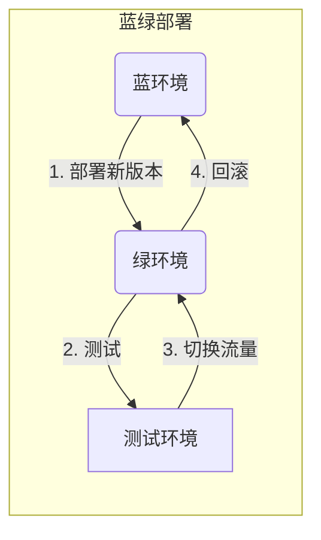

以下是《AI系统蓝绿部署原理与代码实战案例讲解》的正文内容:

# AI系统蓝绿部署原理与代码实战案例讲解

## 1. 背景介绍

### 1.1 问题的由来

在现代软件开发过程中,系统的可靠性和可用性是最为关键的指标之一。传统的单体应用程序部署方式存在许多问题,例如停机时间较长、回滚困难等,这在高并发、高可用的场景下是无法接受的。为了解决这些问题,蓝绿部署(Blue/Green Deployment)应运而生。

### 1.2 研究现状

蓝绿部署作为一种成熟的持续交付技术,已被广泛应用于各大互联网公司的系统部署实践中。它通过运行两个相同的生产环境,在其中一个环境中逐步推出新版本,大大降低了部署风险。与此同时,一些公司也在探索将蓝绿部署应用于AI系统的部署场景。

### 1.3 研究意义

AI系统通常由多个复杂的模型和组件组成,部署过程更加error-prone。蓝绿部署可以为AI系统的平滑升级提供保障,避免由于部署失败导致的服务中断。此外,蓝绿部署还能够实现AI模型的灰度发布,有助于评估新模型的性能表现。

### 1.4 本文结构

本文将从以下几个方面对AI系统蓝绿部署进行全面讲解:

1. 核心概念与联系
2. 核心算法原理与具体操作步骤
3. 数学模型和公式详细讲解与案例分析
4. 项目实践:代码实例和详细解释说明
5. 实际应用场景
6. 工具和资源推荐
7. 总结:未来发展趋势与挑战
8. 附录:常见问题与解答

## 2. 核心概念与联系

蓝绿部署的核心思想是运行两个相同的生产环境,称为蓝环境和绿环境。初始时,流量全部指向蓝环境。当有新版本需要发布时,先在绿环境中部署新版本,并进行充分的测试。测试通过后,将流量切换到绿环境,完成部署。如果出现问题,可以随时切换回蓝环境,实现快速回滚。



蓝绿部署可以应用于AI系统的模型部署过程中。将当前线上模型视为蓝环境,新模型视为绿环境。通过蓝绿部署,可以平滑地将新模型投入生产,同时具备快速回滚的能力。

此外,蓝绿部署与灰度发布(Canary Release)相结合,可以实现AI模型的分阶段发布。最初只将少量流量引入绿环境,待新模型表现良好后,再逐步增加绿环境的流量比例,直至完全切换到新模型。

## 3. 核心算法原理与具体操作步骤

### 3.1 算法原理概述

蓝绿部署算法的核心思想是通过两个相同的生产环境,实现无停机切换。算法流程如下:

1. 准备两个独立的生产环境(蓝绿环境)
2. 将流量全部引入蓝环境
3. 在绿环境部署新版本,并进行充分测试
4. 测试通过后,将流量切换到绿环境
5. 如果出现问题,快速回滚到蓝环境
6. 完成部署后,绿环境成为新的蓝环境

该算法确保了在任何时刻,至少有一个环境可以为用户提供服务,避免了传统部署方式可能导致的服务中断。

### 3.2 算法步骤详解

1. **准备蓝绿环境**

   首先需要准备两个独立的生产环境,确保它们的配置、资源等完全相同。这两个环境分别称为蓝环境和绿环境。

2. **流量引入蓝环境**

   初始时,所有用户流量都会被引入蓝环境。蓝环境运行着当前线上版本的系统。

3. **绿环境部署新版本**

   当有新版本需要发布时,将新版本部署到绿环境中。绿环境与蓝环境完全隔离,因此新版本的部署不会影响蓝环境的运行。

4. **新版本测试**

   在绿环境中对新版本进行全面的测试,包括功能测试、性能测试、压力测试等,确保新版本的质量。

5. **流量切换**

   测试通过后,将用户流量从蓝环境切换到绿环境。切换可以是全量切换,也可以是分批切换(灰度发布)。

6. **回滚机制**

   如果在切换流量后发现新版本存在问题,可以立即将流量切换回蓝环境,实现快速回滚。

7. **交换蓝绿环境**

   部署完成后,绿环境成为新的线上环境,即新的蓝环境。下一次部署时,角色将发生交换。

通过这一系列步骤,蓝绿部署算法实现了无停机部署,同时具备快速回滚的能力,大大降低了部署风险。

### 3.3 算法优缺点

**优点:**

1. **零停机时间**:蓝绿部署过程中,至少有一个环境为用户提供服务,避免了传统部署方式可能导致的服务中断。
2. **快速回滚**:如果新版本出现问题,可以立即切换回旧版本,降低了风险。
3. **版本隔离**:蓝绿环境相互隔离,新版本部署不会影响当前线上版本的运行。
4. **灰度发布**:通过分批切换流量,可以实现分阶段发布,更好地控制风险。

**缺点:**

1. **资源开销**:需要准备两套完全相同的生产环境,资源开销较大。
2. **配置一致性**:蓝绿环境需要保持完全一致的配置,否则可能导致意外情况。
3. **流量切换**:流量切换过程需要精心设计,避免出现连接中断等问题。

### 3.4 算法应用领域

蓝绿部署算法可以应用于以下场景:

- **Web应用部署**: 适用于对可用性和可靠性要求较高的Web应用程序部署。
- **微服务部署**: 微服务架构中,每个微服务都可以采用蓝绿部署策略。
- **AI模型部署**: 将AI模型视为应用程序,通过蓝绿部署实现平滑升级。
- **数据库迁移**: 在数据库迁移过程中,可以利用蓝绿部署避免停机时间。
- **基础设施升级**: 升级底层基础设施(如操作系统、中间件等)时,可以使用蓝绿部署策略。

## 4. 数学模型和公式详细讲解与举例说明

### 4.1 数学模型构建

在AI系统的蓝绿部署过程中,我们需要评估新旧模型的性能差异,以确定是否可以切换到新模型。这可以通过构建数学模型来实现。

假设我们有一个二分类问题,需要评估新旧模型在精确率(Precision)、召回率(Recall)和F1分数方面的表现。我们可以构建如下数学模型:

已知:
- $TP$ (True Positive): 正确预测为正例的数量
- $FP$ (False Positive): 错误预测为正例的数量
- $FN$ (False Negative): 错误预测为负例的数量

精确率(Precision)定义为:

$$Precision = \frac{TP}{TP + FP}$$

召回率(Recall)定义为:

$$Recall = \frac{TP}{TP + FN}$$

F1分数是精确率和召回率的加权调和平均数,定义为:

$$F1 = 2 \times \frac{Precision \times Recall}{Precision + Recall}$$

通过计算新旧模型在这些指标上的值,我们可以对比它们的性能表现。

### 4.2 公式推导过程

我们来推导一下F1分数的公式:

首先,调和平均数的一般形式为:

$$H_n = \frac{n}{\frac{1}{x_1} + \frac{1}{x_2} + \cdots + \frac{1}{x_n}}$$

其中,n为加权系数之和。

当n=2时,我们得到:

$$H_2 = \frac{2}{\frac{1}{x_1} + \frac{1}{x_2}}$$

将精确率(Precision)和召回率(Recall)代入,可得:

$$F1 = \frac{2}{\frac{1}{Precision} + \frac{1}{Recall}}$$

进一步化简:

$$F1 = \frac{2 \times Precision \times Recall}{Precision + Recall}$$

这就是F1分数的推导过程。

### 4.3 案例分析与讲解

假设我们有一个图像分类模型,需要对猫和狗进行分类。我们将旧模型(蓝环境)和新模型(绿环境)在测试集上的表现进行对比:

**旧模型(蓝环境):**
- $TP = 80$
- $FP = 15$
- $FN = 20$

**新模型(绿环境):**
- $TP = 85$
- $FP = 10$
- $FN = 15$

我们可以计算出两个模型的精确率、召回率和F1分数:

**旧模型:**
- $Precision = \frac{80}{80 + 15} = 0.842$
- $Recall = \frac{80}{80 + 20} = 0.800$
- $F1 = 2 \times \frac{0.842 \times 0.800}{0.842 + 0.800} = 0.821$

**新模型:**
- $Precision = \frac{85}{85 + 10} = 0.895$
- $Recall = \frac{85}{85 + 15} = 0.850$
- $F1 = 2 \times \frac{0.895 \times 0.850}{0.895 + 0.850} = 0.872$

从结果可以看出,新模型在精确率、召回率和F1分数上都略高于旧模型,因此我们可以将流量切换到新模型。

### 4.4 常见问题解答

**Q: 为什么需要使用F1分数,而不是直接使用精确率或召回率?**

A: 精确率和召回率是评估二分类模型性能的两个重要指标,但它们之间存在一定的权衡(trade-off)关系。过于追求精确率,可能会导致召回率下降;反之亦然。F1分数通过加权调和平均的方式,综合考虑了精确率和召回率,能够更全面地评估模型性能。

**Q: 如何确定何时切换到新模型?**

A:切换到新模型的决策需要综合考虑多个因素,包括精确率、召回率、F1分数等指标,以及新模型在其他方面(如性能、资源消耗等)的表现。通常情况下,如果新模型在关键指标上表现优于旧模型,且其他方面也符合预期,就可以切换到新模型。具体的切换策略需要根据实际情况制定。

**Q: 在切换流量时,是一次性切换还是分批切换?**

A:这取决于具体的场景和需求。一次性切换流量的风险较大,但实施较为简单。分批切换流量(灰度发布)的风险较小,但实施较为复杂。通常建议先将少量流量(如5%~10%)切换到新模型,观察一段时间后再逐步增加流量比例,直至完全切换到新模型。

## 5. 项目实践:代码实例和详细解释说明

### 5.1 开发环境搭建

在开始编码之前,我们需要准备好开发环境。本示例使用Python作为编程语言,使用Flask Web框架构建一个简单的Web应用,并使用Docker容器进行部署。

1. **安装Python和依赖库**

   ```bash
   # 安装Python 3.8
   brew install python@3.8

   # 安装依赖库
   pip3 install flask
   ```

2. **安装Docker**

   请根据您的操作系统,从官方网站下载并安装Docker。

3. **克隆代码仓库**

   ```bash
   git clone https://github.com/example/