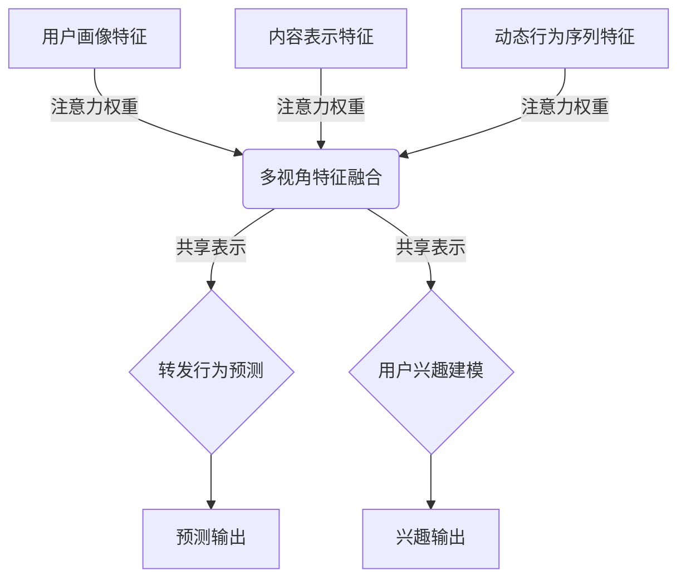

好的,我会按照您提供的要求和结构,尽最大努力撰写这篇技术博客文章。

# 预测微博用户的转发行为

## 1. 背景介绍

### 1.1 问题的由来

在当今社交媒体时代,微博已成为人们获取信息、表达观点和分享生活的重要平台。微博上每天都有大量的信息在流传,其中一部分内容会被用户转发,从而在网络中快速扩散。预测用户的转发行为对于理解信息在社交网络中的传播规律、优化信息推荐系统、开展精准营销等具有重要意义。

### 1.2 研究现状

用户转发行为的预测一直是社交网络分析的热点研究课题。早期的研究主要集中在基于内容特征、用户关系特征等传统特征的预测模型上。随着深度学习技术的发展,越来越多的研究开始尝试将深度神经网络应用于用户转发行为预测中,取得了不错的效果。

然而,现有的方法还存在一些不足之处:

1. 大多数模型只考虑了单一的用户或内容特征,未能充分挖掘用户-内容的复杂关联关系。
2. 现有模型主要关注静态特征,忽视了动态行为序列对预测的重要性。
3. 现有模型通常将转发行为简单地当作二元分类问题,未能捕捉转发行为的细微差异。

### 1.3 研究意义

准确预测微博用户的转发行为不仅有助于更好地理解信息在社交网络中的传播规律,还可以为个性化信息推荐、精准营销等应用提供有力支撑。本文旨在设计一种新颖的深度学习模型,充分融合用户、内容和动态行为序列等多源异构信息,全面捕捉用户转发行为的复杂语义,从而提高预测的准确性和解释性。

### 1.4 本文结构

本文的其余部分安排如下:第2部分介绍相关的核心概念;第3部分详细阐述所提出模型的原理和算法步骤;第4部分构建数学模型并推导公式;第5部分给出项目实践中的代码实例;第6部分探讨实际应用场景;第7部分推荐相关工具和资源;第8部分总结研究成果并展望未来;第9部分列出常见问题解答。

## 2. 核心概念与联系

预测微博用户转发行为涉及以下几个核心概念:

1. **用户画像(User Profiling)**:构建用户的静态属性和动态行为特征,全面刻画用户兴趣和偏好。

2. **内容表示(Content Representation)**:将微博文本等非结构化内容映射为低维稠密向量表示,捕获语义信息。

3. **用户-内容关联(User-Content Interaction)**:建模用户与内容之间的复杂关联关系,是行为预测的关键。

4. **动态行为序列(Sequential Behavior Modeling)**:捕捉用户历史行为的时序依赖性,有助于更好地预测未来行为。

5. **注意力机制(Attention Mechanism)**:自动分配不同特征的权重,突出对预测任务更重要的部分信息。

6. **多任务学习(Multi-Task Learning)**:联合优化多个相关任务,提高模型的泛化能力。

这些概念相互关联、相辅相成,共同构建了预测微博用户转发行为的理论基础和技术路线。

## 3. 核心算法原理与具体操作步骤

### 3.1 算法原理概述

为了全面捕捉用户转发行为的复杂语义,我们提出了一种基于多视角注意力融合的深度学习模型MAFM(Multi-view Attentive Fusion Model)。该模型的核心思想是:

1. 从用户画像、内容表示和动态行为序列三个视角构建多源异构特征;

2. 使用注意力机制自适应地学习不同视角特征的重要程度;

3. 将加权融合的多视角特征输入到共享表示层,获得统一的用户-内容交互表示;

4. 基于交互表示同时优化转发行为预测和用户兴趣建模两个相关任务。

通过多视角特征融合和多任务学习,MAFM能够充分挖掘异构信息之间的内在关联,全面刻画用户转发行为的语义,从而提高预测的准确性。

### 3.2 算法步骤详解

MAFM算法的具体步骤如下:

1. **特征构建**
    - 用户画像特征:包括用户的静态属性(如年龄、性别等)和动态行为特征(如关注数、被转发数等)
    - 内容表示特征:使用BERT等预训练语言模型对微博文本进行编码,获取句子级语义向量表示
    - 动态行为序列特征:将用户最近N次转发/未转发行为按时间顺序编码为序列

2. **多视角注意力融合**
    - 对每个视角的特征使用自注意力机制,自动学习特征内部的重要程度
    - 使用跨视角注意力机制,自适应地分配不同视角特征的权重
    - 将加权融合的多视角特征输入到共享表示层,获得统一的用户-内容交互表示

3. **多任务联合学习**
    - 以交互表示为输入,同时优化转发行为预测和用户兴趣建模两个任务
    - 转发行为预测:二分类或多分类,预测用户是否/程度转发该微博
    - 用户兴趣建模:多标签分类,预测用户感兴趣的微博主题类别

4. **模型训练与预测**
    - 端到端的多任务联合训练,以最小化两个任务的损失函数之和
    - 在测试阶段,只需输出转发行为预测分支的结果作为最终预测

### 3.3 算法优缺点

**优点**:

- 融合多视角异构特征,全面刻画用户转发行为的复杂语义
- 注意力机制自动分配特征权重,提高模型解释性
- 多任务学习提高了模型的泛化能力,降低了过拟合风险
- 端到端的联合训练框架,无需人工特征工程

**缺点**:

- 模型结构相对复杂,需要大量标注数据进行有效训练
- 需要对多个视角特征进行特征工程,存在一定的工程开销
- 多任务学习可能引入一些噪声,影响主任务的性能
- 模型推理时间可能较长,不利于实时预测场景

### 3.4 算法应用领域

MAFM算法不仅可以应用于预测微博用户的转发行为,还可以推广到其他社交网络场景,如:

- 预测用户点赞、评论等互动行为
- 推荐感兴趣的好友、主题等
- 检测虚假信息的传播路径
- 分析热点事件的网络舆情走向
- 识别网络水军等恶意行为

总的来说,MAFM算法为深入理解复杂的用户行为、优化社交网络体验和维护网络生态秩序提供了有力工具。

## 4. 数学模型和公式详细讲解举例说明

### 4.1 数学模型构建

我们将预测用户转发行为的问题建模为一个基于多视角特征融合的多任务学习问题。给定用户$u$、微博内容$c$和用户最近$N$次转发/未转发行为序列$S_u^N$,目标是同时预测用户对该微博的转发行为$y_r$和用户对该微博主题的兴趣$y_i$。

我们将输入特征划分为三个视角:用户画像视角$\boldsymbol{x}_u$、内容表示视角$\boldsymbol{x}_c$和动态行为序列视角$\boldsymbol{x}_s$。每个视角的特征经过对应的编码器网络后,得到视角特征表示$\boldsymbol{h}_u$、$\boldsymbol{h}_c$和$\boldsymbol{h}_s$。

接下来,我们使用注意力机制对多视角特征进行加权融合:

$$\boldsymbol{z} = \sum_{v\in\{u,c,s\}}\alpha_v\boldsymbol{h}_v$$

其中$\alpha_v$是视角$v$的注意力权重,表示该视角对预测任务的重要程度。权重由注意力机制根据视角特征自适应地学习获得。

融合后的特征表示$\boldsymbol{z}$被输入到共享表示层,获得统一的用户-内容交互表示$\boldsymbol{r}$。然后,我们以$\boldsymbol{r}$为输入,同时优化转发行为预测任务和用户兴趣建模任务:

$$\hat{y}_r = \sigma(\boldsymbol{w}_r^T\boldsymbol{r} + b_r)$$
$$\hat{y}_i = \sigma(\boldsymbol{W}_i^T\boldsymbol{r} + \boldsymbol{b}_i)$$

其中$\hat{y}_r$和$\hat{y}_i$分别是两个任务的预测输出,$\sigma$是激活函数(如Sigmoid),$\boldsymbol{w}_r,\boldsymbol{b}_r,\boldsymbol{W}_i,\boldsymbol{b}_i$是对应的权重和偏置参数。

在训练阶段,我们最小化两个任务的加权损失函数之和:

$$\mathcal{L} = \lambda\mathcal{L}_r + (1-\lambda)\mathcal{L}_i$$

其中$\mathcal{L}_r$和$\mathcal{L}_i$分别是转发行为预测任务和用户兴趣建模任务的损失函数(如交叉熵损失),$\lambda$是任务权重系数。通过端到端的多任务联合训练,MAFM模型可以同时优化两个相关任务,提高泛化能力和预测性能。

### 4.2 公式推导过程

我们以注意力机制的公式推导为例,说明模型中关键公式的推导过程。

假设有$M$个视角特征$\{\boldsymbol{h}_1,\boldsymbol{h}_2,...,\boldsymbol{h}_M\}$,我们希望学习每个视角的权重$\alpha_i$,使得加权融合后的特征表示$\boldsymbol{z}$对预测任务最为有利。

首先,我们定义一个上下文向量$\boldsymbol{u}$,用于计算每个视角特征与上下文的相关性得分:

$$\boldsymbol{u}^T\boldsymbol{h}_i = \mathrm{score}(\boldsymbol{u},\boldsymbol{h}_i)$$

然后,使用Softmax函数将所有视角的得分归一化为概率分布:

$$\alpha_i = \frac{\exp(\boldsymbol{u}^T\boldsymbol{h}_i)}{\sum_{j=1}^M\exp(\boldsymbol{u}^T\boldsymbol{h}_j)}$$

最终,加权融合所有视角特征即可获得表示$\boldsymbol{z}$:

$$\boldsymbol{z} = \sum_{i=1}^M\alpha_i\boldsymbol{h}_i$$

在实际应用中,上下文向量$\boldsymbol{u}$通常由一个单层前馈神经网络产生,其权重矩阵$\boldsymbol{W}_a$和偏置项$\boldsymbol{b}_a$可以在模型训练过程中被学习,即:

$$\boldsymbol{u} = \tanh(\boldsymbol{W}_a\cdot\boldsymbol{h} + \boldsymbol{b}_a)$$

其中$\boldsymbol{h}$是所有视角特征的拼接。通过端到端的训练,模型可以自动学习合适的注意力权重分配,从而获得最优的多视角特征融合表示。

### 4.3 案例分析与讲解

为了更好地理解MAFM模型的工作原理,我们给出一个具体案例进行分析和讲解。

假设有一条热门微博:"北京今日出现罕见雷阵雨天气,局地遭遇冰雹袭击"。我们的目标是预测某位用户小明是否