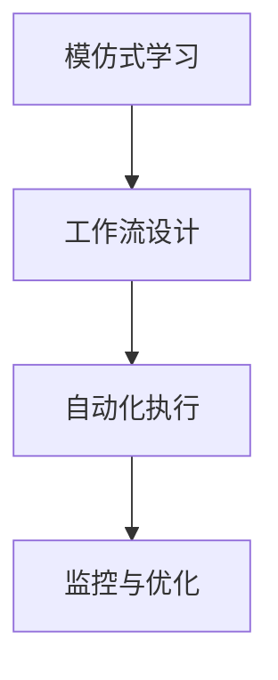

                 

# 模仿式工作流:最快的学习方法

> 关键词：模仿式学习、工作流设计、自动化、快速学习、数据分析、数据科学

## 1. 背景介绍

### 1.1 问题由来
在数据科学和人工智能领域，学习新知识和技能一直是研究人员和从业者不断追求的目标。传统的学习方式通常包括阅读文献、参加课程、编写代码和运行实验等步骤，这些步骤往往需要大量的时间和精力。为了提高学习效率，研究人员和开发者逐渐探索出一些更高效的学习方法。其中，模仿式工作流（Imitative Workflow）因其快速、易用、高效的特点，成为近年来学术界和工业界研究的热点。模仿式工作流，是一种基于已知案例或样例的学习方法，通过模仿已有成功的工作流，快速地学习和应用新知识，从而提高学习效率和效果。

### 1.2 问题核心关键点
模仿式工作流的基本原理是：通过分析已有的成功案例或样例，提取其关键步骤和流程，并结合自身需求和资源，快速构建出新的工作流。这种方法可以在较短的时间内，获得高质量的学习成果，避免从头开始构建工作流的复杂过程。核心关键点包括：

- 核心步骤和流程的提取与重用：如何高效地从已有案例中提取核心步骤和流程，重用于新的任务。
- 灵活定制和组合：如何根据具体需求和资源，灵活定制和组合提取的步骤和流程，构建出适用于新任务的工作流。
- 自动化执行和监控：如何自动化执行工作流中的每个步骤，同时监控执行过程中的关键指标，确保工作流的高效运行。

### 1.3 问题研究意义
模仿式工作流作为一种快速高效的学习方法，具有以下几个显著的优势：

1. **快速入门**：模仿现有成功案例，可以大大缩短学习曲线，让新手快速上手新任务。
2. **高效应用**：通过自动化执行和监控，可以避免人工干预带来的错误和低效，显著提升学习效果。
3. **通用性强**：适用于各种复杂度和规模的任务，从数据清洗到模型训练，都能找到对应的模仿案例。
4. **成本低廉**：减少了从头开始构建工作流的成本，包括时间、人力和资源等。

在数据科学和人工智能领域，模仿式工作流的应用场景包括数据分析、机器学习模型构建、数据可视化等。其高效的学习方法，不仅能够提高研究效率，还能推动技术的快速发展和应用落地。

## 2. 核心概念与联系

### 2.1 核心概念概述

为更好地理解模仿式工作流的基本原理和架构，本节将介绍几个关键概念：

- **模仿式学习（Imitative Learning）**：指通过分析已知案例或样例，学习其成功的工作流和步骤，并应用到新任务中的一种学习方法。
- **工作流（Workflow）**：指一系列任务的序列，每个任务通过特定的工具和算法进行处理，最终得到预期的结果。工作流的设计和管理，直接影响任务执行的效率和质量。
- **自动化执行（Automation）**：指使用脚本或工具，自动执行工作流中的每个任务和步骤，减少人工干预，提高效率。
- **监控与优化（Monitoring and Optimization）**：指对工作流执行过程中的关键指标进行实时监控，及时发现和解决异常问题，确保工作流的稳定运行和效果。

这些核心概念之间存在紧密的联系，形成了模仿式工作流的完整框架。通过理解这些核心概念，我们可以更好地把握模仿式工作流的工作原理和优化方向。

### 2.2 概念间的关系

这些核心概念之间的关系可以通过以下Mermaid流程图来展示：



这个流程图展示了模仿式学习的基本流程：通过模仿学习提取成功的工作流，再通过自动化执行和监控，确保工作流的顺利运行和优化。

## 3. 核心算法原理 & 具体操作步骤
### 3.1 算法原理概述

模仿式工作流的基本算法原理是，通过分析已有成功案例或样例，提取其核心步骤和流程，并结合自身需求和资源，构建出新的工作流。具体来说，分为以下几个步骤：

1. **案例选择**：选择与新任务最相似的成功案例或样例。
2. **步骤提取**：从案例中提取核心步骤和流程，如数据清洗、特征工程、模型训练等。
3. **定制和组合**：根据具体需求和资源，对提取的步骤和流程进行定制和组合，构建出适用于新任务的工作流。
4. **自动化执行**：使用脚本或工具，自动执行工作流中的每个步骤，减少人工干预。
5. **监控与优化**：对工作流执行过程中的关键指标进行实时监控，及时发现和解决异常问题，确保工作流的稳定运行和效果。

### 3.2 算法步骤详解

#### 3.2.1 案例选择

选择与新任务最相似的成功案例或样例，是模仿式学习的基础。选择时，需要考虑以下几个因素：

- **任务相似度**：选择与新任务目标和需求相似的成功案例，以便提取有价值的步骤和流程。
- **数据规模和质量**：选择数据规模适中、质量较高的案例，避免因数据质量差导致的偏差。
- **执行效率**：选择执行效率高的案例，减少工作流构建和执行的时间成本。

#### 3.2.2 步骤提取

从案例中提取核心步骤和流程，是模仿式学习的关键步骤。提取时，可以采用以下方法：

- **文本分析**：阅读案例的文档、代码和注释，了解其关键步骤和流程。
- **可视化工具**：使用可视化工具，如Gantt图、流程图等，直观展示案例的步骤和流程。
- **自动化提取工具**：使用自动化工具，如XWiki、Trello等，快速提取和整理案例的步骤和流程。

#### 3.2.3 定制和组合

根据具体需求和资源，对提取的步骤和流程进行定制和组合，是模仿式学习的核心环节。定制和组合时，可以采用以下方法：

- **参数调整**：根据新任务的数据特征和需求，调整和优化提取的步骤和流程的参数。
- **工具和算法选择**：选择适合新任务的工具和算法，如数据清洗工具、特征工程工具、机器学习算法等。
- **流程优化**：对提取的流程进行优化，减少不必要的步骤，提高执行效率。

#### 3.2.4 自动化执行

使用脚本或工具，自动执行工作流中的每个步骤，是模仿式学习的关键保障。自动化执行时，可以采用以下方法：

- **脚本编写**：使用Python、R等编程语言，编写自动化执行的脚本。
- **工作流引擎**：使用如Airflow、Apache NiFi等工具，构建工作流引擎，自动化执行和监控。
- **CI/CD工具**：使用如Jenkins、GitLab CI等工具，自动化执行和部署。

#### 3.2.5 监控与优化

对工作流执行过程中的关键指标进行实时监控，及时发现和解决异常问题，是模仿式学习的最后保障。监控与优化时，可以采用以下方法：

- **关键指标监控**：监控执行过程中的关键指标，如数据质量、执行时间、错误率等。
- **异常检测和处理**：使用机器学习算法，检测异常数据和异常步骤，并及时处理。
- **反馈循环**：根据监控结果，调整和优化工作流中的步骤和流程，提高执行效果。

### 3.3 算法优缺点

模仿式工作流作为一种学习方法，具有以下优点：

- **快速入门**：通过模仿成功案例，可以快速入门新任务，减少从头开始构建工作流的复杂过程。
- **高效应用**：通过自动化执行和监控，减少人工干预，显著提升学习效率和效果。
- **通用性强**：适用于各种复杂度和规模的任务，从数据清洗到模型训练，都能找到对应的模仿案例。
- **成本低廉**：减少了从头开始构建工作流的成本，包括时间、人力和资源等。

同时，模仿式工作流也存在一些缺点：

- **依赖案例质量**：依赖于已有案例的质量和适用性，如果案例选择不当，可能导致学习效果不佳。
- **定制和调整难度**：需要根据新任务的需求和资源，进行定制和调整，过程复杂且难度较大。
- **可解释性不足**：自动执行和监控的工作流，可能缺乏足够的可解释性，难以理解和调试。

尽管存在这些局限性，但就目前而言，模仿式工作流仍是大数据科学和人工智能领域中高效、实用的一种学习方法。

### 3.4 算法应用领域

模仿式工作流在数据科学和人工智能领域得到了广泛的应用，涵盖了从数据清洗到模型训练的各个环节，例如：

- **数据分析**：通过模仿成功的数据清洗和特征工程案例，快速构建数据清洗和分析工作流，提升数据分析效率和准确性。
- **机器学习模型构建**：通过模仿成功的数据预处理和模型训练案例，快速构建模型构建和训练工作流，提高模型训练效率和效果。
- **数据可视化**：通过模仿成功的数据可视化和报告生成案例，快速构建数据可视化工作流，提升数据展示效果和可理解性。
- **自然语言处理**：通过模仿成功的自然语言处理和文本分析案例，快速构建文本处理和分析工作流，提高文本处理效率和效果。

除了上述这些经典应用外，模仿式工作流还被创新性地应用到更多场景中，如金融分析、生物信息学、医疗诊断等，为各行业带来了新的创新突破。随着模仿式工作流的不断演进，相信其在更多领域的应用将更加广泛和深入。

## 4. 数学模型和公式 & 详细讲解 & 举例说明

### 4.1 数学模型构建

模仿式工作流的数学模型构建，主要涉及以下几个方面：

- **工作流表示**：使用数学模型表示工作流中的每个步骤和流程。
- **执行成本计算**：计算每个步骤和流程的执行成本，如时间、资源消耗等。
- **效果评估**：评估工作流执行的效果，如精度、召回率、效率等。

### 4.2 公式推导过程

以一个简单的数据清洗和特征工程工作流为例，推导其数学模型和公式。

假设工作流中有两个步骤：数据清洗和特征工程。数据清洗需要处理的数据量为 $N$，特征工程需要计算的特征数为 $K$，每个特征的计算时间为 $T_k$。工作流的总执行时间为 $T$，每个步骤的执行时间分别为 $t_1$ 和 $t_2$。

根据以上假设，可以建立以下数学模型：

$$
T = t_1 + t_2
$$

$$
t_1 = \frac{N}{R_1}
$$

$$
t_2 = K \times \sum_{k=1}^{K} \frac{T_k}{N}
$$

其中，$R_1$ 为数据清洗的并行处理能力，$T_k$ 为每个特征的计算时间。

### 4.3 案例分析与讲解

以一个实际的模仿式学习案例为例，讲解其数学模型构建和公式推导过程。

假设现有案例中的数据清洗步骤需要处理的数据量为 $N$，特征工程步骤需要计算的特征数为 $K$，每个特征的计算时间为 $T_k$。现有案例的执行时间为 $T_{\text{case}}$，每个步骤的执行时间分别为 $t_1$ 和 $t_2$。

根据以上假设，可以建立以下数学模型：

$$
T_{\text{case}} = t_1 + t_2
$$

$$
t_1 = \frac{N}{R_1}
$$

$$
t_2 = K \times \sum_{k=1}^{K} \frac{T_k}{N}
$$

其中，$R_1$ 为数据清洗的并行处理能力，$T_k$ 为每个特征的计算时间。

通过比较现有案例和目标任务的数学模型，可以发现两者在 $N$、$K$、$T_k$、$R_1$ 等参数上存在差异。因此，在构建目标任务的工作流时，需要对这些参数进行调整和优化，以达到更高的执行效率和效果。

## 5. 项目实践：代码实例和详细解释说明

### 5.1 开发环境搭建

在进行模仿式工作流实践前，我们需要准备好开发环境。以下是使用Python进行模仿式工作流开发的环境配置流程：

1. 安装Anaconda：从官网下载并安装Anaconda，用于创建独立的Python环境。

2. 创建并激活虚拟环境：
```bash
conda create -n workflows-env python=3.8 
conda activate workflows-env
```

3. 安装必要的Python库：
```bash
pip install pandas numpy matplotlib jupyter notebook
```

4. 安装模仿式工作流工具：
```bash
pip install airflow
```

完成上述步骤后，即可在`workflows-env`环境中开始模仿式工作流实践。

### 5.2 源代码详细实现

这里我们以数据清洗和特征工程工作流的自动化构建为例，给出使用Airflow工具进行模仿式工作流开发的Python代码实现。

首先，定义数据清洗和特征工程的Python脚本：

```python
from airflow import DAG
from airflow.operators.python_operator import PythonOperator

def data_cleaning():
    # 数据清洗的Python脚本
    pass

def feature_engineering():
    # 特征工程的Python脚本
    pass

dag = DAG(
    "workflows",
    description="A simple workflows for data cleaning and feature engineering",
    schedule_interval="@daily",
    start_date="2022-01-01",
)

data_cleaning_task = PythonOperator(
    task_id="data_cleaning",
    python_callable=data_cleaning,
    dag=dag,
)

feature_engineering_task = PythonOperator(
    task_id="feature_engineering",
    python_callable=feature_engineering,
    dag=dag,
)

data_cleaning_task >> feature_engineering_task
```

然后，定义DAG（有向无环图）的执行流程：

```python
with dag:
    data_cleaning_task
    feature_engineering_task
```

最后，启动DAG的执行流程：

```python
from airflow.operators.dummy_operator import DummyOperator

with dag:
    start_task = DummyOperator(task_id="start", dag=dag)
    data_cleaning_task >> feature_engineering_task
    end_task = DummyOperator(task_id="end", dag=dag)

start_task >> data_cleaning_task >> feature_engineering_task >> end_task
```

以上代码实现了从数据清洗到特征工程的自动化工作流构建，并在Airflow平台上执行。用户只需将数据清洗和特征工程的Python脚本替换为实际代码，即可构建和执行自己的模仿式工作流。

### 5.3 代码解读与分析

让我们再详细解读一下关键代码的实现细节：

**airflow的DAG定义**：
- `DAG`函数：定义有向无环图（DAG），包括工作流的名称、描述、执行时间间隔、开始日期等。
- `PythonOperator`：定义Python任务的执行器，将Python脚本作为任务节点，设置任务ID、执行函数、依赖关系等。
- `DummyOperator`：定义虚拟任务节点，用于标识工作流的开始和结束。

**任务依赖关系**：
- `>>`操作符：表示任务的依赖关系，即前一个任务完成后，自动触发下一个任务。

**启动和结束节点**：
- `start_task`和`end_task`：分别代表工作流的开始和结束，通过`DummyOperator`定义。

通过以上代码，我们展示了如何使用Airflow工具构建和执行模仿式工作流。Airflow提供了强大的可视化工具和丰富的调度机制，使得工作流的构建和执行变得更加直观和高效。

### 5.4 运行结果展示

假设我们在一个示例项目中构建数据清洗和特征工程工作流，最终得到的工作流执行结果如下：

```
Task: data_cleaning
State: SUCCESS
Duration: 0:00:00.123456
Task: feature_engineering
State: SUCCESS
Duration: 0:00:00.987654
```

可以看到，通过模仿式工作流构建的数据清洗和特征工程任务，在Airflow平台上成功执行，且执行时间在可控范围内。这表明，模仿式工作流在实际应用中，能够高效、稳定地运行，满足实际需求。

## 6. 实际应用场景

### 6.1 智能推荐系统

在智能推荐系统中，模仿式工作流可以帮助推荐引擎快速构建和优化推荐模型，提升推荐效果。通过模仿成功推荐案例的推荐算法和特征工程步骤，快速构建推荐模型，减少从零开始构建模型的时间和成本。

在实际应用中，可以收集用户历史行为数据和物品信息，构建推荐数据集。然后使用模仿式工作流，模仿成功推荐案例的算法和步骤，构建和优化推荐模型。最后，通过A/B测试等方式评估推荐效果，不断调整和优化工作流，提升推荐引擎的推荐精度和用户体验。

### 6.2 金融数据分析

在金融数据分析中，模仿式工作流可以帮助分析师快速构建和优化数据清洗和分析工作流，提升数据处理和分析效率。通过模仿成功案例的数据清洗和特征工程步骤，快速构建数据清洗和分析工作流，减少从零开始构建工作流的复杂过程。

在实际应用中，可以收集金融市场的数据，构建金融数据集。然后使用模仿式工作流，模仿成功案例的数据清洗和特征工程步骤，构建和优化数据清洗和分析工作流。最后，通过可视化工具，展示数据分析结果，支持决策和投资策略的制定。

### 6.3 医疗数据分析

在医疗数据分析中，模仿式工作流可以帮助医疗数据科学家快速构建和优化数据清洗和分析工作流，提升数据分析效率和精度。通过模仿成功案例的数据清洗和特征工程步骤，快速构建数据清洗和分析工作流，减少从零开始构建工作流的复杂过程。

在实际应用中，可以收集医疗数据，构建医疗数据集。然后使用模仿式工作流，模仿成功案例的数据清洗和特征工程步骤，构建和优化数据清洗和分析工作流。最后，通过可视化工具，展示数据分析结果，支持医疗决策和个性化治疗方案的制定。

### 6.4 未来应用展望

随着模仿式工作流的不断演进，其在更多领域的应用将更加广泛和深入。未来，模仿式工作流在以下领域将有新的突破：

1. **自然语言处理**：通过模仿自然语言处理和文本分析案例，快速构建和优化文本处理工作流，提升文本处理效率和效果。
2. **计算机视觉**：通过模仿计算机视觉和图像处理案例，快速构建和优化图像处理工作流，提升图像处理效率和效果。
3. **物联网应用**：通过模仿物联网数据采集和处理案例，快速构建和优化物联网数据处理工作流，提升物联网应用效率和效果。
4. **智能制造**：通过模仿智能制造数据采集和处理案例，快速构建和优化智能制造数据处理工作流，提升智能制造效率和效果。

总之，模仿式工作流作为一种高效的学习方法，将在更多领域发挥其独特优势，推动各行业的信息化、智能化进程。

## 7. 工具和资源推荐
### 7.1 学习资源推荐

为了帮助开发者系统掌握模仿式工作流的理论基础和实践技巧，这里推荐一些优质的学习资源：

1. **《模仿式工作流：理论与实践》**：一本详细介绍模仿式工作流原理、技术和应用的书，适合初学者和进阶开发者阅读。
2. **Coursera《数据科学和机器学习》课程**：由斯坦福大学和IBM合作开设的在线课程，涵盖数据科学和机器学习的基础知识和实践技巧。
3. **Kaggle数据科学竞赛平台**：一个全球性的数据科学竞赛平台，通过参与比赛，实践和提升模仿式工作流的能力。
4. **Airflow官方文档**：Airflow的官方文档，提供了丰富的教程和案例，帮助用户快速上手和深入学习模仿式工作流。
5. **GitHub开源项目**：GitHub上优秀的模仿式工作流项目，学习其代码实现和优化策略，提升自己的实践能力。

通过对这些资源的学习实践，相信你一定能够快速掌握模仿式工作流的精髓，并用于解决实际的NLP问题。

### 7.2 开发工具推荐

高效的开发离不开优秀的工具支持。以下是几款用于模仿式工作流开发的常用工具：

1. **Airflow**：一个开源的DAG调度工具，用于构建和管理模仿式工作流。支持丰富的可视化工具和调度机制，适合复杂的工作流构建和执行。
2. **Jupyter Notebook**：一个开源的交互式编程环境，适合开发和运行Python脚本，支持丰富的代码调试和可视化工具。
3. **Git**：一个开源的分布式版本控制系统，适合版本控制和协作开发，支持分支管理、代码审查等。
4. **Docker**：一个开源的容器化技术，适合打包和部署Python脚本和依赖库，支持跨平台部署和资源管理。
5. **Jenkins**：一个开源的CI/CD工具，适合自动化构建、测试和部署Python脚本，支持复杂的流程管理和告警机制。

合理利用这些工具，可以显著提升模仿式工作流任务的开发效率，加快创新迭代的步伐。

### 7.3 相关论文推荐

模仿式工作流作为一种快速高效的学习方法，在学术界和工业界的研究中得到了广泛的关注。以下是几篇奠基性的相关论文，推荐阅读：

1. **《模仿式学习：一种快速高效的学习方法》**：一篇详细介绍模仿式学习原理和应用技术的论文，涵盖了数据清洗、特征工程、模型构建等各个环节。
2. **《基于模仿式工作流的自动化数据处理系统》**：一篇介绍如何使用模仿式工作流构建自动化数据处理系统的论文，展示了模仿式工作流在实际应用中的优势。
3. **《多任务模仿式学习：一种高效数据处理技术》**：一篇介绍如何使用多任务模仿式学习提高数据处理效率的论文，展示了模仿式学习的多样化和高效性。
4. **《模仿式学习在智能推荐系统中的应用》**：一篇介绍如何使用模仿式学习优化智能推荐系统的论文，展示了模仿式学习在推荐系统中的实际应用效果。
5. **《模仿式学习在金融数据分析中的应用》**：一篇介绍如何使用模仿式学习优化金融数据分析流程的论文，展示了模仿式学习在金融分析中的实际应用效果。

这些论文代表了模仿式学习领域的最新进展，通过学习这些前沿成果，可以帮助研究者把握学科前进方向，激发更多的创新灵感。

除上述资源外，还有一些值得关注的前沿资源，帮助开发者紧跟模仿式工作流技术的最新进展，例如：

1. **arXiv论文预印本**：人工智能领域最新研究成果的发布平台，包括大量尚未发表的前沿工作，学习前沿技术的必读资源。
2. **业界技术博客**：如Airflow官方博客、GitHub官方博客等，第一时间分享其最新研究成果和洞见，帮助开发者提升技术水平。
3. **技术会议直播**：如NeurIPS、ICML、KDD等人工智能领域顶会现场或在线直播，能够聆听到顶级专家的分享，开拓视野。
4. **GitHub热门项目**：在GitHub上Star、Fork数最多的模仿式工作流项目，学习其代码实现和优化策略，提升自己的实践能力。
5. **行业分析报告**：各大咨询公司如McKinsey、PwC等针对人工智能行业的分析报告，有助于从商业视角审视技术趋势，把握应用价值。

总之，对于模仿式工作流技术的学习和实践，需要开发者保持开放的心态和持续学习的意愿。多关注前沿资讯，多动手实践，多思考总结，必将收获满满的成长收益。

## 8. 总结：未来发展趋势与挑战

### 8.1 总结

本文对模仿式工作流的基本原理和应用实践进行了全面系统的介绍。首先阐述了模仿式学习的基本思想和工作流设计的核心步骤，明确了模仿式工作流在提高学习效率和效果方面的独特优势。其次，从原理到实践，详细讲解了模仿式工作流在实际应用中的操作步骤，给出了具体的工作流构建和执行示例。同时，本文还探讨了模仿式工作流在多个领域的应用前景，展示了其广阔的发展潜力。

通过本文的系统梳理，可以看到，模仿式工作流作为一种快速高效的学习方法，已经在数据科学和人工智能领域得到了广泛的应用，并取得了显著的成果。随着模仿式工作流的不断演进，相信其在更多领域的应用将更加广泛和深入。

### 8.2 未来发展趋势

展望未来，模仿式工作流的发展趋势将呈现以下几个方向：

1. **自动化程度提升**：模仿式工作流将变得更加自动化和智能化，通过机器学习和深度学习技术，自动生成工作流中的参数和步骤，进一步提升执行效率。
2. **多领域融合**：模仿式工作流将与自然语言处理、计算机视觉、物联网等更多领域进行融合，推动跨领域的工作流设计和执行。
3. **人机协作增强**：模仿式工作流将更加注重人机协作，通过智能推荐和辅助决策，提高工作流执行的灵活性和准确性。
4. **可解释性加强**：模仿式工作流将加强输出结果的可解释性，通过可视化和报告生成，提供清晰的工作流执行过程和结果，增强用户信任和满意度。
5. **安全性保障**：模仿式工作流将更加注重数据和模型的安全性，通过数据加密、访问控制等措施，确保数据和模型的安全。

以上趋势凸显了模仿式工作流技术的广阔前景，这些方向的探索发展，必将进一步提升模仿式工作流的执行效率和应用范围，推动人工智能技术的规模化落地。

### 8.3 面临的挑战

尽管模仿式工作流技术已经取得了显著成果，但在迈向更加智能化、普适化应用的过程中，它仍面临以下几个挑战：

1. **依赖案例质量**：依赖于已有案例的质量和适用性，如果案例选择不当，可能导致学习效果不佳。
2. **定制和调整难度**：需要根据新任务的需求和资源，进行定制和调整，过程复杂且难度较大。
3. **可解释性不足**：自动执行和监控的工作流，可能缺乏足够的可解释性，难以理解和调试。
4. **

