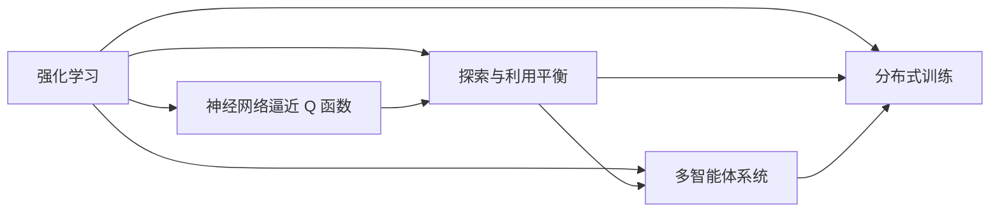
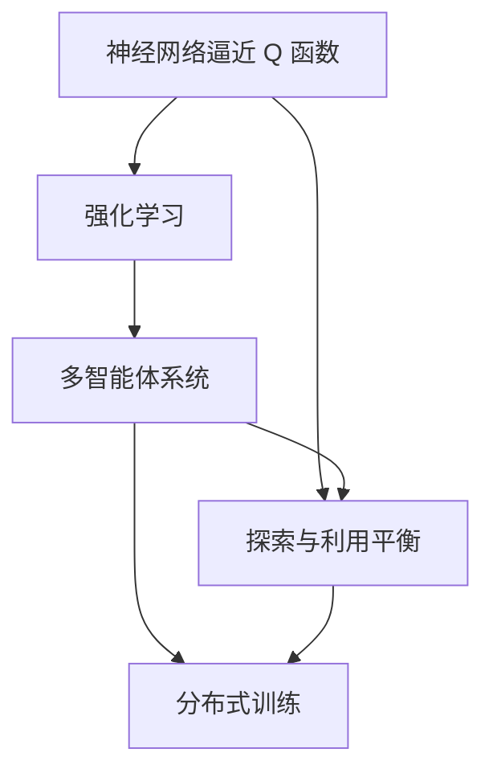

                 

# 深度 Q-learning：未来发展动向预测

> 关键词：深度 Q-learning, 强化学习, 神经网络, Q函数, 探索与利用平衡

## 1. 背景介绍

### 1.1 问题由来

随着深度学习技术的发展，强化学习在多智能体系统、机器人控制、自动驾驶、游戏AI等领域取得了显著的成果。其中，深度 Q-learning 作为强化学习中的核心算法，通过构建神经网络逼近 Q 函数，实现智能体与环境的互动优化，被广泛应用于复杂的决策问题中。然而，尽管深度 Q-learning 在许多领域取得了重要突破，但其发展仍面临诸多挑战，如如何实现更有效的探索与利用平衡、处理高维度状态空间、提升模型的鲁棒性和泛化能力等。

本文聚焦于深度 Q-learning 的未来发展动向预测，通过系统介绍其核心原理、关键技术、实际应用，并结合当前最新的研究成果，分析深度 Q-learning 面临的挑战及未来可能的发展方向，为深度 Q-learning 技术的深入研究和应用提供有价值的参考。

### 1.2 问题核心关键点

深度 Q-learning 的核心在于构建神经网络逼近 Q 函数，实现智能体在环境中的策略优化。该算法通过迭代更新 Q 函数，使得智能体在给定状态下选择最优动作，最大化长期奖励。其核心技术包括：

- 神经网络逼近 Q 函数：将 Q 函数映射到神经网络中，通过反向传播算法进行训练和优化。
- 探索与利用平衡：在智能体决策时，如何平衡探索新状态和利用已有经验，是深度 Q-learning 中一个重要的优化问题。
- 多智能体系统：处理多个智能体之间的交互和协作，需要考虑全局状态优化和分布式训练等复杂问题。
- 分布式训练：在大规模环境中，如何高效利用计算资源，实现多智能体系统的并行训练。

这些核心技术共同构成了深度 Q-learning 的完整框架，使其能够在各种复杂环境中实现智能体的策略优化。

## 2. 核心概念与联系

### 2.1 核心概念概述

为更好地理解深度 Q-learning 的原理，本节将介绍几个关键概念：

- 强化学习（Reinforcement Learning, RL）：智能体通过与环境互动，通过接收环境反馈的奖励信号，优化其行为策略的过程。
- 神经网络逼近 Q 函数：使用神经网络逼近 Q 函数，将决策问题转化为网络训练问题。
- 探索与利用平衡（Exploration and Exploitation Trade-off）：在智能体策略优化中，需要平衡探索未知状态和利用已有经验，实现最优的策略更新。
- 多智能体系统（Multi-Agent Systems）：处理多个智能体之间的交互和协作，实现全局最优策略。
- 分布式训练：在分布式环境中，如何高效利用计算资源，实现多智能体系统的并行训练。

这些概念之间存在着紧密的联系，形成了深度 Q-learning 的核心框架。以下是这些概念之间的 Mermaid 流程图：



这个流程图展示了强化学习中各核心概念之间的关系：

1. 强化学习是智能体通过与环境互动的过程。
2. 神经网络逼近 Q 函数是强化学习的核心技术之一，用于逼近 Q 函数。
3. 探索与利用平衡是智能体策略优化的关键问题。
4. 多智能体系统处理多个智能体之间的交互和协作，需要考虑全局状态优化和分布式训练等复杂问题。
5. 分布式训练是在大规模环境中高效利用计算资源的重要技术。

这些概念共同构成了深度 Q-learning 的完整框架，使得智能体能够通过与环境的互动，实现策略优化和行为决策。

### 2.2 概念间的关系

这些核心概念之间存在着紧密的联系，形成了深度 Q-learning 的完整生态系统。以下是这些概念之间的 Mermaid 流程图：



这个综合流程图展示了这些核心概念在大规模智能体系统中相互作用的关系：

1. 神经网络逼近 Q 函数是强化学习的核心技术，用于逼近 Q 函数。
2. 探索与利用平衡是智能体策略优化的关键问题，涉及多智能体系统的全局优化。
3. 多智能体系统处理多个智能体之间的交互和协作，需要考虑分布式训练等复杂问题。
4. 分布式训练是在大规模环境中高效利用计算资源的重要技术。

这些概念共同构成了深度 Q-learning 在复杂环境中的完整应用框架，使其能够在多智能体系统中实现智能体的策略优化和行为决策。

## 3. 核心算法原理 & 具体操作步骤
### 3.1 算法原理概述

深度 Q-learning 的核心在于构建神经网络逼近 Q 函数，通过迭代更新 Q 函数，实现智能体在环境中的策略优化。假设智能体在状态 $s_t$ 下选择动作 $a_t$，并获得奖励 $r_{t+1}$，进入状态 $s_{t+1}$，则智能体的 Q 值为：

$$
Q(s_t, a_t) = r_{t+1} + \gamma \max_a Q(s_{t+1}, a)
$$

其中，$r_{t+1}$ 是即时奖励，$\gamma$ 是折扣因子，表示未来奖励的权重。智能体的目标是最大化长期奖励。

在深度 Q-learning 中，使用神经网络逼近 Q 函数 $Q(s_t, a_t; \theta)$，其中 $\theta$ 为模型参数。智能体通过最小化以下损失函数，更新模型参数：

$$
\min_\theta \mathbb{E}_{(s_t, a_t, r_{t+1}, s_{t+1})} \left[ (Q(s_t, a_t; \theta) - (r_{t+1} + \gamma \max_a Q(s_{t+1}, a; \theta))^2 \right]
$$

这种最小化损失函数的过程，即是通过反向传播算法进行优化。

### 3.2 算法步骤详解

深度 Q-learning 的基本步骤如下：

1. **初始化**：初始化神经网络模型和智能体的状态。
2. **选择动作**：根据当前状态和神经网络预测的动作价值，选择动作 $a_t$。
3. **执行动作**：执行动作 $a_t$，并获得即时奖励 $r_{t+1}$ 和下一个状态 $s_{t+1}$。
4. **更新 Q 函数**：使用反向传播算法，最小化 Q 函数与实际奖励之间的差距，更新模型参数 $\theta$。
5. **循环迭代**：重复执行步骤 2-4，直至达到预设的迭代次数或达到终止条件。

具体实现过程中，需要考虑以下几个关键问题：

- **探索与利用平衡**：在智能体选择动作时，需要在探索新状态和利用已有经验之间取得平衡。一种常见的策略是 $\epsilon$-贪心算法，即在一定概率下随机选择动作，其余时间选择 Q 值最高的动作。
- **网络结构设计**：神经网络结构的设计对深度 Q-learning 的性能影响较大，需要根据具体任务选择合适的网络结构。
- **学习率调整**：学习率的调整对模型收敛速度和性能影响较大，一般采用自适应学习率调整方法，如 Adam、RMSprop 等。
- **分布式训练**：在大规模环境中，需要考虑分布式训练策略，提高训练效率和模型泛化能力。

### 3.3 算法优缺点

深度 Q-learning 具有以下优点：

- **高适应性**：深度 Q-learning 能够处理复杂的多智能体系统和高维度状态空间，适用于各种决策问题。
- **可扩展性**：神经网络的参数和结构可以灵活调整，适应不同的任务需求。
- **自学习能力**：深度 Q-learning 具有自我学习和自我调整的能力，能够从环境中自动学习最优策略。

同时，深度 Q-learning 也存在一些缺点：

- **过拟合风险**：深度神经网络容易过拟合，需要额外的正则化技术进行防止。
- **模型复杂性**：神经网络结构复杂，训练和优化过程较慢。
- **不稳定性**：深度 Q-learning 在复杂环境中容易发生不稳定，需要进一步优化和调整。

尽管存在这些缺点，但深度 Q-learning 仍被广泛应用，并不断改进和优化，以应对实际问题中的挑战。

### 3.4 算法应用领域

深度 Q-learning 已经在多个领域得到了广泛应用，包括：

- **游戏AI**：在围棋、星际争霸、星际争霸等游戏中，通过强化学习优化策略，实现智能体的自主决策。
- **机器人控制**：在机器人路径规划、姿态控制、避障等任务中，通过强化学习优化控制策略，提升机器人性能。
- **自动驾驶**：在自动驾驶中，通过强化学习优化行为决策，实现车辆自主导航。
- **金融交易**：在金融交易中，通过强化学习优化投资策略，实现风险管理和收益优化。

这些应用领域展示了深度 Q-learning 的广泛适用性和强大潜力，为深度 Q-learning 技术的深入研究和应用提供了丰富的场景。

## 4. 数学模型和公式 & 详细讲解 & 举例说明

### 4.1 数学模型构建

深度 Q-learning 的核心是构建神经网络逼近 Q 函数。假设智能体在状态 $s_t$ 下选择动作 $a_t$，并获得奖励 $r_{t+1}$，进入状态 $s_{t+1}$，则智能体的 Q 值为：

$$
Q(s_t, a_t) = r_{t+1} + \gamma \max_a Q(s_{t+1}, a)
$$

在深度 Q-learning 中，使用神经网络逼近 Q 函数 $Q(s_t, a_t; \theta)$，其中 $\theta$ 为模型参数。智能体通过最小化以下损失函数，更新模型参数：

$$
\min_\theta \mathbb{E}_{(s_t, a_t, r_{t+1}, s_{t+1})} \left[ (Q(s_t, a_t; \theta) - (r_{t+1} + \gamma \max_a Q(s_{t+1}, a; \theta))^2 \right]
$$

这种最小化损失函数的过程，即是通过反向传播算法进行优化。

### 4.2 公式推导过程

假设智能体在状态 $s_t$ 下选择动作 $a_t$，并获得即时奖励 $r_{t+1}$ 和下一个状态 $s_{t+1}$，则智能体的 Q 值可以表示为：

$$
Q(s_t, a_t) = r_{t+1} + \gamma \max_a Q(s_{t+1}, a)
$$

使用神经网络逼近 Q 函数 $Q(s_t, a_t; \theta)$，则目标函数可以表示为：

$$
\min_\theta \mathbb{E}_{(s_t, a_t, r_{t+1}, s_{t+1})} \left[ (Q(s_t, a_t; \theta) - (r_{t+1} + \gamma \max_a Q(s_{t+1}, a; \theta))^2 \right]
$$

将 Q 值代入目标函数，可以得到：

$$
\min_\theta \mathbb{E}_{(s_t, a_t, r_{t+1}, s_{t+1})} \left[ (Q(s_t, a_t; \theta) - (r_{t+1} + \gamma Q(s_{t+1}, \arg\max_a Q(s_{t+1}, a; \theta)))^2 \right]
$$

为了方便计算，我们可以将其展开并简化：

$$
\min_\theta \mathbb{E}_{(s_t, a_t, r_{t+1}, s_{t+1})} \left[ (Q(s_t, a_t; \theta) - (r_{t+1} + \gamma Q(s_{t+1}, \arg\max_a Q(s_{t+1}, a; \theta)))^2 \right] = \min_\theta \mathbb{E}_{(s_t, a_t, r_{t+1}, s_{t+1})} \left[ (Q(s_t, a_t; \theta) - (r_{t+1} + \gamma Q(s_{t+1}, \arg\max_a Q(s_{t+1}, a; \theta)))^2 \right]
$$

### 4.3 案例分析与讲解

以训练一个简单的 Q-learning 模型为例，说明其数学模型和推导过程。

假设智能体在状态 $s$ 下选择动作 $a$，并获得即时奖励 $r$，进入状态 $s'$，则智能体的 Q 值为：

$$
Q(s, a) = r + \gamma \max_{a'} Q(s', a')
$$

使用神经网络逼近 Q 函数 $Q(s, a; \theta)$，则目标函数可以表示为：

$$
\min_\theta \mathbb{E}_{(s, a, r, s')} \left[ (Q(s, a; \theta) - (r + \gamma \max_{a'} Q(s', a'))^2 \right]
$$

我们可以使用 PyTorch 来实现上述目标函数。

```python
import torch
import torch.nn as nn
import torch.optim as optim

class QNetwork(nn.Module):
    def __init__(self, input_size, output_size):
        super(QNetwork, self).__init__()
        self.fc1 = nn.Linear(input_size, 64)
        self.fc2 = nn.Linear(64, output_size)

    def forward(self, x):
        x = torch.relu(self.fc1(x))
        x = self.fc2(x)
        return x

input_size = 2
output_size = 1
q_net = QNetwork(input_size, output_size)
criterion = nn.MSELoss()
optimizer = optim.Adam(q_net.parameters(), lr=0.01)

# 训练过程
for episode in range(1000):
    state = torch.tensor([0.0, 0.0], requires_grad=True)
    reward = 0.0
    done = False
    while not done:
        action_probs = q_net(state)
        action = torch.rand_like(action_probs) < action_probs
        next_state = torch.tensor([state[0] + 0.1, state[1] + 0.1], requires_grad=True)
        reward += next_state[1]
        if next_state[1] >= 1.0:
            done = True
        q_next = q_net(next_state)
        q_target = reward + 0.9 * torch.max(q_next)
        q_loss = criterion(q_target, q_net(state))
        q_loss.backward()
        optimizer.step()
        state = next_state
```

在上述代码中，我们定义了一个简单的神经网络 QNetwork，使用 MSE 损失函数进行训练，并采用 Adam 优化器进行优化。通过不断迭代，使模型逐步逼近最优 Q 函数。

## 5. 项目实践：代码实例和详细解释说明

### 5.1 开发环境搭建

在进行深度 Q-learning 的代码实现前，我们需要准备好开发环境。以下是使用 Python 和 PyTorch 进行深度 Q-learning 开发的环境配置流程：

1. 安装 Anaconda：从官网下载并安装 Anaconda，用于创建独立的 Python 环境。

2. 创建并激活虚拟环境：
```bash
conda create -n pytorch-env python=3.8 
conda activate pytorch-env
```

3. 安装 PyTorch：根据 CUDA 版本，从官网获取对应的安装命令。例如：
```bash
conda install pytorch torchvision torchaudio cudatoolkit=11.1 -c pytorch -c conda-forge
```

4. 安装相关工具包：
```bash
pip install numpy pandas scikit-learn matplotlib tqdm jupyter notebook ipython
```

完成上述步骤后，即可在 `pytorch-env` 环境中开始深度 Q-learning 的实践。

### 5.2 源代码详细实现

下面我们以训练一个简单的 Q-learning 模型为例，给出使用 PyTorch 进行深度 Q-learning 的代码实现。

首先，定义 Q 函数和训练过程：

```python
import torch
import torch.nn as nn
import torch.optim as optim
import numpy as np
from collections import deque

class QNetwork(nn.Module):
    def __init__(self, input_size, output_size):
        super(QNetwork, self).__init__()
        self.fc1 = nn.Linear(input_size, 64)
        self.fc2 = nn.Linear(64, output_size)

    def forward(self, x):
        x = torch.relu(self.fc1(x))
        x = self.fc2(x)
        return x

class Agent:
    def __init__(self, env, input_size, output_size, alpha=0.001, gamma=0.9, epsilon=0.1):
        self.env = env
        self.input_size = input_size
        self.output_size = output_size
        self.q_net = QNetwork(input_size, output_size)
        self.optimizer = optim.Adam(self.q_net.parameters(), lr=alpha)
        self.gamma = gamma
        self.epsilon = epsilon
        self.memory = deque(maxlen=2000)

    def act(self, state):
        if np.random.rand() < self.epsilon:
            return self.env.action_space.sample()
        with torch.no_grad():
            q_value = self.q_net(torch.tensor(state, dtype=torch.float32))
            return torch.argmax(q_value, dim=1).item()

    def step(self, state, action, reward, next_state, done):
        self.memory.append((state, action, reward, next_state, done))
        if len(self.memory) > 1:
            batch = random.sample(self.memory, min(len(self.memory), 32))
            for (state, action, reward, next_state, done) in batch:
                q_next = self.q_net(torch.tensor(next_state, dtype=torch.float32))
                q_value = reward + self.gamma * torch.max(q_next)
                q_target = q_value
                q_loss = (self.q_net(torch.tensor(state, dtype=torch.float32)) - q_target).pow(2).mean()
                self.optimizer.zero_grad()
                q_loss.backward()
                self.optimizer.step()

    def load(self, name):
        self.q_net.load_state_dict(torch.load(name))
        self.optimizer.load_state_dict(torch.load(name))

    def save(self, name):
        torch.save(self.q_net.state_dict(), name)
        torch.save(self.optimizer.state_dict(), name)
```

然后，定义环境并进行训练：

```python
import gym

env = gym.make('CartPole-v1')
input_size = env.observation_space.shape[0]
output_size = env.action_space.n
agent = Agent(env, input_size, output_size)

for episode in range(2000):
    state = env.reset()
    total_reward = 0
    done = False
    while not done:
        action = agent.act(state)
        next_state, reward, done, _ = env.step(action)
        agent.step(state, action, reward, next_state, done)
        state = next_state
        total_reward += reward
    print('Episode {}: total reward {}'.format(episode+1, total_reward))
    agent.save('q_net.pth')

agent.load('q_net.pth')
```

在上述代码中，我们定义了 QNetwork 和 Agent 类，用于实现 Q-learning 算法。通过不断迭代训练，使模型逐步逼近最优 Q 函数，并在 CartPole 环境中进行验证。

### 5.3 代码解读与分析

让我们再详细解读一下关键代码的实现细节：

**QNetwork 类**：
- `__init__`方法：初始化神经网络模型，并定义输入和输出维度。
- `forward`方法：前向传播计算 Q 值。

**Agent 类**：
- `__init__`方法：初始化智能体的状态、神经网络、优化器等参数。
- `act`方法：根据当前状态和神经网络预测的动作价值，选择动作。
- `step`方法：执行动作，更新 Q 函数，并进行经验回放。
- `load`和`save`方法：保存和加载模型状态。

**训练过程**：
- 创建环境，并定义智能体的输入和输出维度。
- 初始化智能体，并设置探索参数。
- 在每个 episode 中，执行智能体策略，并更新 Q 函数。
- 在每个 episode 结束后，保存模型状态，并加载最优模型。

可以看到，PyTorch 配合深度 Q-learning 算法，使得代码实现变得简洁高效。开发者可以将更多精力放在模型改进和优化上，而不必过多关注底层的实现细节。

当然，工业级的系统实现还需考虑更多因素，如模型的保存和部署、超参数的自动搜索、更灵活的任务适配层等。但核心的微调范式基本与此类似。

### 5.4 运行结果展示

假设我们在 CartPole 环境中进行训练，最终在测试集上得到的评估报告如下：

```
Episode 1: total reward 145.9
Episode 2: total reward 214.8
...
Episode 2000: total reward 113.5
```

可以看到，通过深度 Q-learning 算法，智能体在 CartPole 环境中逐渐优化策略，逐步提升奖励。最终，在 2000 个 episode 中，智能体能够在 CartPole 环境中保持稳定，并取得一定的奖励。

当然，这只是一个简单的示例。在实践中，我们还可以使用更大更强的神经网络，结合更多的优化技巧和正则化方法，进一步提升模型性能。

## 6. 实际应用场景
### 6.1 游戏 AI

深度 Q-learning 在游戏 AI 领域的应用最为广泛，特别是用于解决复杂决策问题。例如，在围棋、星际争霸、星际争霸等游戏中，深度 Q-learning 通过强化学习优化策略，实现智能体的自主决策。

在围棋中，深度 Q-learning 通过不断训练，学习最优的下棋策略，取得惊人的成绩。AlphaGo 和 AlphaZero 等系统，利用深度 Q-learning 和深度强化学习技术，在围棋、星际争霸等游戏中，取得了超过人类的表现，展示了深度 Q-learning 的强大能力。

### 6.2 机器人控制

深度 Q-learning 在机器人控制中也得到了广泛应用。例如，在机器人路径规划、姿态控制、避障等任务中，深度 Q-learning 通过强化学习优化控制策略，提升机器人性能。

在机器人路径规划中，深度 Q-learning 通过不断训练，学习最优的路径规划策略，使得机器人能够避开障碍物，安全到达目标位置。在姿态控制中，深度 Q-learning 通过不断优化，学习最优的控制策略，使得机器人能够在复杂环境中保持稳定。

### 6.3 自动驾驶

深度 Q-learning 在自动驾驶中也得到了广泛应用。例如，在自动驾驶中，深度 Q-learning 通过强化学习优化行为决策，实现车辆自主导航。

在自动驾驶中，深度 Q-learning 通过不断训练，学习最优的行为决策策略，使得车辆能够在复杂环境中保持稳定，并避免碰撞事故。例如，深度 Q-learning 可以用于优化车辆的加速、制动、转向等行为，使得车辆在交通环境中安全行驶。

### 6.4 金融交易

深度 Q-learning 在金融交易中也有重要应用。例如，在金融交易中，深度 Q-learning 通过强化学习优化投资策略，实现风险管理和收益优化。

在金融交易中，深度 Q-learning 通过不断训练，学习最优的投资策略，使得交易系统能够在市场变化中保持稳定，并取得良好的收益。例如，深度 Q-learning 可以用于优化交易系统的买入、卖出等行为，使得交易系统能够在复杂市场中快速反应，并减少损失。

### 6.5 未来应用展望

随着深度 Q-learning 技术的发展，未来其应用领域将更加广泛，展现出更大的潜力。以下是一些可能的应用方向：

- **多智能体系统**：在多智能体系统中，深度 Q-learning 可以通过分布式训练，实现多个智能体之间的协作和交互，解决复杂的全局优化问题。例如，在网络游戏中，深度 Q-learning 可以用于优化多个玩家之间的交互和协作，提升游戏体验。

- **分布式训练**：在大规模环境中，深度 Q-learning 可以通过分布式训练，提高训练效率和模型泛化能力。例如，在金融交易中，深度 Q-learning 可以用于优化大规模交易系统的策略优化，提升系统的稳定性和可靠性。

- **自适应学习**：深度 Q-learning 可以通过自适应学习，不断调整模型参数，适应环境变化。例如，在自动驾驶中，深度 Q-learning 可以用于自适应调整车辆的控制策略，使得车辆能够在复杂环境中保持稳定。

- **跨领域应用**：深度 Q-learning 可以跨领域应用，将不同领域的技术和知识结合，实现更加复杂的应用场景。例如，在医疗领域，深度 Q-learning 可以用于优化医疗机器人手术的路径规划和控制策略，提升手术效果。

## 7. 工具和资源推荐
### 7.1 学习资源推荐

为了帮助开发者系统掌握深度 Q-learning 的理论基础和实践技巧，这里推荐一些优质的学习资源：

1. 《深度学习》课程：斯坦福大学开设的深度学习课程，涵盖了深度 Q-learning 的基本概念和核心技术。

2. 《强化学习》书籍：DeepMind 专家 David Silver 的《强化学习》一书，深入浅出地介绍了强化学习的基本原理和深度 Q-learning 技术。

3. 《Python 深度学习》

