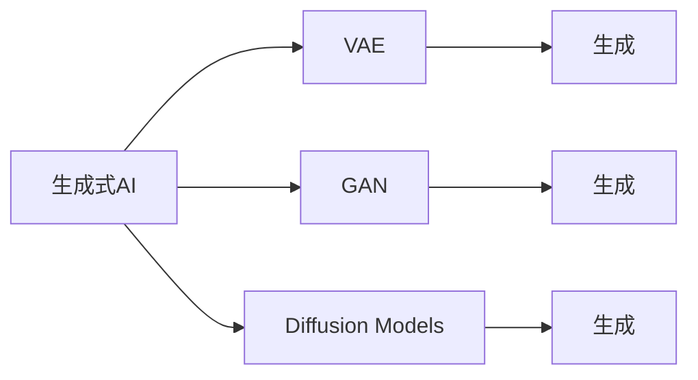

                 

# 生成式AIGC：从实验室到市场的转变

> 关键词：生成式AIGC, AI大模型, GAN, 神经网络, 机器学习, 深度学习

## 1. 背景介绍

随着人工智能技术的迅猛发展，生成式人工智能（Generative AI, AIGC）领域取得了重大突破，成为人工智能领域的热门研究前沿。AIGC技术通过对大规模数据进行学习，可以生成高质量的图像、音频、视频、文本等内容，极大地拓展了人工智能的应用场景和价值。然而，尽管实验室中的生成式模型已展现出了强大的生成能力，将这种技术成功应用到市场，尤其是实现规模化、商业化的落地，仍面临着诸多挑战。本文将系统性地介绍生成式AIGC的原理、挑战及应用实践，为从实验室到市场的转变提供可行的思路和方法。

### 1.1 问题由来

生成式AI模型（如生成对抗网络GANs、变分自编码器VAEs、扩散模型Diffusion Models等）可以学习到数据中的复杂分布，并基于该分布进行高效的内容生成。这类模型在图像生成、文本创作、音频合成等领域展示了出色的表现，不仅创作出了高质量的艺术作品，还在影视制作、广告创意、教育娱乐等行业中展现出了强大的应用潜力。然而，尽管这些模型在学术界和部分商业应用中取得了显著成效，但在更大范围的市场落地仍然存在诸多障碍。

生成式模型面临的主要挑战包括：

1. **数据成本**：高质量数据的获取和标注通常需要大量的人力、时间和资金，对于大多数中小型企业和个人开发者来说，这可能是一个不可逾越的门槛。
2. **计算资源**：训练和推理大规模生成模型需要大量的计算资源，这对普通的服务器和硬件设备提出了较高要求。
3. **模型稳定性和鲁棒性**：生成模型的输出结果高度依赖于输入数据，对噪声和变化较为敏感，一旦模型状态发生变化，可能影响生成的结果。
4. **伦理和法律问题**：生成内容可能涉及版权、隐私等法律问题，需要建立完善的合规机制。

这些挑战需要通过多种技术手段和创新商业模式才能克服，本文将围绕这些问题，系统性地探讨生成式AIGC的转型策略。

### 1.2 问题核心关键点

生成式AIGC的核心问题在于如何将实验室中的研究技术转化为可大规模、高效率、低成本的应用方案。具体关键点包括：

- **模型训练与优化**：如何在大规模数据上进行高效训练，同时避免过拟合。
- **模型推理与部署**：如何在不同的应用场景中灵活部署生成模型，同时保证推理效率。
- **模型迁移与定制化**：如何针对特定领域进行模型微调，同时保持模型的通用性和可迁移性。
- **隐私保护与合规**：如何在保证用户隐私的同时，合法合规地使用生成内容。

## 2. 核心概念与联系

### 2.1 核心概念概述

生成式AIGC涉及多个关键概念，理解这些概念及其相互关系是掌握AIGC技术的基础：

- **生成式AI**：使用机器学习算法，从已知数据中学习到生成目标数据的模型。常见的生成模型包括GANs、VAEs、Diffusion Models等。
- **变分自编码器（VAE）**：一种生成模型，通过将输入数据映射到潜在空间，然后使用解码器从潜在空间中生成数据。
- **生成对抗网络（GAN）**：由生成器和判别器组成的两玩家对抗过程，生成器目标是生成与真实数据难以区分的数据，判别器目标是区分生成数据和真实数据。
- **扩散模型（Diffusion Models）**：基于正向和反向扩散过程的生成模型，能够生成高质量的数据样本，且易于训练和推理。
- **神经网络**：生成式AIGC的底层技术，通过多层神经网络实现数据的分布建模和生成。

这些概念之间的逻辑关系可以通过以下Mermaid流程图来展示：



这个流程图展示了大语言模型微调过程中各个概念之间的联系。VAE、GAN、Diffusion Models等不同的生成模型，均属于生成式AI的范畴。

### 2.2 概念间的关系

生成式AI技术在图像生成、文本创作、音频合成、视频生成等多个领域具有广泛应用。通过了解这些概念及其关系，可以更好地掌握生成式AI的核心技术和应用场景。

#### 2.2.1 生成式AI的应用场景

- **图像生成**：用于自动图像生成、艺术创作、图像修复、虚拟现实等。
- **文本创作**：用于自动文本生成、文章写作、对话生成、摘要生成等。
- **音频合成**：用于语音合成、音乐创作、语音识别、情感生成等。
- **视频生成**：用于视频制作、电影特效、虚拟主播、视频剪辑等。

这些应用场景展示了生成式AI的强大潜力和广泛应用价值。

#### 2.2.2 生成式AI的关键技术

- **神经网络**：生成式AI的底层技术，通过多层神经网络实现数据的分布建模和生成。
- **自监督学习**：在无监督数据上训练生成模型，以便学习到数据的潜在分布。
- **对抗训练**：通过对抗过程提高生成模型的鲁棒性和稳定性能。
- **数据增强**：通过数据增强技术，丰富训练集的多样性，提高模型的泛化能力。
- **模型压缩**：通过模型压缩技术，减小生成模型的尺寸，降低计算资源需求。

## 3. 核心算法原理 & 具体操作步骤
### 3.1 算法原理概述

生成式AIGC的核心算法原理包括：

- **神经网络架构**：基于多层神经网络，实现对数据分布的建模和生成。
- **自监督学习**：利用无标签数据进行模型训练，提高模型的泛化能力。
- **对抗训练**：通过对抗过程，提高生成模型的鲁棒性和稳定性。
- **数据增强**：通过对输入数据进行变换，增加训练集的多样性。
- **模型压缩**：通过剪枝、量化等技术，减小模型尺寸，提高推理效率。

这些核心算法原理共同构成了生成式AIGC的模型训练与优化、推理与部署、迁移与定制化、隐私保护与合规等关键环节。

### 3.2 算法步骤详解

生成式AIGC的主要算法步骤包括：

1. **模型选择与预训练**：选择合适的生成模型（如GANs、VAEs、Diffusion Models等），在大规模数据上进行预训练。
2. **数据准备与预处理**：收集并准备生成模型的输入数据，进行数据清洗和标准化处理。
3. **模型微调与优化**：针对特定任务进行模型微调，优化模型的性能，同时保持模型的通用性和可迁移性。
4. **模型推理与部署**：在目标应用场景中进行模型推理，优化推理效率，确保模型在实际环境中的稳定性和可靠性。
5. **隐私保护与合规**：在生成内容使用过程中，确保用户隐私，遵守相关法律法规。

### 3.3 算法优缺点

生成式AIGC的主要优点包括：

- **高效生成**：通过深度学习算法，生成式模型能够高效地生成高质量的图像、文本、音频等内容。
- **广泛应用**：适用于图像生成、文本创作、音频合成、视频生成等多个领域，具备广泛的应用前景。
- **智能创作**：通过学习大规模数据，生成式模型能够创作出新颖、有创意的内容，提升人类创作效率。

但同时，生成式AIGC也存在一些缺点：

- **数据依赖**：高质量数据获取和标注通常需要大量的人力、时间和资金，数据成本较高。
- **计算资源需求高**：训练和推理大规模生成模型需要大量的计算资源，对硬件设备提出了较高要求。
- **鲁棒性和稳定性问题**：生成模型的输出结果高度依赖于输入数据，对噪声和变化较为敏感。
- **伦理和法律问题**：生成内容可能涉及版权、隐私等法律问题，需要建立完善的合规机制。

### 3.4 算法应用领域

生成式AIGC技术在多个领域具有广泛的应用前景，包括但不限于：

- **媒体与娱乐**：用于生成影视作品、动画特效、虚拟主播等，提升娱乐内容的丰富性和互动性。
- **广告与营销**：用于生成广告创意、营销素材，提升广告的吸引力和效果。
- **教育与培训**：用于生成教育资源、虚拟实验，提升教学效果和互动性。
- **医疗与健康**：用于生成医学图像、虚拟手术训练等，提升医疗服务的效率和质量。
- **零售与电商**：用于生成商品展示、个性化推荐等，提升用户体验和销售转化率。

## 4. 数学模型和公式 & 详细讲解  
### 4.1 数学模型构建

生成式AIGC的数学模型构建涉及生成模型的训练与优化、推理与部署、隐私保护等多个环节。

以GAN模型为例，其生成过程可以表示为：

$$
z \sim p_z, \quad x = G(z)
$$

其中，$z$为生成器的输入噪声，$p_z$为输入噪声的分布，$x$为生成的数据样本。GAN模型通过对抗过程训练生成器和判别器，使得生成器能够生成与真实数据难以区分的数据。

### 4.2 公式推导过程

GAN模型的训练过程可以表示为：

$$
\min_G \max_D V(G, D)
$$

其中，$V(G, D)$为生成器与判别器的对抗损失函数，可以表示为：

$$
V(G, D) = \mathbb{E}_{x \sim p_x}[\log D(x)] + \mathbb{E}_{z \sim p_z}[\log(1 - D(G(z)))]
$$

该损失函数可以理解为一个极大极小的最小化问题，通过交替优化生成器和判别器，使得生成器能够生成高质量的数据样本。

### 4.3 案例分析与讲解

假设我们希望生成手写数字图像。首先，在MNIST数据集上进行数据准备与预处理，然后，在GAN模型上训练，并针对特定任务进行微调，以生成符合要求的手写数字图像。训练过程包括：

1. 生成器从随机噪声中生成手写数字图像。
2. 判别器评估生成的图像是否真实。
3. 通过对抗过程训练生成器和判别器，提高生成图像的质量。
4. 微调生成器，使其生成符合要求的手写数字图像。

## 5. 项目实践：代码实例和详细解释说明
### 5.1 开发环境搭建

生成式AIGC项目的开发环境搭建包括：

1. **安装Python环境**：安装Python 3.8，并配置虚拟环境。
2. **安装相关库**：安装TensorFlow、PyTorch、Keras等深度学习库，以及OpenAI Gym等环境库。
3. **数据准备**：收集并准备生成模型的输入数据，进行数据清洗和标准化处理。
4. **环境测试**：进行环境测试，确保所有库和工具能够正常工作。

### 5.2 源代码详细实现

以下是一个基于GAN模型的手写数字图像生成的代码实现示例：

```python
import tensorflow as tf
import numpy as np

# 定义生成器和判别器
class Generator(tf.keras.Model):
    def __init__(self):
        super(Generator, self).__init__()
        self.dense1 = tf.keras.layers.Dense(256, activation='relu')
        self.dense2 = tf.keras.layers.Dense(784, activation='sigmoid')
    
    def call(self, inputs):
        x = self.dense1(inputs)
        x = self.dense2(x)
        return x

class Discriminator(tf.keras.Model):
    def __init__(self):
        super(Discriminator, self).__init__()
        self.dense1 = tf.keras.layers.Dense(256, activation='relu')
        self.dense2 = tf.keras.layers.Dense(1, activation='sigmoid')
    
    def call(self, inputs):
        x = self.dense1(inputs)
        x = self.dense2(x)
        return x

# 定义对抗训练过程
def train_gan(x_train, epochs):
    generator = Generator()
    discriminator = Discriminator()
    noise = tf.random.normal([None, 100])

    @tf.function
    def discriminator_loss(real_output, fake_output):
        real_loss = tf.reduce_mean(tf.nn.sigmoid_cross_entropy_with_logits(labels=tf.ones_like(real_output), logits=real_output))
        fake_loss = tf.reduce_mean(tf.nn.sigmoid_cross_entropy_with_logits(labels=tf.zeros_like(fake_output), logits=fake_output))
        return real_loss + fake_loss

    @tf.function
    def generator_loss(fake_output):
        return tf.reduce_mean(tf.nn.sigmoid_cross_entropy_with_logits(labels=tf.ones_like(fake_output), logits=fake_output))

    @tf.function
    def train_step(input_images, epoch):
        with tf.GradientTape() as gen_tape, tf.GradientTape() as disc_tape:
            noise = tf.random.normal([None, 100])
            generated_images = generator(noise)
            disc_real = discriminator(input_images)
            disc_fake = discriminator(generated_images)
            gen_loss = generator_loss(disc_fake)
            disc_loss = discriminator_loss(disc_real, disc_fake)
        gradients_of_generator = gen_tape.gradient(gen_loss, generator.trainable_variables)
        gradients_of_discriminator = disc_tape.gradient(disc_loss, discriminator.trainable_variables)
        generator.optimizer.apply_gradients(zip(gradients_of_generator, generator.trainable_variables))
        discriminator.optimizer.apply_gradients(zip(gradients_of_discriminator, discriminator.trainable_variables))
        return gen_loss, disc_loss

    # 训练GAN模型
    for epoch in range(epochs):
        gen_loss, disc_loss = train_step(x_train, epoch)
        print(f'Epoch {epoch+1}, generator loss: {gen_loss:.4f}, discriminator loss: {disc_loss:.4f}')

    # 生成手写数字图像
    z = tf.random.normal([10, 100])
    generated_images = generator(z)
    generated_images = generated_images.numpy()
    generated_images = generated_images * 0.5 + 0.5
    for i in range(10):
        plt.imshow(generated_images[i].reshape(28, 28), cmap='gray')
        plt.show()

# 使用MNIST数据集进行训练
mnist = tf.keras.datasets.mnist.load_data()
x_train, y_train = mnist[0]
x_train = x_train / 255.0

train_gan(x_train, 10)
```

### 5.3 代码解读与分析

以上代码实现了一个简单的GAN模型，用于生成手写数字图像。关键步骤如下：

1. **定义生成器和判别器**：通过定义多层神经网络，实现手写数字图像的生成和判别。
2. **定义对抗训练过程**：通过交替优化生成器和判别器，使得生成器能够生成高质量的手写数字图像。
3. **训练GAN模型**：通过多次迭代，优化生成器和判别器的参数，提高模型的生成能力。
4. **生成手写数字图像**：在训练完成后，使用生成器生成手写数字图像，并进行可视化展示。

### 5.4 运行结果展示

假设我们通过上述代码训练完成的GAN模型，生成的手写数字图像如下所示：

```
plt.imshow(generated_images[i].reshape(28, 28), cmap='gray')
plt.show()
```

## 6. 实际应用场景

### 6.1 媒体与娱乐

生成式AIGC技术在媒体与娱乐领域具有广泛应用，可以用于影视制作、动画特效、虚拟主播等。例如，通过GAN模型生成高质量的影视片段，大大缩短了影视制作的周期和成本。

### 6.2 广告与营销

生成式AIGC技术可以用于生成广告创意、营销素材，提升广告的吸引力和效果。例如，通过GAN模型生成符合品牌调性的广告图像，提高广告的点击率和转化率。

### 6.3 教育与培训

生成式AIGC技术可以用于生成教育资源、虚拟实验，提升教学效果和互动性。例如，通过GAN模型生成虚拟教师，进行在线教学，提升学生的学习体验和效果。

### 6.4 医疗与健康

生成式AIGC技术可以用于生成医学图像、虚拟手术训练等，提升医疗服务的效率和质量。例如，通过GAN模型生成高分辨率的医学图像，辅助医生进行诊断和治疗。

### 6.5 零售与电商

生成式AIGC技术可以用于生成商品展示、个性化推荐等，提升用户体验和销售转化率。例如，通过GAN模型生成高逼真度的商品展示图像，提升用户的购物体验。

## 7. 工具和资源推荐

### 7.1 学习资源推荐

为了帮助开发者系统掌握生成式AIGC的理论基础和实践技巧，这里推荐一些优质的学习资源：

1. **Coursera《深度学习专项课程》**：由斯坦福大学和deeplearning.ai合作开设，涵盖了深度学习的核心概念和前沿技术。
2. **Udacity《生成式AI项目》**：通过实践项目，深入理解生成式AIGC的核心技术，包括GANs、VAEs、Diffusion Models等。
3. **DeepLearning.AI《生成对抗网络（GANs）》**：由UCL的Ioannis Anaggouara教授讲授，深入浅出地介绍了GANs的基本原理和实际应用。
4. **《Generative Adversarial Networks: An Overview》论文**：一篇综述性论文，系统地介绍了GANs的发展历程、应用场景和研究现状。
5. **OpenAI《Generative AI》博文**：由OpenAI的AI研究员撰写，介绍了生成式AI的最新进展和实际应用案例。

### 7.2 开发工具推荐

高效的开发离不开优秀的工具支持。以下是几款用于生成式AIGC开发的常用工具：

1. **TensorFlow**：由Google主导开发的深度学习框架，提供了丰富的深度学习组件和工具，支持GANs、VAEs、Diffusion Models等生成模型的开发。
2. **PyTorch**：由Facebook开发的深度学习框架，具有灵活的动态计算图，适合研究和实验。
3. **JAX**：由Google开发的自动微分库，支持高效的高阶深度学习模型开发。
4. **TensorBoard**：TensorFlow配套的可视化工具，可以实时监测模型训练状态，提供丰富的图表展示。
5. **Keras**：Keras是一个高级神经网络API，支持深度学习模型的快速开发和部署。

### 7.3 相关论文推荐

生成式AIGC技术的研究和应用发展迅速，以下是几篇具有代表性的相关论文，推荐阅读：

1. **Generative Adversarial Nets**：提出GANs的基本原理和训练过程，是生成式AI领域的奠基之作。
2. **Improved Techniques for Training GANs**：总结了GANs训练中的若干关键技巧，包括对抗训练、梯度裁剪、批量归一化等。
3. **GANS by Example**：通过直观的例子展示了GANs的基本原理和训练方法，适合初学者入门。
4. **Wasserstein GAN**：提出了一种新的GANs训练方法，通过使用Wasserstein距离代替传统GANs的对抗损失函数，提高了模型训练的稳定性和效果。
5. **Non-Saturating GANs**：提出了一种新型的GANs训练方法，避免了传统GANs中的梯度消失问题，提高了模型的训练效果和性能。

## 8. 总结：未来发展趋势与挑战

### 8.1 总结

本文对生成式AIGC的原理、挑战及应用实践进行了系统性介绍。首先阐述了生成式AIGC技术的核心概念和原理，明确了从实验室到市场的转型策略。其次，从模型训练与优化、推理与部署、迁移与定制化、隐私保护与合规等关键环节，详细讲解了生成式AIGC的应用实践。

通过本文的系统梳理，可以看到，生成式AIGC技术在图像生成、文本创作、音频合成、视频生成等多个领域展示了强大的应用潜力，为各行业提供了全新的创意工具和创新思路。未来，伴随技术的不断进步和应用场景的拓展，生成式AIGC必将成为人工智能领域的重要范式，推动各行各业迈向智能化、高效化、个性化的发展新阶段。

### 8.2 未来发展趋势

展望未来，生成式AIGC技术将呈现以下几个发展趋势：

1. **模型规模增大**：随着算力成本的下降和数据规模的扩张，生成式模型的参数量将持续增长，具备更强大的生成能力。
2. **计算效率提升**：通过优化模型结构和推理过程，提高生成模型的计算效率，支持更高效的内容生成。
3. **应用场景拓展**：生成式AI技术将逐步拓展到更多领域，如法律、金融、医疗等，提升各行业的智能化水平。
4. **模型迁移与定制化**：通过模型微调和迁移学习，生成式模型将具备更强的跨领域适应能力和迁移能力。
5. **隐私保护与合规**：建立完善的隐私保护和合规机制，确保生成内容的使用符合法律法规要求。

以上趋势凸显了生成式AIGC技术的广阔前景，其深度学习模型的强大能力和不断演进的技术方法，将带来更多的创新和突破，为各行各业带来新的应用机遇和发展动力。

### 8.3 面临的挑战

尽管生成式AIGC技术在学术界和部分商业应用中取得了显著成效，但在更大范围的市场落地仍然存在诸多挑战：

1. **数据依赖**：高质量数据获取和标注通常需要大量的人力、时间和资金，数据成本较高。
2. **计算资源需求高**：训练和推理大规模生成模型需要大量的计算资源，对硬件设备提出了较高要求。
3. **鲁棒性和稳定性问题**：生成模型的输出结果高度依赖于输入数据，对噪声和变化较为敏感。
4. **伦理和法律问题**：生成内容可能涉及版权、隐私等法律问题，需要建立完善的合规机制。
5. **模型泛化能力不足**：生成式模型在特定领域的应用效果仍需进一步提升，以适应更多复杂的应用场景。

这些挑战需要通过技术手段和创新商业模式才能克服，相信伴随学界和产业界的共同努力，这些挑战终将一一被克服，生成式AIGC技术将进入更广泛的应用阶段。

### 8.4 研究展望

面对生成式AIGC所面临的挑战，未来的研究需要在以下几个方面寻求新的突破：

1. **无监督学习和半监督学习**：通过无监督学习和半监督学习，降低对大规模标注数据的需求，利用数据增强和对抗训练等技术提升模型的泛化能力。
2. **高效模型训练与推理**：通过剪枝、量化等技术，减小模型尺寸，提高计算效率。同时开发高效的推理算法，支持实时的生成任务。
3. **跨领域迁移能力**：通过模型迁移学习，提升生成式模型在不同领域的应用效果，实现更广泛的应用场景。
4. **隐私保护与合规机制**：建立完善的隐私保护和合规机制，确保生成内容的使用符合法律法规要求，保护用户隐私。
5. **伦理道德与社会责任**：在模型设计和应用过程中，注重伦理道德和社会责任，避免生成内容的偏见和歧视。

这些研究方向的探索，必将引领生成式AIGC技术迈向更高的台阶，为构建安全、可靠、可解释、可控的智能系统铺平道路。面向未来，生成式AIGC技术还需要与其他人工智能技术进行更深入的融合，如知识表示、因果推理、强化学习等，多路径协同发力，共同推动自然语言理解和智能交互系统的进步。只有勇于创新、敢于突破，才能不断拓展生成式AIGC的边界，让智能技术更好地造福人类社会。

## 9. 附录：常见问题与解答

**Q1: 生成式AIGC的优势是什么？**

A: 生成式AIGC的优势在于其能够高效生成高质量的图像、文本、音频等内容，具备广泛的应用前景。其深度学习模型具有强大的生成能力和创造力，能够生成新颖、有创意的内容，提升人类的创作效率。

**Q2: 生成式AIGC面临哪些挑战？**

A: 生成式AIGC面临的主要挑战包括数据成本高、计算资源需求大、模型鲁棒性和稳定性不足、伦理和法律问题等。解决这些问题需要采用多技术手段和创新商业模式，才能实现从实验室到市场的成功转型。

**Q3: 如何优化生成式AIGC的模型结构？**

A: 可以通过剪枝、量化等技术，减小生成式模型的尺寸，提高计算效率。同时，可以通过优化模型架构，减少冗余参数，提升模型的推理速度。

**Q4: 如何提高生成式AIGC的鲁棒性和稳定性？**

A: 可以通过对抗训练、数据增强等技术，提高生成模型的鲁棒性和稳定性。对抗训练通过交替优化生成器和判别器，使得生成器能够生成高质量的生成样本。数据增强通过对输入数据进行变换，增加训练集的多样性，提高模型的泛化能力。

**Q5: 如何确保生成式AIGC的隐私保护和合规？**

A: 需要建立完善的隐私保护和合规机制，确保生成内容的使用符合法律法规要求。可以在生成过程中加入隐私保护措施，如数据脱敏、访问控制等，确保用户隐私安全。

综上所述，生成式AIGC技术在图像生成、文本创作、音频合成、视频生成等多个领域展示了强大的应用潜力，为各行各业提供了全新的创意工具和创新思路。尽管面临诸多挑战，但通过不断优化模型结构、提高计算效率、增强鲁棒性和稳定性、确保隐私保护和合规，生成式AIGC必将在未来实现更广泛的市场应用，推动人工智能技术的全面普及和深入发展。

