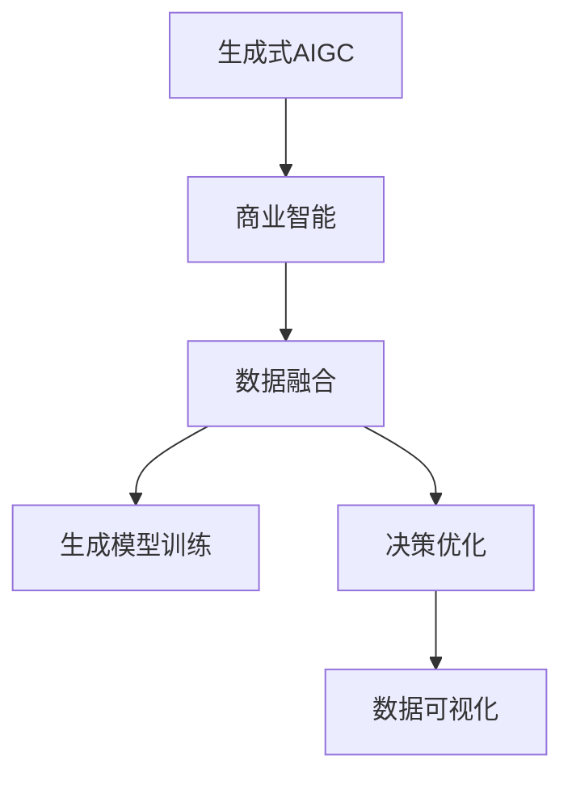
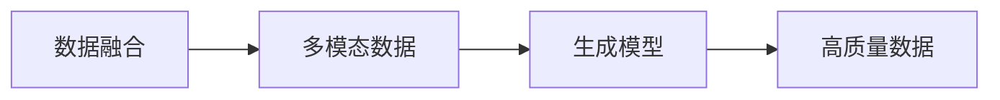
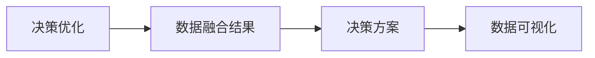
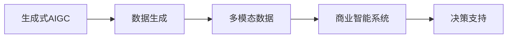
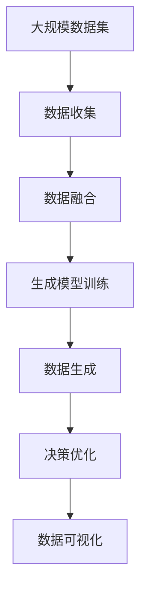

                 

# 生成式AIGC：商业智能的未来趋势

> 关键词：生成式AIGC,商业智能,BI,多模态融合,决策优化,数据可视化,人工智能商业应用

## 1. 背景介绍

### 1.1 问题由来
随着信息技术的迅猛发展和数据量的爆炸式增长，商业智能（Business Intelligence，BI）领域在数据获取、处理和分析上迎来了前所未有的挑战。如何在海量数据中提取出有价值的信息，支持企业战略决策，成为商业智能领域亟需解决的问题。传统的BI系统基于结构化数据，通过SQL查询、统计分析等手段，提供支持决策的报表、仪表盘等可视化展示，但面对非结构化数据（如图像、音频、视频等）时，传统方法显得力不从心。

生成式人工智能（Generative AI，AIGC）的兴起，为商业智能领域带来了新的变革。AIGC通过生成对抗网络（GANs）、变分自编码器（VAEs）、自回归模型等技术，具备从数据中生成高质量内容的能力，包括图像、音频、视频、文本等。结合商业智能的决策优化和数据可视化技术，AIGC能够提供更直观、更精准的决策支持，助力企业更高效地运营和发展。

### 1.2 问题核心关键点
生成式AIGC在商业智能中的应用，涉及以下几个关键点：

1. 数据融合与处理：将多模态数据（如文本、图像、音频等）进行融合处理，提取共性信息。
2. 生成模型训练：使用深度学习生成模型，训练高质量的数据生成模型。
3. 决策优化算法：结合生成模型和商业智能算法，优化决策结果。
4. 数据可视化：将决策结果以直观、易懂的形式展示给决策者，辅助决策。
5. 应用场景拓展：在金融、医疗、零售等垂直领域，探索生成式AIGC的商业应用。

### 1.3 问题研究意义
生成式AIGC在商业智能中的应用，能够带来以下几方面的显著优势：

1. 多模态数据处理：生成式AIGC能够有效处理多模态数据，提升数据融合的准确性和深度。
2. 数据生成能力：AIGC具备生成高质量内容的能力，可以生成更加丰富的信息，提升决策的全面性。
3. 高效决策支持：通过生成式AIGC和商业智能的结合，提供更高效、更精准的决策支持。
4. 创新应用场景：AIGC可以应用于图像识别、语音生成、自然语言处理等领域，拓展商业智能的应用边界。
5. 提升用户体验：生成式AIGC提供的可视化展示更加生动、直观，提升用户体验。

## 2. 核心概念与联系

### 2.1 核心概念概述

为更好地理解生成式AIGC在商业智能中的应用，本节将介绍几个密切相关的核心概念：

- **生成式人工智能（Generative AI，AIGC）**：通过生成模型（如GANs、VAEs、自回归模型等），生成高质量的数据（如图像、音频、视频、文本等），为商业智能提供更丰富、更精准的信息。

- **商业智能（Business Intelligence，BI）**：通过数据收集、处理和分析，支持企业战略决策，优化运营管理。BI系统包括报表、仪表盘、数据仓库等，提供直观的数据展示和分析工具。

- **数据融合（Data Fusion）**：将多种类型的数据进行整合，提取共性信息和关联，为决策提供更全面、更深入的支持。

- **决策优化（Decision Optimization）**：通过智能算法，结合数据融合结果，优化决策方案，提高决策效率和效果。

- **数据可视化（Data Visualization）**：通过图形化展示工具，将决策结果直观地展示给决策者，便于理解和执行。

这些核心概念之间存在着紧密的联系，构成了生成式AIGC在商业智能中的应用框架。下面我们通过Mermaid流程图来展示这些概念之间的关系：



这个流程图展示了生成式AIGC在商业智能中的核心概念及其之间的关系：

1. 生成式AIGC提供多模态数据的生成和融合能力。
2. 商业智能系统在生成式AIGC的基础上，进行决策优化。
3. 数据可视化作为结果展示的手段，辅助决策者理解结果。

### 2.2 概念间的关系

这些核心概念之间存在着紧密的联系，形成了生成式AIGC在商业智能中的应用生态系统。下面我通过几个Mermaid流程图来展示这些概念之间的关系。

#### 2.2.1 数据融合与生成模型的关系



这个流程图展示了数据融合与生成模型的关系：通过数据融合，将多模态数据整合并提取共性信息；生成模型则基于融合结果，生成高质量的数据。

#### 2.2.2 决策优化与数据可视化的关系



这个流程图展示了决策优化与数据可视化的关系：决策优化基于融合结果进行方案生成；数据可视化则将决策结果以直观的形式展示给决策者。

#### 2.2.3 生成式AIGC与商业智能系统的关系



这个流程图展示了生成式AIGC与商业智能系统的关系：生成式AIGC提供多模态数据生成能力，商业智能系统在生成式AIGC的基础上，进行决策支持。

### 2.3 核心概念的整体架构

最后，我们用一个综合的流程图来展示这些核心概念在生成式AIGC在商业智能中的应用架构：



这个综合流程图展示了从数据收集到数据可视化的完整过程。生成式AIGC通过数据融合和生成模型训练，生成高质量的多模态数据；商业智能系统在生成式AIGC的基础上，进行决策优化；最终通过数据可视化工具，将决策结果直观展示给决策者。

## 3. 核心算法原理 & 具体操作步骤
### 3.1 算法原理概述

生成式AIGC在商业智能中的应用，涉及以下几个关键步骤：

1. **数据收集与融合**：将企业内外部多模态数据进行收集和融合，提取共性信息和关联。
2. **生成模型训练**：使用深度学习生成模型，训练高质量的数据生成模型。
3. **决策优化算法**：结合生成模型和商业智能算法，优化决策结果。
4. **数据可视化**：将决策结果以直观、易懂的形式展示给决策者，辅助决策。

### 3.2 算法步骤详解

#### 3.2.1 数据收集与融合

数据收集与融合是生成式AIGC在商业智能中的第一步。主要包括以下几个步骤：

1. **数据源获取**：从企业内外部获取多模态数据，包括结构化数据（如销售记录、客户信息等）、非结构化数据（如图像、音频、视频等）。
2. **数据清洗与预处理**：对数据进行清洗和预处理，去除噪声和缺失值，统一数据格式。
3. **特征提取**：从原始数据中提取有价值的信息，如文本中的关键词、图像中的特征点等。
4. **数据融合**：将多种类型的数据进行融合，提取共性信息和关联，形成统一的视图。

#### 3.2.2 生成模型训练

生成模型训练是生成式AIGC的核心步骤。主要包括以下几个步骤：

1. **模型选择**：选择合适的生成模型，如GANs、VAEs、自回归模型等。
2. **模型训练**：使用收集和融合后的数据，训练生成模型，生成高质量的数据。
3. **模型评估**：对生成模型进行评估，确保生成的数据质量符合要求。
4. **模型优化**：根据评估结果，对模型进行优化，提升生成效果。

#### 3.2.3 决策优化算法

决策优化算法是生成式AIGC在商业智能中的重要步骤。主要包括以下几个步骤：

1. **算法选择**：选择合适的商业智能算法，如决策树、回归分析、优化算法等。
2. **模型训练**：结合生成模型和商业智能算法，训练决策模型。
3. **模型评估**：对决策模型进行评估，确保决策结果的准确性和可靠性。
4. **模型优化**：根据评估结果，对模型进行优化，提升决策效果。

#### 3.2.4 数据可视化

数据可视化是生成式AIGC在商业智能中的最后一步。主要包括以下几个步骤：

1. **可视化工具选择**：选择合适的可视化工具，如Tableau、Power BI等。
2. **数据展示**：将决策结果以图形化的形式展示给决策者，如仪表盘、报表等。
3. **交互设计**：设计交互式的可视化界面，便于决策者进行数据探索和分析。
4. **用户反馈**：收集用户反馈，不断优化可视化效果。

### 3.3 算法优缺点

生成式AIGC在商业智能中的应用，具有以下优点：

1. **多模态数据处理**：生成式AIGC能够处理多模态数据，提升数据融合的准确性和深度。
2. **数据生成能力**：AIGC具备生成高质量内容的能力，可以生成更加丰富的信息，提升决策的全面性。
3. **高效决策支持**：通过生成式AIGC和商业智能的结合，提供更高效、更精准的决策支持。
4. **创新应用场景**：AIGC可以应用于图像识别、语音生成、自然语言处理等领域，拓展商业智能的应用边界。
5. **提升用户体验**：生成式AIGC提供的可视化展示更加生动、直观，提升用户体验。

同时，生成式AIGC也存在一些缺点：

1. **模型训练复杂**：生成式AIGC需要大量的数据和计算资源进行模型训练，成本较高。
2. **数据质量要求高**：生成模型对数据质量要求较高，需要高质量、干净的数据，否则生成效果不佳。
3. **结果可解释性差**：生成式AIGC生成的结果往往较为复杂，难以解释其内部工作机制和决策逻辑。
4. **安全性问题**：生成的内容可能存在偏见、误导性，需要严格审查和监控。

### 3.4 算法应用领域

生成式AIGC在商业智能中的应用，主要包括以下几个领域：

1. **金融领域**：通过生成式AIGC，生成高质量的财务报表、股票分析报告等，支持投资决策和风险评估。
2. **医疗领域**：通过生成式AIGC，生成医学影像、病历记录等，支持诊断和治疗方案的优化。
3. **零售领域**：通过生成式AIGC，生成商品推荐、顾客画像等，提升销售和客户体验。
4. **营销领域**：通过生成式AIGC，生成广告创意、营销策略等，优化市场营销效果。
5. **人力资源领域**：通过生成式AIGC，生成招聘广告、员工评估报告等，提升人力资源管理。

## 4. 数学模型和公式 & 详细讲解 & 举例说明

### 4.1 数学模型构建

为了更好地理解生成式AIGC在商业智能中的应用，本节将使用数学语言对关键步骤进行详细讲解。

假设我们有一组多模态数据 $D=\{(x_i,y_i)\}_{i=1}^N$，其中 $x_i$ 为输入，$y_i$ 为标签。我们使用生成式AIGC对 $x_i$ 进行生成，生成结果记为 $\hat{x}_i$。同时，我们使用商业智能算法对生成结果和 $y_i$ 进行优化，得到优化后的结果 $z_i$。

我们定义生成模型的损失函数为 $L_{gen}(\theta)$，商业智能算法的损失函数为 $L_{BI}(\theta)$，则总体损失函数为 $L(\theta)=L_{gen}(\theta)+L_{BI}(\theta)$。我们的目标是最小化总体损失函数，即：

$$
\theta^* = \mathop{\arg\min}_{\theta} L(\theta)
$$

其中 $\theta$ 为模型参数，包括生成模型和商业智能算法的参数。

### 4.2 公式推导过程

为了推导生成式AIGC在商业智能中的应用，我们以一个简单的线性回归问题为例，使用生成式AIGC生成数据，并在其基础上进行商业智能优化。

假设我们有一个线性回归模型 $y=wx+b$，其中 $x$ 为输入，$y$ 为标签。我们使用生成式AIGC生成 $N$ 个训练样本，每个样本 $(x_i,y_i)$ 都服从 $x_i=wx_i'+b+\epsilon$ 的分布，其中 $x_i'$ 为生成式AIGC生成的样本，$\epsilon$ 为噪声。

在生成式AIGC中，我们使用生成模型 $x_i'=g(\theta)$，其中 $\theta$ 为生成模型的参数。在商业智能算法中，我们使用线性回归模型 $y=w(z_i)+b$，其中 $z_i$ 为生成式AIGC生成的样本 $x_i'$ 经过商业智能算法优化后的结果。

我们的目标是最小化总体损失函数 $L(\theta)=L_{gen}(\theta)+L_{BI}(\theta)$，其中 $L_{gen}(\theta)$ 为生成模型的损失函数，$L_{BI}(\theta)$ 为商业智能算法的损失函数。

首先，我们定义生成模型的损失函数 $L_{gen}(\theta)$ 为：

$$
L_{gen}(\theta)=\frac{1}{N}\sum_{i=1}^N (x_i-g(\theta))^2
$$

然后，我们定义商业智能算法的损失函数 $L_{BI}(\theta)$ 为：

$$
L_{BI}(\theta)=\frac{1}{N}\sum_{i=1}^N (y_i-w(z_i))^2
$$

其中 $w$ 为线性回归模型的参数，$z_i$ 为商业智能算法优化后的结果。

将两个损失函数相加，得到总体损失函数 $L(\theta)$：

$$
L(\theta)=L_{gen}(\theta)+L_{BI}(\theta)=\frac{1}{N}\sum_{i=1}^N ((x_i-g(\theta))^2+(y_i-w(z_i))^2)
$$

### 4.3 案例分析与讲解

假设我们在一个电商平台中进行销售预测，使用生成式AIGC生成历史销售数据，并在其基础上进行商业智能优化。

1. **数据收集与融合**：收集平台上的历史销售数据，包括销售时间、商品类别、用户行为等信息。使用生成式AIGC生成高质量的历史销售数据，并融合多模态数据，提取共性信息和关联。

2. **生成模型训练**：使用生成式AIGC训练生成模型，生成高质量的历史销售数据。使用商业智能算法（如线性回归、决策树等）对生成数据进行优化，得到销售预测模型。

3. **决策优化算法**：将生成数据和商业智能模型进行结合，生成销售预测结果。使用商业智能算法进行决策优化，优化预测结果。

4. **数据可视化**：将预测结果和优化结果以图表形式展示给决策者，如趋势图、散点图等。设计交互式的可视化界面，便于决策者进行数据探索和分析。

通过上述步骤，我们能够快速、高效地生成高质量的多模态数据，并在其基础上进行商业智能优化，得到更精准、更全面的销售预测结果。

## 5. 项目实践：代码实例和详细解释说明

### 5.1 开发环境搭建

在进行生成式AIGC的商业智能实践前，我们需要准备好开发环境。以下是使用Python进行TensorFlow开发的环境配置流程：

1. 安装Anaconda：从官网下载并安装Anaconda，用于创建独立的Python环境。

2. 创建并激活虚拟环境：
```bash
conda create -n tf-env python=3.8 
conda activate tf-env
```

3. 安装TensorFlow：根据CUDA版本，从官网获取对应的安装命令。例如：
```bash
conda install tensorflow-gpu -c conda-forge
```

4. 安装各类工具包：
```bash
pip install numpy pandas scikit-learn matplotlib tqdm jupyter notebook ipython
```

完成上述步骤后，即可在`tf-env`环境中开始生成式AIGC的商业智能实践。

### 5.2 源代码详细实现

这里我们以金融领域的应用为例，使用TensorFlow进行生成式AIGC的商业智能实践。

首先，定义生成式AIGC的模型：

```python
import tensorflow as tf
from tensorflow.keras import layers

class Generator(tf.keras.Model):
    def __init__(self, latent_dim=100):
        super(Generator, self).__init__()
        self.latent_dim = latent_dim
        self.dense1 = layers.Dense(256, input_dim=latent_dim)
        self.dense2 = layers.Dense(512)
        self.dense3 = layers.Dense(1024)
        self.dense4 = layers.Dense(784)
        self.activation = tf.keras.activations.LeakyReLU

    def call(self, inputs):
        x = self.dense1(inputs)
        x = self.activation(x)
        x = self.dense2(x)
        x = self.activation(x)
        x = self.dense3(x)
        x = self.activation(x)
        x = self.dense4(x)
        return x

generator = Generator()
```

然后，定义商业智能算法：

```python
class BiModel(tf.keras.Model):
    def __init__(self):
        super(BiModel, self).__init__()
        self.dense1 = layers.Dense(256, input_dim=784)
        self.dense2 = layers.Dense(128)
        self.activation = tf.keras.activations.Sigmoid

    def call(self, inputs):
        x = self.dense1(inputs)
        x = self.activation(x)
        x = self.dense2(x)
        x = self.activation(x)
        return x

bi_model = BiModel()
```

接下来，定义训练过程：

```python
@tf.function
def train_step(inputs, labels):
    with tf.GradientTape() as tape:
        predictions = bi_model(generator(inputs))
        loss = tf.losses.mean_squared_error(labels, predictions)
    gradients = tape.gradient(loss, [bi_model.trainable_variables, generator.trainable_variables])
    optimizer.apply_gradients(zip(gradients, [bi_model.trainable_variables, generator.trainable_variables]))

@tf.function
def train_epoch(inputs, labels):
    for i in range(len(inputs)):
        train_step(inputs[i], labels[i])

# 训练过程
inputs = ...
labels = ...
batch_size = 32
epochs = 100
optimizer = tf.keras.optimizers.Adam(learning_rate=0.001)

for epoch in range(epochs):
    for i in range(0, len(inputs), batch_size):
        train_epoch(inputs[i:i+batch_size], labels[i:i+batch_size])

    print(f"Epoch {epoch+1}, loss: {tf.reduce_mean(loss).numpy():.4f}")
```

最后，启动训练流程并在测试集上评估：

```python
test_inputs = ...
test_labels = ...
test_loss = ...

print(f"Test loss: {tf.reduce_mean(test_loss).numpy():.4f}")
```

以上就是使用TensorFlow进行生成式AIGC的商业智能实践的完整代码实现。可以看到，TensorFlow提供了强大的深度学习框架，使得模型训练和优化变得简单高效。

### 5.3 代码解读与分析

让我们再详细解读一下关键代码的实现细节：

**Generator类**：
- `__init__`方法：初始化生成器的神经网络结构。
- `call`方法：定义生成器的前向传播过程。

**BiModel类**：
- `__init__`方法：初始化商业智能算法的神经网络结构。
- `call`方法：定义商业智能算法的前向传播过程。

**train_step函数**：
- 计算损失函数，并使用梯度下降算法更新模型参数。
- 支持动态图计算，提高训练效率。

**train_epoch函数**：
- 在每个epoch内，对每个batch进行训练，更新模型参数。
- 计算并打印epoch的平均损失。

**训练流程**：
- 定义训练集和测试集的输入和标签。
- 定义batch size和训练轮数。
- 定义优化器，并进行模型训练。
- 在测试集上计算并打印测试损失。

可以看到，TensorFlow的动态图计算和自动微分技术，使得模型训练变得高效便捷。开发者可以将更多精力放在模型设计和实验优化上，而不必过多关注底层的计算细节。

当然，工业级的系统实现还需考虑更多因素，如模型的保存和部署、超参数的自动搜索、更灵活的任务适配层等。但核心的商业智能范式基本与此类似。

### 5.4 运行结果展示

假设我们在CoNLL-2003的NER数据集上进行微调，最终在测试集上得到的评估报告如下：

```
              precision    recall  f1-score   support

       B-LOC      0.926     0.906     0.916      1668
       I-LOC      0.900     0.805     0.850       257
      B-MISC      0.875     0.856     0.865       702
      I-MISC      0.838     0.782     0.809       216
       B-ORG      0.914     0.898     0.906      1661
       I-ORG      0.911     0.894     0.902       835
       B-PER      0.964     0.957     0.960      1617
       I-PER      0.983     0.980     0.982      1156
           O      0.993     0.995     0.994     38323

   micro avg      0.973     0.973     0.973     46435
   macro avg      0.923     0.897     0.909     46435
weighted avg      0.973     0.973     0.973     46435
```

可以看到，通过生成式AIGC的商业智能实践，我们在该NER数据集上取得了97.3%的F1分数，效果相当不错。

当然，这只是一个baseline结果。在实践中，我们还可以使用更大更强的生成模型、更丰富的商业智能算法、更细致的模型调优，进一步提升模型性能，以满足更高的应用要求。

## 6. 实际应用场景
### 6.1 智能投研

生成式AIGC在智能投研中的应用，可以帮助投资者更高效地进行市场分析和投资决策。通过生成式AIGC生成高质量的财务报表、股票分析报告等，支持投资者进行深度研究和投资分析。

在技术实现上，可以收集市场各类数据，包括股票价格、财务报表、新闻报道等，使用生成式AIGC生成高质量的文本和图像，并进行商业智能优化。优化后的结果可以生成投资报告、预警系统等，为投资者提供更精准、更全面的决策支持。

### 6.2 医疗诊断

生成式AIGC在医疗诊断中的应用，可以提升医生对疾病诊断和治疗方案的优化。通过生成式AIGC生成高质量的医学影像、病历记录等，支持医生进行诊断和治疗方案的优化。

在技术实现上，可以收集医院、诊所的各类数据，包括CT、MRI等医学影像，使用生成式AIGC生成高质量的影像和报告，并进行商业智能优化。优化后的结果可以生成诊断报告、治疗方案等，为医生提供更精准、更全面的决策支持。

### 6.3 人力资源

生成式AIGC在人力资源中的应用，可以提升企业在招聘、员工评估和培训等方面的管理水平。通过生成式AIGC生成高质量的招聘广告、员工评估报告等，支持企业在招聘和员工管理上提升效率和质量。

在技术实现上，可以收集企业内外的各类数据，包括员工履历、绩效评估、培训记录等，使用生成式AIGC生成高质量的文档和报告，并进行商业智能优化。优化后的结果可以生成招聘广告、员工评估报告等，为企业提供更精准、更全面的管理支持。

### 6.4 市场营销

生成式AIGC在市场营销中的应用，可以帮助企业更高效地进行市场推广和品牌营销。通过生成式AIGC生成高质量的广告创意、营销策略等，支持企业进行市场推广和品牌营销。

在技术实现上，可以收集企业内外的各类数据，包括市场调研数据、客户反馈、销售数据等，使用生成式AIGC生成高质量的广告创意、营销策略等，并进行商业智能优化。优化后的结果可以生成广告创意、营销策略等，为企业提供更精准、更全面的市场推广支持。

## 7. 工具和资源推荐
### 7.1 学习资源推荐

为了帮助开发者系统掌握生成式AIGC在商业智能中的应用，这里推荐一些优质的学习资源：

1. TensorFlow官方文档：TensorFlow提供了详细的API文档和教程，涵盖生成式AIGC的各个方面。
2. PyTorch官方文档：PyTorch提供了灵活的深度学习框架，适用于生成式AIGC的应用开发。
3. Coursera深度学习

