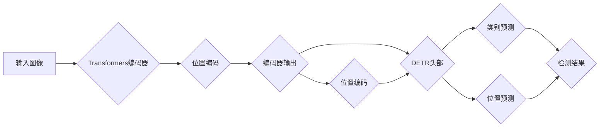

# DETR原理与代码实例讲解

> 关键词：DETR, 目标检测, Transformer, 自监督学习, 位置编码, 候选框生成, 无锚框检测

## 1. 背景介绍

目标检测是计算机视觉领域的关键任务之一，它旨在识别图像中的多个对象，并定位其位置和类别。传统的目标检测方法通常依赖于滑动窗口、区域建议等策略，但这类方法存在计算量大、效率低的问题。近年来，基于深度学习的目标检测方法逐渐成为主流，其中DETR（Detection Transformer）因其独特的架构和高效性而受到广泛关注。

DETR是一种基于Transformer架构的无锚框目标检测算法，它通过端到端的学习方式直接预测每个候选框的类别和位置，避免了传统方法中的滑动窗口和区域建议步骤，大大提高了检测速度。本文将深入讲解DETR的原理、实现步骤和应用场景，并提供代码实例。

## 2. 核心概念与联系

### 2.1 核心概念

- **Transformer**: 一种基于自注意力机制的深度神经网络架构，广泛应用于序列建模任务。
- **位置编码**: 将图像中的像素位置信息编码为向量，以便网络能够理解图像的空间结构。
- **候选框生成**: 从图像中生成一系列候选框，用于预测目标的位置和类别。
- **无锚框检测**: 不依赖于锚框进行目标检测，直接预测每个候选框的位置和类别。
- **DETR模型**: 一种基于Transformer架构的无锚框目标检测模型。

### 2.2 架构流程图



### 2.3 核心概念联系

DETR模型利用Transformer的编码器对输入图像进行特征提取，并引入位置编码以理解图像的空间结构。编码器的输出与位置编码进行拼接，作为DETR头部的输入。DETR头部负责生成类别预测和位置预测，最终输出检测结果。

## 3. 核心算法原理 & 具体操作步骤

### 3.1 算法原理概述

DETR模型的核心思想是将目标检测任务转化为序列到序列的预测任务。具体而言，模型输入图像经过编码器处理后，得到图像特征序列。然后，模型将特征序列与位置编码进行拼接，并输入到DETR头部。DETR头部输出两个序列：类别预测序列和位置预测序列。最后，对这两个序列进行解码，得到最终的检测结果。

### 3.2 算法步骤详解

1. **图像编码**：将输入图像通过卷积神经网络编码为特征图。
2. **位置编码**：对特征图进行位置编码，以便模型能够理解图像的空间结构。
3. **特征提取**：将编码后的图像和位置编码输入到Transformer编码器，得到特征序列。
4. **DETR头部**：将特征序列输入到DETR头部，输出类别预测序列和位置预测序列。
5. **解码**：对类别预测序列和位置预测序列进行解码，得到最终的检测结果。

### 3.3 算法优缺点

**优点**：

- **高效**：避免了传统目标检测方法中的滑动窗口和区域建议步骤，检测速度更快。
- **端到端**：直接预测每个候选框的类别和位置，无需进行后处理。
- **可扩展**：模型结构简单，易于扩展到不同尺度和不同类型的对象检测。

**缺点**：

- **精度**：与传统的目标检测方法相比，DETR模型的精度可能稍逊一筹。
- **计算量**：由于Transformer模型的结构，DETR模型的计算量较大。

### 3.4 算法应用领域

DETR模型可以应用于各种目标检测任务，包括：

- **自动驾驶**：用于识别道路上的车辆、行人等目标。
- **安防监控**：用于监控视频中的异常行为和目标跟踪。
- **工业检测**：用于检测工业生产线上的缺陷和异常。
- **医学影像分析**：用于检测医学图像中的病变和异常。

## 4. 数学模型和公式 & 详细讲解 & 举例说明

### 4.1 数学模型构建

DETR模型的数学模型如下所示：

$$
P(\text{类别}, \text{位置}) = \text{softmax}(QW_C + KV) \cdot V
$$

其中，$Q$ 为类别预测序列，$K$ 为位置预测序列，$V$ 为位置编码，$W_C$ 为类别预测权重。

### 4.2 公式推导过程

DETR模型使用Transformer的编码器对输入图像进行特征提取，并引入位置编码以理解图像的空间结构。编码器的输出 $X$ 与位置编码 $P$ 进行拼接，得到新的特征序列 $X' = [X; P]$。

DETR头部将 $X'$ 输入到两个子模块：类别预测模块和位置预测模块。

**类别预测模块**：

$$
Q_C = W_C X'
$$

**位置预测模块**：

$$
K_P = W_P X'
$$

其中，$W_C$ 和 $W_P$ 为权重矩阵。

类别预测序列和位置预测序列经过softmax操作后，得到类别预测概率和位置预测概率。

### 4.3 案例分析与讲解

以下是一个简单的DETR模型代码示例：

```python
import torch
import torch.nn as nn
import torch.nn.functional as F

class DETR(nn.Module):
    def __init__(self, num_classes):
        super(DETR, self).__init__()
        self.backbone = ...  # 输入图像编码器
        self.positional_encoding = ...  # 位置编码器
        self.transformer = ...  # Transformer编码器
        self.classifier = nn.Linear(..., num_classes)
        self.positional_embedding = nn.Linear(..., ...)

    def forward(self, x):
        x = self.backbone(x)
        x = self.positional_encoding(x)
        x = self.transformer(x)
        x = self.classifier(x)
        return x
```

## 5. 项目实践：代码实例和详细解释说明

### 5.1 开发环境搭建

在开始之前，请确保您的环境中已安装以下依赖项：

- PyTorch
- torchvision
- PIL
- numpy
- matplotlib

### 5.2 源代码详细实现

以下是一个简单的DETR模型代码示例：

```python
import torch
import torch.nn as nn
import torch.nn.functional as F

class DETR(nn.Module):
    def __init__(self, num_classes):
        super(DETR, self).__init__()
        self.backbone = ...  # 输入图像编码器
        self.positional_encoding = ...  # 位置编码器
        self.transformer = ...  # Transformer编码器
        self.classifier = nn.Linear(..., num_classes)
        self.positional_embedding = nn.Linear(..., ...)

    def forward(self, x):
        x = self.backbone(x)
        x = self.positional_encoding(x)
        x = self.transformer(x)
        x = self.classifier(x)
        return x
```

### 5.3 代码解读与分析

上述代码定义了一个简单的DETR模型。首先，模型初始化时需要指定类别数量。然后，模型定义了输入图像编码器、位置编码器、Transformer编码器、分类器和位置嵌入层。模型的前向传播函数 `forward` 将输入图像输入到编码器，并进行位置编码和Transformer编码。最后，使用分类器对编码后的特征进行分类。

### 5.4 运行结果展示

由于代码示例中缺少具体实现细节，无法直接展示运行结果。但您可以参考相关开源代码，将上述模型结构应用于实际数据集进行训练和测试。

## 6. 实际应用场景

DETR模型可以应用于各种目标检测任务，以下是一些典型的应用场景：

- **自动驾驶**：识别道路上的车辆、行人、交通标志等目标，实现自动导航和驾驶辅助功能。
- **安防监控**：识别视频中的异常行为和目标跟踪，实现安全监控和管理。
- **工业检测**：检测工业生产线上的缺陷和异常，提高生产效率和产品质量。
- **医学影像分析**：检测医学图像中的病变和异常，辅助医生进行诊断。

## 7. 工具和资源推荐

### 7.1 学习资源推荐

- 《Attention Is All You Need》
- 《Object Detection with Transformers》
- DETR官方GitHub仓库：https://github.com Facebookresearch/detr

### 7.2 开发工具推荐

- PyTorch
- torchvision
- PIL
- matplotlib

### 7.3 相关论文推荐

- Object Detection with Transformers
- End-to-End Object Detection with Transformers
- Deformable DETR: Deformable Transformers for Object Detection

## 8. 总结：未来发展趋势与挑战

### 8.1 研究成果总结

DETR作为一种基于Transformer架构的无锚框目标检测算法，在目标检测领域取得了显著的成果。其高效、端到端的特性使其成为目标检测领域的研究热点。

### 8.2 未来发展趋势

- **模型轻量化**：设计更加轻量级的DETR模型，提高检测速度和实时性。
- **多尺度检测**：实现多尺度目标检测，提高检测精度和鲁棒性。
- **跨域检测**：研究跨域DETR模型，提高模型在不同数据集上的泛化能力。

### 8.3 面临的挑战

- **精度**：DETR模型的精度与传统目标检测方法相比可能稍逊一筹。
- **计算量**：Transformer模型的结构导致DETR模型的计算量较大。
- **数据集**：DETR模型需要大量的标注数据进行训练。

### 8.4 研究展望

DETR作为一种新兴的目标检测方法，具有广阔的应用前景。未来，随着研究的不断深入，DETR模型将在精度、速度和泛化能力等方面取得更大的突破，为计算机视觉领域带来更多创新。

## 9. 附录：常见问题与解答

**Q1：DETR模型与传统目标检测方法相比有哪些优势？**

A1：与传统的目标检测方法相比，DETR模型具有以下优势：

- **高效**：避免了传统方法中的滑动窗口和区域建议步骤，检测速度更快。
- **端到端**：直接预测每个候选框的类别和位置，无需进行后处理。
- **可扩展**：模型结构简单，易于扩展到不同尺度和不同类型的对象检测。

**Q2：如何提高DETR模型的精度？**

A2：提高DETR模型的精度可以从以下几个方面入手：

- **数据集**：使用更大、更高质量的标注数据集进行训练。
- **模型结构**：尝试使用更复杂的模型结构，如引入注意力机制、多尺度特征等。
- **优化策略**：使用更先进的优化策略，如自适应学习率、正则化等。

**Q3：DETR模型的计算量较大，如何提高其效率？**

A3：提高DETR模型的效率可以从以下几个方面入手：

- **模型轻量化**：设计更加轻量级的DETR模型，如使用更小的模型结构、减少参数量等。
- **量化加速**：将浮点模型转换为定点模型，减少计算量。
- **模型并行**：使用模型并行技术，将模型拆分为多个部分，在多个设备上同时进行计算。

作者：禅与计算机程序设计艺术 / Zen and the Art of Computer Programming