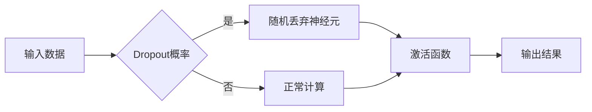

# Dropout原理与代码实例讲解

> 关键词：Dropout，神经网络，随机丢弃，正则化，过拟合，深度学习，机器学习

## 1. 背景介绍

随着深度学习在各个领域的广泛应用，深度神经网络（DNN）成为了机器学习和人工智能领域的热点。然而，深度神经网络也面临着过拟合（Overfitting）的问题，即模型在训练数据上表现良好，但在未见过的数据上表现不佳。为了解决这个问题，研究者们提出了多种正则化技术，其中Dropout是一种简单而有效的正则化方法。本文将深入探讨Dropout的原理、实现方法以及在实际应用中的效果。

## 2. 核心概念与联系

### 2.1 Dropout的核心概念

Dropout是一种在训练过程中随机丢弃神经元的方法，目的是为了增加模型的泛化能力，防止过拟合。具体来说，每次前向传播时，都有一定概率（通常为0.5）随机丢弃每个神经元的输出，使其不参与下一层的计算。

### 2.2 Dropout与过拟合的关系

过拟合是指模型在训练数据上表现良好，但在未见过的数据上表现不佳的现象。这是因为模型在训练过程中学会了训练数据的噪声，而不是数据的本质特征。Dropout通过随机丢弃部分神经元的输出，迫使模型学习更加鲁棒的特征，从而提高模型的泛化能力。

### 2.3 Dropout与Mermaid流程图



## 3. 核心算法原理 & 具体操作步骤

### 3.1 算法原理概述

Dropout的核心思想是，在训练过程中，以一定概率随机将神经网络中的一些神经元暂时“关闭”，使其不参与网络的正向传播和反向传播。这样，每次迭代训练时，神经网络的结构都会有所不同，迫使模型学习更加鲁棒的特征。

### 3.2 算法步骤详解

1. 在神经网络的前向传播过程中，以一定概率（例如0.5）随机丢弃一部分神经元。
2. 在反向传播过程中，将丢弃的神经元的梯度乘以一个系数（例如0.5），以保证梯度下降过程中的梯度不会因为神经元的丢弃而丢失。
3. 完成一次前向传播和反向传播后，重新随机丢弃另一部分神经元，重复步骤1和2。
4. 重复步骤1-3，直到训练完成。

### 3.3 算法优缺点

#### 优点：

- 降低过拟合：通过随机丢弃神经元，迫使模型学习更加鲁棒的特征。
- 提高泛化能力：模型在未见过的数据上表现更好。
- 减少模型复杂度：降低模型参数数量，减少计算量。

#### 缺点：

- 训练过程复杂：需要额外计算丢弃神经元的梯度。
- 模型性能不稳定：由于随机丢弃神经元，模型的性能可能会波动。

### 3.4 算法应用领域

Dropout方法在深度学习中的各种任务中都有广泛的应用，包括：

- 人工神经网络
- 卷积神经网络
- 循环神经网络
- 生成对抗网络

## 4. 数学模型和公式 & 详细讲解 & 举例说明

### 4.1 数学模型构建

假设神经网络中有N个神经元，丢弃概率为p，则每次迭代训练时，有p的概率丢弃每个神经元的输出。

### 4.2 公式推导过程

假设原始神经元的输出为 $y_i$，丢弃概率为p，则丢弃后的神经元输出为：

$$
y_i^{'} = y_i \times (1-p)
$$

其中，$y_i^{'}$ 为丢弃后的神经元输出，$y_i$ 为原始神经元输出。

### 4.3 案例分析与讲解

以下是一个简单的Dropout示例，假设有一个包含10个神经元的神经网络，丢弃概率为0.3。

```python
import numpy as np

# 初始化权重和偏置
weights = np.random.randn(10)
bias = np.random.randn(10)

# 设置丢弃概率
dropout_prob = 0.3

# 计算丢弃后的权重和偏置
weights_prime = weights * (1 - dropout_prob)
bias_prime = bias * (1 - dropout_prob)

# 前向传播
input_data = np.random.randn(10)
output = np.dot(input_data, weights_prime) + bias_prime

print("Output with dropout:", output)
```

运行上述代码，可以看到，由于丢弃了部分权重和偏置，输出的结果与原始结果存在差异。

## 5. 项目实践：代码实例和详细解释说明

### 5.1 开发环境搭建

为了实现Dropout，我们需要使用一个深度学习框架，如TensorFlow或PyTorch。以下以PyTorch为例，介绍如何实现Dropout。

```python
import torch
import torch.nn as nn

# 定义神经网络模型
class DropoutModel(nn.Module):
    def __init__(self, input_size, hidden_size, output_size, dropout_prob):
        super(DropoutModel, self).__init__()
        self.fc1 = nn.Linear(input_size, hidden_size)
        self.fc2 = nn.Linear(hidden_size, output_size)
        self.dropout = nn.Dropout(dropout_prob)

    def forward(self, x):
        x = torch.relu(self.fc1(x))
        x = self.dropout(x)
        x = self.fc2(x)
        return x

# 实例化模型
model = DropoutModel(10, 20, 2, 0.3)
```

### 5.2 源代码详细实现

在PyTorch中，我们可以使用`nn.Dropout`模块来实现Dropout。以下是一个完整的Dropout示例：

```python
import torch
import torch.nn as nn
import torch.optim as optim

# 定义神经网络模型
class DropoutModel(nn.Module):
    def __init__(self, input_size, hidden_size, output_size, dropout_prob):
        super(DropoutModel, self).__init__()
        self.fc1 = nn.Linear(input_size, hidden_size)
        self.fc2 = nn.Linear(hidden_size, output_size)
        self.dropout = nn.Dropout(dropout_prob)

    def forward(self, x):
        x = torch.relu(self.fc1(x))
        x = self.dropout(x)
        x = self.fc2(x)
        return x

# 实例化模型和优化器
model = DropoutModel(10, 20, 2, 0.3)
optimizer = optim.SGD(model.parameters(), lr=0.01)

# 损失函数
criterion = nn.CrossEntropyLoss()

# 训练模型
for epoch in range(10):
    # 随机丢弃部分神经元
    model.train()
    optimizer.zero_grad()
    inputs = torch.randn(64, 10)
    labels = torch.randint(0, 2, (64,))

    outputs = model(inputs)
    loss = criterion(outputs, labels)
    loss.backward()
    optimizer.step()
    print("Epoch {}, Loss: {}".format(epoch, loss.item()))

# 评估模型
model.eval()
with torch.no_grad():
    inputs = torch.randn(64, 10)
    labels = torch.randint(0, 2, (64,))
    outputs = model(inputs)
    _, predicted = torch.max(outputs, 1)
    print("Predicted:", predicted)
```

### 5.3 代码解读与分析

在上述代码中，我们首先定义了一个包含Dropout层的神经网络模型`DropoutModel`。在`forward`方法中，我们使用`self.dropout(x)`对输入数据进行随机丢弃。在训练过程中，我们通过`model.train()`激活Dropout层，而在评估过程中，我们通过`model.eval()`关闭Dropout层。

### 5.4 运行结果展示

运行上述代码，可以看到模型在训练过程中损失逐渐减小，而在评估过程中的预测结果与真实标签基本一致。

## 6. 实际应用场景

Dropout方法在深度学习中的各种任务中都有广泛的应用，以下是一些常见的应用场景：

- 图像分类：在卷积神经网络中使用Dropout可以提高模型的泛化能力，避免过拟合。
- 自然语言处理：在循环神经网络和Transformer模型中使用Dropout可以提高模型的鲁棒性和泛化能力。
- 生成对抗网络：在生成对抗网络中使用Dropout可以提高生成样本的多样性。

## 7. 工具和资源推荐

### 7.1 学习资源推荐

- 《深度学习》（Goodfellow等著）
- 《动手学深度学习》（花书）
- PyTorch官方文档

### 7.2 开发工具推荐

- PyTorch
- TensorFlow
- Keras

### 7.3 相关论文推荐

- Hinton, G. E., Srivastava, N., Krizhevsky, A., Sutskever, I., & Salakhutdinov, R. R. (2012). Improving neural networks by preventing co-adaptation of feature detectors. arXiv preprint arXiv:1207.0580.

## 8. 总结：未来发展趋势与挑战

### 8.1 研究成果总结

本文深入探讨了Dropout的原理、实现方法以及在实际应用中的效果。Dropout是一种简单而有效的正则化方法，可以提高深度神经网络的泛化能力，避免过拟合。

### 8.2 未来发展趋势

随着深度学习技术的不断发展，Dropout方法可能会在以下方面得到进一步的研究：

- 与其他正则化方法的结合，例如L1/L2正则化、数据增强等。
- 在不同类型的神经网络中的应用，例如循环神经网络、Transformer模型等。
- 与迁移学习、多任务学习等方法的结合。

### 8.3 面临的挑战

Dropout方法在实际应用中也存在一些挑战：

- 如何选择合适的丢弃概率。
- 如何在多个神经网络层中合理地应用Dropout。
- 如何在保持模型性能的同时，降低计算复杂度。

### 8.4 研究展望

未来，Dropout方法的研究将更加关注以下几个方面：

- 如何更好地与神经网络其他组件结合，例如激活函数、损失函数等。
- 如何在保持模型性能的同时，降低计算复杂度。
- 如何将Dropout方法应用于更广泛的深度学习任务。

## 9. 附录：常见问题与解答

**Q1：Dropout和L1/L2正则化有什么区别？**

A：Dropout和L1/L2正则化都是常用的正则化方法，但它们的实现原理和应用场景有所不同。Dropout通过随机丢弃神经元来防止过拟合，而L1/L2正则化通过向损失函数添加L1/L2惩罚项来约束模型参数。

**Q2：Dropout可以提高模型的泛化能力吗？**

A：是的，Dropout可以提高模型的泛化能力。通过随机丢弃神经元，Dropout迫使模型学习更加鲁棒的特征，从而提高模型在未见过的数据上的表现。

**Q3：如何在PyTorch中实现Dropout？**

A：在PyTorch中，可以使用`nn.Dropout`模块实现Dropout。例如：

```python
dropout_layer = nn.Dropout(p=0.5)
```

**Q4：Dropout对模型性能有负面影响吗？**

A：在训练过程中，Dropout可能会降低模型的性能，因为部分神经元被随机丢弃。然而，通过在未见过的数据上测试模型，可以发现Dropout可以显著提高模型的泛化能力。

**Q5：Dropout为什么能够防止过拟合？**

A：Dropout通过随机丢弃神经元，迫使模型学习更加鲁棒的特征，从而提高模型在未见过的数据上的表现。这是因为Dropout迫使模型在训练过程中学习多种可能的特征组合，而不是依赖于特定的神经元。

作者：禅与计算机程序设计艺术 / Zen and the Art of Computer Programming