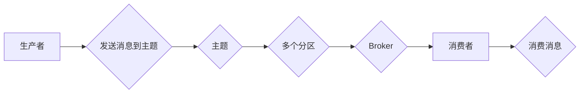

# Kafka生产者消费者API原理与代码实例讲解

> 关键词：Apache Kafka, 事件流平台, 生产者, 消费者, API, 分布式消息队列, 高吞吐量, 消息传递, 原理讲解, 代码实例

## 1. 背景介绍

Apache Kafka是一个开源的流处理平台，由LinkedIn开发，目前由Apache软件基金会管理。Kafka提供了高吞吐量的发布-订阅消息系统，广泛应用于大数据、实时分析和流处理场景。Kafka的核心特性包括高吞吐量、可扩展性、持久性、容错性以及灵活的消息存储和检索机制。本文将深入讲解Kafka的生产者消费者API原理，并通过代码实例进行实践讲解。

### 1.1 问题的由来

随着互联网的快速发展，企业需要处理的数据量呈指数级增长，传统的数据处理方式已经无法满足需求。为了解决高并发、高吞吐量的数据处理问题，分布式消息队列应运而生。Kafka作为一种高性能的分布式消息队列，能够有效地解决这些问题。

### 1.2 研究现状

Kafka自2011年开源以来，已经成为了大数据生态中不可或缺的一部分。许多公司都在使用Kafka来实现数据的实时处理和分析。Kafka的生产者消费者API提供了丰富的功能，使得用户可以轻松地构建分布式系统。

### 1.3 研究意义

理解Kafka的生产者消费者API原理对于构建高效、可扩展的分布式系统至关重要。通过本文的学习，读者可以：

- 掌握Kafka的基本概念和架构
- 理解生产者消费者API的工作原理
- 学习如何使用Java API创建和生产消息
- 学习如何使用Java API消费消息
- 了解Kafka在实际应用中的场景

### 1.4 本文结构

本文将按照以下结构进行讲解：

- 第2章将介绍Kafka的核心概念与联系，并通过Mermaid流程图展示Kafka的架构。
- 第3章将深入讲解Kafka生产者消费者API的核心算法原理和具体操作步骤。
- 第4章将介绍Kafka的数学模型和公式，并结合实例进行讲解。
- 第5章将通过代码实例展示如何使用Kafka的生产者消费者API。
- 第6章将探讨Kafka在实际应用中的场景和未来应用展望。
- 第7章将推荐相关学习资源、开发工具和参考文献。
- 第8章将总结研究成果，展望未来发展趋势与挑战。
- 第9章将提供常见问题的解答。

## 2. 核心概念与联系

### 2.1 核心概念

- **主题（Topic）**：Kafka中的消息分类，类似于数据库中的表。
- **分区（Partition）**：每个主题可以划分为多个分区，分区是Kafka消息存储和检索的基本单元。
- **生产者（Producer）**：负责生产消息并将消息发送到Kafka的节点。
- **消费者（Consumer）**：从Kafka中读取消息并消费消息的应用程序。
- **Broker**：Kafka的服务器，存储主题数据，处理客户端请求。
- **集群（Cluster）**：一组Broker组成的Kafka服务实例。

### 2.2 Mermaid流程图



### 2.3 联系

Kafka集群由多个Broker组成，每个Broker负责存储主题的某些分区。生产者将消息发送到特定的主题，Kafka将消息分配到不同的分区中。消费者可以从这些分区中消费消息。

## 3. 核心算法原理 & 具体操作步骤

### 3.1 算法原理概述

Kafka的生产者消费者API通过以下步骤实现消息的发送和接收：

1. 生产者将消息序列化成字节流。
2. 生产者将消息发送到指定的主题。
3. Kafka将消息存储到对应的分区中。
4. 消费者从分区中读取消息。
5. 消费者反序列化消息并处理。

### 3.2 算法步骤详解

1. **生产者步骤**：
    - 序列化消息。
    - 创建KafkaProducer实例。
    - 使用send()方法发送消息到主题。
    - 关闭KafkaProducer实例。

2. **消费者步骤**：
    - 创建KafkaConsumer实例。
    - 创建一个ConsumerRebalanceListener来处理分区分配和偏移量更新。
    - 订阅主题。
    - 从分区中消费消息。
    - 处理消息并提交偏移量。

### 3.3 算法优缺点

**优点**：

- **高吞吐量**：Kafka能够处理高并发消息。
- **可扩展性**：Kafka可以通过增加Broker来水平扩展。
- **持久性**：Kafka保证消息的持久性，即使在系统故障的情况下也不会丢失。
- **容错性**：Kafka能够处理Broker故障，确保系统的高可用性。

**缺点**：

- **复杂性**：Kafka的配置复杂，需要仔细配置才能达到最佳性能。
- **数据延迟**：Kafka的消息处理可能存在一定的延迟。

### 3.4 算法应用领域

Kafka在生产、日志记录、流处理、实时分析等领域都有广泛的应用。

## 4. 数学模型和公式 & 详细讲解 & 举例说明

### 4.1 数学模型构建

Kafka的消息传递过程可以用以下数学模型表示：

$$
P(\text{消息从生产者到达Broker}) = f(\text{网络延迟})
$$

$$
P(\text{消息从Broker到达消费者}) = f(\text{网络延迟} + \text{处理延迟})
$$

### 4.2 公式推导过程

消息传递的概率可以通过网络延迟和处理延迟的加法规则进行推导。

### 4.3 案例分析与讲解

假设生产者发送消息到Kafka，网络延迟为100ms，处理延迟为50ms。根据上述公式，消息从生产者到达Broker的概率为：

$$
P(\text{消息从生产者到达Broker}) = f(100ms + 50ms) = f(150ms)
$$

## 5. 项目实践：代码实例和详细解释说明

### 5.1 开发环境搭建

在开始之前，请确保你已经安装了Java和Kafka。

### 5.2 源代码详细实现

以下是使用Java API创建生产者和消费者的示例代码：

```java
// 生产者示例
Properties props = new Properties();
props.put("bootstrap.servers", "localhost:9092");
props.put("key.serializer", "org.apache.kafka.common.serialization.StringSerializer");
props.put("value.serializer", "org.apache.kafka.common.serialization.StringSerializer");

KafkaProducer<String, String> producer = new KafkaProducer<>(props);

String topic = "test-topic";
String data = "Hello, Kafka!";
producer.send(new ProducerRecord<>(topic, data));
producer.close();

// 消费者示例
Properties props = new Properties();
props.put("bootstrap.servers", "localhost:9092");
props.put("group.id", "test-group");
props.put("key.deserializer", "org.apache.kafka.common.serialization.StringDeserializer");
props.put("value.deserializer", "org.apache.kafka.common.serialization.StringDeserializer");

KafkaConsumer<String, String> consumer = new KafkaConsumer<>(props);
consumer.subscribe(Collections.singletonList("test-topic"));

while (true) {
    ConsumerRecord<String, String> record = consumer.poll(Duration.ofMillis(100));
    if (record.value() != null) {
        System.out.printf("offset = %d, key = %s, value = %s%n", record.offset(), record.key(), record.value());
    }
}

consumer.close();
```

### 5.3 代码解读与分析

- **生产者示例**：创建KafkaProducer实例，设置BootstrapServers、KeySerializer和ValueSerializer，然后发送消息到指定的主题。
- **消费者示例**：创建KafkaConsumer实例，设置BootstrapServers、GroupID、KeyDeserializer和ValueDeserializer，然后订阅主题并消费消息。

### 5.4 运行结果展示

运行上述代码后，生产者将消息发送到Kafka，消费者将从主题中消费消息并打印出来。

## 6. 实际应用场景

Kafka在生产、日志记录、流处理、实时分析等领域都有广泛的应用。

- **生产**：Kafka可以用于处理实时事件流，如用户行为数据、交易数据等。
- **日志记录**：Kafka可以用于收集和存储日志数据，便于后续分析和监控。
- **流处理**：Kafka可以作为流处理平台的基础，与其他流处理框架（如Apache Flink和Apache Storm）集成使用。
- **实时分析**：Kafka可以用于实时数据分析，如实时监控系统性能、用户行为分析等。

## 7. 工具和资源推荐

### 7.1 学习资源推荐

- Kafka官方文档：[https://kafka.apache.org/documentation.html](https://kafka.apache.org/documentation.html)
- 《Kafka权威指南》：[https://github.com/digoal/Kafka-Book](https://github.com/digoal/Kafka-Book)
- 《Kafka in Action》：[https://www.manning.com/books/kafka-in-action](https://www.manning.com/books/kafka-in-action)

### 7.2 开发工具推荐

- IntelliJ IDEA：[https://www.jetbrains.com/idea/](https://www.jetbrains.com/idea/)
- Eclipse：[https://www.eclipse.org/](https://www.eclipse.org/)

### 7.3 相关论文推荐

- **The Lambda Architecture**：[https://www.lambdatesting.com/blog/lambda-architecture/](https://www.lambdatesting.com/blog/lambda-architecture/)
- **The Design of the Data Flow Platform Apache Kafka**：[https://www.eecs.berkeley.edu/Pubs/TechRpts/2013/EECS-2013-5.pdf](https://www.eecs.berkeley.edu/Pubs/TechRpts/2013/EECS-2013-5.pdf)

## 8. 总结：未来发展趋势与挑战

### 8.1 研究成果总结

本文深入讲解了Kafka的生产者消费者API原理，并通过代码实例进行了实践讲解。读者通过本文的学习，可以掌握Kafka的基本概念、架构、API以及应用场景。

### 8.2 未来发展趋势

- **多语言支持**：Kafka将继续支持更多的编程语言，如Python、Go等。
- **更丰富的功能**：Kafka将引入更多功能，如实时索引、分区管理、跨数据中心的复制等。
- **与云服务的集成**：Kafka将与云服务提供商（如AWS、Azure、Google Cloud）集成，提供更便捷的服务。

### 8.3 面临的挑战

- **性能优化**：Kafka需要进一步提高性能，以满足更多高吞吐量场景的需求。
- **安全性**：Kafka需要加强安全性，以保护数据免受攻击。
- **可扩展性**：Kafka需要更好地适应云原生环境，以实现无缝扩展。

### 8.4 研究展望

Kafka将继续作为分布式消息队列领域的领导者，推动技术的发展和创新。未来，Kafka将在更多领域得到应用，为构建实时、高效、可扩展的分布式系统提供重要支持。

## 9. 附录：常见问题与解答

**Q1：什么是Kafka的主题？**

A：Kafka中的主题类似于数据库中的表，是消息的分类。

**Q2：Kafka如何保证消息的顺序性？**

A：Kafka通过将消息发送到同一个分区内来保证消息的顺序性。

**Q3：Kafka如何保证消息的可靠性？**

A：Kafka通过副本机制和日志持久化来保证消息的可靠性。

**Q4：Kafka适用于哪些场景？**

A：Kafka适用于生产、日志记录、流处理、实时分析等场景。

**Q5：如何选择Kafka的分区数？**

A：分区数的选择取决于数据量和并发量，一般建议根据数据量和并发量进行合理分配。

作者：禅与计算机程序设计艺术 / Zen and the Art of Computer Programming