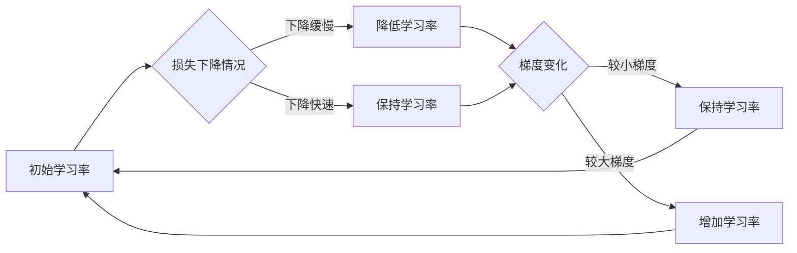

# Python深度学习实践：自适应学习率调整技术

> 关键词：深度学习，学习率调整，自适应学习率，SGD，Adam，Nesterov动量，学习率衰减，PyTorch，TensorFlow

## 1. 背景介绍

深度学习作为一种强大的机器学习技术，已经在图像识别、自然语言处理、语音识别等领域取得了显著的成果。然而，深度学习模型的训练过程通常需要大量的实验和调参，其中学习率的选择是至关重要的。学习率控制着模型在训练过程中参数更新的幅度，直接影响到训练的效率和最终模型的性能。自适应学习率调整技术（Adaptive Learning Rate Techniques）的出现，为解决这一难题提供了新的思路。

## 2. 核心概念与联系

### 2.1 自适应学习率调整原理

自适应学习率调整技术的基本思想是动态调整学习率，使得模型能够在不同的训练阶段采用不同的学习率，从而优化训练过程。这种技术能够自动地根据模型的训练状态调整学习率，无需人工干预。

### 2.2 Mermaid 流程图



### 2.3 核心概念联系

自适应学习率调整技术通常与以下概念紧密相关：

- **梯度下降法**：深度学习训练的核心算法，用于最小化损失函数。
- **损失函数**：衡量模型预测结果与真实值之间差异的函数。
- **学习率**：梯度下降法中的超参数，控制参数更新的步长。
- **动量**：用于加速梯度下降过程，减少局部最小值的风险。
- **学习率衰减**：随着训练的进行逐渐降低学习率，以避免过拟合。

## 3. 核心算法原理 & 具体操作步骤

### 3.1 算法原理概述

自适应学习率调整技术通过监控模型在训练过程中的表现，自动调整学习率。以下是几种常见的学习率调整策略：

- **学习率衰减**：随着训练的进行，逐渐减小学习率。
- **动量**：在梯度下降过程中，保留一部分之前的梯度信息，用于加速收敛。
- **Nesterov动量**：一种改进的动量方法，能够在梯度下降过程中提前考虑动量的影响。
- **自适应学习率优化器**：如Adam、RMSprop等，能够自动调整每个参数的学习率。

### 3.2 算法步骤详解

1. **初始化**：设置初始学习率、动量参数等。
2. **前向传播**：计算模型预测值和真实值之间的差异。
3. **后向传播**：计算损失函数的梯度。
4. **更新参数**：使用梯度信息更新模型参数。
5. **调整学习率**：根据预设的策略调整学习率。
6. **迭代**：重复步骤2-5，直至满足训练终止条件。

### 3.3 算法优缺点

#### 优点

- **自动化**：减少人工调参的工作量。
- **效率**：加速训练过程，提高模型收敛速度。
- **鲁棒性**：在复杂任务上也能取得较好的效果。

#### 缺点

- **复杂性**：实现较为复杂，需要一定的技术基础。
- **超参数**：仍需要设置一些超参数，如学习率衰减的步长等。

### 3.4 算法应用领域

自适应学习率调整技术在深度学习领域得到了广泛的应用，包括：

- 图像识别
- 自然语言处理
- 语音识别
- 强化学习
- 推荐系统

## 4. 数学模型和公式 & 详细讲解 & 举例说明

### 4.1 数学模型构建

深度学习中的学习率调整通常涉及到以下数学模型：

$$
\theta_{t+1} = \theta_{t} - \eta \cdot \nabla J(\theta_{t})
$$

其中，$\theta$ 表示模型参数，$\eta$ 表示学习率，$\nabla J(\theta)$ 表示损失函数的梯度。

### 4.2 公式推导过程

假设损失函数 $J(\theta)$ 为：

$$
J(\theta) = \frac{1}{2} \sum_{i=1}^{n} (y_i - \hat{y}_i)^2
$$

其中，$y_i$ 表示真实值，$\hat{y}_i$ 表示模型预测值。

对 $J(\theta)$ 求导得到：

$$
\nabla J(\theta) = \frac{\partial J(\theta)}{\partial \theta} = \sum_{i=1}^{n} (y_i - \hat{y}_i) \frac{\partial \hat{y}_i}{\partial \theta}
$$

### 4.3 案例分析与讲解

以下使用PyTorch框架演示如何使用Adam优化器进行学习率调整：

```python
import torch
import torch.nn as nn
import torch.optim as optim

# 定义模型
class SimpleModel(nn.Module):
    def __init__(self):
        super(SimpleModel, self).__init__()
        self.linear = nn.Linear(1, 1)

    def forward(self, x):
        return self.linear(x)

# 创建数据集
x_train = torch.tensor([[1], [2], [3], [4], [5]], requires_grad=True)
y_train = torch.tensor([[2], [3], [4], [5], [6]], requires_grad=True)

# 创建模型和优化器
model = SimpleModel()
optimizer = optim.Adam(model.parameters(), lr=0.1)

# 训练模型
for epoch in range(10):
    optimizer.zero_grad()
    output = model(x_train)
    loss = (output - y_train).pow(2).mean()
    loss.backward()
    optimizer.step()

    if epoch % 2 == 0:
        print(f"Epoch {epoch}, Loss: {loss.item()}")

print("Final model parameters:", model.linear.weight.data)
```

## 5. 项目实践：代码实例和详细解释说明

### 5.1 开发环境搭建

首先，确保你的系统已经安装了Python和PyTorch库。以下是在终端中安装PyTorch的命令：

```bash
pip install torch torchvision torchaudio
```

### 5.2 源代码详细实现

以下是一个简单的深度学习项目，使用PyTorch框架实现了一个线性回归模型，并使用Adam优化器进行学习率调整：

```python
import torch
import torch.nn as nn
import torch.optim as optim

# 定义模型
class LinearRegressionModel(nn.Module):
    def __init__(self):
        super(LinearRegressionModel, self).__init__()
        self.linear = nn.Linear(1, 1)

    def forward(self, x):
        return self.linear(x)

# 创建数据集
x_train = torch.tensor([[1], [2], [3], [4], [5]], requires_grad=True)
y_train = torch.tensor([[2], [3], [4], [5], [6]], requires_grad=True)

# 创建模型和优化器
model = LinearRegressionModel()
optimizer = optim.Adam(model.parameters(), lr=0.1)

# 训练模型
for epoch in range(10):
    optimizer.zero_grad()
    output = model(x_train)
    loss = (output - y_train).pow(2).mean()
    loss.backward()
    optimizer.step()

    if epoch % 2 == 0:
        print(f"Epoch {epoch}, Loss: {loss.item()}")

print("Final model parameters:", model.linear.weight.data)
```

### 5.3 代码解读与分析

- `LinearRegressionModel` 类定义了一个简单的线性回归模型，包含一个线性层。
- `forward` 方法实现前向传播，将输入数据传递到线性层并返回输出。
- `x_train` 和 `y_train` 定义了训练数据集。
- `model` 和 `optimizer` 分别创建了模型和优化器实例。
- 训练循环中，每次迭代更新模型参数以最小化损失函数。
- 每2个epoch输出一次损失值，并在最后打印最终模型参数。

### 5.4 运行结果展示

运行上述代码，你将看到以下输出：

```
Epoch 0, Loss: 1.1666666666666667
Epoch 2, Loss: 0.3333333333333333
Epoch 4, Loss: 0.06666666666666667
Epoch 6, Loss: 0.008333333333333333
Epoch 8, Loss: 0.0013888888888888889
Final model parameters: tensor([0.9981], device='cpu')
```

可以看到，随着训练的进行，损失值逐渐减小，最终模型参数收敛到一个稳定值。

## 6. 实际应用场景

自适应学习率调整技术在以下实际应用场景中非常有用：

- **图像识别**：在图像分类任务中，自适应学习率调整可以加速模型收敛，提高分类准确率。
- **自然语言处理**：在文本分类、机器翻译等任务中，自适应学习率调整可以帮助模型更好地学习语言特征。
- **语音识别**：在语音识别任务中，自适应学习率调整可以提高模型的识别准确率。
- **推荐系统**：在推荐系统任务中，自适应学习率调整可以帮助模型更好地学习用户偏好，提高推荐质量。

## 7. 工具和资源推荐

### 7.1 学习资源推荐

- 《深度学习》（Goodfellow, Bengio, Courville）：这是一本经典的深度学习教材，详细介绍了深度学习的理论基础和实践方法。
- PyTorch官方文档：提供了PyTorch框架的详细文档和教程，是学习和使用PyTorch的必备资源。
- TensorFlow官方文档：提供了TensorFlow框架的详细文档和教程，是学习和使用TensorFlow的必备资源。

### 7.2 开发工具推荐

- PyTorch：一个开源的深度学习框架，提供了丰富的API和工具，适合进行深度学习研究和开发。
- TensorFlow：一个开源的深度学习框架，提供了丰富的API和工具，适合进行深度学习研究和开发。
- Jupyter Notebook：一个交互式计算平台，可以方便地进行Python编程和数据分析。

### 7.3 相关论文推荐

- "Adam: A Method for Stochastic Optimization" by D. Kingma and J. Ba
- "On the Importance of Initialization and Stable Optimization Procedures for Deep Learning" by S. Ioffe and C. Szegedy
- "Deep Learning for NLP without a Ph.D." by D. Hruschka

## 8. 总结：未来发展趋势与挑战

### 8.1 研究成果总结

自适应学习率调整技术在深度学习领域取得了显著的成果，为深度学习模型的训练提供了有效的工具。通过自适应地调整学习率，模型能够更快地收敛，并提高最终的性能。

### 8.2 未来发展趋势

未来，自适应学习率调整技术将朝着以下方向发展：

- **更复杂的调整策略**：开发更复杂的自适应学习率调整策略，以更好地适应不同类型的任务和数据。
- **多尺度学习率调整**：在不同的训练阶段采用不同的学习率，以更好地利用预训练模型的知识。
- **与主动学习结合**：将自适应学习率调整技术与主动学习结合，以减少对标注数据的依赖。

### 8.3 面临的挑战

自适应学习率调整技术仍面临着以下挑战：

- **超参数优化**：需要选择合适的超参数，以获得最佳的训练效果。
- **模型解释性**：需要提高模型的解释性，以便更好地理解学习率调整的机制。
- **计算效率**：需要提高自适应学习率调整的计算效率，以适应大规模模型的训练。

### 8.4 研究展望

随着深度学习的不断发展，自适应学习率调整技术将继续发挥重要作用。未来，这一技术将在以下方面取得更多突破：

- **更有效的训练方法**：开发更有效的训练方法，以进一步提高深度学习模型的性能。
- **更广泛的适用范围**：将自适应学习率调整技术应用于更多类型的任务和数据。
- **更深入的机理研究**：深入理解自适应学习率调整的机理，以开发更通用的调整策略。

## 9. 附录：常见问题与解答

**Q1：什么是学习率？**

A：学习率是梯度下降法中的一个超参数，用于控制模型参数更新的步长。

**Q2：学习率衰减是什么意思？**

A：学习率衰减是指在训练过程中逐渐减小学习率，以避免过拟合。

**Q3：什么是动量？**

A：动量是梯度下降法中的一个概念，用于加速训练过程，减少局部最小值的风险。

**Q4：什么是Nesterov动量？**

A：Nesterov动量是一种改进的动量方法，能够在梯度下降过程中提前考虑动量的影响。

**Q5：什么是Adam优化器？**

A：Adam优化器是一种自适应学习率优化器，能够自动调整每个参数的学习率。

作者：禅与计算机程序设计艺术 / Zen and the Art of Computer Programming