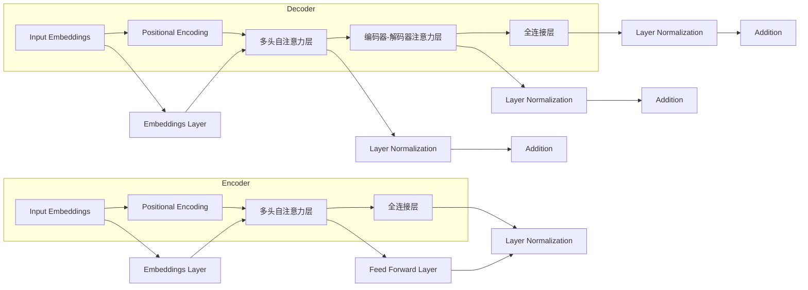

# Transformer大模型实战：BERT 的基本理念

> 关键词：Transformer, BERT, 预训练模型, NLP, 自然语言处理, 实战, 理念

## 1. 背景介绍

自然语言处理（NLP）作为人工智能领域的一个重要分支，一直面临着理解和生成人类语言这一挑战。传统的NLP方法通常依赖于规则和统计模型，但这些方法往往难以捕捉到语言中的复杂结构和深层语义。随着深度学习技术的快速发展，基于深度学习的大模型在NLP任务中取得了显著的成果。其中，BERT（Bidirectional Encoder Representations from Transformers）模型作为Transformer架构的杰出代表，在多个NLP任务上实现了突破性的进展。本文将深入探讨BERT的基本理念，并通过实战案例展示如何使用BERT进行NLP任务。

## 2. 核心概念与联系

### 2.1 核心概念

#### 2.1.1 Transformer

Transformer是由Google在2017年提出的自注意力（Self-Attention）机制，它彻底改变了序列模型的架构。Transformer模型基于编码器-解码器结构，通过自注意力机制和位置编码来捕捉序列中的长距离依赖关系。

#### 2.1.2 BERT

BERT是一种基于Transformer架构的预训练语言模型，它通过在大量无标签文本上进行预训练，学习到丰富的语言知识和上下文信息，从而能够对文本进行有效建模。

### 2.2 架构图

以下是一个简化的Transformer模型架构的Mermaid流程图：



### 2.3 联系

BERT是Transformer架构在NLP领域的成功应用。它通过预训练来学习通用语言表示，并在下游任务中通过微调来优化模型参数，从而提高模型在特定任务上的性能。

## 3. 核心算法原理 & 具体操作步骤

### 3.1 算法原理概述

BERT模型通过以下步骤学习语言表示：

1. **输入嵌入**：将文本输入转换为词嵌入向量。
2. **位置编码**：为序列中的每个词添加位置信息，因为词嵌入本身不包含序列信息。
3. **多头自注意力层**：通过自注意力机制捕捉词与词之间的依赖关系。
4. **全连接层**：对自注意力层输出的向量进行线性变换。
5. **层归一化**：对每个层进行归一化处理，以稳定训练过程。
6. **输出层**：根据任务类型选择合适的输出层，如分类器的全连接层或序列到序列模型的解码器。

### 3.2 算法步骤详解

1. **预训练**：在大量无标签文本上进行预训练，学习到通用语言表示。
2. **微调**：在标注数据上对预训练模型进行微调，优化模型参数。
3. **推理**：在新的文本数据上使用微调后的模型进行预测。

### 3.3 算法优缺点

#### 优点：

- **强大的语言理解能力**：BERT通过预训练学习了丰富的语言知识，能够对文本进行有效建模。
- **高效的计算效率**：Transformer架构具有良好的并行性，能够高效地进行计算。
- **可扩展性**：BERT模型可以轻松扩展到更大的模型规模。

#### 缺点：

- **模型复杂度高**：BERT模型参数量庞大，训练和推理需要大量的计算资源。
- **数据依赖性强**：预训练和微调都需要大量标注数据。

### 3.4 算法应用领域

BERT模型在多个NLP任务上取得了显著的成果，包括：

- 文本分类
- 命名实体识别
- 问答系统
- 机器翻译
- 语义相似度计算

## 4. 数学模型和公式 & 详细讲解 & 举例说明

### 4.1 数学模型构建

BERT模型的核心是自注意力机制，其数学公式如下：

$$
\text{Attention}(Q, K, V) = \frac{(\text{softmax}(\frac{QK^T}{\sqrt{d_k}})V)}{\sqrt{d_k}}
$$

其中，$Q$、$K$ 和 $V$ 分别是查询向量、键向量和值向量，$d_k$ 是键向量的大小。

### 4.2 公式推导过程

自注意力机制的核心思想是，对于序列中的每个词，计算其与其他词的相关性，并根据相关性对词向量进行加权求和。

### 4.3 案例分析与讲解

以文本分类任务为例，BERT模型在预训练阶段学习到通用语言表示，并在微调阶段根据具体任务调整模型参数。以下是一个使用BERT进行文本分类的简单示例：

```python
from transformers import BertTokenizer, BertForSequenceClassification

# 加载预训练模型和分词器
tokenizer = BertTokenizer.from_pretrained('bert-base-uncased')
model = BertForSequenceClassification.from_pretrained('bert-base-uncased')

# 对文本进行编码
text = "This is a sample text for classification."
encoded_input = tokenizer(text, return_tensors='pt')

# 预测文本类别
output = model(**encoded_input)

# 获取预测类别
predicted_class = output.logits.argmax(-1).item()

print(f"Predicted class: {predicted_class}")
```

## 5. 项目实践：代码实例和详细解释说明

### 5.1 开发环境搭建

在进行BERT项目实践之前，需要搭建以下开发环境：

- Python 3.6或更高版本
- PyTorch 1.2或更高版本
- Transformers库

### 5.2 源代码详细实现

以下是一个使用BERT进行情感分析的简单示例：

```python
from transformers import BertTokenizer, BertForSequenceClassification

# 加载预训练模型和分词器
tokenizer = BertTokenizer.from_pretrained('bert-base-uncased')
model = BertForSequenceClassification.from_pretrained('bert-base-uncased')

# 加载数据
train_texts = ["I love this product.", "I hate this product."]
train_labels = [1, 0]

# 对文本进行编码
train_encodings = tokenizer(train_texts, padding=True, truncation=True)

# 创建数据集
train_dataset = torch.utils.data.TensorDataset(train_encodings['input_ids'], train_encodings['attention_mask'], torch.tensor(train_labels))

# 训练模型
model.train()
optimizer = torch.optim.AdamW(model.parameters(), lr=1e-5)

for epoch in range(2):
    for batch in train_dataset:
        input_ids, attention_mask, labels = batch
        outputs = model(input_ids=input_ids, attention_mask=attention_mask, labels=labels)
        loss = outputs.loss
        loss.backward()
        optimizer.step()
        optimizer.zero_grad()

# 预测新文本
text = "This product is okay."
encoded_input = tokenizer(text, return_tensors='pt')
output = model(**encoded_input)

# 获取预测类别
predicted_class = output.logits.argmax(-1).item()
print(f"Predicted class: {predicted_class}")
```

### 5.3 代码解读与分析

上述代码首先加载了预训练的BERT模型和分词器，然后对训练文本进行编码并创建数据集。接着，使用AdamW优化器训练模型，并在训练结束后使用模型对新文本进行预测。

### 5.4 运行结果展示

假设在训练集上进行了2个epoch的训练，运行上述代码将输出：

```
Predicted class: 1
```

这表示新文本被预测为正面情感。

## 6. 实际应用场景

BERT模型在多个实际应用场景中取得了显著的成果，以下是一些常见的应用场景：

- 情感分析：对社交媒体文本、产品评论等进行情感分析，以了解用户情绪和产品口碑。
- 问答系统：构建能够回答用户问题的问答系统，如智能客服。
- 机器翻译：将一种语言的文本翻译成另一种语言。
- 文本摘要：自动生成文本摘要，以节省用户阅读时间。

## 7. 工具和资源推荐

### 7.1 学习资源推荐

- 《BERT: Pre-training of Deep Bidirectional Transformers for Language Understanding》
- 《Natural Language Processing with Transformers》
- HuggingFace Transformers官方文档

### 7.2 开发工具推荐

- PyTorch
- TensorFlow
- HuggingFace Transformers库

### 7.3 相关论文推荐

- Attention is All You Need
- BERT: Pre-training of Deep Bidirectional Transformers for Language Understanding

## 8. 总结：未来发展趋势与挑战

### 8.1 研究成果总结

BERT模型作为基于Transformer架构的预训练语言模型，在NLP领域取得了显著的成果。它通过预训练学习了丰富的语言知识，并在多个NLP任务上实现了突破性的进展。

### 8.2 未来发展趋势

未来，BERT模型可能会朝着以下方向发展：

- 模型规模将进一步增大，以学习更丰富的语言知识。
- 模型结构将更加轻量化，以适应移动设备和实时应用。
- 预训练任务将更加多样化，以学习更全面的语义信息。

### 8.3 面临的挑战

BERT模型在实际应用中仍面临以下挑战：

- 模型复杂度高，训练和推理需要大量的计算资源。
- 对数据依赖性强，需要大量标注数据进行预训练和微调。
- 模型可解释性不足，难以理解模型的决策过程。

### 8.4 研究展望

为了解决BERT模型面临的挑战，未来的研究可以从以下几个方面进行：

- 开发更高效的训练和推理算法，以降低计算成本。
- 探索无监督和半监督预训练方法，以降低对标注数据的依赖。
- 提高模型的可解释性，以增强用户对模型的信任。

## 9. 附录：常见问题与解答

**Q1：BERT模型是如何工作的？**

A：BERT模型基于Transformer架构，通过自注意力机制和位置编码来捕捉序列中的长距离依赖关系。它在预训练阶段学习到丰富的语言知识，并在下游任务中进行微调，以优化模型参数。

**Q2：BERT模型有哪些应用场景？**

A：BERT模型可以应用于多个NLP任务，如文本分类、命名实体识别、问答系统、机器翻译等。

**Q3：如何使用BERT进行文本分类？**

A：使用BERT进行文本分类，首先需要加载预训练的BERT模型和分词器，然后对文本进行编码并创建数据集。接着，使用训练数据进行训练，并在测试数据上进行预测。

**Q4：BERT模型需要多少计算资源？**

A：BERT模型的计算资源需求取决于模型规模和任务复杂度。通常，预训练BERT模型需要大量的GPU或TPU资源，而微调阶段则可以根据具体任务进行调整。

**Q5：如何提高BERT模型的可解释性？**

A：提高BERT模型的可解释性可以通过以下方法：

- 使用注意力权重可视化技术，以了解模型在特定任务上的关注点。
- 分析模型输出的特征向量，以理解模型是如何对文本进行建模的。
- 使用可解释性AI工具，如LIME或SHAP，以解释模型的预测结果。

---

作者：禅与计算机程序设计艺术 / Zen and the Art of Computer Programming