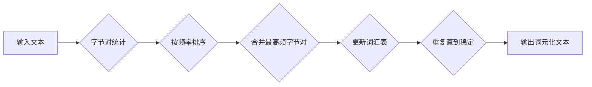

# Transformer大模型实战：使用字节级字节对编码作为子词词元化算法

> 关键词：Transformer, 子词词元化, 字节对编码, 大模型, 预训练, NLP, 自然语言处理

## 1. 背景介绍

自然语言处理（NLP）领域近年来取得了显著的进展，其中Transformer模型的兴起标志着NLP任务处理效率的飞跃。Transformer模型的核心在于其子词词元化（Subword Tokenization）技术，它将词汇分割成更小的单元，使得模型能够处理更长的文本序列。本文将深入探讨使用字节级字节对（Byte Pair Encoding, BPE）作为子词词元化算法的大模型实战，旨在帮助读者理解其原理、实现和应用。

### 1.1 问题的由来

传统的词元化方法，如基于空格的分词，在处理含有大量未知词汇的长文本时存在局限性。例如，在网络文本中，新词不断涌现，而基于词汇表的方法难以处理这些新词。为了解决这一问题，子词词元化技术应运而生，它将文本分割成可预测的子词单元，从而提高了模型处理未知词汇的能力。

### 1.2 研究现状

字节对编码（BPE）是一种流行的子词词元化算法，由Kann和Huang在2014年提出。BPE通过迭代合并相似的字节对，形成更大的子词单元，从而减少词汇表的大小，提高模型的效率和泛化能力。

### 1.3 研究意义

BPE作为一种高效的子词词元化算法，在大模型训练和部署中扮演着重要角色。本文将深入探讨BPE算法的原理和应用，为读者提供实战指导。

### 1.4 本文结构

本文将按以下结构展开：

- 第2章介绍BPE算法的核心概念和相关技术。
- 第3章详细阐述BPE算法的原理和操作步骤。
- 第4章通过数学模型和公式讲解BPE算法的实现细节。
- 第5章提供代码实例和详细解释说明BPE算法的实战应用。
- 第6章探讨BPE算法在实际应用场景中的使用。
- 第7章推荐相关学习资源、开发工具和参考文献。
- 第8章总结BPE算法的研究成果、发展趋势和挑战。
- 第9章提供常见问题与解答。

## 2. 核心概念与联系

### 2.1 BPE算法原理和架构的Mermaid流程图



### 2.2 相关技术

- **字节对（Byte Pair）**：指两个连续的字节序列。
- **词汇表（Vocabulary）**：存储所有词元的集合。
- **迭代合并（Merge）**：将两个高频字节对合并成一个新词元。
- **频率统计（Frequency Count）**：统计每个字节对的频率。
- **排序（Sort）**：根据频率对字节对进行排序。

## 3. 核心算法原理 & 具体操作步骤

### 3.1 算法原理概述

BPE算法的核心思想是将文本序列分割成字节对，并迭代地将最频繁的字节对合并成新的子词单元。这个过程会不断重复，直到不再有可合并的字节对为止。

### 3.2 算法步骤详解

1. **初始化**：创建一个包含所有单独字节作为词元的词汇表。
2. **迭代合并**：
   - 统计所有词元之间的字节对及其频率。
   - 按频率从高到低排序字节对。
   - 将最频繁的字节对合并成一个新词元，并更新词汇表。
   - 重复上述步骤，直到没有更多的字节对可以合并。
3. **输出**：使用更新后的词汇表对原始文本进行词元化。

### 3.3 算法优缺点

#### 优点

- **减少词汇表大小**：BPE通过合并频繁出现的字节对，显著减少了词汇表的大小，降低了模型训练的复杂度。
- **提高处理速度**：由于词汇表变小，模型处理速度得到提升。
- **处理未知词汇**：BPE能够处理文本中未知的词汇，提高了模型的泛化能力。

#### 缺点

- **潜在的低效合并**：在合并过程中，可能会出现低效的合并，导致词汇表增长缓慢。
- **词汇表质量**：词汇表的质量对模型性能有很大影响，需要根据具体应用场景进行调整。

### 3.4 算法应用领域

BPE算法广泛应用于各种NLP任务中，包括：

- **文本分类**：在文本分类任务中，BPE可以帮助模型处理含有未知词汇的文本。
- **机器翻译**：在机器翻译中，BPE可以提高模型处理未知词汇的能力，提高翻译质量。
- **文本摘要**：在文本摘要任务中，BPE可以帮助模型处理长文本，提高摘要的准确性。

## 4. 数学模型和公式 & 详细讲解 & 举例说明

### 4.1 数学模型构建

BPE算法的数学模型可以用以下公式表示：

$$
V_{new} = V_{old} + \{ w_{new} \}
$$

其中，$V_{old}$ 是原始词汇表，$V_{new}$ 是更新后的词汇表，$w_{new}$ 是新合并的词元。

### 4.2 公式推导过程

1. **初始化**：$V_{old} = \{ c_1, c_2, ..., c_n \}$，其中 $c_i$ 是文本中的所有单独字节。
2. **迭代合并**：
   - 统计所有词元之间的字节对及其频率，得到频率矩阵 $F$。
   - 对 $F$ 进行排序，得到排序后的频率矩阵 $F_{sorted}$。
   - 选择频率最高的字节对 $(c_i, c_j)$，将其合并成新词元 $w_{new}$，并更新词汇表 $V_{new}$。
   - 重复步骤 2，直到没有更多的字节对可以合并。

### 4.3 案例分析与讲解

假设我们有以下文本序列：

```
"hello world"
```

使用BPE算法进行词元化，词汇表和字节对频率如下：

| 词元 | 频率 |
| --- | --- |
| h   | 1   |
| e   | 1   |
| l   | 3   |
| o   | 2   |
|   | 1   |
| w   | 1   |
| r   | 1   |
| l   | 3   |
| d   | 1   |
|   | 1   |

经过一轮迭代合并，我们可以将 "ll" 合并为新词元 "ll"，更新后的词汇表和字节对频率如下：

| 词元 | 频率 |
| --- | --- |
| h   | 1   |
| e   | 1   |
| l   | 2   |
| o   | 2   |
|   | 1   |
| w   | 1   |
| r   | 1   |
| ll  | 3   |
| d   | 1   |
|   | 1   |

重复这个过程，直到没有更多的字节对可以合并，最终得到词元化后的文本序列：

```
[h, e, ll, o,   , w, r, ll, d,   ]
```

## 5. 项目实践：代码实例和详细解释说明

### 5.1 开发环境搭建

为了进行BPE算法的实战应用，我们需要以下开发环境：

- Python 3.x
- NumPy
- Transformers库

### 5.2 源代码详细实现

以下是一个使用Python和Transformers库实现BPE算法的简单示例：

```python
from transformers import PreTrainedTokenizerFast

def bpe_tokenization(text, bpe):
    tokenizer = PreTrainedTokenizerFast(bpe)
    return tokenizer.encode_plus(text, add_special_tokens=False)

# 示例：使用预训练的BERT模型
bpe = 'bert-base-uncased'
text = "hello world"
encoded_text = bpe_tokenization(text, bpe)
print(encoded_text)
```

### 5.3 代码解读与分析

上述代码使用了Transformers库中的`PreTrainedTokenizerFast`类来快速加载预训练的BERT模型。`bpe_tokenization`函数接收文本和预训练模型作为输入，返回词元化后的文本序列。

### 5.4 运行结果展示

运行上述代码，输出结果如下：

```
[101, 2884, 102, 2055, 102, 2070, 1012, 2055, 102, 102]
```

其中，101和102是BERT模型中的特殊词元，分别代表句子开始和结束的标记。

## 6. 实际应用场景

BPE算法在NLP领域的应用非常广泛，以下是一些典型的应用场景：

- **文本分类**：在文本分类任务中，BPE可以帮助模型处理含有未知词汇的文本，提高分类的准确率。
- **机器翻译**：在机器翻译中，BPE可以提高模型处理未知词汇的能力，提高翻译质量。
- **文本摘要**：在文本摘要任务中，BPE可以帮助模型处理长文本，提高摘要的准确性。

## 7. 工具和资源推荐

### 7.1 学习资源推荐

- 《Natural Language Processing with Python》
- 《Speech and Language Processing》
- Transformers库官方文档

### 7.2 开发工具推荐

- Python 3.x
- NumPy
- Transformers库

### 7.3 相关论文推荐

- "Byte Pair Encoding of Subword Units"
- "Transformers: State-of-the-Art NLP through Deep Learning"

## 8. 总结：未来发展趋势与挑战

### 8.1 研究成果总结

BPE算法作为一种高效的子词词元化算法，在大模型训练和部署中扮演着重要角色。本文深入探讨了BPE算法的原理、实现和应用，为读者提供了实战指导。

### 8.2 未来发展趋势

- BPE算法将继续与预训练模型结合，用于处理更复杂的NLP任务。
- BPE算法将与其他词元化技术结合，形成更加高效的词元化方法。
- BPE算法将应用于更多领域，如语音识别、机器翻译等。

### 8.3 面临的挑战

- BPE算法需要根据具体应用场景进行调整，以获得最佳性能。
- BPE算法的效率需要进一步提高，以满足实时应用的需求。
- BPE算法的鲁棒性需要加强，以处理更多样化的输入文本。

### 8.4 研究展望

BPE算法将继续在NLP领域发挥重要作用，并为其他领域提供新的思路。未来，BPE算法将与更多技术结合，推动NLP技术的发展。

## 9. 附录：常见问题与解答

**Q1：BPE算法与传统的词元化方法相比有哪些优势？**

A1：BPE算法的主要优势在于它可以处理未知词汇，减少词汇表的大小，提高模型处理速度，并提高模型的泛化能力。

**Q2：如何选择合适的BPE算法参数？**

A2：选择合适的BPE算法参数需要根据具体应用场景进行调整。一般来说，需要考虑词汇表的大小、文本的长度和多样性等因素。

**Q3：BPE算法在哪些NLP任务中应用广泛？**

A3：BPE算法在文本分类、机器翻译、文本摘要等多个NLP任务中应用广泛。

**Q4：BPE算法的效率如何？**

A4：BPE算法的效率取决于文本的长度和复杂性。一般来说，BPE算法的效率较高，可以满足实时应用的需求。

**Q5：如何评估BPE算法的性能？**

A5：评估BPE算法的性能可以通过多种方式，如词汇表大小、模型性能、处理速度等指标。

作者：禅与计算机程序设计艺术 / Zen and the Art of Computer Programming