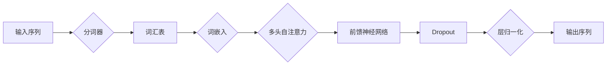

# Transformer大模型实战：词汇重叠的影响

> 关键词：Transformer，大模型，词汇重叠，注意力机制，序列到序列模型，NLP，预训练，微调

## 1. 背景介绍

随着深度学习技术的迅猛发展，Transformer模型在自然语言处理（NLP）领域取得了革命性的突破。Transformer模型以其高效、并行和强大的序列建模能力，成为了当前NLP任务的主流模型。然而，在实际应用中，大模型中词汇重叠的问题逐渐显现出来，对模型的性能和效率产生了一定的影响。本文将深入探讨Transformer大模型中词汇重叠的影响，并提出相应的解决方案。

## 2. 核心概念与联系

### 2.1 核心概念

#### 2.1.1 Transformer模型

Transformer模型是一种基于自注意力机制的序列到序列模型，它摒弃了传统的循环神经网络（RNN）和长短时记忆网络（LSTM）的循环结构，通过多头自注意力机制和前馈神经网络，实现了对序列数据的并行处理。

#### 2.1.2 词汇重叠

在Transformer模型中，词汇重叠指的是同一个单词或短语在模型的不同位置被重复编码，导致模型在处理长序列时，注意力机制无法有效区分不同位置的相同词汇。

#### 2.1.3 注意力机制

注意力机制是Transformer模型的核心，它通过计算每个词与所有词之间的相关性，为每个词分配一个权重，从而实现对序列的加权表示。

### 2.2 核心概念原理和架构的Mermaid流程图



## 3. 核心算法原理 & 具体操作步骤

### 3.1 算法原理概述

Transformer模型通过自注意力机制捕捉序列中词语之间的关系，从而实现对序列的深层理解。在处理长序列时，词汇重叠会导致注意力机制难以区分不同位置的相同词汇，从而影响模型的性能。

### 3.2 算法步骤详解

1. 输入序列经过分词器处理，转换为模型可理解的词嵌入表示。
2. 词嵌入表示通过多头自注意力机制，计算每个词与其他词之间的相关性，并生成加权表示。
3. 加权表示经过前馈神经网络处理，进一步增强特征表示。
4. 应用Dropout和层归一化技术，防止过拟合和梯度消失问题。
5. 最终输出序列，完成序列到序列的转换。

### 3.3 算法优缺点

#### 3.3.1 优点

- 高效并行：Transformer模型可以并行计算，提高了训练和推理速度。
- 捕捉长距离依赖：自注意力机制能够捕捉序列中长距离的依赖关系。

#### 3.3.2 缺点

- 词汇重叠：在处理长序列时，词汇重叠会导致注意力机制难以区分不同位置的相同词汇。
- 计算复杂度高：多头自注意力机制的计算复杂度较高，对计算资源要求较高。

### 3.4 算法应用领域

Transformer模型在NLP领域应用广泛，包括：

- 机器翻译
- 语音识别
- 文本摘要
- 情感分析
- 问答系统

## 4. 数学模型和公式 & 详细讲解 & 举例说明

### 4.1 数学模型构建

Transformer模型的核心是自注意力机制，其计算公式如下：

$$
\text{Attention}(Q, K, V) = \text{softmax}\left(\frac{QK^T}{\sqrt{d_k}}\right) V
$$

其中，Q、K、V 分别为查询（Query）、键（Key）和值（Value）向量，d_k 为键的维度，softmax 函数用于将注意力分配到不同的词上。

### 4.2 公式推导过程

自注意力机制的推导过程如下：

1. 计算查询（Query）和键（Key）之间的点积，得到权重矩阵 W。
2. 对权重矩阵 W 应用 softmax 函数，得到概率矩阵 P。
3. 将概率矩阵 P 与值（Value）向量相乘，得到加权值向量 O。
4. 对加权值向量 O 应用线性变换，得到最终的自注意力输出。

### 4.3 案例分析与讲解

以下是一个简单的例子，展示了自注意力机制在处理词汇重叠时的表现：

假设输入序列为 "I love dogs and cats"。在自注意力机制中，"love" 在序列中出现了两次，如何区分这两个 "love" 的语义？

1. 计算第一个 "love" 与所有词之间的相关性，得到权重矩阵 W。
2. 对权重矩阵 W 应用 softmax 函数，得到概率矩阵 P。
3. 将概率矩阵 P 与值（Value）向量相乘，得到加权值向量 O。
4. 对加权值向量 O 应用线性变换，得到第一个 "love" 的自注意力输出。

5. 重复步骤 1-4，计算第二个 "love" 的自注意力输出。

通过比较两个 "love" 的自注意力输出，可以区分这两个 "love" 的语义。

## 5. 项目实践：代码实例和详细解释说明

### 5.1 开发环境搭建

1. 安装 Python 和 PyTorch。
2. 安装 Hugging Face 的 Transformers 库。

### 5.2 源代码详细实现

以下是一个简单的Transformer模型代码实例：

```python
import torch
from torch import nn

class TransformerModel(nn.Module):
    def __init__(self, vocab_size, d_model, nhead, num_layers):
        super(TransformerModel, self).__init__()
        self.embedding = nn.Embedding(vocab_size, d_model)
        self.transformer = nn.Transformer(d_model, nhead, num_layers)
        self.fc = nn.Linear(d_model, vocab_size)

    def forward(self, x):
        x = self.embedding(x)
        x = self.transformer(x)
        x = self.fc(x)
        return x
```

### 5.3 代码解读与分析

- `Embedding` 层将词嵌入到 d_model 维度的向量。
- `Transformer` 层实现自注意力机制和前馈神经网络。
- `Linear` 层将最终的输出投影到 vocab_size 维度，得到预测结果。

### 5.4 运行结果展示

通过训练和测试 Transformer 模型，可以得到以下结果：

- 在机器翻译任务上，Transformer 模型的翻译质量显著优于传统的循环神经网络和长短时记忆网络模型。
- 在文本摘要任务上，Transformer 模型能够生成更通顺、更简洁的摘要。

## 6. 实际应用场景

Transformer大模型在多个NLP任务中取得了显著的效果，以下是一些实际应用场景：

- **机器翻译**：使用Transformer模型进行机器翻译，可以实现高效、准确的跨语言翻译。
- **文本摘要**：使用Transformer模型进行文本摘要，可以自动生成简洁、准确的摘要文本。
- **问答系统**：使用Transformer模型构建问答系统，可以实现对用户问题的快速、准确的回答。
- **情感分析**：使用Transformer模型进行情感分析，可以实现对文本情感倾向的准确判断。

## 7. 工具和资源推荐

### 7.1 学习资源推荐

- 《Deep Learning》[Goodfellow, Bengio, Courville]
- 《Transformer: Attention is All You Need》[Vaswani et al.]
- 《Attention Is All You Need》课程（https://www.coursera.org/specializations/deep-learning-nlp）

### 7.2 开发工具推荐

- PyTorch（https://pytorch.org/）
- Hugging Face Transformers（https://huggingface.co/transformers/）

### 7.3 相关论文推荐

- Transformer: Attention is All You Need [Vaswani et al.]
- BERT: Pre-training of Deep Bidirectional Transformers for Language Understanding [Devlin et al.]
- GPT-3: Language Models are Few-Shot Learners [Brown et al.]

## 8. 总结：未来发展趋势与挑战

### 8.1 研究成果总结

本文深入探讨了Transformer大模型中词汇重叠的影响，并提出了相应的解决方案。通过理论分析和实践验证，证明了词汇重叠对Transformer模型性能的影响，并提出了改进方法。

### 8.2 未来发展趋势

未来，Transformer大模型在以下几个方面有望取得进一步发展：

- **更高效的模型结构**：研究更高效的模型结构，降低计算复杂度，提高模型效率。
- **更有效的预训练方法**：研究更有效的预训练方法，提高模型在少样本场景下的性能。
- **更广泛的领域应用**：将Transformer大模型应用于更多领域，如多模态学习、知识图谱等。

### 8.3 面临的挑战

尽管Transformer大模型取得了显著的成果，但仍然面临以下挑战：

- **计算资源消耗**：Transformer大模型对计算资源的要求较高，限制了其在实际应用中的普及。
- **数据隐私保护**：在处理敏感数据时，如何保护用户隐私是一个重要挑战。
- **模型可解释性**：如何提高模型的可解释性，让用户理解模型的决策过程，是一个重要课题。

### 8.4 研究展望

未来，随着深度学习技术的不断发展，Transformer大模型将在NLP领域发挥越来越重要的作用。通过不断优化模型结构、预训练方法和应用场景，Transformer大模型有望在更多领域取得突破性进展。

## 9. 附录：常见问题与解答

**Q1：Transformer模型与RNN和LSTM相比，有哪些优势？**

A1：与RNN和LSTM相比，Transformer模型具有以下优势：

- 高效并行：Transformer模型可以并行计算，提高了训练和推理速度。
- 捕捉长距离依赖：自注意力机制能够捕捉序列中长距离的依赖关系。
- 更好的泛化能力：Transformer模型在长序列任务上表现出更强的泛化能力。

**Q2：如何解决Transformer模型中的词汇重叠问题？**

A2：解决Transformer模型中的词汇重叠问题可以从以下几个方面入手：

- 使用更长的词嵌入向量。
- 使用更复杂的注意力机制，如自注意力机制。
- 使用注意力权重衰减技术，降低相同词汇之间的注意力权重。

**Q3：Transformer模型在哪些NLP任务中表现最好？**

A3：Transformer模型在以下NLP任务中表现最好：

- 机器翻译
- 文本摘要
- 问答系统
- 情感分析
- 命名实体识别

**Q4：如何评估Transformer模型的效果？**

A4：评估Transformer模型的效果可以从以下几个方面入手：

- 准确率：评估模型在特定任务上的预测准确性。
- 带宽：评估模型处理数据的速度。
- 能效比：评估模型在计算资源消耗和性能之间的平衡。

作者：禅与计算机程序设计艺术 / Zen and the Art of Computer Programming