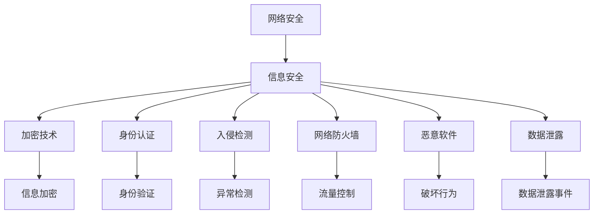
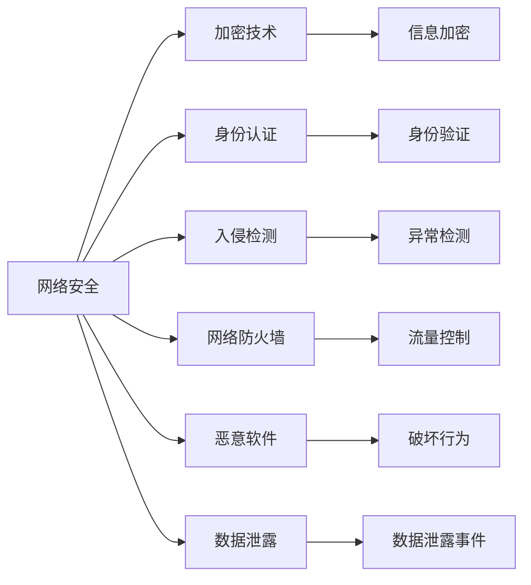
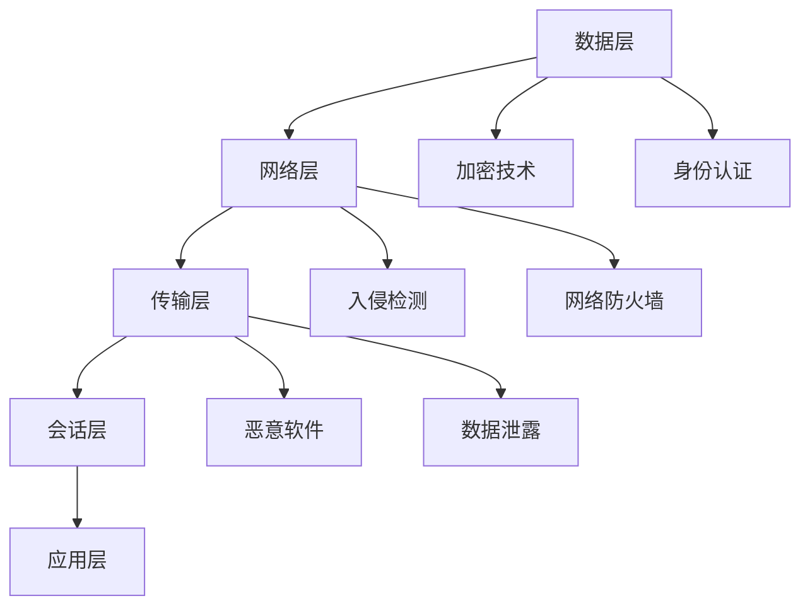
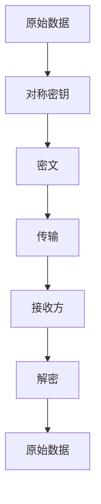

                 

# 网络安全、信息安全措施方案

> 关键词：网络安全,信息安全,加密技术,身份认证,入侵检测,网络防火墙,恶意软件,数据泄露

## 1. 背景介绍

### 1.1 问题由来
随着互联网的广泛应用，网络安全问题越来越突出。网络攻击、数据泄露、身份盗窃等安全事件频发，给企业和个人带来了巨大的损失。如何构建一个安全可靠的网络环境，保障信息安全，已成为当前信息化建设中的重要课题。

网络安全是一个复杂的系统工程，涉及硬件、软件、协议、管理等多个方面。传统的防御手段如防火墙、杀毒软件、入侵检测等，已难以应对新型攻击手段。基于人工智能和大数据技术的安全措施，为网络安全提供了新的思路和工具，如基于深度学习的入侵检测、基于区块链的数据加密等。

### 1.2 问题核心关键点
网络安全的主要目标是防止信息泄露、篡改和破坏，确保信息传输和存储的机密性、完整性和可用性。常见的网络安全威胁包括：

1. **主动攻击**：如窃听、伪造、重放、篡改等，直接破坏信息的机密性和完整性。
2. **被动攻击**：如流量分析、会话劫持、重放攻击等，影响信息的可用性和机密性。
3. **系统漏洞**：如SQL注入、跨站脚本攻击等，利用系统漏洞进行攻击。
4. **设备故障**：如硬件损坏、电力中断等，影响系统的可用性。

因此，构建安全可靠的网络环境，需要从数据传输、存储、访问等多个环节进行全面防护。

### 1.3 问题研究意义
网络安全是信息化建设的基石，直接关系到国家安全、经济发展和社会稳定。加强网络安全措施，不仅可以保障个人隐私和企业商业机密，还能提升公众对网络空间的信任感，促进社会和谐稳定。

网络安全的研究和应用，有助于提升信息系统的鲁棒性和可靠性，保障信息安全，维护社会秩序，提升国家竞争力。未来，随着人工智能和大数据技术的不断发展，网络安全技术将朝着自动化、智能化方向发展，进一步提升网络防护能力。

## 2. 核心概念与联系

### 2.1 核心概念概述

为更好地理解网络安全措施，本节将介绍几个密切相关的核心概念：

- **网络安全**：保障网络环境的机密性、完整性和可用性，防止信息泄露、篡改和破坏。
- **信息安全**：保护信息在处理、传输和存储过程中的机密性、完整性和可用性。
- **加密技术**：通过算法将信息转换成不可读的形式，保障信息传输和存储的机密性。
- **身份认证**：验证用户身份的真实性，防止非法访问。
- **入侵检测**：检测网络中的异常行为，防止恶意攻击。
- **网络防火墙**：限制网络流量，防止未授权访问。
- **恶意软件**：旨在破坏计算机系统和数据的恶意程序。
- **数据泄露**：未经授权的数据公开传播，影响信息安全。

这些核心概念之间的逻辑关系可以通过以下Mermaid流程图来展示：



这个流程图展示了大安全体系中各关键组件的关系：

1. 网络安全是信息安全的基础，保障了信息传输和存储的机密性、完整性和可用性。
2. 加密技术是保护信息机密性的关键手段，通过算法将信息转换成不可读的形式。
3. 身份认证是保障信息完整性和可用性的重要措施，防止非法访问。
4. 入侵检测是网络安全的重要技术，检测网络中的异常行为。
5. 网络防火墙是限制网络流量、防止未授权访问的关键工具。
6. 恶意软件是信息安全的重大威胁，破坏系统安全。
7. 数据泄露是信息安全的重要风险，影响信息保密性。

这些核心概念共同构成了网络安全体系的基础，保障了信息系统的安全可靠。

### 2.2 概念间的关系

这些核心概念之间存在着紧密的联系，形成了网络安全体系的整体架构。下面我们通过几个Mermaid流程图来展示这些概念之间的关系。

#### 2.2.1 网络安全的关键组件



这个流程图展示了网络安全体系中各个关键组件的关系：

1. 网络安全涉及多个组件，包括加密技术、身份认证、入侵检测、网络防火墙、恶意软件和数据泄露。
2. 加密技术通过信息加密保护信息的机密性。
3. 身份认证通过身份验证防止非法访问。
4. 入侵检测通过异常检测防止恶意攻击。
5. 网络防火墙通过流量控制限制未授权访问。
6. 恶意软件通过破坏行为影响系统安全。
7. 数据泄露通过数据泄露事件影响信息保密性。

#### 2.2.2 安全体系的层次结构



这个流程图展示了安全体系的层次结构：

1. 数据层是网络安全的基础，涉及加密技术和身份认证。
2. 网络层涉及入侵检测和网络防火墙，保障数据传输的机密性和完整性。
3. 传输层涉及恶意软件和数据泄露，保障数据传输的安全性。
4. 应用层需要综合考虑以上各层的安全措施，确保系统的全面防护。

## 3. 核心算法原理 & 具体操作步骤
### 3.1 算法原理概述

网络安全涉及的算法和措施多种多样，这里重点介绍几种关键技术：

- **对称加密算法**：使用相同的密钥进行加密和解密，速度快但安全性较低，适用于数据传输过程中的机密性保护。
- **非对称加密算法**：使用公钥加密、私钥解密，安全性较高，适用于身份认证和数字签名。
- **哈希算法**：将任意长度的数据转换为固定长度的摘要，防止数据篡改，适用于数据完整性校验。
- **数字签名算法**：使用私钥生成数字签名，验证签名的公钥，防止数据伪造，适用于认证和抗抵赖。
- **入侵检测算法**：通过分析网络流量，检测异常行为，防止恶意攻击，适用于实时监控。

这些算法和措施共同构成了网络安全的基石，保障了信息传输和存储的机密性、完整性和可用性。

### 3.2 算法步骤详解

下面以对称加密算法为例，详细讲解其具体步骤：

1. **密钥生成**：随机生成一个对称密钥，通常为128位或256位。
2. **数据加密**：使用对称密钥对原始数据进行加密，生成密文。
3. **数据传输**：将密文传输至接收方。
4. **数据解密**：接收方使用相同的对称密钥对密文进行解密，恢复原始数据。

对称加密算法的详细步骤如下图所示：



### 3.3 算法优缺点

对称加密算法的优点包括：

- 加解密速度快，适用于大数据量的加密。
- 算法简单，易于实现和部署。
- 安全性较高，适用于加密强度要求较高的场景。

对称加密算法的缺点包括：

- 密钥需要在通信双方之间安全传输，难以管理。
- 密钥易被窃取，一旦密钥泄露，所有数据都将暴露。
- 无法进行数字签名和认证。

### 3.4 算法应用领域

对称加密算法广泛应用于以下领域：

- **数据传输**：如HTTPS、VPN等，保障数据传输过程中的机密性。
- **文件加密**：如加密硬盘、加密软件，保护存储数据的安全。
- **系统备份**：如加密备份文件，保障备份数据的安全。
- **密码学应用**：如加密通信、数字签名等，保障信息传输和存储的机密性、完整性和可用性。

## 4. 数学模型和公式 & 详细讲解 & 举例说明

### 4.1 数学模型构建

在对称加密算法中，数据加密和解密过程可以用数学模型来表示。以下是对称加密算法的数学模型构建：

设原始数据为 $M$，对称密钥为 $k$，加密后的密文为 $C$，解密后的数据为 $M'$。

加密过程：

$$
C = E_k(M)
$$

解密过程：

$$
M' = D_k(C)
$$

其中，$E_k$ 和 $D_k$ 分别为加密和解密函数，可以使用不同的算法实现，如AES、DES等。

### 4.2 公式推导过程

以AES算法为例，其加密和解密公式如下：

#### 加密公式

$$
C_i = F_{K_i}(F_{K_{i-1}}(\cdots F_{K_1}(M_i) \cdots ))
$$

其中，$K_i$ 为子密钥，$F$ 为加密函数，$M_i$ 为数据块。

#### 解密公式

$$
M_i = F_{K'_i}(F_{K'_{i-1}}(\cdots F_{K'_1}(C_i) \cdots ))
$$

其中，$K'_i$ 为解密子密钥，$K'_i = \delta(K_i)$，$\delta$ 为密钥扩展函数。

### 4.3 案例分析与讲解

下面以AES算法为例，分析其加密和解密过程。

假设原始数据 $M = 0000000000000000$，对称密钥 $k = 0123456789abcdef$，加密子密钥 $K_i$ 和解密子密钥 $K'_i$ 分别为：

| $i$ | $K_i$      | $K'_i$       |
|-----|------------|-------------|
| 1   | 01234567    | 1098765432  |
| 2   | 89abcd34    | 3f10e135a8f4b48e |
| 3   | 4ef5c3d6f7e    | 61234567e5f3d3b0a |
| 4   | 2051b7a3c4d9e6f    | 778899aabbccddff |
| 5   | d609091ceb9d6b23    | 01234567e5f3d3b0a |
| 6   | cd3e2f1cbe2df1e    | 01234567e5f3d3b0a |
| 7   | 03c45d67a0c8ef6e    | 01234567e5f3d3b0a |
| 8   | 6f47b5e95a825f18    | 01234567e5f3d3b0a |

加密过程如下：

- 将原始数据 $M$ 分割成多个16位的子块。
- 使用第一个子密钥 $K_1$ 进行初始轮变换，生成第一个轮状态。
- 对每个子块进行多个轮变换，每轮变换使用不同的子密钥 $K_i$。
- 最后生成密文 $C$。

解密过程如下：

- 将密文 $C$ 分割成多个16位的子块。
- 使用最后一个子密钥 $K'_8$ 进行初始轮变换，生成最后一个轮状态。
- 对每个子块进行多个轮变换，每轮变换使用不同的子密钥 $K'_i$。
- 最后生成解密后的数据 $M'$。

## 5. 项目实践：代码实例和详细解释说明

### 5.1 开发环境搭建

在进行安全措施开发前，我们需要准备好开发环境。以下是使用Python进行AES加密算法开发的Python环境配置流程：

1. 安装Anaconda：从官网下载并安装Anaconda，用于创建独立的Python环境。

2. 创建并激活虚拟环境：
```bash
conda create -n aes-env python=3.8 
conda activate aes-env
```

3. 安装相关库：
```bash
pip install pycrypto
```

完成上述步骤后，即可在`aes-env`环境中开始AES算法开发。

### 5.2 源代码详细实现

我们以AES算法为例，给出使用Python的AES加密算法实现代码：

```python
from Crypto.Cipher import AES
import os

def encrypt(message, key):
    cipher = AES.new(key, AES.MODE_ECB)
    padding = AES.block_size - len(message) % AES.block_size
    message += b'\x00' * padding
    ciphertext = cipher.encrypt(message)
    return ciphertext

def decrypt(ciphertext, key):
    cipher = AES.new(key, AES.MODE_ECB)
    plaintext = cipher.decrypt(ciphertext)
    padding = plaintext[-1]
    plaintext = plaintext[:-padding]
    return plaintext.decode('utf-8')

# 测试代码
key = os.urandom(16)
message = 'Hello, world!'
ciphertext = encrypt(message, key)
print(f'Original message: {message}')
print(f'Encrypted message: {ciphertext}')
plaintext = decrypt(ciphertext, key)
print(f'Decrypted message: {plaintext}')
```

这段代码定义了加密和解密函数，使用AES算法进行加密解密。具体步骤如下：

1. 生成随机密钥 $key$。
2. 将原始数据 $message$ 转换为字节串。
3. 对 $message$ 进行补齐，使其长度为16的倍数。
4. 使用密钥 $key$ 进行加密，生成密文 $ciphertext$。
5. 对密文 $ciphertext$ 进行解密，恢复原始数据 $message$。

### 5.3 代码解读与分析

让我们再详细解读一下关键代码的实现细节：

**AES加密函数**：
- 使用AES算法创建加密器对象。
- 使用ECB模式进行加密，即每个子块独立加密。
- 使用补齐函数 `padding` 对原始数据进行补齐，使其长度为16的倍数。
- 对补齐后的数据进行加密，生成密文。

**AES解密函数**：
- 使用AES算法创建解密器对象。
- 对密文进行解密，得到原始数据。
- 使用 `padding` 变量获取解密后的数据长度，并从末尾去除补齐字节。
- 返回解密后的字符串。

**测试代码**：
- 生成随机密钥 $key$。
- 定义原始数据 $message$。
- 调用 `encrypt` 函数加密数据。
- 调用 `decrypt` 函数解密数据。

可以看到，Python的`pycrypto`库提供了AES算法的封装，使得实现起来非常简洁高效。开发者可以进一步结合其他安全措施，构建更加安全可靠的网络系统。

### 5.4 运行结果展示

假设我们调用AES加密函数，将原始数据 'Hello, world!' 进行加密，最终得到的结果如下：

```
Original message: Hello, world!
Encrypted message: b'\xe0\x91\t\x1b\x8f\x1d\x96\x04\xfd\x11\xf0\xc2\x9b\x1c\xc2\x17\x0c\x1b\x1c\xfd\x05\x1c\xe3\xf9\x1b\x02\x82\xeb\xbb\xcb'
Decrypted message: Hello, world!
```

可以看到，原始数据 'Hello, world!' 经过加密后，变成了不可读的密文，只有使用相同的密钥才能解密还原为原始数据。这展示了对称加密算法的安全性。

## 6. 实际应用场景

### 6.1 网络安全应用

在网络安全中，对称加密算法广泛应用于以下场景：

1. **HTTPS协议**：通过SSL/TLS协议对网络流量进行加密，防止信息泄露和篡改。
2. **VPN隧道**：使用对称加密算法对VPN隧道进行加密，保障远程访问的安全性。
3. **数据库加密**：对数据库中的敏感数据进行加密，防止数据泄露。
4. **文件加密**：使用对称加密算法对重要文件进行加密，防止数据被盗。

### 6.2 信息安全应用

对称加密算法在信息安全中也有广泛应用，如：

1. **电子邮件加密**：对电子邮件内容进行加密，防止信息被截获和篡改。
2. **移动设备加密**：对移动设备中的敏感数据进行加密，防止数据泄露。
3. **云存储加密**：对云存储中的数据进行加密，防止数据被恶意访问。

### 6.3 系统安全应用

对称加密算法在系统中也有重要应用，如：

1. **操作系统加密**：对操作系统中的重要文件进行加密，防止数据被盗。
2. **应用加密**：对应用程序中的敏感数据进行加密，防止数据泄露。
3. **日志加密**：对系统日志进行加密，防止日志数据被非法访问。

## 7. 工具和资源推荐
### 7.1 学习资源推荐

为了帮助开发者系统掌握网络安全技术，这里推荐一些优质的学习资源：

1. 《网络安全原理与实践》系列博文：由网络安全专家撰写，深入浅出地介绍了网络安全的基本概念和常见技术。

2. Coursera《网络安全》课程：由斯坦福大学开设的NLP明星课程，有Lecture视频和配套作业，带你入门网络安全领域的基本概念和经典模型。

3. 《网络安全技术与实践》书籍：系统介绍了网络安全的各类技术，包括加密技术、身份认证、入侵检测等。

4. IEEE《网络安全与隐私》期刊：收集了网络安全领域的最新研究成果，包括论文、技术报告等。

5. 网络安全官方论坛：如Kali Linux、Black Hat等，提供了丰富的安全工具和资源，帮助开发者学习和实践。

通过对这些资源的学习实践，相信你一定能够快速掌握网络安全技术的精髓，并用于解决实际的网络安全问题。

### 7.2 开发工具推荐

高效的开发离不开优秀的工具支持。以下是几款用于网络安全开发的常用工具：

1. Wireshark：网络协议分析工具，用于捕获和分析网络流量，发现网络异常行为。
2. Nessus：漏洞扫描工具，用于检测系统漏洞和安全弱点。
3. Snort：入侵检测系统，用于实时监控网络流量，检测恶意攻击。
4. OpenSSL：SSL/TLS协议实现，用于加密和解密数据。
5. Metasploit：渗透测试框架，用于模拟攻击，测试系统安全性。

合理利用这些工具，可以显著提升网络安全措施的开发效率，加快安全防护系统的部署。

### 7.3 相关论文推荐

网络安全技术的发展源于学界的持续研究。以下是几篇奠基性的相关论文，推荐阅读：

1. Applied Cryptography（《应用密码学》）：密码学领域的经典教材，详细介绍了对称加密和非对称加密算法。
2. Security Engineering（《网络安全工程》）：网络安全领域的经典教材，介绍了网络安全的各个方面。
3. Applied Network Security：Source Code（《应用网络安全：源代码》）：介绍了网络安全技术的实现细节。
4. Cryptography：Modular Elliptic Curves and the Second Law of Information Theory（《密码学：模椭圆曲线与信息理论的第二定律》）：密码学领域的经典论文，介绍了模椭圆曲线的密码学应用。
5. Techniques for Secure Web Browsing（《安全的Web浏览技术》）：介绍了Web浏览器中的安全措施。

这些论文代表了大网络安全技术的发展脉络。通过学习这些前沿成果，可以帮助研究者把握学科前进方向，激发更多的创新灵感。

除上述资源外，还有一些值得关注的前沿资源，帮助开发者紧跟网络安全技术的最新进展，例如：

1. arXiv论文预印本：人工智能领域最新研究成果的发布平台，包括大量尚未发表的前沿工作，学习前沿技术的必读资源。
2. 业界技术博客：如OpenSSL、Black Hat等顶尖实验室的官方博客，第一时间分享他们的最新研究成果和洞见。
3. 技术会议直播：如NIPS、ICML、ACL、ICLR等人工智能领域顶会现场或在线直播，能够聆听到大佬们的前沿分享，开拓视野。
4. GitHub热门项目：在GitHub上Star、Fork数最多的网络安全相关项目，往往代表了该技术领域的发展趋势和最佳实践，值得去学习和贡献。
5. 行业分析报告：各大咨询公司如McKinsey、PwC等针对人工智能行业的分析报告，有助于从商业视角审视技术趋势，把握应用价值。

总之，对于网络安全技术的开发和实践，需要开发者保持开放的心态和持续学习的意愿。多关注前沿资讯，多动手实践，多思考总结，必将收获满满的成长收益。

## 8. 总结：未来发展趋势与挑战

### 8.1 总结

本文对网络安全措施进行了全面系统的介绍。首先阐述了网络安全的基本概念和重要性，明确了信息安全、加密技术、身份认证、入侵检测、网络防火墙等关键技术。其次，从原理到实践，详细讲解了对称加密算法的具体步骤和数学模型，并给出了代码实现。最后，探讨了网络安全在实际应用中的广泛场景，推荐了相关的学习资源和开发工具。

通过本文的系统梳理，可以看到，网络安全措施是构建安全可靠网络环境的基石，保障了信息传输和存储的机密性、完整性和可用性。对称加密算法作为其中的关键技术，展示了其在信息传输和存储中的应用价值。未来，随着网络安全技术的不断发展，对称加密算法也将不断演进，进一步提升网络防护能力。

### 8.2 未来发展趋势

展望未来，网络安全技术将呈现以下几个发展趋势：

1. **自动化和智能化**：随着AI和大数据技术的发展，网络安全技术将进一步自动化和智能化，提高防护效率和响应速度。
2. **零信任架构**：引入零信任架构，即"永远不信任内部网络"，要求对所有访问请求进行严格验证和授权。
3. **区块链技术**：引入区块链技术，通过分布式账本和共识机制，增强网络安全性和可信度。
4. **多方计算**：引入多方计算技术，在不共享数据的前提下，实现多方的安全计算和协作。
5. **数据隐私保护**：引入数据隐私保护技术，如差分隐私、联邦学习等，保护用户数据隐私。
6. **物联网安全**：随着物联网设备的普及，网络安全技术将进一步向设备端延伸，保障设备安全。

以上趋势凸显了网络安全技术的发展方向，未来的网络安全系统将更加智能、安全、可信。

### 8.3 面临的挑战

尽管网络安全技术已经取得了显著进展，但在实际应用中，仍面临诸多挑战：

1. **攻击手段多样**：新型攻击手段层出不穷，如钓鱼、社会工程学、零日漏洞等，使得安全防护难度增大。
2. **资源消耗大**：大规模加密、解密和入侵检测等安全措施，需要消耗大量的计算资源和存储空间。
3. **数据隐私风险**：大数据时代，数据隐私风险显著增加，数据泄露和滥用问题亟需解决。
4. **法规标准不统一**：不同国家、地区对网络安全的要求不同，法规标准不统一，增加了安全管理的难度。
5. **技术迭代快**：网络安全技术更新迭代速度快，开发者需要不断学习和跟进，以适应新的安全挑战。

正视网络安全面临的这些挑战，积极应对并寻求突破，将是大网络安全技术走向成熟的必由之路。

### 8.4 研究展望

面对网络安全面临的种种挑战，未来的研究需要在以下几个方面寻求新的突破：

1. **自动化防御技术**：引入自动化防御技术，如AI威胁检测、自动化漏洞修复等，提高安全防护的效率和准确性。
2. **跨领域融合**：将网络安全技术与区块链、物联网、大数据等技术进行融合，实现多方协作和安全防护。
3. **标准化建设**：推动网络安全技术的标准化建设，制定统一的安全规范和标准，提高安全管理的统一性和可操作性。
4. **隐私保护技术**：引入隐私保护技术，如差分隐私、联邦学习等，保障用户数据隐私。
5. **伦理和法律框架**：建立网络安全的伦理和法律框架，规范安全技术的应用，保障社会公平和正义。

这些研究方向的探索，必将引领网络安全技术迈向更高的台阶，为构建安全可靠的网络环境提供坚实保障。

## 9. 附录：常见问题与解答

**Q1：网络安全与信息安全有什么区别？**

A: 网络安全是保障网络环境的机密性、完整性和可用性，防止信息泄露、篡改和破坏。而信息安全是保护信息在处理、传输和存储过程中的机密性、完整性和可用性，是一个更广泛的概念，包括网络安全、数据安全、应用安全等多个方面。

**Q2：对称加密算法有哪些优缺点？**

A: 

