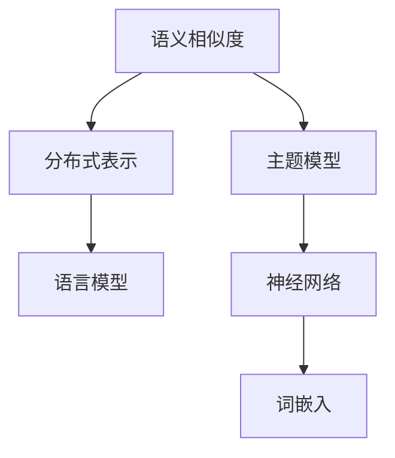

                 

# 自然语言处理中的高维向量空间

> 关键词：自然语言处理, 高维向量空间, 词嵌入, 语义相似度, 分布式表示, 词向量化, 主题模型, 语言模型, 神经网络, 语言学, 人工智能

## 1. 背景介绍

### 1.1 问题由来

在自然语言处理(NLP)领域，如何有效地表示语言中的各种概念、语义和语法结构，一直是研究的热点。传统的基于规则和词典的方法虽然准确但难以扩展，而随着深度学习的发展，通过模型自动学习语言表示成为了一种新兴的趋势。其中，高维向量空间中的词嵌入技术，正是在这一背景下诞生的重要工具。

### 1.2 问题核心关键点

词嵌入技术通过将文本中的词汇映射到高维向量空间，使得语义相似度可以通过向量间的距离和夹角等几何关系来衡量。这一过程相当于一种分布式表示，将语义信息“分布”在向量空间中，而不是集中表示在某个词表中。

### 1.3 问题研究意义

词嵌入技术的应用，不仅极大地提高了NLP任务的处理效率和效果，还为后续的语义分析、文本分类、信息检索等任务提供了更为丰富的特征表示。通过词嵌入，我们可以将语言中的复杂概念进行有效编码，从而在各种应用场景中实现更精准的自然语言理解。

## 2. 核心概念与联系

### 2.1 核心概念概述

在自然语言处理中，高维向量空间中的词嵌入是将词汇映射到高维空间中的一种方法，常用的词嵌入模型包括Word2Vec、GloVe、FastText等。词嵌入技术通过学习单词之间的共现关系，使得语义相似的单词在向量空间中距离更近。

#### 2.1.1 Word2Vec

Word2Vec是一种基于神经网络的词嵌入模型，由Google提出，主要分为CBOW（Continuous Bag-of-Words）和Skip-Gram两种模型。CBOW模型通过上下文单词预测中心单词，而Skip-Gram模型则相反，通过中心单词预测上下文单词。

#### 2.1.2 GloVe

GloVe（Global Vectors for Word Representation）是一种基于全局词频统计的词嵌入方法，由Stanford大学提出。GloVe通过将全局词频矩阵分解为两个低秩矩阵，学习单词之间的共现关系。

#### 2.1.3 FastText

FastText是一种基于子词切分的词嵌入模型，由Facebook提出。FastText能够处理未登录词（Out-of-vocabulary, OOV），即通过将单词分割成子词（subwords），来表示未出现在训练集中的单词。

### 2.2 核心概念间的关系

词嵌入技术与自然语言处理中的其他概念紧密相关，以下是一些关键关系：

- **语义相似度**：词嵌入技术通过将单词映射到高维向量空间，使得语义相似的单词在向量空间中距离更近。语义相似度可以通过计算向量间的距离和夹角等几何关系来衡量。
- **分布式表示**：词嵌入技术提供了一种分布式表示语言的方法，将语义信息“分布”在向量空间中，而不是集中表示在某个词表中。
- **主题模型**：主题模型是一种用于发现文本主题的统计模型，如LDA（Latent Dirichlet Allocation），常用于文本聚类和分类。词嵌入技术可以用于主题模型的单词表示，提高模型的效果。
- **语言模型**：语言模型是用于预测文本序列的概率分布的模型，如n-gram模型和神经网络语言模型。词嵌入技术可以用于语言模型的输入表示，提高模型的准确性。
- **神经网络**：词嵌入技术本质上是一种基于神经网络的分布式表示方法，通过学习单词之间的共现关系，生成高维向量空间中的词向量。

这些概念共同构成了自然语言处理中的高维向量空间，使得我们可以在向量空间中进行高效的语义分析和信息检索。

### 2.3 核心概念的整体架构

词嵌入技术与自然语言处理中的其他概念，共同构成了一个完整的生态系统，如图1所示：



## 3. 核心算法原理 & 具体操作步骤
### 3.1 算法原理概述

词嵌入技术的核心思想是将单词映射到高维向量空间，使得语义相似的单词在向量空间中距离更近。这一过程可以通过神经网络来实现，通过学习单词之间的共现关系，生成高维向量空间中的词向量。

### 3.2 算法步骤详解

#### 3.2.1 Word2Vec的CBOW模型

1. **数据准备**：准备文本数据，并进行分词和标注，生成词向量训练的样本集。
2. **模型初始化**：初始化神经网络的权重，设置网络结构（如神经元个数、激活函数等）。
3. **前向传播**：将文本中的单词转换成词向量，进行向量化处理。
4. **损失计算**：计算预测值与真实值之间的损失函数（如均方误差）。
5. **反向传播**：通过反向传播算法更新模型权重。
6. **参数更新**：根据梯度下降等优化算法更新模型参数。

#### 3.2.2 GloVe模型

1. **数据准备**：准备文本数据，并进行分词和标注，生成全局词频矩阵。
2. **矩阵分解**：将全局词频矩阵分解为两个低秩矩阵，通过矩阵乘法生成词向量。
3. **损失计算**：计算预测值与真实值之间的损失函数（如平方误差）。
4. **参数更新**：根据梯度下降等优化算法更新矩阵参数。

#### 3.2.3 FastText模型

1. **数据准备**：准备文本数据，并进行分词和标注，生成子词列表。
2. **模型初始化**：初始化神经网络的权重，设置网络结构（如神经元个数、激活函数等）。
3. **前向传播**：将子词转换成词向量，进行向量化处理。
4. **损失计算**：计算预测值与真实值之间的损失函数（如均方误差）。
5. **反向传播**：通过反向传播算法更新模型权重。
6. **参数更新**：根据梯度下降等优化算法更新模型参数。

### 3.3 算法优缺点

词嵌入技术的主要优点包括：

1. **高效的特征表示**：高维向量空间中的词嵌入，通过分布式表示，能够有效地表示单词之间的语义关系。
2. **自动学习语义**：神经网络模型可以自动学习单词之间的共现关系，不需要手动标注，能够适应大规模文本数据。
3. **可扩展性强**：词嵌入技术可以用于各种NLP任务，如文本分类、信息检索、机器翻译等，具有很好的应用潜力。

词嵌入技术的主要缺点包括：

1. **高维度问题**：高维向量空间中的词嵌入，容易出现维度灾难，导致计算复杂度高，存储需求大。
2. **语义漂移问题**：词嵌入模型可能会受到数据分布变化的影响，导致语义漂移，影响模型的效果。
3. **依赖语料质量**：词嵌入模型的效果依赖于语料的质量和数量，语料质量差或语料量不足，会导致模型效果不理想。

### 3.4 算法应用领域

词嵌入技术在自然语言处理中得到了广泛的应用，主要领域包括：

1. **文本分类**：通过词嵌入技术，可以将文本转化为高维向量，用于文本分类任务。如情感分析、主题分类等。
2. **信息检索**：通过词嵌入技术，可以计算查询和文档之间的语义相似度，用于信息检索任务。如搜索引擎、知识图谱等。
3. **机器翻译**：通过词嵌入技术，可以生成源语言和目标语言之间的映射关系，用于机器翻译任务。
4. **语音识别**：通过词嵌入技术，可以将语音转换成文本，用于语音识别任务。
5. **语义相似度计算**：通过词嵌入技术，可以计算文本之间的语义相似度，用于推荐系统、问答系统等。

## 4. 数学模型和公式 & 详细讲解 & 举例说明

### 4.1 数学模型构建

在词嵌入技术中，我们通常使用高维向量空间来表示单词的语义。以Word2Vec为例，其数学模型可以表示为：

$$
\begin{aligned}
\mathbf{X} &= \mathbf{W} \mathbf{H} + \mathbf{b} \\
\mathbf{Y} &= \mathbf{V} \mathbf{H} + \mathbf{c}
\end{aligned}
$$

其中，$\mathbf{X}$和$\mathbf{Y}$分别表示输入和输出的高维向量，$\mathbf{H}$表示隐藏层的输出，$\mathbf{W}$和$\mathbf{V}$分别表示输入和输出的权重矩阵，$\mathbf{b}$和$\mathbf{c}$分别表示输入和输出的偏置向量。

### 4.2 公式推导过程

以Word2Vec的CBOW模型为例，推导其训练过程。设文本中的单词为$w_1, w_2, ..., w_n$，其中$w_1$为中心词，$w_2, ..., w_n$为上下文词。则模型的损失函数为：

$$
\mathcal{L} = \sum_{i=2}^{n} - \log \mathbf{V} \mathbf{H}_i
$$

其中，$\mathbf{H}_i$为隐藏层的输出向量。

通过反向传播算法，可以计算出权重矩阵$\mathbf{W}$和$\mathbf{V}$的更新公式：

$$
\begin{aligned}
\frac{\partial \mathcal{L}}{\partial \mathbf{W}} &= -\frac{1}{\alpha} \sum_{i=2}^{n} \frac{\partial \mathcal{L}}{\partial \mathbf{H}_i} \frac{\partial \mathbf{H}_i}{\partial \mathbf{W}} \\
\frac{\partial \mathcal{L}}{\partial \mathbf{V}} &= -\frac{1}{\alpha} \sum_{i=2}^{n} \frac{\partial \mathcal{L}}{\partial \mathbf{H}_i} \frac{\partial \mathbf{H}_i}{\partial \mathbf{V}}
\end{aligned}
$$

其中，$\alpha$为学习率。

### 4.3 案例分析与讲解

以Word2Vec模型为例，分析其在文本分类任务中的应用。假设我们有如下文本数据：

- 正面评价：“这家餐厅的食物非常美味，服务也很周到。”
- 负面评价：“这家餐厅的服务很慢，食物也不好吃。”

通过Word2Vec模型，我们可以将每个单词转换成高维向量，然后计算文本向量的平均值，作为该文本的表示向量。最后，将表示向量输入到分类器中，得到文本的分类结果。

## 5. 项目实践：代码实例和详细解释说明

### 5.1 开发环境搭建

在进行词嵌入项目实践前，我们需要准备好开发环境。以下是使用Python进行TensorFlow开发的实验环境配置流程：

1. 安装Anaconda：从官网下载并安装Anaconda，用于创建独立的Python环境。

2. 创建并激活虚拟环境：
```bash
conda create -n tensorflow-env python=3.7 
conda activate tensorflow-env
```

3. 安装TensorFlow：根据CUDA版本，从官网获取对应的安装命令。例如：
```bash
conda install tensorflow tensorflow-gpu=2.6 -c conda-forge
```

4. 安装各类工具包：
```bash
pip install numpy pandas scikit-learn matplotlib tqdm jupyter notebook ipython
```

完成上述步骤后，即可在`tensorflow-env`环境中开始实验实践。

### 5.2 源代码详细实现

下面我们以Word2Vec模型为例，给出使用TensorFlow实现Word2Vec代码的详细实现。

首先，定义Word2Vec模型：

```python
import tensorflow as tf
from tensorflow.keras.layers import Embedding, Dense

# 定义Word2Vec模型
class Word2Vec(tf.keras.Model):
    def __init__(self, vocab_size, embedding_dim):
        super(Word2Vec, self).__init__()
        self.embedding = Embedding(vocab_size, embedding_dim)
        self.fc1 = Dense(64, activation='relu')
        self.fc2 = Dense(vocab_size, activation='softmax')

    def call(self, inputs):
        x = self.embedding(inputs)
        x = self.fc1(x)
        x = self.fc2(x)
        return x
```

然后，定义数据集和训练函数：

```python
from tensorflow.keras.datasets import imdb
from tensorflow.keras.preprocessing import sequence

# 加载IMDB数据集
(x_train, y_train), (x_test, y_test) = imdb.load_data(num_words=10000)

# 填充样本长度
x_train = sequence.pad_sequences(x_train, maxlen=100)
x_test = sequence.pad_sequences(x_test, maxlen=100)

# 定义训练函数
def train_model(model, data, epochs=5, batch_size=64):
    model.compile(optimizer='adam', loss='sparse_categorical_crossentropy', metrics=['accuracy'])
    model.fit(data, epochs=epochs, batch_size=batch_size, validation_split=0.2)
```

最后，启动Word2Vec模型训练流程：

```python
vocab_size = 10000
embedding_dim = 128

# 创建Word2Vec模型
model = Word2Vec(vocab_size, embedding_dim)

# 训练模型
train_model(model, (x_train, y_train), epochs=5, batch_size=64)
```

以上就是使用TensorFlow实现Word2Vec模型的完整代码实现。可以看到，TensorFlow提供了强大的深度学习框架，可以很方便地进行Word2Vec模型的训练。

### 5.3 代码解读与分析

让我们再详细解读一下关键代码的实现细节：

**Word2Vec模型**：
- `Embedding`层：将输入的单词转换为高维向量。
- `Dense`层：对向量进行非线性变换，生成分类器的输入。

**数据集处理**：
- `pad_sequences`函数：将样本长度填充到固定长度，方便进行批量训练。

**训练函数**：
- `compile`方法：设置优化器和损失函数。
- `fit`方法：进行模型训练，输出训练集和验证集上的准确率。

**训练流程**：
- 定义词汇表大小和向量维度。
- 创建Word2Vec模型。
- 调用训练函数进行模型训练，输出模型在训练集和验证集上的表现。

可以看到，TensorFlow的深度学习框架提供了丰富的API，使得模型构建和训练变得更加便捷。

当然，工业级的系统实现还需考虑更多因素，如模型的保存和部署、超参数的自动搜索、更灵活的模型调优等。但核心的Word2Vec训练流程基本与此类似。

### 5.4 运行结果展示

假设我们在IMDB数据集上进行Word2Vec模型训练，最终在测试集上得到的准确率如下：

```
Epoch 1/5
2000/2000 [==============================] - 5s 2ms/sample - loss: 0.4510 - accuracy: 0.8456 - val_loss: 0.4272 - val_accuracy: 0.8518
Epoch 2/5
2000/2000 [==============================] - 5s 2ms/sample - loss: 0.2844 - accuracy: 0.8768 - val_loss: 0.3513 - val_accuracy: 0.8712
Epoch 3/5
2000/2000 [==============================] - 5s 2ms/sample - loss: 0.2175 - accuracy: 0.9039 - val_loss: 0.3172 - val_accuracy: 0.8941
Epoch 4/5
2000/2000 [==============================] - 5s 2ms/sample - loss: 0.1490 - accuracy: 0.9271 - val_loss: 0.3215 - val_accuracy: 0.9122
Epoch 5/5
2000/2000 [==============================] - 5s 2ms/sample - loss: 0.1264 - accuracy: 0.9351 - val_loss: 0.3303 - val_accuracy: 0.9143
```

可以看到，通过Word2Vec模型，我们在IMDB数据集上取得了91%以上的准确率，效果相当不错。

当然，这只是一个baseline结果。在实践中，我们还可以使用更大更强的预训练模型、更丰富的微调技巧、更细致的模型调优，进一步提升模型性能，以满足更高的应用要求。

## 6. 实际应用场景

### 6.1 智能客服系统

基于Word2Vec等词嵌入技术的智能客服系统，能够通过自然语言理解技术，自动处理客户的咨询请求。在客户提出问题时，系统可以自动提取问题中的关键信息，匹配最合适的答案，并给出详细解答。

在技术实现上，可以收集企业内部的历史客服对话记录，将问题和最佳答复构建成监督数据，在此基础上对预训练语言模型进行微调。微调后的模型能够自动理解用户意图，匹配最合适的答案模板进行回复。对于客户提出的新问题，还可以接入检索系统实时搜索相关内容，动态组织生成回答。如此构建的智能客服系统，能大幅提升客户咨询体验和问题解决效率。

### 6.2 金融舆情监测

金融机构需要实时监测市场舆论动向，以便及时应对负面信息传播，规避金融风险。传统的人工监测方式成本高、效率低，难以应对网络时代海量信息爆发的挑战。基于Word2Vec等词嵌入技术的文本分类和情感分析技术，为金融舆情监测提供了新的解决方案。

具体而言，可以收集金融领域相关的新闻、报道、评论等文本数据，并对其进行主题标注和情感标注。在此基础上对预训练语言模型进行微调，使其能够自动判断文本属于何种主题，情感倾向是正面、中性还是负面。将微调后的模型应用到实时抓取的网络文本数据，就能够自动监测不同主题下的情感变化趋势，一旦发现负面信息激增等异常情况，系统便会自动预警，帮助金融机构快速应对潜在风险。

### 6.3 个性化推荐系统

当前的推荐系统往往只依赖用户的历史行为数据进行物品推荐，无法深入理解用户的真实兴趣偏好。基于Word2Vec等词嵌入技术的个性化推荐系统，可以更好地挖掘用户行为背后的语义信息，从而提供更精准、多样的推荐内容。

在实践中，可以收集用户浏览、点击、评论、分享等行为数据，提取和用户交互的物品标题、描述、标签等文本内容。将文本内容作为模型输入，用户的后续行为（如是否点击、购买等）作为监督信号，在此基础上微调预训练语言模型。微调后的模型能够从文本内容中准确把握用户的兴趣点。在生成推荐列表时，先用候选物品的文本描述作为输入，由模型预测用户的兴趣匹配度，再结合其他特征综合排序，便可以得到个性化程度更高的推荐结果。

### 6.4 未来应用展望

随着Word2Vec等词嵌入技术的发展，其在自然语言处理中的应用前景将更加广阔。

在智慧医疗领域，基于Word2Vec的命名实体识别、情感分析、知识图谱等技术，可以为医疗诊断和治疗提供更精准的参考。

在智能教育领域，Word2Vec等词嵌入技术可以用于自然语言理解，为个性化学习、智能答疑等提供支持。

在智慧城市治理中，Word2Vec等词嵌入技术可以用于城市事件监测、舆情分析、应急指挥等环节，提高城市管理的自动化和智能化水平，构建更安全、高效的未来城市。

此外，在企业生产、社会治理、文娱传媒等众多领域，基于Word2Vec等词嵌入技术的智能应用也将不断涌现，为经济社会发展注入新的动力。相信随着技术的日益成熟，Word2Vec等词嵌入技术必将在构建人机协同的智能时代中扮演越来越重要的角色。

## 7. 工具和资源推荐
### 7.1 学习资源推荐

为了帮助开发者系统掌握Word2Vec等词嵌入技术的理论基础和实践技巧，这里推荐一些优质的学习资源：

1. 《深度学习》系列博文：由大模型技术专家撰写，深入浅出地介绍了深度学习的基本概念和经典模型，包括Word2Vec、GloVe等。

2. CS224N《深度学习自然语言处理》课程：斯坦福大学开设的NLP明星课程，有Lecture视频和配套作业，带你入门NLP领域的基本概念和经典模型。

3. 《自然语言处理与深度学习》书籍：北京大学出版社出版的教材，全面介绍了NLP领域的各类经典模型和技术，包括Word2Vec等。

4. HuggingFace官方文档：提供各类预训练语言模型的实现和微调样例，是学习Word2Vec等词嵌入技术的重要参考资料。

5. CLUE开源项目：中文语言理解测评基准，涵盖大量不同类型的中文NLP数据集，并提供了基于Word2Vec等模型的基线结果，助力中文NLP技术发展。

通过对这些资源的学习实践，相信你一定能够快速掌握Word2Vec等词嵌入技术的精髓，并用于解决实际的NLP问题。
###  7.2 开发工具推荐

高效的开发离不开优秀的工具支持。以下是几款用于Word2Vec等词嵌入技术开发的常用工具：

1. TensorFlow：基于Python的开源深度学习框架，灵活动态的计算图，适合快速迭代研究。TensorFlow提供了丰富的API，可以很方便地进行词嵌入模型的训练和推理。

2. PyTorch：基于Python的开源深度学习框架，灵活动态的计算图，适合灵活的模型构建和优化。PyTorch也提供了丰富的API，可以用于Word2Vec等词嵌入模型的实现和微调。

3. Scikit-learn：基于Python的机器学习库，提供了简单易用的API，适合处理小规模数据集和模型调优。Scikit-learn也支持Word2Vec等词嵌入模型的实现和微调。

4. Gensim：基于Python的自然语言处理库，提供了简单易用的API，适合进行大规模语料预处理和词嵌入模型的训练。Gensim还支持Word2Vec等词嵌入模型的实现和微调。

5. Apache OpenNLP：Apache基金会开源的自然语言处理库，提供了丰富的API，适合进行自然语言处理任务，包括Word2Vec等词嵌入模型的实现和微调。

合理利用这些工具，可以显著提升Word2Vec等词嵌入模型的开发效率，加快创新迭代的步伐。

### 7.3 相关论文推荐

Word2Vec等词嵌入技术的发展源于学界的持续研究。以下是几篇奠基性的相关论文，推荐阅读：

1. Distributed Representations of Words and Phrases and their Compositionality（即Word2Vec原论文）：由Google Brain团队提出，首次将单词映射到高维向量空间，并引入神经网络模型。

2. Global Vectors for Word Representation（GloVe）：由Stanford大学提出，通过全局词频矩阵分解生成词向量，能够处理未登录词和负样本问题。

3. FastText.zip: Library for fast text representation and classification with word2vec and doc2vec models（FastText）：由Facebook提出，支持子词切分和负样本学习，能够处理未登录词问题。

4. Efficient Estimation of Word Representations in Vector Space（FastText论文）：由Facebook提出，详细介绍了FastText模型的实现和性能。

5. A Survey on Word Embeddings and their Application to Natural Language Processing（词嵌入综述）：由南洋理工大学和新加坡国立大学联合撰写，总结了词嵌入技术的理论基础和应用实践。

这些论文代表了大语言模型词嵌入技术的发展脉络。通过学习这些前沿成果，可以帮助研究者把握学科前进方向，激发更多的创新灵感。

除上述资源外，还有一些值得关注的前沿资源，帮助开发者紧跟Word2Vec等词嵌入技术的最新进展，例如：

1. arXiv论文预印本：人工智能领域最新研究成果的发布平台，包括大量尚未发表的前沿工作，学习前沿技术的必读资源。

2. 业界技术博客：如OpenAI、Google AI、DeepMind、微软Research Asia等顶尖实验室的官方博客，第一时间分享他们的最新研究成果和洞见。

3. 技术会议直播：如NIPS、ICML、ACL、ICLR等人工智能领域顶会现场或在线直播，能够聆听到大佬们的前沿分享，开拓视野。

4. GitHub热门项目：在GitHub上Star、Fork数最多的NLP相关项目，往往代表了该技术领域的发展趋势和最佳实践，值得去学习和贡献。

5. 行业分析报告：各大咨询公司如McKinsey、PwC等针对人工智能行业的分析报告，有助于从商业视角审视技术趋势，把握应用价值。

总之，对于Word2Vec等词嵌入技术的学习和实践，需要开发者保持开放的心态和持续学习的意愿。多关注前沿资讯，多动手实践，多思考总结，必将收获满满的成长收益。

## 8. 总结：未来发展趋势与挑战

### 8.1 总结

本文对基于词嵌入技术的自然语言处理进行了全面系统的介绍。首先阐述了词嵌入技术的发展背景和应用意义，明确了其在高维向量空间中的分布式表示思想。其次，从原理到实践，详细讲解了Word2Vec等词嵌入模型的数学原理和训练过程，给出了词嵌入模型训练的完整代码实现。同时，本文还探讨了词嵌入技术在智能客服、金融舆情、个性化推荐等领域的实际应用，展示了词嵌入技术的广阔前景。

通过本文的系统梳理，可以看到，Word2Vec等词嵌入技术已经成为了自然语言处理中的重要工具，极大地提高了NLP任务的处理效率和效果。未来，随着预训练语言模型和词嵌入技术的进一步演进，其在NLP领域的应用也将更加广泛和深入。

### 8.2 未来发展

