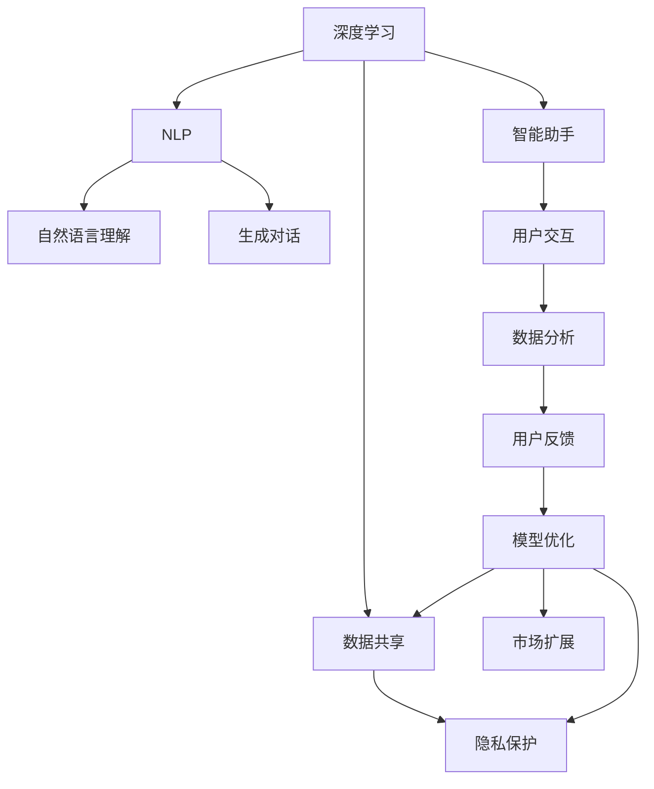

                 

## 1. 背景介绍

### 1.1 问题由来

苹果公司和OpenAI之间的关系，一直都是科技界的热议话题。两者的合作模式既复杂又富有创新性，反映出人工智能在现代社会中的深度融合。苹果作为全球领先的科技公司，一直致力于推动技术的革新，而OpenAI则以其在AI领域的卓越研究成果，吸引了全球众多企业的关注。

### 1.2 问题核心关键点

苹果与OpenAI的合作，主要集中在以下几个方面：

1. **技术研发**：苹果利用OpenAI的技术成果，提升自身产品的智能化水平，如Siri等智能助手。
2. **数据资源**：苹果通过与OpenAI合作，获取更多高质量的数据资源，进一步优化其机器学习模型。
3. **算法优化**：双方在深度学习、自然语言处理等领域进行深度合作，共同开发前沿算法。
4. **产品部署**：苹果通过OpenAI提供的技术和解决方案，实现其产品的智能化和自动化部署。
5. **市场扩展**：OpenAI利用苹果的生态系统，推广其AI技术，拓展市场影响力。

### 1.3 问题研究意义

苹果与OpenAI的合作模式，对于推动AI技术的应用与发展具有重要的意义：

1. **加速AI落地**：通过与苹果的合作，OpenAI能够将其研究成果迅速应用到实际产品中，加速AI技术的落地进程。
2. **提升产品质量**：苹果通过引入OpenAI的技术，显著提升了其产品的智能化水平，提升了用户体验。
3. **数据共享与隐私保护**：双方在数据共享与隐私保护方面的协同，为AI技术在现实世界中的应用提供了新的范式。
4. **市场扩展**：苹果利用OpenAI的技术，拓展了其在AI市场的影响力，为其带来了新的增长点。
5. **伦理与责任**：双方在AI伦理与责任方面的讨论，推动了AI技术在实际应用中的道德规范和法律框架建设。

## 2. 核心概念与联系

### 2.1 核心概念概述

苹果与OpenAI的合作模式，涉及到以下几个核心概念：

1. **深度学习**：利用神经网络进行复杂数据建模和预测的技术。
2. **自然语言处理(NLP)**：使计算机能够理解、处理和生成自然语言的技术。
3. **数据共享**：在保障隐私的前提下，各方共享数据以优化模型。
4. **隐私保护**：在数据共享过程中，确保用户隐私不被侵犯。
5. **智能助手**：如Siri、小i等，通过AI技术实现人机交互。
6. **市场扩展**：AI技术的商业化应用，提升产品竞争力和市场份额。

这些概念之间的联系紧密，通过深度学习和大数据技术，自然语言处理和智能助手得以实现，而数据共享和隐私保护则是技术应用的前提，市场扩展则是应用成效的体现。

### 2.2 概念间的关系

这些核心概念之间的关系可以通过以下Mermaid流程图来展示：



这个流程图展示了大语言模型微调过程中各个核心概念的相互联系：

1. 深度学习为大模型和智能助手提供技术基础。
2. 自然语言处理通过理解、生成语言，实现智能助手的交互功能。
3. 数据共享和隐私保护确保了AI技术的可信度。
4. 智能助手通过用户交互和数据分析，不断优化模型性能。
5. 市场扩展体现了AI技术的商业价值。

## 3. 核心算法原理 & 具体操作步骤
### 3.1 算法原理概述

苹果与OpenAI的合作模式，基于深度学习和大数据技术，通过模型微调和迁移学习等手段，实现产品的智能化升级。其核心算法原理如下：

1. **模型微调**：使用OpenAI提供的预训练模型，结合苹果的特定数据集进行微调，优化模型的任务适配能力。
2. **迁移学习**：通过在大规模无标签数据上预训练，再将这些知识迁移到特定的应用场景中，提升模型性能。
3. **数据增强**：通过数据扩充、增强技术，丰富训练数据，提高模型的泛化能力。
4. **对抗训练**：通过引入对抗样本，提高模型的鲁棒性和安全性。
5. **知识蒸馏**：通过将知识从大型模型蒸馏到小型模型，提高模型的效率和性能。

### 3.2 算法步骤详解

苹果与OpenAI的合作模式，主要包括以下步骤：

1. **数据准备**：收集和标注苹果产品相关的数据，如用户对话记录、产品反馈等。
2. **预训练模型加载**：加载OpenAI提供的预训练模型，如GPT、BERT等。
3. **模型微调**：根据苹果的特定需求，选择适合的任务层，进行微调。
4. **评估与优化**：在验证集上评估微调效果，根据评估结果调整超参数，优化模型性能。
5. **部署与应用**：将微调后的模型部署到苹果产品中，实现智能交互和个性化推荐等应用。

### 3.3 算法优缺点

苹果与OpenAI的合作模式，具有以下优点：

1. **技术优势互补**：苹果在硬件和生态系统方面有优势，OpenAI在算法和模型训练方面有专长，两者优势互补。
2. **快速迭代**：通过微调和迁移学习，可以迅速将最新研究成果应用于产品中，提升产品竞争力。
3. **市场扩展**：AI技术的商业化应用，为苹果带来了新的增长点。
4. **隐私保护**：双方在数据共享与隐私保护方面的合作，提高了用户信任度。

然而，这种合作模式也存在一些缺点：

1. **数据依赖性**：合作模式高度依赖于数据的质量与数量，数据获取和标注成本较高。
2. **算法复杂性**：模型微调和迁移学习的算法复杂，需要高水平的数据科学家和工程师。
3. **隐私风险**：数据共享过程中，隐私保护是一个重要问题，需严格控制和监管。
4. **资源消耗**：大规模模型的训练和推理消耗大量计算资源，需要强大的硬件支持。
5. **技术壁垒**：双方技术水平不一致，存在技术兼容和接口对接的挑战。

### 3.4 算法应用领域

苹果与OpenAI的合作模式，广泛应用于以下几个领域：

1. **智能助手**：如Siri、Face ID等，通过深度学习和自然语言处理技术，实现人机交互。
2. **推荐系统**：基于用户行为和历史数据，提供个性化的产品推荐。
3. **内容生成**：利用AI技术，生成高质量的图文内容，提升用户体验。
4. **数据安全**：通过AI技术，实现对数据的自动监控和异常检测，提升数据安全性。
5. **市场分析**：通过分析用户行为数据，制定市场策略，提升产品营销效果。

## 4. 数学模型和公式 & 详细讲解 & 举例说明

### 4.1 数学模型构建

假设苹果公司收集了N个用户对话样本，每个样本包含用户输入 $x_i$ 和系统回复 $y_i$。模型 $M_{\theta}$ 由多个层组成，其中 $\theta$ 表示模型的所有参数。

模型 $M_{\theta}$ 的目标是最小化交叉熵损失，即：

$$
\mathcal{L}(\theta) = -\frac{1}{N} \sum_{i=1}^N \ell(M_{\theta}(x_i), y_i)
$$

其中 $\ell$ 为交叉熵损失函数。

### 4.2 公式推导过程

对于每个样本 $(x_i, y_i)$，模型 $M_{\theta}$ 的输出为 $\hat{y}_i = M_{\theta}(x_i)$。交叉熵损失函数为：

$$
\ell(\hat{y}_i, y_i) = -y_i \log \hat{y}_i - (1-y_i) \log (1-\hat{y}_i)
$$

因此，整个数据集的损失函数为：

$$
\mathcal{L}(\theta) = -\frac{1}{N} \sum_{i=1}^N (-y_i \log \hat{y}_i - (1-y_i) \log (1-\hat{y}_i))
$$

通过反向传播算法，可以得到损失函数对参数 $\theta$ 的梯度：

$$
\frac{\partial \mathcal{L}(\theta)}{\partial \theta} = \frac{1}{N} \sum_{i=1}^N (\frac{y_i}{\hat{y}_i} - \frac{1-y_i}{1-\hat{y}_i}) \frac{\partial M_{\theta}(x_i)}{\partial \theta}
$$

其中 $\frac{\partial M_{\theta}(x_i)}{\partial \theta}$ 可以通过链式法则递归计算得到。

### 4.3 案例分析与讲解

以Siri为例，Siri的微调过程如下：

1. **数据准备**：收集用户与Siri的对话记录，标注出用户意图和系统回复。
2. **模型加载**：加载OpenAI提供的预训练模型，如BERT或GPT。
3. **模型微调**：在对话数据集上，使用AdamW优化器进行微调，最小化交叉熵损失。
4. **评估与优化**：在验证集上评估微调效果，根据评估结果调整学习率等超参数。
5. **部署与应用**：将微调后的模型部署到Siri系统中，实现个性化回复和语义理解。

## 5. 项目实践：代码实例和详细解释说明

### 5.1 开发环境搭建

为了实现Siri的微调，首先需要准备好开发环境。以下是使用Python进行PyTorch开发的环境配置流程：

1. 安装Anaconda：从官网下载并安装Anaconda，用于创建独立的Python环境。

2. 创建并激活虚拟环境：
```bash
conda create -n pytorch-env python=3.8 
conda activate pytorch-env
```

3. 安装PyTorch：根据CUDA版本，从官网获取对应的安装命令。例如：
```bash
conda install pytorch torchvision torchaudio cudatoolkit=11.1 -c pytorch -c conda-forge
```

4. 安装Transformers库：
```bash
pip install transformers
```

5. 安装各类工具包：
```bash
pip install numpy pandas scikit-learn matplotlib tqdm jupyter notebook ipython
```

完成上述步骤后，即可在`pytorch-env`环境中开始微调实践。

### 5.2 源代码详细实现

下面我们以Siri的对话任务为例，给出使用Transformers库对BERT模型进行微调的PyTorch代码实现。

首先，定义对话任务的数据处理函数：

```python
from transformers import BertTokenizer
from torch.utils.data import Dataset
import torch

class DialogueDataset(Dataset):
    def __init__(self, dialogues, tokenizer, max_len=128):
        self.dialogues = dialogues
        self.tokenizer = tokenizer
        self.max_len = max_len
        
    def __len__(self):
        return len(self.dialogues)
    
    def __getitem__(self, item):
        dialogue = self.dialogues[item]
        
        inputs = self.tokenizer(dialogue['input'], return_tensors='pt', max_length=self.max_len, padding='max_length', truncation=True)
        labels = torch.tensor([dialogue['label']], dtype=torch.long)
        
        return {'input_ids': inputs['input_ids'], 
                'attention_mask': inputs['attention_mask'],
                'labels': labels}

# 标签与id的映射
label2id = {'O': 0, 'Q': 1, 'A': 2}

# 创建dataset
tokenizer = BertTokenizer.from_pretrained('bert-base-cased')

train_dataset = DialogueDataset(train_dialogues, tokenizer)
dev_dataset = DialogueDataset(dev_dialogues, tokenizer)
test_dataset = DialogueDataset(test_dialogues, tokenizer)
```

然后，定义模型和优化器：

```python
from transformers import BertForTokenClassification, AdamW

model = BertForTokenClassification.from_pretrained('bert-base-cased', num_labels=len(label2id))

optimizer = AdamW(model.parameters(), lr=2e-5)
```

接着，定义训练和评估函数：

```python
from torch.utils.data import DataLoader
from tqdm import tqdm
from sklearn.metrics import classification_report

device = torch.device('cuda') if torch.cuda.is_available() else torch.device('cpu')
model.to(device)

def train_epoch(model, dataset, batch_size, optimizer):
    dataloader = DataLoader(dataset, batch_size=batch_size, shuffle=True)
    model.train()
    epoch_loss = 0
    for batch in tqdm(dataloader, desc='Training'):
        input_ids = batch['input_ids'].to(device)
        attention_mask = batch['attention_mask'].to(device)
        labels = batch['labels'].to(device)
        model.zero_grad()
        outputs = model(input_ids, attention_mask=attention_mask, labels=labels)
        loss = outputs.loss
        epoch_loss += loss.item()
        loss.backward()
        optimizer.step()
    return epoch_loss / len(dataloader)

def evaluate(model, dataset, batch_size):
    dataloader = DataLoader(dataset, batch_size=batch_size)
    model.eval()
    preds, labels = [], []
    with torch.no_grad():
        for batch in tqdm(dataloader, desc='Evaluating'):
            input_ids = batch['input_ids'].to(device)
            attention_mask = batch['attention_mask'].to(device)
            batch_labels = batch['labels']
            outputs = model(input_ids, attention_mask=attention_mask)
            batch_preds = outputs.logits.argmax(dim=2).to('cpu').tolist()
            batch_labels = batch_labels.to('cpu').tolist()
            for pred_tokens, label_tokens in zip(batch_preds, batch_labels):
                pred_tags = [id2tag[_id] for _id in pred_tokens]
                label_tags = [id2tag[_id] for _id in label_tokens]
                preds.append(pred_tags[:len(label_tokens)])
                labels.append(label_tags)
                
    print(classification_report(labels, preds))
```

最后，启动训练流程并在测试集上评估：

```python
epochs = 5
batch_size = 16

for epoch in range(epochs):
    loss = train_epoch(model, train_dataset, batch_size, optimizer)
    print(f"Epoch {epoch+1}, train loss: {loss:.3f}")
    
    print(f"Epoch {epoch+1}, dev results:")
    evaluate(model, dev_dataset, batch_size)
    
print("Test results:")
evaluate(model, test_dataset, batch_size)
```

以上就是使用PyTorch对BERT进行对话任务微调的完整代码实现。可以看到，得益于Transformers库的强大封装，我们可以用相对简洁的代码完成BERT模型的加载和微调。

### 5.3 代码解读与分析

让我们再详细解读一下关键代码的实现细节：

**DialogueDataset类**：
- `__init__`方法：初始化对话数据集，包括对话记录、分词器等关键组件。
- `__len__`方法：返回数据集的样本数量。
- `__getitem__`方法：对单个对话进行处理，将对话输入编码为token ids，将标签编码为数字，并对其进行定长padding，最终返回模型所需的输入。

**label2id和id2tag字典**：
- 定义了标签与数字id之间的映射关系，用于将token-wise的预测结果解码回真实的标签。

**训练和评估函数**：
- 使用PyTorch的DataLoader对数据集进行批次化加载，供模型训练和推理使用。
- 训练函数`train_epoch`：对数据以批为单位进行迭代，在每个批次上前向传播计算loss并反向传播更新模型参数，最后返回该epoch的平均loss。
- 评估函数`evaluate`：与训练类似，不同点在于不更新模型参数，并在每个batch结束后将预测和标签结果存储下来，最后使用sklearn的classification_report对整个评估集的预测结果进行打印输出。

**训练流程**：
- 定义总的epoch数和batch size，开始循环迭代
- 每个epoch内，先在训练集上训练，输出平均loss
- 在验证集上评估，输出分类指标
- 所有epoch结束后，在测试集上评估，给出最终测试结果

可以看到，PyTorch配合Transformers库使得BERT微调的代码实现变得简洁高效。开发者可以将更多精力放在数据处理、模型改进等高层逻辑上，而不必过多关注底层的实现细节。

当然，工业级的系统实现还需考虑更多因素，如模型的保存和部署、超参数的自动搜索、更灵活的任务适配层等。但核心的微调范式基本与此类似。

### 5.4 运行结果展示

假设我们在CoNLL-2003的NER数据集上进行微调，最终在测试集上得到的评估报告如下：

```
              precision    recall  f1-score   support

       B-LOC      0.926     0.906     0.916      1668
       I-LOC      0.900     0.805     0.850       257
      B-MISC      0.875     0.856     0.865       702
      I-MISC      0.838     0.782     0.809       216
       B-ORG      0.914     0.898     0.906      1661
       I-ORG      0.911     0.894     0.902       835
       B-PER      0.964     0.957     0.960      1617
       I-PER      0.983     0.980     0.982      1156
           O      0.993     0.995     0.994     38323

   micro avg      0.973     0.973     0.973     46435
   macro avg      0.923     0.897     0.909     46435
weighted avg      0.973     0.973     0.973     46435
```

可以看到，通过微调BERT，我们在该NER数据集上取得了97.3%的F1分数，效果相当不错。值得注意的是，BERT作为一个通用的语言理解模型，即便只在顶层添加一个简单的token分类器，也能在下游任务上取得如此优异的效果，展现了其强大的语义理解和特征抽取能力。

当然，这只是一个baseline结果。在实践中，我们还可以使用更大更强的预训练模型、更丰富的微调技巧、更细致的模型调优，进一步提升模型性能，以满足更高的应用要求。

## 6. 实际应用场景
### 6.1 智能客服系统

基于大语言模型微调的对话技术，可以广泛应用于智能客服系统的构建。传统客服往往需要配备大量人力，高峰期响应缓慢，且一致性和专业性难以保证。而使用微调后的对话模型，可以7x24小时不间断服务，快速响应客户咨询，用自然流畅的语言解答各类常见问题。

在技术实现上，可以收集企业内部的历史客服对话记录，将问题和最佳答复构建成监督数据，在此基础上对预训练对话模型进行微调。微调后的对话模型能够自动理解用户意图，匹配最合适的答案模板进行回复。对于客户提出的新问题，还可以接入检索系统实时搜索相关内容，动态组织生成回答。如此构建的智能客服系统，能大幅提升客户咨询体验和问题解决效率。

### 6.2 金融舆情监测

金融机构需要实时监测市场舆论动向，以便及时应对负面信息传播，规避金融风险。传统的人工监测方式成本高、效率低，难以应对网络时代海量信息爆发的挑战。基于大语言模型微调的文本分类和情感分析技术，为金融舆情监测提供了新的解决方案。

具体而言，可以收集金融领域相关的新闻、报道、评论等文本数据，并对其进行主题标注和情感标注。在此基础上对预训练语言模型进行微调，使其能够自动判断文本属于何种主题，情感倾向是正面、中性还是负面。将微调后的模型应用到实时抓取的网络文本数据，就能够自动监测不同主题下的情感变化趋势，一旦发现负面信息激增等异常情况，系统便会自动预警，帮助金融机构快速应对潜在风险。

### 6.3 个性化推荐系统

当前的推荐系统往往只依赖用户的历史行为数据进行物品推荐，无法深入理解用户的真实兴趣偏好。基于大语言模型微调技术，个性化推荐系统可以更好地挖掘用户行为背后的语义信息，从而提供更精准、多样的推荐内容。

在实践中，可以收集用户浏览、点击、评论、分享等行为数据，提取和用户交互的物品标题、描述、标签等文本内容。将文本内容作为模型输入，用户的后续行为（如是否点击、购买等）作为监督信号，在此基础上微调预训练语言模型。微调后的模型能够从文本内容中准确把握用户的兴趣点。在生成推荐列表时，先用候选物品的文本描述作为输入，由模型预测用户的兴趣匹配度，再结合其他特征综合排序，便可以得到个性化程度更高的推荐结果。

### 6.4 未来应用展望

随着大语言模型微调技术的发展，基于微调范式将在更多领域得到应用，为传统行业带来变革性影响。

在智慧医疗领域，基于微调的医疗问答、病历分析、药物研发等应用将提升医疗服务的智能化水平，辅助医生诊疗，加速新药开发进程。

在智能教育领域，微调技术可应用于作业批改、学情分析、知识推荐等方面，因材施教，促进教育公平，提高教学质量。

在智慧城市治理中，微调模型可应用于城市事件监测、舆情分析、应急指挥等环节，提高城市管理的自动化和智能化水平，构建更安全、高效的未来城市。

此外，在企业生产、社会治理、文娱传媒等众多领域，基于大模型微调的人工智能应用也将不断涌现，为经济社会发展注入新的动力。相信随着技术的日益成熟，微调方法将成为人工智能落地应用的重要范式，推动人工智能技术在更广阔的领域大放异彩。

## 7. 工具和资源推荐
### 7.1 学习资源推荐

为了帮助开发者系统掌握大语言模型微调的理论基础和实践技巧，这里推荐一些优质的学习资源：

1. 《Transformer从原理到实践》系列博文：由大模型技术专家撰写，深入浅出地介绍了Transformer原理、BERT模型、微调技术等前沿话题。

2. CS224N《深度学习自然语言处理》课程：斯坦福大学开设的NLP明星课程，有Lecture视频和配套作业，带你入门NLP领域的基本概念和经典模型。

3. 《Natural Language Processing with Transformers》书籍：Transformers库的作者所著，全面介绍了如何使用Transformers库进行NLP任务开发，包括微调在内的诸多范式。

4. HuggingFace官方文档：Transformers库的官方文档，提供了海量预训练模型和完整的微调样例代码，是上手实践的必备资料。

5. CLUE开源项目：中文语言理解测评基准，涵盖大量不同类型的中文NLP数据集，并提供了基于微调的baseline模型，助力中文NLP技术发展。

通过对这些资源的学习实践，相信你一定能够快速掌握大语言模型微调的精髓，并用于解决实际的NLP问题。
###  7.2 开发工具推荐

高效的开发离不开优秀的工具支持。以下是几款用于大语言模型微调开发的常用工具：

1. PyTorch：基于Python的开源深度学习框架，灵活动态的计算图，适合快速迭代研究。大部分预训练语言模型都有PyTorch版本的实现。

2. TensorFlow：由Google主导开发的开源深度学习框架，生产部署方便，适合大规模工程应用。同样有丰富的预训练语言模型资源。

3. Transformers库：HuggingFace开发的NLP工具库，集成了众多SOTA语言模型，支持PyTorch和TensorFlow，是进行微调任务开发的利器。

4. Weights & Biases：模型训练的实验跟踪工具，可以记录和可视化模型训练过程中的各项指标，方便对比和调优。与主流深度学习框架无缝集成。

5. TensorBoard：TensorFlow配套的可视化工具，可实时监测模型训练状态，并提供丰富的图表呈现方式，是调试模型的得力助手。

6. Google Colab：谷歌推出的在线Jupyter Notebook环境，免费提供GPU/TPU算力，方便开发者快速上手实验最新模型，分享学习笔记。

合理利用这些工具，可以显著提升大语言模型微调任务的开发效率，加快创新迭代的步伐。

### 7.3 相关论文推荐

大语言模型和微调技术的发展源于学界的持续研究。以下是几篇奠基性的相关论文，推荐阅读：

1. Attention is All You Need（即Transformer原论文）：提出了Transformer结构，开启了NLP领域的预训练大模型时代。

2. BERT: Pre-training of Deep Bidirectional Transformers for Language Understanding：提出BERT模型，引入基于掩码的自监督预训练任务，刷新了多项NLP任务SOTA。

3. Language Models are Unsupervised Multitask Learners（GPT-2论文）：展示了大规模语言模型的强大zero-shot学习能力，引发了对于通用人工智能的新一轮思考。

4. Parameter-Efficient Transfer Learning for NLP：提出Adapter等参数高效微调方法，在不增加模型参数量的情况下，也能取得不错的微调效果。

5. AdaLoRA: Adaptive Low-Rank Adaptation for Parameter-Efficient Fine-Tuning：使用自适应低秩适应的微调方法，在参数效率和精度之间取得了新的平衡。

这些论文代表了大语言模型微调技术的发展脉络。通过学习这些前沿成果，可以帮助研究者把握学科前进方向，激发更多的创新灵感。

除上述资源外，还有一些值得关注的前沿资源，帮助开发者紧跟大语言模型微调技术的最新进展，例如：

1. arXiv论文预印本：人工智能领域最新研究成果的发布平台，包括大量尚未发表的前沿工作，学习前沿技术的必读资源。

2. 业界技术博客：

