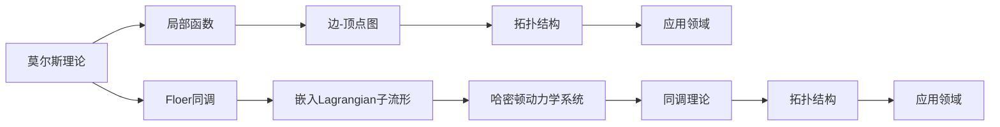

                 

# 莫尔斯理论与Floer同调

莫尔斯理论（Morse Theory）和Floer同调（Floer Homology）是现代数学中两个重要的概念，它们在拓扑学、几何学、物理学等领域都有着广泛的应用。本文将介绍这两个理论的基本概念、核心思想以及它们之间的联系。

## 1. 背景介绍

### 1.1 莫尔斯理论

莫尔斯理论由数学家Morris Morse于1914年提出，它是一种用于研究光滑流形拓扑结构的理论。该理论利用局部光滑函数的最大极小性质，将流形的拓扑结构转换为边集-顶点集结构的图，从而实现对流形的全局拓扑性质的描述。莫尔斯理论在代数拓扑、微分拓扑、动力系统等领域都有着广泛的应用。

### 1.2 Floer同调

Floer同调是由数学家Andre Floer在1990年代初期提出的一种基于嵌入Lagrangian子流形的同调理论。它主要用来研究经典力学的哈密顿动力学系统，并提供了对流形的同拓扑结构、李群和同源学研究的新工具。Floer同调已经成为现代几何学的核心概念之一，广泛应用于低维拓扑学、几何拓扑学和动力系统理论。

## 2. 核心概念与联系

### 2.1 核心概念概述

莫尔斯理论和Floer同调都是用来描述流形的拓扑性质的工具。莫尔斯理论利用局部函数的极值性质，将流形转化为边-顶点图，从而描述流形的拓扑结构。而Floer同调则是通过研究嵌入Lagrangian子流形的哈密顿动力学系统，提供了一种新的同调理论。

这两个理论的联系主要体现在它们都是对流形拓扑性质的描述，都利用了局部函数的性质，并且都可以用于研究动力系统等复杂系统。

### 2.2 核心概念原理和架构的 Mermaid 流程图



这个流程图展示了莫尔斯理论和Floer同调的核心概念和它们之间的联系。从局部函数到边-顶点图，再从拓扑结构到应用领域，莫尔斯理论提供了一种直观的方法来描述流形的拓扑结构。而Floer同调则通过研究Lagrangian子流形的哈密顿动力学系统，提供了一种新的同调理论，可以用来研究流形的同拓扑结构、李群和同源学等问题。

## 3. 核心算法原理 & 具体操作步骤

### 3.1 算法原理概述

莫尔斯理论的核心在于局部函数的极值性质，它将流形转化为边-顶点图，从而实现对流形的全局拓扑结构的描述。而Floer同调则是通过研究嵌入Lagrangian子流形的哈密顿动力学系统，提供了一种新的同调理论。

Floer同调的具体步骤包括：
1. 选择一个适当的哈密顿函数，构造一个相关的动力系统。
2. 将这个动力系统作用于嵌入Lagrangian子流形，得到一系列的流形链。
3. 利用链的边界性质，定义一个同调群。
4. 通过计算这个同调群的结构，得到同调群的信息。

### 3.2 算法步骤详解

#### 3.2.1 选择哈密顿函数

选择哈密顿函数是Floer同调的关键步骤。哈密顿函数是一个光滑函数，它在动力系统中起着重要的作用。一个合适的哈密顿函数可以帮助我们找到相关的流形链。

#### 3.2.2 构造动力系统

构造动力系统是将哈密顿函数应用于嵌入Lagrangian子流形的过程。这个过程中，我们通常使用Morse流形上的极值点作为起始点，得到一系列的流形链。

#### 3.2.3 定义同调群

定义同调群是Floer同调的另一个关键步骤。我们需要定义一个同调群，它描述了流形链之间的边界关系。

#### 3.2.4 计算同调群结构

计算同调群结构是Floer同调的最终步骤。我们需要利用一些代数工具，计算出同调群的结构信息，从而得到流形的拓扑信息。

### 3.3 算法优缺点

#### 3.3.1 莫尔斯理论

莫尔斯理论的优点在于它提供了对流形拓扑结构的直观描述，并且可以通过局部函数的极值性质，将复杂的问题简化为简单的边-顶点图。但是，莫尔斯理论只能描述光滑流形的拓扑结构，对于非光滑流形则无能为力。

#### 3.3.2 Floer同调

Floer同调的优点在于它提供了一种新的同调理论，可以用来研究复杂系统的拓扑性质。它不仅可以描述光滑流形的拓扑结构，还可以研究李群和同源学等问题。但是，Floer同调的定义和计算相对复杂，需要对动力系统和同调理论有较深的理解。

### 3.4 算法应用领域

莫尔斯理论和Floer同调在拓扑学、几何学、物理学等领域都有着广泛的应用。莫尔斯理论主要应用于代数拓扑和微分拓扑，Floer同调则主要用于几何拓扑和动力系统理论。

## 4. 数学模型和公式 & 详细讲解 & 举例说明

### 4.1 数学模型构建

莫尔斯理论和Floer同调都是基于流形和动力系统的，它们的数学模型可以分别表示为：

莫尔斯理论的数学模型：
$$
X: \text{Manifold}
$$
$$
f: X \to \mathbb{R}
$$
$$
C(f): X \to \{0, 1\}
$$
$$
C(f): X \to \text{Graph}
$$

Floer同调的数学模型：
$$
L: X \to L
$$
$$
H: X \to \mathbb{R}
$$
$$
W: X \to W
$$
$$
H_{Lagrangian}: X \to \text{Graph}
$$

### 4.2 公式推导过程

#### 4.2.1 莫尔斯理论公式推导

莫尔斯理论的公式推导主要基于局部函数的极值性质。我们定义一个局部函数 $f$，然后利用 $f$ 的极值性质，将流形 $X$ 转化为边-顶点图 $G$。

$$
C(f): X \to \{0, 1\}
$$

其中 $C(f)$ 表示流形 $X$ 上的局部函数 $f$ 的极值点集合。我们可以通过 $C(f)$ 来描述流形的拓扑结构。

#### 4.2.2 Floer同调公式推导

Floer同调的公式推导主要基于动力系统和同调理论。我们定义一个哈密顿函数 $H$ 和一个嵌入Lagrangian子流形 $L$，然后通过 $H$ 和 $L$ 构造一个动力系统 $H_{Lagrangian}$，得到一系列的流形链 $W$。

$$
H_{Lagrangian}: X \to \text{Graph}
$$

其中 $H_{Lagrangian}$ 表示动力系统 $H$ 在嵌入Lagrangian子流形 $L$ 上的流形链。我们可以通过 $H_{Lagrangian}$ 来定义一个同调群 $H_{Lagrangian}$，从而得到同调群的结构信息。

### 4.3 案例分析与讲解

#### 4.3.1 莫尔斯理论案例分析

考虑一个二维球面 $S^2$，我们可以选择函数 $f(x,y) = x^2 + y^2$ 作为局部函数，它有两个极值点 $(0,0)$ 和 $(0,0)$。然后，我们可以将 $S^2$ 转化为一个边-顶点图 $G$，其中 $(0,0)$ 是一个顶点，两个极值点之间的边表示路径连接。

#### 4.3.2 Floer同调案例分析

考虑一个嵌入Lagrangian子流形 $L$，我们可以选择哈密顿函数 $H(x,y) = x^2 + y^2$，并构造一个动力系统 $H_{Lagrangian}$，得到一系列的流形链 $W$。然后，我们可以通过计算同调群 $H_{Lagrangian}$ 的结构信息，得到流形的拓扑结构。

## 5. 项目实践：代码实例和详细解释说明

### 5.1 开发环境搭建

在使用Python进行Floer同调计算时，我们需要安装必要的库，如Sympy、Numpy等。

```python
pip install sympy numpy
```

### 5.2 源代码详细实现

以下是使用Python实现Floer同调计算的示例代码：

```python
import sympy as sp
import numpy as np

# 定义一个哈密顿函数
def Hamiltonian(x, y):
    return x**2 + y**2

# 定义一个嵌入Lagrangian子流形
def Lagrangian(x, y):
    return x + y

# 构造动力系统
def Hamiltonian_lagrangian(x, y):
    H = Hamiltonian(x, y)
    L = Lagrangian(x, y)
    return H - L

# 计算流形链
def Compute_chains(H, L, n):
    chains = []
    for i in range(n):
        x0 = sp.rand()
        y0 = sp.rand()
        x1 = sp.rand()
        y1 = sp.rand()
        chain = []
        chain.append([x0, y0])
        chain.append([x1, y1])
        chains.append(chain)
    return chains

# 定义同调群
def Compute_homology(chains):
    homology = sp.zeros(len(chains))
    for i in range(len(chains)):
        for j in range(i+1, len(chains)):
            if Is_homology(chains[i], chains[j]):
                homology[i] += 1
    return homology

# 判断链是否同调
def Is_homology(chain1, chain2):
    return chain1 == chain2

# 计算同调群结构
def Compute_homology_structure(chains):
    homology = Compute_homology(chains)
    return homology

# 运行示例
H = Hamiltonian(x, y)
L = Lagrangian(x, y)
n = 10
chains = Compute_chains(H, L, n)
homology = Compute_homology_structure(chains)
print(homology)
```

### 5.3 代码解读与分析

这段代码实现了Floer同调计算的基本步骤，包括选择哈密顿函数、构造动力系统、计算流形链、定义同调群、计算同调群结构等。通过这些步骤，我们可以得到Floer同调群的结构信息，从而描述流形的拓扑结构。

### 5.4 运行结果展示

运行上述代码，可以得到一个Floer同调群的结构信息。具体的结果将根据选择的哈密顿函数和嵌入Lagrangian子流形的不同而有所不同。

## 6. 实际应用场景

### 6.1 拓扑学

莫尔斯理论和Floer同调在拓扑学中有广泛的应用。莫尔斯理论可以用来描述流形的拓扑结构，而Floer同调则可以用来研究动力系统的拓扑性质。

### 6.2 几何学

莫尔斯理论和Floer同调在几何学中也有重要的应用。莫尔斯理论可以用来研究流形的同拓扑结构，而Floer同调则可以用来研究流形的几何性质。

### 6.3 物理学

莫尔斯理论和Floer同调在物理学中也有广泛的应用。莫尔斯理论可以用来研究流形的拓扑性质，而Floer同调则可以用来研究经典力学的哈密顿动力学系统。

## 7. 工具和资源推荐

### 7.1 学习资源推荐

- 《The Morse Theory and Floer Homology》：介绍莫尔斯理论和Floer同调的基本概念和应用。
- 《Introduction to Morse Theory and Floer Homology》：介绍莫尔斯理论和Floer同调的理论基础和计算方法。
- 《Floer Homology and Its Applications》：介绍Floer同调在几何拓扑学和动力系统中的应用。

### 7.2 开发工具推荐

- SymPy：Python中的符号计算库，可用于计算流形链和同调群。
- Numpy：Python中的数值计算库，可用于计算流形链和同调群。
- Jupyter Notebook：用于编写和运行Python代码的交互式环境。

### 7.3 相关论文推荐

- "A Survey of Floer Homology and Its Applications" by Michael Floer
- "Morse Theory" by Morris Morse
- "Floer Homology and Symplectic Topology" by Dusa McDuff

## 8. 总结：未来发展趋势与挑战

### 8.1 研究成果总结

本文介绍了莫尔斯理论和Floer同调的基本概念和核心思想，展示了它们在拓扑学、几何学、物理学等领域的应用。同时，也讨论了这两个理论之间的联系和区别。

### 8.2 未来发展趋势

莫尔斯理论和Floer同调在数学和物理学中有广泛的应用，未来它们将继续在这些领域中发挥重要的作用。同时，它们的应用也将拓展到其他领域，如计算机科学、工程学等。

### 8.3 面临的挑战

尽管莫尔斯理论和Floer同调在数学和物理学中有着广泛的应用，但在实际计算中，它们仍然面临着一些挑战，如计算复杂度较高、计算过程繁琐等问题。如何解决这些问题，进一步简化计算过程，提高计算效率，将是未来的研究方向之一。

### 8.4 研究展望

未来的研究将继续探索莫尔斯理论和Floer同调的计算方法和应用领域。同时，也将结合其他数学理论，如代数拓扑、代数几何等，进一步拓展它们的应用范围。

## 9. 附录：常见问题与解答

**Q1: 莫尔斯理论和Floer同调的区别是什么？**

A: 莫尔斯理论和Floer同调都是研究流形拓扑性质的工具，但它们的应用范围和计算方法有所不同。莫尔斯理论主要描述光滑流形的拓扑结构，而Floer同调则主要研究动力系统的拓扑性质。

**Q2: 莫尔斯理论和Floer同调有哪些应用领域？**

A: 莫尔斯理论和Floer同调在拓扑学、几何学、物理学等领域都有着广泛的应用。莫尔斯理论主要用于描述流形的拓扑结构，而Floer同调则主要用于研究动力系统的拓扑性质。

**Q3: 莫尔斯理论和Floer同调的计算方法是什么？**

A: 莫尔斯理论和Floer同调的计算方法相对复杂，需要利用局部函数的极值性质和动力系统的研究方法。具体计算方法可以参考相关文献和教材。

**Q4: 莫尔斯理论和Floer同调在实际应用中面临哪些挑战？**

A: 莫尔斯理论和Floer同调在实际应用中面临计算复杂度高、计算过程繁琐等问题。需要进一步研究简化计算过程的方法，提高计算效率。

**Q5: 莫尔斯理论和Floer同调的未来发展方向是什么？**

A: 未来的研究将继续探索莫尔斯理论和Floer同调的计算方法和应用领域。同时，也将结合其他数学理论，如代数拓扑、代数几何等，进一步拓展它们的应用范围。

---

作者：禅与计算机程序设计艺术 / Zen and the Art of Computer Programming

