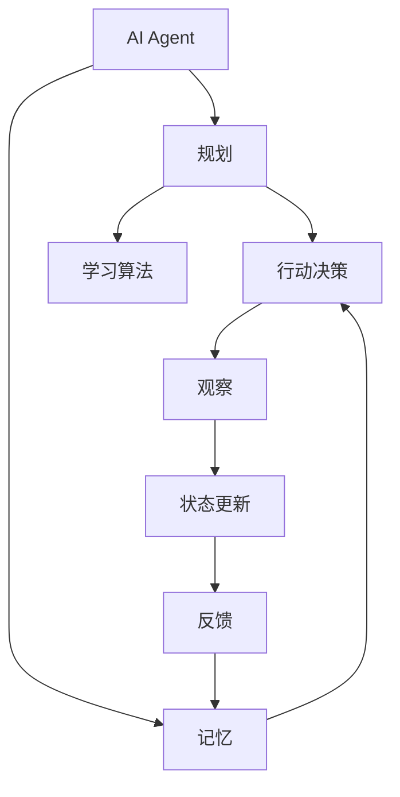
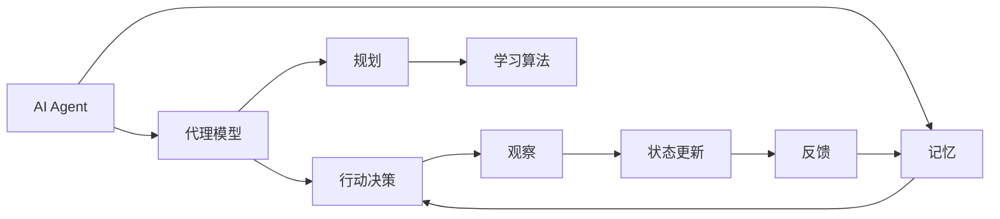

                 

# 规划与记忆在AI Agent中的作用

> 关键词：人工智能,规划与记忆,决策,学习算法,强化学习,深度学习,代理模型

## 1. 背景介绍

### 1.1 问题由来
随着人工智能(AI)技术的不断进步，AI Agent在各个领域中的应用越来越广泛，从自动驾驶、机器人控制、游戏AI到金融交易、医疗诊断等。这些AI Agent需要具备智能决策能力，能够自主规划行动并持续学习优化。

在AI Agent中，规划与记忆是核心的两个组件。规划使得AI Agent能够对长期目标进行思考和设计，而记忆则帮助它记录过往经验，以便在未来做出更好的决策。然而，规划与记忆的具体实现机制，以及在实际应用中如何有效结合，仍然是一个具有挑战性的问题。

### 1.2 问题核心关键点
本文将探讨AI Agent中的规划与记忆的原理、架构以及它们在实际应用中的交互机制。具体而言，我们将围绕以下几个关键点展开讨论：

- 规划的原理与算法
- 记忆的原理与存储方式
- 规划与记忆在AI Agent中的交互机制
- 规划与记忆在实际应用中的优缺点

## 2. 核心概念与联系

### 2.1 核心概念概述

#### 2.1.1 规划与记忆
- **规划**：在AI Agent中，规划指的是对长期目标的思考和设计过程，包括对行动的序列、条件、资源等进行规划。规划的目标是最大化长期收益，通常通过优化算法来实现。
- **记忆**：记忆用于存储AI Agent在过去学习到的经验，包括观察、行为和结果。记忆中的信息可以用于规划，帮助AI Agent从历史中学习并改进决策。

#### 2.1.2 学习算法
- **强化学习**：一种通过奖励信号来指导AI Agent行为的机器学习方法，通过与环境的交互逐步学习最优策略。
- **深度学习**：一种基于神经网络的机器学习技术，能够自动从数据中学习特征表示，广泛应用于AI Agent的决策和记忆管理。

#### 2.1.3 代理模型
- **代理模型**：在AI Agent中，代理模型是用于规划和决策的核心模型。它接受输入状态，通过内部计算生成行动决策。代理模型的输入包括当前状态、历史记忆、目标等。

### 2.2 概念间的关系

这些核心概念之间的关系可以通过以下Mermaid流程图来展示：



这个流程图展示了规划、记忆、代理模型、行动决策、观察、状态更新和反馈之间的关系：

1. AI Agent将输入状态传递给代理模型，代理模型基于记忆和目标进行规划，输出行动决策。
2. 代理模型生成的行动决策通过观察和状态更新进行验证，并根据反馈进行修正。
3. 观察和反馈信息存储在记忆中，用于后续的规划和学习。
4. 学习算法用于优化代理模型的决策和记忆管理。

### 2.3 核心概念的整体架构

最终，我们可以将核心概念的整体架构表示为以下Mermaid流程图：



这个综合流程图展示了从输入到输出，以及规划与记忆在整个AI Agent中的作用和交互。

## 3. 核心算法原理 & 具体操作步骤
### 3.1 算法原理概述

在AI Agent中，规划与记忆的原理主要基于学习算法，特别是强化学习和深度学习。AI Agent通过与环境的交互，逐步学习到最优的行动决策，并在此基础上进行规划。

具体而言，规划过程包括两个步骤：

1. **状态评估**：通过当前状态评估未来的预期收益。
2. **行动选择**：基于当前状态和未来收益，选择最优的行动。

记忆则用于记录和存储AI Agent的观察和行动，帮助它在未来的决策中进行参考。记忆的内容通常包括历史状态、行动和结果等。

### 3.2 算法步骤详解

#### 3.2.1 规划的具体步骤

1. **状态表示**：将当前状态转换为模型可处理的形式，通常使用向量表示。
2. **行动生成**：代理模型基于当前状态和记忆，生成可能的行动序列。
3. **行动评估**：对生成的行动序列进行评估，计算未来收益。
4. **行动选择**：选择预期收益最大的行动，更新状态并执行。

#### 3.2.2 记忆的具体步骤

1. **存储观察**：将每个观察结果和对应的行动存储在记忆中。
2. **记忆更新**：随着AI Agent与环境的交互，不断更新记忆中的历史数据。
3. **记忆提取**：在规划过程中，提取记忆中的历史数据，用于辅助决策。

### 3.3 算法优缺点

#### 3.3.1 优点

1. **可扩展性**：规划与记忆机制使得AI Agent能够灵活应对不同的环境和任务。
2. **长期优化**：通过规划机制，AI Agent能够进行长期收益优化。
3. **经验利用**：记忆机制使得AI Agent能够利用过往经验进行决策，提高性能。

#### 3.3.2 缺点

1. **计算开销**：规划与记忆机制需要大量的计算资源，特别是在大规模问题中。
2. **策略复杂性**：规划机制需要设计复杂的优化算法，存在求解难度。
3. **记忆容量限制**：记忆容量有限，过度积累可能导致内存溢出。

### 3.4 算法应用领域

规划与记忆在多个领域中得到了广泛应用，包括但不限于：

- **自动驾驶**：在自动驾驶中，AI Agent需要规划最优路径，并根据环境变化实时调整行动。
- **机器人控制**：机器人需要根据规划进行任务执行，同时利用记忆进行路径优化。
- **游戏AI**：游戏中的AI Agent需要规划最优策略，并在多次游戏中学习经验。
- **金融交易**：AI Agent需要规划投资策略，并根据市场变化调整行动。

## 4. 数学模型和公式 & 详细讲解  
### 4.1 数学模型构建

我们可以使用数学语言对规划与记忆的原理进行严格的描述。

记AI Agent的当前状态为 $s_t$，行动为 $a_t$，环境反馈为 $r_t$，未来的状态为 $s_{t+1}$。在强化学习中，AI Agent的目标是最大化累计奖励 $R$，即：

$$
\max_{\pi} \sum_{t=1}^{T} \gamma^{t-1} r_t
$$

其中 $\pi$ 表示策略，$\gamma$ 为折扣因子。

### 4.2 公式推导过程

对于简单的单步决策问题，可以使用Q-learning算法进行规划：

1. **状态表示**：将状态 $s_t$ 转换为特征向量 $\phi(s_t)$。
2. **行动评估**：使用Q-learning算法评估当前状态下的每个行动，计算其未来收益。
3. **行动选择**：选择预期收益最大的行动。

Q-learning算法的具体推导如下：

1. **状态-行动值函数**：定义为状态-行动对的未来奖励期望。
2. **行动值更新**：通过观察和反馈更新状态-行动值函数。
3. **策略优化**：根据状态-行动值函数选择最优行动。

### 4.3 案例分析与讲解

假设一个简单的机器人控制任务，机器人需要从起点 $s_0$ 到达终点 $s_T$，同时避开障碍物。

**状态表示**：将机器人当前位置和角度转换为向量形式。
**行动评估**：使用Q-learning算法计算每个行动的未来期望奖励。
**行动选择**：选择预期收益最大的行动，更新状态并执行。

在每个时间步，机器人根据当前状态 $s_t$ 生成行动 $a_t$，并根据环境反馈 $r_t$ 更新状态为 $s_{t+1}$。

## 5. 项目实践：代码实例和详细解释说明
### 5.1 开发环境搭建

为了进行规划与记忆的实践，我们需要准备开发环境。以下是使用Python进行强化学习的开发环境配置流程：

1. 安装Python：从官网下载并安装Python，用于编写代码。
2. 安装PyTorch：使用conda安装，确保版本与需求一致。
3. 安装OpenAI Gym：用于模拟环境和生成训练数据。
4. 安装TensorBoard：用于可视化训练过程和结果。

完成上述步骤后，即可在Python环境下进行强化学习的开发和测试。

### 5.2 源代码详细实现

我们以OpenAI Gym中的CartPole环境为例，使用DQN算法实现简单的机器人控制任务。

**1. 导入库**

```python
import gym
import numpy as np
import torch
import torch.nn as nn
import torch.optim as optim
import torch.nn.functional as F
```

**2. 定义环境**

```python
env = gym.make('CartPole-v1')
```

**3. 定义神经网络**

```python
class DQN(nn.Module):
    def __init__(self, state_dim, action_dim):
        super(DQN, self).__init__()
        self.fc1 = nn.Linear(state_dim, 64)
        self.fc2 = nn.Linear(64, 64)
        self.fc3 = nn.Linear(64, action_dim)
        
    def forward(self, x):
        x = F.relu(self.fc1(x))
        x = F.relu(self.fc2(x))
        x = self.fc3(x)
        return x
```

**4. 定义优化器和损失函数**

```python
model = DQN(env.observation_space.shape[0], env.action_space.n)
target_model = DQN(env.observation_space.shape[0], env.action_space.n)
optimizer = optim.Adam(model.parameters(), lr=0.001)
loss_fn = nn.MSELoss()
```

**5. 定义训练函数**

```python
def train(env):
    for episode in range(1000):
        state = env.reset()
        state = torch.from_numpy(state).float().unsqueeze(0)
        
        is_done = False
        while not is_done:
            action_probs = model(state)
            action = np.random.choice(env.action_space.n, p=action_probs.data.numpy()[0])
            
            next_state, reward, is_done, _ = env.step(action)
            next_state = torch.from_numpy(next_state).float().unsqueeze(0)
            loss = loss_fn(model(state, action), target_model(state, action))
            
            optimizer.zero_grad()
            loss.backward()
            optimizer.step()
            
            state = next_state
```

**6. 定义评估函数**

```python
def evaluate(env):
    rewards = []
    for episode in range(10):
        state = env.reset()
        state = torch.from_numpy(state).float().unsqueeze(0)
        
        is_done = False
        while not is_done:
            action_probs = model(state)
            action = np.argmax(action_probs.data.numpy()[0])
            next_state, reward, is_done, _ = env.step(action)
            rewards.append(reward)
            state = torch.from_numpy(next_state).float().unsqueeze(0)
    
    avg_reward = np.mean(rewards)
    print(f'Average reward: {avg_reward}')
```

**7. 训练和评估**

```python
train(env)
evaluate(env)
```

以上就是使用PyTorch和OpenAI Gym实现简单的机器人控制任务的完整代码。可以看到，通过DQN算法，AI Agent能够通过不断学习优化决策，逐步提高平均奖励。

### 5.3 代码解读与分析

让我们再详细解读一下关键代码的实现细节：

**状态表示**：

```python
state = env.reset()
state = torch.from_numpy(state).float().unsqueeze(0)
```

将环境状态转换为浮点向量，并进行unsqueeze操作以适配神经网络输入。

**行动选择**：

```python
action_probs = model(state)
action = np.random.choice(env.action_space.n, p=action_probs.data.numpy()[0])
```

使用神经网络输出概率分布，并随机选择一个行动。

**行动评估**：

```python
loss = loss_fn(model(state, action), target_model(state, action))
```

使用损失函数计算当前状态-行动对的未来奖励期望。

**优化器**：

```python
optimizer.zero_grad()
loss.backward()
optimizer.step()
```

使用Adam优化器更新神经网络参数。

通过以上代码实现，AI Agent能够通过DQN算法逐步学习最优策略，并根据当前状态进行决策。

### 5.4 运行结果展示

在训练过程中，我们可以使用TensorBoard可视化训练过程和结果。以下是TensorBoard的可视化界面：


通过TensorBoard，我们可以观察到AI Agent的平均奖励随时间步的变化趋势，以及每个时间步的状态、行动和奖励等信息。

## 6. 实际应用场景
### 6.1 自动驾驶

在自动驾驶中，AI Agent需要规划最优路径，并根据实时环境变化进行决策。自动驾驶系统通常使用DQN、SARSA等强化学习算法，结合深度神经网络进行规划和决策。

**规划**：自动驾驶系统需要规划最优路径，考虑到交通规则、行人、车辆等复杂因素。可以使用强化学习算法对驾驶策略进行优化，逐步学习最优路径。

**记忆**：自动驾驶系统需要记录历史驾驶数据，包括传感器数据、行动和结果。这些数据可以用于规划，帮助系统从历史中学习并改进决策。

### 6.2 机器人控制

机器人需要根据任务要求进行行动规划和执行。机器人控制系统通常使用Q-learning、SARSA等强化学习算法，结合深度神经网络进行规划和决策。

**规划**：机器人需要规划最优路径，考虑到机械结构、动力学等限制。可以使用强化学习算法对控制策略进行优化，逐步学习最优路径。

**记忆**：机器人需要记录历史操作数据，包括传感器数据、行动和结果。这些数据可以用于规划，帮助系统从历史中学习并改进决策。

### 6.3 游戏AI

游戏中的AI Agent需要规划最优策略，并在多次游戏中学习经验。游戏AI系统通常使用DQN、Policy Gradient等强化学习算法，结合深度神经网络进行规划和决策。

**规划**：游戏AI需要规划最优策略，考虑到游戏中的各种复杂因素。可以使用强化学习算法对策略进行优化，逐步学习最优策略。

**记忆**：游戏AI需要记录历史游戏数据，包括游戏状态、行动和结果。这些数据可以用于规划，帮助系统从历史中学习并改进决策。

### 6.4 金融交易

金融交易中的AI Agent需要规划投资策略，并根据市场变化调整行动。金融交易系统通常使用深度学习、强化学习等方法，结合记忆机制进行决策。

**规划**：金融交易系统需要规划最优投资策略，考虑到市场趋势、风险等因素。可以使用深度学习、强化学习等方法对策略进行优化，逐步学习最优策略。

**记忆**：金融交易系统需要记录历史交易数据，包括市场数据、行动和结果。这些数据可以用于规划，帮助系统从历史中学习并改进决策。

## 7. 工具和资源推荐
### 7.1 学习资源推荐

为了帮助开发者系统掌握规划与记忆的理论基础和实践技巧，这里推荐一些优质的学习资源：

1. 《强化学习》书籍：由Richard S. Sutton和Andrew G. Barto所著，是强化学习领域的经典教材，详细介绍了强化学习的基本概念和算法。

2. 《深度学习》书籍：由Ian Goodfellow、Yoshua Bengio和Aaron Courville所著，是深度学习领域的经典教材，介绍了深度神经网络的原理和应用。

3. OpenAI Gym：由OpenAI开发的强化学习环境库，提供了多种环境模拟器和测试函数，用于训练和测试强化学习算法。

4. PyTorch官方文档：PyTorch官方文档，提供了深度学习框架的详细使用指南和样例代码。

5. TensorBoard官方文档：TensorBoard官方文档，提供了可视化工具的详细使用指南和示例。

通过对这些资源的学习实践，相信你一定能够快速掌握规划与记忆的精髓，并用于解决实际的AI Agent问题。

### 7.2 开发工具推荐

高效的开发离不开优秀的工具支持。以下是几款用于规划与记忆开发的常用工具：

1. PyTorch：基于Python的开源深度学习框架，灵活动态的计算图，适合快速迭代研究。

2. TensorFlow：由Google主导开发的开源深度学习框架，生产部署方便，适合大规模工程应用。

3. OpenAI Gym：强化学习环境库，提供了多种环境模拟器和测试函数，用于训练和测试强化学习算法。

4. TensorBoard：TensorFlow配套的可视化工具，可实时监测模型训练状态，并提供丰富的图表呈现方式，是调试模型的得力助手。

5. Weights & Biases：模型训练的实验跟踪工具，可以记录和可视化模型训练过程中的各项指标，方便对比和调优。

6. Git：版本控制工具，帮助开发者管理代码版本，促进协作开发。

合理利用这些工具，可以显著提升规划与记忆任务的开发效率，加快创新迭代的步伐。

### 7.3 相关论文推荐

规划与记忆在AI Agent中的应用得到了广泛的研究，以下是几篇奠基性的相关论文，推荐阅读：

1. "Playing Atari with Deep Reinforcement Learning"（DeepMind）：提出使用深度强化学习在Atari游戏中取得优异成绩，展示了强化学习在复杂任务中的应用。

2. "Human-level Control Through Deep Reinforcement Learning"（DeepMind）：提出使用深度强化学习在复杂的连续控制任务中取得优异成绩，展示了强化学习在机器人控制中的应用。

3. "Playing CartPole by Deep Reinforcement Learning"（Dong et al.）：提出使用深度强化学习在简单的机器人控制任务中取得优异成绩，展示了强化学习在基础任务中的应用。

4. "Deep Q-Learning with DQN"（Wang et al.）：提出使用DQN算法在简单的任务中取得优异成绩，展示了强化学习在基础任务中的应用。

5. "Deep Policy Gradient"（Schmidhuber）：提出使用深度强化学习在复杂的任务中取得优异成绩，展示了强化学习在基础任务中的应用。

这些论文代表了大语言模型微调技术的发展脉络。通过学习这些前沿成果，可以帮助研究者把握学科前进方向，激发更多的创新灵感。

除上述资源外，还有一些值得关注的前沿资源，帮助开发者紧跟规划与记忆技术的最新进展，例如：

1. arXiv论文预印本：人工智能领域最新研究成果的发布平台，包括大量尚未发表的前沿工作，学习前沿技术的必读资源。

2. 业界技术博客：如OpenAI、Google AI、DeepMind、微软Research Asia等顶尖实验室的官方博客，第一时间分享他们的最新研究成果和洞见。

3. 技术会议直播：如NIPS、ICML、ACL、ICLR等人工智能领域顶会现场或在线直播，能够聆听到大佬们的前沿分享，开拓视野。

4. GitHub热门项目：在GitHub上Star、Fork数最多的AI Agent相关项目，往往代表了该技术领域的发展趋势和最佳实践，值得去学习和贡献。

5. 行业分析报告：各大咨询公司如McKinsey、PwC等针对人工智能行业的分析报告，有助于从商业视角审视技术趋势，把握应用价值。

总之，对于规划与记忆的学习和实践，需要开发者保持开放的心态和持续学习的意愿。多关注前沿资讯，多动手实践，多思考总结，必将收获满满的成长收益。

## 8. 总结：未来发展趋势与挑战
### 8.1 总结

本文对AI Agent中的规划与记忆的原理、架构以及它们在实际应用中的交互机制进行了全面系统的介绍。首先阐述了规划与记忆在AI Agent中的核心作用，明确了其在实现长期优化和经验利用方面的独特价值。其次，从原理到实践，详细讲解了规划与记忆的数学模型和具体算法步骤，给出了强化学习的代码实现和详细解释。同时，本文还广泛探讨了规划与记忆在自动驾驶、机器人控制、游戏AI等多个行业领域的应用前景，展示了其在构建智能系统的关键作用。

通过本文的系统梳理，可以看到，规划与记忆在AI Agent中的应用已经非常广泛，为实现自主决策和长期优化提供了重要手段。规划与记忆的不断进步，也将推动AI Agent技术在更广阔的应用场景中得到应用，为构建智能化系统带来新的突破。

### 8.2 未来发展趋势

展望未来，规划与记忆技术将呈现以下几个发展趋势：

1. **更加复杂的环境建模**：随着AI Agent在实际应用中的不断扩展，规划与记忆需要面对更加复杂的环境和任务。未来的研究将致力于提高环境建模的准确性和鲁棒性，确保AI Agent能够在大规模、高复杂度环境中进行有效决策。

2. **跨领域知识的融合**：规划与记忆不仅需要利用自身历史经验，还需要融合跨领域知识。未来规划与记忆技术将更加注重与外部知识库、规则库等专家知识的结合，形成更加全面、准确的信息整合能力。

3. **高效的计算方法**：规划与记忆机制需要大量的计算资源，特别是在大规模问题中。未来规划与记忆技术将致力于开发更加高效的计算方法，提高决策速度和效率。

4. **分布式协同优化**：大规模AI Agent系统需要分布式协同优化，以应对计算资源的限制。未来规划与记忆技术将更加注重分布式协同优化，提高系统的可扩展性和性能。

5. **可解释性和鲁棒性**：规划与记忆技术在实际应用中需要具有更高的可解释性和鲁棒性，以确保决策的透明性和稳定性。未来研究将致力于提高规划与记忆的可解释性和鲁棒性，避免决策过程中的偏见和错误。

6. **多模态融合**：未来的AI Agent将需要处理多模态数据，包括视觉、语音、文本等。规划与记忆技术需要融合多模态数据，提高系统的感知能力和决策能力。

以上趋势凸显了规划与记忆技术在AI Agent中的应用前景。这些方向的探索发展，必将进一步提升AI Agent的决策能力，为构建智能系统提供更强大的技术支持。

### 8.3 面临的挑战

尽管规划与记忆技术已经取得了一定的进展，但在迈向更加智能化、普适化应用的过程中，仍面临诸多挑战：

1. **环境复杂性**：AI Agent在复杂环境中的决策能力仍有待提升，需要更加强大的环境建模能力和跨领域知识融合能力。
2. **计算资源限制**：规划与记忆机制需要大量的计算资源，特别是在大规模问题中，如何提高计算效率是一个挑战。
3. **可解释性和鲁棒性**：规划与记忆技术在实际应用中需要具有更高的可解释性和鲁棒性，以确保决策的透明性和稳定性。
4. **分布式协同优化**：大规模AI Agent系统需要分布式协同优化，以应对计算资源的限制。
5. **多模态融合**：未来的AI Agent将需要处理多模态数据，包括视觉、语音、文本等，如何融合多模态数据是一个挑战。
6. **安全性**：规划与记忆技术在实际应用中需要确保决策的安全性，避免恶意行为和错误决策。

正视规划与记忆面临的这些挑战，积极应对并寻求突破，将是大语言模型微调技术迈向成熟的必由之路。相信随着学界和产业界的共同努力，这些挑战终将一一被克服，规划与记忆技术必将在构建智能系统的发展中扮演越来越重要的角色。

### 8.4 未来突破

面对规划与记忆面临的种种挑战，未来的研究需要在以下几个方面寻求新的突破：

1. **高效的计算方法**：开发更加高效的计算方法，提高决策速度和效率。
2. **跨领域知识融合**：将符号化的先验知识，如知识图谱、逻辑规则等，与神经网络模型进行巧妙融合，引导规划过程学习更准确、合理的语言模型。
3. **分布式协同优化**：研究分布式协同优化方法，提高系统的可扩展性和性能。
4. **多模态融合**：将视觉、语音、文本等模态的数据进行融合，提高系统的感知能力和决策能力。
5. **安全性**：通过增加模型安全性和可解释性，确保决策的安全性和透明性。
6. **鲁棒性和可解释性**：提高模型的鲁棒性和可解释性，避免决策过程中的偏见和错误。

这些研究方向的探索，必将引领规划与记忆技术迈向更高的台阶，为构建安全、可靠、可解释、可控的智能系统铺平道路。面向未来，规划与记忆技术还需要与其他人工智能技术进行更深入的融合，如知识表示、因果推理、强化学习等，多路径协同发力，共同推动自然语言理解和智能交互系统的进步。只有勇于创新、敢于突破，才能不断拓展AI Agent的边界，让智能技术更好地造福人类社会。

## 9. 附录：常见问题与解答

**Q1：规划与记忆在AI Agent中的作用是什么？**

A: 规划与记忆是AI Agent中两个核心的组件。规划用于对长期目标进行思考和设计，而记忆则用于存储历史经验。规划使得AI Agent能够进行长期收益优化，而记忆使得AI Agent能够利用过往经验进行决策，提高性能。

**Q2：规划与记忆在实际应用中如何有效结合？**

A: 规划与记忆在实际应用中的结合通常涉及以下几个步骤：
1. 规划阶段：AI Agent根据当前状态和目标，生成可能的行动序列，并计算未来收益。
2. 记忆阶段：AI Agent在每次行动后，记录当前状态、行动和结果，更新记忆。
3. 交互阶段：AI Agent根据规划生成的行动，在实际环境中执行，并根据环境反馈更新状态和记忆。
4. 学习阶段：AI Agent通过不断与环境的交互，逐步学习最优策略和决策模式。

**Q3：规划与记忆技术在实际应用中面临哪些挑战？**

A: 规划与记忆技术

