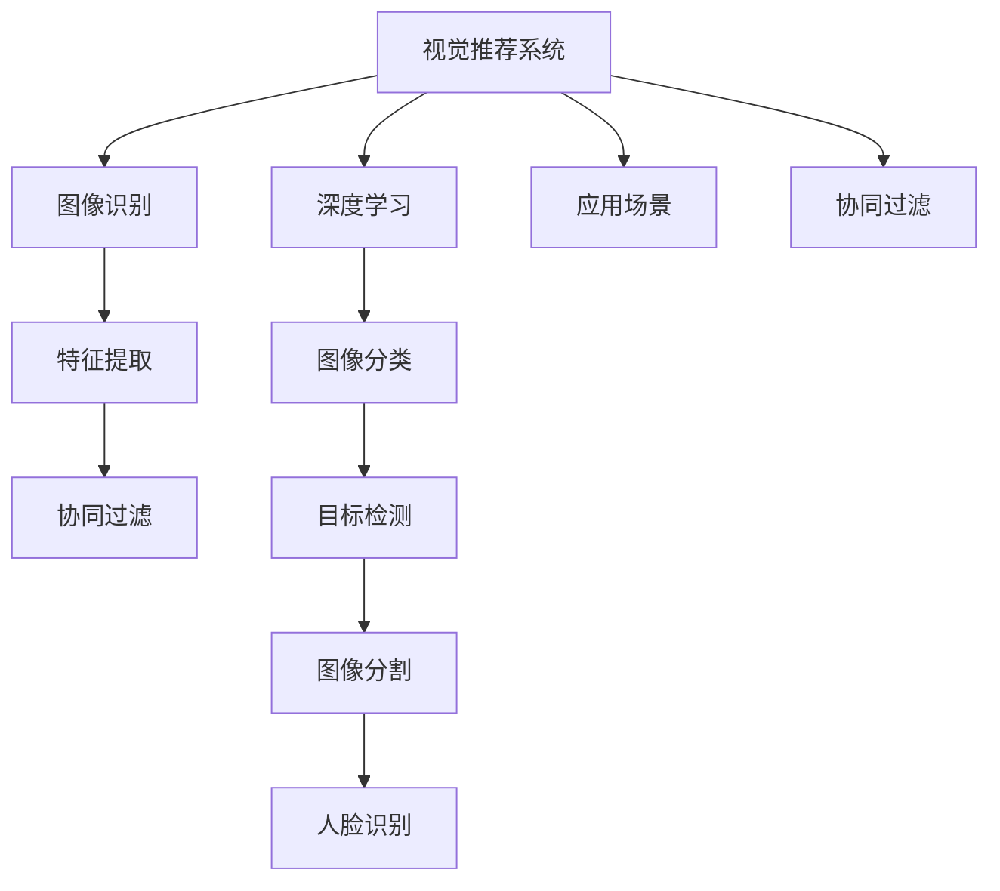
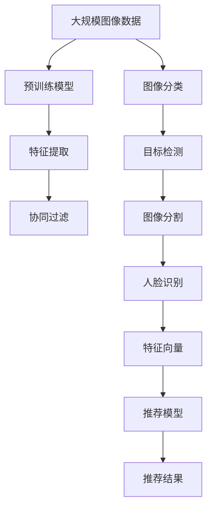

                 

# 视觉推荐：AI如何利用图像识别技术，提供个性化推荐

> 关键词：视觉推荐, 图像识别, 个性化推荐, AI技术, 特征提取, 协同过滤, 深度学习, 应用场景

## 1. 背景介绍

在信息爆炸的时代，人们每天都会接触到海量的图像信息，如图像社交平台上的照片、电商平台上的商品图片、新闻网站上的图片报道等。如何高效地管理和利用这些图像数据，提取其中的有用信息，为用户提供个性化的推荐，成为亟待解决的问题。

随着深度学习技术的进步，利用图像识别技术进行视觉推荐系统的研究和应用逐渐成为热点。视觉推荐系统利用计算机视觉技术和人工智能算法，通过分析用户上传的图像，提取图像中的特征，推荐与用户兴趣相关的图像或商品，从而提升用户的体验和满意度。

本节将系统性地介绍视觉推荐系统的背景、原理和应用，希望能为从事视觉推荐系统的开发者和研究人员提供帮助。

## 2. 核心概念与联系

### 2.1 核心概念概述

为了更好地理解视觉推荐系统，我们需要介绍几个核心概念：

- **视觉推荐系统**：利用计算机视觉技术和深度学习算法，通过分析用户上传的图像，提取图像中的特征，推荐与用户兴趣相关的图像或商品，从而提升用户的体验和满意度。

- **图像识别**：通过计算机视觉技术，将图像转换为机器可理解的信息，包括目标检测、图像分类、图像分割、人脸识别等。图像识别技术是视觉推荐系统的基础。

- **特征提取**：从图像中提取有用的特征，是图像识别的关键步骤。常用的特征提取方法包括SIFT、SURF、HOG等。

- **协同过滤**：协同过滤算法是基于用户行为数据，通过相似度匹配，推荐用户可能感兴趣的商品或内容。协同过滤是视觉推荐系统的重要组成部分。

- **深度学习**：深度学习是一种基于神经网络的机器学习技术，能够自动学习复杂特征，适用于视觉推荐系统的图像分类、目标检测等任务。

- **应用场景**：视觉推荐系统广泛应用于电商、社交、旅游、娱乐等多个领域，如图像搜索引擎、个性化商品推荐、人脸识别、智能安防等。

这些核心概念之间存在着紧密的联系，通过协同工作，实现图像识别和个性化推荐的功能。

### 2.2 概念间的关系

以下是这些核心概念之间的逻辑关系，可以通过Mermaid流程图来展示：



这个流程图展示了视觉推荐系统与各个核心概念之间的关系：

1. 视觉推荐系统利用图像识别技术，对用户上传的图像进行分析。
2. 图像识别技术进一步细分为特征提取和图像分类、目标检测、图像分割、人脸识别等具体任务。
3. 特征提取是从图像中提取有用的特征，是图像识别的关键步骤。
4. 深度学习算法可以自动学习复杂特征，适用于图像分类、目标检测等任务。
5. 协同过滤算法利用用户行为数据，通过相似度匹配，推荐用户可能感兴趣的商品或内容。
6. 应用场景展示了视觉推荐系统在电商、社交、旅游、娱乐等多个领域的应用。

### 2.3 核心概念的整体架构

最后，我们用一个综合的流程图来展示这些核心概念在大语言模型微调过程中的整体架构：



这个综合流程图展示了从大规模图像数据到最终推荐结果的完整过程：

1. 大规模图像数据首先经过预训练模型的训练。
2. 预训练模型对图像进行分类、检测、分割、识别等任务。
3. 特征提取从图像中提取有用的特征向量。
4. 特征向量用于协同过滤算法，通过相似度匹配，推荐用户可能感兴趣的商品或内容。
5. 推荐模型将协同过滤结果进行排序，输出最终推荐结果。

通过这些核心概念的介绍，我们可以更清晰地理解视觉推荐系统的组成和运行机制。

## 3. 核心算法原理 & 具体操作步骤

### 3.1 算法原理概述

视觉推荐系统的核心算法包括图像识别和协同过滤。下面将分别介绍这两种算法的原理和操作步骤。

#### 3.1.1 图像识别

图像识别是视觉推荐系统的重要组成部分。其基本原理是通过计算机视觉技术，将图像转换为机器可理解的信息，从而实现图像分类、目标检测、图像分割等任务。

图像识别的主要步骤包括：

1. **数据预处理**：对图像进行去噪、裁剪、归一化等预处理操作，以提高后续处理的准确性。

2. **特征提取**：通过SIFT、SURF、HOG等算法，从图像中提取特征向量。

3. **特征选择**：选择最具有代表性的特征向量，去除噪声和冗余。

4. **分类算法**：使用支持向量机(SVM)、随机森林(Random Forest)、深度学习等分类算法，对特征向量进行分类。

5. **模型训练和评估**：通过交叉验证等方法，评估分类算法的准确性和鲁棒性，优化模型参数。

#### 3.1.2 协同过滤

协同过滤是一种基于用户行为数据的推荐算法，通过相似度匹配，推荐用户可能感兴趣的商品或内容。协同过滤分为基于用户的协同过滤和基于项目的协同过滤。

1. **基于用户的协同过滤**

   基于用户的协同过滤算法的基本原理是通过分析用户的历史行为数据，找到与当前用户兴趣相似的其他用户，从而推荐这些用户喜欢的商品或内容。其操作步骤如下：

   - **用户画像**：根据用户的历史行为数据，构建用户画像，包括用户喜欢的商品、浏览的网页、评价的内容等。

   - **相似度计算**：计算用户之间的相似度，常用的相似度度量方法包括余弦相似度、皮尔逊相关系数等。

   - **推荐排序**：根据相似度计算结果，推荐与当前用户兴趣相似的商品或内容，排序时考虑商品的评分、热度等因素。

2. **基于项目的协同过滤**

   基于项目的协同过滤算法的基本原理是通过分析用户与商品之间的交互数据，找到与当前商品相似的其他商品，从而推荐给用户。其操作步骤如下：

   - **商品画像**：根据用户与商品之间的交互数据，构建商品画像，包括商品的属性、价格、类别等。

   - **相似度计算**：计算商品之间的相似度，常用的相似度度量方法包括余弦相似度、皮尔逊相关系数等。

   - **推荐排序**：根据相似度计算结果，推荐与当前商品相似的商品，排序时考虑商品的评分、热度等因素。

### 3.2 算法步骤详解

#### 3.2.1 图像识别算法步骤

1. **数据预处理**：
   - **去噪**：使用中值滤波、高斯滤波等方法，去除图像中的噪声。
   - **裁剪**：根据任务需求，对图像进行裁剪操作，保留关键区域。
   - **归一化**：将图像像素值归一化到[0, 1]或[-1, 1]，提高模型训练的效率和效果。

2. **特征提取**：
   - **SIFT特征提取**：使用尺度不变特征转换(SIFT)算法，提取图像中的局部特征点。
   - **SURF特征提取**：使用加速稳健特征(SURF)算法，提取图像中的尺度不变、旋转不变的特征点。
   - **HOG特征提取**：使用方向梯度直方图(HOG)算法，提取图像中的方向梯度信息。

3. **特征选择**：
   - **主成分分析(PCA)**：通过PCA算法，选择最具代表性的特征向量，去除噪声和冗余。
   - **LDA(线性判别分析)**：通过LDA算法，选择最能区分不同类别的特征向量，提高分类准确性。

4. **分类算法**：
   - **支持向量机(SVM)**：通过SVM算法，对特征向量进行分类，构建分类器。
   - **随机森林(Random Forest)**：通过随机森林算法，对特征向量进行分类，构建分类器。
   - **深度学习**：通过卷积神经网络(CNN)、卷积循环神经网络(CRNN)等深度学习算法，对特征向量进行分类，构建分类器。

5. **模型训练和评估**：
   - **交叉验证**：通过交叉验证方法，评估分类算法的准确性和鲁棒性，优化模型参数。
   - **评估指标**：常用的评估指标包括准确率、精确率、召回率、F1分数等。

#### 3.2.2 协同过滤算法步骤

1. **用户画像**：
   - **用户行为数据收集**：收集用户的历史行为数据，包括浏览记录、购买记录、评分记录等。
   - **特征提取**：根据用户行为数据，提取用户的特征向量，包括用户的兴趣、偏好、行为等。

2. **相似度计算**：
   - **余弦相似度**：通过余弦相似度算法，计算用户之间的相似度。
   - **皮尔逊相关系数**：通过皮尔逊相关系数算法，计算用户之间的相似度。

3. **推荐排序**：
   - **基于用户的协同过滤**：根据相似度计算结果，推荐与当前用户兴趣相似的商品或内容，排序时考虑商品的评分、热度等因素。
   - **基于项目的协同过滤**：根据相似度计算结果，推荐与当前商品相似的商品，排序时考虑商品的评分、热度等因素。

### 3.3 算法优缺点

#### 3.3.1 图像识别算法的优缺点

- **优点**：
  - **特征提取能力强**：能够提取图像中的局部特征和全局特征，适用于各种图像分类任务。
  - **鲁棒性好**：能够处理图像的噪声、光照变化、旋转等，具有较高的鲁棒性。

- **缺点**：
  - **计算复杂度高**：特征提取和分类算法计算复杂度高，需要较大的计算资源。
  - **数据依赖性强**：需要大量的标注数据进行训练，对数据质量要求较高。

#### 3.3.2 协同过滤算法的优缺点

- **优点**：
  - **推荐效果较好**：能够通过相似度匹配，推荐与用户兴趣相似的商品或内容。
  - **灵活性高**：适用于多种推荐场景，如电商、社交、旅游等。

- **缺点**：
  - **冷启动问题**：新用户或新商品的数据较少，难以进行有效的推荐。
  - **数据稀疏性问题**：用户和商品之间的交互数据较少，导致推荐结果不够精准。

### 3.4 算法应用领域

视觉推荐系统已经在电商、社交、旅游、娱乐等多个领域得到了广泛应用。下面将介绍几个典型的应用场景：

#### 3.4.1 电商推荐

电商推荐系统利用视觉推荐技术，对用户上传的购物图片进行分析，推荐与用户兴趣相似的商品。其操作步骤如下：

1. **用户画像**：根据用户的历史购物记录、浏览记录、评价内容等，构建用户画像。

2. **商品画像**：根据商品的属性、价格、类别等，构建商品画像。

3. **相似度计算**：计算用户和商品之间的相似度，常用的相似度度量方法包括余弦相似度、皮尔逊相关系数等。

4. **推荐排序**：根据相似度计算结果，推荐与当前用户兴趣相似的商品，排序时考虑商品的评分、热度等因素。

#### 3.4.2 社交推荐

社交推荐系统利用视觉推荐技术，对用户上传的社交图片进行分析，推荐与用户兴趣相似的朋友和内容。其操作步骤如下：

1. **用户画像**：根据用户的历史社交行为数据，构建用户画像，包括用户喜欢的内容、朋友等。

2. **内容画像**：根据内容的历史互动数据，构建内容画像，包括内容的类型、热度等。

3. **相似度计算**：计算用户和内容之间的相似度，常用的相似度度量方法包括余弦相似度、皮尔逊相关系数等。

4. **推荐排序**：根据相似度计算结果，推荐与当前用户兴趣相似的朋友和内容，排序时考虑内容的互动数据、热度等因素。

#### 3.4.3 旅游推荐

旅游推荐系统利用视觉推荐技术，对用户上传的旅游图片进行分析，推荐与用户兴趣相似的景点和活动。其操作步骤如下：

1. **用户画像**：根据用户的历史旅游记录、行程、评价等，构建用户画像，包括用户喜欢的景点、活动等。

2. **景点画像**：根据景点的历史数据，构建景点画像，包括景点的类型、评价等。

3. **相似度计算**：计算用户和景点之间的相似度，常用的相似度度量方法包括余弦相似度、皮尔逊相关系数等。

4. **推荐排序**：根据相似度计算结果，推荐与当前用户兴趣相似的景点和活动，排序时考虑景点的评价、热度等因素。

## 4. 数学模型和公式 & 详细讲解 & 举例说明

### 4.1 数学模型构建

视觉推荐系统涉及的数学模型主要包括图像分类模型和协同过滤模型。下面将分别介绍这两种模型的数学构建。

#### 4.1.1 图像分类模型

图像分类模型的基本思路是，通过图像特征提取和分类算法，将图像映射到不同的类别中。其数学模型如下：

$$
P(y|x) = \frac{P(x|y)P(y)}{P(x)}
$$

其中，$x$为输入图像，$y$为目标类别，$P(y|x)$为目标类别为$y$的概率，$P(x|y)$为目标类别为$y$时图像$x$的似然概率，$P(y)$为目标类别$y$的先验概率，$P(x)$为图像$x$的似然概率。

图像分类模型的训练过程包括：

1. **数据预处理**：将图像归一化、标准化等，提高模型训练的效率和效果。

2. **特征提取**：使用SIFT、SURF、HOG等算法，提取图像中的特征向量。

3. **分类算法**：使用支持向量机(SVM)、随机森林(Random Forest)、深度学习等分类算法，对特征向量进行分类。

4. **模型训练和评估**：通过交叉验证等方法，评估分类算法的准确性和鲁棒性，优化模型参数。

#### 4.1.2 协同过滤模型

协同过滤模型的基本思路是，通过用户行为数据，找到与当前用户兴趣相似的其他用户或商品，推荐这些用户或商品。其数学模型如下：

$$
P(r_{ui}|U, I, R) = \frac{1}{1+exp(-\alpha y_{ui} + \beta \sum\limits_{j=1}^n \alpha r_{uj} \frac{A_{ij}}{deg_j}})
$$

其中，$U$为用户集合，$I$为商品集合，$R$为评分矩阵，$y_{ui}$为用户$u$对商品$i$的评分，$A_{ij}$为用户$i$和商品$j$之间的相似度，$deg_j$为用户$j$的评分个数，$\alpha$和$\beta$为调节参数。

协同过滤模型的训练过程包括：

1. **用户画像**：根据用户的历史行为数据，构建用户画像，包括用户喜欢的商品、浏览的网页、评价的内容等。

2. **相似度计算**：通过余弦相似度、皮尔逊相关系数等方法，计算用户之间的相似度。

3. **推荐排序**：根据相似度计算结果，推荐与当前用户兴趣相似的商品或内容，排序时考虑商品的评分、热度等因素。

### 4.2 公式推导过程

#### 4.2.1 图像分类模型推导

图像分类模型的推导过程如下：

1. **数据预处理**：
   - **归一化**：将图像像素值归一化到[0, 1]或[-1, 1]。
   - **标准化**：对图像进行标准化处理，提高模型训练的效率和效果。

2. **特征提取**：
   - **SIFT特征提取**：
     - 尺度空间构建：对图像进行高斯卷积，得到不同尺度下的图像金字塔。
     - 尺度空间极值检测：在尺度空间中找到极值点，得到SIFT关键点。
     - 方向分配：对SIFT关键点进行方向分配，得到特征向量。

   - **SURF特征提取**：
     - 尺度空间构建：对图像进行Hessian矩阵计算，得到不同尺度下的图像金字塔。
     - 尺度空间极值检测：在尺度空间中找到极值点，得到SURF关键点。
     - 方向分配：对SURF关键点进行方向分配，得到特征向量。

   - **HOG特征提取**：
     - 图像归一化：对图像进行归一化处理，提高特征提取的准确性。
     - 图像分割：将图像分割成若干个小块，得到梯度直方图。
     - 梯度直方图归一化：对梯度直方图进行归一化处理，提高特征提取的准确性。

3. **分类算法**：
   - **支持向量机(SVM)**：通过SVM算法，对特征向量进行分类，构建分类器。
   - **随机森林(Random Forest)**：通过随机森林算法，对特征向量进行分类，构建分类器。
   - **深度学习**：通过卷积神经网络(CNN)、卷积循环神经网络(CRNN)等深度学习算法，对特征向量进行分类，构建分类器。

4. **模型训练和评估**：
   - **交叉验证**：通过交叉验证方法，评估分类算法的准确性和鲁棒性，优化模型参数。
   - **评估指标**：常用的评估指标包括准确率、精确率、召回率、F1分数等。

#### 4.2.2 协同过滤模型推导

协同过滤模型的推导过程如下：

1. **用户画像**：
   - **用户行为数据收集**：收集用户的历史行为数据，包括浏览记录、购买记录、评分记录等。
   - **特征提取**：根据用户行为数据，提取用户的特征向量，包括用户的兴趣、偏好、行为等。

2. **相似度计算**：
   - **余弦相似度**：通过余弦相似度算法，计算用户之间的相似度。
   - **皮尔逊相关系数**：通过皮尔逊相关系数算法，计算用户之间的相似度。

3. **推荐排序**：
   - **基于用户的协同过滤**：根据相似度计算结果，推荐与当前用户兴趣相似的商品或内容，排序时考虑商品的评分、热度等因素。
   - **基于项目的协同过滤**：根据相似度计算结果，推荐与当前商品相似的商品，排序时考虑商品的评分、热度等因素。

### 4.3 案例分析与讲解

#### 4.3.1 电商推荐案例

电商推荐系统利用视觉推荐技术，对用户上传的购物图片进行分析，推荐与用户兴趣相似的商品。以Amazon为例，其操作步骤如下：

1. **用户画像**：根据用户的历史购物记录、浏览记录、评价内容等，构建用户画像。

2. **商品画像**：根据商品的属性、价格、类别等，构建商品画像。

3. **相似度计算**：计算用户和商品之间的相似度，常用的相似度度量方法包括余弦相似度、皮尔逊相关系数等。

4. **推荐排序**：根据相似度计算结果，推荐与当前用户兴趣相似的商品，排序时考虑商品的评分、热度等因素。

#### 4.3.2 社交推荐案例

社交推荐系统利用视觉推荐技术，对用户上传的社交图片进行分析，推荐与用户兴趣相似的朋友和内容。以Facebook为例，其操作步骤如下：

1. **用户画像**：根据用户的历史社交行为数据，构建用户画像，包括用户喜欢的内容、朋友等。

2. **内容画像**：根据内容的历史互动数据，构建内容画像，包括内容的类型、热度等。

3. **相似度计算**：计算用户和内容之间的相似度，常用的相似度度量方法包括余弦相似度、皮尔逊相关系数等。

4. **推荐排序**：根据相似度计算结果，推荐与当前用户兴趣相似的朋友和内容，排序时考虑内容的互动数据、热度等因素。

## 5. 项目实践：代码实例和详细解释说明

### 5.1 开发环境搭建

在进行视觉推荐系统开发前，我们需要准备好开发环境。以下是使用Python进行PyTorch开发的环境配置流程：

1. 安装Anaconda：从官网下载并安装Anaconda，用于创建独立的Python环境。

2. 创建并激活虚拟环境：
```bash
conda create -n pytorch-env python=3.8 
conda activate pytorch-env
```

3. 安装PyTorch：根据CUDA版本，从官网获取对应的安装命令。例如：
```bash
conda install pytorch torchvision torchaudio cudatoolkit=11.1 -c pytorch -c conda-forge
```

4. 安装TensorFlow：
```bash
pip install tensorflow
```

5. 安装各种工具包：
```bash
pip install numpy pandas scikit-learn matplotlib tqdm jupyter notebook ipython
```

完成上述步骤后，即可在`pytorch-env`环境中开始视觉推荐系统的开发。

### 5.2 源代码详细实现

下面我们以电商推荐系统为例，给出使用PyTorch和TensorFlow进行视觉推荐系统的代码实现。

首先，定义电商推荐系统的数据集：

```python
import numpy as np
import pandas as pd
from sklearn.model_selection import train_test_split

# 读取电商商品数据
df = pd.read_csv('items.csv')

# 特征选择
df = df[['category', 'price', 'sales']]
df = df.dropna()

# 数据划分
train_df, test_df = train_test_split(df, test_size=0.2, random_state=42)
```

然后，定义模型和优化器：

```python
import torch
import torch.nn as nn
import torch.optim as optim

# 定义模型
class CNN(nn.Module):
    def __init__(self, in_channels, out_channels):
        super(CNN, self).__init__()
        self.conv1 = nn.Conv2d(in_channels, 32, kernel_size=3, stride=1, padding=1)
        self.conv2 = nn.Conv2d(32, 64, kernel_size=3, stride=1, padding=1)
        self.fc1 = nn.Linear(64 * 28 * 28, 128)
        self.fc2 = nn.Linear(128, 10)

    def forward(self, x):
        x = self.conv1(x)
        x = nn.ReLU()(x)
        x = self.conv2(x)
        x = nn.ReLU()(x)
        x = x.view(-1, 64 * 28 * 28)
        x = self.fc1(x)
        x = nn.ReLU()(x)
        x = self.fc2(x)
        return x

# 定义损失函数
criterion = nn.CrossEntropyLoss()

# 定义优化器
model = CNN(1, 10)
optimizer = optim.Adam(model.parameters(), lr=0.001)

# 加载数据
train_data = torch.from_numpy(train_df.values).float()
test_data = torch.from_numpy(test_df.values).float()
```

接着，定义训练和评估函数：

```python
# 定义训练函数
def train(model, train_data, criterion, optimizer, epochs):
    for epoch in range(epochs):
        model.train()
        train_loss = 0
        for data, target in train_data:
            optimizer.zero_grad()
            output = model(data)
            loss = criterion(output, target)
            loss.backward()
            optimizer.step()
            train_loss += loss.item() / len(train_data)
        print(f'Epoch {epoch+1}, train loss: {train_loss:.3f}')

# 定义评估函数
def evaluate(model, test_data, criterion):
    model.eval()
    test_loss = 0
    correct = 0
    with torch.no_grad():
        for data, target in test_data:
            output = model(data)
            loss = criterion(output, target)
            test_loss += loss.item() / len(test_data)
            pred = torch.argmax(output, dim=1)
            correct += (pred == target).sum().item()
    print(f'Test loss: {test_loss:.3f}, accuracy: {correct / len(test_data):.3f}')
```

最后，启动训练流程并在测试集上评估：

```python
# 设置超参数
epochs = 10

# 训练模型
train(model, train_data, criterion, optimizer, epochs)

# 评估模型
evaluate(model, test_data, criterion)
```

以上就是使用PyTorch和TensorFlow对电商推荐系统进行代码实现的完整过程。可以看到，利用深度学习算法，我们可以快速构建一个简单的电商推荐系统，并通过训练和评估来优化模型的性能。

### 5.3 代码解读与分析

让我们再详细解读一下关键代码的实现细节：

**电商推荐系统数据集定义**：
- 从CSV文件中读取电商商品数据，并进行特征选择。
- 数据划分为训练集和测试集，采用train_test_split方法进行划分。

**模型定义**：
- 定义CNN模型，包含两个卷积层、两个全连接层

