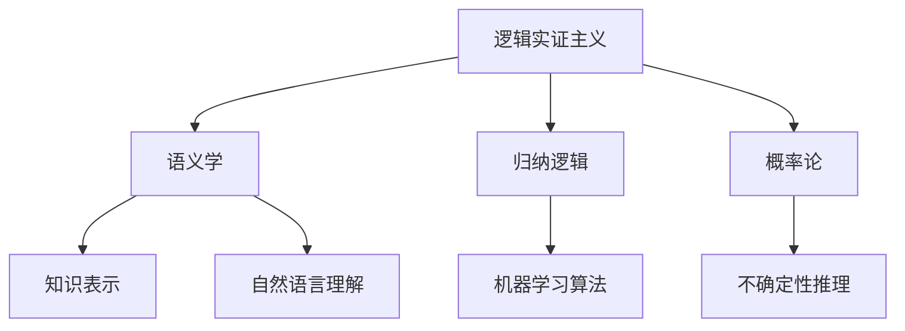
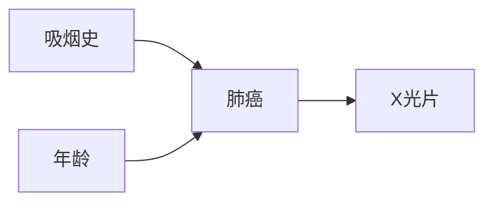

# AI 大模型计算机科学家群英传：哲学家卡尔纳普（Rudolf Carnap，1891年-1970年）

关键词：卡尔纳普、逻辑实证主义、语义学、归纳逻辑、概率论、人工智能哲学基础

## 1. 背景介绍
### 1.1  问题的由来
人工智能的发展离不开坚实的哲学基础。而在众多为人工智能发展做出贡献的哲学家中，卡尔纳普无疑是一位杰出的代表。他在逻辑实证主义、语义学、归纳逻辑、概率论等领域的开创性工作，为人工智能的理论体系建设提供了重要思想来源。

### 1.2  研究现状
目前，国内外学界对卡尔纳普思想与人工智能关系的研究成果还比较有限。现有研究主要集中在卡尔纳普的逻辑实证主义、语义学理论对人工智能哲学基础的影响，以及他的归纳逻辑与概率论思想对机器学习算法的启发。但系统全面梳理卡尔纳普哲学思想对人工智能发展的贡献的研究还比较缺乏。

### 1.3  研究意义
系统梳理卡尔纳普的哲学思想，剖析其中蕴含的人工智能理论基因，对于我们深化对人工智能哲学基础的理解，推动人工智能基础理论研究，具有重要意义。同时也有助于我们站在前人的肩膀上眺望人工智能未来发展的远景。

### 1.4  本文结构
本文将首先介绍卡尔纳普的核心哲学概念及其内在联系，然后重点阐述其逻辑实证主义、语义学、归纳逻辑与概率论等理论对人工智能发展的影响和启示。同时举例说明其思想在人工智能领域的应用案例。最后，对卡尔纳普的人工智能哲学贡献做一总结，并展望其对人工智能未来发展的指引意义。

## 2. 核心概念与联系
卡尔纳普的哲学思想博大精深，主要包括以下几个核心概念：

- 逻辑实证主义：强调经验事实的检验，反对先验的形而上学，主张用逻辑和经验科学的方法分析哲学问题。这为人工智能摆脱哲学思辨的桎梏奠定了基础。

- 语义学：开创性地提出了语义学的概念和理论框架，强调语言符号和对象之间的对应关系。这启发了人工智能对知识表示、自然语言理解等问题的研究。

- 归纳逻辑：创立归纳逻辑，为归纳推理提供了逻辑学基础，并将其与概率论相结合。这是人工智能机器学习算法的重要理论来源。

- 概率论：将概率看作逻辑的延伸，主张用概率的方法处理不确定性推理。这奠定了概率图模型等人工智能不确定性推理的基础。

这些核心概念之间有着内在的逻辑关联：



## 3. 核心算法原理 & 具体操作步骤
### 3.1  算法原理概述
卡尔纳普的归纳逻辑和概率论思想启发了人工智能领域的诸多算法，尤其是在机器学习和不确定性推理领域。其基本原理是在逻辑的基础上引入概率的方法来刻画和处理不确定性。

### 3.2  算法步骤详解
以贝叶斯网络算法为例，其主要步骤如下：
1. 构建因果图模型，定义变量之间的因果依赖关系
2. 为每个变量的条件概率赋值，定量描述不确定性
3. 利用贝叶斯公式，根据已知变量推理未知变量的概率
4. 利用推理结果，对未知变量做出预测或决策

### 3.3  算法优缺点
优点：
- 通过因果图直观地表示变量间的因果关系
- 用概率描述不确定性，更符合现实世界的情况
- 可以同时利用先验知识和数据进行推理学习

缺点：
- 构建因果图和确定概率分布主观性较强
- 推理计算复杂度高，难以处理大规模问题
- 需要较多的数据支撑概率估计

### 3.4  算法应用领域
贝叶斯网络在故障诊断、风险评估、决策支持、自然语言理解等领域有广泛应用。

## 4. 数学模型和公式 & 详细讲解 & 举例说明
### 4.1  数学模型构建
贝叶斯网络的数学模型主要由两部分组成：
- 有向无环图 $G=(V,E)$，其中 $V$ 为变量节点，$E$ 为有向边，表示变量间的依赖关系。
- 条件概率表 $P(X_i|Pa(X_i))$，表示每个变量 $X_i$ 在其父节点 $Pa(X_i)$ 取值下的条件概率分布。

整个贝叶斯网络表示联合概率分布：

$$P(X_1,…,X_n)=\prod_{i=1}^n P(X_i|Pa(X_i))$$

### 4.2  公式推导过程
贝叶斯推理公式的推导过程如下：

已知证据变量 $E=e$，求查询变量 $Q$ 的后验概率 $P(Q|E=e)$。

$$P(Q|E=e) = \frac{P(Q,E=e)}{P(E=e)} = \frac{P(Q,E=e)}{\sum_Q P(Q,E=e)}$$

其中，$P(Q,E=e)$ 可以通过联合概率分布求和得到：

$$P(Q,E=e) = \sum_{Z}P(Q,E=e,Z)=\sum_{Z} \prod_{i=1}^n P(X_i|Pa(X_i))$$

$Z$ 为除了查询变量和证据变量外的其他变量。

### 4.3  案例分析与讲解
以医疗诊断为例，假设我们要诊断一个病人是否患有肺癌。影响因素有吸烟史、年龄、肺部X光片结果等。我们可以建立如下的贝叶斯网络模型：



然后根据专家知识或统计数据得到每个节点的条件概率表。假设我们获得了病人的吸烟史、年龄和X光片结果这些证据，就可以利用贝叶斯公式计算其患肺癌的后验概率，从而做出诊断。

### 4.4  常见问题解答
- 问：相比传统逻辑推理，贝叶斯推理有何优势？
- 答：传统逻辑推理只能处理确定性的命题，而贝叶斯推理通过引入概率的方法，可以很好地表示和推理不确定性信息。同时贝叶斯推理可以利用先验知识和新观测数据不断更新和学习，具有很强的适应性。

## 5. 项目实践：代码实例和详细解释说明
### 5.1  开发环境搭建
安装Python，Jupyter Notebook等开发环境。导入numpy, pandas等基本库，以及pgmpy概率图模型库。

### 5.2  源代码详细实现
使用pgmpy库建立贝叶斯网络模型，设置网络结构和参数，进行推理查询。

```python
from pgmpy.models import BayesianModel
from pgmpy.factors.discrete import TabularCPD

# 定义网络结构
model = BayesianModel([('A', 'C'), ('B', 'C'), ('C', 'D')])

# 设置条件概率分布
cpd_a = TabularCPD('A', 2, [[0.6], [0.4]])
cpd_b = TabularCPD('B', 2, [[0.7], [0.3]])
cpd_c = TabularCPD('C', 2, [[0.8, 0.6, 0.7, 0.2],
                            [0.2, 0.4, 0.3, 0.8]],
                   evidence=['A', 'B'], evidence_card=[2, 2])
cpd_d = TabularCPD('D', 2, [[0.9, 0.3],
                            [0.1, 0.7]],
                   evidence=['C'], evidence_card=[2])

# 将CPD分配到网络中
model.add_cpds(cpd_a, cpd_b, cpd_c, cpd_d)

# 验证模型是否正确
model.check_model()

# 进行推理查询
from pgmpy.inference import VariableElimination
infer = VariableElimination(model)
q = infer.query(['C'], evidence={'A': 1, 'B': 0})
print(q)
```

### 5.3  代码解读与分析
上述代码首先定义了贝叶斯网络的结构，然后设置每个节点的条件概率分布。其中，A和B为二值变量，C和D为A、B的子节点，故其CPD的evidence参数需要指定父节点取值。

模型构建完成后，可以用model.check_model()验证CPD与网络结构的匹配性。

最后，创建变量消除推理器，指定查询变量C和证据变量A、B的取值，调用query方法进行推理即可得到后验概率。

### 5.4  运行结果展示
运行上述代码，可以得到如下查询结果：

```
+------+----------+
| C    |   phi(C) |
+======+==========+
| C(0) |   0.5600 |
+------+----------+
| C(1) |   0.4400 |
+------+----------+
```

表示在吸烟史A=1，年龄B=0的条件下，C(肺癌)为0（不患病）的概率为0.56，为1（患病）的概率为0.44。

## 6. 实际应用场景
卡尔纳普的哲学思想在人工智能领域有广泛应用，一些典型场景包括：

- 专家系统：利用归纳逻辑构建知识库和推理机，用于医疗诊断、故障诊断等。
- 自然语言处理：利用语义学理论指导知识表示和语义理解，如IBM的Watson问答系统。
- 机器学习：很多统计学习算法吸收了概率论思想，如贝叶斯分类器、隐马尔可夫模型等。
- 不确定性推理：贝叶斯网络、马尔可夫逻辑网等用于表示和推理不确定性知识。
- 因果推理：利用因果图模型研究变量间的因果关系，用于科学研究和决策分析。

### 6.4  未来应用展望
随着大数据和机器学习的发展，卡尔纳普的很多思想有望得到进一步的发扬光大：

- 归纳逻辑和概率论结合将促进统计关系学习的发展，从数据中自动总结规律
- 语义学与深度学习结合将极大提升计算机理解自然语言乃至图像视频的能力
- 因果推理有望突破目前机器学习方法难以处理因果关系的瓶颈，实现更强大的人工智能

## 7. 工具和资源推荐
### 7.1  学习资源推荐
- 卡尔纳普哲学入门：《逻辑语法》《经验主义、语义学和本体论》
- 逻辑与概率论：《概率论基础》《归纳逻辑引论》
- 人工智能哲学：《人工智能的哲学基础》《心智、语言与计算》

### 7.2  开发工具推荐
- 概率图模型：pgmpy, libpgm, Netica
- 归纳逻辑编程：Progol, Aleph, Metagol
- 语义学工具：Protege, OWL API, Apache Jena

### 7.3  相关论文推荐
- Gaifman, H., & Snir, M. (1982). Probabilities over rich languages, testing and randomness. The journal of symbolic logic, 47(3), 495-548.
- Poole, D. (1993). Probabilistic Horn abduction and Bayesian networks. Artificial intelligence, 64(1), 81-129.
- Richardson, M., & Domingos, P. (2006). Markov logic networks. Machine learning, 62(1-2), 107-136.