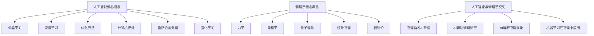

以下是标题为《AI与物理学交叉原理与代码实战案例讲解》的技术博客文章正文：

# AI与物理学交叉原理与代码实战案例讲解

## 1. 背景介绍

### 1.1 问题的由来

人工智能(AI)和物理学虽然是两个看似不同的领域,但是它们之间存在着内在的联系。物理学是研究自然界中各种现象及其规律的基础科学,而人工智能则是致力于模拟人类智能,创造出能够执行复杂任务的智能系统。

随着科技的不断进步,人工智能技术在各个领域得到了广泛应用,包括物理学研究。物理学家们希望借助人工智能的强大计算能力和数据处理能力,来解决一些复杂的物理问题,比如粒子加速器中的数据分析、量子计算模拟等。同时,物理学中的一些理论和模型也为人工智能算法的设计和优化提供了新的思路和启发。

### 1.2 研究现状

目前,人工智能和物理学的交叉研究主要集中在以下几个方面:

1. **机器学习在物理学中的应用**:物理学家们利用机器学习算法来处理和分析大规模的实验数据,从中发现潜在的规律和模式。例如,在粒子物理学、天体物理学和气象学等领域,机器学习技术被广泛应用于数据分析和模型构建。

2. **物理启发的人工智能算法**:一些物理学原理和模型为人工智能算法的设计提供了新的思路,比如量子计算、玻尔兹曼机、张量网络等。这些算法借鉴了物理学中的概念和理论,展现出优异的性能和潜力。

3. **人工智能辅助物理学研究**:人工智能技术可以帮助物理学家们进行理论推导、数值模拟和实验设计等工作。例如,使用强化学习算法来优化粒子加速器的参数设置,或者利用生成对抗网络(GAN)来生成新的量子态。

4. **人工智能解释物理现象**:一些研究者尝试使用人工智能技术来解释和预测一些复杂的物理现象,比如湍流、相变、量子力学等。这些工作有助于我们更好地理解自然界的规律。

### 1.3 研究意义

人工智能和物理学的交叉研究具有重要的理论意义和应用价值:

1. **理论意义**:物理学中的一些基本原理和概念可以为人工智能算法的设计和优化提供新的思路,而人工智能技术也有助于我们更好地理解和解释一些复杂的物理现象。两个领域的交叉融合有望产生新的理论突破。

2. **应用价值**:人工智能技术在物理学研究中的应用,可以帮助我们更高效地处理大规模数据、构建精确的模型、优化实验设计等,从而加速物理学的发展。同时,物理启发的人工智能算法也有望在其他领域发挥重要作用。

3. **促进跨学科合作**:人工智能和物理学的交叉研究需要不同领域的专家开展紧密合作,这有利于打破学科壁垒,促进跨学科交流和创新。

### 1.4 本文结构

本文将全面介绍人工智能与物理学交叉的原理和实践案例。具体内容安排如下:

1. 核心概念与联系:阐述人工智能和物理学之间的关键概念,以及它们之间的内在联系。

2. 核心算法原理与具体操作步骤:详细讲解一些典型的物理启发人工智能算法的原理和实现步骤。

3. 数学模型和公式详细讲解与举例说明:介绍相关的数学模型及公式推导,并结合具体案例进行说明。

4. 项目实践:代码实例和详细解释说明:提供一个完整的项目实践案例,包括开发环境搭建、源代码实现、代码解读和运行结果展示。

5. 实际应用场景:探讨人工智能与物理学交叉在实际中的应用场景,以及未来的发展前景。

6. 工具和资源推荐:推荐一些有用的学习资源、开发工具、相关论文和其他资源。

7. 总结:未来发展趋势与挑战:总结人工智能与物理学交叉的研究成果,展望未来的发展趋势,并分析可能面临的挑战。

8. 附录:常见问题与解答:针对这一交叉领域的一些常见问题进行解答。

## 2. 核心概念与联系

人工智能和物理学虽然是两个不同的学科领域,但是它们之间存在着内在的联系和相互影响。下面我们来探讨一下两者之间的核心概念及其联系。

人工智能的核心概念包括机器学习、深度学习、优化算法、计算机视觉、自然语言处理和强化学习等。这些概念和技术使人工智能系统能够从数据中学习,进行推理和决策,并完成各种复杂任务。

物理学的核心概念包括力学、电磁学、量子理论、统计物理和相对论等。这些概念描述了自然界中各种现象的本质规律,是我们认识和探索宇宙的基础。

人工智能与物理学的交叉主要体现在以下几个方面:

1. **物理启发的人工智能算法**:一些物理学原理和模型为人工智能算法的设计提供了新的思路,比如量子计算、玻尔兹曼机、张量网络等。这些算法借鉴了物理学中的概念和理论,展现出优异的性能和潜力。

2. **人工智能辅助物理学研究**:人工智能技术可以帮助物理学家们进行理论推导、数值模拟和实验设计等工作。例如,使用强化学习算法来优化粒子加速器的参数设置,或者利用生成对抗网络(GAN)来生成新的量子态。

3. **人工智能解释物理现象**:一些研究者尝试使用人工智能技术来解释和预测一些复杂的物理现象,比如湍流、相变、量子力学等。这些工作有助于我们更好地理解自然界的规律。

4. **机器学习在物理学中的应用**:物理学家们利用机器学习算法来处理和分析大规模的实验数据,从中发现潜在的规律和模式。例如,在粒子物理学、天体物理学和气象学等领域,机器学习技术被广泛应用于数据分析和模型构建。

人工智能和物理学的交叉融合,不仅可以促进两个领域的理论创新,而且还能带来重要的应用价值,推动科技的发展。

## 3. 核心算法原理与具体操作步骤

在人工智能与物理学交叉领域中,有一些典型的算法借鉴了物理学中的原理和概念,展现出优异的性能和潜力。下面我们将详细介绍其中的两种算法:量子计算和玻尔兹曼机。

### 3.1 量子计算算法原理概述

量子计算是一种基于量子力学原理的全新计算范式,它利用量子态的叠加和纠缠特性来执行计算任务。与经典计算机不同,量子计算机可以同时处理多个量子态的叠加,从而在某些问题上展现出巨大的计算优势。

量子计算算法的核心思想是将计算问题映射到量子系统中,利用量子态的特殊性质来执行并行计算。常见的量子算法包括量子傅里叶变换、量子相位估计、Grover搜索算法和Shor素数分解算法等。

量子计算算法的优势主要体现在以下几个方面:

1. **并行性**:量子计算可以同时操作多个量子态的叠加,实现大规模并行计算。

2. **指数加速**:在某些问题上,量子算法可以比经典算法快指数级,如Shor素数分解算法。

3. **隐性计算**:量子算法可以利用量子态的特殊性质,隐式地执行一些复杂的计算操作。

4. **无须取样**:量子算法可以直接获取期望的结果,而无须进行大量的取样和概率估计。

尽管量子计算机的实现还面临着诸多技术挑战,但量子计算算法已经在一些领域展现出了巨大的潜力,如量子化学模拟、量子机器学习和量子优化等。

### 3.2 量子计算算法步骤详解

量子计算算法的实现一般包括以下几个步骤:

1. **问题编码**:将待解决的问题映射到量子系统中,即将问题实例编码为量子态。

2. **量子线路设计**:设计一个量子线路来实现所需的量子操作,包括初始态准备、量子门操作和量子测量等。

3. **量子模拟**:在量子模拟器或真实的量子硬件上执行量子线路,获取量子态的演化结果。

4. **结果解码**:将量子态的测量结果解码为问题的解。

下面我们以Grover搜索算法为例,详细介绍量子算法的实现步骤。

Grover搜索算法是一种用于无结构搜索问题的量子算法,它可以在$O(\sqrt{N})$的时间复杂度内找到一个无序数据库中的目标元素,比经典算法快了$\sqrt{N}$倍。

1. **问题编码**:将长度为$N$的无序数据库编码为$N$维的量子态$\vert x\rangle$,目标元素对应的量子态为$\vert t\rangle$。

2. **量子线路设计**:Grover算法的量子线路包括以下步骤:
   a. 将所有$N$维量子态初始化为均匀叠加态$\vert s\rangle = \frac{1}{\sqrt{N}}\sum_{x=0}^{N-1}\vert x\rangle$。
   b. 应用Grover迭代$O(\sqrt{N})$次,每次迭代包括:
      - 对目标态$\vert t\rangle$进行相位反转:$\vert x\rangle \rightarrow -\vert x\rangle$。
      - 对均匀叠加态$\vert s\rangle$进行反射:$\vert x\rangle \rightarrow 2\langle s\vert x\rangle\vert s\rangle - \vert x\rangle$。
   c. 对最终量子态进行测量。

3. **量子模拟**:在量子模拟器或真实的量子硬件上执行上述量子线路,获取量子态的演化结果。

4. **结果解码**:测量获得的量子态很大概率就是目标态$\vert t\rangle$,将其解码即可得到数据库中的目标元素。

通过上述步骤,Grover算法可以在$O(\sqrt{N})$的时间复杂度内高效地找到无序数据库中的目标元素,展现出了量子计算的优势。

### 3.3 量子计算算法优缺点

量子计算算法相对于经典算法具有以下优点:

1. **并行性**:可以同时操作多个量子态的叠加,实现大规模并行计算。
2. **指数加速**:在某些问题上可以比经典算法快指数级,如Shor素数分解算法。
3. **隐性计算**:利用量子态的特殊性质,隐式地执行一些复杂的计算操作。
4. **无须取样**:可以直接获取期望的结果,而无须进行大量的取样和概率估计。

但量子计算算法也存在一些缺点和挑战:

1. **量子误差**:量子系统容易受到环境噪声的影响,导致量子态失真。
2