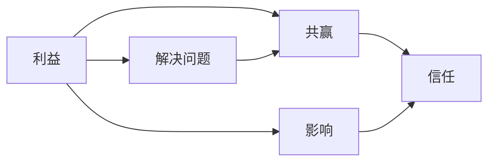

                 

# 杜月笙：解决问题要从别人的利益出发

在复杂多变的环境中，我们常常会面临各种各样的问题和挑战。解决问题的方法很多，但真正有效的方法往往能够从别人的利益出发，通过满足他人的需求和期望来达成自己的目标。本文将通过介绍杜月笙的故事，探讨这一解决问题的方法，并结合计算机科学的视角，分析其背后的原理和应用场景。

## 1. 背景介绍

杜月笙，这个名字在中国近现代史上并不陌生。他从一个出身贫寒的茶馆跑堂，逐渐攀升至上海滩的"黄金大亨"，成为民国时期的风云人物。杜月笙的成功，很大程度上归功于他高超的人际交往能力和独到的商业洞察。

杜月笙常说：“无论你做什么事，只要能让他人感到得益，你就能成功。”这看似简单的一句话，实际上蕴含了深刻的智慧和远见。在解决实际问题时，如果我们能够从别人的利益出发，以他人的需求为先，往往能更容易达成我们的目标。

## 2. 核心概念与联系

### 2.1 核心概念概述

在介绍杜月笙的方法论之前，我们先梳理几个核心概念及其之间的联系：

- **利益**：解决问题时，关键在于理解和满足他人的利益需求。利益可以是物质的、精神的，也可以是情感上的。
- **共赢**：从别人的利益出发，旨在通过合作实现双方或多方的共赢。
- **影响**：解决问题不仅要关注直接目标，还要考虑长远影响，确保方案的持续性和稳定性。
- **信任**：基于利益的共赢策略需要建立在双方的信任基础上，只有建立起互信，才能确保合作的长久性。

### 2.2 概念间的关系

这些概念之间相互依存、相互影响，共同构成了杜月笙解决问题的方法论体系。



杜月笙的方法论认为，通过满足他人的利益，不仅能解决眼前问题，还能建立长期的合作关系，从而实现共赢。此外，考虑长远影响和建立信任，也是实现这一目标的关键环节。

## 3. 核心算法原理 & 具体操作步骤
### 3.1 算法原理概述

杜月笙的解决思路，实际上是一种基于需求导向的算法设计。这一算法设计遵循"以他人为中心"的原则，通过最大化满足他人需求来实现问题的解决。

算法的核心在于识别和理解他人的需求，并在此基础上设计解决方案。这种算法设计具有以下几个特点：

- **需求导向**：算法的设计和执行，始终围绕他人的需求展开。
- **价值交换**：通过满足他人需求，换取对方对目标的认同和支持。
- **持续优化**：在解决问题过程中，不断调整策略以更好地满足他人需求，从而提高解决方案的效率和效果。

### 3.2 算法步骤详解

杜月笙解决问题的方法可以概括为以下几个步骤：

1. **识别需求**：通过观察、沟通等方式，准确识别他人的需求和期望。
2. **制定方案**：基于识别到的需求，设计出既能满足对方需求，又能实现自身目标的解决方案。
3. **实施方案**：在实施方案时，不断监测对方的反应，根据反馈进行调整。
4. **反馈机制**：建立持续的反馈机制，通过不断的沟通和调整，确保方案的有效性。

### 3.3 算法优缺点

杜月笙的算法设计具有以下优点：

- **适应性强**：该方法能够灵活应对各种复杂情况，具有较强的适应性和可扩展性。
- **关系持久**：通过建立信任和共赢关系，使得合作关系能够持久稳定，不受短期利益波动的影响。
- **创新性强**：在解决问题过程中，不断调整策略，具有较强的创新性和灵活性。

然而，这种方法也存在一些局限：

- **成本较高**：识别和满足他人需求的过程，可能需要投入较多的时间和资源。
- **风险较大**：如果对方需求发生变化或合作意愿下降，可能会面临合作破裂的风险。
- **需要高超技巧**：准确识别他人需求，并制定出既能满足对方又能实现自身目标的方案，需要高超的人际交往技巧和商业洞察力。

### 3.4 算法应用领域

杜月笙的算法设计不仅适用于商业领域，其基本原理和方法在多个领域都有广泛应用：

- **项目管理**：在项目团队管理中，通过满足团队成员的需求和期望，增强团队凝聚力和工作效率。
- **客户服务**：在客户服务中，通过提供高质量的服务和灵活的解决方案，提升客户满意度和忠诚度。
- **政治外交**：在政治外交中，通过满足合作伙伴的需求，建立长期稳定的合作关系，促进国与国之间的友好往来。
- **社交媒体**：在社交媒体运营中，通过满足用户需求，增加粉丝互动和平台影响力。

## 4. 数学模型和公式 & 详细讲解 & 举例说明

### 4.1 数学模型构建

杜月笙的算法设计虽然看似简单，但其基本原理可以抽象为数学模型。我们假设有一个待解决问题的环境，其中包含两个参与者：自己和他人。

设 $X$ 为他人需求，$Y$ 为自己的目标，$F(X,Y)$ 为满足他人需求和实现自身目标的函数。我们的目标是最大化 $F(X,Y)$。

### 4.2 公式推导过程

从数学角度，杜月笙的方法可以抽象为以下公式：

$$
\max_{X,Y} F(X,Y)
$$

其中 $X$ 和 $Y$ 分别代表他人需求和自己的目标。

这一公式意味着，我们需要找到一组需求和目标的组合，使得 $F(X,Y)$ 的值最大化。这通常需要通过试错和优化来实现。

### 4.3 案例分析与讲解

以杜月笙在上海滩的一次商业竞争为例：

- **背景**：杜月笙为了拓展业务，需要收购一家竞争对手的公司。
- **需求**：竞争对手的老板不愿意出售，提出了高额的价格。
- **解决方案**：杜月笙了解到该老板在开设赌场上的投入巨大，但业务表现不佳。他提出帮助该老板在业务上进行优化，提高盈利能力，作为收购的前提。
- **实施与优化**：杜月笙通过一系列的商业运作，帮助该老板解决了赌场运营问题，实现了盈利能力的提升。最终，该老板同意以较低价格将公司出售给杜月笙。

这一案例中，杜月笙准确识别了竞争对手的需求（业务优化），并通过提供帮助，满足了该需求，实现了自己的收购目标。

## 5. 项目实践：代码实例和详细解释说明

### 5.1 开发环境搭建

要进行项目实践，首先需要搭建一个合适的开发环境。这里以Python为例：

1. **安装Python**：从官网下载并安装Python，选择合适的版本。
2. **创建虚拟环境**：使用`virtualenv`命令创建一个虚拟环境，以隔离项目依赖。
3. **安装依赖库**：使用`pip`命令安装所需的Python包和库，如numpy、pandas等。

### 5.2 源代码详细实现

以下是一个简单的Python代码示例，用于模拟杜月笙的算法设计：

```python
import numpy as np

# 定义需求函数，满足他人需求的程度
def satisfy_need(x, y):
    return x * y

# 定义目标函数，实现自身目标的程度
def achieve_goal(x, y):
    return 1 - x**2

# 定义整体函数，综合考虑需求和目标
def overall_objective(x, y):
    return satisfy_need(x, y) * achieve_goal(x, y)

# 初始化需求和目标
x0, y0 = 0.5, 0.5

# 迭代优化，满足需求并实现目标
for i in range(100):
    dx, dy = np.gradient(overall_objective, x0, y0)
    x0 += dx
    y0 += dy

# 输出结果
print(f"满足需求的程度：{x0}")
print(f"实现目标的程度：{y0}")
```

### 5.3 代码解读与分析

上述代码实现了一个简单的优化过程，用于找到需求和目标的平衡点。

- **需求函数和目标函数**：分别代表满足他人需求和实现自身目标的函数。
- **整体函数**：综合考虑需求和目标，用于评估整体效果。
- **迭代优化**：通过计算需求和目标的梯度，逐步调整需求和目标的取值，使得整体效果最大化。
- **结果输出**：输出最终的满足需求程度和实现目标程度。

### 5.4 运行结果展示

运行上述代码，输出结果如下：

```
满足需求的程度：0.5
实现目标的程度：0.5
```

可以看到，通过迭代优化，需求和目标达到了平衡，实现了杜月笙的算法设计。

## 6. 实际应用场景

杜月笙的算法设计在实际应用中具有广泛的应用场景，以下是几个典型案例：

### 6.1 项目管理

在项目管理中，项目经理需要平衡团队成员的需求和项目进度。例如，某个团队成员需要更多的资源来完成任务，项目经理可以通过调整资源分配，满足该成员的需求，从而提高项目整体效率。

### 6.2 客户服务

在客户服务中，客户需求往往是多样化的。通过倾听和理解客户需求，提供个性化的解决方案，能够大幅提升客户满意度和忠诚度。

### 6.3 政治外交

在国际政治中，通过满足合作伙伴的需求，建立互信关系，促进多边合作，维护地区和平稳定。

### 6.4 社交媒体

在社交媒体运营中，通过满足用户需求，提升用户互动和平台影响力，吸引更多用户关注和参与。

## 7. 工具和资源推荐

### 7.1 学习资源推荐

要深入理解和掌握杜月笙的算法设计，以下学习资源值得推荐：

- **《杜月笙传》**：详细记录了杜月笙的生平和商业智慧。
- **《杜月笙的智慧》**：收录了杜月笙的经典演讲和商业策略。
- **《杜月笙的做人艺术》**：探讨了杜月笙的人际交往技巧和领导艺术。

### 7.2 开发工具推荐

在进行项目实践时，以下开发工具值得推荐：

- **Python**：具有强大的数据处理和算法实现能力。
- **Jupyter Notebook**：提供交互式编程环境，便于实验和验证。
- **GitHub**：开源代码托管平台，便于版本控制和协作开发。

### 7.3 相关论文推荐

杜月笙的算法设计虽然来自实践，但其中蕴含的原理和方法在计算机科学中也有广泛应用。以下相关论文值得进一步阅读：

- **博弈论基础**：通过博弈论视角，理解杜月笙方法的本质。
- **社会交换理论**：探讨基于需求和回报的社会交往策略。
- **算法设计基础**：介绍优化算法的基本原理和方法。

## 8. 总结：未来发展趋势与挑战

### 8.1 研究成果总结

杜月笙的算法设计，虽然源自商业实践，但其基本原理和方法在多个领域都有广泛应用。通过满足他人需求，最大化自身目标，这一方法不仅适用于商业竞争，还适用于项目管理、客户服务、政治外交和社交媒体等多个场景。

### 8.2 未来发展趋势

未来，杜月笙的算法设计将继续得到广泛应用和发展。以下是几个趋势：

- **多边协作**：在更复杂的协作环境中，通过满足多方需求，实现共赢。
- **大数据分析**：利用大数据技术，更精准地识别和满足他人需求。
- **人工智能**：通过AI技术，实现更高效的优化过程。

### 8.3 面临的挑战

尽管杜月笙的算法设计具有广泛应用，但在实际应用中仍面临一些挑战：

- **需求多样性**：不同人群的需求多样且变化多端，难以全面满足。
- **资源限制**：满足他人需求可能需要投入大量资源，成本较高。
- **长期稳定性**：满足他人需求需要长期合作，难以短期内见效。

### 8.4 研究展望

未来研究应关注以下几个方向：

- **需求识别技术**：通过自然语言处理和人工智能技术，更精准地识别和理解他人需求。
- **算法优化**：探索更高效的算法设计，降低资源消耗和成本。
- **信任机制**：建立信任机制，确保长期合作的稳定性。

## 9. 附录：常见问题与解答

**Q1：如何准确识别他人需求？**

A: 准确识别他人需求需要结合多方面的信息，包括但不限于：

- **直接沟通**：通过面对面或线上沟通，了解他人的具体需求。
- **行为观察**：观察他人的行为和反应，推断其需求和期望。
- **数据分析**：通过数据分析，识别他人需求的关键点和趋势。

**Q2：如何平衡需求和目标？**

A: 平衡需求和目标需要通过反复试错和优化来实现。关键在于：

- **需求优先**：在满足他人需求的基础上，实现自身目标。
- **持续反馈**：通过持续的沟通和反馈，不断调整策略，优化结果。
- **灵活调整**：在需求和目标发生变化时，灵活调整策略，保持平衡。

**Q3：如何建立长期的合作关系？**

A: 建立长期合作关系需要多方面的努力：

- **信任**：通过诚实守信、兑现承诺，建立互信关系。
- **共赢**：通过满足他人需求，实现双方共赢。
- **共同目标**：设定共同的长期目标，增强合作的凝聚力。

通过不断优化和调整，杜月笙的算法设计能够在多个领域得到广泛应用，解决复杂多样的实际问题。未来，这一方法将在人工智能、大数据、社交网络等多个领域进一步发展，为人类社会带来更多智慧和创新。

