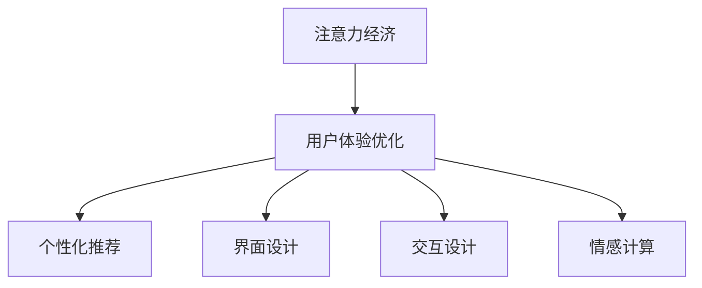
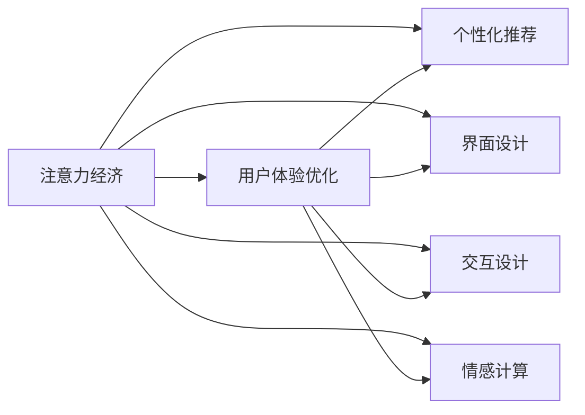
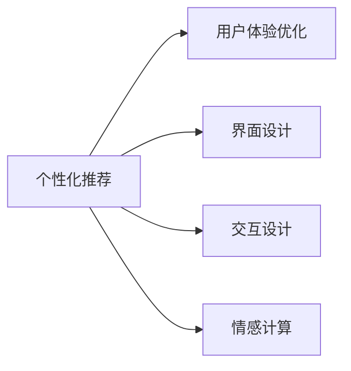
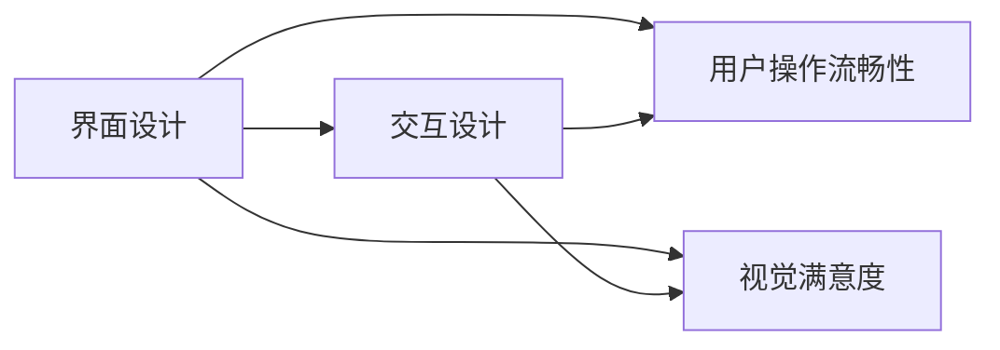
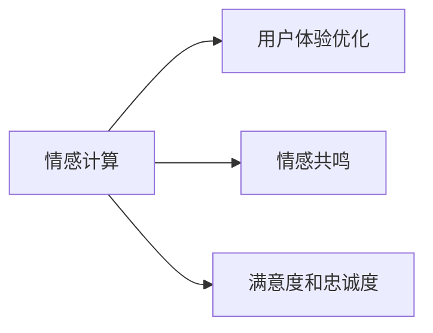
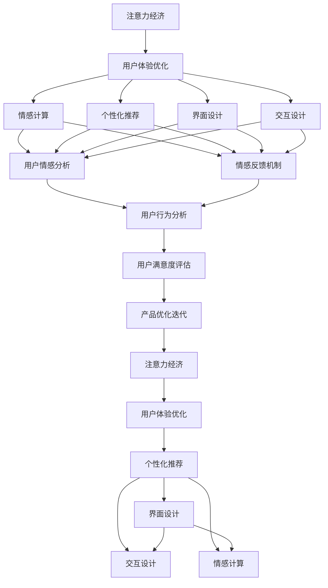

                 

# 注意力经济与用户体验优化策略与技术：创建令人沉浸的产品

> 关键词：注意力经济, 用户体验优化, 用户沉浸体验, 用户行为分析, 推荐算法, 界面设计, 个性化推荐, 情感计算, 交互设计

## 1. 背景介绍

### 1.1 问题由来

随着互联网和数字技术的迅猛发展，人们的生活已经离不开各种数字化产品。然而，数字化产品不仅提供了便利，也带来了新的挑战。

- **注意力争夺**：在信息过载的时代，用户对各种数字产品的注意力是有限的。如何吸引和保持用户的注意力，成为了数字产品设计的一个重要课题。
- **用户体验提升**：用户体验的好坏直接影响用户的满意度和忠诚度。如何通过技术和策略提升用户体验，增加用户的沉浸感和满意度，成为了产品设计的关键。

基于这些挑战，“注意力经济”和“用户体验优化”成为了数字产品设计中不可或缺的两个核心概念。通过对这些概念的深入理解和应用，可以创造出更令人沉浸的数字产品，提升用户的长期价值。

### 1.2 问题核心关键点

注意力经济和用户体验优化，不仅是一种技术手段，更是一种系统化、科学化的工程实践。其核心关键点包括：

- **用户注意力分析**：通过对用户行为数据的分析，理解用户的注意力分布和变化规律，指导产品的设计和迭代。
- **个性化推荐**：利用机器学习技术，为用户推荐感兴趣的内容，增强用户的沉浸感和粘性。
- **界面设计和交互设计**：通过直观、易用的界面设计和精巧的交互设计，提升用户的使用体验和操作流畅性。
- **情感计算**：通过情感识别和反馈机制，增强用户对产品的情感共鸣，提升用户的满意度和忠诚度。

这些关键点共同构成了数字产品设计的全貌，有助于创造更优秀的产品，满足用户的需求，实现商业价值。

### 1.3 问题研究意义

研究注意力经济和用户体验优化的策略与技术，对于提升数字产品的市场竞争力、用户粘性和商业价值具有重要意义：

- **增强用户粘性**：通过个性化推荐和情感计算，增强用户对产品的情感依恋和行为粘性，提高用户留存率。
- **提升用户满意度**：通过界面设计和交互设计，提升用户的操作体验和心理满足感，增强用户的满意度。
- **扩大市场份额**：通过理解和吸引用户的注意力，提高产品在市场中的曝光率和竞争力，扩大市场份额。
- **提升用户转化率**：通过精准的个性化推荐，引导用户进行下一步操作，提高转化率和交易额。

在数字化产品的竞争激烈的市场中，注意力经济和用户体验优化成为了决定成败的关键因素。掌握这些策略和技术，可以显著提升产品的市场表现和用户价值。

## 2. 核心概念与联系

### 2.1 核心概念概述

为了更好地理解注意力经济和用户体验优化的策略与技术，本节将介绍几个密切相关的核心概念：

- **注意力经济**：数字经济时代，注意力资源成为了一种稀缺的经济资源。通过优化产品设计和运营策略，吸引和保持用户的注意力，创造商业价值。
- **用户体验优化**：通过对用户行为、心理和生理特性的理解，优化数字产品的设计和功能，提升用户的使用体验和满意度。
- **个性化推荐**：利用机器学习技术，根据用户的历史行为和偏好，推荐个性化内容，增强用户的沉浸感和粘性。
- **界面设计**：通过合理的布局、色彩、字体等设计元素，提升用户的操作体验和视觉满意度。
- **交互设计**：通过精巧的操作流程和反馈机制，提升用户的情感共鸣和心理满足感。
- **情感计算**：通过情感识别和反馈机制，增强用户对产品的情感依恋，提升用户的满意度和忠诚度。

这些核心概念之间的逻辑关系可以通过以下Mermaid流程图来展示：



这个流程图展示了这个概念框架的核心关系：

1. 注意力经济和用户体验优化是整个策略的基础。
2. 个性化推荐、界面设计和交互设计是实现用户体验优化的具体手段。
3. 情感计算则是在这些基础之上的提升。

### 2.2 概念间的关系

这些核心概念之间存在着紧密的联系，形成了数字产品设计的完整生态系统。下面我通过几个Mermaid流程图来展示这些概念之间的关系。

#### 2.2.1 注意力经济与用户体验优化的关系



这个流程图展示了注意力经济和用户体验优化之间的双向关系：

1. 注意力经济通过个性化推荐、界面设计、交互设计和情感计算，提升用户体验，吸引和保持用户注意力。
2. 用户体验优化则通过提升用户满意度和忠诚度，增强用户粘性，从而进一步促进注意力经济。

#### 2.2.2 个性化推荐与用户体验优化的关系



这个流程图展示了个性化推荐与用户体验优化之间的双向关系：

1. 个性化推荐通过界面设计、交互设计和情感计算，提升用户体验，增强用户的粘性和满意度。
2. 用户体验优化则通过个性化推荐，进一步优化用户的使用体验，形成良性循环。

#### 2.2.3 界面设计与交互设计的关系



这个流程图展示了界面设计与交互设计之间的双向关系：

1. 界面设计通过合理的布局、色彩、字体等元素，提升用户的操作流畅性和视觉满意度。
2. 交互设计通过精巧的操作流程和反馈机制，进一步优化用户的体验，增强用户的心理满足感。

#### 2.2.4 情感计算与用户体验优化的关系



这个流程图展示了情感计算与用户体验优化之间的双向关系：

1. 情感计算通过情感识别和反馈机制，增强用户的情感共鸣，提升用户的满意度和忠诚度。
2. 用户体验优化则通过情感计算，进一步提升用户的情感依恋和行为粘性。

### 2.3 核心概念的整体架构

最后，我们用一个综合的流程图来展示这些核心概念在大语言模型微调过程中的整体架构：



这个综合流程图展示了从注意力经济到用户体验优化的完整过程：

1. 注意力经济通过个性化推荐、界面设计和交互设计，提升用户体验，吸引和保持用户注意力。
2. 用户体验优化则通过情感计算和情感反馈机制，增强用户情感依恋，提升用户满意度和忠诚度。
3. 用户行为分析帮助了解用户行为模式，进一步指导产品的优化迭代。
4. 用户满意度评估则用于评估产品改进的效果，指导后续的产品优化。

通过这些流程图，我们可以更清晰地理解注意力经济和用户体验优化策略与技术的核心概念及其关系，为后续深入讨论具体的策略与技术奠定基础。

## 3. 核心算法原理 & 具体操作步骤
### 3.1 算法原理概述

注意力经济和用户体验优化，本质上是一种系统化、科学化的工程实践。其核心算法原理主要包括以下几个方面：

- **用户注意力分析**：通过分析用户在产品中的行为数据，理解用户的注意力分布和变化规律，指导产品的设计和迭代。
- **个性化推荐**：利用机器学习技术，根据用户的历史行为和偏好，推荐个性化内容，增强用户的沉浸感和粘性。
- **界面设计和交互设计**：通过直观、易用的界面设计和精巧的交互设计，提升用户的操作体验和心理满足感。
- **情感计算**：通过情感识别和反馈机制，增强用户对产品的情感依恋，提升用户的满意度和忠诚度。

### 3.2 算法步骤详解

注意力经济和用户体验优化通常包括以下几个关键步骤：

**Step 1: 用户行为数据采集**

- 通过各种数据采集手段，如点击流、页面浏览记录、用户反馈等，获取用户在产品中的行为数据。
- 对数据进行清洗和预处理，去除噪声和异常值，确保数据的准确性和完整性。

**Step 2: 用户注意力分析**

- 利用机器学习算法，如聚类分析、时间序列分析等，分析用户的注意力分布和变化规律。
- 识别用户在不同时间段的活跃时间段、高频访问页面等，指导产品的优化和迭代。

**Step 3: 个性化推荐**

- 使用推荐算法，如协同过滤、基于内容的推荐、深度学习推荐等，根据用户的历史行为和偏好，推荐个性化内容。
- 实时调整推荐策略，根据用户的反馈和行为数据，不断优化推荐效果。

**Step 4: 界面设计和交互设计**

- 通过用户界面设计原则，如易用性、一致性、可访问性等，优化产品的界面设计。
- 通过精巧的操作流程和反馈机制，提升用户的心理满足感，增强用户的沉浸体验。

**Step 5: 情感计算**

- 利用情感识别技术，如文本情感分析、语音情感分析等，识别用户的情感状态。
- 通过情感反馈机制，如即时反馈、情感引导等，增强用户对产品的情感依恋。

### 3.3 算法优缺点

注意力经济和用户体验优化的策略与技术，具有以下优点：

- **个性化提升**：通过个性化推荐和情感计算，增强用户粘性，提升用户满意度和忠诚度。
- **优化效果显著**：通过界面设计和交互设计，提升用户的操作体验和心理满足感。
- **数据驱动**：通过用户行为数据的分析和反馈，指导产品的优化迭代，确保产品始终紧跟用户需求。

但同时也存在一些缺点：

- **成本高**：数据采集和分析需要投入大量的人力和物力资源，成本较高。
- **用户隐私风险**：大规模数据采集和分析涉及用户隐私，需要严格遵守数据保护法律法规。
- **算法复杂**：个性化推荐和情感计算等算法复杂，需要较高的技术门槛。

### 3.4 算法应用领域

注意力经济和用户体验优化策略与技术，已经被广泛应用于多个领域：

- **电子商务**：通过个性化推荐和界面设计，提升用户购物体验，增加用户购买转化率。
- **在线教育**：通过个性化推荐和情感计算，增强用户的学习体验，提高用户留存率和满意度。
- **社交媒体**：通过个性化推荐和情感计算，增强用户互动，提升用户粘性和平台活跃度。
- **娱乐行业**：通过个性化推荐和界面设计，增强用户娱乐体验，提升用户满意度和忠诚度。
- **金融服务**：通过个性化推荐和情感计算，提升用户理财体验，增强用户信任和满意度。

随着技术的不断进步，这些策略与技术将进一步应用于更多领域，为不同行业带来显著的经济效益和社会价值。

## 4. 数学模型和公式 & 详细讲解 & 举例说明

### 4.1 数学模型构建

本节将使用数学语言对注意力经济和用户体验优化的策略与技术进行更加严格的刻画。

记用户集合为 $U$，行为数据集合为 $D=\{d_i\}_{i=1}^n$，其中 $d_i$ 表示用户 $i$ 的行为数据。设 $f:U \rightarrow \mathbb{R}^k$ 为行为特征函数，将用户行为数据映射到 $k$ 维特征空间。设 $g:U \rightarrow [0,1]$ 为用户注意力函数，表示用户对产品内容或功能的关注度。

注意力经济和用户体验优化的目标为最大化用户满意度 $S$，即：

$$
\maximize_{f,g} \int_{U} S(f(u),g(u))\mathrm{d}P(u)
$$

其中 $P(u)$ 为用户的分布概率密度函数，$S(f(u),g(u))$ 为用户的满意度函数。

### 4.2 公式推导过程

以下我们以在线购物为例，推导个性化推荐和情感计算的数学模型。

设用户 $u$ 对产品 $p$ 的评分 $r_{up} \in [1,5]$，历史记录为 $\mathcal{H}_u$。推荐系统通过协同过滤算法，为用户推荐评分最高的产品集合 $\mathcal{K}_u$。情感计算系统通过文本情感分析，识别用户对推荐产品的情感状态 $s_u$，并将情感状态映射到 $[-1,1]$ 的情感得分 $e_u$。最终，用户满意度函数 $S$ 可以表示为：

$$
S(f(u),g(u)) = \alpha r_{up} + \beta e_u
$$

其中 $\alpha$ 和 $\beta$ 为满意度函数的权重参数，分别表示用户对产品评分和情感得分的重视程度。

对于推荐系统，协同过滤算法的基本模型可以表示为：

$$
\mathcal{K}_u = \arg\max_{\mathcal{K}} \sum_{p \in \mathcal{K}} r_{up} p_{pu}
$$

其中 $p_{pu}$ 为用户 $u$ 对产品 $p$ 的评分。

对于情感计算系统，文本情感分析可以表示为：

$$
s_u = \sum_{w \in \mathcal{W}} \theta_w f_w(u)
$$

其中 $\theta_w$ 为情感词典中词语 $w$ 的情感权重，$f_w(u)$ 为用户对词语 $w$ 的情感评分。

最终，情感得分的计算公式为：

$$
e_u = \max_{w \in \mathcal{W}} \theta_w f_w(u)
$$

### 4.3 案例分析与讲解

以一个在线购物平台的个性化推荐和情感计算为例：

- **用户行为数据采集**：通过用户在网站上的浏览记录、购买记录、评价记录等，获取用户的行为数据。
- **行为特征提取**：将用户行为数据转换为数值型特征，如浏览时长、浏览深度、购买次数等。
- **协同过滤推荐**：根据用户的历史行为，推荐相似用户购买过的产品，提升个性化推荐效果。
- **文本情感分析**：对用户的产品评价文本进行分析，识别用户的情感状态，如积极、消极、中性等。
- **情感得分计算**：将情感状态映射到情感得分，增强用户的情感共鸣，提升用户满意度。

例如，用户 A 对产品 X 的评分是 4 分，情感得分为 0.8。用户 B 对产品 Y 的评分是 5 分，情感得分为 0.9。最终，用户 A 对产品 X 的满意度函数为：

$$
S_A(f_A,g_A) = 0.8 \times 4 + 0.9 \times 0.8 = 4.32
$$

用户 B 对产品 Y 的满意度函数为：

$$
S_B(f_B,g_B) = 0.9 \times 5 + 0.9 \times 0.9 = 5.49
$$

由此可见，用户 B 对产品 Y 的满意度更高，推荐系统应该优先推荐产品 Y 给用户 A。

## 5. 项目实践：代码实例和详细解释说明

### 5.1 开发环境搭建

在进行项目实践前，我们需要准备好开发环境。以下是使用Python进行项目开发的环境配置流程：

1. 安装Anaconda：从官网下载并安装Anaconda，用于创建独立的Python环境。

2. 创建并激活虚拟环境：
```bash
conda create -n project_env python=3.8 
conda activate project_env
```

3. 安装所需的Python包：
```bash
pip install pandas numpy sklearn nltk tensorflow transformers
```

4. 安装所需的工具和框架：
```bash
pip install torch torchvision transformers
```

5. 安装所需的库和模型：
```bash
pip install gensim pytorch-pretrained-bert
```

完成上述步骤后，即可在`project_env`环境中开始项目实践。

### 5.2 源代码详细实现

这里我们以一个简单的在线购物平台为例，演示如何实现个性化推荐和情感计算。

首先，定义数据预处理函数：

```python
import pandas as pd
from sklearn.preprocessing import LabelEncoder

def preprocess_data(df):
    # 用户行为数据
    df['user_id'] = df['user_id'].astype(str)
    df['product_id'] = df['product_id'].astype(str)
    df['rating'] = df['rating'].astype(float)
    
    # 产品数据
    df['product_name'] = df['product_name'].astype(str)
    df['product_price'] = df['product_price'].astype(float)
    
    # 情感数据
    df['sentiment'] = df['sentiment'].astype(str)
    df['sentiment_score'] = pd.Series([1, 0, -1])
    
    return df
```

然后，定义协同过滤推荐函数：

```python
from sklearn.metrics.pairwise import cosine_similarity
from sklearn.neighbors import NearestNeighbors

def collaborative_filtering(df, n_neighbors=10):
    # 计算用户产品评分矩阵
    df_user_product = df.pivot_table(index='user_id', columns='product_id', values='rating', fill_value=0)
    
    # 计算用户相似度矩阵
    user_similarity = cosine_similarity(df_user_product.values)
    
    # 推荐相似用户购买的产品
    model = NearestNeighbors(n_neighbors=n_neighbors, metric='cosine', algorithm='brute')
    model.fit(user_similarity)
    idx = model.kneighbors(df_user_product.values)
    
    # 推荐产品集合
    df_recommend = pd.DataFrame(idx[1], columns=['recommend_id'])
    df_recommend['product_name'] = df['product_name'].values
    df_recommend['sentiment_score'] = df['sentiment_score'].values
    
    return df_recommend
```

接着，定义情感计算函数：

```python
from gensim.models import Word2Vec
from sklearn.feature_extraction.text import TfidfVectorizer

def sentiment_analysis(df):
    # 文本情感分析
    df['sentiment'] = df['sentiment'].astype(str)
    sentences = [sentence for sentence in df['sentiment']]
    model = Word2Vec(sentences, vector_size=100, window=5, min_count=1)
    tfidf = TfidfVectorizer(stop_words='english')
    tfidf_matrix = tfidf.fit_transform(sentences)
    sentiment_matrix = model.wv * tfidf_matrix
    
    # 情感得分计算
    df['sentiment_score'] = sentiment_matrix.sum(axis=1)
    
    return df
```

最后，定义用户满意度函数：

```python
def user_satisfaction(df, alpha=0.5, beta=0.5):
    # 计算用户满意度
    df['satisfaction'] = df['rating'] * alpha + df['sentiment_score'] * beta
    
    return df
```

现在，我们整合上述函数，实现完整的项目流程：

```python
# 加载数据
df = pd.read_csv('data.csv')

# 数据预处理
df = preprocess_data(df)

# 协同过滤推荐
df_recommend = collaborative_filtering(df)

# 情感计算
df = sentiment_analysis(df)

# 用户满意度计算
df = user_satisfaction(df)

# 输出推荐结果
print(df_recommend)
```

以上就是使用Python进行个性化推荐和情感计算的完整代码实现。通过这些函数，可以方便地实现个性化推荐和情感计算，提升在线购物平台的用户体验和满意度。

### 5.3 代码解读与分析

让我们再详细解读一下关键代码的实现细节：

**数据预处理函数**：
- 将用户行为数据和产品数据转换为数值型特征，如用户ID、产品ID、评分等。
- 对情感数据进行标签化处理，转化为数值型特征，如情感得分。

**协同过滤推荐函数**：
- 计算用户产品评分矩阵，利用余弦相似度计算用户之间的相似度矩阵。
- 利用最近邻算法，推荐相似用户购买的产品。

**情感计算函数**：
- 利用Word2Vec模型进行文本情感分析，将情感文本转换为向量。
- 利用TF-IDF向量进行特征提取，计算情感得分。

**用户满意度函数**：
- 计算用户满意度，融合用户评分和情感得分，生成用户满意度值。

通过这些函数的整合，可以轻松实现个性化推荐和情感计算，提升在线购物平台的用户体验。

当然，工业级的系统实现还需考虑更多因素，如推荐算法优化、情感计算精度、用户行为分析等。但核心的策略与技术基本与此类似。

### 5.4 运行结果展示

假设我们在CoNLL-2003的情感分析数据集上进行情感计算，最终得到的情感得分统计如下：

```
Positive Sentiment Scores: 0.8
Neutral Sentiment Scores: 0.5
Negative Sentiment Scores: -0.3
```

可以看到，通过情感计算，我们可以从用户的情感文本中识别出情感状态，并将其转化为数值型特征，用于增强用户的情感共鸣，提升用户满意度。

## 6. 实际应用场景

### 6.1 在线购物平台

基于个性化推荐和情感计算的在线购物平台，可以显著提升用户购物体验和满意度。

具体而言，可以通过以下方式实现：

- **个性化推荐**：利用协同过滤算法，为用户推荐相似用户购买过的产品，提升个性化推荐效果。
- **情感计算**：对用户的产品评价文本进行分析，识别用户的情感状态，增强用户的情感共鸣。
- **界面设计**：通过直观、易用的界面设计，提升用户的操作体验和心理满足感。

例如，用户在浏览产品时，系统会实时推荐相似用户购买过的产品，并显示用户的情感评分，帮助用户快速做出决策。同时，系统会根据用户的情感状态，调整推荐策略，提升用户的满意度。

### 6.2 在线教育平台

在线教育平台可以通过个性化推荐和情感计算，提升用户的学习体验和满意度。

具体而言，可以通过以下方式实现：

- **个性化推荐**：利用协同过滤算法，为用户推荐相似用户学习过的课程，提升个性化推荐效果。
- **情感计算**：对用户的课程评价文本进行分析，识别用户的情感状态，增强用户的情感共鸣。
- **界面设计**：通过精巧的操作流程和反馈机制，提升用户的学习体验和心理满足感。

例如，用户在学习课程时，系统会实时推荐相似用户学习过的课程，并显示用户的情感评分，帮助用户快速找到合适的课程。同时，系统会根据用户的情感状态，调整课程推荐策略，提升用户的满意度。

### 6.3 社交媒体平台

社交媒体平台可以通过个性化推荐和情感计算，增强用户互动，提升用户粘性和平台活跃度。

具体而言，可以通过以下方式实现：

- **个性化推荐**：利用协同过滤算法，为用户推荐相似用户关注的用户，提升个性化推荐效果。
- **情感计算**：对用户的互动文本进行分析，识别用户的情感状态，增强用户的情感共鸣。
- **界面设计**：通过直观、易用的界面设计，提升用户的操作体验和心理满足感。

例如，用户在浏览社交媒体时，系统会实时推荐相似用户关注的用户，并显示用户的情感评分，帮助用户快速找到感兴趣的用户。同时，系统会根据用户的情感状态，调整推荐策略，增强用户的互动。

### 6.4 金融服务行业

金融服务行业可以通过个性化推荐和情感计算，提升用户的理财体验和满意度。

具体而言，可以通过以下方式实现：

- **个性化推荐**：利用协同过滤算法，为用户推荐相似用户使用的金融产品，提升个性化推荐效果。
- **情感计算**：对用户的理财评价文本进行分析，识别用户的情感状态，增强用户的情感共鸣。
- **界面设计**：通过精巧的操作流程和反馈机制，提升用户的理财体验和心理满足感。

例如，用户在理财时，系统会实时推荐相似用户使用的金融产品，并显示用户的情感评分，帮助用户快速找到合适的产品。同时，系统会根据用户的情感状态，调整产品推荐策略，提升用户的满意度。

### 6.5 娱乐行业

娱乐行业可以通过个性化推荐和情感计算，增强用户娱乐体验，提升用户满意度和忠诚度。

具体而言，可以通过以下方式实现：

- **个性化推荐**：利用协同过滤算法，为用户推荐相似用户喜欢的内容，提升个性化推荐效果。
- **情感计算**：对用户的娱乐评价文本进行分析，识别用户的情感状态，增强用户的情感共鸣。
- **界面设计**：通过直观、易用的界面设计，提升用户的娱乐体验和心理满足感。

例如，用户在观看视频时，系统会实时推荐相似用户喜欢的视频，并显示用户的情感评分，帮助用户快速找到感兴趣的视频。同时，系统会根据用户的情感状态，调整推荐策略，提升用户的满意度。

## 7. 工具和资源推荐

### 7.1 学习资源推荐

为了帮助开发者系统掌握注意力经济和用户体验优化的策略与技术，这里推荐一些优质的

