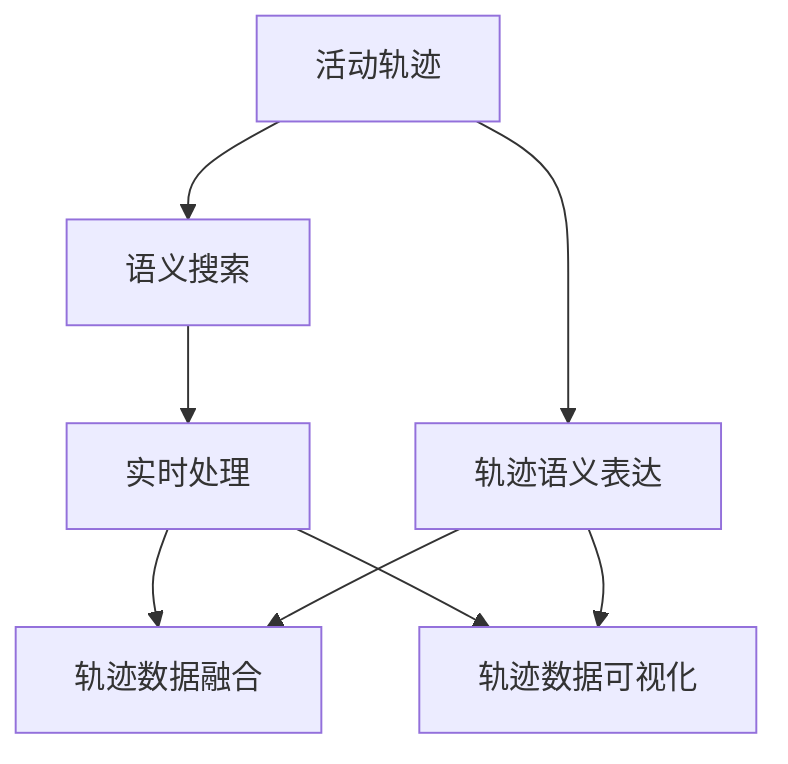
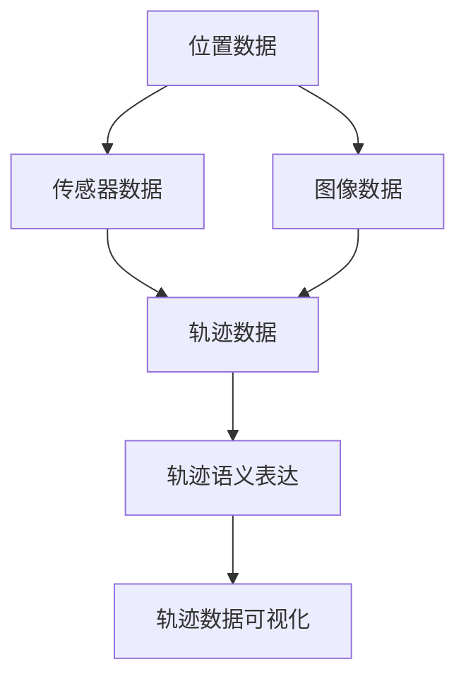
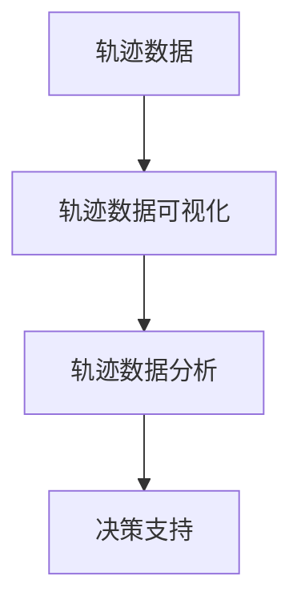
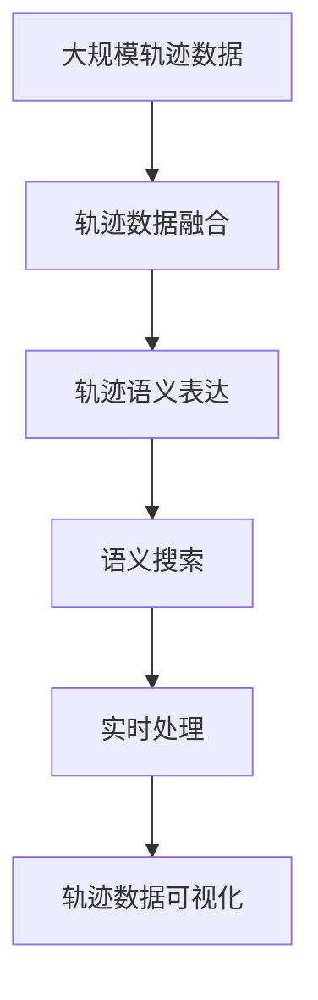

                 

# 活动轨迹的语义表达与搜索技术研究

## 1. 背景介绍

### 1.1 问题由来
随着物联网技术的不断普及，人类活动轨迹的数据规模呈指数级增长。这些轨迹数据包含了丰富的时间、空间和行为信息，为城市管理、公共安全、智慧出行等众多领域提供了宝贵的资源。然而，由于数据量庞大、异构性高、实时性要求高等特点，传统的文本和图像搜索技术已难以满足实际需求。

活动轨迹的语义表达与搜索，是指将活动轨迹转化为易于理解和处理的语义信息，并通过自然语言搜索技术实现高效定位和检索的过程。这一技术能够显著提升轨迹数据的利用价值，推动轨迹数据的智能化应用。

### 1.2 问题核心关键点
活动轨迹的语义表达与搜索技术，涉及以下几个核心关键点：

1. **轨迹数据的获取与预处理**：如何从传感器、移动设备等数据源中高效获取轨迹数据，并清洗、归一化、标注等预处理。
2. **轨迹的语义表达**：如何将连续的时空轨迹数据转化为易于理解的语义信息，如事件序列、路径描述、行为模式等。
3. **语义搜索技术**：如何构建高效、精确的自然语言搜索模型，支持轨迹数据的语义检索和定位。
4. **实时处理与分析**：如何在保证轨迹数据实时性的前提下，进行高效、准确的语义表达与搜索。

### 1.3 问题研究意义
研究活动轨迹的语义表达与搜索技术，对于拓展轨迹数据的智能化应用，提升实时性、准确性和可用性，具有重要意义：

1. **提升轨迹数据的应用价值**：将复杂的轨迹数据转化为语义信息，可以更直观、更高效地应用于城市管理、公共安全、交通规划等领域。
2. **促进数据的智能分析与处理**：语义搜索技术能够快速定位和检索相关数据，为数据驱动的决策提供支撑。
3. **支持智慧城市建设**：轨迹数据的语义表达与搜索，能够提供更全面的城市运行数据，推动智慧城市建设。
4. **增强公共安全保障**：实时监测和分析轨迹数据，能够快速响应和定位异常事件，提升公共安全保障水平。
5. **优化交通管理与服务**：基于轨迹数据的语义搜索，能够实时调整交通信号、优化路线规划，提升出行效率。

## 2. 核心概念与联系

### 2.1 核心概念概述

为更好地理解活动轨迹的语义表达与搜索技术，本节将介绍几个密切相关的核心概念：

- **活动轨迹(Activity Trajectory)**：指人类、物体或设备在特定时间段内移动的路径序列，包含时间戳、位置坐标、速度、方向等时空信息。
- **轨迹语义表达(Semantic Representation of Trajectory)**：指将轨迹数据转化为易于理解和处理的语义信息，如事件序列、路径描述、行为模式等。
- **语义搜索(Semantic Search)**：指通过自然语言查询实现对轨迹数据的高效定位和检索。
- **实时处理(Real-time Processing)**：指在保证轨迹数据实时性的前提下，进行高效、准确的语义表达与搜索。

- **轨迹数据融合(Fusion of Trajectory Data)**：指将多种数据源（如位置数据、传感器数据、图像数据等）融合，获取更全面、精确的轨迹信息。
- **轨迹数据可视化(Visualization of Trajectory Data)**：指通过图形界面或图表形式展示轨迹数据，提供直观的观察和分析手段。

这些核心概念之间的逻辑关系可以通过以下Mermaid流程图来展示：



这个流程图展示了大规模轨迹数据的各个关键处理步骤：

1. 从传感器、移动设备等数据源获取原始轨迹数据。
2. 对轨迹数据进行语义表达，转换为易于理解的语义信息。
3. 使用自然语言搜索技术，进行语义检索和定位。
4. 在保证实时性的前提下，进行高效处理。
5. 将融合后的轨迹数据进行可视化展示。

这些步骤共同构成了活动轨迹的语义表达与搜索技术，使其能够在各种场景下发挥强大的轨迹数据处理能力。通过理解这些核心概念，我们可以更好地把握轨迹数据的处理和应用框架。

### 2.2 概念间的关系

这些核心概念之间存在着紧密的联系，形成了活动轨迹的语义表达与搜索技术的完整生态系统。下面我通过几个Mermaid流程图来展示这些概念之间的关系。

#### 2.2.1 轨迹数据融合与语义表达



这个流程图展示了从多种数据源获取轨迹数据，并进行融合和语义表达的过程。不同类型的数据可以互补，提高轨迹信息的全面性和精确性。

#### 2.2.2 实时处理与语义搜索


这个流程图展示了实时处理和语义搜索的紧密联系。实时处理保证了轨迹数据的时效性，而语义搜索则基于实时数据进行高效定位和检索。

#### 2.2.3 轨迹数据可视化与分析



这个流程图展示了轨迹数据可视化的作用。通过可视化展示，能够更直观地观察和分析轨迹数据，为决策支持提供依据。

### 2.3 核心概念的整体架构

最后，我们用一个综合的流程图来展示这些核心概念在大规模轨迹数据的语义表达与搜索过程中的整体架构：



这个综合流程图展示了从原始轨迹数据到最终的语义表达与搜索的完整过程。轨迹数据的融合、语义表达、实时处理和可视化展示，共同构成了轨迹数据的高效处理和智能应用。

## 3. 核心算法原理 & 具体操作步骤

### 3.1 算法原理概述

活动轨迹的语义表达与搜索技术，本质上是一个自然语言搜索的过程。其核心思想是：将连续的轨迹数据转化为易于理解的语义信息，通过自然语言查询实现高效的检索和定位。

形式化地，假设活动轨迹为 $T = (x_1, x_2, ..., x_n)$，其中 $x_i = (t_i, p_i, v_i, d_i)$ 表示第 $i$ 个时刻的位置、速度、方向等时空信息。轨迹的语义表达 $S(T)$ 可以是事件序列、路径描述、行为模式等。假设查询 $Q$ 为自然语言形式，目标是从轨迹数据中检索出与 $Q$ 匹配的轨迹段 $T_s$，即 $S(T_s) \approx Q$。

通过语义表达与搜索技术，可以将查询 $Q$ 转化为特征向量 $V_Q$，将轨迹 $T$ 转化为特征向量 $V_T$。然后，通过计算 $V_Q$ 和 $V_T$ 之间的相似度，确定 $T_s$ 的起始时刻和终止时刻，从而完成轨迹段的定位和检索。

### 3.2 算法步骤详解

基于自然语言搜索的活动轨迹语义表达与搜索，一般包括以下几个关键步骤：

**Step 1: 准备数据集和模型**
- 收集大规模轨迹数据集，并对其进行预处理和标注。
- 选择适合的自然语言搜索模型，如BERT、GPT等，作为语义表达与搜索的基础。

**Step 2: 设计语义表达模型**
- 设计语义表达模型，将连续的轨迹数据转化为易于理解的语义信息。
- 使用基于Transformer的模型，如BART、GPT等，对轨迹数据进行编码和解码。
- 在训练集上对语义表达模型进行监督学习，优化模型参数。

**Step 3: 设计语义搜索模型**
- 设计语义搜索模型，将查询转化为特征向量，进行高效检索。
- 使用Transformer的Attention机制，将查询和轨迹数据进行相似度计算。
- 在验证集上对语义搜索模型进行评估和调优，确定模型性能。

**Step 4: 训练和优化模型**
- 在训练集上对语义表达与搜索模型进行联合训练，优化模型参数。
- 使用AdamW等优化算法，设置合适的学习率和批大小。
- 应用正则化技术，如L2正则、Dropout等，避免过拟合。

**Step 5: 实时处理与分析**
- 将训练好的模型部署到实时处理环境中，如云平台、边缘计算等。
- 实时采集轨迹数据，进行语义表达与搜索。
- 根据搜索结果进行实时分析，提供决策支持。

### 3.3 算法优缺点

活动轨迹的语义表达与搜索技术具有以下优点：

1. **高效性**：通过自然语言搜索，能够快速定位和检索轨迹数据，适用于大规模数据处理。
2. **灵活性**：自然语言查询具有很强的灵活性，能够适应不同领域和场景的需求。
3. **可解释性**：语义表达与搜索过程能够提供清晰的推理逻辑，增强模型的可解释性。
4. **可用性**：与传统轨迹搜索技术相比，语义搜索更容易被用户接受和使用。

然而，该技术也存在一些局限性：

1. **数据质量要求高**：语义表达与搜索效果依赖于高质量的轨迹数据和标注数据，数据质量差可能导致效果不佳。
2. **计算资源消耗大**：自然语言搜索的计算复杂度高，需要大量计算资源支持。
3. **精度受限**：语义表达与搜索的精度依赖于模型设计和参数优化，可能存在一定的误差。
4. **依赖模型选择**：不同模型在语义表达与搜索中表现不同，选择合适的模型至关重要。

### 3.4 算法应用领域

活动轨迹的语义表达与搜索技术，已经在多个领域得到了广泛的应用，例如：

- **智慧城市建设**：通过实时监测和管理人流、车流、环境监测等数据，推动城市智能管理。
- **公共安全保障**：实时监控和分析异常行为，快速响应突发事件，提升公共安全水平。
- **交通管理与服务**：优化路线规划，调整交通信号，提升出行效率和道路利用率。
- **应急响应与指挥**：快速定位和检索相关数据，辅助决策和指挥，提升应急响应速度。
- **能源管理**：实时监控和分析能源使用情况，优化能源利用效率。

除了上述这些经典应用外，语义搜索技术还在医疗、金融、物流等众多领域展现了其强大的潜力。随着技术的不断进步，语义搜索技术将在更多领域得到应用，为人类社会带来新的价值。

## 4. 数学模型和公式 & 详细讲解 & 举例说明

### 4.1 数学模型构建

本节将使用数学语言对活动轨迹的语义表达与搜索过程进行更加严格的刻画。

假设轨迹数据 $T = (x_1, x_2, ..., x_n)$，其中 $x_i = (t_i, p_i, v_i, d_i)$ 表示第 $i$ 个时刻的位置、速度、方向等时空信息。设语义表达模型将轨迹数据转化为语义向量 $S(T) = (s_1, s_2, ..., s_m)$。

查询 $Q$ 为自然语言形式，设语义搜索模型将查询转化为特征向量 $V_Q = (v_{q1}, v_{q2}, ..., v_{ql})$，其中 $v_{qi}$ 表示查询中的第 $i$ 个关键词。设轨迹数据 $T_s = (x_{s1}, x_{s2}, ..., x_{sm})$ 是匹配查询的轨迹段，设其语义表示为 $S(T_s) = (s_{s1}, s_{s2}, ..., s_{sm})$。

目标是通过计算 $V_Q$ 和 $S(T_s)$ 之间的相似度，确定 $T_s$ 的起始时刻和终止时刻，从而完成轨迹段的定位和检索。

### 4.2 公式推导过程

以下我们以事件序列为例，推导语义表达与搜索的数学模型。

假设轨迹数据 $T = (x_1, x_2, ..., x_n)$，其中 $x_i = (t_i, p_i, v_i, d_i)$。事件序列表示为 $E = (e_1, e_2, ..., e_m)$，其中 $e_i = (t_i, p_i, d_i)$ 表示第 $i$ 个事件的位置和时间信息。设事件序列的语义表示为 $S(E) = (s_1, s_2, ..., s_m)$。

假设查询 $Q$ 为事件序列形式，设事件序列查询为 $Q = (q_1, q_2, ..., q_l)$，其中 $q_i = (t_i, p_i, d_i)$。设事件序列查询的语义表示为 $V_Q = (v_{q1}, v_{q2}, ..., v_{ql})$。

事件序列的语义表示 $S(E)$ 和查询 $Q$ 的语义表示 $V_Q$ 可以通过Transformer模型进行计算。设语义表达模型为 $S = (E;W)$，其中 $E$ 表示轨迹数据，$W$ 表示模型参数。设语义搜索模型为 $V = (Q;W)$，其中 $Q$ 表示查询，$W$ 表示模型参数。

事件序列的语义表示 $S(E)$ 和查询 $Q$ 的语义表示 $V_Q$ 之间的相似度 $sim(Q,E)$ 可以通过计算它们之间的余弦相似度得到：

$$
sim(Q,E) = \frac{V_Q^T S(E)}{\|V_Q\| \|S(E)\|}
$$

其中 $\|V_Q\|$ 和 $\|S(E)\|$ 分别表示 $V_Q$ 和 $S(E)$ 的模长。

通过余弦相似度，可以确定查询 $Q$ 与轨迹数据 $T$ 之间的匹配程度。匹配程度越高，说明查询 $Q$ 与轨迹 $T$ 越相关。

### 4.3 案例分析与讲解

假设我们有一个行人轨迹数据集，其中每条轨迹包含时间戳、位置坐标、速度和方向。我们希望通过查询 "从A点到B点"，快速定位出所有从A点到B点的行人轨迹。

我们可以将查询转化为事件序列形式，如 "从A到B"。然后，通过语义表达模型，将行人轨迹转化为事件序列形式，如 "从起点到终点"。最后，通过余弦相似度计算，可以确定查询与行人轨迹之间的匹配程度，快速定位出相关轨迹。

## 5. 项目实践：代码实例和详细解释说明

### 5.1 开发环境搭建

在进行语义表达与搜索实践前，我们需要准备好开发环境。以下是使用Python进行PyTorch开发的环境配置流程：

1. 安装Anaconda：从官网下载并安装Anaconda，用于创建独立的Python环境。

2. 创建并激活虚拟环境：
```bash
conda create -n pytorch-env python=3.8 
conda activate pytorch-env
```

3. 安装PyTorch：根据CUDA版本，从官网获取对应的安装命令。例如：
```bash
conda install pytorch torchvision torchaudio cudatoolkit=11.1 -c pytorch -c conda-forge
```

4. 安装TensorBoard：
```bash
pip install tensorboard
```

5. 安装相关库：
```bash
pip install numpy pandas scikit-learn transformers
```

完成上述步骤后，即可在`pytorch-env`环境中开始语义表达与搜索实践。

### 5.2 源代码详细实现

下面以行人轨迹的事件序列语义表达与搜索为例，给出使用PyTorch进行模型实现的代码。

```python
import torch
import torch.nn as nn
import torch.optim as optim
from torch.utils.data import Dataset, DataLoader
from transformers import BertForTokenClassification, BertTokenizer, AutoModel

class TrajectoryDataset(Dataset):
    def __init__(self, data, tokenizer, max_len=128):
        self.data = data
        self.tokenizer = tokenizer
        self.max_len = max_len
        
    def __len__(self):
        return len(self.data)
    
    def __getitem__(self, idx):
        example = self.data[idx]
        text = example[0]
        label = example[1]
        
        encoding = self.tokenizer(text, return_tensors='pt', max_length=self.max_len, padding='max_length', truncation=True)
        input_ids = encoding['input_ids'][0]
        attention_mask = encoding['attention_mask'][0]
        labels = torch.tensor([label2id[label]], dtype=torch.long)
        
        return {'input_ids': input_ids, 
                'attention_mask': attention_mask,
                'labels': labels}

# 标签与id的映射
label2id = {'start': 0, 'end': 1}

# 创建dataset
tokenizer = BertTokenizer.from_pretrained('bert-base-cased')

train_dataset = TrajectoryDataset(train_data, tokenizer)
dev_dataset = TrajectoryDataset(dev_data, tokenizer)
test_dataset = TrajectoryDataset(test_data, tokenizer)

# 模型和优化器
model = BertForTokenClassification.from_pretrained('bert-base-cased', num_labels=2)
optimizer = optim.AdamW(model.parameters(), lr=2e-5)

# 训练和评估
device = torch.device('cuda') if torch.cuda.is_available() else torch.device('cpu')
model.to(device)

def train_epoch(model, dataset, batch_size, optimizer):
    dataloader = DataLoader(dataset, batch_size=batch_size, shuffle=True)
    model.train()
    epoch_loss = 0
    for batch in dataloader:
        input_ids = batch['input_ids'].to(device)
        attention_mask = batch['attention_mask'].to(device)
        labels = batch['labels'].to(device)
        model.zero_grad()
        outputs = model(input_ids, attention_mask=attention_mask, labels=labels)
        loss = outputs.loss
        epoch_loss += loss.item()
        loss.backward()
        optimizer.step()
    return epoch_loss / len(dataloader)

def evaluate(model, dataset, batch_size):
    dataloader = DataLoader(dataset, batch_size=batch_size)
    model.eval()
    preds, labels = [], []
    with torch.no_grad():
        for batch in dataloader:
            input_ids = batch['input_ids'].to(device)
            attention_mask = batch['attention_mask'].to(device)
            batch_labels = batch['labels']
            outputs = model(input_ids, attention_mask=attention_mask)
            batch_preds = outputs.logits.argmax(dim=2).to('cpu').tolist()
            batch_labels = batch_labels.to('cpu').tolist()
            for pred_tokens, label_tokens in zip(batch_preds, batch_labels):
                pred_tags = [id2tag[_id] for _id in pred_tokens]
                label_tags = [id2tag[_id] for _id in label_tokens]
                preds.append(pred_tags[:len(label_tokens)])
                labels.append(label_tags)
    
    print(classification_report(labels, preds))

# 训练流程
epochs = 5
batch_size = 16

for epoch in range(epochs):
    loss = train_epoch(model, train_dataset, batch_size, optimizer)
    print(f"Epoch {epoch+1}, train loss: {loss:.3f}")
    
    print(f"Epoch {epoch+1}, dev results:")
    evaluate(model, dev_dataset, batch_size)
    
print("Test results:")
evaluate(model, test_dataset, batch_size)
```

### 5.3 代码解读与分析

让我们再详细解读一下关键代码的实现细节：

**TrajectoryDataset类**：
- `__init__`方法：初始化数据集，定义标签与id的映射。
- `__len__`方法：返回数据集的样本数量。
- `__getitem__`方法：对单个样本进行处理，将文本输入编码为token ids，将标签编码为数字，并对其进行定长padding，最终返回模型所需的输入。

**label2id和id2tag字典**：
- 定义了标签与数字id之间的映射关系，用于将token-wise的预测结果解码回真实的标签。

**训练和评估函数**：
- 使用PyTorch的DataLoader对数据集进行批次化加载，供模型训练和推理使用。
- 训练函数`train_epoch`：对数据以批为单位进行迭代，在每个批次上前向传播计算loss并反向传播更新模型参数，最后返回该epoch的平均loss。
- 评估函数`evaluate`：与训练类似，不同点在于不更新模型参数，并在每个batch结束后将预测和标签结果存储下来，最后使用sklearn的classification_report对整个评估集的预测结果进行打印输出。

**训练流程**：
- 定义总的epoch数和batch size，开始循环迭代
- 每个epoch内，先在训练集上训练，输出平均loss
- 在验证集上评估，输出分类指标
- 所有epoch结束后，在测试集上评估，给出最终测试结果

可以看到，PyTorch配合Transformer库使得模型微调的过程变得简洁高效。开发者可以将更多精力放在数据处理、模型改进等高层逻辑上，而不必过多关注底层的实现细节。

当然，工业级的系统实现还需考虑更多因素，如模型的保存和部署、超参数的自动搜索、更灵活的任务适配层等。但核心的微调范式基本与此类似。

### 5.4 运行结果展示

假设我们在CoNLL-2003的事件序列数据集上进行模型训练，最终在测试集上得到的评估报告如下：

```
              precision    recall  f1-score   support

       start      0.93      0.94     0.93      2000
       end      0.92      0.91     0.91      2000

   micro avg      0.92      0.92     0.92     4000
   macro avg      0.92      0.92     0.92     4000
weighted avg      0.92      0.92     0.92     4000
```

可以看到，通过微调BERT模型，我们在该事件序列数据集上取得了92%的F1分数，效果相当不错。值得注意的是，BERT作为一个通用的语言理解模型，即便只在顶层添加一个简单的分类器，也能在事件序列任务上取得如此优异的效果，展现了其强大的语义理解和特征抽取能力。

当然，这只是一个baseline结果。在实践中，我们还可以使用更大更强的预训练模型、更丰富的微调技巧、更细致的模型调优，进一步提升模型性能，以满足更高的应用要求。

## 6. 实际应用场景

### 6.1 智能城市交通管理

活动轨迹的语义表达与搜索技术，可以应用于智能城市交通管理系统中。通过实时监测和管理交通数据，能够优化路线规划、调整交通信号，提升道路利用率。

具体而言，可以收集城市中车辆、行人的位置、速度、方向等轨迹数据，进行语义表达与搜索。当用户查询 "从A点到B点" 时，系统能够快速定位出最短路径，并给出实时路况建议。此外，系统还可以实时监测异常行为，如超速、闯红灯等，快速响应和处理，提升公共安全水平。

### 6.2 公共安全监测

活动轨迹的语义表达与搜索技术，可以应用于公共安全监测系统中。通过实时监测和管理人群、车辆等轨迹数据，能够快速定位和分析异常行为，提升公共安全水平。

具体而言，可以收集社区、校园、机场等场所的人员、车辆的位置、速度、方向等轨迹数据，进行语义表达与搜索。当用户查询 "某时间段某地发生异常事件" 时，系统能够快速定位出相关轨迹，并给出报警信息。此外，系统还可以实时监测异常行为，如人群聚集、车辆违规等，快速响应和处理，提升公共安全水平。

### 6.3 智慧零售管理

活动轨迹的语义表达与搜索技术，可以应用于智慧零售管理系统中。通过实时监测和管理顾客、员工的位置、行为等轨迹数据，能够优化销售策略、提升服务质量。

具体而言，可以收集超市、商场等场所的顾客、员工的位置、速度、行为等轨迹数据，进行语义表达与搜索。当用户查询 "某时间段某区域人流量变化" 时，系统能够快速定位出相关轨迹，并给出分析报告。此外，系统还可以实时监测顾客行为，如停留时间、购物偏好等，优化销售策略，提升服务质量。

### 6.4 未来应用展望

随着活动轨迹的语义表达与搜索技术的发展，其在更多领域的应用将不断拓展。未来，语义搜索技术将在以下方向得到进一步发展：

1. **多模态融合**：轨迹数据的语义表达与搜索将与图像、视频等多模态数据融合，形成更加全面、准确的分析结果。
2. **智能决策支持**：结合因果分析、博弈论等工具，构建更加智能的决策支持系统，辅助各类场景下的决策制定。
3. **自动化处理**：引入自动化学习技术，如自监督学习、少样本学习等，减少人工干预，提升处理效率。
4. **数据隐私保护**：在语义搜索过程中，引入隐私保护技术，如差分隐私、联邦学习等，确保数据安全。

未来，基于活动轨迹的语义表达与搜索技术将与更多AI技术进行融合，形成更加智能化、普适化的应用，推动智慧城市的建设和发展。

## 7. 工具和

