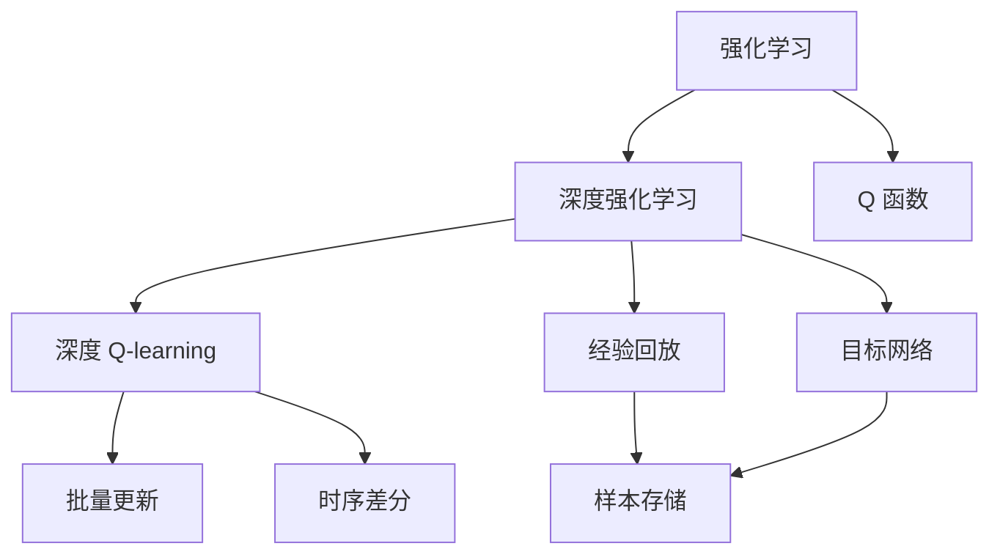
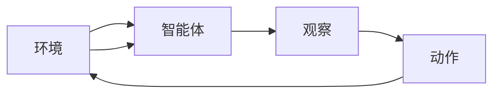
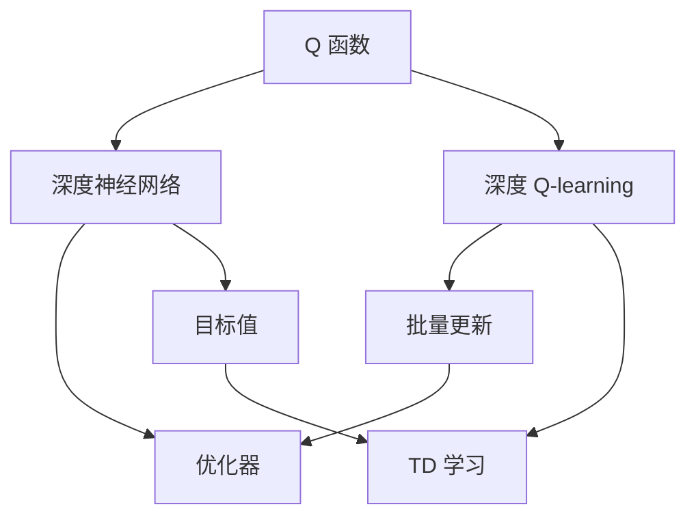
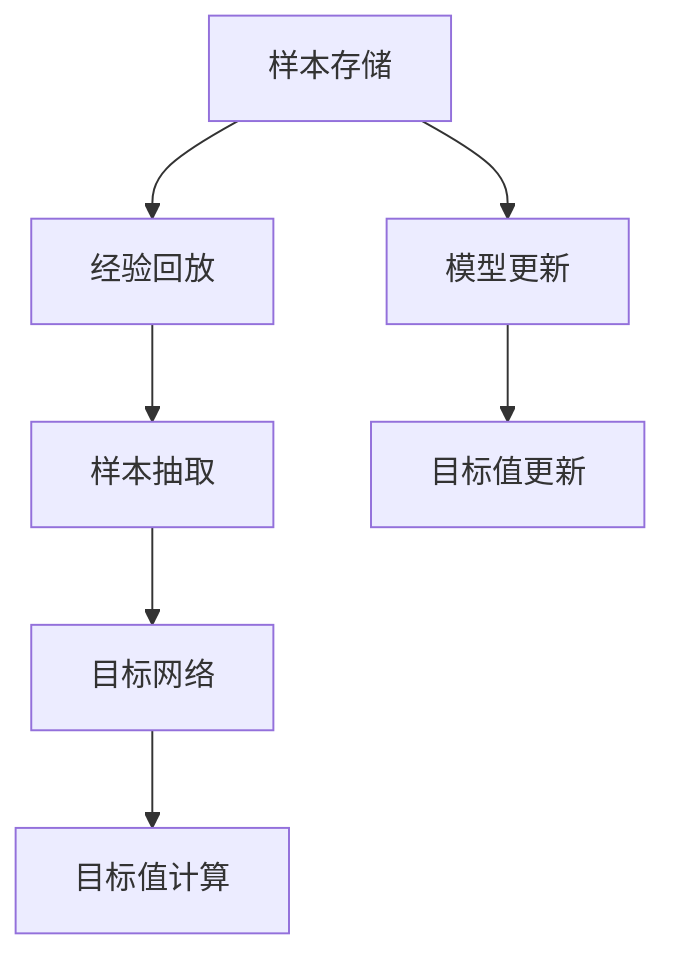
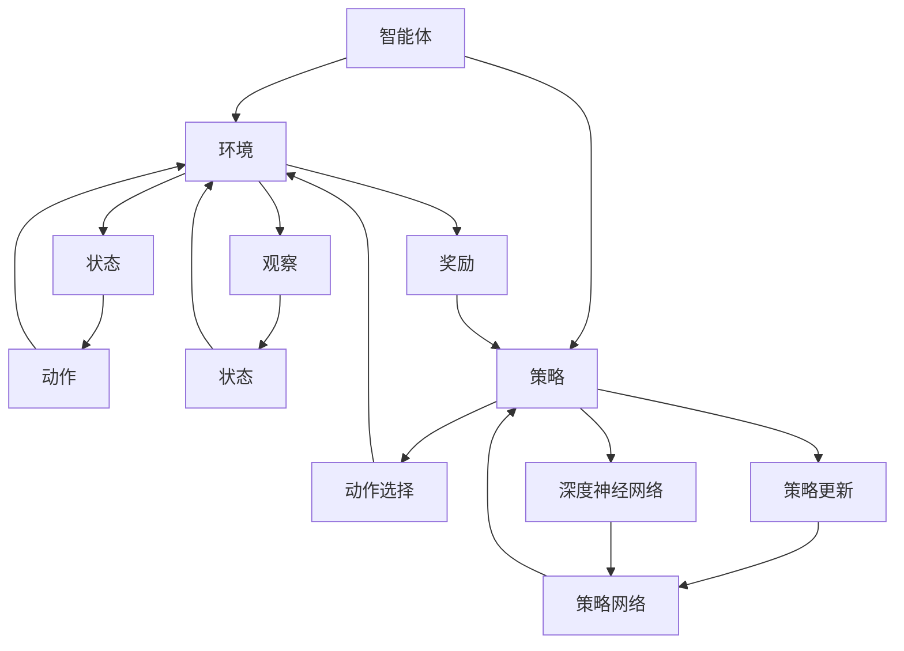

                 

# 深度 Q-learning：深度Q-learning VS DQN

## 1. 背景介绍

### 1.1 问题由来
深度强化学习（Deep Reinforcement Learning, DRL）是近年来人工智能领域的重要研究方向，旨在通过深度神经网络来学习和优化强化学习（Reinforcement Learning, RL）问题。其中，深度 Q-learning 和 DQN（Deep Q-Networks）是两种最为经典的深度强化学习算法，它们通过使用深度神经网络来逼近 Q 函数，从而在复杂环境中获取最优决策策略。本文将详细探讨深度 Q-learning 和 DQN 的原理和应用，并对比它们之间的异同点。

### 1.2 问题核心关键点
深度 Q-learning 和 DQN 的异同点在于它们的实现方式和参数更新策略。深度 Q-learning 使用深度神经网络来逼近 Q 函数，同时使用批量更新和时序差分（Temporal Difference, TD）学习来优化模型。而 DQN 则采用经验回放（Experience Replay）和目标网络（Target Network）等技术，来减少样本偏差和更新目标之间的差距。

本文旨在通过对比这两种算法，帮助读者深入理解深度强化学习的核心思想和实现方法，并为实际应用提供参考。

### 1.3 问题研究意义
深度 Q-learning 和 DQN 在实际应用中具有广泛的前景，例如在智能游戏、机器人控制、路径规划等领域，它们都能提供高效、稳定的决策支持。通过研究这两种算法的异同点，可以为研究人员和工程师提供深度强化学习领域的学习和实践指南，帮助他们更好地解决实际问题。

## 2. 核心概念与联系

### 2.1 核心概念概述

为了更好地理解深度 Q-learning 和 DQN 的原理和应用，本节将介绍几个密切相关的核心概念：

- **强化学习（Reinforcement Learning, RL）**：一种机器学习范式，通过与环境交互，智能体（Agent）学习最优策略，以最大化累积奖励。
- **深度强化学习（Deep Reinforcement Learning, DRL）**：结合深度神经网络和强化学习的方法，使用深度模型来逼近 Q 函数或策略网络。
- **Q 函数（Q-Function）**：在强化学习中，Q 函数表示在特定状态下采取特定动作的长期累积奖励。
- **深度 Q-learning（Deep Q-learning）**：使用深度神经网络逼近 Q 函数，并使用批量更新和 TD 学习来优化模型的强化学习算法。
- **DQN（Deep Q-Networks）**：一种基于深度 Q-learning 的强化学习算法，通过经验回放和目标网络等技术，进一步减少偏差和提升学习效率。
- **经验回放（Experience Replay）**：在训练过程中，将样本存储在缓冲区中，然后随机抽取样本进行训练，以减少样本偏差。
- **目标网络（Target Network）**：引入一个目标 Q 网络，用于计算目标值（Target Value），并作为模型优化的目标。

这些核心概念之间的逻辑关系可以通过以下 Mermaid 流程图来展示：



这个流程图展示了强化学习和深度强化学习的基本过程，以及深度 Q-learning 和 DQN 的核心组件和实现方式。

### 2.2 概念间的关系

这些核心概念之间存在着紧密的联系，形成了深度强化学习的完整生态系统。下面我们通过几个 Mermaid 流程图来展示这些概念之间的关系。

#### 2.2.1 强化学习的基本流程



这个流程图展示了强化学习的基本流程：环境给出状态，智能体根据状态选择动作，环境返回奖励和下一个状态，智能体根据奖励和下一个状态更新策略。

#### 2.2.2 深度 Q-learning 和 DQN 的实现方式



这个流程图展示了深度 Q-learning 和 DQN 的实现方式：使用深度神经网络逼近 Q 函数，通过批量更新和 TD 学习来优化模型，同时使用目标值和优化器来调整模型参数。

#### 2.2.3 经验回放和目标网络



这个流程图展示了经验回放和目标网络的基本过程：将样本存储在缓冲区中，随机抽取样本进行训练，同时使用目标网络来计算目标值，并作为模型优化的目标。

### 2.3 核心概念的整体架构

最后，我们用一个综合的流程图来展示这些核心概念在大模型微调过程中的整体架构：



这个综合流程图展示了智能体与环境交互的基本过程，以及深度神经网络在策略选择和优化中的作用。

## 3. 核心算法原理 & 具体操作步骤
### 3.1 算法原理概述

深度 Q-learning 和 DQN 的核心思想是使用深度神经网络来逼近 Q 函数，并通过优化策略来最大化累积奖励。它们的主要区别在于参数更新策略和样本处理方法。

深度 Q-learning 使用批量更新和时序差分（TD）学习来优化模型。批量更新可以充分利用样本，加速模型收敛。时序差分学习则通过更新前后状态的奖励差异来估计 Q 值，从而降低方差，提升学习效率。

DQN 则通过经验回放和目标网络等技术，进一步减少样本偏差和更新目标之间的差距。经验回放将样本存储在缓冲区中，然后随机抽取样本进行训练，以减少样本偏差。目标网络引入一个目标 Q 网络，用于计算目标值，并作为模型优化的目标。

### 3.2 算法步骤详解

下面，我们将详细介绍深度 Q-learning 和 DQN 的算法步骤和具体操作步骤。

#### 3.2.1 深度 Q-learning 的算法步骤

1. **模型初始化**：
   - 初始化深度神经网络模型，用于逼近 Q 函数。

2. **样本采集**：
   - 从环境中采集样本，包括当前状态、采取的动作和获得的奖励，以及下一个状态。

3. **计算 Q 值**：
   - 使用模型计算当前状态-动作对的 Q 值。

4. **目标 Q 值计算**：
   - 如果已经到达终止状态，直接返回奖励；否则，计算下一个状态-动作对的 Q 值，并将奖励作为 Q 值的一部分。

5. **损失函数计算**：
   - 计算当前状态-动作对的损失函数，即 Q 值与目标 Q 值之间的差异。

6. **参数更新**：
   - 使用优化器更新模型参数，最小化损失函数。

7. **样本存储**：
   - 将当前状态、采取的动作、获得的奖励和下一个状态存储在缓冲区中。

8. **参数冻结**：
   - 冻结部分参数，仅更新目标 Q 网络，以减少过拟合风险。

9. **循环执行**：
   - 重复上述步骤，直至达到预设的迭代次数或收敛条件。

#### 3.2.2 DQN 的算法步骤

1. **模型初始化**：
   - 初始化深度神经网络模型，用于逼近 Q 函数。

2. **样本采集**：
   - 从环境中采集样本，包括当前状态、采取的动作和获得的奖励，以及下一个状态。

3. **经验回放**：
   - 将样本存储在缓冲区中，使用经验回放技术进行样本抽取。

4. **目标 Q 值计算**：
   - 使用目标 Q 网络计算下一个状态-动作对的 Q 值，并将奖励作为 Q 值的一部分。

5. **损失函数计算**：
   - 计算当前状态-动作对的损失函数，即 Q 值与目标 Q 值之间的差异。

6. **参数更新**：
   - 使用优化器更新模型参数，最小化损失函数。

7. **目标网络更新**：
   - 使用目标网络更新目标 Q 值，并作为模型优化的目标。

8. **参数冻结**：
   - 冻结部分参数，仅更新目标 Q 网络，以减少过拟合风险。

9. **循环执行**：
   - 重复上述步骤，直至达到预设的迭代次数或收敛条件。

### 3.3 算法优缺点

深度 Q-learning 和 DQN 各有优缺点，下面将详细分析它们的优缺点。

#### 3.3.1 深度 Q-learning 的优缺点

**优点**：
- 批量更新可以充分利用样本，加速模型收敛。
- 时序差分学习能够降低方差，提升学习效率。
- 可以处理高维状态空间和连续动作空间。

**缺点**：
- 深度神经网络容易导致过拟合，尤其是参数较多时。
- 模型复杂度高，训练和推理速度较慢。

#### 3.3.2 DQN 的优缺点

**优点**：
- 经验回放能够减少样本偏差，提升学习效率。
- 目标网络能够提供稳定的目标值，避免目标网络的更新对当前网络的过度干扰。

**缺点**：
- 需要额外的内存空间来存储缓冲区。
- 样本的随机抽取可能导致训练的不稳定性。
- 目标网络的更新需要额外的时间和计算资源。

### 3.4 算法应用领域

深度 Q-learning 和 DQN 在许多领域中都有广泛的应用，例如：

- **智能游戏**：
  - 如 AlphaGo、AlphaGo Zero 等，使用深度强化学习算法在围棋、星际争霸等复杂游戏中取得突破。

- **机器人控制**：
  - 如机器人路径规划、物体抓取等，使用 DQN 等算法实现自主导航和操作。

- **自动驾驶**：
  - 如交通信号灯控制、车辆行驶路径规划等，使用强化学习算法实现智能化决策。

- **自然语言处理**：
  - 如机器翻译、对话系统等，使用深度 Q-learning 和 DQN 等算法实现自然语言理解和生成。

- **金融交易**：
  - 如股票交易策略优化、风险管理等，使用深度强化学习算法进行投资决策。

## 4. 数学模型和公式 & 详细讲解 & 举例说明

### 4.1 数学模型构建

为了更好地理解深度 Q-learning 和 DQN 的数学模型和公式，本节将详细推导它们的数学模型。

设智能体在环境中的状态为 $s_t$，采取的动作为 $a_t$，获得的奖励为 $r_t$，下一个状态为 $s_{t+1}$，模型的参数为 $\theta$。深度 Q-learning 和 DQN 的数学模型如下：

#### 4.1.1 深度 Q-learning 的数学模型

在深度 Q-learning 中，使用深度神经网络逼近 Q 函数 $Q_{\theta}(s_t, a_t)$，并使用批量更新和时序差分（TD）学习来优化模型。Q 函数定义为：

$$
Q_{\theta}(s_t, a_t) = \mathbb{E}[G_t | s_t, a_t] = \mathbb{E}[\sum_{i=t}^{\infty} \gamma^{i-t} r_{i+1} | s_t, a_t]
$$

其中，$G_t$ 表示从时间 $t$ 开始的累积奖励，$\gamma$ 为折扣因子，$r_{i+1}$ 表示时间 $i+1$ 的奖励。

时序差分学习通过更新前后状态的奖励差异来估计 Q 值，具体公式如下：

$$
\hat{Q}_{t}(s_t, a_t) = Q_{\theta}(s_t, a_t) + \alpha \left[ r_{t+1} + \gamma \max_a Q_{\theta}(s_{t+1}, a) - Q_{\theta}(s_t, a_t) \right]
$$

其中，$\alpha$ 为学习率，$\max_a Q_{\theta}(s_{t+1}, a)$ 表示在下一个状态 $s_{t+1}$ 中采取动作 $a$ 的 Q 值。

批量更新使用优化器 $\mathcal{L}$ 来最小化损失函数：

$$
\mathcal{L}(\theta) = \frac{1}{N} \sum_{i=1}^N \left[ Q_{\theta}(s_i, a_i) - (r_i + \gamma \max_a Q_{\theta}(s_{i+1}, a)) \right]^2
$$

其中，$N$ 为批量大小。

#### 4.1.2 DQN 的数学模型

在 DQN 中，使用深度神经网络逼近 Q 函数 $Q_{\theta}(s_t, a_t)$，并使用经验回放和目标网络来优化模型。目标 Q 函数定义为：

$$
Q_{\theta'}(s_t, a_t) = \mathbb{E}[G_t | s_t, a_t] = \mathbb{E}[\sum_{i=t}^{\infty} \gamma^{i-t} r_{i+1} | s_t, a_t]
$$

其中，$Q_{\theta'}$ 为参数为 $\theta'$ 的目标 Q 网络。

经验回放将样本存储在缓冲区中，然后随机抽取样本进行训练。目标值计算公式如下：

$$
\hat{Q}_{t}(s_t, a_t) = r_t + \gamma \max_a Q_{\theta'}(s_{t+1}, a)
$$

其中，$\gamma$ 为折扣因子，$\max_a Q_{\theta'}(s_{t+1}, a)$ 表示在下一个状态 $s_{t+1}$ 中采取动作 $a$ 的目标 Q 值。

目标网络更新使用优化器 $\mathcal{L}$ 来最小化损失函数：

$$
\mathcal{L}(\theta) = \frac{1}{N} \sum_{i=1}^N \left[ Q_{\theta}(s_i, a_i) - (r_i + \gamma \max_a Q_{\theta'}(s_{i+1}, a)) \right]^2
$$

其中，$N$ 为批量大小。

### 4.2 公式推导过程

以下是深度 Q-learning 和 DQN 的公式推导过程。

#### 4.2.1 深度 Q-learning 的公式推导

在深度 Q-learning 中，Q 函数定义为：

$$
Q_{\theta}(s_t, a_t) = \mathbb{E}[G_t | s_t, a_t] = \mathbb{E}[\sum_{i=t}^{\infty} \gamma^{i-t} r_{i+1} | s_t, a_t]
$$

其中，$G_t$ 表示从时间 $t$ 开始的累积奖励，$\gamma$ 为折扣因子，$r_{i+1}$ 表示时间 $i+1$ 的奖励。

时序差分学习通过更新前后状态的奖励差异来估计 Q 值，具体公式如下：

$$
\hat{Q}_{t}(s_t, a_t) = Q_{\theta}(s_t, a_t) + \alpha \left[ r_{t+1} + \gamma \max_a Q_{\theta}(s_{t+1}, a) - Q_{\theta}(s_t, a_t) \right]
$$

其中，$\alpha$ 为学习率，$\max_a Q_{\theta}(s_{t+1}, a)$ 表示在下一个状态 $s_{t+1}$ 中采取动作 $a$ 的 Q 值。

批量更新使用优化器 $\mathcal{L}$ 来最小化损失函数：

$$
\mathcal{L}(\theta) = \frac{1}{N} \sum_{i=1}^N \left[ Q_{\theta}(s_i, a_i) - (r_i + \gamma \max_a Q_{\theta}(s_{i+1}, a)) \right]^2
$$

其中，$N$ 为批量大小。

#### 4.2.2 DQN 的公式推导

在 DQN 中，目标 Q 函数定义为：

$$
Q_{\theta'}(s_t, a_t) = \mathbb{E}[G_t | s_t, a_t] = \mathbb{E}[\sum_{i=t}^{\infty} \gamma^{i-t} r_{i+1} | s_t, a_t]
$$

其中，$Q_{\theta'}$ 为参数为 $\theta'$ 的目标 Q 网络。

经验回放将样本存储在缓冲区中，然后随机抽取样本进行训练。目标值计算公式如下：

$$
\hat{Q}_{t}(s_t, a_t) = r_t + \gamma \max_a Q_{\theta'}(s_{t+1}, a)
$$

其中，$\gamma$ 为折扣因子，$\max_a Q_{\theta'}(s_{t+1}, a)$ 表示在下一个状态 $s_{t+1}$ 中采取动作 $a$ 的目标 Q 值。

目标网络更新使用优化器 $\mathcal{L}$ 来最小化损失函数：

$$
\mathcal{L}(\theta) = \frac{1}{N} \sum_{i=1}^N \left[ Q_{\theta}(s_i, a_i) - (r_i + \gamma \max_a Q_{\theta'}(s_{i+1}, a)) \right]^2
$$

其中，$N$ 为批量大小。

### 4.3 案例分析与讲解

为了更好地理解深度 Q-learning 和 DQN 的原理和应用，下面我们将通过两个案例进行分析。

#### 4.3.1 案例一：智能游戏

在智能游戏领域，深度 Q-learning 和 DQN 都取得了显著的成就。以 AlphaGo 为例，它使用深度 Q-learning 算法，结合蒙特卡洛树搜索（Monte Carlo Tree Search, MCTS）等技术，在围棋比赛中取得了突破性的胜利。

AlphaGo 的 Q 网络结构包含多个卷积层和全连接层，用于逼近围棋状态-动作的 Q 值。在训练过程中，AlphaGo 使用批量更新和时序差分学习来优化 Q 网络，同时使用目标网络来计算目标值，并作为模型优化的目标。

AlphaGo 还引入了卷积网络、残差网络等技术，以提升模型的表达能力和训练效率。在实际应用中，AlphaGo 能够处理高维状态空间和连续动作空间，从而在围棋中取得了卓越的表现。

#### 4.3.2 案例二：机器人控制

在机器人控制领域，DQN 算法也取得了广泛的应用。以机器人路径规划为例，DQN 算法能够帮助机器人学习如何在复杂环境中自主导航。

DQN 在训练过程中，将机器人传感器检测到的状态和采取的动作作为输入，将获得的奖励和下一个状态作为输出。目标网络用于计算目标值，并作为模型优化的目标。

DQN 还使用了经验回放和目标网络等技术，以减少样本偏差和提升学习效率。在实际应用中，DQN 能够帮助机器人学习最优路径，从而实现自主导航和操作。

## 5. 项目实践：代码实例和详细解释说明

### 5.1 开发环境搭建

在进行深度 Q-learning 和 DQN 的实践前，我们需要准备好开发环境。以下是使用Python进行TensorFlow和Keras开发的环境配置流程：

1. 安装Anaconda：从官网下载并安装Anaconda，用于创建独立的Python环境。

2. 创建并激活虚拟环境：
```bash
conda create -n tf-env python=3.8 
conda activate tf-env
```

3. 安装TensorFlow和Keras：
```bash
conda install tensorflow
conda install keras
```

4. 安装各类工具包：
```bash
pip install numpy pandas scikit-learn matplotlib tqdm jupyter notebook ipython
```

完成上述步骤后，即可在`tf-env`环境中开始深度 Q-learning 和 DQN 的实践。

### 5.2 源代码详细实现

下面我们以智能游戏为例，给出使用TensorFlow和Keras实现深度 Q-learning 和 DQN 的Python代码实现。

首先，定义智能游戏环境：

```python
import gym

env = gym.make('CartPole-v1')
```

然后，定义深度 Q-learning 和 DQN 的模型：

```python
import tensorflow as tf
from tensorflow.keras import layers, models

# 定义 Q 网络
def build_q_network(input_shape, output_dim):
    model = models.Sequential([
        layers.Dense(64, input_shape=input_shape, activation='relu'),
        layers.Dense(64, activation='relu'),
        layers.Dense(output_dim)
    ])
    return model

# 定义深度 Q-learning 模型
def build_dql_model(input_shape, output_dim):
    q_model = build_q_network(input_shape, output_dim)
    target_model = build_q_network(input_shape, output_dim)
    return q_model, target_model

# 定义 DQN 模型
def build_dqn_model(input_shape, output_dim):
    q_model = build_q_network(input_shape, output_dim)
    target_model = build_q_network(input_shape, output_dim)
    target_model.set_weights(q_model.get_weights())
    return q_model, target_model
```

接下来，定义训练函数：

```python
import numpy as np
from tensorflow.keras.optimizers import Adam

# 定义训练函数
def train_dql(env, q_model, target_model, batch_size, episode_count, gamma, alpha, epsilon):
    # 初始化参数
    q_model.compile(optimizer=Adam(learning_rate=alpha), loss='mse')
    target_model.trainable = False

    # 训练
    for episode in range(episode_count):
        state = env.reset()
        done = False
        total_reward = 0

        while not done:
            # 选择动作
            if np.random.rand() < epsilon:
                action = env.action_space.sample()
            else:
                q_value = q_model.predict(np.array([state])[0])
                action = np.argmax(q_value)

            # 执行动作
            next_state, reward, done, _ = env.step(action)
            total_reward += reward

            # 计算目标值
            if done:
                target_q = reward
            else:
                target_q = reward + gamma * np.max(target_model.predict(np.array([next_state])[0]))
            target_q = tf.reduce_mean(target_q)

            # 更新 Q 值
            q_value = q_model.predict(np.array([state])[0])
            target_q_value = q_value
            target_q_value[0, action] = target_q
            q_model.train_on_batch(np.array([state]), target_q_value)

            # 更新目标网络
            target_model.set_weights(q_model.get_weights())

            state = next_state

        print('Episode {}: Total reward {}'.format(episode+1, total_reward))

# 定义训练函数
def train_dqn(env, q_model, target_model, batch_size, episode_count, gamma, alpha, epsilon):
    # 初始化参数
    q_model.compile(optimizer=Adam(learning_rate=alpha), loss='mse')
    target_model.trainable = False

    # 训练
    for episode in range(episode_count):
        state = env.reset()
        done = False
        total_reward = 0

        # 经验回放
        buffer = []
        for step in range(500):
            # 选择动作
            if np.random.rand() < epsilon:
                action = env.action_space.sample()
            else:
                q_value = q_model.predict(np.array([state])[0])
                action = np.argmax(q_value)

            # 执行动作
            next_state, reward, done, _ = env.step(action)
            total_reward += reward
            buffer.append((state, action, reward, next_state))

            if len(buffer) == batch_size:
                # 随机抽取样本
                batch = np.random.choice(buffer, size=batch_size)
                state_batch, action_batch, reward_batch, next_state_batch = zip(*batch)
                state_batch = np.array(state_batch)
                action_batch = np.array(action_batch)
                reward

