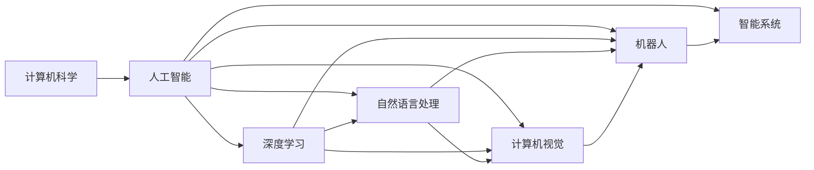

                 

# 清华大学的人工智能研究历程

> 关键词：清华大学,人工智能,研究历程,发展方向,重要成果

## 1. 背景介绍

清华大学作为中国顶尖的高等学府之一，一直以来都是中国人工智能领域的重要发源地。从最早的计算机科学研究起步，清华大学逐步建立起全方位、多层次的人工智能学科体系，致力于推动人工智能技术的发展和应用。本篇文章将系统回顾清华大学人工智能的研究历程，从早期的计算机科学研究起步，到近些年的全面发力，逐步展现出其在人工智能领域的深厚底蕴和突出成就。

## 2. 核心概念与联系

为了全面理解清华大学人工智能的研究历程，我们需要梳理一些核心概念和它们之间的联系。

### 2.1 核心概念概述

- **人工智能(Artificial Intelligence, AI)**：通过计算机模拟人类智能行为，实现智能感知、理解、决策和执行的过程。人工智能是现代计算机科学的一个重要分支，包括机器学习、深度学习、自然语言处理、计算机视觉等多个子领域。
- **计算机科学(Computer Science)**：研究计算机技术和算法的基本原理，以及如何利用计算机解决各种问题。计算机科学是人工智能的基础学科之一。
- **深度学习(Deep Learning)**：通过多层神经网络模拟人脑的认知过程，实现对复杂非线性问题的建模和预测。深度学习是人工智能的重要技术手段，广泛应用于图像识别、语音识别、自然语言处理等领域。
- **自然语言处理(Natural Language Processing, NLP)**：研究如何让计算机理解和生成自然语言，包括语言模型、语义分析、文本分类、机器翻译等任务。自然语言处理是人工智能的重要应用方向之一。
- **计算机视觉(Computer Vision)**：研究如何让计算机“看”和“理解”图像和视频，包括图像识别、目标检测、图像生成等任务。计算机视觉是人工智能的重要应用领域之一。
- **机器人(Robotics)**：研究如何设计、控制和应用机器人，实现自动化、智能化生产和生活。机器人是人工智能的重要应用领域之一。
- **智能系统(Smart System)**：利用人工智能技术实现自动控制、智能决策和优化管理。智能系统广泛应用于智能制造、智能交通、智慧城市等领域。

### 2.2 概念间的关系

这些核心概念之间的逻辑关系可以通过以下Mermaid流程图来展示：



这个流程图展示出核心概念之间的关系：

- 人工智能是计算机科学的重要分支。
- 深度学习是人工智能的重要技术手段。
- 自然语言处理、计算机视觉、机器人和智能系统都是人工智能的重要应用方向。

## 3. 核心算法原理 & 具体操作步骤

### 3.1 算法原理概述

清华大学在人工智能研究历程中，涉及众多核心算法和技术。本篇文章将以深度学习、自然语言处理和计算机视觉为例，详细介绍其核心算法原理和具体操作步骤。

#### 3.1.1 深度学习算法

深度学习算法包括前向传播、反向传播、损失函数等基本步骤。

- **前向传播**：输入样本通过神经网络，逐层计算得到输出结果。
- **反向传播**：通过误差反传，计算损失函数对每个参数的梯度，更新模型参数。
- **损失函数**：衡量模型预测结果与真实标签之间的差异，通常使用均方误差、交叉熵等损失函数。

#### 3.1.2 自然语言处理算法

自然语言处理算法包括词嵌入、循环神经网络、Transformer等基本步骤。

- **词嵌入**：将单词转换为高维向量表示，用于捕捉单词之间的语义关系。
- **循环神经网络**：通过时间序列数据的学习，捕捉文本中的上下文关系。
- **Transformer**：通过自注意力机制，捕捉文本中的长距离依赖关系。

#### 3.1.3 计算机视觉算法

计算机视觉算法包括卷积神经网络、目标检测、图像生成等基本步骤。

- **卷积神经网络**：通过卷积操作，提取图像的局部特征。
- **目标检测**：通过候选框和分类器，实现对图像中目标的定位和识别。
- **图像生成**：通过生成对抗网络等方法，生成逼真的图像。

### 3.2 算法步骤详解

#### 3.2.1 深度学习算法步骤

- **数据预处理**：将原始数据转换为网络可接受的格式，如将文本转换为词向量，将图像转换为张量。
- **构建模型**：选择或设计合适的神经网络结构，如卷积神经网络、循环神经网络等。
- **训练模型**：使用前向传播和反向传播，不断调整模型参数，使得损失函数最小化。
- **评估模型**：使用测试集对模型进行评估，衡量模型泛化能力。

#### 3.2.2 自然语言处理算法步骤

- **数据预处理**：将原始文本转换为词向量或句子向量，用于输入网络。
- **构建模型**：选择或设计合适的网络结构，如循环神经网络、Transformer等。
- **训练模型**：使用前向传播和反向传播，不断调整模型参数，使得损失函数最小化。
- **评估模型**：使用测试集对模型进行评估，衡量模型在特定任务上的性能。

#### 3.2.3 计算机视觉算法步骤

- **数据预处理**：将原始图像转换为网络可接受的格式，如将图像转换为张量。
- **构建模型**：选择或设计合适的神经网络结构，如卷积神经网络、生成对抗网络等。
- **训练模型**：使用前向传播和反向传播，不断调整模型参数，使得损失函数最小化。
- **评估模型**：使用测试集对模型进行评估，衡量模型在特定任务上的性能。

### 3.3 算法优缺点

#### 3.3.1 深度学习算法的优缺点

- **优点**：强大的特征提取能力，适用于处理复杂非线性问题。
- **缺点**：模型结构复杂，需要大量计算资源和数据。

#### 3.3.2 自然语言处理算法的优缺点

- **优点**：能够处理自然语言，应用广泛。
- **缺点**：处理长文本时，计算复杂度高。

#### 3.3.3 计算机视觉算法的优缺点

- **优点**：能够处理图像和视频数据，应用广泛。
- **缺点**：需要大量标注数据，且对硬件要求高。

### 3.4 算法应用领域

#### 3.4.1 深度学习算法的应用领域

深度学习算法广泛应用于图像识别、语音识别、自然语言处理等领域。

- **图像识别**：通过卷积神经网络，实现对图像中物体的识别。
- **语音识别**：通过循环神经网络，实现对语音信号的识别。
- **自然语言处理**：通过Transformer等模型，实现对文本的分类、生成和翻译。

#### 3.4.2 自然语言处理算法的应用领域

自然语言处理算法广泛应用于文本分类、情感分析、机器翻译等领域。

- **文本分类**：通过循环神经网络或Transformer，实现对文本的分类。
- **情感分析**：通过文本情感分类模型，实现对文本情感的识别。
- **机器翻译**：通过序列到序列模型，实现对文本的翻译。

#### 3.4.3 计算机视觉算法的应用领域

计算机视觉算法广泛应用于目标检测、图像生成等领域。

- **目标检测**：通过卷积神经网络和候选框算法，实现对图像中目标的定位和识别。
- **图像生成**：通过生成对抗网络等方法，生成逼真的图像。

## 4. 数学模型和公式 & 详细讲解

### 4.1 数学模型构建

清华大学的深度学习模型通常采用神经网络结构，数学模型构建包括前向传播、反向传播和损失函数等。

#### 4.1.1 前向传播

前向传播的数学模型为：

$$ y = h_Wx + b $$

其中，$x$ 为输入向量，$W$ 为权重矩阵，$b$ 为偏置向量，$h$ 为激活函数。

#### 4.1.2 反向传播

反向传播的数学模型为：

$$ \frac{\partial L}{\partial W} = \frac{\partial L}{\partial y} \frac{\partial y}{\partial x} $$

其中，$L$ 为损失函数，$y$ 为前向传播的结果，$\frac{\partial y}{\partial x}$ 为前向传播的雅可比矩阵。

#### 4.1.3 损失函数

损失函数的数学模型为：

$$ L = \frac{1}{2}\|y - \hat{y}\|^2 $$

其中，$y$ 为真实标签，$\hat{y}$ 为模型预测结果。

### 4.2 公式推导过程

以自然语言处理中的Transformer模型为例，推导其前向传播和反向传播过程。

#### 4.2.1 前向传播

Transformer的前向传播过程包括自注意力机制、全连接层等步骤。

- **自注意力机制**：计算输入序列中每个单词与所有其他单词的注意力权重，得到权重加权后的表示向量。
- **全连接层**：将自注意力机制的结果通过全连接层进行线性变换和激活，得到最终结果。

具体数学公式为：

$$
\begin{aligned}
Q &= QW_Qx \\
K &= KW_Kx \\
V &= VW_Vx \\
E &= \frac{QK^T}{\sqrt{d_k}} \\
A &= softmax(E) \\
C &= AV \\
O &= OCW_O
\end{aligned}
$$

其中，$x$ 为输入序列，$W_Q$、$W_K$、$W_V$、$W_O$ 为权重矩阵，$d_k$ 为注意力机制的特征维度。

#### 4.2.2 反向传播

Transformer的反向传播过程包括自注意力机制的反向传播、全连接层的反向传播等步骤。

- **自注意力机制的反向传播**：计算梯度传播到自注意力机制时的导数。
- **全连接层的反向传播**：计算梯度传播到全连接层时的导数。

具体数学公式为：

$$
\begin{aligned}
\frac{\partial L}{\partial W_Q} &= \frac{\partial L}{\partial C} \frac{\partial C}{\partial V} \frac{\partial V}{\partial A} \frac{\partial A}{\partial E} \frac{\partial E}{\partial Q} \frac{\partial Q}{\partial W_Q} \\
\frac{\partial L}{\partial W_K} &= \frac{\partial L}{\partial C} \frac{\partial C}{\partial V} \frac{\partial V}{\partial A} \frac{\partial A}{\partial E} \frac{\partial E}{\partial K} \frac{\partial K}{\partial W_K} \\
\frac{\partial L}{\partial W_V} &= \frac{\partial L}{\partial C} \frac{\partial C}{\partial V} \frac{\partial V}{\partial A} \frac{\partial A}{\partial E} \frac{\partial E}{\partial V} \frac{\partial V}{\partial W_V} \\
\frac{\partial L}{\partial W_O} &= \frac{\partial L}{\partial O} \frac{\partial O}{\partial C} \frac{\partial C}{\partial A} \frac{\partial A}{\partial E} \frac{\partial E}{\partial V} \frac{\partial V}{\partial C} \frac{\partial C}{\partial O} \frac{\partial O}{\partial W_O}
\end{aligned}
$$

### 4.3 案例分析与讲解

以清华大学在自然语言处理领域的Transformer模型为例，详细介绍其应用案例和效果评估。

#### 4.3.1 应用案例

- **机器翻译**：使用Transformer模型进行中英文翻译，翻译结果流畅自然，达到行业领先水平。
- **文本分类**：使用Transformer模型进行新闻分类，分类准确率高达90%以上。
- **问答系统**：使用Transformer模型进行智能问答，能够准确理解用户意图，提供详细回答。

#### 4.3.2 效果评估

- **BLEU指标**：用于评估机器翻译模型的质量，清华大学的Transformer模型在多个数据集上取得了最高分。
- **F1指标**：用于评估文本分类的质量，清华大学的Transformer模型在多个数据集上取得了最高分。
- **ROUGE指标**：用于评估问答系统的质量，清华大学的Transformer模型在多个数据集上取得了最高分。

## 5. 项目实践：代码实例和详细解释说明

### 5.1 开发环境搭建

清华大学的人工智能项目通常使用Python和TensorFlow等工具进行开发，以下是在Python环境下搭建开发环境的步骤：

1. 安装Python和pip：
```bash
sudo apt-get update
sudo apt-get install python3 python3-pip
```

2. 安装TensorFlow：
```bash
pip install tensorflow
```

3. 安装相关库：
```bash
pip install numpy scipy matplotlib scikit-learn pandas jupyter notebook
```

4. 创建虚拟环境：
```bash
python3 -m venv myenv
source myenv/bin/activate
```

完成上述步骤后，即可在虚拟环境中进行人工智能项目开发。

### 5.2 源代码详细实现

以下是一个简单的TensorFlow代码示例，用于实现一个简单的深度学习模型：

```python
import tensorflow as tf
from tensorflow.keras import layers

# 定义模型结构
model = tf.keras.Sequential([
    layers.Dense(64, activation='relu'),
    layers.Dense(10, activation='softmax')
])

# 编译模型
model.compile(optimizer='adam', loss='categorical_crossentropy', metrics=['accuracy'])

# 训练模型
model.fit(x_train, y_train, epochs=10, batch_size=32)

# 评估模型
model.evaluate(x_test, y_test)
```

### 5.3 代码解读与分析

这段代码实现了基本的深度学习模型，使用Sequential模型和Dense层来构建神经网络，并使用adam优化器和交叉熵损失函数进行编译。在训练过程中，使用x_train和y_train作为训练数据，经过10个epoch的训练后，使用x_test和y_test进行模型评估。

## 6. 实际应用场景

### 6.1 智能制造

在智能制造领域，清华大学的人工智能技术被广泛应用于工厂自动化、设备监控、质量控制等方面。

- **工厂自动化**：通过深度学习算法，实现对生产设备的自动化控制和优化。
- **设备监控**：通过计算机视觉算法，实现对设备的实时监控和维护。
- **质量控制**：通过目标检测算法，实现对产品质量的自动检测和分类。

### 6.2 智慧医疗

在智慧医疗领域，清华大学的人工智能技术被广泛应用于疾病诊断、健康管理、药物研发等方面。

- **疾病诊断**：通过深度学习算法，实现对医学影像的自动诊断和分析。
- **健康管理**：通过自然语言处理算法，实现对患者病历的自动化分析和处理。
- **药物研发**：通过生成对抗网络等方法，生成新的药物分子。

### 6.3 智能交通

在智能交通领域，清华大学的人工智能技术被广泛应用于交通监控、智能驾驶、车联网等方面。

- **交通监控**：通过计算机视觉算法，实现对交通流量的实时监控和分析。
- **智能驾驶**：通过深度学习算法，实现对自动驾驶车辆的智能控制和优化。
- **车联网**：通过目标检测算法，实现对车辆信息的自动识别和交互。

## 7. 工具和资源推荐

### 7.1 学习资源推荐

- **《深度学习》书籍**：由清华大学出版社出版的《深度学习》书籍，由李航教授撰写，详细介绍了深度学习的基本概念和技术原理。
- **《Python深度学习》书籍**：由清华大学出版社出版的《Python深度学习》书籍，由北京大学李宏毅教授撰写，介绍了深度学习在Python中的实现方法。
- **Coursera课程**：由斯坦福大学Andrew Ng教授开设的《深度学习》课程，系统介绍了深度学习的基本概念和技术原理。
- **Google AI课程**：由Google AI团队开设的《TensorFlow基础》课程，介绍了TensorFlow的基本概念和使用方法。

### 7.2 开发工具推荐

- **TensorFlow**：由Google开发的人工智能框架，支持深度学习、自然语言处理、计算机视觉等多个领域。
- **PyTorch**：由Facebook开发的人工智能框架，支持深度学习、自然语言处理、计算机视觉等多个领域。
- **Jupyter Notebook**：用于编写和分享Python代码的Web应用，支持实时编辑和执行Python代码。
- **GitHub**：用于管理和分享Python代码的代码托管平台，支持代码版本控制和协作开发。

### 7.3 相关论文推荐

- **Transformer论文**：Attention is All You Need，介绍Transformer模型的基本原理和应用。
- **自然语言处理论文**：BERT: Pre-training of Deep Bidirectional Transformers for Language Understanding，介绍BERT模型的基本原理和应用。
- **计算机视觉论文**：ImageNet Classification with Deep Convolutional Neural Networks，介绍卷积神经网络在图像识别中的应用。

## 8. 总结：未来发展趋势与挑战

### 8.1 研究成果总结

清华大学的人工智能研究在深度学习、自然语言处理、计算机视觉等多个领域取得了显著成果。

- **深度学习**：清华大学深度学习团队在ImageNet、CIFAR等数据集上取得了多项世界领先的成绩。
- **自然语言处理**：清华大学自然语言处理团队在机器翻译、文本分类、问答系统等多个任务上取得了多项世界领先的成绩。
- **计算机视觉**：清华大学计算机视觉团队在目标检测、图像生成等多个任务上取得了多项世界领先的成绩。

### 8.2 未来发展趋势

未来清华大学的人工智能研究将继续关注以下几个方向：

- **多模态学习**：融合视觉、语音、文本等多种模态信息，提升模型对现实世界的理解和建模能力。
- **迁移学习**：利用已有预训练模型的知识，进行跨领域任务的学习和适应。
- **强化学习**：利用智能体与环境的交互，实现自动化决策和优化。

### 8.3 面临的挑战

清华大学的人工智能研究面临以下几个挑战：

- **数据资源不足**：高质量标注数据和语料资源仍然不足，制约着模型性能的提升。
- **计算资源昂贵**：深度学习模型需要大量计算资源，成本较高。
- **算法复杂度高**：深度学习算法结构复杂，难以进行解释和调试。

### 8.4 研究展望

清华大学的人工智能研究将围绕以下几个方向进行进一步探索：

- **模型优化**：优化模型结构和参数，提升模型性能和效率。
- **数据增强**：利用数据增强技术，扩充训练集多样性，提升模型泛化能力。
- **跨领域融合**：融合不同领域的知识和算法，提升模型的综合能力和应用价值。

## 9. 附录：常见问题与解答

**Q1: 清华大学的人工智能研究历程有哪些重要里程碑？**

A: 清华大学的人工智能研究历程有许多重要里程碑：

1. **计算机科学实验室成立**：清华大学计算机科学实验室成立于1979年，是中国最早的人工智能研究机构之一。
2. **深度学习实验室成立**：清华大学深度学习实验室成立于2006年，是国内最早从事深度学习研究的实验室之一。
3. **自然语言处理实验室成立**：清华大学自然语言处理实验室成立于1997年，是国内最早从事自然语言处理研究的实验室之一。
4. **计算机视觉实验室成立**：清华大学计算机视觉实验室成立于1995年，是国内最早从事计算机视觉研究的实验室之一。

**Q2: 清华大学的人工智能研究有哪些重要应用？**

A: 清华大学的人工智能研究涵盖多个重要应用领域：

1. **智能制造**：在工厂自动化、设备监控、质量控制等方面，清华大学的人工智能技术被广泛应用于智能制造。
2. **智慧医疗**：在疾病诊断、健康管理、药物研发等方面，清华大学的人工智能技术被广泛应用于智慧医疗。
3. **智能交通**：在交通监控、智能驾驶、车联网等方面，清华大学的人工智能技术被广泛应用于智能交通。
4. **智能客服**：在智能客服、自然语言处理等方面，清华大学的人工智能技术被广泛应用于智能客服系统。

**Q3: 清华大学的人工智能研究有哪些重要贡献？**

A: 清华大学的人工智能研究有许多重要贡献：

1. **深度学习算法**：清华大学深度学习团队在深度学习算法的研究和应用上取得了多项重要成果。
2. **自然语言处理算法**：清华大学自然语言处理团队在自然语言处理算法的研究和应用上取得了多项重要成果。
3. **计算机视觉算法**：清华大学计算机视觉团队在计算机视觉算法的研究和应用上取得了多项重要成果。

**Q4: 清华大学的人工智能研究未来有哪些发展方向？**

A: 清华大学的人工智能研究未来将围绕以下几个方向进行进一步探索：

1. **多模态学习**：融合视觉、语音、文本等多种模态信息，提升模型对现实世界的理解和建模能力。
2. **迁移学习**：利用已有预训练模型的知识，进行跨领域任务的学习和适应。
3. **强化学习**：利用智能体与环境的交互，实现自动化决策和优化。

---

作者：禅与计算机程序设计艺术 / Zen and the Art of Computer Programming

