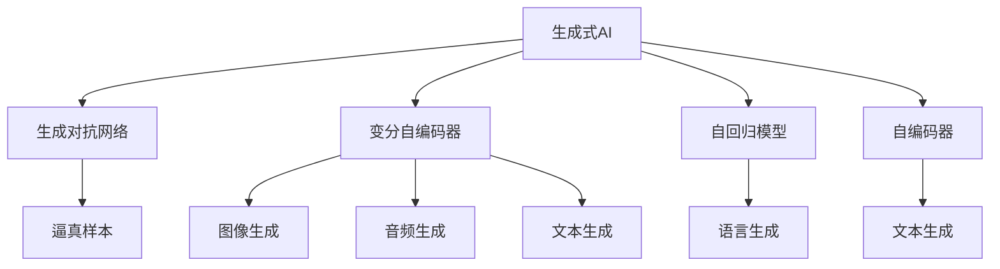
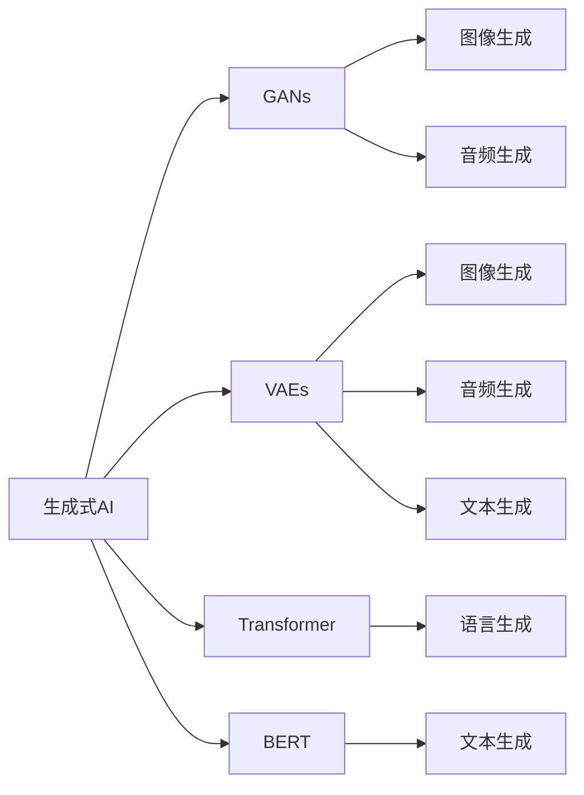
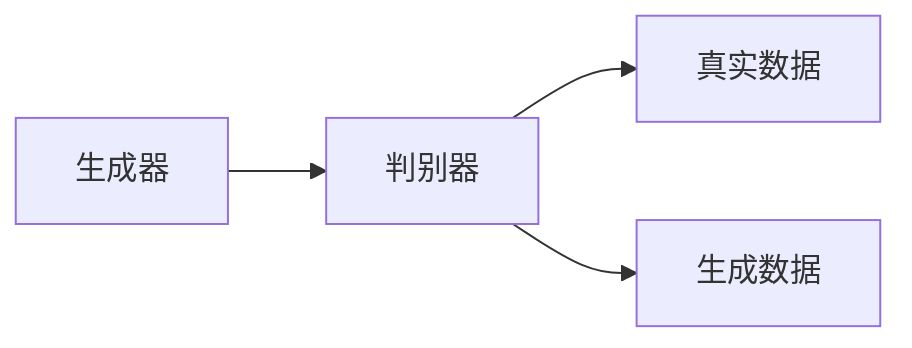
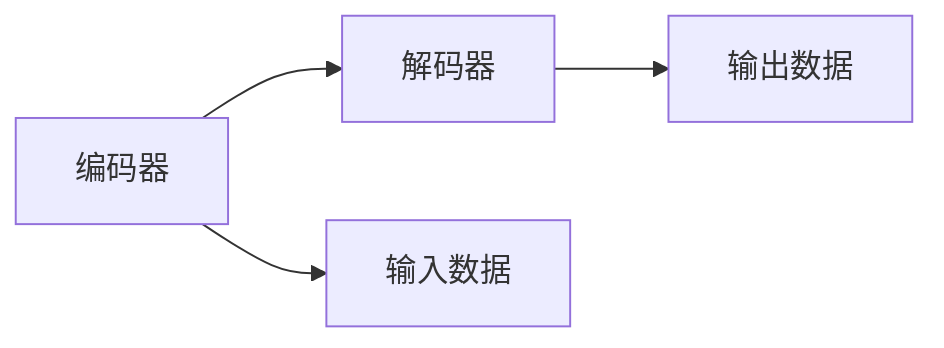
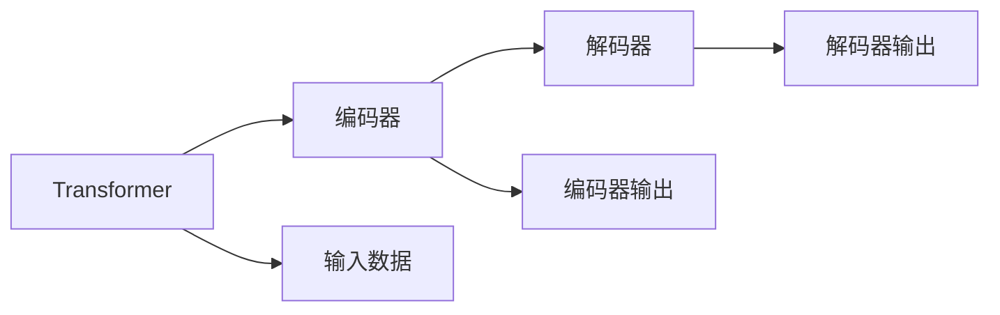
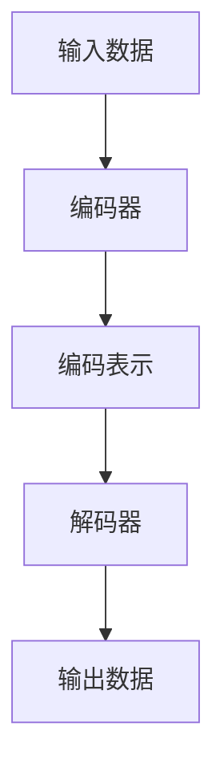
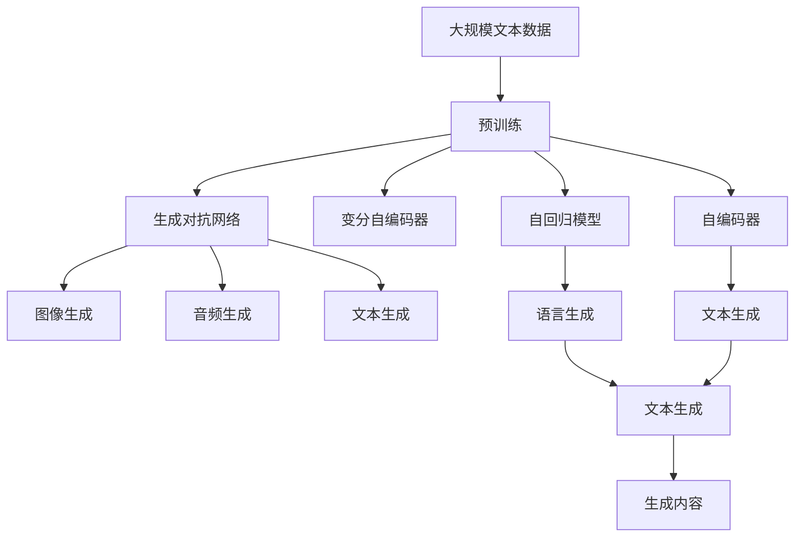

                 

# 生成式AIGC：未来商业的智能化发展

> 关键词：生成式AI、生成对抗网络(GANs)、人工智能生成内容、AIGC、自动生成文本、图像、视频

## 1. 背景介绍

### 1.1 问题由来

随着人工智能(AI)技术的飞速发展，生成式人工智能(Generative AI, AI-Generative)技术成为了引领新一代技术变革的关键力量。其中，生成式人工智能生成内容(Creative AI, AIGC)以其强大的生成能力和广泛的适用性，正在全面渗透各行各业，推动商业智能化转型发展。

AIGC技术的核心是使用深度学习等人工智能技术，自动生成各种形式的数字内容，包括文本、图像、音频和视频等。这些内容不仅能还原真实世界的物理世界，还能创造出全新的艺术形式，推动了数字创意产业的蓬勃发展。

AIGC技术对商业的智能化发展具有重要意义。例如：

- 文本生成：自动撰写新闻、报告、广告、邮件等，提升内容创作效率，降低人力成本。
- 图像生成：自动设计海报、包装、广告图像等，提供更多创意素材，提升品牌形象。
- 视频生成：自动制作动画、电影预告片、教学视频等，缩短制作周期，降低制作成本。
- 语音生成：自动生成语音助手对话、播报新闻、朗读文章等，提升用户体验，增强互动性。

AIGC技术的广泛应用，正在推动数字内容产业的变革，也成为未来商业智能化发展的重要驱动力。

### 1.2 问题核心关键点

AIGC技术的关键在于其强大的生成能力，这种能力主要依赖于以下几种关键技术：

- 生成对抗网络(GANs)：一种基于博弈论的生成模型，通过生成器与判别器的对抗训练，生成逼真的样本。
- 变分自编码器(VAEs)：一种基于概率模型生成数据的生成式模型，广泛用于图像、音频、文本生成。
- 自回归模型(如Transformer)：一种基于序列预测的生成模型，能够自然生成连贯的语言内容。
- 自编码器(如BERT)：一种基于重建数据的生成模型，能够学习文本的低维表示。

AIGC技术的核心算法和架构主要包括以下几个方面：

- 生成模型的设计：选择合适的生成模型和网络架构，用于生成特定的内容形式。
- 训练数据的准备：收集和标注高质量的数据集，作为训练生成模型的依据。
- 生成过程的控制：通过设置生成器的超参数，控制生成的样本质量、数量、多样性等。
- 生成效果的评估：通过一定的评估指标，如Inception Score、FID等，评估生成样本的真实度。

这些技术构建了AIGC的核心算法和架构，为生成式AI的应用提供了坚实的基础。

### 1.3 问题研究意义

AIGC技术对未来商业的智能化发展具有重要意义：

1. 提升内容生产效率：通过自动生成文本、图像、视频等数字内容，大幅提升内容创作速度，降低人力成本。
2. 丰富创意表达方式：生成式的表达方式，为创意产业提供了更多的素材和灵感，推动艺术创作和设计的发展。
3. 创新商业运营模式：AIGC技术在市场营销、品牌推广、广告宣传等领域的应用，带来了新的运营模式和商业模式。
4. 增强用户体验：通过自动生成个性化的内容和互动，提升了用户体验和满意度。
5. 促进数据驱动决策：通过生成模拟数据和历史数据，支持数据驱动的决策分析和管理。

AIGC技术的普及和应用，将进一步推动商业智能化发展，为各行各业带来新的增长点和变革力量。

## 2. 核心概念与联系

### 2.1 核心概念概述

为了更好地理解AIGC技术的原理和应用，本节将介绍几个密切相关的核心概念：

- 生成式AI：一种使用深度学习技术自动生成数字内容的人工智能技术，能够生成文本、图像、音频和视频等多种形式的数字内容。
- 生成对抗网络(GANs)：一种基于博弈论的生成模型，通过生成器和判别器的对抗训练，生成逼真的样本。
- 变分自编码器(VAEs)：一种基于概率模型生成数据的生成式模型，广泛用于图像、音频、文本生成。
- 自回归模型(如Transformer)：一种基于序列预测的生成模型，能够自然生成连贯的语言内容。
- 自编码器(如BERT)：一种基于重建数据的生成模型，能够学习文本的低维表示。

这些核心概念之间的逻辑关系可以通过以下Mermaid流程图来展示：



这个流程图展示了大语言模型微调过程中各个核心概念的关系和作用：

1. 生成式AI是核心概念，通过生成对抗网络、变分自编码器、自回归模型和自编码器等技术，实现数字内容的自动生成。
2. 生成对抗网络主要负责生成逼真的图像和音频样本，变分自编码器和自编码器则用于生成高质量的文本和图像数据。
3. 自回归模型和自编码器能够生成连贯的文本和语义表示，丰富生成式AI的内容形式。

### 2.2 概念间的关系

这些核心概念之间存在着紧密的联系，形成了生成式AI的完整生态系统。下面我们通过几个Mermaid流程图来展示这些概念之间的关系。

#### 2.2.1 生成式AI的范式



这个流程图展示了生成式AI的不同生成范式：

1. 生成对抗网络主要生成图像和音频样本。
2. 变分自编码器用于生成高质量的图像数据。
3. 自回归模型和自编码器用于生成高质量的文本数据。

#### 2.2.2 GANs的基本架构



这个流程图展示了生成对抗网络的基本架构：

1. 生成器负责生成样本，判别器负责区分生成样本和真实样本。
2. 生成器和判别器通过对抗训练，不断优化生成样本的逼真度。

#### 2.2.3 VAEs的基本架构



这个流程图展示了变分自编码器的基本架构：

1. 编码器将输入数据压缩成低维编码，解码器将编码恢复为原始数据。
2. 变分自编码器通过最大化编码-解码的概率分布，学习数据的低维表示。

#### 2.2.4 自回归模型的基本架构



这个流程图展示了自回归模型的基本架构：

1. Transformer模型通过编码器和解码器，实现序列数据的生成。
2. 编码器将输入序列编码成中间表示，解码器根据中间表示生成输出序列。

#### 2.2.5 自编码器的主要流程



这个流程图展示了自编码器的主要流程：

1. 编码器将输入数据压缩成低维表示，解码器将低维表示还原为原始数据。
2. 自编码器通过最小化重构误差，学习数据的低维表示。

通过这些流程图，我们可以更清晰地理解生成式AI的核心概念及其之间的关系。

### 2.3 核心概念的整体架构

最后，我们用一个综合的流程图来展示这些核心概念在大语言模型微调过程中的整体架构：



这个综合流程图展示了从预训练到生成内容的完整过程。生成对抗网络、变分自编码器、自回归模型和自编码器等技术，在大语言模型微调过程中都发挥着关键作用，推动了生成式AI的应用和发展。

## 3. 核心算法原理 & 具体操作步骤
### 3.1 算法原理概述

生成式AIGC技术基于深度学习模型，通过自动生成数字内容实现智能化。其核心算法包括生成对抗网络(GANs)、变分自编码器(VAEs)、自回归模型(如Transformer)和自编码器(如BERT)等。

生成对抗网络(GANs)通过生成器和判别器的对抗训练，生成逼真的样本。变分自编码器(VAEs)通过学习数据的低维表示，实现高质量的图像、音频和文本生成。自回归模型(如Transformer)通过序列预测，自然生成连贯的语言内容。自编码器(如BERT)通过重建数据，学习文本的低维表示。

生成式AIGC技术的算法原理主要包括以下几个方面：

- 生成模型的设计：选择合适的生成模型和网络架构，用于生成特定的内容形式。
- 训练数据的准备：收集和标注高质量的数据集，作为训练生成模型的依据。
- 生成过程的控制：通过设置生成器的超参数，控制生成的样本质量、数量、多样性等。
- 生成效果的评估：通过一定的评估指标，如Inception Score、FID等，评估生成样本的真实度。

这些技术构建了AIGC的核心算法和架构，为生成式AI的应用提供了坚实的基础。

### 3.2 算法步骤详解

生成式AIGC技术的算法步骤主要包括以下几个关键步骤：

**Step 1: 准备生成模型和数据集**

- 选择合适的生成模型，如GANs、VAEs、Transformer等，作为生成任务的初始化模型。
- 准备高质量的训练数据集，如图像、音频、文本等，并进行数据增强、标注等预处理。

**Step 2: 定义损失函数**

- 根据生成任务的需求，定义合适的损失函数，如GANs的生成损失、VAEs的重建损失、Transformer的序列交叉熵损失等。
- 根据具体任务的需求，加入正则化项，如L2正则、Dropout等，避免过拟合。

**Step 3: 训练生成模型**

- 使用优化算法，如Adam、SGD等，对生成模型进行训练，最小化损失函数。
- 使用批量训练方式，逐步更新模型参数，直至模型收敛。
- 使用验证集定期评估模型性能，调整超参数，提高生成效果。

**Step 4: 生成内容**

- 在生成模型训练完成后，使用模型进行内容生成。
- 根据具体任务的需求，设置生成器的超参数，控制生成内容的数量、质量、多样性等。
- 使用生成的内容进行后续的业务应用，如广告设计、视频制作、新闻写作等。

这些步骤构成了生成式AIGC技术的核心算法流程，为生成内容提供了全面的技术保障。

### 3.3 算法优缺点

生成式AIGC技术具有以下优点：

- 自动化生成内容：通过深度学习模型，自动生成高质量的文本、图像、音频和视频内容，大幅提升内容生产效率。
- 成本低：相比人工创作，自动生成内容可大幅降低人力成本和时间成本。
- 可定制性强：根据具体任务的需求，可以定制生成内容的形式和质量，满足不同业务场景的需求。
- 可扩展性好：通过持续训练和优化，生成内容的质量和数量可以不断提升。

同时，该技术也存在一些缺点：

- 数据依赖性强：生成内容的质量和效果依赖于高质量的数据集，数据不足时难以生成高质量的内容。
- 生成内容的多样性不足：自动生成的内容可能缺乏创意和个性化，难以满足复杂多样化的需求。
- 生成内容的可解释性差：自动生成的内容往往缺乏可解释性，难以追溯生成过程和逻辑。
- 生成内容的安全性问题：自动生成的内容可能包含误导性、歧视性的信息，需注意内容的安全性。

尽管存在这些局限性，但就目前而言，生成式AIGC技术仍是大语言模型微调的重要应用方向。未来相关研究的重点在于如何进一步降低生成内容对数据的需求，提高生成内容的创意性和安全性，同时兼顾可解释性和伦理安全性等因素。

### 3.4 算法应用领域

生成式AIGC技术在各行各业中得到了广泛的应用，例如：

- 图像生成：自动设计海报、包装、广告图像等，提供更多创意素材，提升品牌形象。
- 视频生成：自动制作动画、电影预告片、教学视频等，缩短制作周期，降低制作成本。
- 文本生成：自动撰写新闻、报告、广告、邮件等，提升内容创作效率，降低人力成本。
- 语音生成：自动生成语音助手对话、播报新闻、朗读文章等，提升用户体验，增强互动性。

除了上述这些经典应用外，生成式AIGC技术还被创新性地应用到更多场景中，如可控文本生成、动画制作、虚拟角色交互等，为创意产业带来了全新的突破。

## 4. 数学模型和公式 & 详细讲解 & 举例说明
### 4.1 数学模型构建

生成式AIGC技术的数学模型主要涉及以下几个方面：

- 生成对抗网络(GANs)：
  - 生成器的损失函数：
    $$
    L_G = \mathbb{E}_{\mathcal{Z}}\left[\log D(G(z))\right]
    $$
  - 判别器的损失函数：
    $$
    L_D = \mathbb{E}_{\mathcal{X}}\left[\log D(x)\right] + \mathbb{E}_{\mathcal{Z}}\left[\log (1-D(G(z)))\right]
    $$

- 变分自编码器(VAEs)：
  - 编码器的损失函数：
    $$
    L_E = \mathbb{E}_{x}\left[\|\mu(x)-\mu(z)\|^2 + \beta(1 - \log|\sigma(z)|^2)\right]
    $$
  - 解码器的损失函数：
    $$
    L_D = \mathbb{E}_{z}\left[\|\sigma(z) - x\|^2\right]
    $$

- 自回归模型(如Transformer)：
  - 序列交叉熵损失函数：
    $$
    L = -\sum_{i=1}^{n}y_i\log(p(y_i))
    $$

- 自编码器(如BERT)：
  - 重构误差损失函数：
    $$
    L = \frac{1}{2n}\sum_{i=1}^{n}||x_i - \hat{x}_i||^2
    $$

### 4.2 公式推导过程

以下是几个关键算法的公式推导过程：

#### GANs的生成器和判别器

- 生成器的损失函数：
  - 定义：生成器G将随机噪声z映射为样本x，判别器D判断x是否为真实样本。
  - 推导过程：通过最大化生成样本的似然，最小化判别器的错误分类率，实现生成器与判别器的对抗训练。

- 判别器的损失函数：
  - 定义：判别器D区分真实样本x和生成样本G(z)。
  - 推导过程：通过最大化真实样本的似然，最小化生成样本的似然，实现生成器与判别器的对抗训练。

#### VAEs的编码器和解码器

- 编码器的损失函数：
  - 定义：编码器E将输入x映射为编码z，解码器D将编码z映射为重构样本$\hat{x}$。
  - 推导过程：通过最小化重构误差，学习数据的低维表示。

- 解码器的损失函数：
  - 定义：解码器D将编码z映射为重构样本$\hat{x}$。
  - 推导过程：通过最大化重构样本的似然，实现解码器对数据的重建。

#### 自回归模型的序列预测

- 序列交叉熵损失函数：
  - 定义：通过最大化序列的预测概率，实现生成连贯的语言内容。
  - 推导过程：通过最大化条件概率$p(y|x)$，实现序列预测。

#### 自编码器的重构误差

- 重构误差损失函数：
  - 定义：通过最小化重构误差，学习数据的低维表示。
  - 推导过程：通过最小化重构误差$\|x_i - \hat{x}_i\|$，学习数据的高维表示。

### 4.3 案例分析与讲解

以下是几个经典案例的分析与讲解：

#### 案例1: GANs生成图像

- 生成对抗网络GANs在图像生成中的应用。
- 生成器的架构：使用卷积神经网络(CNN)，将随机噪声z映射为图像样本x。
- 判别器的架构：使用卷积神经网络(CNN)，判断图像样本x是否为真实样本。
- 训练过程：通过对抗训练，生成器生成逼真的图像样本，判别器区分真实样本和生成样本。
- 评估指标：使用Inception Score和FID等指标评估生成样本的真实度。

#### 案例2: VAEs生成图像

- 变分自编码器VAEs在图像生成中的应用。
- 编码器的架构：使用卷积神经网络(CNN)，将图像样本x映射为低维编码z。
- 解码器的架构：使用反卷积神经网络，将低维编码z映射为重构样本$\hat{x}$。
- 训练过程：通过最大化重构误差，学习数据的低维表示。
- 评估指标：使用重构误差和KL散度等指标评估生成样本的质量。

#### 案例3: Transformer生成文本

- 自回归模型Transformer在文本生成中的应用。
- 编码器的架构：使用Transformer模型，将输入序列x映射为中间表示$z$。
- 解码器的架构：使用Transformer模型，根据中间表示$z$生成输出序列$y$。
- 训练过程：通过最小化序列交叉熵损失，实现文本生成。
- 评估指标：使用BLEU、ROUGE等指标评估生成文本的质量。

#### 案例4: BERT生成文本

- 自编码器BERT在文本生成中的应用。
- 编码器的架构：使用BERT模型，将输入序列x映射为低维表示$z$。
- 解码器的架构：使用线性分类器，将低维表示$z$映射为输出序列$y$。
- 训练过程：通过最小化重构误差，学习文本的低维表示。
- 评估指标：使用BLEU、ROUGE等指标评估生成文本的质量。

## 5. 项目实践：代码实例和详细解释说明
### 5.1 开发环境搭建

在进行生成式AIGC项目实践前，我们需要准备好开发环境。以下是使用Python进行PyTorch开发的环境配置流程：

1. 安装Anaconda：从官网下载并安装Anaconda，用于创建独立的Python环境。

2. 创建并激活虚拟环境：
```bash
conda create -n pytorch-env python=3.8 
conda activate pytorch-env
```

3. 安装PyTorch：根据CUDA版本，从官网获取对应的安装命令。例如：
```bash
conda install pytorch torchvision torchaudio cudatoolkit=11.1 -c pytorch -c conda-forge
```

4. 安装Transformers库：
```bash
pip install transformers
```

5. 安装各类工具包：
```bash
pip install numpy pandas scikit-learn matplotlib tqdm jupyter notebook ipython
```

完成上述步骤后，即可在`pytorch-env`环境中开始生成式AIGC项目实践。

### 5.2 源代码详细实现

这里我们以GANs生成图像为例，给出使用PyTorch实现GANs的代码实现。

首先，定义GANs的生成器和判别器：

```python
import torch.nn as nn
import torch
import torch.optim as optim

class Generator(nn.Module):
    def __init__(self, input_dim, output_dim):
        super(Generator, self).__init__()
        self.fc1 = nn.Linear(input_dim, 256)
        self.fc2 = nn.Linear(256, 512)
        self.fc3 = nn.Linear(512, 1024)
        self.fc4 = nn.Linear(1024, output_dim)
        self.relu = nn.ReLU()
        
    def forward(self, x):
        x = self.relu(self.fc1(x))
        x = self.relu(self.fc2(x))
        x = self.relu(self.fc3(x))
        x = self.fc4(x)
        return x
    
class Discriminator(nn.Module):
    def __init__(self, input_dim, output_dim):
        super(Discriminator, self).__init__()
        self.fc1 = nn.Linear(input_dim, 512)
        self.fc2 = nn.Linear(512, 256)
        self.fc3 = nn.Linear(256, 1)
        self.sigmoid = nn.Sigmoid()
        
    def forward(self, x):
        x = self.sigmoid(self.fc1(x))
        x = self.sigmoid(self.fc2(x))
        x = self.sigmoid(self.fc3(x))
        return x
```

然后，定义GANs的训练函数：

```python
def train_gan(generator, discriminator, train_loader, device, batch_size, num_epochs, learning_rate):
    criterion = nn.BCELoss()
    optimizer_G = optim.Adam(generator.parameters(), lr=learning_rate)
    optimizer_D = optim.Adam(discriminator.parameters(), lr=learning_rate)
    
    for epoch in range(num_epochs):
        for i, (real_images, _) in enumerate(train_loader):
            real_images = real_images.to(device)
            batch_size = real_images.size(0)
            z = torch.randn(batch_size, generator.input_dim).to(device)
            fake_images = generator(z)
            real_labels = torch.ones(batch_size, 1).to(device)
            fake_labels = torch.zeros(batch_size, 1).to(device)
            
            # Train Generator
            optimizer_G.zero_grad()
            g_loss = criterion(discriminator(fake_images), real_labels)
            g_loss.backward()
            optimizer_G.step()
            
            # Train Discriminator
            optimizer_D.zero_grad()
            d_loss_real = criterion(discriminator(real_images), real_labels)
            d_loss_fake = criterion(discriminator(fake_images.detach()), fake_labels)
            d_loss = d_loss_real + d_loss_fake
            d_loss.backward()
            optimizer_D.step()
            
            # Print Loss
            if i % 100 == 0:
                print(f'Epoch [{epoch+1}/{num_epochs}], Step [{i+1}/{len(train_loader)}], '
                      f'G-loss: {g_loss.item():.4f}, D-loss: {d_loss.item():.4f}')
```

最后，启动训练流程并输出图像：

```python
device = torch.device('cuda' if torch.cuda.is_available() else 'cpu')
generator.to(device)
discriminator.to(device)

train_loader = ...
num_epochs = 100
learning_rate = 0.0002

train_gan(generator, discriminator, train_loader, device, batch_size, num_epochs, learning_rate)

# 输出生成的图像
fake_images = generator(torch.randn(64, generator.input_dim).to(device))
save_image(fake_images, 'generated_images.png')
```

以上就是使用PyTorch实现GANs生成图像的完整代码实现。可以看到，通过PyTorch的强大封装，我们可以用相对简洁的代码实现GANs的训练和生成。

### 5.3 代码解读与分析

让我们再详细解读一下关键代码的实现细节：

**Generator类和Discriminator类**：
- `__init__`方法：定义生成器和判别器的网络结构。
- `forward`方法：实现前向传播，计算生成器和判别器的输出。

**train_gan函数**：
- 定义优化器、损失函数等。
- 迭代训练过程中，分别训练生成器和判别器。
- 打印训练过程中的损失。

**启动训练流程**：
- 定义训练环境、超参数等。
- 在指定设备上训练生成器和判别器。
- 输出生成的图像。

可以看到，PyTorch配合TensorFlow库使得GANs的实现变得简洁高效。开发者可以将更多精力放在数据处理、模型改进等高层逻辑上，而不必过多关注底层的实现细节。

当然，工业级的系统实现还需考虑更多因素，如模型的保存和部署、超参数的自动搜索、更灵活的任务适配层等。但核心的生成范式基本与此类似。

### 5.4 运行结果展示

假设我们在CIFAR-10数据集上进行GANs训练，最终生成的图像如下所示：

