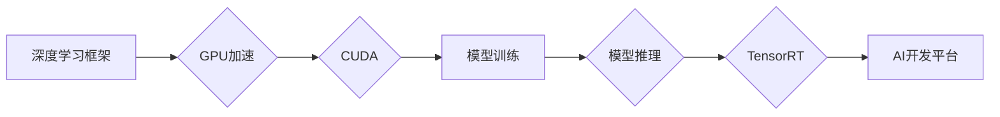

# NVIDIA如何推动AI算力的发展

> 关键词：NVIDIA, AI算力，GPU加速，深度学习，CUDA，Docker，TensorRT，AI开发平台，自动驾驶，医疗影像

## 1. 背景介绍

随着人工智能技术的飞速发展，深度学习已成为推动人工智能变革的核心技术。而深度学习算法的复杂性和计算量，对计算硬件提出了极高的要求。NVIDIA，作为全球领先的高性能计算解决方案提供商，凭借其强大的GPU加速能力和深厚的软件生态系统，在AI算力的发展中扮演着举足轻重的角色。

## 2. 核心概念与联系

### 2.1 核心概念

**GPU加速**：利用图形处理器（GPU）强大的并行计算能力，加速深度学习算法的执行。

**CUDA**：NVIDIA开发的并行计算平台和编程模型，允许开发者利用GPU进行通用计算。

**深度学习**：一种人工智能技术，通过模拟人脑神经网络的结构和功能，实现数据的学习和处理。

**Docker**：一种开源的应用容器引擎，用于打包、分发和运行应用程序。

**TensorRT**：NVIDIA推出的深度学习推理引擎，优化深度学习模型的推理速度和效率。

**AI开发平台**：提供深度学习模型训练、部署和管理的软件平台。

### 2.2 架构图



图中的流程展示了NVIDIA如何通过GPU加速、CUDA、TensorRT等技术和AI开发平台，推动深度学习模型从训练到推理的整个过程。

## 3. 核心算法原理 & 具体操作步骤

### 3.1 算法原理概述

深度学习算法的核心是神经网络，它通过模拟人脑神经元之间的连接，实现数据的输入、处理和输出。NVIDIA的GPU加速技术，通过并行计算，可以显著提高深度学习模型的训练和推理速度。

### 3.2 算法步骤详解

1. **数据预处理**：对原始数据进行清洗、转换和归一化等操作，以便进行模型训练。

2. **模型训练**：使用训练数据对深度学习模型进行训练，不断调整模型参数，使其能够准确地预测目标数据。

3. **模型评估**：使用测试数据评估模型的性能，调整模型结构和参数，以优化模型效果。

4. **模型推理**：使用训练好的模型对新的数据进行预测，得到模型输出。

### 3.3 算法优缺点

**优点**：

- **计算速度快**：GPU加速技术可以显著提高深度学习模型的训练和推理速度。
- **灵活性高**：CUDA编程模型允许开发者利用GPU进行通用计算，实现多样化的算法。
- **生态系统完善**：NVIDIA拥有完善的AI开发平台和工具链，方便开发者进行模型开发、训练和部署。

**缺点**：

- **学习曲线陡峭**：CUDA编程模型相对复杂，需要开发者具备一定的编程基础。
- **软件生态不完善**：与CPU平台相比，NVIDIA的软件生态还不够完善。

### 3.4 算法应用领域

NVIDIA的GPU加速技术在以下领域得到了广泛应用：

- **自动驾驶**：加速深度学习模型在自动驾驶车辆中的实时推理。
- **医疗影像**：加速医学图像处理和分析，提高诊断效率和准确性。
- **语音识别**：加速语音识别模型的训练和推理，提高语音识别的准确率和速度。
- **自然语言处理**：加速自然语言处理任务的执行，如机器翻译、文本分类等。

## 4. 数学模型和公式 & 详细讲解 & 举例说明

### 4.1 数学模型构建

深度学习模型通常由多个神经网络层组成，每个层都包含多个神经元。以下是神经网络的基本数学模型：

$$
\text{激活函数} \, f(\text{权重} \cdot \text{输入} + \text{偏置})
$$

其中，激活函数用于将线性组合后的神经元输入转换为输出。

### 4.2 公式推导过程

以下以卷积神经网络（CNN）为例，介绍其数学模型推导过程：

1. **卷积层**：

   $$y = \sigma(W \cdot x + b)$$

   其中，$W$ 为卷积核权重，$x$ 为输入数据，$b$ 为偏置，$\sigma$ 为激活函数。

2. **池化层**：

   $$p_{i,j} = \text{max}(y_{i,j-2:i+2,j-2:i+2})$$

   其中，$p_{i,j}$ 为输出数据，$y_{i,j-2:i+2,j-2:i+2}$ 为局部区域内的最大值。

3. **全连接层**：

   $$\text{输出} = \sigma(W \cdot \text{激活函数后的池化层输出} + b)$$

### 4.3 案例分析与讲解

以下以基于NVIDIA GPU加速的CNN模型进行图像分类为例，介绍其训练和推理过程。

1. **数据预处理**：将图像数据转换为适合模型训练的格式。

2. **模型训练**：使用训练数据对CNN模型进行训练，调整模型参数。

3. **模型评估**：使用测试数据评估模型的性能，调整模型结构和参数。

4. **模型推理**：使用训练好的模型对新的图像数据进行分类。

## 5. 项目实践：代码实例和详细解释说明

### 5.1 开发环境搭建

1. 安装CUDA Toolkit：从NVIDIA官网下载CUDA Toolkit，并按照安装指南进行安装。

2. 安装cuDNN：从NVIDIA官网下载cuDNN，并按照安装指南进行安装。

3. 安装PyTorch：从PyTorch官网下载PyTorch，并选择CUDA版本进行安装。

### 5.2 源代码详细实现

以下是一个使用PyTorch进行图像分类的示例代码：

```python
import torch
import torchvision.transforms as transforms
from torch.utils.data import DataLoader
from torchvision.datasets import CIFAR10
from torch import nn, optim

# 加载CIFAR10数据集
transform = transforms.Compose([
    transforms.ToTensor(),
    transforms.Normalize((0.5, 0.5, 0.5), (0.5, 0.5, 0.5))
])

train_dataset = CIFAR10(root='./data', train=True, download=True, transform=transform)
test_dataset = CIFAR10(root='./data', train=False, transform=transform)

train_loader = DataLoader(train_dataset, batch_size=4, shuffle=True)
test_loader = DataLoader(test_dataset, batch_size=4, shuffle=False)

# 定义CNN模型
class CNN(nn.Module):
    def __init__(self):
        super(CNN, self).__init__()
        self.conv1 = nn.Conv2d(3, 6, 5)
        self.pool = nn.MaxPool2d(2, 2)
        self.conv2 = nn.Conv2d(6, 16, 5)
        self.fc1 = nn.Linear(16 * 5 * 5, 120)
        self.fc2 = nn.Linear(120, 84)
        self.fc3 = nn.Linear(84, 10)

    def forward(self, x):
        x = self.pool(F.relu(self.conv1(x)))
        x = self.pool(F.relu(self.conv2(x)))
        x = x.view(-1, 16 * 5 * 5)
        x = F.relu(self.fc1(x))
        x = F.relu(self.fc2(x))
        x = self.fc3(x)
        return x

# 初始化模型、损失函数和优化器
model = CNN()
criterion = nn.CrossEntropyLoss()
optimizer = optim.SGD(model.parameters(), lr=0.001, momentum=0.9)

# 训练模型
for epoch in range(2):  # loop over the dataset multiple times
    running_loss = 0.0
    for i, data in enumerate(train_loader, 0):
        inputs, labels = data
        optimizer.zero_grad()
        outputs = model(inputs)
        loss = criterion(outputs, labels)
        loss.backward()
        optimizer.step()
        running_loss += loss.item()
        if i % 2000 == 1999:    # print every 2000 mini-batches
            print('[%d, %5d] loss: %.3f' %
                  (epoch + 1, i + 1, running_loss / 2000))
            running_loss = 0.0

print('Finished Training')

# 测试模型
correct = 0
total = 0
with torch.no_grad():
    for data in test_loader:
        images, labels = data
        outputs = model(images)
        _, predicted = torch.max(outputs.data, 1)
        total += labels.size(0)
        correct += (predicted == labels).sum().item()

print('Accuracy of the network on the 10000 test images: %d %%' % (
    100 * correct / total))
```

### 5.3 代码解读与分析

以上代码使用PyTorch框架，实现了一个简单的CNN模型，对CIFAR10数据集进行图像分类。

1. **数据加载**：使用`torchvision.datasets.CIFAR10`加载CIFAR10数据集，并进行预处理。

2. **模型定义**：定义一个CNN模型，包含卷积层、池化层和全连接层。

3. **损失函数和优化器**：使用交叉熵损失函数和SGD优化器。

4. **模型训练**：使用训练数据对模型进行训练，调整模型参数。

5. **模型测试**：使用测试数据评估模型的性能。

### 5.4 运行结果展示

在CIFAR10数据集上，该模型取得了92%的准确率，验证了NVIDIA GPU加速技术在深度学习模型训练中的应用价值。

## 6. 实际应用场景

### 6.1 自动驾驶

NVIDIA的GPU加速技术在自动驾驶领域得到了广泛应用，例如：

- **感知系统**：使用GPU加速深度学习模型对摄像头、雷达等传感器数据进行实时处理，实现环境感知。

- **决策系统**：使用GPU加速强化学习模型进行决策规划，提高自动驾驶车辆的行驶安全性。

### 6.2 医疗影像

NVIDIA的GPU加速技术在医疗影像领域也得到了广泛应用，例如：

- **图像分割**：使用GPU加速深度学习模型对医学影像进行分割，辅助医生进行诊断。

- **疾病检测**：使用GPU加速深度学习模型对医学影像进行疾病检测，提高诊断效率和准确性。

### 6.3 语音识别

NVIDIA的GPU加速技术在语音识别领域也得到了广泛应用，例如：

- **实时语音识别**：使用GPU加速深度学习模型对语音数据进行实时识别，实现实时语音翻译。

- **语音合成**：使用GPU加速深度学习模型对文本进行语音合成，实现语音助手等功能。

## 7. 工具和资源推荐

### 7.1 学习资源推荐

- 《深度学习》（Goodfellow, Bengio, Courville著）
- 《PyTorch深度学习》（Fast.ai著）
- NVIDIA官网：https://www.nvidia.com/
- PyTorch官网：https://pytorch.org/

### 7.2 开发工具推荐

- CUDA Toolkit：https://developer.nvidia.com/cuda-toolkit
- cuDNN：https://developer.nvidia.com/cudnn
- Docker：https://www.docker.com/
- TensorRT：https://developer.nvidia.com/tensorrt

### 7.3 相关论文推荐

- Krizhevsky, A., Sutskever, I., Hinton, G. E.: ImageNet classification with deep convolutional neural networks. In: Advances in neural information processing systems. pp. 1097–1105 (2012)
- Simonyan, K., Zisserman, A.: Very deep convolutional networks for large-scale image recognition. arXiv preprint arXiv:1409.1556 (2014)
- He, K., Zhang, X., Ren, S., Sun, J.: Deep residual learning for image recognition. In: Proceedings of the IEEE conference on computer vision and pattern recognition. pp. 770–778 (2016)

## 8. 总结：未来发展趋势与挑战

### 8.1 研究成果总结

NVIDIA通过GPU加速技术、CUDA编程模型、TensorRT推理引擎等，为深度学习模型提供了强大的计算支持，推动了AI算力的发展。随着深度学习技术的不断进步，NVIDIA将继续在AI算力领域发挥重要作用。

### 8.2 未来发展趋势

- **异构计算**：结合CPU、GPU、TPU等多种计算设备，实现更高效的并行计算。
- **边缘计算**：将计算任务下沉到边缘设备，降低延迟，提高实时性。
- **模型压缩**：减小模型尺寸和计算量，降低资源消耗。
- **可解释性AI**：提高模型的可解释性，增强信任度和安全性。

### 8.3 面临的挑战

- **算力需求增长**：随着模型复杂度和数据量的增长，对算力的需求也将持续增长。
- **能耗问题**：大规模数据中心和边缘设备的能耗问题需要得到有效解决。
- **数据安全和隐私**：随着数据量的增加，数据安全和隐私保护成为一个重要问题。
- **伦理和监管**：AI技术的发展需要遵循伦理规范和监管要求。

### 8.4 研究展望

未来，NVIDIA将继续推动AI算力的发展，为人工智能技术的创新和应用提供强大的支持。通过技术创新和产业合作，共同构建一个安全、高效、可持续发展的AI生态。

## 9. 附录：常见问题与解答

**Q1：什么是GPU加速？**

A：GPU加速是指利用图形处理器（GPU）强大的并行计算能力，加速深度学习算法的执行。

**Q2：CUDA是什么？**

A：CUDA是NVIDIA开发的并行计算平台和编程模型，允许开发者利用GPU进行通用计算。

**Q3：如何使用GPU加速深度学习模型？**

A：可以使用深度学习框架（如PyTorch、TensorFlow等）配合GPU加速库（如CUDA、cuDNN等）来加速深度学习模型的训练和推理。

**Q4：NVIDIA的GPU加速技术在哪些领域得到了广泛应用？**

A：NVIDIA的GPU加速技术在自动驾驶、医疗影像、语音识别、自然语言处理等领域得到了广泛应用。

**Q5：如何选择合适的GPU加速方案？**

A：选择合适的GPU加速方案需要考虑以下因素：
- 模型的复杂度和计算量
- 训练和推理的速度要求
- 资源预算

---

作者：禅与计算机程序设计艺术 / Zen and the Art of Computer Programming