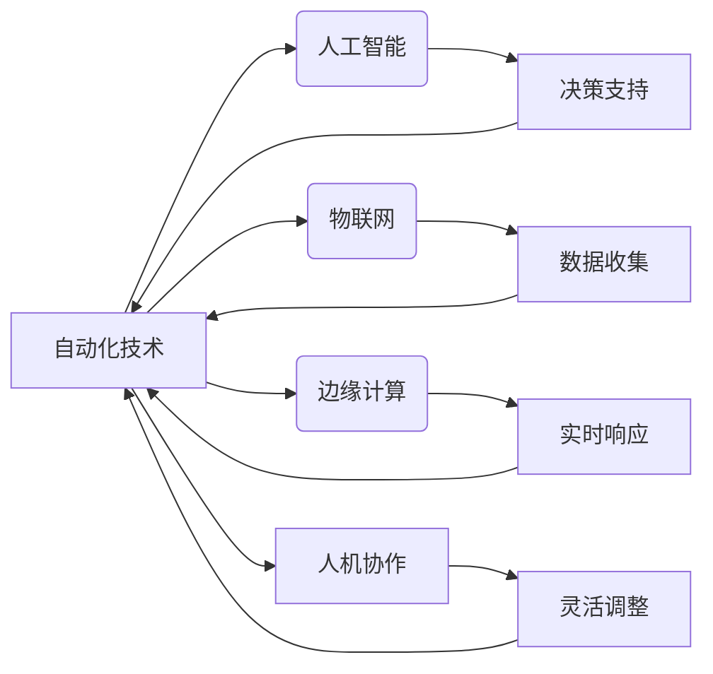

# 自动化技术的未来发展方向

> 关键词：自动化，人工智能，工业4.0，机器学习，物联网，边缘计算，人机协作，定制化

## 1. 背景介绍

随着技术的不断进步，自动化技术已经成为现代工业、服务业和日常生活中的重要组成部分。从简单的自动化生产线到复杂的智能制造系统，自动化技术正在深刻地改变着我们的生产方式和生活习惯。然而，随着人工智能、物联网、边缘计算等新兴技术的发展，自动化技术正迎来新的变革。本文将探讨自动化技术的未来发展方向，分析其核心概念、算法原理、应用场景以及面临的挑战。

## 2. 核心概念与联系

### 2.1 自动化技术概述

自动化技术是指利用机器或系统替代人工完成特定任务的过程。它包括硬件设备和软件系统的集成，旨在提高生产效率、降低成本、减少人为错误和提升安全性。

### 2.2 人工智能与自动化

人工智能（AI）是自动化技术发展的关键驱动力。AI技术可以赋予机器学习和决策能力，使得自动化系统更加智能，能够适应复杂多变的环境。

### 2.3 物联网（IoT）与自动化

物联网技术将各种设备连接到一个网络中，收集和传输数据。这为自动化系统提供了实时数据流，使得决策更加准确和快速。

### 2.4 边缘计算与自动化

边缘计算将数据处理和计算任务从云端转移到网络边缘，减少了延迟，提高了响应速度，这对于实时自动化系统至关重要。

### 2.5 人机协作与自动化

人机协作是自动化技术发展的新趋势，它结合了人类专家的直觉和机器的精确性，提高了系统的灵活性和可靠性。

### 2.6 Mermaid 流程图



## 3. 核心算法原理 & 具体操作步骤

### 3.1 算法原理概述

自动化技术的核心算法原理通常涉及以下几个方面：

- **传感器技术**：用于收集环境数据，如温度、压力、位置等。
- **控制器技术**：用于处理传感器数据，并根据预设逻辑控制执行器。
- **执行器技术**：用于执行动作，如电机驱动、气动阀控制等。
- **机器学习**：用于从数据中学习模式，优化决策过程。
- **优化算法**：用于优化生产流程和资源分配。

### 3.2 算法步骤详解

1. **数据采集**：通过传感器收集实时数据。
2. **数据处理**：对采集到的数据进行分析和预处理。
3. **决策制定**：根据数据分析和业务逻辑制定决策。
4. **执行动作**：根据决策结果执行相应的动作。
5. **反馈调整**：收集动作执行结果，并用于后续的决策优化。

### 3.3 算法优缺点

- **优点**：提高效率、减少错误、提高安全性、降低成本。
- **缺点**：初始投资成本高、维护难度大、技术更新快。

### 3.4 算法应用领域

自动化技术的应用领域非常广泛，包括：

- **制造业**：自动化生产线、机器人、无人化仓库等。
- **服务业**：智能客服、自动化餐厅、自动化支付等。
- **家庭生活**：智能家居、自动化清洁、自动化烹饪等。

## 4. 数学模型和公式 & 详细讲解 & 举例说明

### 4.1 数学模型构建

自动化系统的数学模型通常包括以下部分：

- **状态空间模型**：描述系统的当前状态和可能的状态转移。
- **输入输出模型**：描述系统输入和输出之间的关系。
- **控制策略模型**：描述控制算法如何根据系统状态调整输入。

### 4.2 公式推导过程

假设系统状态为 $x(t)$，输入为 $u(t)$，输出为 $y(t)$，则状态空间模型可以表示为：

$$
\begin{align*}
\dot{x}(t) &= f(x(t), u(t)) \\
y(t) &= g(x(t))
\end{align*}
$$

其中 $f$ 和 $g$ 是适当的函数。

### 4.3 案例分析与讲解

以工业机器人路径规划为例，我们可以使用基于图论的算法来优化机器人的路径规划。具体步骤如下：

1. **构建环境图**：将工作环境建模为图，节点代表环境中的点，边代表点之间的路径。
2. **选择起点和终点**：确定机器人的起点和终点。
3. **寻找最短路径**：使用Dijkstra算法或A*算法找到从起点到终点的最短路径。
4. **路径平滑**：对最短路径进行平滑处理，以避免碰撞。

## 5. 项目实践：代码实例和详细解释说明

### 5.1 开发环境搭建

为了实现上述案例，我们需要搭建以下开发环境：

- 操作系统：Linux或Windows
- 编程语言：Python
- 依赖库：NetworkX（用于图论），matplotlib（用于可视化）

### 5.2 源代码详细实现

以下是一个简单的Python代码示例，用于实现机器人的路径规划：

```python
import networkx as nx
import matplotlib.pyplot as plt

# 构建环境图
G = nx.grid_2d_graph(10, 10)

# 定义起点和终点
start = (0, 0)
end = (9, 9)

# 寻找最短路径
path = nx.astar_path(G, start, end)

# 绘制路径
nx.draw(G, pos=nx.spring_layout(G), with_labels=True)
plt.plot([p[0] for p in path], [p[1] for p in path], 'r')
plt.show()
```

### 5.3 代码解读与分析

以上代码首先使用`networkx`库构建了一个10x10的网格环境。然后定义了起点和终点，并使用A*算法找到从起点到终点的最短路径。最后，使用`matplotlib`库绘制了环境图和路径。

### 5.4 运行结果展示

运行以上代码将生成一个网格环境图，并突出显示从起点到终点的红色路径。

## 6. 实际应用场景

自动化技术的实际应用场景包括：

- **制造业**：自动化生产线的优化，机器人路径规划，智能仓储管理等。
- **服务业**：智能客服，自动化餐厅，无人驾驶等。
- **家庭生活**：智能家居，自动化清洁，自动化烹饪等。

## 7. 工具和资源推荐

### 7.1 学习资源推荐

- 《自动化技术基础》
- 《人工智能：一种现代的方法》
- 《物联网导论》

### 7.2 开发工具推荐

- Python编程语言
- MATLAB软件
- ROS机器人操作系统

### 7.3 相关论文推荐

- "A Scalable Path Planning Algorithm for Robots in Dynamic Environments" by Grisetti et al.
- "Deep Reinforcement Learning for Autonomous Driving" by Silver et al.
- "Internet of Things: A Survey" by Akyildiz et al.

## 8. 总结：未来发展趋势与挑战

### 8.1 研究成果总结

自动化技术正在朝着更加智能化、个性化和高效化的方向发展。人工智能、物联网、边缘计算等技术的融合，使得自动化系统更加智能和灵活。

### 8.2 未来发展趋势

- **更加智能**：自动化系统将具备更强大的学习和决策能力。
- **更加个性化**：自动化系统将根据用户需求进行定制化调整。
- **更加高效**：自动化系统将提高生产效率，降低成本。

### 8.3 面临的挑战

- **技术挑战**：如何将人工智能、物联网、边缘计算等技术有效集成。
- **经济挑战**：如何降低自动化技术的成本，提高其普及率。
- **社会挑战**：如何应对自动化技术带来的就业影响和社会问题。

### 8.4 研究展望

自动化技术未来将迎来更加广阔的发展空间。随着技术的不断进步，自动化技术将在更多领域发挥重要作用，为人类社会创造更多价值。

## 9. 附录：常见问题与解答

**Q1：自动化技术是否会取代人类工作？**

A: 自动化技术可能会取代一些重复性和危险的工作，但同时也将创造新的就业机会。关键在于如何平衡自动化技术的发展和社会就业问题。

**Q2：自动化技术如何提高生产效率？**

A: 自动化技术通过减少人为错误、提高生产速度和降低成本来提高生产效率。

**Q3：如何确保自动化系统的安全性？**

A: 通过设计安全监控系统、实施严格的安全标准和培训操作人员来确保自动化系统的安全性。

**Q4：自动化技术对环境有何影响？**

A: 自动化技术可以减少能源消耗和排放，对环境有积极影响。

**Q5：自动化技术如何与人工智能结合？**

A: 自动化技术与人工智能结合可以通过机器学习算法优化决策过程，提高系统的智能水平。

---

作者：禅与计算机程序设计艺术 / Zen and the Art of Computer Programming