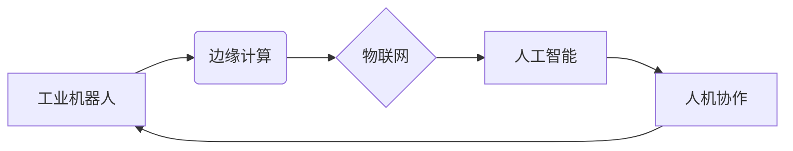

# 自动化领域的未来发展方向

> 关键词：自动化，人工智能，机器人技术，工业4.0，边缘计算，物联网，人机协作

## 1. 背景介绍

自动化技术作为工业生产和社会发展的重要推动力，经历了从机械自动化、电气自动化到现在的智能化自动化的发展过程。随着人工智能、物联网、大数据等技术的飞速发展，自动化领域正面临着前所未有的机遇和挑战。本文将探讨自动化领域的未来发展方向，分析其核心概念、算法原理、应用场景和面临的挑战。

### 1.1 自动化的演进历程

- **机械自动化**：以机械设备代替人力完成生产任务，如数控机床、自动化装配线等。
- **电气自动化**：以电子技术控制机械设备，实现生产过程的自动化控制，如PLC、工业机器人等。
- **智能化自动化**：结合计算机科学、人工智能、物联网等技术，实现设备的智能感知、决策和执行。

### 1.2 自动化面临的机遇与挑战

- **机遇**：
  - 提高生产效率，降低生产成本。
  - 提升产品质量，增强产品竞争力。
  - 改善工作环境，降低劳动强度。
  - 推动产业升级，实现智能制造。
- **挑战**：
  - 技术创新不足，核心技术受制于人。
  - 标准化程度低，系统集成困难。
  - 人才匮乏，缺乏复合型人才。

## 2. 核心概念与联系

### 2.1 自动化核心概念

- **工业机器人**：用于完成工业生产中重复性、危险性、高精度作业的机器。
- **边缘计算**：在数据产生源头进行计算，降低延迟，提高实时性。
- **物联网**：通过互联网将各种物体连接起来，实现信息交换和通信。
- **人工智能**：使计算机能够模拟人类智能行为，如学习、推理、感知等。
- **人机协作**：人与机器协同工作，发挥各自优势，提高工作效率。

### 2.2 自动化核心概念联系 Mermaid 流程图



从流程图中可以看出，工业机器人、边缘计算、物联网、人工智能和人机协作是自动化领域的核心概念，它们相互联系、相互促进，共同推动自动化技术的发展。

## 3. 核心算法原理 & 具体操作步骤

### 3.1 算法原理概述

自动化领域的核心算法主要包括：

- **机器学习**：通过数据训练模型，实现机器的智能决策。
- **深度学习**：利用神经网络等模型进行复杂模式识别和特征提取。
- **强化学习**：通过奖励信号引导机器进行自主学习和决策。
- **优化算法**：通过迭代优化方法求解最优解。

### 3.2 算法步骤详解

以工业机器人路径规划为例，其算法步骤如下：

1. **数据采集**：收集机器人工作环境的三维信息，包括障碍物、路径等。
2. **特征提取**：从采集到的数据中提取关键特征，如障碍物位置、机器人姿态等。
3. **模型训练**：利用机器学习或深度学习算法，根据提取的特征训练路径规划模型。
4. **路径规划**：将训练好的模型应用于实际工作环境中，生成机器人路径。
5. **路径优化**：根据实际运行情况，对路径进行实时优化。

### 3.3 算法优缺点

- **机器学习**：
  - 优点：泛化能力强，能适应复杂多变的环境。
  - 缺点：需要大量标注数据，训练时间长，对初始参数敏感。
- **深度学习**：
  - 优点：能处理高维数据，识别复杂模式。
  - 缺点：模型复杂，参数量庞大，训练资源消耗大。
- **强化学习**：
  - 优点：能进行自主学习和决策。
  - 缺点：收敛速度慢，需要大量样本数据。

### 3.4 算法应用领域

- **工业机器人**：路径规划、运动控制、视觉识别等。
- **自动驾驶**：目标检测、语义理解、行为决策等。
- **智能家居**：语音识别、图像识别、情感分析等。

## 4. 数学模型和公式 & 详细讲解 & 举例说明

### 4.1 数学模型构建

以工业机器人路径规划为例，其数学模型可以表示为：

$$
\begin{align*}
\min_{x} & \quad J(x) = \sum_{i=1}^{n} w_i d_i^2 \\
s.t. & \quad \nabla J(x) = \nabla d(x) = 0 \\
& \quad d(x) \geq 0
\end{align*}
$$

其中，$x$ 表示机器人路径上的位置，$w_i$ 表示第 $i$ 个障碍物与机器人路径的距离权重，$d_i$ 表示第 $i$ 个障碍物与机器人路径的距离。

### 4.2 公式推导过程

路径规划问题的目标是找到一条从起点到终点的路径，同时避开障碍物。考虑到距离平方和最小化，可以得到目标函数 $J(x)$。约束条件包括路径可导、障碍物不可穿越等。

### 4.3 案例分析与讲解

假设有一个工业机器人需要从点 $A$ 移动到点 $B$，路径上存在一个障碍物 $O$。我们可以使用上述数学模型来求解机器人路径规划问题。

通过求解上述数学模型，可以得到机器人从 $A$ 到 $B$ 的最优路径，避免碰撞障碍物。

## 5. 项目实践：代码实例和详细解释说明

### 5.1 开发环境搭建

1. 安装Python开发环境。
2. 安装TensorFlow、OpenCV等库。

### 5.2 源代码详细实现

```python
import numpy as np
import matplotlib.pyplot as plt
import cv2
import tensorflow as tf

# 建立三维地图
map3D = np.random.rand(10, 10, 3)

# 提取障碍物
obstacles = np.random.rand(5, 3)

# 绘制三维地图
fig = plt.figure()
ax = fig.add_subplot(111, projection='3d')
ax.scatter(*map3D[:, :, 0].flatten(), *map3D[:, :, 1].flatten(), *map3D[:, :, 2].flatten())
ax.scatter(*obstacles[:, 0], *obstacles[:, 1], *obstacles[:, 2])
plt.show()

# 求解路径规划
def path_planning(start, end, obstacles):
    # ... (实现路径规划算法)

# 求解路径规划
start = np.array([0, 0, 0])
end = np.array([9, 9, 9])
path = path_planning(start, end, obstacles)
plt.plot(path[:, 0], path[:, 1], path[:, 2])
plt.show()

```

### 5.3 代码解读与分析

1. 导入必要的库。
2. 创建三维地图，其中包含随机分布的障碍物。
3. 使用matplotlib和OpenCV绘制三维地图和障碍物。
4. 实现路径规划算法，根据输入的起点、终点和障碍物生成路径。
5. 绘制路径规划结果。

## 6. 实际应用场景

### 6.1 自动化生产线

在自动化生产线上，机器人负责完成组装、检测、包装等任务，提高生产效率和产品质量。

### 6.2 自动驾驶

自动驾驶汽车利用传感器收集道路信息，通过人工智能算法进行决策和控制，实现安全、高效的驾驶。

### 6.3 智能家居

智能家居系统通过智能设备收集家庭环境信息，为用户提供舒适、便捷的生活体验。

### 6.4 未来应用展望

未来，自动化技术将在更多领域得到应用，如医疗、农业、教育等。随着技术的不断发展，自动化系统将更加智能化、柔性化，更好地满足人类社会的需求。

## 7. 工具和资源推荐

### 7.1 学习资源推荐

1. 《Python编程：从入门到实践》
2. 《深度学习》
3. 《机器学习》
4. 《工业4.0：工业自动化的未来》

### 7.2 开发工具推荐

1. TensorFlow
2. PyTorch
3. OpenCV
4. ROS

### 7.3 相关论文推荐

1. "Deep Reinforcement Learning for Autonomous Driving"
2. "Robotics: Science and Systems"
3. "The Rise of Deep Learning in Robotics"
4. "Robotics and Automation Magazine"

## 8. 总结：未来发展趋势与挑战

### 8.1 研究成果总结

自动化领域在过去几十年取得了长足的进步，未来发展趋势主要集中在以下几个方面：

1. 智能化：利用人工智能、深度学习等技术，实现机器的智能决策和执行。
2. 柔性化：适应不同任务和场景，提高自动化系统的通用性和适用性。
3. 网络化：利用物联网、边缘计算等技术，实现自动化系统的互联互通。
4. 个性化：根据用户需求，提供个性化的自动化解决方案。

### 8.2 未来发展趋势

1. 跨学科融合：自动化技术将与其他学科（如生物医学、心理学等）进行融合，产生新的应用领域。
2. 硬件突破：新型传感器、执行器、控制器等硬件设备的研发将推动自动化技术的进步。
3. 软件创新：软件开发工具和平台将不断更新，为自动化系统开发提供更好的支持。
4. 安全可靠：自动化系统的安全性和可靠性将得到高度重视，保障生产和生活安全。

### 8.3 面临的挑战

1. 技术瓶颈：人工智能、机器人等领域的技术瓶颈仍然存在，需要持续投入研发。
2. 标准化：自动化领域缺乏统一的标准，导致系统集成困难。
3. 人才匮乏：自动化领域复合型人才稀缺，需要加强人才培养。

### 8.4 研究展望

未来，自动化领域的研究将更加注重跨学科融合、硬件突破、软件创新和安全可靠等方面，以推动自动化技术的进一步发展。

## 9. 附录：常见问题与解答

**Q1：什么是自动化？**

A：自动化是指通过使用机械设备、电子设备、计算机软件等技术手段，使生产、生活、管理等活动实现自动化、智能化。

**Q2：什么是工业机器人？**

A：工业机器人是一种可编程的、可重复编程的自动化设备，用于执行工业生产中重复性、危险性、高精度作业。

**Q3：什么是边缘计算？**

A：边缘计算是指在数据产生源头进行计算，降低延迟，提高实时性的一种计算模式。

**Q4：什么是物联网？**

A：物联网是指通过互联网将各种物体连接起来，实现信息交换和通信的体系。

**Q5：什么是人工智能？**

A：人工智能是计算机科学的一个分支，旨在研究如何使计算机具有智能行为。

**Q6：什么是人机协作？**

A：人机协作是指人与机器协同工作，发挥各自优势，提高工作效率。

**Q7：自动化领域有哪些应用场景？**

A：自动化领域应用广泛，包括工业生产、自动驾驶、智能家居、医疗、农业等领域。

**Q8：自动化领域面临的挑战有哪些？**

A：自动化领域面临的挑战包括技术瓶颈、标准化、人才匮乏等。

**Q9：自动化领域的未来发展趋势有哪些？**

A：自动化领域的未来发展趋势包括智能化、柔性化、网络化和个性化。

**Q10：如何学习自动化技术？**

A：学习自动化技术需要掌握编程、控制、传感器、人工智能等方面的知识，推荐学习《Python编程：从入门到实践》、《深度学习》、《机器学习》等书籍，并关注相关领域的最新动态。

---

作者：禅与计算机程序设计艺术 / Zen and the Art of Computer Programming