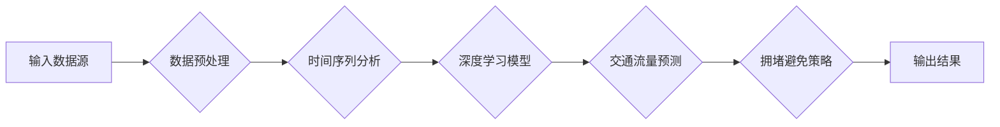

# 自动驾驶中的交通流量预测与拥堵避免

> 关键词：自动驾驶，交通流量预测，拥堵避免，机器学习，深度学习，时间序列分析，时空大数据

## 1. 背景介绍

随着城市化进程的加速和人口密度的增加，交通拥堵问题日益严重。这不仅影响了人们的出行效率，还加剧了环境污染和能源消耗。自动驾驶技术的发展为解决交通拥堵问题提供了新的机遇。在自动驾驶系统中，交通流量预测与拥堵避免是两个至关重要的环节。本文将探讨如何利用机器学习和深度学习技术来预测交通流量和避免拥堵。

### 1.1 问题的由来

交通拥堵是由多种因素引起的，如道路容量不足、交通流量波动、交通事故、道路施工等。传统的交通管理方法往往依赖于人工经验，难以适应动态变化的交通环境。而自动驾驶技术需要实时掌握交通状况，以便做出快速、准确的决策。

### 1.2 研究现状

近年来，随着机器学习和深度学习技术的快速发展，交通流量预测和拥堵避免取得了显著进展。研究人员已经开发出多种基于时间序列分析、时空大数据和深度学习的方法来预测交通流量和避免拥堵。

### 1.3 研究意义

交通流量预测与拥堵避免对于提高道路使用效率、减少交通拥堵、降低环境污染和提升自动驾驶系统的安全性具有重要意义。

## 2. 核心概念与联系

### 2.1 核心概念

- **交通流量预测**：预测未来一段时间内道路上的车辆流量。
- **拥堵避免**：通过调整交通信号灯、引导车辆行驶等方式，避免或减轻交通拥堵。
- **时间序列分析**：分析历史交通数据，预测未来趋势。
- **时空大数据**：融合时间和空间维度的数据，用于预测和分析交通流量。
- **深度学习**：一种基于人工神经网络的学习方法，能够从大量数据中学习复杂的模式。

### 2.2 架构的 Mermaid 流程图



## 3. 核心算法原理 & 具体操作步骤

### 3.1 算法原理概述

交通流量预测与拥堵避免的核心算法主要包括时间序列分析和深度学习。

### 3.2 算法步骤详解

1. **数据预处理**：收集历史交通数据，包括车辆流量、道路状态、天气情况等，并进行数据清洗、标准化和特征提取。
2. **时间序列分析**：使用自回归、ARIMA等模型分析历史交通数据，预测未来一段时间内的交通流量。
3. **深度学习模型**：使用LSTM、GRU等循环神经网络或Transformer等序列到序列模型，对交通数据进行建模，预测交通流量和拥堵情况。
4. **拥堵避免策略**：根据预测结果，调整交通信号灯、引导车辆行驶等，以避免或减轻交通拥堵。
5. **输出结果**：将预测结果和拥堵避免策略输出给自动驾驶系统。

### 3.3 算法优缺点

- **时间序列分析**：优点是简单易行，缺点是难以处理复杂的非线性关系。
- **深度学习**：优点是能够处理复杂的非线性关系，缺点是需要大量标注数据。

### 3.4 算法应用领域

- **自动驾驶**：实时预测交通流量和拥堵情况，为自动驾驶车辆提供决策支持。
- **智能交通系统**：优化交通信号灯控制，提高道路通行效率。
- **城市规划**：评估城市规划方案对交通流量的影响。

## 4. 数学模型和公式 & 详细讲解 & 举例说明

### 4.1 数学模型构建

#### 时间序列分析

假设历史交通流量数据为 $X_t = [x_1, x_2, ..., x_t]$，其中 $x_t$ 表示第 $t$ 个时间点的交通流量。可以使用以下自回归模型进行预测：

$$
X_t = \phi_0 + \phi_1X_{t-1} + \phi_2X_{t-2} + ... + \phi_pX_{t-p} + \epsilon_t
$$

其中 $\phi_0, \phi_1, ..., \phi_p$ 为模型参数，$\epsilon_t$ 为误差项。

#### 深度学习模型

假设使用LSTM模型进行交通流量预测，其结构如下：

- **输入层**：接收时间序列数据 $X_t$。
- **隐藏层**：由LSTM单元组成，用于捕捉时间序列数据的长期依赖关系。
- **输出层**：输出预测的交通流量 $X_{t+1}$。

### 4.2 公式推导过程

#### 时间序列分析

自回归模型的参数可以通过最小化预测误差的平方和来估计：

$$
\hat{\phi} = \mathop{\arg\min}_{\phi} \sum_{t=1}^T (X_t - \hat{X}_t)^2
$$

其中 $\hat{X}_t$ 为预测值，$T$ 为数据集大小。

#### 深度学习模型

LSTM模型的参数可以通过反向传播算法来估计：

$$
\theta = \mathop{\arg\min}_{\theta} \sum_{t=1}^T \frac{1}{2} (X_{t+1} - \hat{X}_{t+1})^2
$$

其中 $\theta$ 为模型参数，$\hat{X}_{t+1}$ 为预测值。

### 4.3 案例分析与讲解

假设使用LSTM模型对某路段的未来24小时交通流量进行预测。首先，收集该路段过去一周的交通流量数据，然后进行数据预处理。接着，将数据划分为训练集和测试集，使用训练集训练LSTM模型，并使用测试集评估模型性能。

## 5. 项目实践：代码实例和详细解释说明

### 5.1 开发环境搭建

- 安装Python环境。
- 安装TensorFlow或PyTorch深度学习框架。
- 安装必要的库，如NumPy、Pandas、Scikit-learn等。

### 5.2 源代码详细实现

```python
import pandas as pd
import numpy as np
from tensorflow.keras.models import Sequential
from tensorflow.keras.layers import LSTM, Dense

# 加载数据
data = pd.read_csv('traffic_data.csv')
data = data.dropna()

# 数据预处理
data['timestamp'] = pd.to_datetime(data['timestamp'])
data.sort_values('timestamp', inplace=True)
data.set_index('timestamp', inplace=True)
data = data.resample('T').mean()

# 创建输入和输出
X = data[['volume']].values
y = data['volume'].values[1:]

# 划分训练集和测试集
train_size = int(len(X) * 0.8)
X_train, X_test = X[0:train_size], X[train_size:]
y_train, y_test = y[0:train_size], y[train_size:]

# 创建LSTM模型
model = Sequential()
model.add(LSTM(50, input_shape=(X_train.shape[1], 1)))
model.add(Dense(1))
model.compile(optimizer='adam', loss='mse')

# 训练模型
model.fit(X_train.reshape(X_train.shape[0], 1, 1), y_train, epochs=50, batch_size=1, verbose=2)

# 预测
X_test = X_test.reshape(X_test.shape[0], 1, 1)
y_pred = model.predict(X_test)

# 评估模型
print(f"Mean Squared Error: {mean_squared_error(y_test, y_pred)}")
```

### 5.3 代码解读与分析

上述代码使用LSTM模型对交通流量数据进行预测。首先，加载数据并对其进行预处理。然后，创建输入和输出，并划分训练集和测试集。接着，创建LSTM模型并训练。最后，使用测试集评估模型性能。

## 6. 实际应用场景

### 6.1 自动驾驶

自动驾驶车辆需要实时了解周围的道路状况，以便做出快速、准确的决策。通过预测交通流量和拥堵情况，自动驾驶车辆可以调整行驶速度、路线等，避免拥堵和交通事故。

### 6.2 智能交通系统

智能交通系统可以通过预测交通流量和拥堵情况，优化交通信号灯控制，提高道路通行效率。

### 6.3 城市规划

城市规划者可以使用交通流量预测结果来评估城市规划方案对交通流量的影响，从而制定更有效的交通管理策略。

## 7. 工具和资源推荐

### 7.1 学习资源推荐

- 《深度学习》
- 《时间序列分析：理论与实践》
- 《Python数据分析》

### 7.2 开发工具推荐

- TensorFlow或PyTorch深度学习框架
- NumPy、Pandas、Scikit-learn等数据分析库

### 7.3 相关论文推荐

- "A Deep Learning Approach to Traffic Forecasting"
- "Deep Learning for Urban Traffic Prediction"
- "A Survey on Traffic Flow Prediction: Methods, Models and Applications"

## 8. 总结：未来发展趋势与挑战

### 8.1 研究成果总结

交通流量预测与拥堵避免是自动驾驶和智能交通系统的重要组成部分。通过机器学习和深度学习技术，可以实现对交通流量的准确预测和拥堵的避免。

### 8.2 未来发展趋势

- 结合多源数据，如视频监控、GPS等，提高预测精度。
- 使用更先进的深度学习模型，如Transformer，提高模型性能。
- 将交通流量预测与拥堵避免系统集成，实现自动化控制。

### 8.3 面临的挑战

- 数据质量和数量：高质量、高数量的交通数据对于模型的训练至关重要。
- 模型复杂度：复杂的深度学习模型需要更多的计算资源和训练时间。
- 实时性：交通流量预测需要实时性，对模型的推理速度有严格要求。

### 8.4 研究展望

交通流量预测与拥堵避免的研究将为自动驾驶和智能交通系统的发展提供重要支持。未来，随着技术的不断进步，我们将能够实现更智能、更高效的交通管理。

## 9. 附录：常见问题与解答

**Q1：交通流量预测模型的输入数据有哪些？**

A：交通流量预测模型的输入数据包括历史交通流量数据、天气数据、交通事故数据、道路施工数据等。

**Q2：如何提高交通流量预测模型的精度？**

A：提高交通流量预测模型的精度可以通过以下方法：
- 使用更先进的数据处理和特征工程技术。
- 使用更复杂的深度学习模型。
- 使用多源数据进行融合。

**Q3：交通流量预测模型的应用场景有哪些？**

A：交通流量预测模型的应用场景包括自动驾驶、智能交通系统、城市规划等。

**Q4：交通流量预测模型的实时性如何保证？**

A：保证交通流量预测模型的实时性可以通过以下方法：
- 使用轻量级模型。
- 使用高性能计算资源。
- 优化模型推理算法。

---

作者：禅与计算机程序设计艺术 / Zen and the Art of Computer Programming