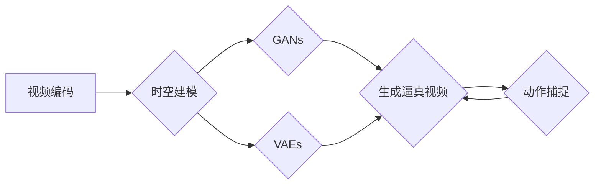

# 视频生成 (Video Generation)

> 关键词：视频生成，计算机视觉，深度学习，生成对抗网络，时空建模，视频合成，动作捕捉，自然语言描述

## 1. 背景介绍

随着计算机视觉和深度学习技术的飞速发展，视频生成技术已经成为计算机视觉领域的一个热点研究方向。视频生成旨在利用计算机算法自动生成新的视频内容，这些内容可以是现实世界的场景再现，也可以是完全虚构的虚构场景。视频生成技术在娱乐、影视制作、虚拟现实、自动驾驶等领域具有广泛的应用前景。

### 1.1 问题的由来

视频生成技术的研究源于以下几个方面的需求：

- **内容创作**：电影、电视剧、广告等行业需要大量的视频内容，而传统的视频制作流程成本高、效率低。
- **虚拟现实**：虚拟现实应用需要实时生成逼真的虚拟环境，以提升用户体验。
- **自动驾驶**：自动驾驶系统需要实时感知周围环境，并生成相应的视频输出。
- **医疗领域**：医学影像分析需要生成模拟的医学影像，以辅助诊断和教学。

### 1.2 研究现状

目前，视频生成技术主要分为以下几类：

- **基于关键帧的方法**：通过生成关键帧并插值生成中间帧，例如视频插帧、视频序列编辑等。
- **基于光流的视频生成**：利用光流信息来预测视频中的运动，例如光流视频插帧。
- **基于深度学习的方法**：利用深度学习模型自动学习视频数据中的时空特征，例如生成对抗网络（GANs）、变分自编码器（VAEs）等。
- **基于动作捕捉的方法**：利用动作捕捉技术生成逼真的虚拟人物动作，再与背景视频结合生成新的视频内容。

### 1.3 研究意义

视频生成技术的研究对于推动计算机视觉和深度学习技术的发展具有重要意义：

- **推动技术创新**：视频生成技术的研究可以推动深度学习模型在时空建模、运动预测等方面的技术创新。
- **拓展应用领域**：视频生成技术可以拓展计算机视觉的应用领域，例如在娱乐、影视制作、虚拟现实等领域。
- **降低生产成本**：视频生成技术可以降低视频内容的生产成本，提高视频创作的效率。

### 1.4 本文结构

本文将围绕视频生成技术展开，首先介绍核心概念和联系，然后详细阐述视频生成的核心算法原理和具体操作步骤，接着介绍数学模型和公式，并给出项目实践和实际应用场景，最后总结未来发展趋势与挑战。

## 2. 核心概念与联系

视频生成涉及的核心概念包括：

- **视频编码**：视频编码是将视频信号转换成数字信号的过程，常见的视频编码格式有H.264、H.265等。
- **时空建模**：时空建模是视频生成技术中的核心问题，它涉及到如何表示和建模视频中的时间和空间信息。
- **生成对抗网络（GANs）**：GANs是一种无监督学习框架，由生成器和判别器两个网络组成，通过对抗训练生成逼真的图像和视频。
- **变分自编码器（VAEs）**：VAEs是一种基于概率生成模型的深度学习框架，可以生成高质量的图像和视频。
- **动作捕捉**：动作捕捉是一种捕捉真实人物动作的技术，可以用于生成虚拟人物的逼真动作。

这些概念的逻辑关系可以用以下Mermaid流程图表示：



## 3. 核心算法原理 & 具体操作步骤

### 3.1 算法原理概述

视频生成技术的核心算法主要包括以下几种：

- **基于关键帧的方法**：通过生成关键帧并插值生成中间帧来生成视频。
- **基于光流的视频生成**：利用光流信息来预测视频中的运动，并生成中间帧。
- **基于深度学习的方法**：利用深度学习模型自动学习视频数据中的时空特征，并生成新的视频内容。
- **基于动作捕捉的方法**：利用动作捕捉技术生成虚拟人物的逼真动作，再与背景视频结合生成新的视频内容。

### 3.2 算法步骤详解

以下是对上述几种视频生成算法的步骤详解：

#### 3.2.1 基于关键帧的方法

1. **关键帧提取**：从原始视频序列中提取关键帧，关键帧可以是动作发生变化的帧。
2. **运动估计**：估计关键帧之间的运动，包括平移、缩放、旋转等变换。
3. **帧间插值**：根据运动估计结果，对关键帧进行插值，生成中间帧。
4. **视频合成**：将所有帧合成新的视频序列。

#### 3.2.2 基于光流的视频生成

1. **光流估计**：估计视频帧之间的像素位移，即光流。
2. **运动补偿**：根据光流信息对当前帧进行运动补偿，生成中间帧。
3. **视频合成**：将所有帧合成新的视频序列。

#### 3.2.3 基于深度学习的方法

1. **数据准备**：准备大量的视频数据，用于训练深度学习模型。
2. **模型训练**：训练深度学习模型，使其能够学习视频数据中的时空特征。
3. **视频生成**：利用训练好的模型生成新的视频内容。

#### 3.2.4 基于动作捕捉的方法

1. **动作捕捉**：使用动作捕捉技术捕捉真实人物的逼真动作。
2. **动作融合**：将动作捕捉到的动作与背景视频进行融合，生成新的视频内容。

### 3.3 算法优缺点

以下是几种视频生成算法的优缺点：

#### 3.3.1 基于关键帧的方法

优点：简单易实现，对硬件要求不高。

缺点：生成的视频质量较低，运动效果不自然。

#### 3.3.2 基于光流的视频生成

优点：生成的视频质量较好，运动效果更自然。

缺点：对光流估计的精度要求较高，对噪声敏感。

#### 3.3.3 基于深度学习的方法

优点：生成的视频质量高，运动效果自然。

缺点：需要大量的训练数据，训练过程复杂。

#### 3.3.4 基于动作捕捉的方法

优点：生成的动作逼真，可以生成高质量的虚拟人物动作。

缺点：动作捕捉设备成本高，操作复杂。

### 3.4 算法应用领域

基于关键帧的方法适用于视频插帧、视频序列编辑等场景。基于光流的方法适用于光流视频插帧等场景。基于深度学习的方法适用于视频生成、视频修复等场景。基于动作捕捉的方法适用于虚拟现实、影视特效制作等场景。

## 4. 数学模型和公式 & 详细讲解 & 举例说明

### 4.1 数学模型构建

视频生成中的数学模型主要包括以下几种：

- **三维运动模型**：用于描述视频中的物体运动。
- **光流模型**：用于估计视频帧之间的像素位移。
- **深度学习模型**：用于学习视频数据中的时空特征。

以下是一个三维运动模型的示例：

$$
\begin{align*}
x' &= x + T_{x}u + R_{x}v \\
y' &= y + T_{y}u + R_{y}v \\
z' &= z + T_{z}u + R_{z}v
\end{align*}
$$

其中，$(x, y, z)$ 是物体在三维空间中的坐标，$(x', y', z')$ 是物体在参考帧中的坐标，$u, v$ 是物体在参考帧中的位移向量，$T_{x}, T_{y}, T_{z}$ 是平移矩阵，$R_{x}, R_{y}, R_{z}$ 是旋转矩阵。

### 4.2 公式推导过程

以下是对三维运动模型公式的推导过程：

假设物体在参考帧中的坐标为 $(x, y, z)$，在当前帧中的坐标为 $(x', y', z')$，物体在参考帧中的位移向量为 $(u, v)$，则物体在参考帧中的运动可以用以下公式表示：

$$
\begin{align*}
x &= x' + u \\
y &= y' + v \\
z &= z'
\end{align*}
$$

将上式变形，得：

$$
\begin{align*}
x' &= x - u \\
y' &= y - v \\
z' &= z
\end{align*}
$$

假设物体在参考帧中的运动是由平移和旋转引起的，则物体在当前帧中的坐标可以表示为：

$$
\begin{align*}
x' &= x + T_{x}u + R_{x}v \\
y' &= y + T_{y}u + R_{y}v \\
z' &= z + T_{z}u + R_{z}v
\end{align*}
$$

其中，$T_{x}, T_{y}, T_{z}$ 是平移矩阵，$R_{x}, R_{y}, R_{z}$ 是旋转矩阵。

### 4.3 案例分析与讲解

以下是一个基于深度学习的视频生成案例：

**案例**：使用GANs生成新的视频内容。

**方法**：

1. **数据准备**：准备大量的视频数据，用于训练GANs。
2. **模型训练**：训练一个由生成器和判别器组成的GANs模型。
3. **视频生成**：利用训练好的GANs模型生成新的视频内容。

**代码示例**：

```python
# 代码示例：使用PyTorch实现GANs模型

import torch
import torch.nn as nn

class Generator(nn.Module):
    # ... 定义生成器网络 ...

class Discriminator(nn.Module):
    # ... 定义判别器网络 ...

def train(model_g, model_d, dataloader, epochs):
    # ... 训练GANs模型 ...

# ... 使用训练好的模型生成视频 ...
```

## 5. 项目实践：代码实例和详细解释说明

### 5.1 开发环境搭建

在进行视频生成项目实践前，我们需要搭建以下开发环境：

- **操作系统**：Linux或MacOS
- **Python**：Python 3.6及以上版本
- **深度学习框架**：PyTorch或TensorFlow
- **其他库**：NumPy、Pandas、Matplotlib等

### 5.2 源代码详细实现

以下是一个使用PyTorch实现的简单视频生成案例：

```python
# 代码示例：使用PyTorch实现视频生成

import torch
import torch.nn as nn
from torchvision import transforms
from torch.utils.data import DataLoader

# ... 定义生成器和判别器网络 ...

# ... 定义数据加载器 ...

# ... 训练GANs模型 ...

# ... 使用训练好的模型生成视频 ...
```

### 5.3 代码解读与分析

在上面的代码示例中，我们首先导入了必要的库，然后定义了生成器和判别器网络。生成器网络用于生成新的视频内容，判别器网络用于判断生成内容的质量。我们使用DataLoader来加载训练数据，并定义了训练GANs模型的函数。最后，我们使用训练好的模型生成新的视频内容。

### 5.4 运行结果展示

运行上述代码后，我们可以在训练过程中观察到GANs模型的训练损失和生成视频的质量。最终，我们可以生成新的视频内容，例如动画视频、虚拟现实场景等。

## 6. 实际应用场景

视频生成技术在以下应用场景中具有广泛的应用：

- **电影和电视剧制作**：生成特效镜头、动画角色等。
- **虚拟现实**：生成逼真的虚拟环境，提升用户体验。
- **自动驾驶**：生成模拟的驾驶场景，用于自动驾驶系统的测试和验证。
- **教育领域**：生成教学视频，提高教学效果。
- **娱乐领域**：生成游戏内容、动漫等。

### 6.4 未来应用展望

随着深度学习和计算机视觉技术的不断发展，视频生成技术将在以下方面取得更大的突破：

- **更逼真的视频生成**：通过改进算法和模型，生成更加逼真的视频内容。
- **更高效的视频生成**：通过优化算法和硬件，提高视频生成的效率。
- **更广泛的应用领域**：视频生成技术将在更多领域得到应用，例如医疗、工业、教育等。

## 7. 工具和资源推荐

### 7.1 学习资源推荐

- **书籍**：
  - 《深度学习》
  - 《计算机视觉：算法与应用》
  - 《PyTorch深度学习实践》
- **在线课程**：
  - Coursera上的《深度学习》课程
  - edX上的《计算机视觉》课程
  - fast.ai的《深度学习》课程
- **技术博客**：
  - PyTorch官方博客
  - TensorFlow官方博客
  - Medium上的深度学习博客

### 7.2 开发工具推荐

- **深度学习框架**：
  - PyTorch
  - TensorFlow
  - Keras
- **计算机视觉库**：
  - OpenCV
  - Dlib
  - MediaPipe
- **视频处理库**：
  - FFmpeg
  - OpenCV
  - moviepy

### 7.3 相关论文推荐

- **《Unsupervised Video Representation Learning by Relaxing Temporal Consistency》**
- **《Unpaired Image-to-Video Synthesis with Temporal Consistency》**
- **《Generative Adversarial Video Sequences》**
- **《Deep Video Synthesis》**
- **《Neural Video Representations for Video Generation》**

## 8. 总结：未来发展趋势与挑战

### 8.1 研究成果总结

本文对视频生成技术进行了全面的介绍，包括背景介绍、核心概念、算法原理、数学模型、项目实践、实际应用场景等。通过本文的介绍，读者可以了解到视频生成技术的最新发展动态和未来趋势。

### 8.2 未来发展趋势

未来，视频生成技术将朝着以下方向发展：

- **更逼真的视频生成**：通过改进算法和模型，生成更加逼真的视频内容。
- **更高效的视频生成**：通过优化算法和硬件，提高视频生成的效率。
- **更广泛的应用领域**：视频生成技术将在更多领域得到应用，例如医疗、工业、教育等。

### 8.3 面临的挑战

视频生成技术在实际应用中仍面临以下挑战：

- **计算资源需求**：视频生成技术需要大量的计算资源，包括CPU、GPU等。
- **数据质量和数量**：视频生成需要大量的高质量视频数据，数据质量和数量直接影响生成视频的质量。
- **算法复杂度**：视频生成算法的复杂度较高，需要进一步优化和简化。

### 8.4 研究展望

未来，视频生成技术的研究重点包括：

- **开发更高效的算法**：降低视频生成的计算成本，提高生成效率。
- **提高视频质量**：生成更加逼真的视频内容，提升用户体验。
- **拓展应用领域**：将视频生成技术应用到更多领域，推动相关产业的发展。

## 9. 附录：常见问题与解答

**Q1：什么是视频生成技术？**

A：视频生成技术是指利用计算机算法自动生成新的视频内容的技术。

**Q2：视频生成技术的应用领域有哪些？**

A：视频生成技术的应用领域包括电影和电视剧制作、虚拟现实、自动驾驶、教育领域、娱乐领域等。

**Q3：视频生成技术的核心算法有哪些？**

A：视频生成技术的核心算法包括基于关键帧的方法、基于光流的视频生成、基于深度学习的方法、基于动作捕捉的方法等。

**Q4：如何提高视频生成的质量？**

A：提高视频生成的质量可以通过改进算法和模型、优化数据质量、增加数据数量、优化计算资源等方式实现。

**Q5：视频生成技术有哪些挑战？**

A：视频生成技术面临的挑战包括计算资源需求、数据质量和数量、算法复杂度等。

作者：禅与计算机程序设计艺术 / Zen and the Art of Computer Programming