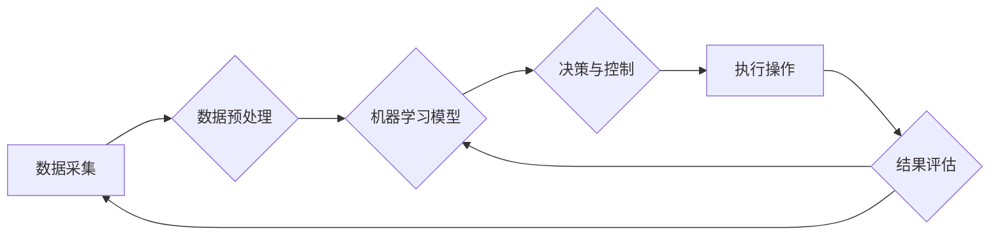

> 关键词：计算变化，自动化技术，机器学习，工业4.0，流程优化，智能决策，预测分析

# 计算变化与自动化技术的结合

在当今快速发展的信息时代，计算能力的提升和自动化技术的进步正深刻地改变着各个行业。计算变化（Computational Change）指的是计算技术的变革，它不仅提高了计算速度和处理能力，而且使得数据分析和算法决策变得更加高效。自动化技术则通过机器学习和人工智能技术，实现了对复杂过程的自动控制和优化。本文将探讨计算变化与自动化技术的结合，分析其原理、应用、挑战和未来趋势。

## 1. 背景介绍

### 1.1 问题的由来

随着物联网（IoT）、大数据和云计算等技术的发展，企业面临着日益复杂的数据处理和决策问题。传统的自动化技术已经难以满足现代工业和生产的需求。计算变化的引入，为自动化技术带来了新的可能性，使得自动化系统能够处理更复杂的数据，做出更智能的决策。

### 1.2 研究现状

目前，计算变化与自动化技术的结合已经在多个领域取得了显著成果。工业自动化、智能家居、智能交通和金融科技等领域都看到了这种结合的威力。然而，如何有效地将计算变化整合到自动化技术中，以及如何开发出既智能又可靠的自动化系统，仍然是当前研究的热点问题。

### 1.3 研究意义

计算变化与自动化技术的结合具有以下研究意义：

- 提高效率：通过自动化处理和决策，可以显著提高生产效率和服务质量。
- 降低成本：自动化减少了人工操作，降低了人力成本和维护成本。
- 增强安全性：自动化系统能够持续监控和响应，提高系统的安全性。
- 创新应用：结合计算变化和自动化技术，可以创造出新的应用场景和商业模式。

### 1.4 本文结构

本文将分为以下几个部分：

- 核心概念与联系：介绍计算变化和自动化技术的核心概念，并使用Mermaid流程图展示它们之间的联系。
- 核心算法原理 & 具体操作步骤：阐述自动化系统中常用的算法原理和操作步骤。
- 数学模型和公式 & 详细讲解 & 举例说明：介绍自动化系统中常用的数学模型和公式，并举例说明其应用。
- 项目实践：提供自动化系统的代码实例和详细解释。
- 实际应用场景：探讨计算变化与自动化技术在各个领域的应用。
- 工具和资源推荐：推荐相关的学习资源、开发工具和论文。
- 总结：总结研究成果，展望未来发展趋势和挑战。

## 2. 核心概念与联系

### 2.1 核心概念

- 计算变化：指计算技术（如CPU性能、算法效率、存储容量等）的快速发展。
- 自动化技术：指使用机器和控制系统进行生产、加工和服务的过程。
- 机器学习：一种使计算机能够从数据中学习并做出决策的技术。
- 人工智能：一种模拟人类智能行为的技术，包括机器学习、自然语言处理、计算机视觉等。

### 2.2 Mermaid流程图



### 2.3 联系

计算变化为自动化技术提供了更强的计算能力，使得自动化系统可以处理更复杂的数据和任务。机器学习和人工智能技术使得自动化系统能够从数据中学习，并做出更加智能的决策。

## 3. 核心算法原理 & 具体操作步骤

### 3.1 算法原理概述

自动化系统中的核心算法通常包括以下几种：

- 监督学习：通过训练数据学习输入和输出之间的关系。
- 无监督学习：通过未标记的数据发现数据中的模式和结构。
- 强化学习：通过试错学习如何实现目标。

### 3.2 算法步骤详解

1. 数据采集：从传感器、设备或外部系统中收集数据。
2. 数据预处理：清洗、转换和标准化数据。
3. 训练模型：使用机器学习算法训练模型。
4. 部署模型：将训练好的模型部署到自动化系统中。
5. 决策与控制：模型根据实时数据做出决策和控制操作。
6. 执行操作：执行决策，如调整设备参数或执行特定任务。
7. 结果评估：评估操作结果，并反馈给模型进行进一步学习。

### 3.3 算法优缺点

- 监督学习：优点是准确度高，缺点是需要大量的标注数据。
- 无监督学习：优点是无需标注数据，缺点是可能难以发现复杂的模式。
- 强化学习：优点是能够处理动态环境，缺点是学习过程可能非常缓慢。

### 3.4 算法应用领域

- 工业自动化：用于预测设备故障、优化生产流程。
- 智能家居：用于自动调节温度、照明和安防系统。
- 智能交通：用于交通流量控制、自动驾驶车辆。
- 金融科技：用于风险评估、欺诈检测和算法交易。

## 4. 数学模型和公式 & 详细讲解 & 举例说明

### 4.1 数学模型构建

自动化系统中的数学模型通常包括以下几种：

- 线性回归：用于预测连续值。
- 逻辑回归：用于预测离散值，如二分类任务。
- 决策树：用于分类和回归任务。
- 神经网络：用于复杂的数据建模和预测。

### 4.2 公式推导过程

以下以线性回归为例，介绍公式推导过程：

假设我们有一个线性回归模型 $y = \beta_0 + \beta_1x$，其中 $y$ 是因变量，$x$ 是自变量，$\beta_0$ 和 $\beta_1$ 是模型参数。

最小化损失函数 $L(\beta_0, \beta_1) = \frac{1}{2} \sum_{i=1}^n (y_i - (\beta_0 + \beta_1x_i))^2$，得到最小二乘解：

$$
\beta_0 = \frac{\sum_{i=1}^n (y_i - \beta_1x_i)}{n} \\
\beta_1 = \frac{\sum_{i=1}^n x_i(y_i - \beta_0 - \beta_1x_i)}{\sum_{i=1}^n x_i^2}
$$

### 4.3 案例分析与讲解

假设我们有一个简单的销售预测问题，需要根据历史销售数据和季节性因素预测下个月的销售额。

我们可以使用线性回归模型来建立销售预测模型。首先，收集历史销售数据，包括销售额、季节性指标等。然后，使用线性回归算法训练模型，得到预测公式。最后，使用模型预测下个月的销售额。

## 5. 项目实践：代码实例和详细解释说明

### 5.1 开发环境搭建

为了实现自动化系统，我们需要以下开发环境：

- 编程语言：Python
- 数据处理库：NumPy、Pandas
- 机器学习库：Scikit-learn
- 可视化库：Matplotlib

### 5.2 源代码详细实现

以下是一个简单的线性回归模型实现：

```python
import numpy as np
from sklearn.linear_model import LinearRegression
import matplotlib.pyplot as plt

# 创建示例数据
X = np.linspace(0, 10, 100).reshape(-1, 1)
y = 3 * X + 2 + np.random.normal(0, 1, 100)

# 创建线性回归模型
model = LinearRegression()

# 训练模型
model.fit(X, y)

# 预测
y_pred = model.predict(X)

# 可视化结果
plt.scatter(X, y, label='Actual')
plt.plot(X, y_pred, label='Predicted', color='red')
plt.legend()
plt.show()
```

### 5.3 代码解读与分析

- `import numpy as np`：导入NumPy库，用于数学计算。
- `from sklearn.linear_model import LinearRegression`：导入线性回归模型。
- `import matplotlib.pyplot as plt`：导入Matplotlib库，用于数据可视化。
- `X` 和 `y`：创建示例数据，`X` 是自变量，`y` 是因变量。
- `model = LinearRegression()`：创建线性回归模型实例。
- `model.fit(X, y)`：使用训练数据训练模型。
- `y_pred = model.predict(X)`：使用模型进行预测。
- `plt.scatter(X, y, label='Actual')`：绘制实际数据点。
- `plt.plot(X, y_pred, label='Predicted', color='red')`：绘制预测结果。
- `plt.legend()`：显示图例。
- `plt.show()`：显示图形。

### 5.4 运行结果展示

运行上述代码，我们可以得到一个散点图，其中蓝色点表示实际数据，红色曲线表示模型预测结果。

## 6. 实际应用场景

### 6.1 工业自动化

在工业自动化领域，计算变化与自动化技术的结合可以用于：

- 预测维护：通过分析设备运行数据，预测设备故障并进行预防性维护。
- 质量控制：通过分析生产数据，检测产品缺陷并优化生产流程。
- 供应链优化：通过分析供应链数据，优化库存管理和物流配送。

### 6.2 智能家居

在智能家居领域，计算变化与自动化技术的结合可以用于：

- 能源管理：自动调节照明、温控等，降低能耗。
- 安全监控：自动监控家庭安全，及时发现异常情况。
- 智能家居控制：通过语音或手势控制家居设备。

### 6.3 智能交通

在智能交通领域，计算变化与自动化技术的结合可以用于：

- 交通流量控制：优化交通信号灯控制，缓解交通拥堵。
- 自动驾驶：开发自动驾驶汽车，提高交通安全和效率。
- 智能停车：通过传感器和摄像头自动识别车辆并分配停车位。

## 7. 工具和资源推荐

### 7.1 学习资源推荐

- 《Python机器学习》
- 《深度学习》
- 《人工智能：一种现代的方法》

### 7.2 开发工具推荐

- Python
- NumPy
- Pandas
- Scikit-learn
- TensorFlow
- PyTorch

### 7.3 相关论文推荐

- “Deep Learning for Industrial Automation” by Z. Wang et al.
- “AI in Smart Home: A Survey” by Y. Wang et al.
- “AI in Smart Transportation: A Survey” by Y. Li et al.

## 8. 总结：未来发展趋势与挑战

### 8.1 研究成果总结

计算变化与自动化技术的结合为各个领域带来了巨大的变革。通过机器学习和人工智能技术，自动化系统变得更加智能，能够处理更复杂的数据和任务。

### 8.2 未来发展趋势

- 计算变化将继续推动自动化技术的发展，使得自动化系统更加高效、智能和可靠。
- 机器学习和人工智能技术将更加深入地融入自动化系统，实现更加复杂的决策和控制。
- 跨学科交叉融合将推动自动化技术的发展，如将自动化与物联网、云计算等技术结合。

### 8.3 面临的挑战

- 数据安全：如何保护自动化系统中的数据安全，防止数据泄露和滥用。
- 算法可靠性：如何确保自动化系统的决策和控制是可靠和可解释的。
- 技术标准：如何制定统一的技术标准，促进自动化技术的普及和应用。

### 8.4 研究展望

未来，计算变化与自动化技术的结合将推动以下研究方向：

- 发展更加高效、可靠的机器学习算法。
- 开发更加安全、可信的自动化系统。
- 建立跨学科的技术标准，促进自动化技术的普及和应用。

## 9. 附录：常见问题与解答

**Q1：计算变化与自动化技术的结合有哪些优点？**

A：计算变化与自动化技术的结合具有以下优点：

- 提高效率：通过自动化处理和决策，可以显著提高生产效率和服务质量。
- 降低成本：自动化减少了人工操作，降低了人力成本和维护成本。
- 增强安全性：自动化系统能够持续监控和响应，提高系统的安全性。
- 创新应用：结合计算变化和自动化技术，可以创造出新的应用场景和商业模式。

**Q2：如何确保自动化系统的决策和控制是可靠和可解释的？**

A：确保自动化系统决策和控制可靠和可解释的方法包括：

- 使用可解释的机器学习模型，如决策树和规则学习。
- 对自动化系统进行测试和验证，确保其按照预期工作。
- 建立自动化系统的审计和监控机制，及时发现和解决问题。

**Q3：计算变化与自动化技术的结合有哪些潜在风险？**

A：计算变化与自动化技术的结合可能带来的潜在风险包括：

- 数据泄露：自动化系统中可能包含敏感数据，需要采取措施保护数据安全。
- 系统故障：自动化系统可能出现故障，需要建立故障检测和恢复机制。
- 伦理问题：自动化系统的决策可能引发伦理问题，如就业影响和隐私侵犯。

**Q4：如何应对自动化技术的就业影响？**

A：应对自动化技术就业影响的策略包括：

- 培训和再教育：为受影响的工人提供新技能培训，帮助他们适应新的工作环境。
- 创造新的就业机会：鼓励创新，创造新的工作岗位，减少对传统工作的替代。
- 政策支持：制定相关政策，鼓励自动化技术的研发和应用，同时关注就业问题。

**Q5：计算变化与自动化技术的结合是否会导致自动化系统失去控制？**

A：计算变化与自动化技术的结合并不会导致自动化系统失去控制。相反，通过建立有效的监控和控制系统，可以确保自动化系统按照预期工作。同时，可以通过设置安全限制和备份机制来防止自动化系统失控。

作者：禅与计算机程序设计艺术 / Zen and the Art of Computer Programming