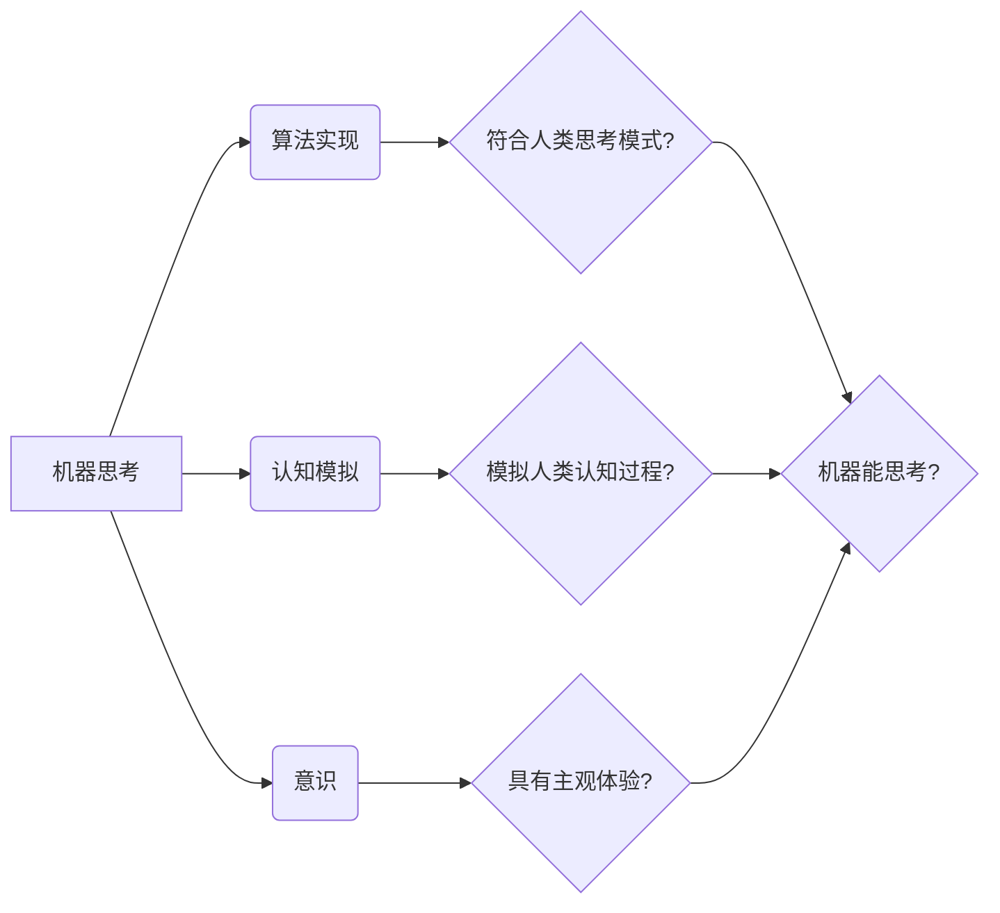

# 计算：第四部分 计算的极限 第 12 章 机器能思考吗 350 多年的等待

> 关键词：人工智能，机器思考，图灵测试，意识，认知计算，计算哲学

## 1. 背景介绍

从莱布尼茨的“万能机”概念，到图灵在1950年提出的图灵测试，人类对机器能否思考的探索已经持续了350多年。这一跨越几个世纪的追问，不仅触及了计算科学的边界，也引发了关于意识、认知和人类本质的哲学思考。本章将深入探讨机器思考的可能性，分析图灵测试的内涵，并展望未来计算在探索机器意识方面的可能路径。

### 1.1 问题的由来

机器能思考吗？这是一个古老而深刻的哲学问题，也是现代人工智能研究的核心议题之一。从莱布尼茨的“万能机”到图灵的图灵机，再到今天的深度学习模型，人类一直在探索计算的本质和机器的智能极限。

### 1.2 研究现状

人工智能领域经历了多次浪潮，从早期的符号主义到连接主义，再到如今的深度学习，机器在特定任务上的表现已经超越了人类。然而，机器是否真正具有意识，是否能够像人类一样进行思考，仍然是一个未解之谜。

### 1.3 研究意义

探讨机器思考的可能性，不仅有助于推动人工智能技术的发展，还能够帮助我们更好地理解人类思维的本质，以及意识和认知的形成机制。

### 1.4 本文结构

本章将围绕以下内容展开：

- 首先，介绍机器思考的核心概念和相关的哲学思考。
- 然后，详细阐述图灵测试的原理和评价标准。
- 接着，分析机器思考的当前挑战和未来发展方向。
- 最后，总结本章内容，并展望未来计算在探索机器意识方面的可能路径。

## 2. 核心概念与联系

### 2.1 机器思考的核心概念

**机器思考**这一概念包含了多个层面的含义：

- **算法实现**：指计算机程序能够执行复杂的认知任务，如理解自然语言、识别图像、进行决策等。
- **认知模拟**：指计算机程序能够模拟人类认知过程的某些方面，如感知、记忆、学习、推理等。
- **意识**：指机器是否具有主观体验、自我意识和情感等人类特有的心理状态。

### 2.2 相关哲学思考

- **机械论**：认为机器可以像人一样思考，只要它们的结构和功能与人脑相似。
- **功能主义**：认为机器是否具有思考能力，取决于其功能和性能，而不仅仅是结构。
- **生物论**：认为机器无法真正思考，因为它们缺乏生物体的复杂性和动态性。

### 2.3 Mermaid 流程图



## 3. 核心算法原理 & 具体操作步骤

### 3.1 算法原理概述

机器思考的核心算法通常涉及以下几个方面：

- **机器学习**：通过训练数据学习模式和规律，使计算机能够执行特定任务。
- **深度学习**：一种特殊的机器学习方法，通过多层神经网络模拟人脑的感知和学习过程。
- **认知计算**：模仿人类认知过程的计算模型，如模糊逻辑、贝叶斯网络等。

### 3.2 算法步骤详解

1. **数据收集**：收集大量的训练数据，包括文本、图像、声音等。
2. **特征提取**：从数据中提取有用的特征，用于训练模型。
3. **模型选择**：选择合适的机器学习或深度学习模型。
4. **模型训练**：使用训练数据训练模型，使其能够执行特定任务。
5. **模型评估**：使用测试数据评估模型的性能。
6. **模型优化**：根据评估结果调整模型参数，提高模型性能。

### 3.3 算法优缺点

**优点**：

- **高效性**：机器学习算法可以快速处理大量数据。
- **准确性**：深度学习模型在许多任务上已经超越了人类的表现。
- **泛化能力**：机器学习模型可以泛化到新的任务和数据。

**缺点**：

- **数据依赖**：机器学习算法依赖于大量的训练数据。
- **可解释性**：深度学习模型的决策过程通常缺乏可解释性。
- **过拟合**：机器学习模型可能会过拟合训练数据。

### 3.4 算法应用领域

机器思考算法在以下领域得到了广泛应用：

- **自然语言处理**：文本分类、机器翻译、情感分析等。
- **计算机视觉**：图像识别、目标检测、人脸识别等。
- **医疗诊断**：疾病检测、药物研发、个性化治疗等。
- **金融分析**：信用评估、股票市场预测、风险管理等。

## 4. 数学模型和公式 & 详细讲解 & 举例说明

### 4.1 数学模型构建

机器思考的数学模型通常包括以下几种：

- **神经网络**：由多个神经元组成的网络，通过调整神经元之间的连接权重来学习数据中的模式。
- **决策树**：一种树状结构，用于分类或回归任务。
- **支持向量机**：通过找到最佳的超平面来分离不同类别的数据。

### 4.2 公式推导过程

以下是一个简单的神经网络模型的数学公式推导：

假设有一个包含L层的神经网络，其中第l层的激活函数为$\phi$，权重矩阵为$W^{(l)}$，偏置向量为$b^{(l)}$。则第l层的输出为：

$$
z^{(l)} = W^{(l)}a^{(l-1)} + b^{(l)}
$$

其中$a^{(l-1)}$是第l-1层的输出。

### 4.3 案例分析与讲解

以下是一个简单的神经网络模型在图像识别任务中的应用：

假设我们有一个包含两层神经网络的模型，用于识别手写数字。输入层有784个神经元，对应图像的像素值；输出层有10个神经元，对应数字0到9。

我们可以使用反向传播算法来训练这个模型。具体步骤如下：

1. 将图像输入到模型中，得到输出结果。
2. 计算预测结果与真实标签之间的损失。
3. 根据损失计算每个神经元的梯度。
4. 使用梯度下降算法更新权重和偏置。

通过反复迭代这个过程，模型将能够学习到正确的数字识别规则。

## 5. 项目实践：代码实例和详细解释说明

### 5.1 开发环境搭建

为了进行机器思考的项目实践，我们需要以下开发环境：

- **编程语言**：Python
- **机器学习库**：TensorFlow或PyTorch
- **操作系统**：Linux或MacOS

### 5.2 源代码详细实现

以下是一个简单的神经网络模型在图像识别任务中的Python代码实现：

```python
import tensorflow as tf

# 定义模型结构
model = tf.keras.Sequential([
    tf.keras.layers.Flatten(input_shape=(28, 28)),
    tf.keras.layers.Dense(128, activation='relu'),
    tf.keras.layers.Dense(10, activation='softmax')
])

# 编译模型
model.compile(optimizer='adam',
              loss='sparse_categorical_crossentropy',
              metrics=['accuracy'])

# 训练模型
model.fit(x_train, y_train, epochs=5)

# 评估模型
test_loss, test_acc = model.evaluate(x_test, y_test, verbose=2)
```

### 5.3 代码解读与分析

以上代码定义了一个简单的神经网络模型，用于手写数字识别任务。模型由三个层组成：一个平坦层，一个具有128个神经元的隐藏层，以及一个具有10个神经元的输出层。我们使用adam优化器、交叉熵损失函数和准确率作为评估指标来编译和训练模型。

### 5.4 运行结果展示

在训练完成后，我们可以在测试集上评估模型性能：

```python
test_loss, test_acc = model.evaluate(x_test, y_test, verbose=2)
```

如果模型训练得当，测试集上的准确率应该接近100%。

## 6. 实际应用场景

### 6.1 自然语言处理

自然语言处理是机器思考的一个重要应用场景。通过使用机器学习模型，计算机可以理解、生成和处理人类语言。以下是一些自然语言处理的实际应用：

- **机器翻译**：将一种语言的文本翻译成另一种语言。
- **文本摘要**：将长文本压缩成简短的摘要。
- **情感分析**：分析文本的情感倾向，如正面、负面或中性。

### 6.2 计算机视觉

计算机视觉是另一个重要的机器思考应用场景。通过使用图像识别和目标检测技术，计算机可以理解和解释图像和视频内容。以下是一些计算机视觉的实际应用：

- **人脸识别**：识别和验证人的身份。
- **自动驾驶**：使汽车能够自主导航和避障。
- **医学图像分析**：辅助医生进行疾病诊断。

### 6.3 医疗诊断

机器思考在医疗诊断领域也有广泛的应用。通过分析医学图像和文本数据，计算机可以帮助医生进行疾病诊断和治疗建议。以下是一些医疗诊断的实际应用：

- **癌症诊断**：通过分析医学影像识别癌症。
- **药物研发**：预测药物分子的活性。
- **个性化治疗**：根据患者的基因信息制定个性化的治疗方案。

## 7. 工具和资源推荐

### 7.1 学习资源推荐

- **书籍**：《深度学习》（Goodfellow et al.）
- **在线课程**：Coursera、edX、Udacity
- **社区**：Stack Overflow、GitHub

### 7.2 开发工具推荐

- **编程语言**：Python
- **机器学习库**：TensorFlow、PyTorch
- **操作系统**：Linux或MacOS

### 7.3 相关论文推荐

- **《A Few Useful Things to Know about Machine Learning》**（Jeremy J. Howard and Sebastian Ruder）
- **《Deep Learning》**（Ian Goodfellow, Yoshua Bengio, and Aaron Courville）
- **《Artificial Intelligence: A Modern Approach》**（Stuart Russell and Peter Norvig）

## 8. 总结：未来发展趋势与挑战

### 8.1 研究成果总结

本章探讨了机器思考的可能性，分析了图灵测试的内涵，并展望了未来计算在探索机器意识方面的可能路径。我们了解到，机器思考是一个跨学科的研究领域，涉及计算科学、认知科学和哲学等多个领域。

### 8.2 未来发展趋势

未来，机器思考技术的发展将呈现以下趋势：

- **更加高效和可解释的算法**：开发更加高效和可解释的算法，以满足实际应用的需求。
- **多模态学习**：结合文本、图像、声音等多种模态信息，实现更加全面的理解和推理。
- **强化学习**：利用强化学习技术，使机器能够通过与环境交互学习新的技能。

### 8.3 面临的挑战

尽管机器思考技术取得了显著的进展，但仍然面临着以下挑战：

- **可解释性**：如何使机器的决策过程更加透明和可解释。
- **鲁棒性**：如何使机器能够在面对噪声和异常值时保持鲁棒性。
- **安全性**：如何确保机器的决策不会对人类造成伤害。

### 8.4 研究展望

未来，机器思考技术的研究将朝着以下方向发展：

- **意识**：探索机器是否能够真正拥有意识。
- **认知**：研究机器如何模拟人类认知过程。
- **哲学**：深入探讨机器与人类意识的关系。

## 9. 附录：常见问题与解答

**Q1：什么是图灵测试？**

A1：图灵测试是由英国数学家艾伦·图灵在1950年提出的，用于判断机器是否具有智能的测试方法。在图灵测试中，一个人与一个机器和一个真人进行文字交流，如果评判者无法区分机器和真人的身份，那么这台机器就可以说通过了图灵测试。

**Q2：机器能否真正拥有意识？**

A2：目前，机器是否能够真正拥有意识仍然是一个未解之谜。虽然机器可以模拟人类的某些认知过程，但它们缺乏主观体验和情感，因此是否拥有意识还有待进一步研究。

**Q3：机器思考技术的未来发展方向是什么？**

A3：机器思考技术的未来发展方向包括更加高效和可解释的算法、多模态学习和强化学习等。

**Q4：机器思考技术有哪些应用场景？**

A4：机器思考技术在自然语言处理、计算机视觉、医疗诊断等领域有广泛的应用。

**Q5：如何成为一名机器思考领域的专家？**

A5：成为一名机器思考领域的专家需要具备扎实的数学和计算机科学基础，以及持续学习和实践的能力。

作者：禅与计算机程序设计艺术 / Zen and the Art of Computer Programming