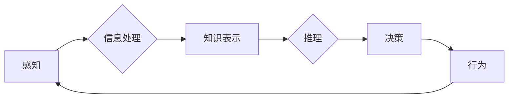

> 认知科学, 形式化理论, 时间序列分析, 认知建模, 行为分析, 人工智能, 机器学习, 时空数据

# 认知的形式化：感知、思维和行为随时间变化在物理空间和认知空间中不停循环

认知科学是研究人类思维、感知和行为的科学。在过去的几十年中，随着信息技术和人工智能的发展，认知科学的研究方法也经历了从定性描述到定量分析的转变。本文旨在探讨认知的形式化，即如何将感知、思维和行为等认知过程用形式化的方法进行描述和分析，并在物理空间和认知空间中表现出随时间变化的动态循环。

## 1. 背景介绍

### 1.1 认知科学的挑战

认知科学是一门跨学科的领域，涉及心理学、神经科学、计算机科学等多个学科。然而，认知科学的研究对象——人类认知——本身具有高度的复杂性和动态性，这使得传统的定性描述方法难以深入揭示认知过程的本质。

### 1.2 形式化方法的优势

形式化方法，如数学建模、符号计算、逻辑推理等，能够将复杂的认知过程转化为可计算、可验证的模型，从而更深入地理解认知过程。形式化方法的优势在于：

- **精确性**：形式化方法能够用精确的数学语言描述认知过程，避免模糊不清的定性描述。
- **可验证性**：形式化方法可以借助计算机进行验证，确保认知模型的正确性和可靠性。
- **可扩展性**：形式化方法能够方便地扩展到新的认知现象和任务。

### 1.3 本文结构

本文将首先介绍认知的形式化方法的基本概念和联系，然后详细阐述基于时间序列分析的认知建模方法，接着探讨认知过程中感知、思维和行为的动态循环，最后展望未来认知科学的发展趋势与挑战。

## 2. 核心概念与联系

### 2.1 形式化理论

形式化理论是认知科学的研究基础，它将认知过程抽象为数学模型，如决策树、贝叶斯网络、图模型等。这些模型能够描述认知过程中的信息处理、知识表示和推理过程。

### 2.2 时间序列分析

时间序列分析是研究随时间变化的序列数据的一种统计方法。在认知科学中，时间序列分析可以用于分析认知过程中的动态变化，如思维过程中的思维轨迹、行为过程中的动作序列等。

### 2.3 认知建模

认知建模是将认知过程转化为数学模型的过程。认知建模可以基于心理学实验数据、神经科学实验数据和人工智能技术。

### 2.4 Mermaid 流程图

以下是一个使用 Mermaid 语法绘制的认知建模流程图：



## 3. 核心算法原理 & 具体操作步骤

### 3.1 算法原理概述

认知的形式化方法主要基于以下几个核心算法原理：

- **信息处理**：信息处理算法用于处理感知信息，如滤波、编码、解码等。
- **知识表示**：知识表示算法用于表示认知过程中的知识，如符号化表示、语义网络等。
- **推理**：推理算法用于基于知识进行逻辑推理，如演绎推理、归纳推理等。
- **决策**：决策算法用于基于推理结果进行决策，如最大似然估计、贝叶斯估计等。
- **行为分析**：行为分析算法用于分析认知过程中的行为表现，如动作序列分析、眼动追踪等。

### 3.2 算法步骤详解

认知的形式化方法的步骤如下：

1. **数据收集**：收集认知过程中的感知数据、行为数据和神经科学数据。
2. **数据预处理**：对收集到的数据进行清洗、去噪和格式化。
3. **模型构建**：基于收集到的数据构建认知模型。
4. **模型验证**：使用实验数据或模拟数据验证认知模型的正确性和可靠性。
5. **模型优化**：根据验证结果优化认知模型。
6. **模型应用**：将认知模型应用于实际问题。

### 3.3 算法优缺点

认知的形式化方法的优点包括：

- **精确性**：形式化方法能够用精确的数学语言描述认知过程。
- **可验证性**：形式化方法可以借助计算机进行验证。
- **可扩展性**：形式化方法能够方便地扩展到新的认知现象和任务。

然而，认知的形式化方法也存在一些缺点，如：

- **复杂性**：认知模型通常比较复杂，难以理解和实现。
- **计算量**：认知模型通常需要大量的计算资源。

### 3.4 算法应用领域

认知的形式化方法在以下领域有广泛的应用：

- **心理学**：用于研究认知过程中的信息处理、知识表示和推理过程。
- **神经科学**：用于研究大脑结构和功能。
- **人工智能**：用于开发智能系统和机器人。
- **教育**：用于开发个性化教育系统。

## 4. 数学模型和公式 & 详细讲解 & 举例说明

### 4.1 数学模型构建

认知的形式化方法常用的数学模型包括：

- **决策树**：用于分类和回归任务。
- **贝叶斯网络**：用于推理和决策。
- **图模型**：用于知识表示和推理。
- **马尔可夫决策过程**：用于决策和优化。

### 4.2 公式推导过程

以下是一个决策树模型的公式推导过程：

- **节点定义**：设 $N$ 为决策树中节点的集合，$L$ 为叶节点的集合。
- **决策函数**：设 $f: N \rightarrow \mathbb{R}$ 为决策函数，用于将节点映射到叶节点。
- **熵**：设 $H(X)$ 为随机变量 $X$ 的熵，定义为 $H(X) = -\sum_{i=1}^n p_i \log_2 p_i$。
- **信息增益**：设 $I(X,Y)$ 为随机变量 $X$ 和 $Y$ 的互信息，定义为 $I(X,Y) = H(X) - H(X|Y)$。
- **决策树构建**：从根节点开始，根据信息增益准则选择最佳分割节点，直到叶节点。

### 4.3 案例分析与讲解

以下是一个基于决策树的文本分类案例：

1. **数据收集**：收集大量标注文本数据。
2. **数据预处理**：对文本数据进行分词、词性标注和停用词过滤。
3. **特征提取**：将文本数据转换为特征向量。
4. **模型训练**：使用决策树算法训练模型。
5. **模型评估**：使用测试数据评估模型性能。

## 5. 项目实践：代码实例和详细解释说明

### 5.1 开发环境搭建

1. 安装 Python。
2. 安装必要的库，如 scikit-learn、numpy、pandas 等。

### 5.2 源代码详细实现

以下是一个基于决策树的文本分类的 Python 代码实例：

```python
from sklearn.datasets import fetch_20newsgroups
from sklearn.feature_extraction.text import CountVectorizer
from sklearn.tree import DecisionTreeClassifier
from sklearn.model_selection import train_test_split
from sklearn.metrics import accuracy_score

# 加载数据集
data = fetch_20newsgroups(subset='all')
vectorizer = CountVectorizer()
X = vectorizer.fit_transform(data.data)
y = data.target

# 划分训练集和测试集
X_train, X_test, y_train, y_test = train_test_split(X, y, test_size=0.3, random_state=42)

# 训练模型
clf = DecisionTreeClassifier()
clf.fit(X_train, y_train)

# 评估模型
y_pred = clf.predict(X_test)
accuracy = accuracy_score(y_test, y_pred)
print(f"Accuracy: {accuracy}")
```

### 5.3 代码解读与分析

上述代码首先加载了 20 个新组数据集，然后使用 CountVectorizer 将文本数据转换为特征向量。接下来，使用 DecisionTreeClassifier 训练模型，并使用测试集评估模型性能。

## 6. 实际应用场景

认知的形式化方法在以下实际应用场景中具有广泛的应用：

- **智能问答系统**：用于构建能够理解自然语言并回答问题的智能问答系统。
- **智能客服系统**：用于构建能够自动处理客户咨询的智能客服系统。
- **智能推荐系统**：用于构建能够根据用户行为和兴趣推荐相关内容的智能推荐系统。
- **医疗诊断系统**：用于构建能够辅助医生进行诊断的智能医疗诊断系统。

## 7. 工具和资源推荐

### 7.1 学习资源推荐

- 《认知科学导论》
- 《认知计算》
- 《人工智能：一种现代的方法》

### 7.2 开发工具推荐

- Python
- Scikit-learn
- TensorFlow
- PyTorch

### 7.3 相关论文推荐

- 《认知科学中的形式化方法》
- 《认知计算：原理与应用》
- 《人工智能：一种现代的方法》

## 8. 总结：未来发展趋势与挑战

### 8.1 研究成果总结

认知的形式化方法为认知科学的研究提供了新的思路和方法，有助于我们更深入地理解认知过程。

### 8.2 未来发展趋势

- **多学科融合**：认知科学将与其他学科，如神经科学、心理学、认知神经科学等，进行更深入的融合。
- **跨领域应用**：认知的形式化方法将在更多领域得到应用，如教育、医疗、金融等。
- **人工智能与认知科学结合**：人工智能技术将与认知科学紧密结合，共同推动认知科学的发展。

### 8.3 面临的挑战

- **认知过程的复杂性**：认知过程非常复杂，难以用简单的数学模型描述。
- **数据获取**：获取高质量的认知科学数据仍然是一个挑战。
- **可解释性**：如何提高认知模型的可解释性是一个重要挑战。

### 8.4 研究展望

认知的形式化方法将为认知科学的发展带来新的机遇和挑战。相信随着技术的不断进步，认知科学将会取得更大的突破。

## 9. 附录：常见问题与解答

**Q1：什么是认知的形式化？**

A：认知的形式化是将认知过程用形式化的方法进行描述和分析，如数学建模、符号计算、逻辑推理等。

**Q2：认知的形式化方法有哪些应用？**

A：认知的形式化方法在心理学、神经科学、人工智能、教育、医疗等领域有广泛的应用。

**Q3：认知的形式化方法有哪些挑战？**

A：认知的形式化方法面临的挑战包括认知过程的复杂性、数据获取和可解释性等。

作者：禅与计算机程序设计艺术 / Zen and the Art of Computer Programming