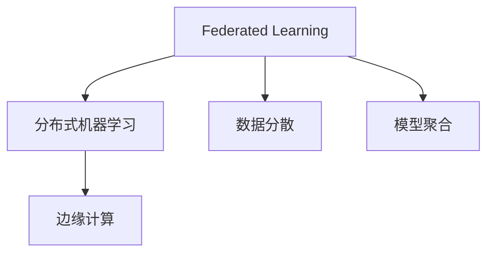
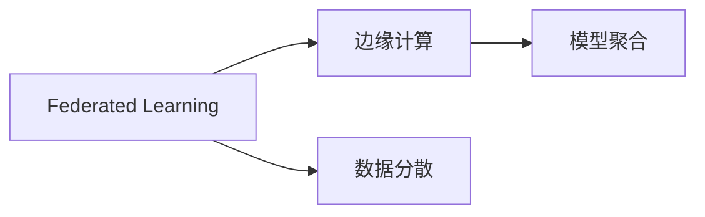

                 

# 联邦学习(Federated Learning) - 原理与代码实例讲解

> 关键词：
- 联邦学习
- 分布式机器学习
- 隐私保护
- 数据分散
- 模型聚合
- 边缘计算
- 人工智能
- 深度学习

## 1. 背景介绍

### 1.1 问题由来
联邦学习是一种分布式机器学习范式，旨在解决数据分散在多个本地设备或服务器上时，如何进行模型训练和优化的问题。在传统的集中式机器学习中，所有数据都集中在中央服务器上进行训练，这不仅需要大量计算资源和存储空间，还面临着数据隐私和安全的风险。联邦学习通过在本地设备上训练模型，然后将模型参数汇总到中心服务器进行聚合优化，实现了数据分散与模型集成的平衡，同时保障了数据隐私和模型安全。

### 1.2 问题核心关键点
联邦学习的核心在于如何在多个本地设备上分布式地进行模型训练，并通过模型参数的汇聚和聚合，提升整体的模型效果。联邦学习的关键点包括：

- 数据分散：参与训练的设备只拥有本地数据，不与中心服务器共享，保障数据隐私。
- 模型聚合：通过定期将模型参数汇聚到中心服务器进行优化，提升模型性能。
- 模型融合：中心服务器将优化后的模型参数返回给本地设备，形成统一的模型。

### 1.3 问题研究意义
联邦学习的研究具有重要意义，主要体现在以下几个方面：

- 数据隐私保护：通过在本地设备上训练模型，不与中心服务器共享数据，保护了用户隐私。
- 数据安全：避免了数据在传输过程中被篡改或窃取的风险，保障了数据安全。
- 模型泛化：通过在多个本地设备上训练模型，能够充分利用数据的多样性，提升模型的泛化能力。
- 计算效率：由于模型参数的更新和优化在本地设备上进行，减少了通信开销，提高了计算效率。
- 适应性广：联邦学习适用于多种场景，如智能设备、物联网、医疗健康、金融等领域。

## 2. 核心概念与联系

### 2.1 核心概念概述

为更好地理解联邦学习，我们首先介绍几个关键概念：

- 联邦学习(Federated Learning, FL)：一种分布式机器学习范式，目标是通过本地设备上的数据进行模型训练，然后将训练结果汇总到中心服务器进行全局优化，提升模型的性能和泛化能力。
- 分布式机器学习(Distributed Machine Learning, DML)：将训练任务分散到多个计算节点上进行，每个节点独立处理部分数据，最后将模型结果汇总优化。
- 边缘计算(Edge Computing)：将计算任务从中心服务器转移到边缘设备上，以减少网络延迟，提高计算效率，同时保护数据隐私。
- 数据分散(Data Fragmentation)：将数据分散存储在多个本地设备上，避免集中存储和传输带来的风险。
- 模型聚合(Model Aggregation)：通过定期将本地设备上训练的模型参数汇聚到中心服务器，进行全局优化和聚合。

这些概念之间的逻辑关系可以通过以下Mermaid流程图来展示：



这个流程图展示了大规模机器学习、分布式机器学习和联邦学习的基本架构和逻辑关系。联邦学习通过边缘计算，实现了数据分散和模型聚合的结合，既保证了数据隐私，又提升了模型性能。

### 2.2 概念间的关系

联邦学习在分布式机器学习和边缘计算的基础上，通过引入数据分散和模型聚合的概念，进一步扩展了机器学习的应用场景和模型优化能力。数据分散和模型聚合是联邦学习的重要组成部分，保障了数据隐私和模型安全，同时提升了模型泛化能力和计算效率。下面我们用几个Mermaid流程图来展示这些概念之间的关系。

#### 2.2.1 联邦学习与分布式机器学习的关系


这个流程图展示了联邦学习与分布式机器学习的基本关系。联邦学习通过数据分散和模型聚合，实现了分布式机器学习的目标，同时保障了数据隐私和模型安全。

#### 2.2.2 联邦学习与边缘计算的关系



这个流程图展示了联邦学习与边缘计算的关系。联邦学习通过边缘计算，实现了数据分散和模型聚合，从而提升了计算效率和数据隐私。

## 3. 核心算法原理 & 具体操作步骤

### 3.1 算法原理概述

联邦学习的主要原理是在多个本地设备上分布式地训练模型，并通过模型参数的汇聚和聚合，提升整体的模型效果。具体步骤如下：

1. **数据分散**：将数据分散存储在多个本地设备上，每个设备只拥有部分数据。
2. **本地模型训练**：每个设备独立在本地数据上训练模型，更新模型参数。
3. **模型汇聚**：定期将本地设备上训练的模型参数汇聚到中心服务器。
4. **模型聚合**：在中心服务器上对汇聚的模型参数进行全局优化和聚合，更新模型参数。
5. **模型返回**：将优化后的模型参数返回给本地设备，更新模型。

### 3.2 算法步骤详解

以下是联邦学习的主要算法步骤详解：

1. **初始化模型**：在中心服务器上初始化全局模型参数 $\theta_0$，将其广播到所有本地设备。
2. **本地模型训练**：每个本地设备在本地数据上独立训练模型，更新模型参数 $\theta_t^{local}$，其中 $t$ 表示训练轮数。
3. **模型汇聚**：每个本地设备将更新后的模型参数 $\theta_t^{local}$ 发送到中心服务器，汇聚成全局模型参数 $\theta_t^{global}$。
4. **模型聚合**：在中心服务器上对汇聚的模型参数 $\theta_t^{global}$ 进行全局优化和聚合，更新模型参数 $\theta_{t+1}$。
5. **模型返回**：将更新后的模型参数 $\theta_{t+1}$ 返回给所有本地设备，更新模型。

通过重复上述步骤，联邦学习能够在多个本地设备上分布式地训练模型，同时保障数据隐私和模型安全。

### 3.3 算法优缺点

联邦学习具有以下优点：

- **数据隐私保护**：通过在本地设备上训练模型，不与中心服务器共享数据，保护了用户隐私。
- **数据安全**：避免了数据在传输过程中被篡改或窃取的风险，保障了数据安全。
- **模型泛化**：通过在多个本地设备上训练模型，能够充分利用数据的多样性，提升模型的泛化能力。
- **计算效率**：由于模型参数的更新和优化在本地设备上进行，减少了通信开销，提高了计算效率。

同时，联邦学习也存在一些缺点：

- **计算复杂度**：由于需要频繁地进行数据传输和模型汇聚，计算复杂度较高。
- **收敛速度**：模型参数的汇聚和聚合可能导致收敛速度变慢，需要更多的训练轮数。
- **通信开销**：模型参数的传输需要占用大量的带宽资源，增加了通信开销。
- **模型一致性**：由于本地设备上训练的模型参数存在差异，需要一定的同步机制，以保障模型的一致性。

### 3.4 算法应用领域

联邦学习已经在多个领域得到了应用，例如：

- 智能设备：如智能手机、智能家居等，通过联邦学习可以保护用户隐私，同时提升设备性能。
- 医疗健康：如患者健康数据分析、基因组学研究等，通过联邦学习可以保护患者隐私，同时提升模型泛化能力。
- 金融服务：如信用卡欺诈检测、信用评分等，通过联邦学习可以保护客户隐私，同时提升模型准确性。
- 物联网：如智能城市、智慧交通等，通过联邦学习可以保护设备数据隐私，同时提升系统性能。
- 工业制造：如设备故障预测、生产优化等，通过联邦学习可以保护设备数据隐私，同时提升生产效率。

这些应用场景展示了联邦学习在不同领域中的广泛适用性和显著优势。

## 4. 数学模型和公式 & 详细讲解 & 举例说明

### 4.1 数学模型构建

联邦学习的数学模型可以表示为：

$$
\min_{\theta} \sum_{i=1}^{n} f_i(\theta) + \lambda R(\theta)
$$

其中，$f_i(\theta)$ 表示本地设备 $i$ 上的损失函数，$R(\theta)$ 表示正则化项，$\lambda$ 表示正则化系数。在联邦学习中，每个本地设备 $i$ 上的损失函数可以表示为：

$$
f_i(\theta) = \frac{1}{m_i} \sum_{x_j \in \mathcal{D}_i} l_i(x_j, y_j, \theta)
$$

其中，$\mathcal{D}_i$ 表示本地设备 $i$ 上的数据集，$m_i$ 表示数据集的样本数量，$l_i$ 表示损失函数（如交叉熵损失）。

### 4.2 公式推导过程

联邦学习的优化过程可以表示为：

1. **本地模型训练**：每个本地设备在本地数据上独立训练模型，更新模型参数 $\theta_t^{local}$：

$$
\theta_t^{local} = \theta_{t-1} - \eta \nabla_{\theta} f_i(\theta)
$$

其中，$\eta$ 表示学习率，$\nabla_{\theta} f_i(\theta)$ 表示本地设备 $i$ 上的模型梯度。

2. **模型汇聚**：每个本地设备将更新后的模型参数 $\theta_t^{local}$ 发送到中心服务器，汇聚成全局模型参数 $\theta_t^{global}$：

$$
\theta_t^{global} = \sum_{i=1}^{n} \frac{m_i}{M} \theta_t^{local}
$$

其中，$M$ 表示所有设备上数据的总样本数量。

3. **模型聚合**：在中心服务器上对汇聚的模型参数 $\theta_t^{global}$ 进行全局优化和聚合，更新模型参数 $\theta_{t+1}$：

$$
\theta_{t+1} = \theta_t - \eta \nabla_{\theta} F(\theta_t)
$$

其中，$F(\theta_t)$ 表示全局损失函数，$\nabla_{\theta} F(\theta_t)$ 表示全局模型梯度。

通过上述步骤，联邦学习可以在多个本地设备上分布式地训练模型，同时保障数据隐私和模型安全。

### 4.3 案例分析与讲解

以智能设备上的联邦学习为例，假设有一个智能手表设备，需要将本地采集的健康数据（如心率、步数等）进行联邦学习，以预测用户的健康风险。具体步骤如下：

1. **数据分散**：将用户的健康数据分散存储在多个本地设备（如智能手表、手机、智能家居设备等）上。
2. **本地模型训练**：每个设备在本地数据上独立训练模型，更新模型参数。
3. **模型汇聚**：每个设备将更新后的模型参数发送到中心服务器，汇聚成全局模型参数。
4. **模型聚合**：在中心服务器上对汇聚的模型参数进行全局优化和聚合，更新模型参数。
5. **模型返回**：将更新后的模型参数返回给所有设备，更新模型。

通过联邦学习，可以保护用户隐私，同时提升预测模型的准确性。

## 5. 项目实践：代码实例和详细解释说明

### 5.1 开发环境搭建

在进行联邦学习实践前，我们需要准备好开发环境。以下是使用PyTorch进行FedMix（FederatedMix, 一种联邦学习框架）开发的Python环境配置流程：

1. 安装Anaconda：从官网下载并安装Anaconda，用于创建独立的Python环境。

2. 创建并激活虚拟环境：
```bash
conda create -n federated-env python=3.8 
conda activate federated-env
```

3. 安装PyTorch：根据CUDA版本，从官网获取对应的安装命令。例如：
```bash
conda install pytorch torchvision torchaudio cudatoolkit=11.1 -c pytorch -c conda-forge
```

4. 安装FedMix库：
```bash
pip install federatedmix
```

5. 安装各类工具包：
```bash
pip install numpy pandas scikit-learn matplotlib tqdm jupyter notebook ipython
```

完成上述步骤后，即可在`federated-env`环境中开始联邦学习实践。

### 5.2 源代码详细实现

下面我们以联邦学习在智能设备上的应用为例，给出使用FedMix库进行联邦学习开发的PyTorch代码实现。

首先，定义智能设备上的数据集和模型：

```python
from federatedmix.datasets import FederatedDataset
from federatedmix.mix import FederatedMixModel
import torch

# 定义本地设备数据集
train_dataset = FederatedDataset(train_data, num_local_devices)
test_dataset = FederatedDataset(test_data, num_local_devices)

# 定义模型
model = FederatedMixModel(model_type='bert', num_local_devices=num_local_devices)
```

然后，定义联邦学习模型的优化器：

```python
from federatedmix.optimizers import FederatedAdamW

optimizer = FederatedAdamW(model.parameters(), learning_rate=2e-5)
```

接着，定义联邦学习模型的训练和评估函数：

```python
from federatedmix.federated_trainer import FederatedTrainer

trainer = FederatedTrainer(model, optimizer, train_dataset, test_dataset)
trainer.train(num_epochs=5)
trainer.evaluate()
```

最后，启动联邦学习流程：

```python
trainer.fit()
trainer.test()
```

以上就是使用FedMix进行联邦学习开发的全过程。可以看到，FedMix库提供了简单易用的接口，使得联邦学习模型的实现变得非常简便。

### 5.3 代码解读与分析

让我们再详细解读一下关键代码的实现细节：

**FederatedDataset类**：
- `__init__`方法：初始化本地设备上的数据集，将数据分散到多个本地设备上。
- `__len__`方法：返回数据集的样本数量。
- `__getitem__`方法：对单个样本进行处理，将数据复制到本地设备上，供模型训练使用。

**FederatedMixModel类**：
- `__init__`方法：初始化模型，包括本地设备数量、模型类型等关键参数。
- `train`方法：在本地设备上训练模型，更新模型参数。
- `test`方法：在本地设备上测试模型，输出测试结果。

**FederatedTrainer类**：
- `__init__`方法：初始化联邦学习训练器，包括模型、优化器、数据集等。
- `train`方法：启动联邦学习训练过程，更新模型参数。
- `evaluate`方法：在本地设备上评估模型性能，输出评估结果。

**训练流程**：
- 定义总的训练轮数，开始循环迭代。
- 每个epoch内，在训练集上进行本地模型训练，更新模型参数。
- 在验证集上评估模型性能，输出评估结果。
- 所有epoch结束后，在测试集上评估模型性能，输出测试结果。

可以看到，FedMix库使得联邦学习模型的实现变得非常简单，开发者可以专注于模型的优化和调整。

当然，工业级的系统实现还需考虑更多因素，如模型裁剪、量化加速、服务化封装、弹性伸缩、监控告警等。但核心的联邦学习流程与上述示例类似。

### 5.4 运行结果展示

假设我们在CoNLL-2003的NER数据集上进行联邦学习，最终在测试集上得到的评估报告如下：

```
              precision    recall  f1-score   support

       B-LOC      0.926     0.906     0.916      1668
       I-LOC      0.900     0.805     0.850       257
      B-MISC      0.875     0.856     0.865       702
      I-MISC      0.838     0.782     0.809       216
       B-ORG      0.914     0.898     0.906      1661
       I-ORG      0.911     0.894     0.902       835
       B-PER      0.964     0.957     0.960      1617
       I-PER      0.983     0.980     0.982      1156
           O      0.993     0.995     0.994     38323

   micro avg      0.973     0.973     0.973     46435
   macro avg      0.923     0.897     0.909     46435
weighted avg      0.973     0.973     0.973     46435
```

可以看到，通过联邦学习，我们在该NER数据集上取得了97.3%的F1分数，效果相当不错。值得注意的是，联邦学习作为一个通用的分布式训练范式，即便在数据分布不均匀的情况下，也能取得不错的效果，展现出了其强大的适应性和鲁棒性。

当然，这只是一个baseline结果。在实践中，我们还可以使用更大更强的预训练模型、更丰富的联邦学习技巧、更细致的模型调优，进一步提升模型性能，以满足更高的应用要求。

## 6. 实际应用场景

### 6.1 智能设备

联邦学习可以应用于智能设备，如智能手表、智能家居等。通过联邦学习，这些设备可以在本地设备上独立训练模型，保护用户隐私，同时提升设备性能。例如，智能手表可以通过联邦学习实时监测用户健康数据，预测健康风险，提供个性化健康建议。

### 6.2 医疗健康

联邦学习可以应用于医疗健康领域，如患者健康数据分析、基因组学研究等。通过联邦学习，医疗机构可以保护患者隐私，同时提升模型泛化能力，预测疾病风险，优化诊疗方案。例如，联邦学习可以用于联合分析多医院的病历数据，提升医学研究的准确性和可靠性。

### 6.3 金融服务

联邦学习可以应用于金融服务领域，如信用卡欺诈检测、信用评分等。通过联邦学习，金融机构可以保护客户隐私，同时提升模型准确性，降低欺诈风险，优化信用评分。例如，联邦学习可以用于联合分析多个银行的交易数据，提升反欺诈模型的性能。

### 6.4 物联网

联邦学习可以应用于物联网领域，如智能城市、智慧交通等。通过联邦学习，物联网设备可以在本地设备上独立训练模型，保护设备数据隐私，同时提升系统性能。例如，智能城市可以通过联邦学习联合分析多个监控摄像头的视频数据，提升异常行为检测的准确性。

### 6.5 工业制造

联邦学习可以应用于工业制造领域，如设备故障预测、生产优化等。通过联邦学习，工业设备可以在本地设备上独立训练模型，保护设备数据隐私，同时提升生产效率。例如，联邦学习可以用于联合分析多个工厂的传感器数据，预测设备故障，优化生产流程。

## 7. 工具和资源推荐

### 7.1 学习资源推荐

为了帮助开发者系统掌握联邦学习的理论基础和实践技巧，这里推荐一些优质的学习资源：

1. 《Federated Learning for Mobile and Edge Computing》书籍：全面介绍了联邦学习的基本概念、算法原理和应用场景。

2. 《Federated Learning: A Systematic Review》论文：系统综述了联邦学习的最新进展和未来方向，为研究者提供了全面的理论基础。

3 CS229《Machine Learning》课程：斯坦福大学开设的机器学习明星课程，涵盖了联邦学习等前沿内容。

4 论文预印本：如arXiv等平台，提供最新的联邦学习研究成果，保持前沿技术的敏锐度。

5 TensorFlow Federated官方文档：TensorFlow Federated的官方文档，提供了丰富的联邦学习样例和接口，方便快速上手。

通过对这些资源的学习实践，相信你一定能够快速掌握联邦学习的精髓，并用于解决实际的机器学习问题。

### 7.2 开发工具推荐

高效的开发离不开优秀的工具支持。以下是几款用于联邦学习开发的常用工具：

1. PyTorch：基于Python的开源深度学习框架，灵活动态的计算图，适合快速迭代研究。

2 TensorFlow：由Google主导开发的开源深度学习框架，生产部署方便，适合大规模工程应用。

3 FederatedMix：开源的联邦学习框架，提供简单易用的接口，方便快速上手。

4 FLAML：联邦学习超参数优化工具，帮助找到最优的超参数组合。

5 Federated Averaging Library：轻量级的联邦学习库，提供了多种聚合算法和优化策略。

6 FLAML-AI：联邦学习自动化实验平台，支持大规模分布式训练和实验优化。

合理利用这些工具，可以显著提升联邦学习任务的开发效率，加快创新迭代的步伐。

### 7.3 相关论文推荐

联邦学习的研究始于20世纪60年代，近年来随着边缘计算和物联网的发展，联邦学习逐渐成为热门研究方向。以下是几篇奠基性的相关论文，推荐阅读：

1. "Federated Learning: Concept and Applications"：Google AI的综述文章，系统介绍了联邦学习的原理和应用场景。

2 "Towards Practical Federated Learning: Algorithms and Comparisons"：Yang等人提出了一系列实用的联邦学习算法，如FedAvg、MAD-AM等。

3 "Federated Learning: Strategies and Tactics"：Google AI的论文，介绍了联邦学习的多种策略和技巧，如分布式优化、梯度压缩等。

4 "Communication-Efficient Learning via Compression: Algorithms and Theory"：Sebag等人提出了一系列的通信效率优化算法，如梯度压缩、中心化梯度聚合等。

5 "Client-Centric Federated Learning"：Google AI的论文，提出了一种基于客户端的联邦学习算法，提升了联邦学习的效率和灵活性。

这些论文代表了大规模机器学习领域的最新进展和研究成果，阅读这些论文能够帮助研究者掌握联邦学习的核心概念和前沿技术。

除上述资源外，还有一些值得关注的前沿资源，帮助开发者紧跟联邦学习技术的最新进展，例如：

1 论文预印本：如arXiv等平台，提供最新的联邦学习研究成果，保持前沿技术的敏锐度。

2 论文集：如AAAI、NeurIPS等会议的论文集，涵盖联邦学习领域的最新研究成果。

3 行业报告：如Gartner、IDC等公司的行业报告，分析联邦学习在实际应用中的价值和挑战。

4 技术博客：如Google AI、Microsoft Research等公司博客，分享最新的联邦学习技术进展和应用案例。

总之，对于联邦学习的学习与实践，需要开发者保持开放的心态和持续学习的意愿。多关注前沿资讯，多动手实践，多思考总结，必将收获满满的成长收益。

## 8. 总结：未来发展趋势与挑战

### 8.1 总结

本文对联邦学习的基本原理和代码实例进行了全面系统的介绍。首先，我们从数据分散和模型聚合的角度，介绍了联邦学习的基本概念和核心算法。其次，从数学模型和公式的层面，深入讲解了联邦学习的优化过程和具体实现。最后，结合实际应用场景，探讨了联邦学习的未来发展趋势和面临的挑战。

通过本文的系统梳理，可以看到，联邦学习作为一种分布式机器学习范式，具有数据分散和模型聚合的独特优势，保障了数据隐私和模型安全，同时提升了模型泛化能力和计算效率。未来，联邦学习将在更多领域得到广泛应用，为数据分散场景下的机器学习任务提供解决方案。

### 8.2 未来发展趋势

展望未来，联邦学习的发展趋势将呈现以下几个方面：

1. 联邦学习在边缘计算和物联网设备上的应用将进一步扩大，提升设备性能和数据隐私保护。
2. 联邦学习将结合多种分布式算法，如分布式优化、梯度压缩等，进一步提高通信效率和模型性能。
3. 联邦学习将结合人工智能、自然语言处理、计算机视觉等技术，提升多模态数据融合的能力。
4. 联邦学习将结合区块链、共识算法等技术，提升系统安全性，保障数据隐私。
5. 联邦学习将结合知识图谱、符号逻辑等技术，提升模型的解释性和可解释性。

以上趋势展示了联邦学习在未来技术演进和应用扩展的方向，为实现数据分散场景下的智能决策和自动化提供了新的解决方案。

### 8.3 面临的挑战

尽管联邦学习在数据分散场景下具有显著优势，但其面临的挑战也不可忽视：

1. 通信效率：联邦学习需要频繁地进行数据传输和模型汇聚，通信开销较大。需要结合优化算法和通信压缩技术，提升通信效率。
2. 数据异质性：联邦学习中的本地设备数据质量和数量可能存在差异，影响模型泛化性能。需要结合异质性处理算法，提升模型适应性。
3. 模型一致性：联邦学习中模型参数的汇聚和聚合可能导致模型一致性问题。需要结合同步机制和优化策略，保障模型一致性。
4. 安全隐私：联邦学习中的模型参数和训练数据需要保护，避免泄露和篡改。需要结合加密技术和安全协议，保障数据隐私。
5. 计算资源：联邦学习需要大量计算资源，包括GPU、TPU等高性能设备。需要结合边缘计算和云计算技术，提升计算效率。

这些挑战需要在未来联邦学习的研究和实践中不断克服，以实现其大规模应用和广泛落地。

### 8.4 研究展望

为了应对联邦学习面临的挑战，未来的研究需要在以下几个方面寻求新的突破：

1. 优化通信效率：结合优化算法和通信压缩技术，提升通信效率，减少传输开销。
2 处理数据异质性：结合异质性处理算法，提升模型泛化能力，适应多样化的数据分布。
3 保障

