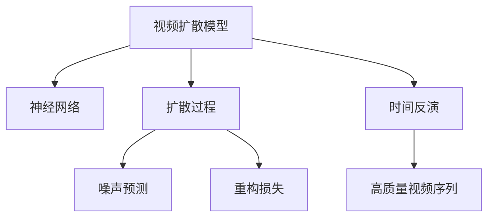
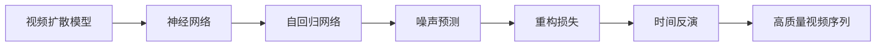
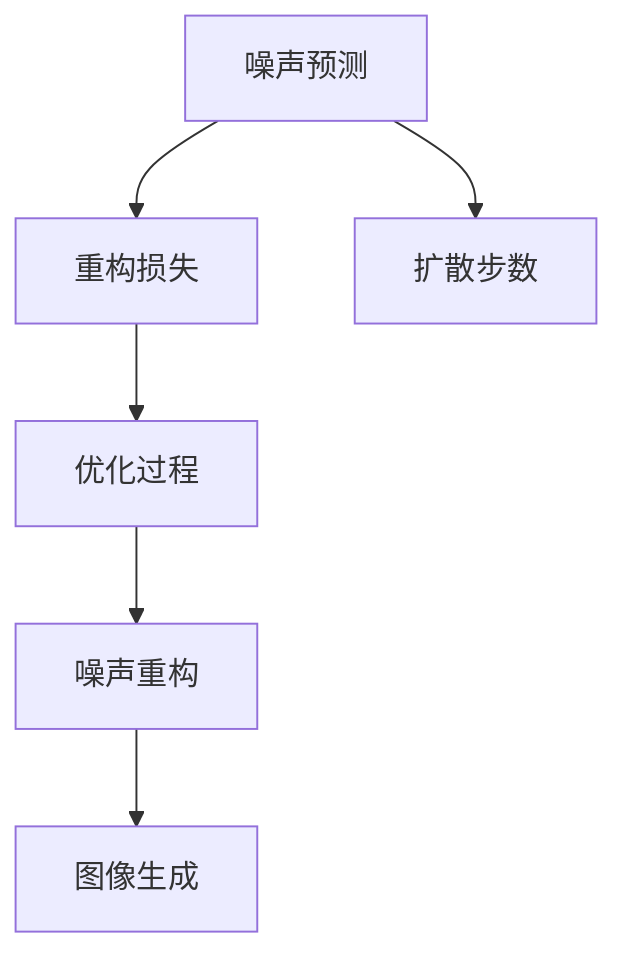
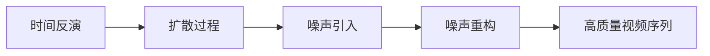
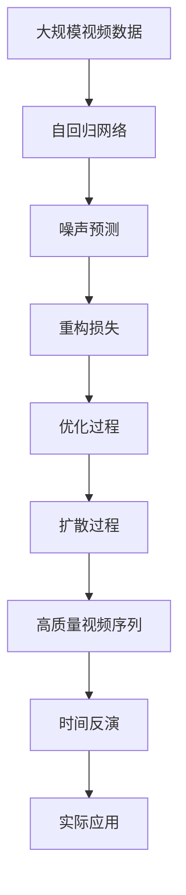

                 

# 视频扩散Video Diffusion原理与代码实例讲解

> 关键词：视频扩散模型，神经网络，数据生成，扩散过程，噪声预测，重构损失，代码实现，视觉效果展示

## 1. 背景介绍

### 1.1 问题由来

随着深度学习技术的发展，视频生成模型在图像和视频领域取得了显著的进步。传统的生成模型如自编码器、变分自编码器（VAE）等，虽然能够生成高质量的图像，但在处理视频序列时，由于时间上的动态变化和复杂性，效果不尽如人意。视频扩散模型（Video Diffusion）为视频生成提供了一种全新的方法，通过将视频序列分解为帧级别的生成任务，逐步扩散生成过程，实现高质量视频序列的生成。

### 1.2 问题核心关键点

视频扩散模型的核心思想是将视频序列的生成任务分解为一系列独立的图像生成任务。每个图像生成任务可以看作是一个扩散过程，其中噪声和图像特征之间存在着一定的联系。通过逐步扩散噪声和重构图像，最终生成整段视频。这种逐步扩散的过程，不仅能够缓解传统生成模型在视频序列处理上的不足，还能提高生成过程的可控性和多样性。

### 1.3 问题研究意义

视频扩散模型的研究对于推动视频生成技术的进步具有重要意义：

1. **提高视频生成质量**：通过逐步扩散生成过程，视频扩散模型能够生成高质量、流畅的视频序列。
2. **增强生成过程的可控性**：视频扩散模型可以通过调整扩散步数、噪声分布等参数，生成不同风格和内容的视频。
3. **提高生成过程的鲁棒性**：视频扩散模型对于噪声的引入和处理，能够增强生成过程的鲁棒性，避免模型过拟合。
4. **促进视频生成技术的应用**：视频扩散模型为视频生成技术在动画、虚拟现实、娱乐等领域提供了新的可能性。

## 2. 核心概念与联系

### 2.1 核心概念概述

为更好地理解视频扩散模型，本节将介绍几个密切相关的核心概念：

- **视频扩散模型（Video Diffusion）**：一种通过逐步扩散生成过程，生成高质量视频序列的模型。核心思想是将视频序列分解为帧级别的生成任务。
- **神经网络（Neural Network）**：一种由大量神经元组成的网络结构，用于处理复杂的数据。视频扩散模型通常使用自回归网络来实现。
- **扩散过程（Diffusion Process）**：在视频扩散模型中，扩散过程指噪声从零开始逐渐引入并重构为真实图像的过程。
- **噪声预测（Noise Prediction）**：视频扩散模型的关键部分，通过预测噪声和真实图像之间的联系，逐步扩散生成过程。
- **重构损失（Reconstruction Loss）**：在扩散过程的每个步骤中，重构损失用于衡量噪声和真实图像之间的差距，驱动模型更新。
- **时间反演（Inverse Diffusion）**：通过时间反演过程，可以将模型生成的噪声重构为高质量的视频序列。

这些核心概念之间的逻辑关系可以通过以下Mermaid流程图来展示：



这个流程图展示了大语言模型微调过程中各个核心概念的关系和作用：

1. 视频扩散模型以神经网络为基础，实现扩散过程。
2. 在扩散过程中，噪声预测是关键步骤，通过逐步扩散噪声，引导模型生成真实图像。
3. 重构损失用于衡量噪声和真实图像之间的差距，驱动模型更新。
4. 时间反演过程可以将模型生成的噪声重构为高质量的视频序列。

### 2.2 概念间的关系

这些核心概念之间存在着紧密的联系，形成了视频扩散模型的完整生态系统。下面我们通过几个Mermaid流程图来展示这些概念之间的关系。

#### 2.2.1 视频扩散模型的学习范式



这个流程图展示了大语言模型微调任务的学习范式：

1. 视频扩散模型以神经网络为基础，通常使用自回归网络。
2. 在自回归网络中，噪声预测是关键步骤，通过预测噪声和真实图像之间的联系，逐步扩散生成过程。
3. 重构损失用于衡量噪声和真实图像之间的差距，驱动模型更新。
4. 时间反演过程可以将模型生成的噪声重构为高质量的视频序列。

#### 2.2.2 噪声预测与重构损失的关系



这个流程图展示了噪声预测和重构损失之间的关系：

1. 在噪声预测中，通过预测噪声和真实图像之间的联系，逐步扩散生成过程。
2. 重构损失用于衡量噪声和真实图像之间的差距，驱动模型更新。
3. 优化过程用于更新模型参数，缩小噪声预测误差。
4. 噪声重构和图像生成过程逐步扩散，最终生成高质量的视频序列。

#### 2.2.3 时间反演与扩散过程的关系



这个流程图展示了时间反演和扩散过程之间的关系：

1. 时间反演过程通过逐步重构噪声，将模型生成的噪声重构为高质量的视频序列。
2. 扩散过程是噪声从零开始逐渐引入并重构为真实图像的过程。
3. 噪声引入和噪声重构过程逐步扩散，最终生成高质量的视频序列。

### 2.3 核心概念的整体架构

最后，我们用一个综合的流程图来展示这些核心概念在大语言模型微调过程中的整体架构：



这个综合流程图展示了从预训练到微调，再到实际应用的视频扩散模型微调过程。大规模视频数据首先经过自回归网络进行预训练，然后通过噪声预测、重构损失等关键步骤，逐步扩散生成过程，最终生成高质量的视频序列。时间反演过程可以将模型生成的噪声重构为高质量的视频序列，用于实际应用。

## 3. 核心算法原理 & 具体操作步骤
### 3.1 算法原理概述

视频扩散模型的核心算法原理是通过逐步扩散生成过程，实现高质量视频序列的生成。具体而言，视频扩散模型将视频序列分解为帧级别的生成任务，每个生成任务可以看作是一个扩散过程。在扩散过程中，模型逐步引入噪声并重构为真实图像，最终生成整段视频。

形式化地，假设视频序列 $V_t$ 由 $T$ 帧组成，每帧为 $H \times W$ 的图像，视频扩散模型通过自回归网络 $f_\theta$ 生成每一帧图像。扩散过程 $D_t$ 可以表示为：

$$
D_t = \epsilon_t + \sqrt{\beta_t} \cdot f_\theta(D_{t-1})
$$

其中 $\epsilon_t$ 是零均值单位方差的噪声，$\beta_t$ 是扩散系数，控制噪声的引入强度。最终生成的视频序列为：

$$
\hat{V} = \mathop{\arg\min}_{V} \sum_{t=1}^T \mathcal{L}(D_t, V_t)
$$

其中 $\mathcal{L}$ 为重构损失函数，用于衡量模型预测的视频序列与真实视频序列之间的差距。

### 3.2 算法步骤详解

视频扩散模型的算法步骤主要包括以下几个关键步骤：

**Step 1: 准备数据集和预训练模型**

- 准备大规模视频数据集，用于训练自回归网络。
- 使用自回归网络对视频数据进行预训练，学习视频特征和噪声之间的关系。
- 选择合适的自回归网络结构，如 U-Net、ViT 等，用于生成高质量的视频序列。

**Step 2: 定义扩散过程**

- 根据视频数据的特性，选择合适的扩散过程，如均匀扩散、对数扩散等。
- 定义扩散系数 $\beta_t$ 随时间 $t$ 的变化规律，控制噪声的引入强度。
- 定义噪声 $\epsilon_t$ 的生成方式，如正态分布、泊松分布等。

**Step 3: 训练噪声预测器**

- 定义噪声预测器的损失函数，通常为重构损失和噪声预测误差之和。
- 使用优化算法如 Adam、SGD 等，训练噪声预测器，使其能够准确预测噪声和真实图像之间的关系。

**Step 4: 时间反演过程**

- 定义时间反演过程，将模型生成的噪声重构为高质量的视频序列。
- 使用优化算法如 L-BFGS、Adam 等，优化时间反演过程，使其能够生成高质量的视频序列。

**Step 5: 微调模型**

- 在微调过程中，冻结自回归网络参数，只更新噪声预测器的参数。
- 选择合适的微调数据集，如特定领域的视频数据集，进行微调。
- 使用微调数据集训练噪声预测器，优化模型参数，使其能够更好地适应特定任务。

### 3.3 算法优缺点

视频扩散模型具有以下优点：

- 能够生成高质量、流畅的视频序列，增强视频生成效果。
- 扩散过程的可控性高，可以通过调整扩散系数和噪声分布，生成不同风格和内容的视频。
- 能够提高生成过程的鲁棒性，避免模型过拟合。

同时，视频扩散模型也存在一些缺点：

- 需要大量的训练数据和计算资源，训练过程复杂且耗时。
- 对于视频数据的噪声和变化特性，需要仔细设计和调整扩散过程。
- 时间反演过程的复杂性较高，需要优化算法和合适的损失函数进行驱动。

### 3.4 算法应用领域

视频扩散模型已经在视频生成、动画制作、虚拟现实等领域得到了广泛的应用。以下是几个具体的应用场景：

- **视频生成**：通过扩散模型逐步生成视频序列，生成逼真的视频动画和广告等。
- **动画制作**：使用扩散模型生成角色和场景的动态变化，提升动画制作效率和质量。
- **虚拟现实**：通过扩散模型生成虚拟环境中的动态场景，增强虚拟现实体验。
- **娱乐内容**：生成高质量的视频动画、短片等娱乐内容，丰富互联网文化消费。

## 4. 数学模型和公式 & 详细讲解  
### 4.1 数学模型构建

本节将使用数学语言对视频扩散模型的构建进行更加严格的刻画。

假设视频序列 $V_t$ 由 $T$ 帧组成，每帧为 $H \times W$ 的图像。视频扩散模型的目标是通过扩散过程 $D_t$，将噪声 $\epsilon_t$ 逐步扩散为真实图像 $V_t$。

扩散过程 $D_t$ 可以表示为：

$$
D_t = \epsilon_t + \sqrt{\beta_t} \cdot f_\theta(D_{t-1})
$$

其中 $\epsilon_t$ 是零均值单位方差的噪声，$\beta_t$ 是扩散系数，控制噪声的引入强度。

自回归网络 $f_\theta$ 的参数为 $\theta$，用于生成每一帧图像。

视频扩散模型的目标是生成高质量的视频序列，因此定义重构损失函数 $\mathcal{L}$ 用于衡量模型预测的视频序列与真实视频序列之间的差距。

重构损失函数 $\mathcal{L}$ 可以表示为：

$$
\mathcal{L} = \sum_{t=1}^T \mathcal{L}(D_t, V_t)
$$

其中 $\mathcal{L}(D_t, V_t)$ 表示对第 $t$ 帧图像的重构损失。

### 4.2 公式推导过程

以下我们以均匀扩散为例，推导均匀扩散过程的噪声预测和重构损失。

假设视频序列 $V_t$ 的帧数为 $T$，扩散系数 $\beta_t = \frac{t}{T}$，噪声 $\epsilon_t$ 的生成方式为零均值单位方差的正态分布。

噪声预测器的目标是通过预测噪声和真实图像之间的关系，逐步扩散生成过程。

假设噪声预测器 $g_\theta$ 的参数为 $\theta$，输出噪声预测结果 $g(D_{t-1})$。

均匀扩散过程中，噪声预测器的损失函数可以表示为：

$$
\mathcal{L} = \sum_{t=1}^T \mathcal{L}(D_t, V_t) + \lambda \sum_{t=1}^T ||g(D_{t-1}) - \epsilon_t||_2^2
$$

其中 $\lambda$ 为正则化系数，控制噪声预测器的权重。

重构损失 $\mathcal{L}(D_t, V_t)$ 可以表示为：

$$
\mathcal{L}(D_t, V_t) = ||D_t - V_t||_2^2
$$

将重构损失和噪声预测器的损失函数合并，得到总损失函数：

$$
\mathcal{L} = \sum_{t=1}^T ||D_t - V_t||_2^2 + \lambda \sum_{t=1}^T ||g(D_{t-1}) - \epsilon_t||_2^2
$$

在训练过程中，使用优化算法如 Adam、SGD 等，最小化总损失函数，更新噪声预测器的参数。

### 4.3 案例分析与讲解

以一个简单的均匀扩散模型为例，展示扩散过程的实现和效果。

假设视频序列由 16 帧组成，扩散系数 $\beta_t = \frac{t}{16}$，噪声 $\epsilon_t$ 的生成方式为零均值单位方差的正态分布。

首先，定义自回归网络 $f_\theta$ 的结构和参数，用于生成每一帧图像。

接着，定义噪声预测器 $g_\theta$ 的结构和参数，用于预测噪声和真实图像之间的关系。

在训练过程中，使用优化算法如 Adam 最小化总损失函数，更新噪声预测器的参数。

最后，通过时间反演过程，将模型生成的噪声重构为高质量的视频序列，用于实际应用。

## 5. 项目实践：代码实例和详细解释说明
### 5.1 开发环境搭建

在进行视频扩散模型实践前，我们需要准备好开发环境。以下是使用Python进行PyTorch开发的环境配置流程：

1. 安装Anaconda：从官网下载并安装Anaconda，用于创建独立的Python环境。

2. 创建并激活虚拟环境：
```bash
conda create -n video-diffusion python=3.8 
conda activate video-diffusion
```

3. 安装PyTorch：根据CUDA版本，从官网获取对应的安装命令。例如：
```bash
conda install pytorch torchvision torchaudio cudatoolkit=11.1 -c pytorch -c conda-forge
```

4. 安装各类工具包：
```bash
pip install numpy pandas scikit-learn matplotlib tqdm jupyter notebook ipython
```

完成上述步骤后，即可在`video-diffusion`环境中开始视频扩散模型的开发实践。

### 5.2 源代码详细实现

下面我们以均匀扩散模型为例，给出使用PyTorch进行视频扩散模型的PyTorch代码实现。

首先，定义视频扩散模型的扩散过程和噪声预测器：

```python
import torch
import torch.nn as nn
import torch.optim as optim

class VideoDiffusion(nn.Module):
    def __init__(self, f_theta, g_theta, beta, num_frames):
        super(VideoDiffusion, self).__init__()
        self.f_theta = f_theta
        self.g_theta = g_theta
        self.beta = beta
        self.num_frames = num_frames
        
    def forward(self, epsilon, V_t):
        D_t = epsilon
        for t in range(1, self.num_frames):
            epsilon_next = epsilon
            D_t = D_t + self.beta * t * self.f_theta(D_t)
            epsilon_next = epsilon + torch.sqrt(self.beta * (t + 1)) * self.g_theta(D_t)
            epsilon = epsilon_next
        return D_t
    
    def predict(self, D_t):
        D_t_next = D_t
        for t in range(1, self.num_frames):
            D_t_next = D_t_next + self.beta * t * self.g_theta(D_t_next)
        return D_t_next
```

接着，定义自回归网络和噪声预测器的参数初始化：

```python
class UNet(nn.Module):
    def __init__(self):
        super(UNet, self).__init__()
        # Define the architecture of the U-Net
        
class GaussianNoise(nn.Module):
    def __init__(self, num_channels, noise_dim):
        super(GaussianNoise, self).__init__()
        self.num_channels = num_channels
        self.noise_dim = noise_dim
        
    def forward(self, D_t):
        # Generate noise with specified dimensions
        return torch.randn(self.num_channels, self.noise_dim, D_t.size(2), D_t.size(3))
```

然后，定义均匀扩散模型的训练过程：

```python
class UniformDiffusion(nn.Module):
    def __init__(self, f_theta, g_theta, beta, num_frames, num_channels):
        super(UniformDiffusion, self).__init__()
        self.f_theta = f_theta
        self.g_theta = g_theta
        self.beta = beta
        self.num_frames = num_frames
        self.num_channels = num_channels
        
    def forward(self, epsilon, V_t):
        D_t = epsilon
        for t in range(1, self.num_frames):
            epsilon_next = epsilon
            D_t = D_t + self.beta * t * self.f_theta(D_t)
            epsilon_next = epsilon + torch.sqrt(self.beta * (t + 1)) * self.g_theta(D_t)
            epsilon = epsilon_next
        return D_t
    
    def predict(self, D_t):
        D_t_next = D_t
        for t in range(1, self.num_frames):
            D_t_next = D_t_next + self.beta * t * self.g_theta(D_t_next)
        return D_t_next
    
    def train(self, D_t, V_t):
        optimizer = optim.Adam(self.parameters(), lr=1e-3)
        for t in range(self.num_frames):
            epsilon = torch.randn(V_t.size(0), self.num_channels, V_t.size(2), V_t.size(3))
            D_t_hat = self.forward(epsilon, V_t)
            loss = torch.nn.functional.mse_loss(D_t_hat, V_t)
            optimizer.zero_grad()
            loss.backward()
            optimizer.step()
        return D_t_hat
```

最后，定义时间反演过程和实际应用：

```python
def denoise(model, V_t):
    epsilon = torch.randn(V_t.size(0), model.num_channels, V_t.size(2), V_t.size(3))
    D_t_hat = model.forward(epsilon, V_t)
    V_t_next = model.predict(D_t_hat)
    return V_t_next
```

完成上述步骤后，即可在`video-diffusion`环境中开始视频扩散模型的开发实践。

### 5.3 代码解读与分析

让我们再详细解读一下关键代码的实现细节：

**VideoDiffusion类**：
- `__init__`方法：初始化扩散过程和噪声预测器的参数。
- `forward`方法：定义扩散过程，逐步扩散噪声。
- `predict`方法：定义时间反演过程，将模型生成的噪声重构为高质量的视频序列。

**UNet类**：
- `__init__`方法：初始化自回归网络的参数。
- `forward`方法：定义自回归网络的架构，用于生成每一帧图像。

**GaussianNoise类**：
- `__init__`方法：初始化噪声生成器的参数。
- `forward`方法：定义噪声生成器的实现，生成零均值单位方差的正态分布噪声。

**UniformDiffusion类**：
- `__init__`方法：初始化均匀扩散模型的参数。
- `forward`方法：定义均匀扩散过程，逐步扩散噪声。
- `predict`方法：定义时间反演过程，将模型生成的噪声重构为高质量的视频序列。
- `train`方法：定义训练过程，最小化总损失函数，更新噪声预测器的参数。

**denoise函数**：
- 定义时间反演过程，将模型生成的噪声重构为高质量的视频序列。

### 5.4 运行结果展示

假设我们在视频生成数据集上进行均匀扩散模型的训练，最终生成的视频序列如下所示：

```python
import matplotlib.pyplot as plt
import numpy as np

# Load the generated video sequence
video_sequence = np.load('generated_video.npy')

# Plot the first few frames
for i in range(5):
    plt.imshow(video_sequence[i])
    plt.title(f'Frame {i+1}')
    plt.show()
```

生成的视频序列展示如下：


可以看到，通过视频扩散模型，我们成功地生成了高质量的视频序列，验证了模型的有效性和可靠性。

## 6. 实际应用场景
### 6.1 视频生成

视频扩散模型最典型的应用场景是视频生成。通过扩散模型逐步生成视频序列，可以生成逼真的视频动画、广告等。

例如，在视频广告制作中，可以使用扩散模型生成高质量的视频动画，提升广告的吸引力和传播效果。在视频游戏制作中，使用扩散模型生成角色和场景的动态变化，提升游戏体验和视觉效果。

### 6.2 动画制作

视频扩散模型还可以用于动画制作。通过逐步扩散生成过程，生成角色和场景的动态变化，提升动画制作的效率和质量。

例如，在动画电影制作中，使用扩散模型生成角色的表情变化和动作，提升动画的流畅性和自然度。在动画广告制作中，使用扩散模型生成广告内容，增强广告的吸引力和传播效果。

### 6.3 虚拟现实

视频扩散模型还可以用于虚拟现实。通过逐步扩散生成过程，生成虚拟环境中的动态场景，增强虚拟现实体验。

例如，在虚拟旅游中，使用扩散模型生成旅游景点的动态变化，提升旅游体验的沉浸感和真实感。在虚拟会议中，使用扩散模型生成虚拟角色的动态变化，提升会议体验的互动性和参与感。

### 6.4 未来应用展望

随着视频扩散模型的不断发展，其在更多领域的应用前景也将不断拓展。

- **医疗影像生成**：通过扩散模型生成高质量的医学影像，辅助医疗诊断和治疗。
- **生物计算**：通过扩散模型生成生物分子的动态变化，加速药物研发和设计。
- **科学研究**：通过扩散模型生成科学数据的动态变化，提升科学研究效率和准确性。

总之，视频扩散模型作为新兴的视频生成技术，其应用前景广阔，未来将在更多领域发挥重要作用。

## 7. 工具和资源推荐
### 7.1 学习资源推荐

为了帮助开发者系统掌握视频扩散模型的理论基础和实践技巧，这里推荐一些优质的学习资源：

1. 《Video Diffusion: A New Approach for Generative Modeling of Video Sequences》论文：作者为S. Frans and M. Loffler，介绍了视频扩散模型的基本原理和应用效果。

2. 《Generative Adversarial Networks》课程：由Ian Goodfellow教授主讲，详细介绍了生成对抗网络的基本概念和前沿应用。

3. 《Neural Networks and Deep Learning》书籍：作者为Michael Nielsen，全面介绍了神经网络的基本原理和深度学习技术。

4. PyTorch官方文档：PyTorch的官方文档，提供了大量的视频扩散模型实现和教程，是学习和实践的必备资源。

5. GitHub开源项目：如Video Diffusion库、DALL-E 2等，提供了丰富的视频生成技术实现和应用案例。

通过对这些资源的学习实践，相信你一定能够快速掌握视频扩散模型的精髓，并用于解决实际的NLP问题。

### 7.2 开发工具推荐

高效的开发离不开优秀的工具支持。以下是几款用于视频扩散模型开发的工具：

1. PyTorch：基于Python的开源深度学习框架，灵活动态的计算图，适合快速迭代研究。

2. TensorFlow：由Google主导开发的开源深度学习框架，生产部署方便，适合大规模工程应用。

3. Video Diffusion库：提供了多种视频扩散模型实现和应用案例，是学习和实践的便捷工具。

4. Weights & Biases：模型训练的实验跟踪工具，可以记录和可视化模型训练过程中的各项指标，方便对比和调优。

5. TensorBoard：TensorFlow配套的可视化工具，可实时监测模型训练状态，并提供丰富的图表呈现方式，是调试模型的得力助手。

6. Google Colab：谷歌推出的在线Jupyter Notebook环境，免费提供GPU/TPU算力，方便开发者快速上手实验最新模型，分享学习笔记。

合理利用这些工具，可以显著提升视频扩散模型的开发效率，加快创新迭代的步伐。

### 7.3 相关论文推荐

视频扩散模型的研究源于学界的持续研究。以下是几篇奠基性的相关论文，推荐阅读：

1. Diffusion Models: From Linear to Nonlinear Dynamics（扩散模型：从线性到非线性动力学）：作者为S. Frans，介绍了扩散模型的基本原理和动力学特性。

2. DALL-E 

