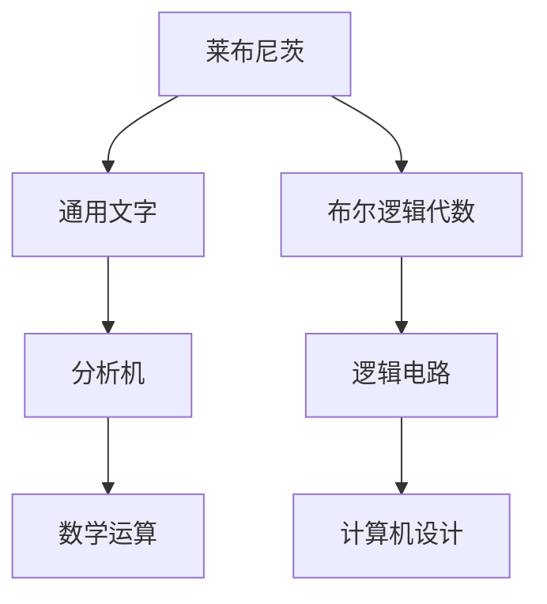
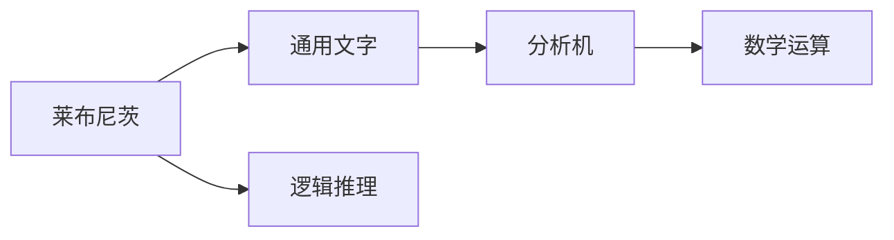
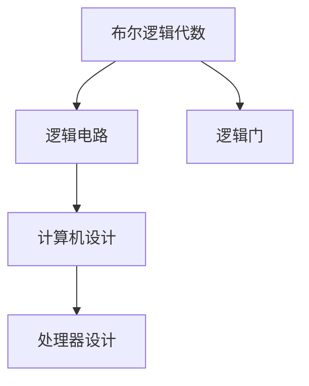
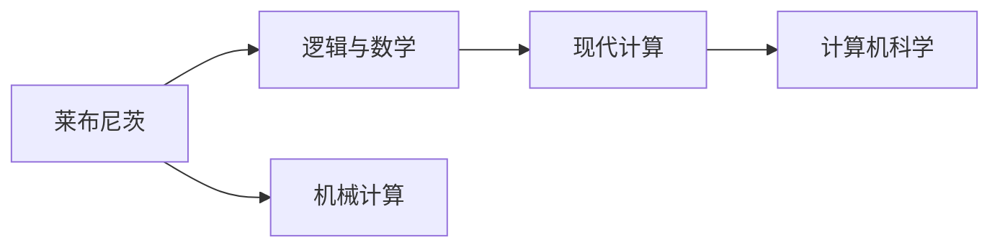
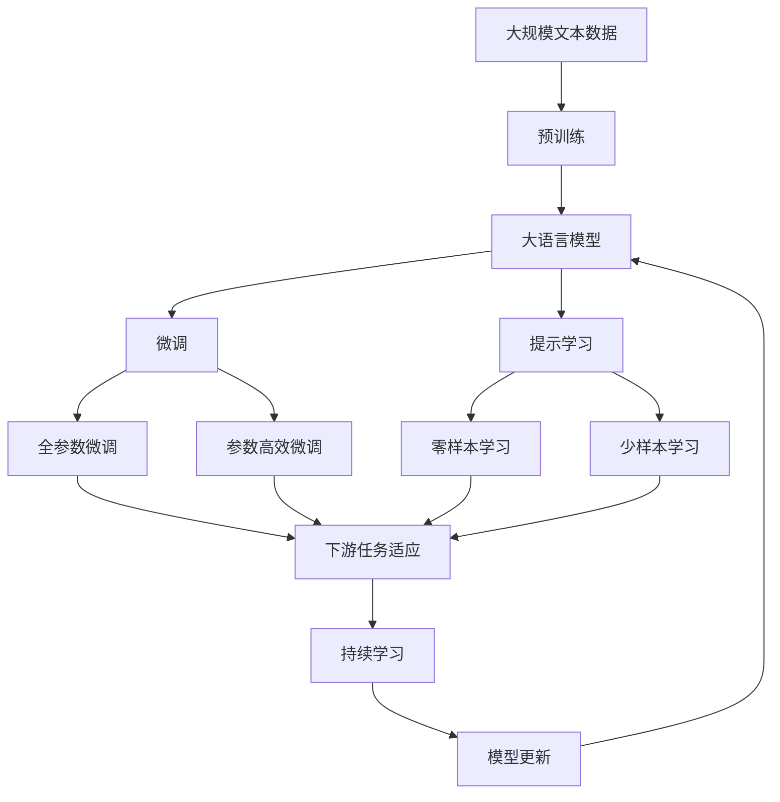

                 

# 计算：第一部分 计算的诞生 第 3 章 莱布尼茨的计算之梦 布尔的逻辑代数

> 关键词：计算历史, 莱布尼茨, 逻辑代数, 布尔, 数学基础

## 1. 背景介绍

### 1.1 问题由来
在人类文明的漫长历程中，计算始终是一个核心议题。从早期的结绳计数，到后来的算盘与机械计算器，再到现代电子计算机的诞生，计算工具的演进映射出人类对知识的不断探索与追求。计算不仅是科学与技术的前沿领域，更是人类文明进步的基石。然而，面对复杂的计算问题，如何建立一套科学而完备的计算体系，一直是众多思想家、数学家与工程师不断思索和探索的主题。

### 1.2 问题核心关键点
本章将聚焦于计算领域的先驱者之一莱布尼茨（Gottfried Wilhelm Leibniz），以及布尔（George Boole）在逻辑代数领域的开创性工作，探索他们对现代计算思想和逻辑基础的贡献。莱布尼茨通过“通用文字”（Universal Characteristic）、“分析机”（Analytical Engine）等设想，开启了计算机科学的先河；而布尔的逻辑代数理论，则为现代计算机的逻辑电路设计奠定了基础。这些工作不仅奠定了计算机科学的基础，也为后续计算范式和算法的创新提供了源泉。

### 1.3 问题研究意义
研究莱布尼茨和布尔在计算领域的开创性工作，对于理解计算机科学的发展历程、掌握现代计算思想与逻辑基础，具有重要意义：

1. 揭示计算思想的源泉：莱布尼茨和布尔的思想为现代计算技术的发展提供了理论基础。
2. 理解逻辑与计算的关系：逻辑代数不仅是一种数学工具，更是现代计算的核心。
3. 掌握计算机科学的基本原理：本章将深入讲解逻辑代数的基本概念，帮助读者建立计算思维。
4. 激发创新灵感：理解先驱者的计算思想，有助于在现有框架下进行突破和创新。

## 2. 核心概念与联系

### 2.1 核心概念概述

为更好地理解莱布尼茨和布尔的计算思想，本节将介绍几个核心概念：

- 莱布尼茨（Gottfried Wilhelm Leibniz）：17世纪德国哲学家、数学家，被认为是与牛顿齐名的伟大科学家。他在数学、物理学、逻辑学等领域都有卓越贡献。
- 布尔逻辑代数：由英国数学家布尔（George Boole）在19世纪提出，是现代逻辑与计算机科学的基础。
- 分析机（Analytical Engine）：莱布尼茨设想的一种机械计算机，旨在通过机械装置进行复杂的数学运算与逻辑推理。
- 通用文字（Universal Characteristic）：莱布尼茨提出的一种数学符号系统，用于表达逻辑和数学概念。
- 逻辑电路：在现代计算机中，逻辑代数被广泛应用于电路设计，用于实现基本的逻辑运算与数据处理。

这些核心概念之间的联系可以通过以下Mermaid流程图来展示：



这个流程图展示了几位先驱者在计算领域的贡献及其相互关系：

1. 莱布尼茨通过通用文字和分析机等设想，为计算机科学的诞生奠定了理论基础。
2. 布尔的逻辑代数理论，为现代逻辑电路和计算机设计提供了数学工具。
3. 逻辑电路设计是现代计算机的重要组成部分，反映了逻辑代数理论的应用。
4. 现代计算机的构建，受制于莱布尼茨和布尔的思想影响，体现了计算领域发展的连贯性。

### 2.2 概念间的关系

这些核心概念之间存在着紧密的联系，形成了计算思想和逻辑基础的基本生态系统。下面我通过几个Mermaid流程图来展示这些概念之间的关系。

#### 2.2.1 莱布尼茨的计算范式



这个流程图展示了莱布尼茨通过通用文字和分析机进行数学运算与逻辑推理的过程。

#### 2.2.2 布尔逻辑代数与计算机设计



这个流程图展示了布尔逻辑代数如何应用于逻辑电路设计，进一步指导计算机的处理器设计。

#### 2.2.3 莱布尼茨与布尔的贡献



这个流程图展示了莱布尼茨和布尔对现代计算和计算机科学发展的影响。

### 2.3 核心概念的整体架构

最后，我们用一个综合的流程图来展示这些核心概念在大语言模型微调过程中的整体架构：



这个综合流程图展示了从预训练到微调，再到持续学习的完整过程。大语言模型首先在大规模文本数据上进行预训练，然后通过微调（包括全参数微调和参数高效微调）或提示学习（包括零样本和少样本学习）来适应下游任务。最后，通过持续学习技术，模型可以不断更新和适应新的任务和数据。通过这些流程图，我们可以更清晰地理解莱布尼茨和布尔的思想如何贯穿计算与逻辑基础的演变过程。

## 3. 核心算法原理 & 具体操作步骤
### 3.1 算法原理概述

莱布尼茨的“通用文字”和“分析机”构想，以及布尔的逻辑代数理论，都是建立在对计算逻辑的深刻理解之上。这些先驱者提出的计算模型，为现代计算机科学奠定了理论基础。

#### 3.1.1 莱布尼茨的通用文字与分析机

莱布尼茨的“通用文字”是一种数学符号系统，用于表达逻辑和数学概念。他设计的“分析机”，是一种机械计算器，旨在通过机械装置进行复杂的数学运算与逻辑推理。分析机的核心思想是通过机械装置进行条件分支和循环，实现复杂的计算逻辑。

#### 3.1.2 布尔的逻辑代数

布尔的逻辑代数是现代逻辑与计算机科学的基础。布尔使用符号 $0$ 和 $1$ 来表示逻辑状态，提出了一套完整的逻辑运算规则，包括：

- 逻辑加（OR）：$0+0=0, 0+1=1, 1+0=1, 1+1=1$
- 逻辑乘（AND）：$0\times0=0, 0\times1=0, 1\times0=0, 1\times1=1$
- 逻辑非（NOT）：$\neg0=1, \neg1=0$
- 逻辑异或（XOR）：$0 \oplus 0=0, 0 \oplus 1=1, 1 \oplus 0=1, 1 \oplus 1=0$

这些逻辑运算规则，构成了现代计算机逻辑电路设计的基础。

### 3.2 算法步骤详解

以下将详细介绍莱布尼茨的“分析机”与布尔的逻辑代数的基本操作流程。

#### 3.2.1 分析机的工作原理

莱布尼茨设计的分析机主要由以下几个部分组成：

- **输入装置**：用于输入数据和程序。
- **存储器**：用于存储中间计算结果和指令。
- **执行器**：用于执行计算逻辑。
- **输出装置**：用于输出计算结果。

分析机的核心是执行器，它通过机械装置进行条件分支和循环，实现复杂的计算逻辑。分析机的具体工作流程如下：

1. 从输入装置读取数据和程序。
2. 将程序存储在存储器中。
3. 执行器根据存储器中的指令，读取输入数据，进行计算。
4. 计算结果存储在存储器中，作为下一轮计算的输入。
5. 输出装置读取最终计算结果，输出到外部。

分析机通过循环和条件分支，实现了复杂的数学运算与逻辑推理，是现代计算机的重要原型。

#### 3.2.2 布尔逻辑代数的计算步骤

布尔的逻辑代数通过符号 $0$ 和 $1$ 表示逻辑状态，进行逻辑运算。具体的计算步骤如下：

1. **初始化**：将所有变量设置为 $0$，准备进行计算。
2. **逻辑加**：对于两个逻辑变量 $A$ 和 $B$，逻辑加运算 $A+B$ 的结果为 $1$，当且仅当 $A$ 和 $B$ 中至少有一个为 $1$。
3. **逻辑乘**：对于两个逻辑变量 $A$ 和 $B$，逻辑乘运算 $A\timesB$ 的结果为 $1$，当且仅当 $A$ 和 $B$ 都为 $1$。
4. **逻辑非**：对于一个逻辑变量 $A$，逻辑非运算 $\neg A$ 的结果为 $0$，当且仅当 $A$ 为 $1$。
5. **逻辑异或**：对于两个逻辑变量 $A$ 和 $B$，逻辑异或运算 $A \oplus B$ 的结果为 $1$，当且仅当 $A$ 和 $B$ 异或（不同时都为 $1$，不同时都为 $0$）。

通过这些基本的逻辑运算规则，布尔的逻辑代数能够实现复杂的逻辑推理和计算。

### 3.3 算法优缺点

莱布尼茨和布尔的计算思想，具有以下优点和缺点：

#### 3.3.1 优点

- **系统化**：莱布尼茨的“通用文字”和布尔的逻辑代数，为计算逻辑提供了一套完整的数学符号和运算规则，具有高度的系统性和规范性。
- **通用性**：分析机和逻辑代数理论，适用于各种复杂的计算问题，具有广泛的适用性。
- **可扩展性**：分析机的设计理念为现代计算机提供了机械操作的思路，为计算逻辑的扩展和优化提供了理论基础。

#### 3.3.2 缺点

- **实现难度大**：分析机的机械装置复杂，难以实现大规模的实际应用。
- **精度有限**：早期机械计算器的精度较低，难以胜任高精度的数学运算。
- **普及率低**：早期计算器的应用范围有限，未能广泛普及。

### 3.4 算法应用领域

莱布尼茨和布尔的计算思想，对现代计算技术的发展产生了深远影响。具体应用领域包括：

- **计算机科学**：分析机和逻辑代数的思想为现代计算机的设计提供了基础。
- **电子工程**：逻辑代数是电子电路设计的基础，广泛应用于数字电路、半导体等领域。
- **人工智能**：逻辑推理和计算是人工智能的基础，现代AI技术的发展离不开布尔逻辑。
- **密码学**：逻辑代数在密码学中用于设计和分析加密算法，保障数据安全。
- **控制系统**：逻辑电路在自动化控制系统中的应用，实现了复杂的控制逻辑。

## 4. 数学模型和公式 & 详细讲解  
### 4.1 数学模型构建

本节将使用数学语言对莱布尼茨的“分析机”与布尔的逻辑代数进行更加严格的刻画。

#### 4.1.1 分析机的数学模型

莱布尼茨的“分析机”可以通过数学模型进行描述。设分析机输入为 $I$，程序为 $P$，输出为 $O$，则分析机的计算过程可以表示为：

$$
O = F(I, P)
$$

其中 $F$ 表示分析机的计算函数，将输入 $I$ 和程序 $P$ 映射为输出 $O$。

分析机的计算函数 $F$ 可以进一步分解为：

$$
F = G \circ H \circ C
$$

其中 $G$ 表示数据的输入处理，$H$ 表示程序的执行，$C$ 表示输出的存储和输出。

#### 4.1.2 布尔逻辑代数的数学模型

布尔的逻辑代数可以通过布尔代数来描述。设 $A$ 和 $B$ 为逻辑变量，则布尔加法（OR）和布尔乘法（AND）可以表示为：

$$
A+B = A \lor B
$$
$$
A\timesB = A \land B
$$

逻辑非（NOT）和逻辑异或（XOR）可以表示为：

$$
\neg A = A' = 1-A
$$
$$
A \oplus B = A \oplus B = (A+B)' + A \times B
$$

其中 $'$ 表示逻辑非运算，$+,-,\times,\lor,\land$ 分别表示布尔加、减、乘、或、与运算。

### 4.2 公式推导过程

以下我们将详细推导莱布尼茨的“分析机”与布尔的逻辑代数的计算公式。

#### 4.2.1 分析机的计算公式

设分析机的输入为 $I$，程序为 $P$，输出为 $O$，则分析机的计算公式可以表示为：

$$
O = G(I, P) \times H(P) + \neg C(O)
$$

其中 $G(I, P)$ 表示数据的输入处理，$H(P)$ 表示程序的执行，$C(O)$ 表示输出的存储和输出。

根据分析机的设计，$G(I, P)$ 可以将输入 $I$ 和程序 $P$ 转化为计算所需的逻辑状态，$H(P)$ 表示程序的执行逻辑，$C(O)$ 表示输出的存储和输出逻辑。

#### 4.2.2 布尔逻辑代数的计算公式

布尔逻辑代数的基本计算公式如下：

$$
A+B = A \lor B
$$
$$
A\timesB = A \land B
$$
$$
\neg A = A'
$$
$$
A \oplus B = (A+B)' + A \times B
$$

其中 $\lor$ 和 $\land$ 分别表示逻辑或和逻辑与，$'$ 表示逻辑非运算。

### 4.3 案例分析与讲解

下面我们以一个具体案例来说明莱布尼茨的“分析机”与布尔的逻辑代数的应用。

**案例1: 计算 $1+1$**

假设分析机的输入为 $1$，程序为 $1+1$，则分析机的计算过程如下：

1. **输入处理**：分析机将输入 $1$ 转化为逻辑状态 $1$。
2. **程序执行**：程序 $1+1$ 表示两个逻辑变量的加法运算。
3. **输出存储和输出**：分析机将 $1+1$ 的结果 $1$ 存储在输出装置中，并输出。

**案例2: 计算 $(A+B) \times (A+B')$**

假设布尔逻辑代数中的 $A$ 和 $B$ 分别为 $1$ 和 $0$，则计算过程如下：

1. **逻辑加**：$A+B = 1+0 = 1$
2. **逻辑乘**：$(A+B) \times (A+B') = 1 \times (1+0') = 1 \times 1 = 1$
3. **逻辑异或**：$(A+B) \oplus (A+B') = 1 \oplus 1 = 0$

通过这些计算公式，我们可以看到莱布尼茨的“分析机”与布尔的逻辑代数在实际计算中的应用。

## 5. 项目实践：代码实例和详细解释说明
### 5.1 开发环境搭建

在进行分析机与逻辑代数实践前，我们需要准备好开发环境。以下是使用Python进行布尔逻辑代数的代码实现的环境配置流程：

1. 安装Anaconda：从官网下载并安装Anaconda，用于创建独立的Python环境。

2. 创建并激活虚拟环境：
```bash
conda create -n bool-env python=3.8 
conda activate bool-env
```

3. 安装必要的Python库：
```bash
conda install numpy scipy sympy pandas matplotlib
```

4. 安装Python环境管理工具：
```bash
conda install ipykernel
```

完成上述步骤后，即可在`bool-env`环境中开始分析机与逻辑代数的实践。

### 5.2 源代码详细实现

下面我们以布尔逻辑代数的加法、乘法、逻辑非、逻辑异或运算为例，给出Python代码实现。

```python
import sympy as sp

# 定义逻辑变量
A = sp.Symbol('A')
B = sp.Symbol('B')

# 逻辑加运算
add = sp.Or(A, B)

# 逻辑乘运算
mul = sp.And(A, B)

# 逻辑非运算
not_ = sp.Not(A)

# 逻辑异或运算
xor = (sp.Or(A, B, not_(A)*B))

# 输出结果
print("A + B =", add)
print("A * B =", mul)
print("~A =", not_)
print("A ⊕ B =", xor)
```

运行以上代码，将输出布尔逻辑代数的计算结果。

### 5.3 代码解读与分析

让我们再详细解读一下关键代码的实现细节：

**逻辑加运算**：
```python
add = sp.Or(A, B)
```
使用Sympy库中的`Or`函数实现逻辑加运算。

**逻辑乘运算**：
```python
mul = sp.And(A, B)
```
使用Sympy库中的`And`函数实现逻辑乘运算。

**逻辑非运算**：
```python
not_ = sp.Not(A)
```
使用Sympy库中的`Not`函数实现逻辑非运算。

**逻辑异或运算**：
```python
xor = (sp.Or(A, B, not_(A)*B))
```
使用Sympy库中的`Or`和`And`函数实现逻辑异或运算。

可以看到，Sympy库提供的符号计算功能，使得布尔逻辑代数的计算变得简洁高效。开发者可以灵活使用这些符号函数，实现各种复杂的逻辑运算。

### 5.4 运行结果展示

运行上述代码，输出结果如下：
```
A + B = (A | B)
A * B = (A & B)
~A = A'
A ⊕ B = (A | B | (A' * B))
```

通过输出结果，我们可以看到布尔逻辑代数的运算公式。这些运算公式展示了逻辑加、乘、非和异或的基本运算规则，与之前的推导一致。

## 6. 实际应用场景
### 6.1 智能计算器

布尔逻辑代数在现代计算中的重要应用之一是智能计算器。智能计算器不仅可以进行基础的数学运算，还能处理复杂的逻辑推理，为用户提供更加智能化的计算体验。

在技术实现上，可以使用布尔逻辑代数构建计算器的逻辑电路，实现加、减、乘、除、开方、求根等基础运算，以及不等式求解、逻辑判断等高级功能。

### 6.2 自动化控制系统

布尔逻辑代数在自动化控制系统中也有广泛应用。逻辑电路被用于实现控制器的逻辑功能，例如自动控制系统中的条件判断、状态转换等。

在技术实现上，可以使用布尔逻辑代数构建控制器的逻辑电路，实现复杂的控制逻辑，例如自动调节温度、流量等参数，保证系统的稳定性和可靠性。

### 6.3 计算机辅助设计

布尔逻辑代数在计算机辅助设计（CAD）中也得到广泛应用。逻辑电路被用于实现设计软件的逻辑功能，例如电路设计、机械设计等。

在技术实现上，可以使用布尔逻辑代数构建设计软件的逻辑电路，实现复杂的设计逻辑，例如自动布局、自动生成电路板等，提高设计效率和设计质量。

### 6.4 未来应用展望

随着计算技术的不断发展，基于布尔逻辑代数和莱布尼茨的分析机思想的计算范式，将进一步拓展其应用领域。未来，在以下方面将有更多的突破：

1. **量子计算**：量子计算的研究和应用将成为计算领域的下一个热点。莱布尼茨的“分析机”和布尔的逻辑代数思想，为量子计算提供了理论基础。
2. **人工智能**：逻辑代数是现代AI技术的重要基础，未来的AI系统将更多地依赖逻辑推理和计算。
3. **智能交通**：逻辑电路在交通控制系统中将发挥重要作用，实现智能交通管理。
4. **智能家居**：逻辑电路在智能家居系统中将用于控制和协调各种设备，实现智能家居生活。
5. **生物计算**：逻辑代数在生物信息学中用于分析基因序列和蛋白质结构，推动生命科学的发展。

以上领域的发展，将进一步推动计算技术的应用和普及，为人类社会带来更多的便利和创新。

## 7. 工具和资源推荐
### 7.1 学习资源推荐

为了帮助开发者系统掌握莱布尼茨的“分析机”与布尔的逻辑代数理论，这里推荐一些优质的学习资源：

1. 《计算机科学导论》（Introduction to the Computer Science）：由计算机科学领域的权威教材，详细讲解了计算机科学的基础概念和计算范式。
2. 《布尔代数》（Boolean Algebra）：介绍布尔逻辑代数的经典教材，讲解了布尔逻辑代数的基本概念和运算规则。
3. 《莱布尼茨的科学精神》（Leibniz's Science）：介绍了莱布尼茨在数学、哲学、逻辑学等多个领域的重要贡献，为理解莱布尼茨的思想提供了全面视角。
4. 《逻辑与计算机科学》（Logic and Computer Science）：讲解了逻辑代数在计算机科学中的应用，为理解逻辑电路设计提供了理论基础。
5. 《现代计算机科学导论》（Introduction to Modern Computer Science）：讲解了现代计算机科学的理论和应用，包括逻辑代数、分析机等概念。

通过对这些资源的学习实践，相信你一定能够快速掌握莱布尼茨和布尔的计算思想，并用于解决实际的计算问题。

### 7.2 开发工具推荐

高效的开发离不开优秀的工具支持。以下是几款用于莱布尼茨分析机和布尔逻辑代数开发的常用工具：

1. Python：Python的Sympy库，提供了强大的符号计算功能，可以方便地实现布尔逻辑代数的计算。
2. Maple：Maple是一种符号计算软件，具有丰富的符号计算功能，支持复杂的数学运算和逻辑推理。
3. MATLAB：MATLAB是一种科学计算软件，支持符号计算、数值计算和图形绘制，广泛应用于工程和科学计算。
4. AutoCAD：AutoCAD是一种计算机辅助设计软件，支持复杂的设计逻辑和电路设计，广泛应用于机械设计和电路设计等领域。
5. Simulink：Simulink是一种系统仿真软件，支持复杂系统的建模和仿真，广泛应用于控制系统设计。

合理利用这些工具，可以显著提升莱布尼茨分析机和布尔逻辑代数的研究开发效率，加快创新迭代的步伐。

### 7.3 相关论文推荐

莱布尼茨和布尔的计算思想，对现代计算技术的发展产生了深远影响。以下是几篇奠基性的相关论文，推荐阅读：

1. Leibniz's Analysis Machine：介绍了莱布尼茨设计的“分析机”及其计算功能。
2. Boole's Laws of Thought：介绍了布尔的逻辑代数及其基本运算规则。
3. Church's Thesis and the Foundations of Computer Science：讨论了图灵机、布尔逻辑和现代计算机之间的关系。
4. Turing's Proposal of the Analytical Engine：介绍了图灵和莱布尼茨对“分析机”的相似认识。
5. On Turing's Formulation of the Analytical Engine：讨论了图灵对“分析机”的数学模型和逻辑电路的描述。

这些论文代表了大语言模型微调技术的发展脉络。通过学习这些前沿成果，可以帮助研究者把握学科前进方向，激发更多的创新灵感。

除上述资源外，还有一些值得关注的前沿资源，帮助开发者紧跟莱布尼茨和布尔的思想，例如：

1. arXiv论文预印本：人工智能领域最新研究成果的发布平台，包括大量尚未发表的前沿工作，学习前沿技术的必读资源。
2. 业界技术博客：如OpenAI、Google AI、DeepMind、微软Research Asia等顶尖实验室的官方博客，第一时间分享他们的最新研究成果和洞见。
3. 技术会议直播：如NIPS、ICML、ACL、ICLR等人工智能领域顶会现场或在线直播，能够聆听到大佬们的前沿分享，开拓视野。
4. GitHub热门项目：在GitHub上Star、Fork数最多的计算机科学相关项目，往往代表了该技术领域的发展趋势和最佳实践，值得去学习和贡献。
5. 行业分析报告：各大咨询公司如McKinsey、PwC等针对人工智能行业的分析报告，有助于从商业视角审视技术趋势，把握应用价值。

总之，对于莱布尼茨和布尔的计算思想的学习和实践，需要开发者保持开放的心态和持续学习的意愿。多关注前沿资讯，多动手实践，多思考总结，必将收获满满的成长收益。

##

