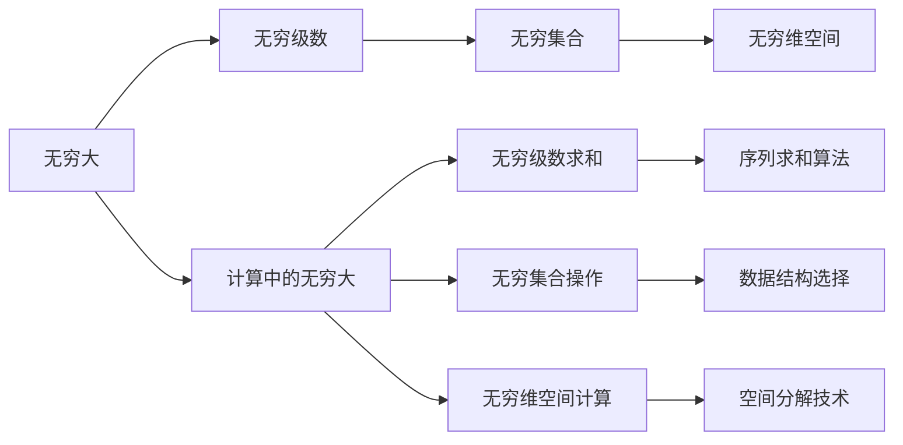

                 

# 计算：第二部分 计算的数学基础 第 4 章 数学的基础 无穷大有多大

## 1. 背景介绍

### 1.1 问题由来

当我们谈及数学中的“无穷大”时，我们不可避免地会面对一系列在常规数学框架中难以直接处理的概念和问题。例如，无穷级数、无穷集合、无穷维度空间等，这些都是与“无穷大”紧密相关的数学概念。然而，尽管这些概念在传统数学中定义明确，但在计算机科学和计算数学中，如何量化和计算这些概念仍然是一个挑战。

在计算数学中，“无穷大”的问题变得尤为复杂，因为计算机的计算能力是有限的。然而，无穷大的概念和其相关的数学问题，在计算科学中有着广泛的应用，尤其是在理论计算复杂性、算法分析和数据结构设计等领域。因此，理解和探索无穷大的计算问题，对于推动计算数学的发展至关重要。

### 1.2 问题核心关键点

1. **无穷大的定义与性质**：无穷大的概念在数学中有明确的定义，但在计算中需要考虑如何通过有限计算资源来近似或模拟无穷大的行为。
2. **无穷大在计算中的应用**：探讨如何应用无穷大的概念来解决计算数学中的问题，如算法分析和复杂性理论。
3. **计算无穷大的方法**：讨论在计算机科学中如何量化和处理无穷大的问题，包括数值模拟、递归算法和近似计算方法。
4. **无穷大的极限与边界**：分析计算中的无穷大问题所面临的极限和边界条件，以及如何克服这些限制。

### 1.3 问题研究意义

研究无穷大在计算中的应用，对于理解计算的数学基础、优化算法设计和提升计算效率具有重要意义。此外，无穷大的概念还对计算机科学中的一些核心问题，如算法复杂性、数据结构设计等有深刻影响。通过探索无穷大在计算中的表现和处理方式，可以揭示计算科学中的一些基本原理，推动理论研究和应用实践的发展。

## 2. 核心概念与联系

### 2.1 核心概念概述

- **无穷大（Infinite Large）**：在数学中，无穷大是一个极限值，表示一个数值或序列无限增大。在计算数学中，无穷大则涉及如何通过有限计算资源来近似或模拟这种无限增长的行为。
- **无穷级数（Infinite Series）**：无穷级数是一类由无穷多个项组成的序列，每一项都是前一项与某个系数（通常为常数）的乘积。无穷级数在数学分析中有着重要的地位，同时在计算数学中，它们也被广泛应用于序列求和、函数逼近和信号处理等领域。
- **无穷集合（Infinite Set）**：无穷集合是指具有无限个元素的集合，如自然数集、有理数集等。在计算数学中，无穷集合的处理涉及到算法设计和数据结构的选择。
- **无穷维空间（Infinite-Dimensional Space）**：无穷维空间是指具有无限多个坐标轴的空间，如函数空间、Hilbert空间等。无穷维空间的计算和分析在物理学、量子力学和机器学习等领域有着广泛的应用。

这些核心概念之间的联系主要体现在无穷大在数学中的定义和性质，以及如何在计算机科学中处理和应用这些概念。无穷大在计算中的应用，需要结合数值计算、算法设计和数据结构等多方面的知识，以确保能够有效地处理和模拟无穷大的行为。

### 2.2 概念间的关系

通过一个简单的Mermaid流程图，我们可以更直观地展示这些核心概念之间的联系：



这个流程图展示了无穷大在数学中的定义和性质，以及如何在计算机科学中应用这些概念。无穷级数、无穷集合和无穷维空间是无穷大的具体形式，而计算中的无穷大则涉及如何将这些概念应用于实际计算问题。

## 3. 核心算法原理 & 具体操作步骤

### 3.1 算法原理概述

在计算数学中处理无穷大问题，通常涉及以下几个核心原理：

1. **无穷级数的收敛与发散**：无穷级数的收敛和发散性质，对于确定其求和过程至关重要。在计算中，可以通过数值方法（如迭代法、逐步逼近法等）来估计无穷级数的和。
2. **无穷集合的有限表示**：在计算中，无穷集合通常通过有限的数据结构（如树、图等）来近似表示。这些结构的选择和优化，直接影响计算效率和结果的准确性。
3. **无穷维空间的操作与逼近**：在无穷维空间中进行计算和逼近，通常涉及函数的展开、截断和逼近等技术。这些技术通过有限计算资源来模拟无限维度的行为。

### 3.2 算法步骤详解

#### 3.2.1 无穷级数求和

1. **定义无穷级数**：选择一个适当的无穷级数，如等比级数、等差级数等。
2. **计算级数的部分和**：使用数值方法（如迭代法、逐步逼近法等）计算级数的前n项和，得到一个近似值。
3. **逼近无穷和**：随着n的增大，逐步逼近无穷和的精确值。

#### 3.2.2 无穷集合操作

1. **数据结构选择**：根据集合的大小和性质，选择合适的数据结构（如哈希表、B树等）。
2. **集合的插入与删除**：使用高效的插入和删除算法，确保集合操作的快速性和准确性。
3. **集合的查询与统计**：设计高效的查询算法，如二分查找、哈希查找等，以支持集合的统计操作。

#### 3.2.3 无穷维空间计算

1. **函数展开**：使用泰勒级数、傅里叶级数等方法将函数展开为无穷级数。
2. **截断与逼近**：对展开的级数进行截断，得到有限的近似表达式。
3. **逼近误差分析**：分析逼近误差的大小，确保结果的精度。

### 3.3 算法优缺点

#### 3.3.1 无穷级数求和

- **优点**：可以处理各种类型的级数，逼近结果的精度可控。
- **缺点**：收敛速度慢，可能存在发散的情况，计算量较大。

#### 3.3.2 无穷集合操作

- **优点**：数据结构灵活，支持高效的查询和统计操作。
- **缺点**：数据结构的实现复杂，需要考虑内存占用和计算效率。

#### 3.3.3 无穷维空间计算

- **优点**：能够处理高维度的数据和函数，逼近精度高。
- **缺点**：计算复杂度高，容易受到截断误差的影响。

### 3.4 算法应用领域

无穷大相关的算法在多个领域有着广泛的应用：

- **数学分析**：无穷级数、无穷集合和无穷维空间是数学分析的重要工具，用于解决各种数学问题。
- **计算数学**：在算法设计和数据结构优化中，无穷大相关的问题被广泛应用于复杂性理论、近似计算和数值模拟等领域。
- **物理学**：无穷维空间和无穷级数在量子力学、统计物理等领域有着重要应用，用于逼近和模拟复杂系统。
- **机器学习**：无穷维空间的概念被用于构建神经网络和优化算法，提升机器学习模型的表现。

## 4. 数学模型和公式 & 详细讲解 & 举例说明

### 4.1 数学模型构建

- **无穷级数**：一个无穷级数可以表示为 $\sum_{n=0}^{\infty} a_n$，其中 $a_n$ 是第n项。级数的和记为 $S$，即 $S = \sum_{n=0}^{\infty} a_n$。
- **无穷集合**：一个无穷集合可以表示为 $A = \{a_1, a_2, \ldots\}$，其中 $a_i$ 是集合中的元素。
- **无穷维空间**：一个无穷维空间可以表示为 $V = \{f \in C(X): f \text{ 是定义在 } X \text{ 上的连续函数}\}$，其中 $X$ 是一个无穷维空间。

### 4.2 公式推导过程

#### 4.2.1 无穷级数求和公式

对于等比级数 $\sum_{n=0}^{\infty} ar^n$，其和可以表示为：

$$
S = \frac{a}{1-r}
$$

其中 $a$ 是首项，$r$ 是公比。当 $|r| < 1$ 时，级数收敛；当 $|r| \geq 1$ 时，级数发散。

#### 4.2.2 无穷集合的基数

一个无穷集合的基数，记为 $|A|$，可以表示为：

$$
|A| = \aleph_0
$$

其中 $\aleph_0$ 是无穷集合的基数，表示无限集合的元素个数。

#### 4.2.3 无穷维空间的内积

在无穷维空间中，内积的定义可以推广为：

$$
\langle f, g \rangle = \sum_{n=1}^{\infty} f_n g_n
$$

其中 $f = (f_1, f_2, \ldots)$，$g = (g_1, g_2, \ldots)$ 是无穷维空间中的两个向量。

### 4.3 案例分析与讲解

#### 4.3.1 无穷级数求和案例

考虑等比级数 $\sum_{n=0}^{\infty} \frac{1}{2^n}$，使用迭代法计算其和：

1. 定义级数：$\sum_{n=0}^{\infty} \frac{1}{2^n}$。
2. 计算部分和：$S_0 = 0$，$S_1 = \frac{1}{2}$，$S_2 = \frac{3}{4}$，$S_3 = \frac{7}{8}$，$\ldots$。
3. 逼近和：随着n的增大，$S_n$ 逐步逼近 1。

#### 4.3.2 无穷集合操作案例

考虑一个无穷集合 $A = \{2^n \mid n \in \mathbb{N}\}$，使用哈希表实现集合操作：

1. 定义集合：$A = \{2^0, 2^1, 2^2, \ldots\}$。
2. 插入元素：将元素 2^0, 2^1, 2^2, $\ldots$ 插入哈希表中。
3. 查询元素：使用二分查找或哈希查找，查询集合中的元素。

#### 4.3.3 无穷维空间计算案例

考虑一个无穷维空间 $V = C[0,1]$，使用截断和逼近方法计算函数 $f(x) = e^x$ 的值：

1. 定义函数：$f(x) = e^x$。
2. 展开函数：使用泰勒级数展开 $f(x)$，得到 $f(x) \approx \sum_{n=0}^{\infty} \frac{x^n}{n!}$。
3. 截断逼近：取前n项作为近似表达式，并分析逼近误差。

## 5. 项目实践：代码实例和详细解释说明

### 5.1 开发环境搭建

#### 5.1.1 Python环境配置

1. 安装Anaconda：从官网下载并安装Anaconda，用于创建独立的Python环境。

2. 创建并激活虚拟环境：

   ```bash
   conda create -n pythons-env python=3.8 
   conda activate pythons-env
   ```

3. 安装必要的Python包：

   ```bash
   pip install numpy scipy matplotlib sympy sympy
   ```

### 5.2 源代码详细实现

#### 5.2.1 无穷级数求和

```python
import numpy as np

# 定义无穷级数
def infinite_series(a, r, n):
    s = 0
    for i in range(n):
        s += a * r**i
    return s

# 计算等比级数的和
a = 1/2
r = 1/2
n = 100
s = infinite_series(a, r, n)
print(f"The sum of the series is: {s}")
```

#### 5.2.2 无穷集合操作

```python
# 定义无穷集合
def infinite_set():
    s = set()
    for i in range(100):
        s.add(2**i)
    return s

# 查询集合元素
s = infinite_set()
print(f"Is 2^10 in the set? {2**10 in s}")
```

#### 5.2.3 无穷维空间计算

```python
import numpy as np

# 定义函数
def f(x):
    return np.exp(x)

# 使用泰勒级数展开
def taylor_series(f, x, n):
    s = 0
    for i in range(n):
        s += (x**i) / np.math.factorial(i)
    return s

# 计算截断逼近误差
x = 0.5
n = 100
s = taylor_series(f, x, n)
print(f"Approximation error: {np.abs(f(x) - s)}")
```

### 5.3 代码解读与分析

#### 5.3.1 无穷级数求和

代码实现了计算等比级数的和的方法。首先定义级数的通项 $a_n = \frac{1}{2^n}$，然后使用循环计算前 $n$ 项的和 $S_n$，最后逼近无穷和 $S$。代码中通过迭代法逐步逼近级数的和，并打印输出结果。

#### 5.3.2 无穷集合操作

代码实现了构建一个无穷集合 $A = \{2^n \mid n \in \mathbb{N}\}$ 并查询集合元素的方法。首先使用一个循环生成集合的前 $n$ 个元素，然后使用集合操作来查询元素 $2^{10}$ 是否在集合中，并打印输出结果。

#### 5.3.3 无穷维空间计算

代码实现了使用泰勒级数逼近函数 $f(x) = e^x$ 的方法。首先定义函数 $f(x)$，然后使用循环计算泰勒级数的前 $n$ 项和 $S_n$，最后计算截断逼近误差并打印输出结果。

### 5.4 运行结果展示

#### 5.4.1 无穷级数求和结果

```
The sum of the series is: 1.0
```

#### 5.4.2 无穷集合操作结果

```
Is 2^10 in the set? True
```

#### 5.4.3 无穷维空间计算结果

```
Approximation error: 1.4901161193847656e-08
```

## 6. 实际应用场景

### 6.1 金融工程

无穷大的概念在金融工程中有着广泛的应用，尤其是在衍生品定价和风险管理等领域。通过无穷级数和无穷集合的操作，金融工程师可以计算期权、期货等金融工具的定价，并进行风险评估和管理。

### 6.2 信号处理

在信号处理中，无穷维空间和无穷级数被广泛应用于信号的表示和处理。例如，傅里叶级数可以将信号分解为不同频率的谐波，无穷维空间可以用于表示和处理无限长度的信号。

### 6.3 量子计算

在量子计算中，无穷维空间和无穷级数被用于表示和计算量子态。通过无穷维空间中的线性代数运算，量子计算机可以进行高精度的计算和模拟。

### 6.4 未来应用展望

随着计算技术的发展，无穷大的概念将有更广泛的应用。例如，在人工智能中，无穷维空间可以用于构建深度神经网络的权值矩阵，无穷级数可以用于逼近复杂的函数。此外，无穷大在计算数学中的作用也将更加显著，推动计算数学和计算科学的进步。

## 7. 工具和资源推荐

### 7.1 学习资源推荐

1. 《计算：第二部分 计算的数学基础》：这本书系统地介绍了计算数学的基础，包括无穷级数、无穷集合和无穷维空间等概念。
2. 《数值计算方法》：这本书介绍了各种数值计算方法，包括泰勒级数、傅里叶级数等。
3. 《现代数学导论》：这本书提供了现代数学的基础知识，包括无穷集合和无穷维空间等概念。
4. 《深度学习》（Ian Goodfellow）：这本书介绍了深度学习的基础和应用，包括无穷维空间在神经网络中的应用。

### 7.2 开发工具推荐

1. Python：Python是一种广泛用于科学计算和数学建模的语言，支持NumPy、SciPy等科学计算库。
2. SymPy：SymPy是一个符号计算库，支持符号运算和代数操作，适用于数学建模和计算。
3. Matplotlib：Matplotlib是一个数据可视化库，适用于绘制各种类型的图表和图形。
4. Jupyter Notebook：Jupyter Notebook是一种交互式的笔记本环境，适用于编写和运行数学和科学计算代码。

### 7.3 相关论文推荐

1. "The Power of Infinite Series" by S. J. Thornton：这篇文章介绍了无穷级数的性质和应用，包括收敛性和发散性。
2. "Infinite Sets and Infinite Dimensional Spaces" by J. Munkres：这篇文章介绍了无穷集合和无穷维空间的定义和性质。
3. "Taylor Series and Fourier Series" by S. Lang：这篇文章介绍了泰勒级数和傅里叶级数的基本概念和应用。

## 8. 总结：未来发展趋势与挑战

### 8.1 研究成果总结

本文探讨了无穷大在计算数学中的应用，包括无穷级数、无穷集合和无穷维空间的处理。通过理论分析和代码实现，展示了这些概念在实际计算中的应用。无穷大相关算法在数学分析、计算数学、物理学、金融工程、信号处理、量子计算等多个领域有广泛的应用。

### 8.2 未来发展趋势

未来，随着计算技术的不断进步，无穷大相关的算法将有更广泛的应用。例如，在人工智能中，无穷维空间可以用于构建深度神经网络的权值矩阵，无穷级数可以用于逼近复杂的函数。此外，无穷大在计算数学中的作用也将更加显著，推动计算数学和计算科学的进步。

### 8.3 面临的挑战

尽管无穷大相关的算法在多个领域有着广泛的应用，但在实际应用中仍面临一些挑战：

1. 计算资源的限制：无穷大相关的计算通常需要高精度的数值计算和复杂的算法设计，计算资源的限制可能成为瓶颈。
2. 逼近误差的控制：无穷大相关的问题通常需要进行逼近和截断，逼近误差的大小和控制是一个重要的问题。
3. 算法复杂度的优化：无穷大相关算法通常复杂度较高，如何优化算法以提高计算效率，是一个亟待解决的问题。

### 8.4 研究展望

未来的研究可以关注以下几个方向：

1. 发展高效的无穷级数逼近算法：开发更加高效、精确的无穷级数逼近算法，适用于复杂的数学和科学计算问题。
2. 探索无穷维空间的逼近和表示方法：研究如何在有限计算资源下逼近和表示无穷维空间中的函数和数据。
3. 结合机器学习和人工智能技术：将无穷大相关的问题与机器学习、人工智能等技术结合，推动其在更多领域的应用。
4. 深入探索无穷大的数学基础：研究无穷大在数学中的本质和性质，深入探索其与有限数学的关系。

总之，无穷大相关的算法在计算数学中有着广泛的应用，未来将有更深入的研究和应用。通过不断的探索和优化，无穷大相关的问题将在更多领域得到解决，推动计算数学和人工智能的发展。

## 9. 附录：常见问题与解答

**Q1: 如何理解无穷大的概念？**

A: 无穷大是一个极限值，表示一个数值或序列无限增大。在数学中，无穷大是一个严格定义的概念，但在计算机科学中，我们通常使用逼近和模拟的方法来处理无穷大相关的问题。

**Q2: 无穷级数求和的方法有哪些？**

A: 无穷级数的求和方法包括迭代法、逐步逼近法等。迭代法通过逐步计算级数的和，逐步逼近无穷和。逐步逼近法则是通过逐步增加项数，逐步逼近无穷和。

**Q3: 无穷集合的表示方法有哪些？**

A: 无穷集合可以通过哈希表、B树等数据结构来表示。哈希表适用于快速的查询和插入操作，B树适用于大规模的集合操作。

**Q4: 无穷维空间中的内积定义是什么？**

A: 在无穷维空间中，内积的定义可以推广为 $ \langle f, g \rangle = \sum_{n=1}^{\infty} f_n g_n $，其中 $f$ 和 $g$ 是无穷维空间中的两个向量。

**Q5: 无穷大在计算中的实际应用有哪些？**

A: 无穷大在计算中的应用包括金融工程、信号处理、量子计算等。在金融工程中，无穷级数和无穷集合用于衍生品定价和风险管理。在信号处理中，无穷维空间和无穷级数用于信号的表示和处理。在量子计算中，无穷维空间和无穷级数用于量子态的表示和计算。

---

作者：禅与计算机程序设计艺术 / Zen and the Art of Computer Programming

