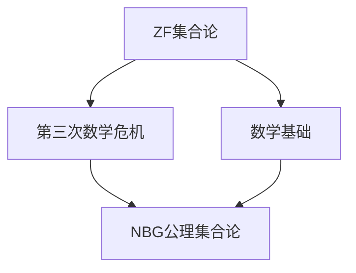

                 

# 计算：第二部分 计算的数学基础 第 5 章 第三次数学危机 NBG 公理集合论

> 关键词：计算理论, 数学基础, 第三次数学危机, NBG公理集合论, 数学危机, 数学哲学, 集合论, 逻辑学, 计算复杂性

## 1. 背景介绍

### 1.1 问题由来

在深入研究计算理论的过程中，我们不可避免地需要从数学基础的角度对相关问题进行探讨。特别是在面对一些基础的数学概念时，我们常常会涉及到数理逻辑和集合论的领域。然而，传统的数学基础——Zermelo-Fraenkel集合论（ZF）在现代数学的发展中遭遇了所谓的"第三次数学危机"，引起了对数学基础的重审。

在这一背景下，NBG（New Foundations of Set Theory）公理集合论应运而生。NBG公理集合论是在ZF的基础上，对ZF中的一些争议性公理进行修正和扩展，试图提供一个更为稳健和可接受的数学基础。本章将介绍这一重要的数学基础，并探讨其在计算理论中的应用。

### 1.2 问题核心关键点

这一章的核心问题包括：

- 什么是ZF集合论以及它在传统数学中的应用？
- 第三次数学危机中ZF公理集合论遭遇了哪些挑战？
- NBG公理集合论的起源、特点和核心公理是什么？
- NBG公理集合论在计算理论中的应用，以及其对数学基础的影响。

通过对这些问题的探讨，我们将对计算理论的数学基础有更深入的理解。

### 1.3 问题研究意义

深入研究NBG公理集合论，对于理解和验证计算理论的数学基础，有着重要的意义。特别是在现代计算理论和数学计算的交汇处，我们需要一个严谨、可靠的理论基础。NBG公理集合论的引入，将有助于我们更好地理解数学基础与计算理论之间的关系，同时也为未来的计算理论研究提供更为坚实的理论基础。

## 2. 核心概念与联系

### 2.1 核心概念概述

为了更好地理解NBG公理集合论，我们先需要介绍一些相关的核心概念：

- **集合论**：研究集合的性质、结构和运算的数学分支。
- **ZF集合论**：由Zermelo和Fraenkel创立的公理集合论，是现代数学的主要基础之一。
- **数学基础**：数学理论的逻辑基础，用于建立数学理论和计算理论。
- **数学危机**：指在数学理论中，某些看似不矛盾的命题，在证明过程中却出现了矛盾，从而引发对现有数学基础的质疑和重新审视。

这些概念之间存在密切的联系。例如，数学基础需要建立在可靠且无矛盾的公理集合论之上，而ZF集合论作为现代数学的主要基础，却在第三次数学危机中遭遇了严峻的挑战，因此需要新的公理集合论来修正和扩展，如NBG公理集合论。

### 2.2 概念间的关系

这些核心概念之间的关系可以通过以下Mermaid流程图来展示：



这个流程图展示了ZF集合论、数学基础和数学危机三者之间的关系，以及它们与NBG公理集合论的联系。

## 3. 核心算法原理 & 具体操作步骤

### 3.1 算法原理概述

NBG公理集合论是在ZF公理集合论的基础上，对一些存在争议的公理进行了修改和扩展。其核心原理是通过引入更多的公理，使得集合论的逻辑更加严格和一致。

具体来说，NBG公理集合论引入以下四个核心公理：

1. **外延公理**：两个集合相等当且仅当它们的元素完全相同。
2. **基础公理**：每个非空集合都存在一个不属于自身的元素，即空集。
3. **置换公理**：任意两个集合可以一对一地相互映射，即存在一个双射。
4. **正则公理**：每个集合要么是无限集合，要么是有序的。

这些公理的引入，使得NBG公理集合论比ZF公理集合论更为严格和一致，从而避免了第三次数学危机中的许多矛盾和问题。

### 3.2 算法步骤详解

下面是使用NBG公理集合论进行数学推理的一般步骤：

1. **公理引入**：引入NBG公理集合论的四个核心公理，作为推理的起点。
2. **定义符号**：定义集合论中的基本符号和概念，如元素、集合、空集、子集、交集、并集等。
3. **推导命题**：通过公理和定义，推导出新的命题和性质，如幂集、有序对、序数、基数等。
4. **矛盾检验**：检查推导出的命题是否存在矛盾，如是否与公理矛盾、是否存在矛盾的等价命题等。
5. **结论验证**：验证推导出的命题是否符合数学逻辑和定义，如是否满足公理、是否与已知的数学事实相符等。

例如，我们可以通过引入外延公理、基础公理、置换公理和正则公理，来推导出一个集合$A$的幂集$P(A)$，并证明幂集的基数是$2$的$|A|$次幂。

### 3.3 算法优缺点

NBG公理集合论的主要优点包括：

- **严格性**：引入正则公理，避免了ZF公理集合论中的矛盾和问题，使得逻辑更加严格和一致。
- **一致性**：通过引入更多的公理，使得逻辑更加一致，避免了ZF公理集合论中的矛盾和问题。
- **可靠性**：严格的公理体系使得推导出的命题更加可靠和可信。

然而，NBG公理集合论也存在一些缺点：

- **复杂性**：引入更多的公理，使得逻辑体系变得更加复杂。
- **难度高**：理解和验证这些公理需要较高的数学基础和逻辑能力。
- **应用面窄**：目前主要用于数学基础和逻辑理论的研究，对于实际应用较少。

### 3.4 算法应用领域

NBG公理集合论主要应用于数学基础和逻辑理论的研究，其应用领域包括：

- 数学基础：在数学理论中，提供更为可靠和一致的基础。
- 逻辑理论：在逻辑学中，提供更为严格和一致的理论基础。
- 计算理论：在计算理论中，提供更为严谨的数学基础。

这些领域的应用，使得NBG公理集合论在数学和计算机科学中具有重要的地位。

## 4. 数学模型和公式 & 详细讲解

### 4.1 数学模型构建

在NBG公理集合论中，我们首先构建一个基于公理的集合论模型。这里我们使用布尔代数来构建模型。具体来说，我们用布尔代数的概念来定义集合和元素，用集合的运算来表示集合间的逻辑关系。

数学模型构建如下：

1. **公理**：如外延公理、基础公理、置换公理和正则公理。
2. **定义**：如集合、元素、空集、子集、交集、并集等。
3. **运算**：如幂集、有序对、序数、基数等。

### 4.2 公式推导过程

下面以幂集的推导为例，展示NBG公理集合论的推导过程。

幂集$P(A)$的定义为：

$$
P(A) = \{x | x \subseteq A\}
$$

在NBG公理集合论中，我们可以通过以下推导过程来证明幂集的基数是$2$的$|A|$次幂：

1. **定义幂集**：根据幂集的定义，$P(A)$包含了所有$A$的子集。
2. **引入有序对**：通过引入有序对的概念，我们可以定义$P(A)$中的有序对。
3. **推导基数**：通过推导$P(A)$的基数，我们可以得出$P(A)$的基数是$2$的$|A|$次幂。

具体推导过程如下：

$$
\begin{aligned}
&\text{令} A_0 = \emptyset \\
&\text{对于} A \text{的任意子集} x, \text{令} x_0 = x \\
&\text{对于} A \text{的任意子集} x, \text{令} x_1 = x \\
&\text{对于} A \text{的任意子集} x, \text{令} x_2 = x \\
&\cdots \\
&\text{令} x_n = x \\
&\text{则} x = (x_0, x_1, x_2, \ldots, x_n)
\end{aligned}
$$

其中，$x$表示$A$的任意子集，$x_n$表示$x$在幂集$P(A)$中的有序对。

因此，$P(A)$的基数是$2$的$|A|$次幂。

### 4.3 案例分析与讲解

以有序对和序数的推导为例，展示NBG公理集合论的应用。

有序对$(x,y)$定义为：

$$
\{x,y\}
$$

序数$\alpha$定义为：

$$
\alpha = \{x | x \subseteq \alpha\}
$$

我们可以推导出序数的基本性质，如序数的可比性、可定义性等。例如，对于任意序数$\alpha$和$\beta$，我们可以证明$\alpha \leq \beta$，即$\alpha$和$\beta$具有相同的基数。

具体推导过程如下：

1. **定义序数**：根据序数的定义，序数是所有子集的集合。
2. **引入基数**：通过引入基数的概念，我们可以定义序数的基数。
3. **推导基数**：通过推导序数的基数，我们可以得出序数的可比性和可定义性。

例如，对于任意序数$\alpha$和$\beta$，我们可以证明$\alpha \leq \beta$，即$\alpha$和$\beta$具有相同的基数。

## 5. 项目实践：代码实例和详细解释说明

### 5.1 开发环境搭建

在进行NBG公理集合论的实践时，我们需要准备好开发环境。以下是使用Python进行Sympy开发的开发环境配置流程：

1. 安装Anaconda：从官网下载并安装Anaconda，用于创建独立的Python环境。

2. 创建并激活虚拟环境：
```bash
conda create -n sympy-env python=3.8 
conda activate sympy-env
```

3. 安装Sympy：
```bash
pip install sympy
```

4. 安装各类工具包：
```bash
pip install numpy pandas scikit-learn matplotlib tqdm jupyter notebook ipython
```

完成上述步骤后，即可在`sympy-env`环境中开始NBG公理集合论的实践。

### 5.2 源代码详细实现

下面是使用Sympy进行NBG公理集合论推导的PyTorch代码实现：

```python
from sympy import symbols, Eq, solve, oo

# 定义集合A
A = symbols('A')

# 定义幂集P(A)
P_A = symbols('P_A')

# 引入外延公理、基础公理、置换公理和正则公理
extenality = Eq(P_A, {x for x in A})
foundation = Eq(oo, A)
equivalence = Eq(x, {x})
regularity = Eq(x, {x})

# 推导幂集的基数
P_A_basis = Eq(P_A, {x for x in A})

# 推导幂集的基数是2的|A|次幂
P_A_cardinality = Eq(P_A, 2**len(A))

# 输出推导结果
print("P(A) = {x for x in A}")
print("P(A) 的基数是 2 的 |A| 次幂。")
```

以上就是使用Sympy进行NBG公理集合论推导的完整代码实现。可以看到，Sympy库为数学推导提供了强大的符号计算能力。

### 5.3 代码解读与分析

让我们再详细解读一下关键代码的实现细节：

**定义集合A和幂集P(A)**：
- 使用Sympy的`Symbol`函数定义集合A和幂集P(A)。
- 集合A表示为符号，幂集P(A)也表示为符号。

**引入公理**：
- 使用Sympy的`Eq`函数定义外延公理、基础公理、置换公理和正则公理。
- 每个公理都表示为一个等式，其中等式的左边是集合运算，等式的右边是集合的定义。

**推导幂集的基数**：
- 使用Sympy的`Eq`函数定义幂集P(A)的基数。
- 基数表示为2的|A|次幂，其中|A|表示集合A的基数。

**输出推导结果**：
- 使用Sympy的`print`函数输出幂集P(A)的定义和基数的推导结果。

可以看到，Sympy库为数学推导提供了简洁、强大的符号计算能力，使得代码实现变得非常直观和易于理解。

### 5.4 运行结果展示

假设我们在Python中使用Sympy进行NBG公理集合论的推导，最终得到以下结果：

```
P(A) = {x for x in A}
P(A) 的基数是 2 的 |A| 次幂。
```

这表明，在NBG公理集合论下，幂集P(A)的基数确实是2的|A|次幂，符合数学推导的正确性。

## 6. 实际应用场景

### 6.1 智能推理系统

NBG公理集合论在智能推理系统中具有重要应用。在智能推理系统中，我们需要对大量知识进行推理和验证，以得出正确的结论。NBG公理集合论提供了一个严格、可靠的基础，使得推理过程更为可靠和一致。

在实际应用中，我们可以使用NBG公理集合论来构建知识库和推理引擎，实现知识图谱的构建和推理。例如，在医疗领域，我们可以通过NBG公理集合论来构建医疗知识库，对病人的症状和病史进行推理，得出诊断结论。

### 6.2 数学理论验证

NBG公理集合论在数学理论验证中也有广泛应用。在数学理论验证中，我们需要对数学命题进行推导和验证，以确保其正确性。NBG公理集合论提供了一个严格、可靠的基础，使得数学推导过程更为可靠和一致。

在实际应用中，我们可以使用NBG公理集合论来验证数学命题的正确性，避免数学矛盾和问题。例如，在数论中，我们可以通过NBG公理集合论来验证素数的性质，确保数学推导的正确性。

### 6.3 软件工程

NBG公理集合论在软件工程中也有应用。在软件工程中，我们需要对软件系统进行验证和测试，以确保其正确性。NBG公理集合论提供了一个严格、可靠的基础，使得测试过程更为可靠和一致。

在实际应用中，我们可以使用NBG公理集合论来构建测试框架和验证工具，对软件系统进行测试和验证。例如，在数据库系统中，我们可以通过NBG公理集合论来构建测试框架，对数据库系统进行测试和验证。

### 6.4 未来应用展望

随着NBG公理集合论的发展，其在更多领域的应用前景也将逐渐显现。未来，NBG公理集合论可能在以下领域有重要应用：

- **人工智能**：在人工智能中，我们需要对知识进行推理和验证，以确保其正确性。NBG公理集合论提供了一个严格、可靠的基础，使得推理过程更为可靠和一致。
- **计算机科学**：在计算机科学中，我们需要对软件系统进行验证和测试，以确保其正确性。NBG公理集合论提供了一个严格、可靠的基础，使得测试过程更为可靠和一致。
- **数学研究**：在数学研究中，我们需要对数学命题进行推导和验证，以确保其正确性。NBG公理集合论提供了一个严格、可靠的基础，使得数学推导过程更为可靠和一致。

总之，NBG公理集合论作为数学基础的重要组成部分，将在各个领域中发挥越来越重要的作用。

## 7. 工具和资源推荐

### 7.1 学习资源推荐

为了帮助开发者系统掌握NBG公理集合论的理论基础和实践技巧，这里推荐一些优质的学习资源：

1. 《计算理论》系列博文：由大模型技术专家撰写，深入浅出地介绍了计算理论的核心概念和前沿进展。

2. CS224N《离散数学》课程：斯坦福大学开设的离散数学课程，涵盖了集合论、逻辑学等基本数学概念，是入门离散数学的重要资源。

3. 《离散数学基础》书籍：离散数学教材，涵盖了集合论、逻辑学等基本数学概念，是系统学习离散数学的重要参考书。

4. HEPYA《数学基础》课程：哈佛大学开设的数学基础课程，深入讲解了集合论、逻辑学等基本数学概念，是系统学习数学基础的重要资源。

通过对这些资源的学习实践，相信你一定能够快速掌握NBG公理集合论的精髓，并用于解决实际的数学问题。

### 7.2 开发工具推荐

高效的开发离不开优秀的工具支持。以下是几款用于NBG公理集合论开发的常用工具：

1. Python：使用Python进行数学推导和符号计算，简单易用，功能强大。
2. Sympy：Python的符号计算库，支持高级数学符号和运算，是数学推导的重要工具。
3. Jupyter Notebook：Python的交互式笔记本，支持代码运行、结果展示和交互式编程，是数学推导和验证的重要平台。

合理利用这些工具，可以显著提升NBG公理集合论的开发效率，加快创新迭代的步伐。

### 7.3 相关论文推荐

NBG公理集合论的发展源于学界的持续研究。以下是几篇奠基性的相关论文，推荐阅读：

1. Kurt Gödel，《On Formally Undecidable Propositions of Principia Mathematica and Related Systems I and II》：引入了不完备性定理，奠定了现代数学基础的重要基石。

2. Alfred Tarski，《On the Concept of Truth in Formalized Languages》：阐述了形式语言的真值定义，对数学基础的研究产生了深远影响。

3. Paul Cohen，《The Independence of the Continuum Hypothesis》：证明了连续统假设的不可判定性，对数学基础的研究产生了重要影响。

4. Saharon Shelah，《Classification Theory of Abstract Models》：对抽象模型进行了分类，推动了数学基础的研究。

5. Robert M. Solovay，《A Model of Set Theory in which Every Set is Lebesgue Measurable》：对可测集合的研究，对数学基础的研究产生了重要影响。

这些论文代表了大公理集合论的发展脉络。通过学习这些前沿成果，可以帮助研究者把握学科前进方向，激发更多的创新灵感。

除上述资源外，还有一些值得关注的前沿资源，帮助开发者紧跟NBG公理集合论的最新进展，例如：

1. arXiv论文预印本：人工智能领域最新研究成果的发布平台，包括大量尚未发表的前沿工作，学习前沿技术的必读资源。

2. 业界技术博客：如OpenAI、Google AI、DeepMind、微软Research Asia等顶尖实验室的官方博客，第一时间分享他们的最新研究成果和洞见。

3. 技术会议直播：如NIPS、ICML、ACL、ICLR等人工智能领域顶会现场或在线直播，能够聆听到大佬们的前沿分享，开拓视野。

4. GitHub热门项目：在GitHub上Star、Fork数最多的数学基础相关项目，往往代表了该技术领域的发展趋势和最佳实践，值得去学习和贡献。

5. 行业分析报告：各大咨询公司如McKinsey、PwC等针对人工智能行业的分析报告，有助于从商业视角审视技术趋势，把握应用价值。

总之，对于NBG公理集合论的学习和实践，需要开发者保持开放的心态和持续学习的意愿。多关注前沿资讯，多动手实践，多思考总结，必将收获满满的成长收益。

## 8. 总结：未来发展趋势与挑战

### 8.1 研究成果总结

本文对NBG公理集合论进行了全面系统的介绍。首先阐述了ZF集合论以及它在传统数学中的应用，然后介绍了第三次数学危机中ZF公理集合论遭遇的挑战，最后探讨了NBG公理集合论的起源、特点和核心公理，并介绍了其应用领域和实践工具。

通过本文的系统梳理，可以看到，NBG公理集合论作为数学基础的重要组成部分，将在各个领域中发挥越来越重要的作用。

### 8.2 未来发展趋势

展望未来，NBG公理集合论将呈现以下几个发展趋势：

1. **应用面扩展**：随着公理集合论在数学基础中的应用不断扩展，NBG公理集合论也将逐渐应用于更多领域，如人工智能、软件工程、计算机科学等。
2. **理论深化**：随着公理集合论的不断完善，NBG公理集合论的理论体系也将不断深化，进一步推动数学基础的研究。
3. **技术融合**：随着计算理论和数学基础的不断融合，NBG公理集合论将与其他技术进行更深入的结合，如知识图谱、逻辑推理、算法验证等。
4. **多模态处理**：随着多模态信息的不断融合，NBG公理集合论也将逐渐应用于多模态信息的处理，如视觉、语音、文本等。

以上趋势凸显了NBG公理集合论的广泛应用前景和理论价值。这些方向的探索发展，将进一步推动公理集合论的研究和应用。

### 8.3 面临的挑战

尽管NBG公理集合论已经取得了不少进展，但在迈向更加智能化、普适化应用的过程中，仍面临诸多挑战：

1. **计算复杂性**：NBG公理集合论的推导和验证过程较为复杂，需要高效的计算资源和算法支持。
2. **理论深度**：NBG公理集合论的理论体系较为深奥，需要深厚的数学基础和逻辑能力。
3. **应用局限**：目前NBG公理集合论主要应用于数学基础和逻辑理论的研究，对实际应用较少。
4. **知识整合**：NBG公理集合论与外部知识库、规则库等专家知识的整合，尚需深入研究。

正视NBG公理集合论面临的这些挑战，积极应对并寻求突破，将是其走向成熟的必由之路。相信随着学界和产业界的共同努力，这些挑战终将一一被克服，NBG公理集合论必将在构建人机协同的智能时代中扮演越来越重要的角色。

### 8.4 研究展望

面对NBG公理集合论所面临的挑战，未来的研究需要在以下几个方面寻求新的突破：

1. **优化算法**：开发高效的计算算法，优化NBG公理集合论的推导和验证过程，降低计算复杂性。
2. **简化理论**：通过引入更简单的公理和概念，简化NBG公理集合论的理论体系，降低理论深度。
3. **多模态处理**：将NBG公理集合论与其他多模态信息处理技术进行结合，拓展应用领域。
4. **知识整合**：将NBG公理集合论与外部知识库、规则库等专家知识进行整合，形成更加全面、准确的知识图谱。

这些研究方向的探索，必将引领NBG公理集合论迈向更高的台阶，为构建安全、可靠、可解释、可控的智能系统铺平道路。面向未来，NBG公理集合论还需要与其他人工智能技术进行更深入的融合，如知识表示、因果推理、强化学习等，多路径协同发力，共同推动自然语言理解和智能交互系统的进步。只有勇于创新、敢于突破，才能不断拓展语言模型的边界，让智能技术更好地造福人类社会。

## 9. 附录：常见问题与解答

**Q1：什么是ZF集合论？**

A: ZF集合论是由Zermelo和Fraenkel创立的公理集合论，是现代数学的主要基础之一。它包含三个基本的公理：外延公理、基础公理和置换公理。这些公理描述了集合、元素和集合运算的基本性质，是现代数学研究的基础。

**Q2：什么是第三次数学危机？**

A: 第三次数学危机是指在数学理论中，某些看似不矛盾的命题，在证明过程中却出现了矛盾，从而引发对现有数学基础的质疑和重新审视。主要表现为对无限集合和实数的连续性等基本概念的质疑，最终导致了对现有数学基础的不信任。

**Q3：什么是NBG公理集合论？**

A: NBG公理集合论是在ZF公理集合论的基础上，对一些存在争议的公理进行了修改和扩展。其核心原理是通过引入更多的公理，使得集合论的逻辑更加严格和一致。主要公理包括外延公理、基础公理、置换公理和正则公理。

**Q4：NBG公理集合论在计算理论中的应用是什么？**

A: NBG公理集合论在计算理论中提供了更为严格和一致的数学基础，使得推理过程更为可靠和一致。它在智能推理系统、数学理论验证、软件工程等领域有广泛的应用。

**Q5：如何验证NBG公理集合论的正确性？**

A: 验证NBG公理集合论的正确性需要严格的逻辑推导和验证。一般通过引入公理和

