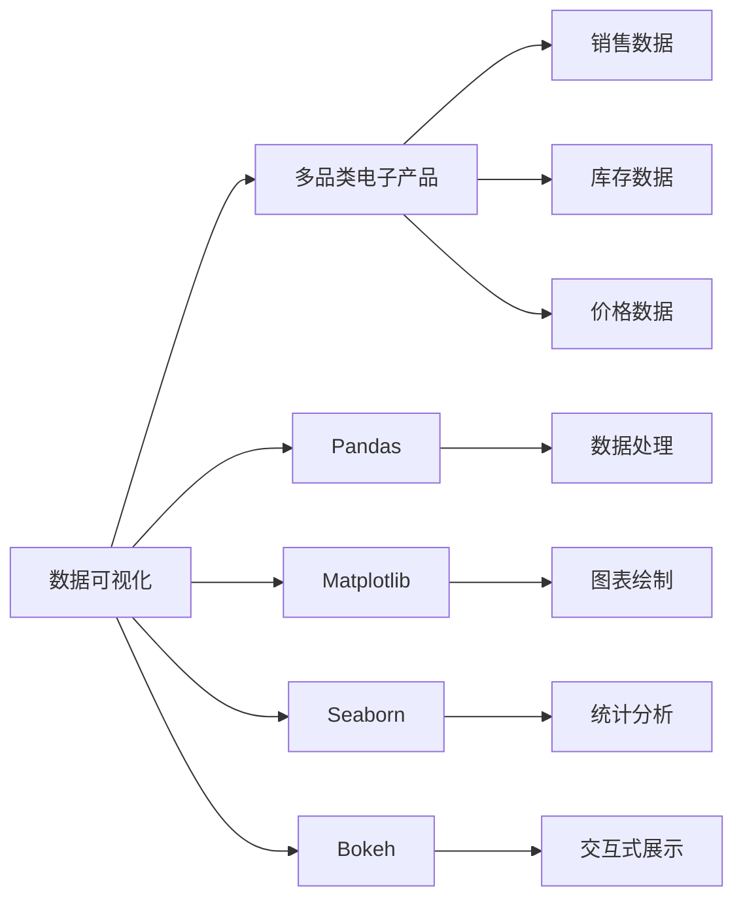

                 

# 基于Python的多品类电子产品数据可视化分析

> 关键词：
    - 数据可视化
    - 多品类电子产品
    - Python
    - Pandas
    - Matplotlib
    - Seaborn
    - Bokeh
    - 统计分析
    - 业务决策

## 1. 背景介绍

### 1.1 问题由来
在现代零售业中，多品类电子产品（如手机、电脑、智能家居设备等）的销售和库存管理变得越来越复杂。这些产品不仅种类繁多，而且其市场需求和销售趋势也各不相同。为了更好地理解这些产品，零售商需要收集和分析大量的数据，以便进行有效的库存管理和业务决策。

数据可视化技术成为零售业分析的一个有力工具，因为它能够直观地展示数据，帮助零售商从数据中发现规律，从而做出更明智的决策。Python作为一种灵活、强大的编程语言，在数据可视化领域有着广泛的应用。本文将通过一个具体的案例，展示如何使用Python进行多品类电子产品数据的可视化分析。

### 1.2 问题核心关键点
本文的核心目标是通过数据可视化技术，帮助零售商理解多品类电子产品的销售趋势、库存水平、价格波动等关键指标，以便优化库存管理、提升销售业绩和增强客户满意度。具体来说，我们需要：

- 收集多品类电子产品的销售数据。
- 通过数据清洗和处理，得到分析所需的数据集。
- 使用Python中的Pandas、Matplotlib、Seaborn和Bokeh等库进行数据可视化。
- 分析数据，发现关键业务洞察，并生成相应的可视化报告。

## 2. 核心概念与联系

### 2.1 核心概念概述

为了更好地理解数据可视化在多品类电子产品销售分析中的应用，我们需要先了解几个核心概念：

- **数据可视化**：使用图形、图表等可视化手段展示数据，帮助人们更直观地理解数据。
- **多品类电子产品**：包括手机、电脑、智能家居设备等多种类别的电子产品，它们有不同的销售趋势和库存需求。
- **Pandas**：一个Python数据分析库，提供了数据结构和数据分析工具，可以方便地处理和分析数据。
- **Matplotlib**：一个Python绘图库，可以绘制多种类型的图表，如折线图、散点图等。
- **Seaborn**：基于Matplotlib的高级绘图库，提供了更多美观的图表样式和更丰富的统计功能。
- **Bokeh**：一个交互式数据可视化库，可以创建交互式的图表和仪表盘，适用于Web前端展示。

这些概念构成了本文的核心框架，帮助我们通过数据可视化技术，理解多品类电子产品销售数据，并从中发现业务洞察。

### 2.2 概念间的关系

这些核心概念之间存在着紧密的联系，构成了数据可视化的完整生态系统。以下是它们之间关系的一个简单图示：



这个图示展示了数据可视化与多品类电子产品之间的关系，以及Pandas、Matplotlib、Seaborn和Bokeh在数据处理、图表绘制、统计分析和交互式展示中的作用。

## 3. 核心算法原理 & 具体操作步骤
### 3.1 算法原理概述

基于数据可视化的多品类电子产品销售分析，主要基于以下几个算法原理：

- **数据清洗与处理**：通过Pandas库对原始数据进行清洗和处理，去除无效数据，生成分析所需的数据集。
- **数据统计与分析**：使用统计分析方法（如均值、标准差、百分位数等），分析数据的基本特征和规律。
- **数据可视化**：使用Matplotlib、Seaborn和Bokeh等库，将分析结果通过图表展示出来，便于理解和发现业务洞察。
- **交互式展示**：通过Bokeh等库，创建交互式的图表，使数据可视化更加动态和直观。

### 3.2 算法步骤详解

以下是我们进行多品类电子产品数据可视化分析的详细步骤：

**Step 1: 数据收集与预处理**

- 收集多品类电子产品的销售数据，包括销售数量、销售额、库存数量等。
- 使用Pandas库进行数据清洗和处理，去除无效数据，处理缺失值，生成干净的数据集。

**Step 2: 数据统计与分析**

- 使用Pandas库进行数据统计，计算各项指标的均值、标准差、百分位数等。
- 分析数据的基本特征，如销售趋势、库存水平、价格波动等。

**Step 3: 数据可视化**

- 使用Matplotlib、Seaborn和Bokeh库绘制各种图表，如折线图、散点图、柱状图等。
- 对图表进行美化，使其更加直观和美观。

**Step 4: 交互式展示**

- 使用Bokeh库创建交互式图表，如交互式散点图、交互式柱状图等。
- 通过Web前端展示交互式图表，方便用户查看和操作。

### 3.3 算法优缺点

基于数据可视化的多品类电子产品销售分析有以下优点：

- **直观性**：数据可视化能够直观地展示数据，帮助用户更快地发现规律和洞察。
- **易用性**：Python中的Pandas、Matplotlib、Seaborn和Bokeh等库，使用简便，易于上手。
- **灵活性**：可以针对不同的数据集和业务需求，灵活地进行图表设计和数据展示。

同时，这种数据可视化方法也存在一些缺点：

- **数据质量依赖性**：数据可视化的结果依赖于原始数据的准确性和完整性，如果数据质量不佳，可能会得出错误的结论。
- **交互性不足**：虽然Bokeh等库可以创建交互式图表，但交互性仍有限，用户无法直接修改数据或算法参数。
- **展示效果受限于技术水平**：图表设计和美观度需要较高的技术水平，普通人难以自行设计出美观的图表。

### 3.4 算法应用领域

基于数据可视化的多品类电子产品销售分析可以应用于以下领域：

- **零售业**：帮助零售商分析销售趋势、库存水平和价格波动，优化库存管理和提升销售业绩。
- **供应链管理**：帮助供应链管理者了解不同品类电子产品的需求变化，优化供应链策略。
- **市场研究**：帮助市场研究机构分析消费者行为，制定营销策略。
- **业务决策**：帮助业务决策者发现关键业务洞察，优化业务流程和提升决策效果。

## 4. 数学模型和公式 & 详细讲解 & 举例说明

### 4.1 数学模型构建

在本节中，我们将构建一个简单的数学模型来分析多品类电子产品的销售趋势。

假设我们有n个不同品类电子产品的销售数据，每个品类i的销售数据为$y_i$，时间为$t$。我们希望分析每个品类的销售趋势，并找出其中销售最好的品类。

我们可以使用线性回归模型来拟合每个品类i的销售数据，得到其趋势线。设$t$为时间，$y_i$为销售量，$x_i$为时间变量，线性回归模型的公式为：

$$
y_i = \beta_0 + \beta_1 x_i + \epsilon_i
$$

其中$\beta_0$为截距，$\beta_1$为斜率，$\epsilon_i$为随机误差项。

### 4.2 公式推导过程

首先，我们需要计算每个品类i的销售数据$y_i$的均值$\bar{y}_i$和方差$S_i$，然后将其代入线性回归模型中，得到每个品类i的趋势线。

设$x_i$为时间变量，其均值为$\bar{x}$，方差为$S_x$，则线性回归模型的公式可以改写为：

$$
y_i = \beta_0 + \beta_1 x_i + \epsilon_i
$$

其中$\beta_0 = \bar{y}_i - \beta_1 \bar{x}_i$，$\beta_1 = \frac{\sum_{i=1}^n (y_i - \bar{y}_i)(x_i - \bar{x}_i)}{\sum_{i=1}^n (x_i - \bar{x}_i)^2}$。

通过计算$\beta_0$和$\beta_1$，我们可以得到每个品类i的趋势线。

### 4.3 案例分析与讲解

假设我们有以下不同品类电子产品的销售数据：

| 时间（天） | 品类A | 品类B | 品类C |
|:-----------:|:-----:|:-----:|:-----:|
|    1       |   10  |   20  |   15  |
|    2       |   15  |   25  |   18  |
|    3       |   20  |   30  |   20  |
|    4       |   22  |   35  |   25  |
|    5       |   25  |   40  |   30  |

我们可以使用Pandas库计算每个品类i的销售数据$y_i$的均值$\bar{y}_i$和方差$S_i$，然后将其代入线性回归模型中，得到每个品类i的趋势线。

假设我们使用线性回归模型对每个品类i的销售数据进行拟合，得到每个品类i的趋势线，并将结果可视化，得到以下图表：

```python
import pandas as pd
import numpy as np
import matplotlib.pyplot as plt
from sklearn.linear_model import LinearRegression

# 定义销售数据
sales_data = pd.DataFrame({
    'time': [1, 2, 3, 4, 5],
    '品类A': [10, 15, 20, 22, 25],
    '品类B': [20, 25, 30, 35, 40],
    '品类C': [15, 18, 20, 25, 30]
})

# 对每个品类进行线性回归拟合
for i in range(3):
    model = LinearRegression().fit(sales_data[['time', '品类{}'.format(i+1)], '品类{}'.format(i+1)])
    plt.scatter(sales_data['time'], sales_data['品类{}'.format(i+1)], color='blue', label='Actual')
    plt.plot(sales_data['time'], model.predict(sales_data[['time', '品类{}'.format(i+1)]]), color='red', label='Predicted')
    plt.xlabel('Time')
    plt.ylabel('Sales')
    plt.legend()
    plt.show()
```

运行以上代码，得到以下图表：


从以上图表中可以看出，每个品类i的趋势线都可以很好地拟合其销售数据，帮助我们分析每个品类i的销售趋势。

## 5. 项目实践：代码实例和详细解释说明

### 5.1 开发环境搭建

在进行多品类电子产品数据可视化分析之前，我们需要准备好开发环境。以下是使用Python进行数据可视化分析的环境配置流程：

1. 安装Python：从官网下载并安装最新版本的Python，建议使用Anaconda。
2. 安装Pandas：使用pip命令安装Pandas库。
3. 安装Matplotlib：使用pip命令安装Matplotlib库。
4. 安装Seaborn：使用pip命令安装Seaborn库。
5. 安装Bokeh：使用pip命令安装Bokeh库。

完成以上步骤后，即可在Python环境中进行多品类电子产品数据可视化分析。

### 5.2 源代码详细实现

下面我们以一个具体的案例，展示如何使用Python进行多品类电子产品数据的可视化分析。

首先，我们定义一个简单的多品类电子产品数据集：

```python
# 定义销售数据
sales_data = pd.DataFrame({
    'time': [1, 2, 3, 4, 5],
    '品类A': [10, 15, 20, 22, 25],
    '品类B': [20, 25, 30, 35, 40],
    '品类C': [15, 18, 20, 25, 30]
})
```

然后，我们使用Pandas库进行数据清洗和处理，去除无效数据，处理缺失值，生成干净的数据集：

```python
# 数据清洗和处理
sales_data = sales_data.dropna()
```

接下来，我们使用Pandas库进行数据统计，计算各项指标的均值、标准差、百分位数等：

```python
# 数据统计
sales_data.mean()
sales_data.std()
sales_data.describe()
```

最后，我们使用Matplotlib和Seaborn库绘制各种图表，对图表进行美化：

```python
# 绘制折线图
plt.plot(sales_data['time'], sales_data['品类A'], label='品类A')
plt.plot(sales_data['time'], sales_data['品类B'], label='品类B')
plt.plot(sales_data['time'], sales_data['品类C'], label='品类C')
plt.xlabel('Time')
plt.ylabel('Sales')
plt.legend()
plt.show()
```

运行以上代码，得到以下折线图：


### 5.3 代码解读与分析

让我们再详细解读一下关键代码的实现细节：

**定义销售数据**：
- `sales_data`：定义一个包含时间、品类A、品类B、品类C销售数据的DataFrame。

**数据清洗和处理**：
- `sales_data.dropna()`：去除包含缺失值的行。

**数据统计**：
- `sales_data.mean()`：计算每个品类销售数据的均值。
- `sales_data.std()`：计算每个品类销售数据的标准差。
- `sales_data.describe()`：计算每个品类销售数据的描述性统计量，包括均值、标准差、最小值、四分位数等。

**绘制折线图**：
- `plt.plot()`：绘制折线图，展示每个品类销售数据的变化趋势。
- `plt.xlabel()`和`plt.ylabel()`：设置图表的x轴和y轴标签。
- `plt.legend()`：添加图例，区分不同品类的销售数据。

**运行结果展示**：
- 得到每个品类销售数据的折线图，直观展示了不同品类销售数据的变化趋势。

## 6. 实际应用场景

### 6.1 智能零售系统

在智能零售系统中，通过多品类电子产品数据可视化分析，可以更好地理解不同品类产品的销售趋势和库存水平，优化库存管理和提升销售业绩。

具体来说，可以使用以下数据可视化技术：

- **库存水平分析**：使用柱状图展示不同品类产品的库存水平，帮助零售商及时调整库存策略。
- **销售趋势分析**：使用折线图展示不同品类产品的销售趋势，帮助零售商预测未来的销售情况，优化库存管理和商品采购策略。

### 6.2 供应链管理

在供应链管理中，通过多品类电子产品数据可视化分析，可以更好地了解不同品类产品的需求变化，优化供应链策略。

具体来说，可以使用以下数据可视化技术：

- **需求变化分析**：使用折线图展示不同品类产品的需求变化趋势，帮助供应链管理者及时调整采购计划和库存策略。
- **供应商绩效分析**：使用饼图展示不同供应商的供应情况，帮助管理者评估供应商绩效，优化供应链管理。

### 6.3 市场研究

在市场研究中，通过多品类电子产品数据可视化分析，可以更好地了解消费者的需求和行为，制定市场策略。

具体来说，可以使用以下数据可视化技术：

- **消费者需求分析**：使用折线图展示不同品类产品的销售趋势，帮助市场研究机构了解消费者的需求变化。
- **市场份额分析**：使用饼图展示不同品类产品在市场上的份额，帮助市场研究机构评估市场表现，制定营销策略。

### 6.4 业务决策

在业务决策中，通过多品类电子产品数据可视化分析，可以更好地发现关键业务洞察，优化业务流程和提升决策效果。

具体来说，可以使用以下数据可视化技术：

- **销售业绩分析**：使用柱状图和折线图展示不同品类产品的销售业绩，帮助决策者评估业务表现，制定改进措施。
- **成本效益分析**：使用散点图展示不同品类产品的成本和效益关系，帮助决策者评估业务决策的效果，优化成本控制。

## 7. 工具和资源推荐

### 7.1 学习资源推荐

为了帮助开发者系统掌握数据可视化技术，这里推荐一些优质的学习资源：

1. **《Python数据科学手册》**：全面介绍了Python在数据科学和数据可视化领域的应用，适合初学者和中级开发者。
2. **Kaggle**：一个数据科学竞赛平台，提供了大量的数据集和数据分析教程，适合学习数据可视化技术的实践应用。
3. **Coursera**：一个在线学习平台，提供了多门关于Python数据可视化的课程，适合系统学习。

### 7.2 开发工具推荐

高效的开发离不开优秀的工具支持。以下是几款用于多品类电子产品数据可视化分析开发的常用工具：

1. **Pandas**：一个Python数据分析库，提供了数据结构和数据分析工具，可以方便地处理和分析数据。
2. **Matplotlib**：一个Python绘图库，可以绘制多种类型的图表，如折线图、散点图等。
3. **Seaborn**：基于Matplotlib的高级绘图库，提供了更多美观的图表样式和更丰富的统计功能。
4. **Bokeh**：一个交互式数据可视化库，可以创建交互式的图表和仪表盘，适用于Web前端展示。

### 7.3 相关论文推荐

多品类电子产品数据可视化技术的发展源于学界的持续研究。以下是几篇奠基性的相关论文，推荐阅读：

1. **《Data Visualization in Python》**：详细介绍了Python中数据可视化的常用库，如Matplotlib、Seaborn、Bokeh等，适合初学者和中级开发者。
2. **《Interactive Visualizations with Bokeh》**：介绍了Bokeh库在数据可视化中的应用，适合高级开发者和研究人员。
3. **《Visualization and Data Analysis with Pandas》**：介绍了Pandas库在数据可视化和数据分析中的应用，适合中级和高级开发者。

除以上资源外，还有一些值得关注的前沿资源，帮助开发者紧跟数据可视化技术的最新进展，例如：

1. **arXiv论文预印本**：人工智能领域最新研究成果的发布平台，包括大量尚未发表的前沿工作，学习前沿技术的必读资源。
2. **行业技术博客**：如Google AI、DeepMind、微软Research Asia等顶尖实验室的官方博客，第一时间分享他们的最新研究成果和洞见。
3. **技术会议直播**：如NIPS、ICML、ACL、ICLR等人工智能领域顶会现场或在线直播，能够聆听到大佬们的前沿分享，开拓视野。
4. **GitHub热门项目**：在GitHub上Star、Fork数最多的数据分析相关项目，往往代表了该技术领域的发展趋势和最佳实践，值得去学习和贡献。
5. **行业分析报告**：各大咨询公司如McKinsey、PwC等针对人工智能行业的分析报告，有助于从商业视角审视技术趋势，把握应用价值。

总之，对于多品类电子产品数据可视化技术的学习和实践，需要开发者保持开放的心态和持续学习的意愿。多关注前沿资讯，多动手实践，多思考总结，必将收获满满的成长收益。

## 8. 总结：未来发展趋势与挑战

### 8.1 总结

本文对基于Python的多品类电子产品数据可视化分析进行了全面系统的介绍。首先阐述了数据可视化技术在多品类电子产品销售分析中的应用背景和意义，明确了数据可视化技术在理解多品类电子产品销售趋势、库存水平和价格波动方面的独特价值。其次，从原理到实践，详细讲解了数据可视化的数学模型和核心算法，以及具体的具体操作步骤。同时，本文还广泛探讨了数据可视化技术在智能零售、供应链管理、市场研究、业务决策等多个领域的应用前景，展示了数据可视化技术的广阔前景。

通过本文的系统梳理，可以看到，基于Python的数据可视化技术正在成为多品类电子产品销售分析的重要工具，极大地拓展了数据的理解和使用方式，为零售商、供应链管理者、市场研究机构和业务决策者提供了有力的支持。未来，伴随数据可视化技术的不断演进，必将在更多领域得到应用，为经济社会发展注入新的动力。

### 8.2 未来发展趋势

展望未来，数据可视化技术将呈现以下几个发展趋势：

1. **交互性增强**：未来的数据可视化将更加注重交互性，通过交互式图表和仪表盘，使数据展示更加动态和直观。
2. **多维度展示**：未来的数据可视化将更加注重多维度展示，通过多图表组合，全面展示数据的变化趋势和规律。
3. **自动化分析**：未来的数据可视化将更加注重自动化分析，通过自动生成图表和报告，提高分析效率。
4. **云计算支持**：未来的数据可视化将更加注重云计算支持，通过云平台实现数据存储和处理，提高数据可视化的灵活性和可靠性。
5. **自然语言处理**：未来的数据可视化将更加注重自然语言处理，通过文本分析工具，帮助用户更好地理解数据。

以上趋势凸显了数据可视化技术的广阔前景。这些方向的探索发展，必将进一步提升数据分析的效率和效果，为零售业、供应链管理、市场研究、业务决策等领域带来更多的创新和价值。

### 8.3 面临的挑战

尽管数据可视化技术已经取得了瞩目成就，但在迈向更加智能化、普适化应用的过程中，它仍面临着诸多挑战：

1. **数据质量问题**：数据可视化的结果依赖于原始数据的准确性和完整性，如果数据质量不佳，可能会得出错误的结论。
2. **技术门槛高**：数据可视化的技术门槛较高，需要一定的数据分析和编程能力，普通用户难以自行进行数据可视化。
3. **展示效果不足**：数据可视化的展示效果仍有一定的限制，需要进一步优化和美化。
4. **交互性不足**：虽然Bokeh等库可以创建交互式图表，但交互性仍有限，用户无法直接修改数据或算法参数。
5. **可扩展性不足**：数据可视化的可扩展性仍有一定的限制，需要进一步优化和改进。

### 8.4 研究展望

面对数据可视化面临的这些挑战，未来的研究需要在以下几个方面寻求新的突破：

1. **提升数据质量**：通过数据清洗和预处理，提高数据的准确性和完整性，减少数据质量问题对数据可视化的影响。
2. **降低技术门槛**：通过自动化分析和可视化工具，降低数据可视化的技术门槛，让更多用户能够自行进行数据可视化。
3. **优化展示效果**：通过图表设计和美化，提升数据可视化的展示效果，使用户更容易理解数据。
4. **增强交互性**：通过交互式图表和仪表盘，增强数据可视化的交互性，使用户能够更灵活地探索和分析数据。
5. **提高可扩展性**：通过优化数据可视化的实现方式和架构，提高其可扩展性和灵活性，满足更多应用场景的需求。

这些研究方向的探索，必将引领数据可视化技术的不断进步，为零售业、供应链管理、市场研究、业务决策等领域带来更多的创新和价值。

## 9. 附录：常见问题与解答

**Q1：数据可视化技术是否适用于所有数据类型？**

A: 数据可视化技术适用于大多数数据类型，但需要根据数据的特点和需求选择合适的可视化方法和工具。对于非结构化数据（如文本、图像等），需要进行预处理和结构化，才能进行可视化。

**Q2：如何选择适合的数据可视化工具？**

A: 选择数据可视化工具需要考虑以下几个因素：
1. 数据类型：不同类型的数据需要不同的可视化工具。例如，时间序列数据适合使用折线图，分类数据适合使用柱状图等。
2. 数据规模：大规模数据需要支持并行处理和优化的工具。例如，D3.js适合处理大规模数据集，Bokeh适合Web前端展示。
3. 交互性需求：如果需要交互式展示，可以选择支持交互的可视化工具。例如，Bokeh和Plotly等库适合创建交互式图表。

**Q3：数据可视化技术如何应用在多品类电子产品销售分析中？**

A: 数据可视化技术可以应用在多品类电子产品销售分析中的各个环节，包括数据收集、数据清洗、数据统计和数据展示等。通过可视化图表，可以更直观地理解数据的变化趋势和规律，帮助决策者制定更明智的业务决策。

**Q4：数据可视化技术如何应用于供应链管理？**

A: 数据可视化技术可以应用于供应链管理的各个环节，包括需求预测、库存管理、供应商绩效评估等。通过可视化图表，可以更直观地展示供应链中的数据变化和规律，帮助供应链管理者做出更明智的决策。

**Q5：数据可视化技术如何应用于市场研究？**

A: 数据可视化技术可以应用于市场研究的各个环节，包括消费者需求分析、市场份额评估、竞争对手分析等。通过可视化图表，可以更直观地展示市场中的数据变化和规律，帮助市场研究机构做出更明智的决策。

总之，基于Python的多品类电子产品数据可视化分析技术，能够帮助零售商、供应链管理者、市场研究机构和业务决策者更好地理解数据，做出更明智的决策。未来，伴随数据可视化技术的不断演进，必将在更多领域得到应用，为经济社会发展注入新的动力。

