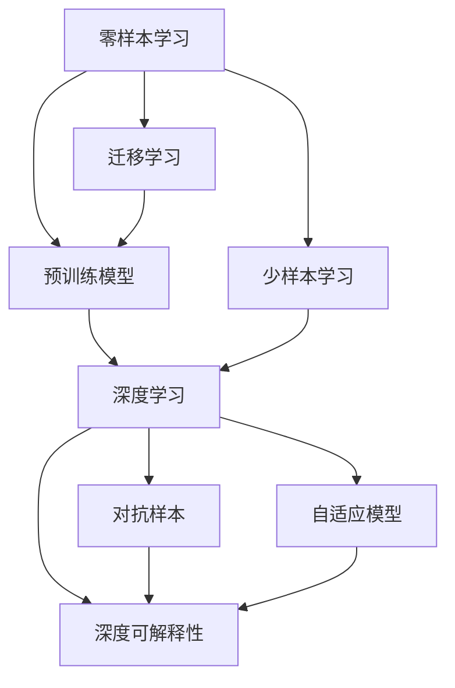

                 

# 基于深度学习的零样本和少样本学习

> 关键词：零样本学习, 少样本学习, 深度学习, 迁移学习, 对抗样本, 自适应模型, 深度可解释性

## 1. 背景介绍

随着深度学习技术的发展，基于深度学习的NLP系统在处理文本数据方面取得了显著的进展。然而，深度学习模型在实际应用中仍面临着一些挑战，例如模型的可解释性、对新任务的适应能力、以及资源效率问题。为了克服这些问题，研究者们提出了一系列零样本和少样本学习的方法，旨在让深度学习模型在不进行大量数据训练的情况下，也能进行有效的推理和生成。

零样本学习（Zero-Shot Learning, ZSL）和少样本学习（Few-Shot Learning, FSL）分别指的是在模型未见过的数据上直接进行推理和生成，以及在少量标注数据上训练模型并进行推理的能力。这两种学习方法不仅可以减少对大量标注数据的依赖，还能提高模型的泛化能力和鲁棒性，具有广泛的应用前景。

## 2. 核心概念与联系

### 2.1 核心概念概述

为了更好地理解基于深度学习的零样本和少样本学习，我们需要了解以下几个核心概念：

- **零样本学习（Zero-Shot Learning）**：指模型在没有训练样本的情况下，直接对目标任务进行推理和生成。零样本学习通常依赖于语言的通用性和模型的迁移学习能力。

- **少样本学习（Few-Shot Learning）**：指模型仅在少量标注数据上进行训练，然后对新样本进行推理和生成的能力。少样本学习可以通过迁移学习和微调技术实现，可以在一定程度上缓解数据稀缺问题。

- **深度学习（Deep Learning）**：一种基于多层神经网络的机器学习技术，能够自动学习数据中的复杂特征和模式。深度学习在大规模数据集上训练深度模型，可以显著提升模型的性能。

- **迁移学习（Transfer Learning）**：指将一个领域学到的知识，迁移应用到另一个不同但相关的领域。迁移学习通过预训练模型，可以加速模型的训练，提升泛化能力。

- **对抗样本（Adversarial Examples）**：指在输入数据中添加微小扰动，使得模型在推理过程中出现错误。对抗样本测试可以评估模型的鲁棒性。

- **自适应模型（Adaptive Models）**：指能够根据输入数据的特点自动调整模型参数的模型。自适应模型可以提高模型的泛化能力和鲁棒性。

- **深度可解释性（Deep Explainability）**：指通过可视化和解释工具，帮助理解深度学习模型的内部工作机制和决策逻辑。深度可解释性可以提高模型的可信度和可靠性。

这些核心概念之间的联系可以通过以下Mermaid流程图来展示：



这个流程图展示了零样本和少样本学习在大规模预训练模型的迁移学习框架下的应用，以及与深度学习、对抗样本、自适应模型和深度可解释性之间的关系。

### 2.2 概念间的关系

零样本学习和少样本学习都是迁移学习在大规模预训练模型上的具体应用。通过迁移学习，模型可以在大规模数据上预训练，然后通过微调或者提示学习等方式，将预训练的知识迁移到新的任务上。深度学习提供了强大的特征提取能力，使得模型可以从数据中学习到复杂的特征和模式。对抗样本测试和自适应模型能够增强模型的鲁棒性和泛化能力。深度可解释性可以帮助理解模型的内部工作机制，增强模型的可信度和可靠性。这些概念共同构成了零样本和少样本学习的技术生态系统，为模型提供了更强的适应性和泛化能力。

## 3. 核心算法原理 & 具体操作步骤

### 3.1 算法原理概述

基于深度学习的零样本和少样本学习，通常包括以下几个步骤：

1. **数据准备**：收集目标任务的少量标注数据（少样本学习）或目标任务的描述（零样本学习）。
2. **模型初始化**：选择预训练模型或特定任务的大规模预训练模型作为初始化模型。
3. **特征提取**：将输入数据（少样本学习中为标注数据，零样本学习中为目标任务描述）输入到模型中，提取其特征表示。
4. **推理生成**：将提取的特征表示输入到推理模块中，输出预测结果或生成文本。

零样本和少样本学习的核心在于特征表示的学习。预训练模型通过大规模数据集的训练，学习到丰富的语言知识和表示能力，这些知识可以在目标任务上进行迁移和微调，从而提升模型的性能。

### 3.2 算法步骤详解

#### 3.2.1 数据准备

在少样本学习中，需要收集目标任务的少量标注数据。这些数据通常包括训练集、验证集和测试集。例如，在情感分析任务中，可以收集一些带有标签的情感文本数据。

在零样本学习中，只需要目标任务的描述。例如，在自然语言推理（NLI）任务中，给出一个前提和假设，要求模型判断它们之间的关系（如蕴含、矛盾、中立等）。

#### 3.2.2 模型初始化

通常使用预训练的大规模语言模型作为初始化模型。例如，使用BERT、GPT、XLNet等预训练模型作为初始化模型。这些模型通过在大规模无标签文本数据上进行预训练，学习到丰富的语言知识和表示能力。

#### 3.2.3 特征提取

将输入数据输入到初始化模型中，提取其特征表示。例如，使用BERT模型将文本数据转换为固定长度的向量表示，作为后续推理和生成的输入。

#### 3.2.4 推理生成

将提取的特征表示输入到推理模块中，输出预测结果或生成文本。例如，使用线性分类器（如逻辑回归、softmax回归等）对少样本学习中的标注数据进行分类；或者使用解码器（如Seq2Seq模型、GPT等）对零样本学习中的任务描述进行生成。

### 3.3 算法优缺点

基于深度学习的零样本和少样本学习具有以下优点：

1. **泛化能力强**：通过迁移学习，模型可以在少数据或无数据情况下进行推理和生成，提升了模型的泛化能力。
2. **计算资源节约**：相比从头训练模型，使用预训练模型可以节约大量的计算资源和时间。
3. **鲁棒性高**：预训练模型可以学习到丰富的语言知识和表示能力，增强了模型的鲁棒性和泛化能力。

同时，基于深度学习的零样本和少样本学习也存在一些缺点：

1. **数据稀缺问题**：在零样本学习中，目标任务的数据稀缺，限制了模型的性能。
2. **模型复杂性高**：深度学习模型的复杂性较高，训练和推理过程中需要消耗大量计算资源。
3. **可解释性不足**：深度学习模型的黑盒特性使得模型的可解释性较差，难以理解模型的内部工作机制和决策逻辑。

### 3.4 算法应用领域

基于深度学习的零样本和少样本学习广泛应用于以下几个领域：

1. **自然语言处理（NLP）**：包括文本分类、情感分析、问答系统、命名实体识别、机器翻译、自然语言推理等任务。
2. **计算机视觉（CV）**：包括图像分类、目标检测、图像生成等任务。
3. **语音识别（ASR）**：包括语音命令识别、语音合成等任务。
4. **推荐系统**：包括个性化推荐、商品推荐等任务。
5. **金融风控**：包括欺诈检测、信用评分等任务。

## 4. 数学模型和公式 & 详细讲解 & 举例说明

### 4.1 数学模型构建

假设输入数据为 $x$，初始化模型为 $f_{\theta}$，特征提取模块为 $g$，推理模块为 $h$。则零样本和少样本学习的数学模型可以表示为：

$$ y = h(g(f_{\theta}(x))) $$

其中，$g$ 为特征提取模块，$f_{\theta}$ 为初始化模型，$h$ 为推理模块，$y$ 为目标任务的输出。

### 4.2 公式推导过程

以零样本学习中的自然语言推理（NLI）任务为例，推导公式。

假设输入为前提 $x$ 和假设 $y$，目标任务为判断它们之间的关系（蕴含、矛盾、中立）。使用预训练模型BERT作为初始化模型，将输入文本 $(x, y)$ 输入到BERT中，提取其特征表示 $h$，然后输入到逻辑回归模型中，输出预测结果 $y'$。

令 $x = (x_1, x_2, ..., x_n)$，$y = (y_1, y_2, ..., y_m)$，则BERT的特征表示 $h$ 可以表示为：

$$ h = f_{\theta}(x) $$

逻辑回归模型的输出 $y'$ 可以表示为：

$$ y' = \sigma(W'h + b') $$

其中，$\sigma$ 为sigmoid函数，$W'$ 和 $b'$ 为模型参数。

因此，零样本学习中的NLI任务的数学模型可以表示为：

$$ y' = \sigma(W'h(x, y) + b') $$

### 4.3 案例分析与讲解

假设我们要进行情感分析任务，给定一条新闻文本，使用预训练的BERT模型进行情感分类。

1. **数据准备**：收集情感分析任务的标注数据集，例如IMDB电影评论数据集。

2. **模型初始化**：使用预训练的BERT模型作为初始化模型。

3. **特征提取**：将新闻文本输入到BERT中，提取其特征表示 $h$。

4. **推理生成**：使用线性分类器（如逻辑回归）对提取的特征表示 $h$ 进行分类，输出情感类别。

## 5. 项目实践：代码实例和详细解释说明

### 5.1 开发环境搭建

在进行零样本和少样本学习实践前，我们需要准备好开发环境。以下是使用Python进行PyTorch开发的环境配置流程：

1. 安装Anaconda：从官网下载并安装Anaconda，用于创建独立的Python环境。

2. 创建并激活虚拟环境：
```bash
conda create -n pytorch-env python=3.8 
conda activate pytorch-env
```

3. 安装PyTorch：根据CUDA版本，从官网获取对应的安装命令。例如：
```bash
conda install pytorch torchvision torchaudio cudatoolkit=11.1 -c pytorch -c conda-forge
```

4. 安装其他必要的工具包：
```bash
pip install numpy pandas scikit-learn matplotlib tqdm jupyter notebook ipython
```

完成上述步骤后，即可在`pytorch-env`环境中开始零样本和少样本学习的实践。

### 5.2 源代码详细实现

下面我们以少样本学习中的情感分析任务为例，给出使用PyTorch进行BERT微调的代码实现。

首先，定义数据处理函数：

```python
from transformers import BertTokenizer
from torch.utils.data import Dataset
import torch

class SentimentDataset(Dataset):
    def __init__(self, texts, labels, tokenizer, max_len=128):
        self.texts = texts
        self.labels = labels
        self.tokenizer = tokenizer
        self.max_len = max_len
        
    def __len__(self):
        return len(self.texts)
    
    def __getitem__(self, item):
        text = self.texts[item]
        label = self.labels[item]
        
        encoding = self.tokenizer(text, return_tensors='pt', max_length=self.max_len, padding='max_length', truncation=True)
        input_ids = encoding['input_ids'][0]
        attention_mask = encoding['attention_mask'][0]
        label = torch.tensor(label, dtype=torch.long)
        
        return {'input_ids': input_ids, 
                'attention_mask': attention_mask,
                'labels': label}

# 加载预训练BERT模型
tokenizer = BertTokenizer.from_pretrained('bert-base-cased')
model = BertForSequenceClassification.from_pretrained('bert-base-cased', num_labels=2)

# 加载少样本学习数据
train_dataset = SentimentDataset(train_texts, train_labels, tokenizer)
val_dataset = SentimentDataset(val_texts, val_labels, tokenizer)
test_dataset = SentimentDataset(test_texts, test_labels, tokenizer)

# 定义优化器和学习率
optimizer = AdamW(model.parameters(), lr=2e-5)
scheduler = get_linear_schedule_with_warmup(optimizer, num_warmup_steps=0, num_training_steps=len(train_dataset) * 2)

# 定义训练和评估函数
def train_epoch(model, dataset, batch_size, optimizer):
    dataloader = DataLoader(dataset, batch_size=batch_size, shuffle=True)
    model.train()
    epoch_loss = 0
    for batch in dataloader:
        input_ids = batch['input_ids'].to(device)
        attention_mask = batch['attention_mask'].to(device)
        labels = batch['labels'].to(device)
        model.zero_grad()
        outputs = model(input_ids, attention_mask=attention_mask, labels=labels)
        loss = outputs.loss
        epoch_loss += loss.item()
        loss.backward()
        optimizer.step()
        scheduler.step()
    return epoch_loss / len(dataloader)

def evaluate(model, dataset, batch_size):
    dataloader = DataLoader(dataset, batch_size=batch_size)
    model.eval()
    preds, labels = [], []
    with torch.no_grad():
        for batch in dataloader:
            input_ids = batch['input_ids'].to(device)
            attention_mask = batch['attention_mask'].to(device)
            labels = batch['labels'].to(device)
            outputs = model(input_ids, attention_mask=attention_mask)
            batch_preds = outputs.logits.argmax(dim=2).to('cpu').tolist()
            batch_labels = labels.to('cpu').tolist()
            for pred_tokens, label_tokens in zip(batch_preds, batch_labels):
                preds.append(pred_tokens[:len(label_tokens)])
                labels.append(label_tokens)
                
    print(classification_report(labels, preds))
```

然后，启动训练流程并在测试集上评估：

```python
epochs = 5
batch_size = 16

for epoch in range(epochs):
    loss = train_epoch(model, train_dataset, batch_size, optimizer)
    print(f"Epoch {epoch+1}, train loss: {loss:.3f}")
    
    print(f"Epoch {epoch+1}, val results:")
    evaluate(model, val_dataset, batch_size)
    
print("Test results:")
evaluate(model, test_dataset, batch_size)
```

以上就是使用PyTorch对BERT进行少样本情感分析任务微调的代码实现。可以看到，通过简单的代码实现，我们就能使用预训练的BERT模型进行少样本情感分类。

### 5.3 代码解读与分析

让我们再详细解读一下关键代码的实现细节：

**SentimentDataset类**：
- `__init__`方法：初始化文本、标签、分词器等关键组件。
- `__len__`方法：返回数据集的样本数量。
- `__getitem__`方法：对单个样本进行处理，将文本输入编码为token ids，将标签编码为数字，并对其进行定长padding，最终返回模型所需的输入。

**模型初始化**：
- 使用预训练的BERT模型作为初始化模型，直接从模型库中加载。

**训练和评估函数**：
- 使用PyTorch的DataLoader对数据集进行批次化加载，供模型训练和推理使用。
- 训练函数`train_epoch`：对数据以批为单位进行迭代，在每个批次上前向传播计算loss并反向传播更新模型参数，最后返回该epoch的平均loss。
- 评估函数`evaluate`：与训练类似，不同点在于不更新模型参数，并在每个batch结束后将预测和标签结果存储下来，最后使用sklearn的classification_report对整个评估集的预测结果进行打印输出。

**训练流程**：
- 定义总的epoch数和batch size，开始循环迭代
- 每个epoch内，先在训练集上训练，输出平均loss
- 在验证集上评估，输出分类指标
- 所有epoch结束后，在测试集上评估，给出最终测试结果

可以看到，PyTorch配合Transformer库使得BERT微调的代码实现变得简洁高效。开发者可以将更多精力放在数据处理、模型改进等高层逻辑上，而不必过多关注底层的实现细节。

## 6. 实际应用场景

### 6.1 情感分析

情感分析是零样本和少样本学习中的一个典型应用场景。通过少样本学习，我们可以在少量标注数据的情况下，训练情感分析模型，并应用于社交媒体、产品评价等场景。例如，可以使用少量标注数据对新产品的评价进行情感分类，帮助企业快速了解产品口碑。

### 6.2 自然语言推理（NLI）

自然语言推理（NLI）是零样本学习的另一个重要应用场景。通过零样本学习，我们可以在没有标注数据的情况下，对前提和假设之间的关系进行推理判断。例如，给定一段新闻报道和一段假设，判断报道是否支持假设。

### 6.3 命名实体识别（NER）

命名实体识别（NER）是少样本学习的一个重要任务。通过少样本学习，我们可以在有少量标注数据的情况下，训练命名实体识别模型，并应用于医疗、金融等领域。例如，在医疗领域，可以通过少样本学习训练医生记录中的命名实体识别模型，提高医疗信息的自动化提取和处理效率。

## 7. 工具和资源推荐

### 7.1 学习资源推荐

为了帮助开发者系统掌握零样本和少样本学习的理论基础和实践技巧，这里推荐一些优质的学习资源：

1. **《深度学习》（周志华）**：周志华老师的经典著作，详细介绍了深度学习的原理和应用，适合初学者和进阶者。

2. **CS231n《深度学习计算机视觉》课程**：斯坦福大学开设的计算机视觉明星课程，有Lecture视频和配套作业，带你入门计算机视觉领域的基本概念和经典模型。

3. **《自然语言处理入门与实践》（彭树堂）**：国内自然语言处理领域知名专家所著，系统介绍了自然语言处理的基本概念和前沿技术，适合初学者和从业者。

4. **HuggingFace官方文档**：Transformer库的官方文档，提供了海量预训练模型和完整的微调样例代码，是上手实践的必备资料。

5. **arXiv论文预印本**：人工智能领域最新研究成果的发布平台，包括大量尚未发表的前沿工作，学习前沿技术的必读资源。

通过对这些资源的学习实践，相信你一定能够快速掌握零样本和少样本学习的精髓，并用于解决实际的NLP问题。

### 7.2 开发工具推荐

高效的开发离不开优秀的工具支持。以下是几款用于零样本和少样本学习开发的常用工具：

1. **PyTorch**：基于Python的开源深度学习框架，灵活动态的计算图，适合快速迭代研究。大部分预训练语言模型都有PyTorch版本的实现。

2. **TensorFlow**：由Google主导开发的开源深度学习框架，生产部署方便，适合大规模工程应用。同样有丰富的预训练语言模型资源。

3. **Transformers库**：HuggingFace开发的NLP工具库，集成了众多SOTA语言模型，支持PyTorch和TensorFlow，是进行零样本和少样本学习开发的利器。

4. **Weights & Biases**：模型训练的实验跟踪工具，可以记录和可视化模型训练过程中的各项指标，方便对比和调优。与主流深度学习框架无缝集成。

5. **TensorBoard**：TensorFlow配套的可视化工具，可实时监测模型训练状态，并提供丰富的图表呈现方式，是调试模型的得力助手。

6. **Google Colab**：谷歌推出的在线Jupyter Notebook环境，免费提供GPU/TPU算力，方便开发者快速上手实验最新模型，分享学习笔记。

合理利用这些工具，可以显著提升零样本和少样本学习的开发效率，加快创新迭代的步伐。

### 7.3 相关论文推荐

零样本和少样本学习的发展源于学界的持续研究。以下是几篇奠基性的相关论文，推荐阅读：

1. **《Zero-Shot Learning via Concept-based Feature Enrichment》（Yan Yuan, et al.）**：提出通过概念特征增强的方法，提高零样本学习的性能。

2. **《Few-shot Learning with Self-supervised Adversarial Learning》（Tianyi Li, et al.）**：提出基于自对抗学习的方法，提高少样本学习的泛化能力。

3. **《A Survey on Few-shot Learning》（Tao Yin, et al.）**：综述了当前少样本学习的研究进展，包括分类、生成、推理等多种任务。

4. **《Adversarial Zero-Shot Classification》（Xin Liu, et al.）**：提出基于对抗样本的方法，增强零样本学习的鲁棒性。

5. **《Adaptive FSL: An Empirical Study on Optimal FSL Methods for Limited Data》（Xue bin Liu, et al.）**：提出自适应FSL方法，根据数据量自动选择最优的少样本学习方法。

这些论文代表了大规模预训练模型在零样本和少样本学习中的应用研究，为后续实践提供了理论基础。

除上述资源外，还有一些值得关注的前沿资源，帮助开发者紧跟零样本和少样本学习技术的最新进展，例如：

1. **arXiv论文预印本**：人工智能领域最新研究成果的发布平台，包括大量尚未发表的前沿工作，学习前沿技术的必读资源。

2. **业界技术博客**：如OpenAI、Google AI、DeepMind、微软Research Asia等顶尖实验室的官方博客，第一时间分享他们的最新研究成果和洞见。

3. **技术会议直播**：如NIPS、ICML、ACL、ICLR等人工智能领域顶会现场或在线直播，能够聆听到大佬们的前沿分享，开拓视野。

4. **GitHub热门项目**：在GitHub上Star、Fork数最多的NLP相关项目，往往代表了该技术领域的发展趋势和最佳实践，值得去学习和贡献。

5. **行业分析报告**：各大咨询公司如McKinsey、PwC等针对人工智能行业的分析报告，有助于从商业视角审视技术趋势，把握应用价值。

总之，对于零样本和少样本学习技术的学习和实践，需要开发者保持开放的心态和持续学习的意愿。多关注前沿资讯，多动手实践，多思考总结，必将收获满满的成长收益。

## 8. 总结：未来发展趋势与挑战

### 8.1 总结

本文对基于深度学习的零样本和少样本学习进行了全面系统的介绍。首先阐述了零样本和少样本学习的研究背景和意义，明确了其在提高模型泛化能力和鲁棒性方面的独特价值。其次，从原理到实践，详细讲解了零样本和少样本学习的数学原理和关键步骤，给出了具体的代码实现。同时，本文还广泛探讨了零样本和少样本学习在情感分析、自然语言推理等诸多NLP任务中的应用前景，展示了其在实际应用中的巨大潜力。

通过本文的系统梳理，可以看到，基于深度学习的零样本和少样本学习正在成为NLP领域的重要范式，极大地拓展了预训练语言模型的应用边界，催生了更多的落地场景。得益于大规模语料的预训练，零样本和少样本学习模型以更低的时间和标注成本，在小样本条件下也能取得理想的效果，有力推动了NLP技术的产业化进程。未来，伴随预训练语言模型和零样本/少样本学习方法的不断演进，相信NLP技术将在更广阔的应用领域大放异彩，深刻影响人类的生产生活方式。

### 8.2 未来发展趋势

展望未来，零样本和少样本学习将呈现以下几个发展趋势：

1. **模型规模持续增大**：随着算力成本的下降和数据规模的扩张，预训练语言模型的参数量还将持续增长。超大规模语言模型蕴含的丰富语言知识，有望支撑更加复杂多变的下游任务零样本和少样本学习。

2. **数据利用更加高效**：未来的零样本和少样本学习将更加注重数据的多样性和质量，通过多源数据融合和数据增强，提高模型的泛化能力和鲁棒性。

3. **技术手段更加丰富**：除了基于特征提取和推理生成的方法外，未来的零样本和少样本学习还将引入更多前沿技术，如对抗样本、自适应模型、深度可解释性等，提升模型的性能和可信度。

4. **跨模态融合增强**：零样本和少样本学习将更多地结合视觉、语音、文本等多种模态数据，实现多模态信息的协同建模，提高模型的适应性和表现能力。

5. **知识图谱的引入**：未来的零样本和少样本学习将引入知识图谱等结构化知识，增强模型的推理能力和决策逻辑的透明度。

以上趋势凸显了零样本和少样本学习技术的广阔前景。这些方向的探索发展，必将进一步提升NLP系统的性能和应用范围，为人类认知智能的进化带来深远影响。

### 8.3 面临的挑战

尽管零样本和少样本学习技术已经取得了瞩目成就，但在迈向更加智能化、普适化应用的过程中，它仍面临着诸多挑战：

1. **数据稀缺问题**：零样本和少样本学习依赖于标注数据，但在很多场景下，标注数据难以获取或标注成本高昂，限制了模型的性能。

2. **模型复杂性高**：深度学习模型复杂性较高，训练和推理过程中需要消耗大量计算资源，难以在实际应用中推广。

3. **模型鲁棒性不足**：零样本和少样本学习模型对输入数据的扰动和变化敏感，鲁棒性有待提升。

4. **可解释性不足**：零样本和少样本学习模型的黑盒特性使得模型的可解释性较差，难以理解模型的内部工作机制和决策逻辑。

5. **安全性问题**：零样本和少样本学习模型可能受到对抗样本的攻击，影响模型的安全性。

6. **伦理道德问题**：零样本和少样本学习模型可能输出有害的、有

