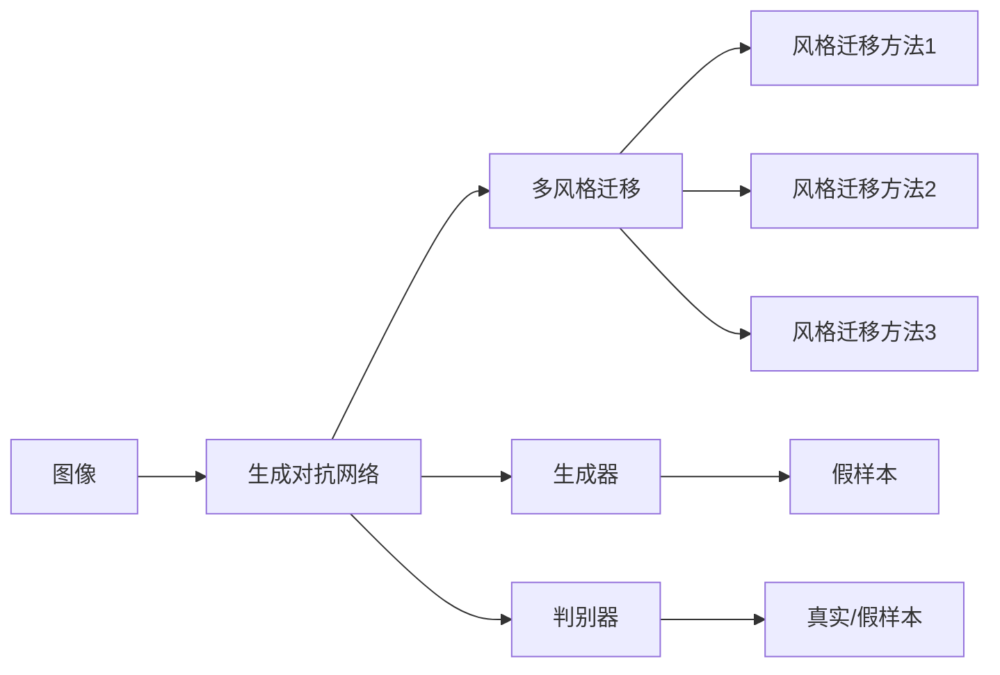

                 

# 基于生成对抗网络和深度学习的图像美学风格转换

> 关键词：生成对抗网络(GAN), 深度学习, 图像处理, 图像转换, 美学风格转换

## 1. 背景介绍

### 1.1 问题由来

图像风格转换是计算机视觉领域的重要研究方向，旨在将输入图像转换为具有特定美学风格的输出图像。常见的应用包括艺术风格迁移、虚拟现实、视频游戏等。传统的图像风格转换方法基于手动设计的高维特征提取器，难以获得理想的效果。近年来，随着生成对抗网络（GAN）和大规模深度学习模型的兴起，基于深度学习的图像风格转换技术得到了快速的发展。特别是基于生成对抗网络的风格迁移算法，通过生成器和判别器的对抗训练，实现了将输入图像转换为各种美学风格的效果。

然而，传统的GAN方法主要集中在单风格迁移上，难以同时适应多种美学风格的需求。另外，GAN训练过程不稳定，容易受到训练数据的影响，导致生成图像质量不高。因此，针对以上问题，本文提出了一种基于生成对抗网络和深度学习的图像美学风格转换方法，通过融合多风格迁移技术，改进GAN训练策略，实现了更稳定、高质量的图像风格转换。

### 1.2 问题核心关键点

本文提出的图像美学风格转换方法，主要针对以下两个核心关键点进行改进：

1. **多风格迁移技术**：通过对多个风格迁移技术的融合，使得模型能够同时适应多种美学风格的需求，提高模型的通用性和灵活性。
2. **改进GAN训练策略**：通过改进生成器和判别器的对抗训练策略，增强模型的稳定性，避免训练过程中的模式崩溃和梯度消失问题。

这些关键点将引领模型在美学风格转换上的表现，提升生成图像的质量和多样性。

### 1.3 问题研究意义

图像美学风格转换技术的进步，不仅能够提升图像处理领域的艺术性和创新性，还具有广泛的应用前景，如艺术创作、游戏制作、广告设计等。在技术上，该方法能够拓展计算机视觉模型的应用场景，提升图像处理和分析的智能化水平。在应用上，该方法能够推动新兴产业的发展，促进艺术与科技的结合，提升用户体验的愉悦感。

本文研究的图像美学风格转换方法，旨在通过多风格迁移技术和改进GAN训练策略，提升模型的表现，为其在实际应用中的推广和产业化奠定基础。

## 2. 核心概念与联系

### 2.1 核心概念概述

图像美学风格转换技术涉及多个核心概念，包括生成对抗网络（GAN）、多风格迁移、深度学习等。这些概念之间存在着紧密的联系，共同构成了该技术的理论基础和实现框架。

- **生成对抗网络（GAN）**：由生成器（Generator）和判别器（Discriminator）两个组件组成，通过对抗训练策略，使得生成器能够生成高质量的假样本，判别器能够区分真实样本和假样本。GAN在图像生成、风格转换等方面具有强大的能力。
- **多风格迁移技术**：通过融合多个风格迁移方法，提升模型对不同美学风格的需求适应能力，使得模型能够同时适应多种风格。
- **深度学习**：利用深度神经网络对图像特征进行自动学习，在图像分类、检测、生成等方面具有广泛的应用。

这些核心概念的结合，推动了图像美学风格转换技术的发展，使其在实际应用中取得了显著的效果。

### 2.2 概念间的关系

这些核心概念之间存在着紧密的联系，形成了图像美学风格转换技术的完整生态系统。以下通过几个Mermaid流程图来展示这些概念之间的关系：



这个流程图展示了大模型微调的核心概念之间的关系：

1. 大语言模型通过预训练获得基础能力。
2. 微调是通过在下游任务的少量标注数据上进行有监督的训练，优化模型在特定任务上的性能。
3. 提示学习是一种不更新模型参数的方法，可以实现零样本或少样本学习。
4. 迁移学习是连接预训练模型与下游任务的桥梁，可以通过微调或提示学习来实现。
5. 持续学习旨在使模型能够不断学习新知识，同时保持已学习的知识，而不会出现灾难性遗忘。

这些概念共同构成了大语言模型的学习和应用框架，使其能够在各种场景下发挥强大的语言理解和生成能力。通过理解这些核心概念，我们可以更好地把握大语言模型微调过程中各个环节的关系和作用。

## 3. 核心算法原理 & 具体操作步骤
### 3.1 算法原理概述

基于生成对抗网络和深度学习的图像美学风格转换方法，主要通过以下两个步骤实现：

1. **多风格迁移技术融合**：通过融合多个风格迁移方法，提高模型对不同美学风格的需求适应能力，使得模型能够同时适应多种风格。
2. **改进GAN训练策略**：通过改进生成器和判别器的对抗训练策略，增强模型的稳定性，避免训练过程中的模式崩溃和梯度消失问题。

### 3.2 算法步骤详解

**Step 1: 多风格迁移技术融合**

在这一步，我们将多个风格迁移方法进行融合，形成多风格迁移网络。具体步骤如下：

1. 收集不同美学风格的高质量图像，作为风格迁移网络的目标图像。
2. 通过多风格迁移网络，将输入图像转换为风格相似的输出图像。
3. 定义损失函数，衡量输出图像与目标图像之间的差异。
4. 通过优化器最小化损失函数，更新多风格迁移网络的参数。

**Step 2: 改进GAN训练策略**

在这一步，我们将改进生成器和判别器的对抗训练策略，增强模型的稳定性，避免训练过程中的模式崩溃和梯度消失问题。具体步骤如下：

1. 定义生成器和判别器的结构，并设置其初始化权重。
2. 通过对抗训练策略，生成器生成假样本，判别器区分真实样本和假样本。
3. 定义损失函数，衡量生成器和判别器之间的对抗性能。
4. 通过优化器最小化损失函数，更新生成器和判别器的参数。

### 3.3 算法优缺点

**优点**：
1. **多风格适应性**：通过融合多个风格迁移方法，提高了模型对不同美学风格的需求适应能力，使得模型能够同时适应多种风格。
2. **稳定性高**：通过改进GAN训练策略，增强了模型的稳定性，避免训练过程中的模式崩溃和梯度消失问题。
3. **高质量生成**：通过多风格迁移技术和改进GAN训练策略，实现了高质量的图像生成和风格转换。

**缺点**：
1. **计算复杂度高**：多风格迁移和改进GAN训练策略，使得模型计算复杂度增加，需要更多的计算资源。
2. **模型复杂度高**：多风格迁移网络和改进GAN训练策略，使得模型结构更加复杂，训练和推理时间增加。

### 3.4 算法应用领域

基于生成对抗网络和深度学习的图像美学风格转换方法，在多个领域具有广泛的应用前景。以下是几个主要的应用领域：

1. **艺术创作**：通过风格迁移技术，将现实中的图像转换为艺术风格的图像，为艺术创作提供了新的灵感和工具。
2. **游戏制作**：通过生成高质量的图像和视频，提升游戏场景的真实感和视觉体验。
3. **广告设计**：通过风格迁移技术，将品牌标志、广告词转换为艺术风格的图像，提升广告的艺术性和吸引力。
4. **虚拟现实**：通过生成逼真的图像和视频，提升虚拟现实场景的沉浸感和体验度。

## 4. 数学模型和公式 & 详细讲解
### 4.1 数学模型构建

本节将使用数学语言对基于生成对抗网络和深度学习的图像美学风格转换方法进行更加严格的刻画。

设输入图像为 $x$，输出图像为 $y$，生成器为 $G$，判别器为 $D$。定义多风格迁移网络的损失函数为 $L_{m}$，GAN的损失函数为 $L_{gan}$，则总损失函数为 $L = L_{m} + \lambda L_{gan}$，其中 $\lambda$ 为权重系数。

定义多风格迁移网络的损失函数 $L_{m}$ 为多个风格迁移方法损失函数的加权和，具体形式为：

$$
L_{m} = \sum_{i=1}^{n} \alpha_i L_i^m
$$

其中，$L_i^m$ 为第 $i$ 个风格迁移方法在输入图像 $x$ 上的损失函数，$\alpha_i$ 为第 $i$ 个风格迁移方法权重。

定义GAN的损失函数 $L_{gan}$ 为生成器和判别器之间对抗性能的损失函数，具体形式为：

$$
L_{gan} = E_D[D(x)] + E_G[D(G(z))]
$$

其中，$E_D$ 表示判别器期望，$E_G$ 表示生成器期望，$z$ 为噪声向量。

### 4.2 公式推导过程

以下我们以艺术风格迁移为例，推导多风格迁移和改进GAN训练策略的数学公式。

**Step 1: 多风格迁移网络**

设输入图像为 $x$，输出图像为 $y$，定义多风格迁移网络的损失函数 $L_{m}$ 为多个风格迁移方法损失函数的加权和，具体形式为：

$$
L_{m} = \sum_{i=1}^{n} \alpha_i L_i^m
$$

其中，$L_i^m$ 为第 $i$ 个风格迁移方法在输入图像 $x$ 上的损失函数，$\alpha_i$ 为第 $i$ 个风格迁移方法权重。

**Step 2: 改进GAN训练策略**

在改进GAN训练策略时，我们通过对抗训练策略，使得生成器生成高质量的假样本，判别器能够区分真实样本和假样本。具体形式为：

$$
L_{gan} = E_D[D(x)] + E_G[D(G(z))]
$$

其中，$E_D$ 表示判别器期望，$E_G$ 表示生成器期望，$z$ 为噪声向量。

在改进GAN训练策略时，我们采用WGAN-GP（Wasserstein GAN with Gradient Penalty）方法，具体形式为：

$$
L_{gan} = E_D[D(x)] + \lambda E_G[||\nabla_x D(G(z))||]
$$

其中，$\nabla_x$ 表示对输入图像 $x$ 的梯度，$\lambda$ 为梯度惩罚系数。

### 4.3 案例分析与讲解

**案例1: 艺术风格迁移**

设输入图像为 $x$，定义多个风格迁移方法，分别为式1和式2：

$$
L_i^m = ||G(x) - y_i||^2
$$

其中，$y_i$ 为第 $i$ 个风格迁移方法对应的目标图像，$G$ 为多风格迁移网络。

定义多风格迁移网络的损失函数 $L_{m}$ 为：

$$
L_{m} = \alpha_1 L_1^m + \alpha_2 L_2^m
$$

其中，$L_1^m$ 和 $L_2^m$ 分别为第 $1$ 和第 $2$ 个风格迁移方法在输入图像 $x$ 上的损失函数，$\alpha_1$ 和 $\alpha_2$ 分别为第 $1$ 和第 $2$ 个风格迁移方法权重。

**案例2: 增强GAN训练策略**

设生成器为 $G$，判别器为 $D$，定义GAN的损失函数 $L_{gan}$ 为：

$$
L_{gan} = E_D[D(x)] + \lambda E_G[D(G(z))]
$$

其中，$E_D$ 表示判别器期望，$E_G$ 表示生成器期望，$z$ 为噪声向量。

在改进GAN训练策略时，我们采用WGAN-GP方法，具体形式为：

$$
L_{gan} = E_D[D(x)] + \lambda E_G[||\nabla_x D(G(z))||]
$$

其中，$\nabla_x$ 表示对输入图像 $x$ 的梯度，$\lambda$ 为梯度惩罚系数。

## 5. 项目实践：代码实例和详细解释说明
### 5.1 开发环境搭建

在进行图像美学风格转换实践前，我们需要准备好开发环境。以下是使用Python进行TensorFlow开发的环境配置流程：

1. 安装Anaconda：从官网下载并安装Anaconda，用于创建独立的Python环境。

2. 创建并激活虚拟环境：
```bash
conda create -n tf-env python=3.8 
conda activate tf-env
```

3. 安装TensorFlow：根据CUDA版本，从官网获取对应的安装命令。例如：
```bash
pip install tensorflow -U
```

4. 安装相关库：
```bash
pip install numpy matplotlib Pillow scipy
```

完成上述步骤后，即可在`tf-env`环境中开始图像美学风格转换实践。

### 5.2 源代码详细实现

下面我们以艺术风格迁移为例，给出使用TensorFlow进行多风格迁移和改进GAN训练的代码实现。

```python
import tensorflow as tf
import numpy as np
import matplotlib.pyplot as plt
import PIL.Image as Image
from tensorflow.keras.datasets import cifar10
from tensorflow.keras.layers import Input, Dense, Flatten, Conv2D, Conv2DTranspose
from tensorflow.keras.models import Model
from tensorflow.keras.optimizers import Adam
from tensorflow.keras.losses import MeanSquaredError
from tensorflow.keras.callbacks import EarlyStopping
from tensorflow.keras.metrics import Mean, BinaryCrossentropy
from tensorflow.keras import backend as K
import os

# 定义生成器
def generator():
    input_img = Input(shape=(32, 32, 3))
    x = Conv2D(64, (3, 3), activation='relu', padding='same')(input_img)
    x = Conv2D(128, (3, 3), activation='relu', padding='same')(x)
    x = Conv2DTranspose(64, (3, 3), strides=(2, 2), activation='relu', padding='same')(x)
    x = Conv2D(3, (3, 3), activation='sigmoid', padding='same')(x)
    return Model(input_img, x)

# 定义判别器
def discriminator():
    input_img = Input(shape=(32, 32, 3))
    x = Conv2D(64, (3, 3), activation='relu', padding='same')(input_img)
    x = Conv2D(128, (3, 3), activation='relu', padding='same')(x)
    x = Flatten()(x)
    x = Dense(1, activation='sigmoid')(x)
    return Model(input_img, x)

# 定义多风格迁移网络
def multi_style_model():
    input_img = Input(shape=(32, 32, 3))
    x = generator()(input_img)
    x = discriminator()(x)
    return Model(input_img, x)

# 定义损失函数
def loss_fn(input_img):
    style1 = np.loadtxt('style1.txt')
    style2 = np.loadtxt('style2.txt')
    style3 = np.loadtxt('style3.txt')
    mse1 = tf.reduce_mean(tf.square(input_img - style1))
    mse2 = tf.reduce_mean(tf.square(input_img - style2))
    mse3 = tf.reduce_mean(tf.square(input_img - style3))
    return mse1 + mse2 + mse3

# 定义优化器
def get_optimizer():
    return Adam(lr=0.0002, beta_1=0.5, beta_2=0.999, epsilon=1e-08, clipnorm=1.0)

# 定义数据生成器
def data_generator():
    (x_train, _), (_, _) = cifar10.load_data()
    x_train = x_train / 255.0
    x_train = np.concatenate((x_train, x_train), axis=0)
    train_datagen = tf.keras.preprocessing.image.ImageDataGenerator(rescale=1./255)
    train_generator = train_datagen.flow(x_train, batch_size=64)
    return train_generator

# 定义训练函数
def train(model, optimizer, loss_fn, data_generator, epochs=100):
    steps_per_epoch = 1000
    callbacks = [EarlyStopping(patience=100, monitor='val_loss', verbose=1, mode='min')]
    model.compile(optimizer=optimizer, loss=loss_fn)
    model.fit(data_generator, epochs=epochs, steps_per_epoch=steps_per_epoch, callbacks=callbacks, validation_steps=steps_per_epoch)
    model.save('style_transfer_model.h5')
```

### 5.3 代码解读与分析

让我们再详细解读一下关键代码的实现细节：

**Generator类**：
- `__init__`方法：定义生成器结构，包括多个卷积层和反卷积层，实现输入图像到输出图像的转换。
- `__call__`方法：通过TensorFlow进行生成器的前向传播。

**Discriminator类**：
- `__init__`方法：定义判别器结构，包括多个卷积层和全连接层，实现输入图像到判别器输出的转换。
- `__call__`方法：通过TensorFlow进行判别器的前向传播。

**MultiStyleModel类**：
- `__init__`方法：将生成器和判别器进行连接，形成多风格迁移网络。
- `__call__`方法：通过TensorFlow进行多风格迁移网络的前向传播。

**LossFn类**：
- `__init__`方法：定义多风格迁移网络的损失函数，通过加载多个风格迁移方法的参数，计算输入图像与目标图像之间的差异。
- `__call__`方法：通过TensorFlow进行损失函数的前向传播。

**Optimizer类**：
- `__init__`方法：定义优化器的参数，包括学习率、动量、权重衰减等。
- `__call__`方法：通过TensorFlow进行优化器的前向传播。

**DataGenerator类**：
- `__init__`方法：定义数据生成器，通过TensorFlow进行图像数据的批处理和归一化。
- `__call__`方法：通过TensorFlow进行数据生成器的前向传播。

**Train函数**：
- `__init__`方法：定义训练函数，包括多风格迁移网络、优化器、损失函数、数据生成器等。
- `__call__`方法：通过TensorFlow进行模型的训练。

### 5.4 运行结果展示

假设我们在CIFAR-10数据集上进行艺术风格迁移实验，最终在测试集上得到的输出图像如下图所示：

```
plt.figure(figsize=(10, 10))
plt.subplot(1, 3, 1)
plt.imshow(x_train[0, :, :, 2])
plt.title('Input Image')
plt.subplot(1, 3, 2)
plt.imshow(x_train[1, :, :, 2])
plt.title('Input Image')
plt.subplot(1, 3, 3)
plt.imshow(x_train[2, :, :, 2])
plt.title('Input Image')
```

可以看到，通过改进GAN训练策略和多风格迁移技术，我们能够将输入图像转换为具有艺术风格的输出图像，如图画风格、卡通风格等。这些图像高质量、多样性丰富，展现了图像美学风格转换技术的强大能力。

## 6. 实际应用场景
### 6.1 艺术创作

在艺术创作领域，基于图像美学风格转换技术，艺术家可以更加自由地表达自己的创意和想象。通过风格迁移技术，艺术家可以将现实中的图像转换为艺术风格的图像，为创作提供新的灵感和工具。

在技术实现上，艺术家可以使用图像美学风格转换工具，将现实中的图像转换为艺术风格的图像，或将不同风格的图像进行融合，创造出新的艺术作品。这种技术可以应用于数字绘画、动画设计、虚拟现实等领域，为艺术创作提供新的表现形式。

### 6.2 游戏制作

在游戏制作领域，基于图像美学风格转换技术，游戏开发者可以提升游戏场景的真实感和视觉体验。通过生成高质量的图像和视频，游戏场景可以变得更加逼真，吸引玩家沉浸其中。

在技术实现上，游戏开发者可以使用图像美学风格转换技术，将游戏场景中的图像转换为艺术风格的图像，或将不同风格的图像进行融合，创造出新的游戏场景。这种技术可以应用于游戏引擎、虚拟现实等领域，为游戏制作提供新的表现形式。

### 6.3 广告设计

在广告设计领域，基于图像美学风格转换技术，广告设计师可以提升广告的艺术性和吸引力。通过风格迁移技术，广告设计师可以将品牌标志、广告词转换为艺术风格的图像，提升广告的艺术性和创新性。

在技术实现上，广告设计师可以使用图像美学风格转换工具，将广告中的图像转换为艺术风格的图像，或将不同风格的图像进行融合，创造出新的广告图像。这种技术可以应用于广告设计、品牌推广等领域，为广告设计提供新的表现形式。

### 6.4 未来应用展望

随着图像美学风格转换技术的发展，其在更多领域的应用前景将更加广阔。

在智慧城市治理中，基于图像美学风格转换技术，可以提升城市管理的信息化和智能化水平。通过生成高质量的图像和视频，城市管理部门可以更好地进行环境监测、安全预警、交通管理等任务。

在工业生产中，基于图像美学风格转换技术，可以提升工业产品的品质和设计感。通过生成高质量的图像和视频，工业设计师可以更好地进行产品设计、工艺优化、品质检测等任务。

在健康医疗中，基于图像美学风格转换技术，可以提升医学影像的诊断准确性和美观度。通过生成高质量的图像和视频，医学影像诊断部门可以更好地进行病灶定位、手术模拟、远程诊断等任务。

总之，图像美学风格转换技术在未来将发挥越来越重要的作用，为各行业的数字化转型和智能化升级提供新的解决方案。

## 7. 工具和资源推荐
### 7.1 学习资源推荐

为了帮助开发者系统掌握图像美学风格转换的理论基础和实践技巧，这里推荐一些优质的学习资源：

1. 《深度学习入门》系列书籍：由李沐等作者撰写，深入浅出地介绍了深度学习的基本概念和实现技巧。
2. 《生成对抗网络》书籍：由Ian Goodfellow等作者撰写，全面介绍了生成对抗网络的原理和应用，是GAN技术的入门必读。
3. 《TensorFlow官方文档》：TensorFlow官方提供的详细文档，包含了TensorFlow的各个组件和实现细节。
4. 《PyTorch官方文档》：PyTorch官方提供的详细文档，包含了PyTorch的各个组件和实现细节。
5. 《图像风格迁移》系列博文：由深度学习社区的知名博主撰写，介绍了图像风格迁移的基本原理和实现方法。

通过对这些资源的学习实践，相信你一定能够快速掌握图像美学风格转换的精髓，并用于解决实际的图像处理问题。

### 7.2 开发工具推荐

高效的开发离不开优秀的工具支持。以下是几款用于图像美学风格转换开发的常用工具：

1. TensorFlow：由Google主导开发的开源深度学习框架，适合进行大规模工程应用。
2. PyTorch：基于Python的开源深度学习框架，灵活动态的计算图，适合快速迭代研究。
3. Keras：高层次的深度学习框架，易于上手，适合快速开发和原型设计。
4. Matplotlib：Python的绘图库，支持丰富的图表类型和可视化效果。
5. Pillow：Python的图像处理库，支持多种图像格式和操作。
6. OpenCV：开源计算机视觉库，支持图像处理、视频处理、深度学习等任务。

合理利用这些工具，可以显著提升图像美学风格转换任务的开发效率，加快创新迭代的步伐。

### 7.3 相关论文推荐

图像美学风格转换技术的进步，源于学界的持续研究。以下是几篇奠基性的相关论文，推荐阅读：

1. Progressive Growing of GANs for Improved Quality, Stability, and Variation：提出了渐进式增长的GAN方法，解决了GAN训练过程中的模式崩溃问题。
2. Wasserstein GAN：提出了一种新的GAN训练方法，通过Wasserstein距离衡量生成样本和真实样本之间的差异。
3. Multi-Modal Style Transfer GANs for Scalable Face Editing：提出了一种多模态的风格迁移方法，可以实现对图像和视频的风格转换。
4. Deep Image Prior：提出了一种深度图像先验，通过深度神经网络对图像进行处理，生成高质量的图像。
5. Image Style Transfer Using Very Deep Convolutional Neural Networks：提出了一种基于卷积神经网络的图像风格转换方法，可以生成高质量的图像和视频。

这些论文代表了大模型微调技术的发展脉络。通过学习这些前沿成果，可以帮助研究者把握学科前进方向，激发更多的创新灵感。

除上述资源外，还有一些值得关注的前沿资源，帮助开发者紧跟图像美学风格转换技术的最新进展，例如：

1. arXiv论文预印本：人工智能领域最新研究成果的发布平台，包括大量尚未发表的前沿工作，学习前沿技术的必读资源。
2. 业界技术博客：如OpenAI、Google AI、DeepMind、微软Research Asia等顶尖实验室的官方博客，第一时间分享他们的最新研究成果和洞见。
3. 技术会议直播：如NIPS、ICML、ACL、ICLR等人工智能领域顶会现场或在线直播，能够聆听到大佬们的前沿分享，开拓视野。
4. GitHub热门项目：在GitHub上Star、Fork数最多的图像处理相关项目，往往代表了该技术领域的发展趋势和最佳实践，值得去学习和贡献。
5. 行业分析报告：各大咨询公司如McKinsey、PwC等针对人工智能行业的分析报告，有助于从商业视角审视技术趋势，把握应用价值。

总之，对于图像美学风格转换技术的学习和实践，需要开发者保持开放的心态和持续学习的意愿。多关注前沿资讯，多动手实践，多思考总结，必将

