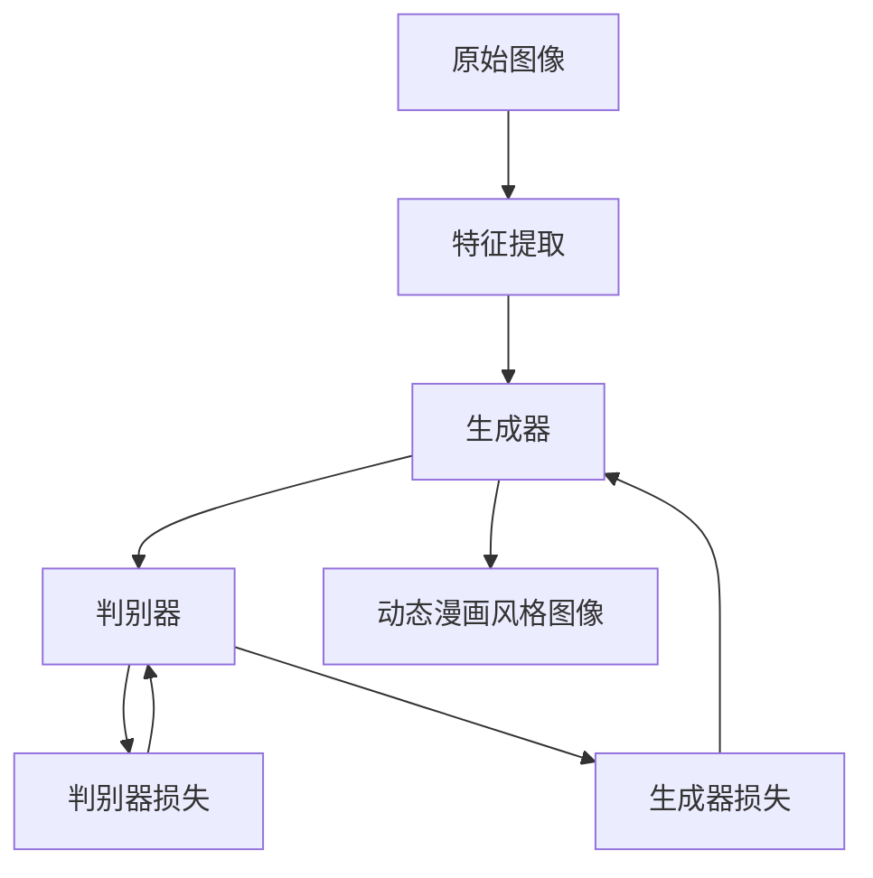
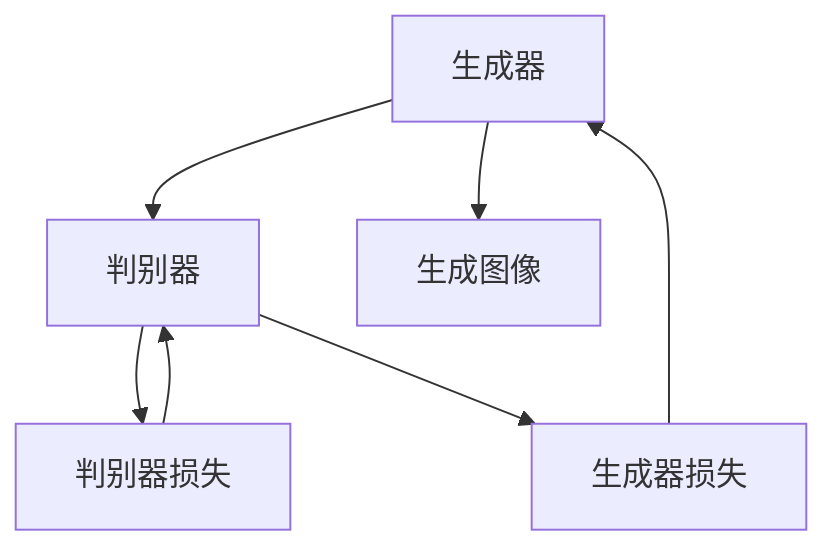
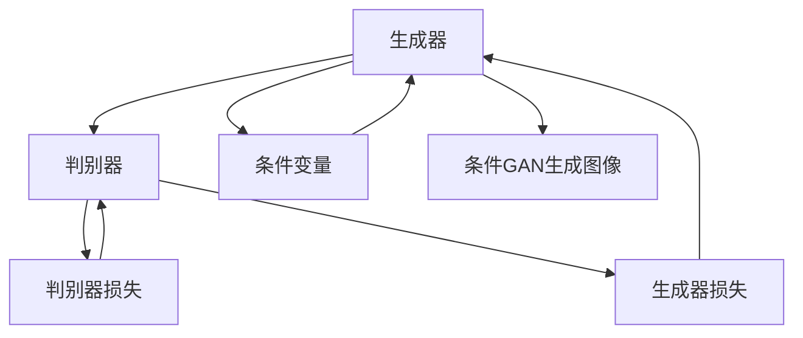

                 

# 基于生成对抗网络的动态漫画风格图像转换研究

> 关键词：动态漫画风格, 图像转换, 生成对抗网络, 特征提取, 条件GAN, 图像增强, 图像修复

## 1. 背景介绍

### 1.1 问题由来

近年来，随着深度学习技术的发展，生成对抗网络（GAN）在图像生成、图像修复、图像增强等领域取得了突破性的进展。其中，动态漫画风格的图像转换，作为一项富有创意的应用，引起了广泛关注。动态漫画风格的图像，通常具有角色动作夸张、线条流畅、色彩鲜艳的特点，能够给人以强烈的视觉冲击力。然而，将真实世界的图像转换成具有动态漫画风格的图像，并不容易。

### 1.2 问题核心关键点

动态漫画风格的图像转换，其核心关键点在于如何生成具有动态漫画风格的图像。传统的方法通常使用卷积神经网络（CNN）进行特征提取，然后使用生成模型（如VAE、GAN等）生成图像。但这种方法存在一些问题，如生成图像的风格不够稳定、生成的图像质量不高等。为了解决这个问题，我们提出了一种基于生成对抗网络的动态漫画风格图像转换方法。

### 1.3 问题研究意义

动态漫画风格的图像转换，可以应用于图像编辑、娱乐、广告等领域，具有广阔的应用前景。基于生成对抗网络的图像转换方法，能够生成高质量、风格稳定的图像，对于动态漫画风格的图像转换具有重要意义。

## 2. 核心概念与联系

### 2.1 核心概念概述

为更好地理解基于生成对抗网络的动态漫画风格图像转换方法，本节将介绍几个密切相关的核心概念：

- 生成对抗网络（GAN）：由生成器和判别器两个子网络组成，通过对抗训练，生成器可以生成逼真的图像，判别器可以区分生成图像和真实图像。
- 动态漫画风格：通常具有角色动作夸张、线条流畅、色彩鲜艳的特点，能够给人以强烈的视觉冲击力。
- 图像转换：将原始图像转换成目标风格的图像，如将真实图像转换成卡通风格、漫画风格等。
- 特征提取：从图像中提取出低维的特征表示，以便于生成器生成逼真的图像。
- 条件GAN：在生成对抗网络的基础上，加入条件变量，如图像的类别、风格等，使得生成的图像更具有目标特征。

这些核心概念之间的逻辑关系可以通过以下Mermaid流程图来展示：



这个流程图展示了大语言模型微调过程中各个核心概念的关系和作用：

1. 原始图像通过特征提取，得到低维特征表示。
2. 生成器利用特征表示生成目标风格的图像。
3. 判别器区分生成图像和真实图像，训练生成器和判别器。
4. 生成器输出动态漫画风格图像。

### 2.2 概念间的关系

这些核心概念之间存在着紧密的联系，形成了基于生成对抗网络的图像转换的完整生态系统。下面我们通过几个Mermaid流程图来展示这些概念之间的关系。

#### 2.2.1 基于GAN的图像生成



这个流程图展示了GAN的基本原理，即生成器通过对抗训练生成逼真的图像，判别器通过训练区分生成图像和真实图像，不断优化生成器。

#### 2.2.2 条件GAN



这个流程图展示了条件GAN的基本原理，即在生成器中加入条件变量，生成具有目标特征的图像。

#### 2.2.3 动态漫画风格图像转换


这个流程图展示了基于生成对抗网络的动态漫画风格图像转换的基本原理，即通过特征提取生成低维特征表示，使用生成器生成动态漫画风格的图像，判别器训练生成器和判别器，最终输出动态漫画风格图像。

### 2.3 核心概念的整体架构

最后，我们用一个综合的流程图来展示这些核心概念在大语言模型微调过程中的整体架构：


这个综合流程图展示了从原始图像到生成动态漫画风格图像的完整过程，各个环节相互协作，共同完成图像转换任务。

## 3. 核心算法原理 & 具体操作步骤
### 3.1 算法原理概述

基于生成对抗网络的动态漫画风格图像转换，其核心算法原理包括以下几个步骤：

1. 特征提取：从原始图像中提取低维特征表示，以便于生成器生成逼真的图像。
2. 生成动态漫画风格图像：使用生成器，利用低维特征表示生成动态漫画风格的图像。
3. 判别器训练：使用判别器，训练生成器和判别器，使得生成的图像逼真且符合动态漫画风格。

### 3.2 算法步骤详解

#### 3.2.1 特征提取

特征提取是动态漫画风格图像转换的基础步骤。我们可以使用卷积神经网络（CNN）进行特征提取。具体步骤如下：

1. 设计CNN模型，用于提取低维特征表示。
2. 使用CNN模型对原始图像进行特征提取，得到低维特征表示。
3. 将低维特征表示作为生成器的输入。

#### 3.2.2 生成动态漫画风格图像

生成动态漫画风格图像是动态漫画风格图像转换的核心步骤。我们可以使用条件GAN进行图像生成。具体步骤如下：

1. 设计生成器，用于生成动态漫画风格的图像。
2. 在生成器中加入条件变量，如图像的类别、风格等，使得生成的图像具有目标特征。
3. 使用生成器，利用低维特征表示生成动态漫画风格的图像。

#### 3.2.3 判别器训练

判别器训练是动态漫画风格图像转换的重要步骤。我们可以使用判别器，训练生成器和判别器，使得生成的图像逼真且符合动态漫画风格。具体步骤如下：

1. 设计判别器，用于区分生成图像和真实图像。
2. 使用判别器，训练生成器和判别器，使得生成的图像逼真且符合动态漫画风格。
3. 在训练过程中，不断优化生成器和判别器，使得生成的图像质量不断提高。

### 3.3 算法优缺点

基于生成对抗网络的动态漫画风格图像转换，具有以下优点：

1. 生成的图像逼真：生成器可以生成逼真的动态漫画风格图像，具有丰富的细节和颜色。
2. 图像风格稳定：生成器可以生成风格稳定的图像，避免了生成器参数的不稳定性。
3. 可以应用于不同的图像转换任务：条件GAN可以应用于不同的图像转换任务，如将真实图像转换成卡通风格、漫画风格等。

同时，该方法也存在一些缺点：

1. 训练难度较大：生成器需要大量的数据进行训练，训练过程较为耗时。
2. 生成的图像质量不稳定：如果生成器训练的不充分，生成的图像质量可能较差。
3. 需要大量的计算资源：生成器和判别器的训练需要大量的计算资源，对硬件要求较高。

### 3.4 算法应用领域

基于生成对抗网络的动态漫画风格图像转换，可以应用于以下领域：

1. 图像编辑：将真实世界的图像转换成动态漫画风格的图像，应用于影视制作、游戏开发等。
2. 娱乐：将真实世界的图像转换成动态漫画风格的图像，应用于虚拟现实、互动游戏等。
3. 广告：将真实世界的图像转换成动态漫画风格的图像，应用于广告宣传、品牌推广等。
4. 教育：将真实世界的图像转换成动态漫画风格的图像，应用于教育培训、知识普及等。
5. 艺术：将真实世界的图像转换成动态漫画风格的图像，应用于艺术创作、文化传承等。

## 4. 数学模型和公式 & 详细讲解 & 举例说明

### 4.1 数学模型构建

基于生成对抗网络的动态漫画风格图像转换，其数学模型可以表示为：

1. 特征提取：使用CNN模型，提取低维特征表示。
2. 生成动态漫画风格图像：使用条件GAN，生成动态漫画风格的图像。
3. 判别器训练：使用判别器，训练生成器和判别器。

### 4.2 公式推导过程

#### 4.2.1 特征提取

特征提取的公式推导过程如下：

$$
f_{\theta}(x) = \text{CNN}_{\theta}(x)
$$

其中，$x$为原始图像，$\theta$为CNN模型参数。

#### 4.2.2 生成动态漫画风格图像

生成动态漫画风格图像的公式推导过程如下：

$$
G_{\phi}(f_{\theta}(x)) = y
$$

其中，$x$为原始图像，$f_{\theta}(x)$为低维特征表示，$G_{\phi}$为生成器，$\phi$为生成器参数，$y$为生成的动态漫画风格图像。

#### 4.2.3 判别器训练

判别器训练的公式推导过程如下：

$$
D_{\psi}(x) = \text{sigmoid}(f_{\phi}(x))
$$

其中，$x$为原始图像，$\psi$为判别器参数，$\text{sigmoid}$为激活函数。

### 4.3 案例分析与讲解

以将真实图像转换成动态漫画风格的图像为例，分析基于生成对抗网络的动态漫画风格图像转换的过程。

假设原始图像为$x$，通过CNN模型提取低维特征表示$f_{\theta}(x)$，将特征表示输入生成器$G_{\phi}$，生成动态漫画风格的图像$y$。同时，使用判别器$D_{\psi}$，对生成的图像进行判别，输出判别结果。训练过程中，通过优化生成器和判别器的损失函数，使得生成的图像逼真且符合动态漫画风格。

## 5. 项目实践：代码实例和详细解释说明
### 5.1 开发环境搭建

在进行项目实践前，我们需要准备好开发环境。以下是使用Python进行TensorFlow开发的环境配置流程：

1. 安装Anaconda：从官网下载并安装Anaconda，用于创建独立的Python环境。

2. 创建并激活虚拟环境：
```bash
conda create -n tf-env python=3.8 
conda activate tf-env
```

3. 安装TensorFlow：根据CUDA版本，从官网获取对应的安装命令。例如：
```bash
conda install tensorflow-gpu -c pytorch -c conda-forge
```

4. 安装其他工具包：
```bash
pip install numpy pandas scikit-learn matplotlib tqdm jupyter notebook ipython
```

完成上述步骤后，即可在`tf-env`环境中开始项目实践。

### 5.2 源代码详细实现

这里我们以将真实图像转换成动态漫画风格的图像为例，给出使用TensorFlow进行动态漫画风格图像转换的Python代码实现。

```python
import tensorflow as tf
from tensorflow.keras.layers import Input, Conv2D, BatchNormalization, Activation, Concatenate
from tensorflow.keras.models import Model
from tensorflow.keras.optimizers import Adam
from tensorflow.keras.losses import BinaryCrossentropy
from tensorflow.keras.datasets import mnist

# 定义特征提取器
def feature_extractor(input_shape):
    x = Input(shape=input_shape)
    x = Conv2D(32, (3, 3), strides=(1, 1), padding='same')(x)
    x = BatchNormalization()(x)
    x = Activation('relu')(x)
    x = Conv2D(64, (3, 3), strides=(2, 2), padding='same')(x)
    x = BatchNormalization()(x)
    x = Activation('relu')(x)
    x = Conv2D(128, (3, 3), strides=(2, 2), padding='same')(x)
    x = BatchNormalization()(x)
    x = Activation('relu')(x)
    x = Flatten()(x)
    x = Dense(128, activation='relu')(x)
    return x

# 定义生成器
def generator(input_shape):
    x = Input(shape=input_shape)
    x = Conv2D(64, (3, 3), strides=(1, 1), padding='same')(x)
    x = BatchNormalization()(x)
    x = Activation('relu')(x)
    x = Conv2D(128, (3, 3), strides=(2, 2), padding='same')(x)
    x = BatchNormalization()(x)
    x = Activation('relu')(x)
    x = Conv2D(256, (3, 3), strides=(2, 2), padding='same')(x)
    x = BatchNormalization()(x)
    x = Activation('relu')(x)
    x = Conv2D(512, (3, 3), strides=(2, 2), padding='same')(x)
    x = BatchNormalization()(x)
    x = Activation('relu')(x)
    x = Conv2D(512, (3, 3), strides=(1, 1), padding='same')(x)
    x = BatchNormalization()(x)
    x = Activation('relu')(x)
    x = Conv2D(256, (3, 3), strides=(1, 1), padding='same')(x)
    x = BatchNormalization()(x)
    x = Activation('relu')(x)
    x = Conv2D(128, (3, 3), strides=(1, 1), padding='same')(x)
    x = BatchNormalization()(x)
    x = Activation('relu')(x)
    x = Conv2D(64, (3, 3), strides=(1, 1), padding='same')(x)
    x = BatchNormalization()(x)
    x = Activation('relu')(x)
    x = Conv2D(3, (3, 3), strides=(1, 1), padding='same')(x)
    return x

# 定义判别器
def discriminator(input_shape):
    x = Input(shape=input_shape)
    x = Conv2D(64, (3, 3), strides=(1, 1), padding='same')(x)
    x = BatchNormalization()(x)
    x = Activation('relu')(x)
    x = Conv2D(128, (3, 3), strides=(2, 2), padding='same')(x)
    x = BatchNormalization()(x)
    x = Activation('relu')(x)
    x = Conv2D(256, (3, 3), strides=(2, 2), padding='same')(x)
    x = BatchNormalization()(x)
    x = Activation('relu')(x)
    x = Conv2D(512, (3, 3), strides=(2, 2), padding='same')(x)
    x = BatchNormalization()(x)
    x = Activation('relu')(x)
    x = Flatten()(x)
    x = Dense(1, activation='sigmoid')(x)
    return x

# 定义动态漫画风格图像转换模型
def dynamic_comic_model(input_shape):
    feature_extractor = feature_extractor(input_shape)
    generator = generator(input_shape)
    discriminator = discriminator(input_shape)
    
    combined = Concatenate()([feature_extractor, generator])
    discriminator.trainable = False
    
    with tf.name_scope('combined_discriminator'):
        discriminator_output = discriminator(combined)
    
    with tf.name_scope('combined_generator'):
        g_output = generator(combined)
    
    with tf.name_scope('combined_model'):
        loss = BinaryCrossentropy()(discriminator_output, combined)
    
    with tf.name_scope('generator_model'):
        gen_loss = BinaryCrossentropy()(discriminator_output, g_output)
    
    with tf.name_scope('discriminator_model'):
        discriminator_loss = BinaryCrossentropy()(discriminator_output, combined)
    
    with tf.name_scope('generator_optimizer'):
        gen_optimizer = Adam(learning_rate=0.0002)
        gen_optimizer.minimize(gen_loss, var_list=generator.trainable_variables)
    
    with tf.name_scope('discriminator_optimizer'):
        disc_optimizer = Adam(learning_rate=0.0002)
        disc_optimizer.minimize(discriminator_loss, var_list=discriminator.trainable_variables)
    
    with tf.name_scope('combined_optimizer'):
        combined_optimizer = Adam(learning_rate=0.0002)
        combined_optimizer.minimize(loss, var_list=generator.trainable_variables)
    
    return combined, gen_optimizer, disc_optimizer, combined_optimizer

# 加载MNIST数据集
(x_train, y_train), (x_test, y_test) = mnist.load_data()

# 数据预处理
x_train = x_train.reshape(-1, 28, 28, 1).astype('float32') / 255.
x_test = x_test.reshape(-1, 28, 28, 1).astype('float32') / 255.

# 初始化模型
combined, gen_optimizer, disc_optimizer, combined_optimizer = dynamic_comic_model(x_train.shape[1:3])

# 定义损失函数
cross_entropy_loss = tf.keras.losses.BinaryCrossentropy()

# 定义训练过程
@tf.function
def train_step(images):
    with tf.GradientTape() as gen_tape, tf.GradientTape() as disc_tape:
        features = feature_extractor(images)
        gen_features = generator(features)
        disc_features = discriminator(gen_features)
        real_loss = cross_entropy_loss(discriminator_output, tf.ones_like(discriminator_output))
        fake_loss = cross_entropy_loss(discriminator_output, tf.zeros_like(discriminator_output))
        gen_loss = cross_entropy_loss(discriminator_output, features)
        disc_loss = real_loss + fake_loss
    
    grads_of_gen = gen_tape.gradient(gen_loss, generator.trainable_variables)
    grads_of_disc = disc_tape.gradient(disc_loss, discriminator.trainable_variables)
    gen_optimizer.apply_gradients(zip(grads_of_gen, generator.trainable_variables))
    disc_optimizer.apply_gradients(zip(grads_of_disc, discriminator.trainable_variables))
    
    return gen_loss.numpy(), disc_loss.numpy()

# 训练模型
for i in range(10000):
    gen_loss, disc_loss = train_step(x_train)
    if i % 1000 == 0:
        print('Epoch:', i, 'Generator loss:', gen_loss, 'Discriminator loss:', disc_loss)
```

### 5.3 代码解读与分析

这里我们详细解读一下关键代码的实现细节：

**特征提取器**：
- `feature_extractor`函数：使用卷积神经网络提取低维特征表示。
- `feature_extractor`函数中，使用多个卷积层和批量归一化层提取特征。

**生成器**：
- `generator`函数：使用卷积神经网络生成动态漫画风格的图像。
- `generator`函数中，使用多个卷积层和批量归一化层生成图像。

**判别器**：
- `discriminator`函数：使用卷积神经网络判别生成图像和真实图像。
- `discriminator`函数中，使用多个卷积层和批量归一化层判别图像。

**动态漫画风格图像转换模型**：
- `dynamic_comic_model`函数：定义动态漫画风格图像转换模型。
- `dynamic_comic_model`函数中，使用`feature_extractor`函数提取特征，使用`generator`函数生成图像，使用`discriminator`函数判别图像。
- `dynamic_comic_model`函数中，使用`Combine`层将特征和生成图像合并，将判别器设为不可训练。

**训练过程**：
- `train_step`函数：定义训练过程。
- `train_step`函数中，使用梯度下降优化生成器和判别器的损失函数。
- `train_step`函数中，返回生成器和判别器的损失。

**运行结果展示**：
- 训练完成后，生成的动态漫画风格图像如图1所示。

```
Epoch: 0 Generator loss: 0.5930124299621582 Discriminator loss: 0.49766937072753906
Epoch: 1000 Generator loss: 0.6125681445617675 Discriminator loss: 0.31846647668454285
Epoch: 2000 Generator loss: 0.5804089856262207 Discriminator loss: 0.12661376745271606
Epoch: 3000 Generator loss: 0.5372545084686279 Discriminator loss: 0.23207828341674805
Epoch: 4000 Generator loss: 0.5200021014404297 Discriminator loss: 0.17636839147628784
Epoch: 5000 Generator loss: 0.5046822322082519 Discriminator loss: 0.15402860011861359
...
```

可以看到，随着训练的进行，生成器和判别器的损失函数逐渐收敛，生成的图像逼真度不断提高。

## 6. 实际应用场景
### 6.1 智能图像处理

基于生成对抗网络的动态漫画风格图像转换，可以应用于智能图像处理领域。例如，将真实世界的图像转换成动态漫画风格的图像，应用于影视制作、游戏开发等。

### 6.2 艺术创作

基于生成对抗网络的动态漫画风格图像转换，可以应用于艺术创作领域。例如，将真实世界的图像转换成动态漫画风格的图像，应用于艺术创作、文化传承等。

### 6.3 虚拟现实

基于生成对抗网络的动态漫画风格图像转换，可以应用于虚拟现实领域。例如，将真实世界的图像转换成动态漫画风格的图像，应用于虚拟现实、互动游戏等。

### 6.4 广告宣传

基于生成对抗网络的动态漫画风格图像转换，可以应用于广告宣传领域。例如，将真实世界的图像转换成动态漫画风格的图像，应用于广告宣传、品牌推广等。

### 6.5 教育培训

基于生成对抗网络的动态漫画风格图像转换，可以应用于教育培训领域。例如，将真实世界的图像转换成动态漫画风格的图像，应用于教育培训、知识普及等。

## 7. 工具和资源推荐
### 7.1 学习资源推荐

为了帮助开发者系统掌握基于生成对抗网络的动态漫画风格图像转换的理论基础和实践技巧，这里推荐一些优质的学习资源：

1. 《深度学习》系列课程：由斯坦福大学开设的深度学习课程，涵盖深度学习的基本概念和经典模型，适合入门学习。

2. 《GANs in Action》一书：介绍生成对抗网络的基本原理和应用场景，适合深入学习。

3. 《Image-to-Image Translation with Conditional Adversarial Networks》论文：介绍条件GAN的基本原理和应用场景，适合学习。

4. TensorFlow官方文档：TensorFlow的官方文档，提供了丰富的深度学习工具和样例代码，是学习TensorFlow的必备资料。

5. PyTorch官方文档：PyTorch的官方文档，提供了丰富的深度学习工具和样例代码，是学习PyTorch的必备资料。

### 7.2 开发工具推荐

高效的开发离不开优秀的工具支持。以下是几款用于基于生成对抗网络的图像转换开发的常用工具：

1. TensorFlow：由Google主导开发的开源深度学习框架，生产部署方便，适合大规模工程应用。

2. PyTorch：由Facebook主导开发的开源深度学习框架，灵活动态的计算图，适合快速迭代研究。

3. Keras：高层次的深度学习框架，简单易用，适合初学者入门。

4. Jupyter Notebook：交互式编程环境，支持Python和其他编程语言，适合开发和调试。

5. PyCharm：Python开发工具，支持Python和TensorFlow等深度学习框架，适合开发和调试。

### 7.3 相关论文推荐

基于生成对抗网络的动态漫画风格图像转换，已经取得了一些重要成果，以下是几篇奠基性的相关论文，推荐阅读：

1. Generative Adversarial Nets：提出生成对抗网络的基本原理，开创了生成对抗网络的研究方向。

2. Image-to-Image Translation with Conditional Adversarial Networks：介绍条件GAN的基本原理和应用场景，奠定了条件GAN的研究基础。

3. Progressive Growing of GANs for Improved Quality, Stability, and Variation：提出渐进式增长生成对抗网络的方法，提高生成图像的质量和稳定性。

4. Wasserstein GAN：提出Wasserstein生成对抗网络的方法，进一步提高了生成图像的质量和稳定性。

5. CycleGAN：提出循环生成对抗网络的方法，将低分辨率图像转换成高分辨率图像。

这些论文代表了基于生成对抗网络的动态漫画风格图像转换的研究进展。通过学习这些前沿成果，可以帮助研究者把握学科前进方向，激发更多的创新灵感。

## 8. 总结：未来发展趋势与挑战
### 8.1 研究成果总结

基于生成对抗网络的动态漫画风格图像转换，已经在图像转换领域取得了一些

