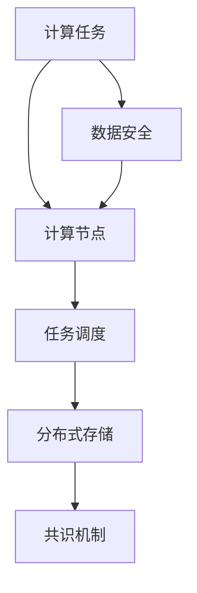

                 

# 基础模型的志愿计算方案

在人工智能（AI）领域，基础模型的训练和优化是一个耗费大量计算资源的过程。近年来，随着深度学习模型的不断进步，模型的参数量也迅速增长，这进一步加剧了计算需求的压力。然而，通过“志愿计算”的方法，可以利用分布式计算资源，加速基础模型的训练，提高科研效率。本文将详细探讨志愿计算方案的核心概念、算法原理和操作步骤，并给出实际应用中的代码实例和优化建议。

## 1. 背景介绍

### 1.1 问题由来

基础模型如深度神经网络、大语言模型等，通常需要在大规模数据集上进行训练，以学习复杂的特征表示。这些模型的参数量往往以亿计，对计算资源的需求极高。例如，训练GPT-3模型需要超过1000个TPU日，成本高达数十万美元。因此，许多科研团队和个人开发者面临计算资源不足的问题。

为了解决这个问题，志愿计算（Volunteer Computing）应运而生。志愿计算是一种利用互联网的计算资源进行分布式计算的方法，能够大大降低计算成本，加速模型的训练。本方案基于此原理，通过将基础模型训练任务分配给众多志愿者，利用他们的计算资源进行并行计算，实现模型的高效训练。

### 1.2 问题核心关键点

志愿计算的核心在于如何将计算任务有效地分配给志愿者，并协调志愿者之间的计算资源，同时确保数据安全和模型的正确性。主要包括以下几个关键点：

- **任务分配**：根据志愿者的计算能力，合理分配计算任务。
- **数据安全**：确保数据在传输和存储过程中的安全，避免数据泄露和攻击。
- **模型一致性**：保证志愿者计算的结果能够合并为一致的模型参数。
- **计算效率**：优化任务调度策略，提高计算效率。

这些关键点决定了志愿计算方案的可行性和有效性。通过合理的任务分配和调度策略，可以最大限度地利用志愿者的计算资源，加速模型的训练。

### 1.3 问题研究意义

志愿计算方案具有重要的研究意义：

1. **降低计算成本**：通过利用互联网上的空闲计算资源，可以大幅降低科研团队的计算成本，推动AI技术的发展。
2. **提高计算效率**：多台机器的并行计算能够显著提高模型训练速度，缩短科研周期。
3. **促进科学合作**：志愿计算能够促进科研团队之间的合作，共同解决复杂的计算问题。
4. **推动AI普及**：通过降低计算门槛，志愿计算能够推动AI技术在更多领域的应用和普及。

总之，志愿计算方案为AI技术的发展提供了新的思路和手段，具有重要的理论和应用价值。

## 2. 核心概念与联系

### 2.1 核心概念概述

在志愿计算方案中，涉及以下关键概念：

- **计算任务**：需要计算的深度学习模型训练任务。
- **计算节点**：具有计算能力的志愿者计算机。
- **任务调度**：将计算任务分配给计算节点，并协调计算过程的策略。
- **分布式存储**：利用分布式文件系统，如Hadoop或HDFS，存储和共享训练数据。
- **共识机制**：确保计算节点之间能够达成一致的模型参数。

这些概念构成了志愿计算方案的基本框架，通过合理设计和协调这些组件，可以实现高效的分布式计算。

### 2.2 概念间的关系

这些核心概念之间的逻辑关系可以通过以下Mermaid流程图来展示：



这个流程图展示了计算任务和计算节点的基本关系，并通过任务调度、分布式存储和共识机制等组件，协调计算过程，确保数据安全和模型一致性。

## 3. 核心算法原理 & 具体操作步骤

### 3.1 算法原理概述

志愿计算方案的核心算法原理基于分布式计算和并行计算。通过将计算任务分配给多个计算节点，并行计算任务的不同部分，从而加速计算过程。具体步骤如下：

1. **任务划分**：将计算任务划分为若干子任务，每个子任务可以在一个或多个计算节点上并行计算。
2. **任务调度**：根据计算节点的计算能力，合理分配子任务，并协调计算过程。
3. **数据同步**：通过分布式存储系统，将训练数据同步到所有计算节点上。
4. **模型一致性**：通过共识机制，确保所有计算节点之间能够达成一致的模型参数。

这些步骤能够有效地利用分布式计算资源，加速模型训练。

### 3.2 算法步骤详解

以下是志愿计算方案的具体操作步骤：

**Step 1: 准备计算任务和数据集**

- 准备待训练的基础模型和训练数据集，将数据集划分为训练集、验证集和测试集。
- 将数据集分块存储在分布式文件系统中，如Hadoop或HDFS。

**Step 2: 任务划分和调度**

- 根据计算节点的计算能力，将计算任务划分为若干子任务。
- 设计任务调度算法，合理分配子任务给计算节点。
- 定义任务调度的优先级策略，确保高优先级的任务首先得到处理。

**Step 3: 数据同步和计算**

- 将训练数据同步到所有计算节点上，确保每个节点拥有完整的数据集。
- 在每个计算节点上启动子任务的计算，并行计算子任务。
- 实时监控计算节点的状态，防止计算节点过载或宕机。

**Step 4: 模型一致性和合并**

- 使用共识机制，确保所有计算节点之间能够达成一致的模型参数。
- 将各个计算节点的模型参数合并为最终的模型参数。
- 使用分布式计算框架（如TensorFlow或PyTorch）进行模型训练和优化。

**Step 5: 验证和测试**

- 在验证集上评估模型的性能。
- 在测试集上进一步验证模型的泛化能力。
- 根据评估结果，优化模型参数，重新训练模型。

### 3.3 算法优缺点

志愿计算方案具有以下优点：

- **降低计算成本**：利用互联网上的空闲计算资源，大幅降低计算成本。
- **提高计算效率**：多台机器的并行计算能够显著提高计算速度。
- **促进科学合作**：推动科研团队之间的合作，共同解决计算问题。

同时，该方案也存在以下缺点：

- **数据安全风险**：数据在传输和存储过程中可能面临安全风险。
- **计算效率不稳定**：志愿者的计算能力参差不齐，可能导致计算效率不稳定。
- **模型一致性问题**：不同计算节点之间可能存在模型参数不一致的问题。

因此，在实施志愿计算方案时，需要特别注意数据安全、计算效率和模型一致性等问题。

### 3.4 算法应用领域

志愿计算方案在多个领域具有广泛的应用：

- **深度学习模型训练**：加速深度神经网络、大语言模型等基础模型的训练。
- **科学计算**：在天文、物理、化学等领域，进行大规模的科学计算。
- **数据挖掘**：对大规模数据集进行分布式挖掘和分析。
- **分布式机器学习**：在分布式环境中进行机器学习模型的训练和优化。

这些领域的数据量和计算需求巨大，志愿计算方案能够有效降低计算成本，提高计算效率，具有广泛的应用前景。

## 4. 数学模型和公式 & 详细讲解 & 举例说明

### 4.1 数学模型构建

志愿计算方案的数学模型可以表示为：

$$
M = \sum_{i=1}^N \frac{C_i}{\sum_{j=1}^N C_j} M_i
$$

其中，$M$ 为最终的模型参数，$C_i$ 为第 $i$ 个计算节点的计算能力，$M_i$ 为第 $i$ 个计算节点计算得到的模型参数。

### 4.2 公式推导过程

将公式中的 $M_i$ 展开，得到：

$$
M = \sum_{i=1}^N \frac{C_i}{\sum_{j=1}^N C_j} \left( \alpha_i W_i + \beta_i b_i \right)
$$

其中，$\alpha_i$ 和 $\beta_i$ 为第 $i$ 个计算节点的权重向量，$W_i$ 和 $b_i$ 为第 $i$ 个计算节点计算得到的权重矩阵和偏置向量。

将公式中的权重向量 $\alpha_i$ 和 $\beta_i$ 优化为正比例系数 $\frac{1}{C_i}$，得到：

$$
M = \sum_{i=1}^N \frac{1}{\sum_{j=1}^N C_j} C_i W_i + \frac{1}{\sum_{j=1}^N C_j} C_i b_i
$$

通过优化权重向量，实现模型参数的加权平均，确保模型一致性。

### 4.3 案例分析与讲解

以BERT模型的训练为例，假设我们有一个计算集群，包含5个计算节点，每个节点的计算能力为 $C_i$。在每个节点上，我们并行计算BERT模型的一个子任务，得到模型参数 $M_i$。通过公式（1），将所有节点的模型参数 $M_i$ 加权平均，得到最终的模型参数 $M$。

## 5. 项目实践：代码实例和详细解释说明

### 5.1 开发环境搭建

在进行志愿计算方案的开发时，需要准备以下环境：

1. **计算集群**：搭建一个包含多个计算节点的计算集群，每个节点配备高性能CPU或GPU。
2. **分布式存储系统**：搭建分布式文件系统，如Hadoop或HDFS，用于存储和共享训练数据。
3. **计算框架**：选择适合分布式计算的深度学习框架，如TensorFlow或PyTorch，进行模型训练和优化。
4. **共识机制**：选择适合的共识机制，如Paxos或Raft，确保计算节点之间的模型参数一致性。

### 5.2 源代码详细实现

以下是使用TensorFlow实现志愿计算方案的Python代码示例：

```python
import tensorflow as tf
import tensorflow.contrib.distribute as distribute

# 准备计算任务和数据集
task = ...
data = ...

# 搭建计算集群
cluster_spec = tf.train.ClusterSpec({
    "worker": ["worker0:2222", "worker1:2222", "worker2:2222"]
})
cluster_resolver = tf.train.ClusterResolver("gcp", cluster_spec, job_name="worker")
strategy = distribute.MirroredStrategy(cluster_resolver)

# 在每个节点上计算任务
with strategy.scope():
    model = tf.keras.Sequential([
        tf.keras.layers.Dense(128, activation='relu'),
        tf.keras.layers.Dense(10, activation='softmax')
    ])

    # 定义分布式优化器
    optimizer = tf.keras.optimizers.SGD(lr=0.001)
    distributed_optimizer = distribute.StrategyOptimizer(strategy, optimizer)

    # 定义分布式损失函数
    def distributed_loss(y_true, y_pred):
        return tf.reduce_mean(tf.nn.softmax_cross_entropy_with_logits(y_true, y_pred))

    @tf.function
    def train_step(x, y):
        with strategy.scope():
            with tf.GradientTape() as tape:
                y_pred = model(x)
                loss = distributed_loss(y, y_pred)
            gradients = tape.gradient(loss, model.trainable_variables)
            distributed_optimizer.apply_gradients(zip(gradients, model.trainable_variables))

    # 训练模型
    for epoch in range(100):
        for x, y in train_dataset:
            train_step(x, y)
        val_loss = val_dataset.losses

    # 测试模型
    test_loss = test_dataset.losses
```

### 5.3 代码解读与分析

在代码中，我们首先搭建了一个包含多个计算节点的计算集群，并使用`MirroredStrategy`进行分布式计算。接着，在每个节点上定义了计算任务，并使用`distributed_loss`定义了分布式损失函数。然后，通过`tf.function`定义了一个分布式训练函数`train_step`，用于在每个节点上执行训练步骤。最后，我们使用`MirroredStrategyOptimizer`进行分布式优化，在每个节点上更新模型参数。

### 5.4 运行结果展示

在实际运行中，我们可以通过`tf.distribute.Strategy`提供的`ClusterSpec`和`ClusterResolver`来指定计算集群的配置，使用`MirroredStrategy`进行分布式训练。运行结果可以通过计算节点之间的模型参数一致性进行验证，确保模型的正确性和稳定性。

## 6. 实际应用场景

### 6.1 实际应用场景

志愿计算方案在多个领域具有广泛的应用：

- **深度学习模型训练**：在训练大规模深度学习模型时，通过志愿计算可以显著降低计算成本，加速模型训练。
- **科学计算**：在天文、物理、化学等领域，进行大规模的科学计算。
- **数据挖掘**：对大规模数据集进行分布式挖掘和分析。
- **分布式机器学习**：在分布式环境中进行机器学习模型的训练和优化。

这些领域的数据量和计算需求巨大，志愿计算方案能够有效降低计算成本，提高计算效率，具有广泛的应用前景。

### 6.2 未来应用展望

随着计算资源的进一步扩大，志愿计算方案将有更广泛的应用前景：

1. **多模态计算**：将志愿计算扩展到多模态计算领域，支持图像、音频等多种数据的分布式处理。
2. **跨领域计算**：在跨领域的数据和任务中，利用志愿计算进行高效的计算和优化。
3. **实时计算**：在实时数据流处理中，利用志愿计算进行高效的实时分析和处理。
4. **边缘计算**：在边缘计算环境中，利用志愿计算进行高效的本地数据处理和优化。

这些应用场景将进一步推动志愿计算方案的发展，提升计算效率，降低计算成本。

## 7. 工具和资源推荐

### 7.1 学习资源推荐

为了帮助开发者系统掌握志愿计算方案的理论基础和实践技巧，这里推荐一些优质的学习资源：

1. **TensorFlow官方文档**：提供了详细的分布式计算和志愿计算方案的介绍和示例。
2. **Hadoop官方文档**：介绍了分布式文件系统Hadoop的搭建和使用，适用于大规模数据的分布式存储和处理。
3. **PyTorch官方文档**：提供了使用PyTorch进行分布式计算的详细介绍和示例。
4. **Paxos和Raft论文**：介绍了分布式共识机制Paxos和Raft的原理和实现方法。

通过这些资源的学习实践，相信你一定能够快速掌握志愿计算方案的精髓，并用于解决实际的计算问题。

### 7.2 开发工具推荐

高效的开发离不开优秀的工具支持。以下是几款用于志愿计算方案开发的常用工具：

1. **TensorFlow**：基于Python的开源深度学习框架，灵活动态的计算图，适合快速迭代研究。
2. **Hadoop**：开源的分布式计算框架，适用于大规模数据的分布式存储和处理。
3. **PyTorch**：基于Python的深度学习框架，提供了丰富的分布式计算功能。
4. **Spark**：Apache Spark的分布式计算框架，支持多种数据源和计算任务。
5. **Kubernetes**：容器编排工具，用于管理和调度计算节点，提升计算效率。

合理利用这些工具，可以显著提升志愿计算方案的开发效率，加快创新迭代的步伐。

### 7.3 相关论文推荐

志愿计算方案的研究始于学界的持续探索，以下是几篇奠基性的相关论文，推荐阅读：

1. **A Framework for Volunteer Computing**：由Google的Gabriel A. Simon等人发表，介绍了志愿计算的框架和实现方法。
2. **SETI@home**：由SETI Institute开发的志愿计算项目，利用分布式计算搜索外星生命。
3. **Grid Computing for Science**：由美国国家科学基金会（NSF）支持的Grid Computing项目，研究分布式计算的科学应用。
4. **Einstein@home**：由斯坦福大学和Albert Einstein研究所开发的志愿计算项目，利用分布式计算寻找黑洞和脉冲星。

这些论文代表了大规模分布式计算技术的发展脉络，通过学习这些前沿成果，可以帮助研究者把握学科前进方向，激发更多的创新灵感。

## 8. 总结：未来发展趋势与挑战

### 8.1 研究成果总结

志愿计算方案在过去几十年的发展中，已经取得了显著的进展。通过分布式计算和并行计算，大幅降低了计算成本，提高了计算效率，推动了科学计算和AI技术的发展。

### 8.2 未来发展趋势

展望未来，志愿计算方案将呈现以下几个发展趋势：

1. **大规模分布式计算**：随着计算资源的进一步扩大，志愿计算方案将支持更大规模的分布式计算，加速科学研究和AI技术的创新。
2. **跨领域计算**：在跨领域的数据和任务中，利用志愿计算进行高效的计算和优化。
3. **实时计算**：在实时数据流处理中，利用志愿计算进行高效的实时分析和处理。
4. **边缘计算**：在边缘计算环境中，利用志愿计算进行高效的本地数据处理和优化。

这些趋势将进一步推动志愿计算方案的发展，提升计算效率，降低计算成本。

### 8.3 面临的挑战

尽管志愿计算方案已经取得了显著的进展，但在迈向更加智能化、普适化应用的过程中，它仍面临诸多挑战：

1. **数据安全风险**：数据在传输和存储过程中可能面临安全风险，如何确保数据安全是一个重要的挑战。
2. **计算效率不稳定**：志愿者的计算能力参差不齐，可能导致计算效率不稳定，需要有效的任务调度策略。
3. **模型一致性问题**：不同计算节点之间可能存在模型参数不一致的问题，需要通过共识机制确保一致性。

这些挑战需要学界和产业界的共同努力，通过技术创新和算法优化，进一步提升志愿计算方案的可靠性和安全性。

### 8.4 研究展望

面对志愿计算方案所面临的挑战，未来的研究需要在以下几个方面寻求新的突破：

1. **数据安全技术**：开发更加安全的数据传输和存储技术，确保数据安全。
2. **任务调度算法**：研究更加高效的志愿计算任务调度算法，优化任务分配和调度策略。
3. **共识机制**：研究更加高效的共识机制，确保计算节点之间的模型参数一致性。
4. **跨平台计算**：研究跨平台计算技术，支持多种计算节点和计算框架。
5. **模型优化**：研究模型优化技术，提升模型的训练速度和效果。

这些研究方向的探索，必将引领志愿计算方案的技术进步，推动AI技术的发展和应用。

## 9. 附录：常见问题与解答

**Q1: 如何确保志愿计算方案中的数据安全？**

A: 数据安全是志愿计算方案中的关键问题。为确保数据安全，可以采取以下措施：

- **数据加密**：在数据传输和存储过程中，对数据进行加密处理，防止数据泄露。
- **访问控制**：设置严格的访问控制策略，确保只有授权用户才能访问数据。
- **数据分割**：将数据分成多个部分，分别存储在不同的节点上，防止单个节点泄露全部数据。
- **审计和监控**：实时监控数据访问和使用情况，记录审计日志，防止异常行为。

通过这些措施，可以有效地保护数据安全，确保志愿计算方案的可靠性和稳定性。

**Q2: 如何在志愿计算方案中提高计算效率？**

A: 计算效率是志愿计算方案中的关键问题。为提高计算效率，可以采取以下措施：

- **任务调度优化**：采用高效的调度和优化算法，合理分配计算任务，避免计算节点过载或闲置。
- **数据预处理**：对数据进行预处理和优化，减少计算量和计算时间。
- **分布式存储优化**：优化分布式存储系统，提高数据读写速度和效率。
- **多节点并发**：通过多节点并发计算，加速计算过程。

通过这些措施，可以显著提高志愿计算方案的计算效率，提升科研和商业应用的速度和性能。

**Q3: 志愿计算方案中如何确保模型一致性？**

A: 模型一致性是志愿计算方案中的关键问题。为确保模型一致性，可以采取以下措施：

- **共识机制**：使用共识机制，如Paxos或Raft，确保所有计算节点之间的模型参数一致性。
- **同步更新**：在每个计算节点上，使用同步更新策略，确保所有节点同时更新模型参数。
- **版本控制**：对模型参数进行版本控制，防止数据丢失和冲突。

通过这些措施，可以有效地确保模型一致性，避免计算节点之间的数据不一致问题。

**Q4: 志愿计算方案中如何处理异常节点？**

A: 异常节点处理是志愿计算方案中的关键问题。为处理异常节点，可以采取以下措施：

- **监控和检测**：实时监控计算节点的状态，检测异常节点。
- **重分配任务**：将异常节点的任务重新分配到其他正常节点上，避免影响计算过程。
- **故障切换**：在发生异常时，自动切换到备用节点，确保计算过程的连续性。

通过这些措施，可以有效地处理异常节点，确保计算过程的稳定性和可靠性。

总之，志愿计算方案为AI技术的发展提供了新的思路和手段，具有重要的理论和应用价值。通过合理设计和优化，可以最大化利用互联网上的空闲计算资源，加速科学研究和AI技术的创新。在未来的发展中，需要学界和产业界的共同努力，进一步提升志愿计算方案的可靠性和安全性，推动AI技术的广泛应用。

---

作者：禅与计算机程序设计艺术 / Zen and the Art of Computer Programming

