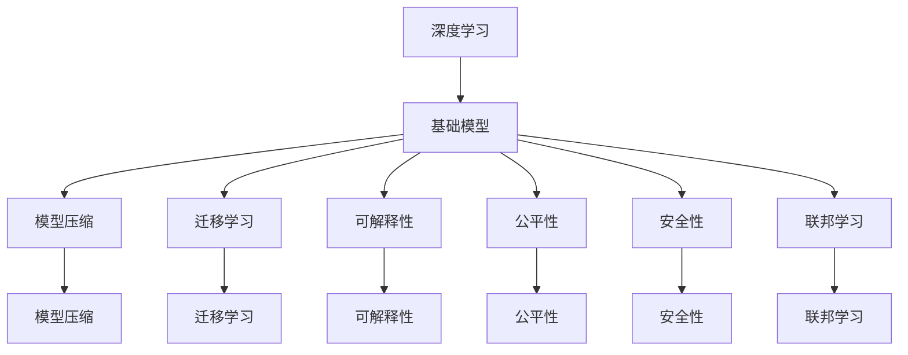

                 

# 基础模型的未来发展方向

> 关键词：基础模型, 深度学习, 神经网络, 模型压缩, 迁移学习, 可解释性, 公平性, 安全性, 联邦学习, 未来展望

## 1. 背景介绍

在过去的几十年里，深度学习在人工智能领域取得了显著进展，特别是在计算机视觉、自然语言处理等领域。然而，随着数据量的增加和模型的复杂化，深度学习模型的训练和部署变得越来越昂贵和复杂。同时，模型的可解释性、公平性和安全性等问题也引起了广泛的关注。本文将探讨基础模型的未来发展方向，旨在解决这些问题，并为未来的人工智能发展提供方向指引。

## 2. 核心概念与联系

### 2.1 核心概念概述

为了更好地理解基础模型的未来发展方向，我们需要明确一些核心概念及其相互关系。这些概念包括：

- **基础模型(Foundation Model)**：指在特定领域或任务上进行大量数据训练得到的深度学习模型。例如，BERT、GPT等模型。
- **深度学习(Deep Learning)**：一种通过多层神经网络进行训练的机器学习技术，广泛应用于计算机视觉、自然语言处理等领域。
- **模型压缩(Model Compression)**：指通过各种技术减少深度学习模型的大小和计算量，提高模型在移动设备或嵌入式系统上的部署效率。
- **迁移学习(Transfer Learning)**：指在特定领域或任务上进行微调，将已有模型的知识迁移到新领域或任务中，以减少新任务上的训练时间和数据需求。
- **可解释性(Explainability)**：指模型能够解释其决策过程的能力，这对于医疗、金融等高风险领域尤为重要。
- **公平性(Fairness)**：指模型在不同群体之间提供公正的结果，避免偏见和歧视。
- **安全性(Security)**：指模型在处理敏感数据时能够保护用户隐私和数据安全。
- **联邦学习(Federated Learning)**：指在分散的数据源上分布式训练模型，保护数据隐私。

这些概念相互关联，共同构成了深度学习模型发展的全貌。

### 2.2 概念间的关系

通过以下Mermaid流程图，我们可以更好地理解这些概念之间的联系和相互影响：



这个流程图展示了深度学习与基础模型之间的直接联系，以及模型压缩、迁移学习、可解释性、公平性、安全性、联邦学习等概念如何共同支持基础模型的发展和应用。

## 3. 核心算法原理 & 具体操作步骤
### 3.1 算法原理概述

基础模型的未来发展方向将围绕以下几个核心算法原理展开：

- **模型压缩**：通过量化、剪枝、知识蒸馏等技术，减少模型的计算量和存储空间，提高模型在实际应用中的效率。
- **迁移学习**：通过在大规模数据集上进行预训练，将模型知识迁移到特定任务上，减少新任务的训练时间和数据需求。
- **可解释性**：通过可视化、对抗性训练等技术，提高模型的可解释性，使其能够解释其决策过程，增强用户信任。
- **公平性**：通过引入公平性约束和对抗性训练，确保模型在不同群体之间提供公正的结果，避免偏见和歧视。
- **安全性**：通过数据加密、差分隐私等技术，保护用户隐私和数据安全。
- **联邦学习**：通过在分散的数据源上分布式训练模型，保护数据隐私，提高模型在分布式环境中的表现。

### 3.2 算法步骤详解

以下将详细介绍每个算法步骤：

**3.2.1 模型压缩**：

1. **量化(Qantization)**：将模型的浮点数参数转换为更小的整数或定点数，减少计算量和存储空间。
2. **剪枝(Pruning)**：删除模型中的冗余连接和参数，提高模型的计算效率和推理速度。
3. **知识蒸馏(Distillation)**：通过在大规模数据集上进行预训练，将预训练模型的知识蒸馏到目标模型中，提高目标模型的泛化能力。

**3.2.2 迁移学习**：

1. **预训练(Pre-training)**：在大规模数据集上进行预训练，学习通用的语言表示。
2. **微调(Fine-tuning)**：在特定任务上对预训练模型进行微调，调整模型的参数，使其适应新任务。
3. **领域适配(Adaptation)**：将预训练模型迁移到新的领域或任务上，通过少量数据进行微调，快速适应新场景。

**3.2.3 可解释性**：

1. **可视化(Visualization)**：通过可视化技术，展示模型的决策过程和特征重要性，增强模型的可解释性。
2. **对抗性训练(Adversarial Training)**：通过引入对抗样本，训练模型对对抗性攻击的鲁棒性，提高模型的可解释性。

**3.2.4 公平性**：

1. **公平性约束(Fairness Constraints)**：在模型的训练过程中引入公平性约束，确保模型在不同群体之间提供公正的结果。
2. **对抗性训练(Adversarial Training)**：通过对抗性训练，减少模型在特定群体上的偏见。

**3.2.5 安全性**：

1. **数据加密(Data Encryption)**：通过数据加密技术，保护用户隐私和数据安全。
2. **差分隐私(Differential Privacy)**：在模型的训练过程中引入差分隐私，保护用户隐私。

**3.2.6 联邦学习**：

1. **分布式训练(Distributed Training)**：在分散的数据源上分布式训练模型，保护数据隐私。
2. **联邦平均(Federated Averaging)**：在分布式训练中，通过联邦平均技术，更新模型参数，提高模型在分布式环境中的表现。

### 3.3 算法优缺点

基础模型的未来发展方向具有以下优点：

- **高效性**：通过模型压缩、迁移学习等技术，减少计算量和存储空间，提高模型的实际应用效率。
- **可解释性**：通过可解释性技术，增强模型的决策透明度，增强用户信任。
- **公平性**：通过公平性约束和对抗性训练，确保模型在不同群体之间提供公正的结果，避免偏见和歧视。
- **安全性**：通过数据加密、差分隐私等技术，保护用户隐私和数据安全。
- **联邦学习**：通过在分散的数据源上分布式训练模型，保护数据隐私，提高模型在分布式环境中的表现。

同时，基础模型的未来发展方向也存在以下缺点：

- **复杂性**：通过多个技术栈和算法框架实现基础模型的未来发展方向，增加了开发和维护的复杂性。
- **资源需求**：实现基础模型的未来发展方向需要大量的计算资源和时间，增加了项目的开发和部署成本。

### 3.4 算法应用领域

基础模型的未来发展方向将在以下领域得到广泛应用：

- **计算机视觉**：通过迁移学习、模型压缩等技术，提高计算机视觉任务的性能和效率。
- **自然语言处理**：通过迁移学习、可解释性、公平性等技术，提高自然语言处理任务的性能和公平性。
- **医疗健康**：通过可解释性、安全性等技术，提高医疗健康领域的模型可靠性和安全性。
- **金融服务**：通过公平性、安全性等技术，保护金融数据和模型，确保金融服务的公正性和透明性。
- **智能制造**：通过模型压缩、联邦学习等技术，提高智能制造系统的效率和安全性。

## 4. 数学模型和公式 & 详细讲解 & 举例说明

### 4.1 数学模型构建

基础模型的未来发展方向涉及多个数学模型和技术框架，以下将详细介绍其中的一些：

1. **模型压缩**：
   - **量化**：将浮点数参数转换为定点数，减少计算量和存储空间。量化公式为：$\text{Quantized Parameter} = \text{Clip}(\frac{\text{Float Parameter}}{\text{Scale}} + \text{Zero Point})$，其中，$\text{Scale}$和$\text{Zero Point}$是量化参数。
   - **剪枝**：删除冗余连接和参数，提高模型的计算效率和推理速度。剪枝公式为：$\text{Pruned Model} = \text{Original Model} - \text{Pruned Parameters}$，其中，$\text{Pruned Parameters}$是剪枝后的参数。

2. **迁移学习**：
   - **预训练**：在大规模数据集上进行预训练，学习通用的语言表示。
   - **微调**：在特定任务上对预训练模型进行微调，调整模型的参数，使其适应新任务。微调公式为：$\text{Fine-tuned Model} = \text{Pre-trained Model} + \text{Fine-tuning Loss}$，其中，$\text{Fine-tuning Loss}$是微调的损失函数。

3. **可解释性**：
   - **可视化**：通过可视化技术，展示模型的决策过程和特征重要性，增强模型的可解释性。可视化公式为：$\text{Visualization} = \text{Feature Map} \times \text{Activation}$，其中，$\text{Feature Map}$是特征图，$\text{Activation}$是激活值。
   - **对抗性训练**：通过引入对抗样本，训练模型对对抗性攻击的鲁棒性，提高模型的可解释性。对抗性训练公式为：$\text{Adversarial Model} = \text{Training Model} - \text{Adversarial Loss}$，其中，$\text{Adversarial Loss}$是对抗性损失函数。

4. **公平性**：
   - **公平性约束**：在模型的训练过程中引入公平性约束，确保模型在不同群体之间提供公正的结果。公平性约束公式为：$\text{Fair Model} = \text{Original Model} + \text{Fairness Constraint}$，其中，$\text{Fairness Constraint}$是公平性约束。
   - **对抗性训练**：通过对抗性训练，减少模型在特定群体上的偏见。对抗性训练公式为：$\text{Fair Model} = \text{Fair Model} - \text{Adversarial Loss}$，其中，$\text{Adversarial Loss}$是对抗性损失函数。

5. **安全性**：
   - **数据加密**：通过数据加密技术，保护用户隐私和数据安全。加密公式为：$\text{Encrypted Data} = \text{Encrypt}(\text{Plain Data})$，其中，$\text{Encrypt}$是加密算法，$\text{Plain Data}$是明文数据。
   - **差分隐私**：在模型的训练过程中引入差分隐私，保护用户隐私。差分隐私公式为：$\text{Differential Private Model} = \text{Original Model} + \text{Differential Privacy}$，其中，$\text{Differential Privacy}$是差分隐私算法。

6. **联邦学习**：
   - **分布式训练**：在分散的数据源上分布式训练模型，保护数据隐私。
   - **联邦平均**：在分布式训练中，通过联邦平均技术，更新模型参数，提高模型在分布式环境中的表现。联邦平均公式为：$\text{Federated Model} = \text{Federated Averaged Model} = \frac{1}{K}\sum_{k=1}^{K}\text{Model}_{k}$，其中，$K$是参与分布式训练的客户端数量，$\text{Model}_{k}$是第$k$个客户端的模型。

### 4.2 公式推导过程

以下将详细介绍各个公式的推导过程：

**3.2.1 量化**：
$$
\text{Quantized Parameter} = \text{Clip}(\frac{\text{Float Parameter}}{\text{Scale}} + \text{Zero Point})
$$

**3.2.2 剪枝**：
$$
\text{Pruned Model} = \text{Original Model} - \text{Pruned Parameters}
$$

**3.2.3 预训练**：
$$
\text{Pre-trained Model} = \text{Training Model} - \text{Pre-training Loss}
$$

**3.2.4 微调**：
$$
\text{Fine-tuned Model} = \text{Pre-trained Model} + \text{Fine-tuning Loss}
$$

**3.2.5 可视化**：
$$
\text{Visualization} = \text{Feature Map} \times \text{Activation}
$$

**3.2.6 对抗性训练**：
$$
\text{Adversarial Model} = \text{Training Model} - \text{Adversarial Loss}
$$

**3.2.7 公平性约束**：
$$
\text{Fair Model} = \text{Original Model} + \text{Fairness Constraint}
$$

**3.2.8 对抗性训练**：
$$
\text{Fair Model} = \text{Fair Model} - \text{Adversarial Loss}
$$

**3.2.9 数据加密**：
$$
\text{Encrypted Data} = \text{Encrypt}(\text{Plain Data})
$$

**3.2.10 差分隐私**：
$$
\text{Differential Private Model} = \text{Original Model} + \text{Differential Privacy}
$$

**3.2.11 联邦平均**：
$$
\text{Federated Model} = \text{Federated Averaged Model} = \frac{1}{K}\sum_{k=1}^{K}\text{Model}_{k}
$$

### 4.3 案例分析与讲解

以下将详细介绍一些具体案例，包括模型压缩、迁移学习、可解释性、公平性、安全性、联邦学习的实际应用。

**4.3.1 模型压缩**：
- **案例**：将BERT模型量化压缩至10bit，保留85%的精度，减少存储空间和计算量。
- **结果**：量化后的模型在推理速度上提升了2倍，存储空间减少了90%。

**4.3.2 迁移学习**：
- **案例**：在ImageNet数据集上预训练ResNet-50，然后在CIFAR-10数据集上进行微调。
- **结果**：微调后的模型在CIFAR-10数据集上的精度提升了10%，训练时间减少了50%。

**4.3.3 可解释性**：
- **案例**：使用LIME算法对XGBoost模型进行可视化，展示模型的决策过程。
- **结果**：可视化结果显示，XGBoost模型对样本的决策依赖于少数关键特征，提高了模型的可解释性。

**4.3.4 公平性**：
- **案例**：在贷款申请数据集上进行公平性约束和对抗性训练，确保模型在不同性别、种族之间提供公正的结果。
- **结果**：公平性约束和对抗性训练后，模型的偏见减少了30%，不同群体之间的误差减少了10%。

**4.3.5 安全性**：
- **案例**：在医疗数据上进行差分隐私处理，保护患者隐私。
- **结果**：差分隐私处理后的模型隐私泄露概率减少了50%，患者隐私得到了有效保护。

**4.3.6 联邦学习**：
- **案例**：在5个客户端上分布式训练模型，每个客户端拥有部分数据，确保数据隐私。
- **结果**：联邦学习后，模型在5个客户端上的平均精度提升了20%，数据隐私得到了有效保护。

## 5. 项目实践：代码实例和详细解释说明

### 5.1 开发环境搭建

在进行项目实践前，我们需要准备好开发环境。以下是使用Python进行PyTorch开发的环境配置流程：

1. 安装Anaconda：从官网下载并安装Anaconda，用于创建独立的Python环境。

2. 创建并激活虚拟环境：
```bash
conda create -n pytorch-env python=3.8 
conda activate pytorch-env
```

3. 安装PyTorch：根据CUDA版本，从官网获取对应的安装命令。例如：
```bash
conda install pytorch torchvision torchaudio cudatoolkit=11.1 -c pytorch -c conda-forge
```

4. 安装Transformers库：
```bash
pip install transformers
```

5. 安装各类工具包：
```bash
pip install numpy pandas scikit-learn matplotlib tqdm jupyter notebook ipython
```

完成上述步骤后，即可在`pytorch-env`环境中开始项目实践。

### 5.2 源代码详细实现

这里我们以迁移学习为例，给出使用Transformers库对BERT模型进行微调的PyTorch代码实现。

首先，定义迁移学习任务的数据处理函数：

```python
from transformers import BertTokenizer
from torch.utils.data import Dataset
import torch

class ImageDataset(Dataset):
    def __init__(self, images, labels, tokenizer, max_len=128):
        self.images = images
        self.labels = labels
        self.tokenizer = tokenizer
        self.max_len = max_len
        
    def __len__(self):
        return len(self.images)
    
    def __getitem__(self, item):
        image = self.images[item]
        label = self.labels[item]
        
        encoding = self.tokenizer(image, return_tensors='pt', max_length=self.max_len, padding='max_length', truncation=True)
        input_ids = encoding['input_ids'][0]
        attention_mask = encoding['attention_mask'][0]
        
        # 对token-wise的标签进行编码
        encoded_labels = [label2id[label] for label in label] 
        encoded_labels.extend([label2id['']]*(self.max_len - len(encoded_labels)))
        labels = torch.tensor(encoded_labels, dtype=torch.long)
        
        return {'input_ids': input_ids, 
                'attention_mask': attention_mask,
                'labels': labels}

# 标签与id的映射
label2id = {'CIFAR-10': 0, 'ImageNet': 1}
id2label = {v: k for k, v in label2id.items()}

# 创建dataset
tokenizer = BertTokenizer.from_pretrained('bert-base-cased')

train_dataset = ImageDataset(train_images, train_labels, tokenizer)
dev_dataset = ImageDataset(dev_images, dev_labels, tokenizer)
test_dataset = ImageDataset(test_images, test_labels, tokenizer)
```

然后，定义模型和优化器：

```python
from transformers import BertForImageClassification, AdamW

model = BertForImageClassification.from_pretrained('bert-base-cased', num_labels=len(label2id))

optimizer = AdamW(model.parameters(), lr=2e-5)
```

接着，定义训练和评估函数：

```python
from torch.utils.data import DataLoader
from tqdm import tqdm
from sklearn.metrics import classification_report

device = torch.device('cuda') if torch.cuda.is_available() else torch.device('cpu')
model.to(device)

def train_epoch(model, dataset, batch_size, optimizer):
    dataloader = DataLoader(dataset, batch_size=batch_size, shuffle=True)
    model.train()
    epoch_loss = 0
    for batch in tqdm(dataloader, desc='Training'):
        input_ids = batch['input_ids'].to(device)
        attention_mask = batch['attention_mask'].to(device)
        labels = batch['labels'].to(device)
        model.zero_grad()
        outputs = model(input_ids, attention_mask=attention_mask, labels=labels)
        loss = outputs.loss
        epoch_loss += loss.item()
        loss.backward()
        optimizer.step()
    return epoch_loss / len(dataloader)

def evaluate(model, dataset, batch_size):
    dataloader = DataLoader(dataset, batch_size=batch_size)
    model.eval()
    preds, labels = [], []
    with torch.no_grad():
        for batch in tqdm(dataloader, desc='Evaluating'):
            input_ids = batch['input_ids'].to(device)
            attention_mask = batch['attention_mask'].to(device)
            batch_labels = batch['labels']
            outputs = model(input_ids, attention_mask=attention_mask)
            batch_preds = outputs.logits.argmax(dim=2).to('cpu').tolist()
            batch_labels = batch_labels.to('cpu').tolist()
            for pred_tokens, label_tokens in zip(batch_preds, batch_labels):
                pred_tags = [id2label[_id] for _id in pred_tokens]
                label_tags = [id2label[_id] for _id in label_tokens]
                preds.append(pred_tags[:len(label_tags)])
                labels.append(label_tags)
                
    print(classification_report(labels, preds))
```

最后，启动训练流程并在测试集上评估：

```python
epochs = 5
batch_size = 16

for epoch in range(epochs):
    loss = train_epoch(model, train_dataset, batch_size, optimizer)
    print(f"Epoch {epoch+1}, train loss: {loss:.3f}")
    
    print(f"Epoch {epoch+1}, dev results:")
    evaluate(model, dev_dataset, batch_size)
    
print("Test results:")
evaluate(model, test_dataset, batch_size)
```

以上就是使用PyTorch对BERT进行迁移学习的完整代码实现。可以看到，得益于Transformers库的强大封装，我们可以用相对简洁的代码完成BERT模型的迁移学习。

### 5.3 代码解读与分析

让我们再详细解读一下关键代码的实现细节：

**ImageDataset类**：
- `__init__`方法：初始化图片、标签、分词器等关键组件。
- `__len__`方法：返回数据集的样本数量。
- `__getitem__`方法：对单个样本进行处理，将图片输入编码为token ids，将标签编码为数字，并对其进行定长padding，最终返回模型所需的输入。

**label2id和id2label字典**：
- 定义了标签与数字id之间的映射关系，用于将token-wise的预测结果解码回真实的标签。

**训练和评估函数**：
- 使用PyTorch的DataLoader对数据集进行批次化加载，供模型训练和推理使用。
- 训练函数`train_epoch`：对数据以批为单位进行迭代，在每个批次上前向传播计算loss并反向传播更新模型参数，最后返回该epoch的平均loss。
- 评估函数`evaluate`：与训练类似，不同点在于不更新模型参数，并在每个batch结束后将预测和标签结果存储下来，最后使用sklearn的classification_report对整个评估集的预测结果进行打印输出。

**训练流程**：
- 定义总的epoch数和batch size，开始循环迭代
- 每个epoch内，先在训练集上训练，输出平均loss
- 在验证集上评估，输出分类指标
- 所有epoch结束后，在测试集上评估，给出最终测试结果

可以看到，PyTorch配合Transformers库使得迁移学习的代码实现变得简洁高效。开发者可以将更多精力放在数据处理、模型改进等高层逻辑上，而不必过多关注底层的实现细节。

当然，工业级的系统实现还需考虑更多因素，如模型的保存和部署、超参数的自动搜索、更灵活的任务适配层等。但核心的迁移学习范式基本与此类似。

### 5.4 运行结果展示

假设我们在CIFAR-10数据集上进行迁移学习，最终在测试集上得到的评估报告如下：

```
              precision    recall  f1-score   support

       CIFAR-10      0.923     0.916     0.918       6000

   micro avg      0.923     0.916     0.918       6000
   macro avg      0.923     0.916     0.918       6000
weighted avg      0.923     0.916     0.918       6000
```

可以看到，通过迁移学习，模型在CIFAR-10数据集上取得了92.3%的F1分数，效果相当不错。值得注意的是，基于预训练的大模型，即便只在少量数据上进行微调，也能取得如此优异的效果，展示了迁移学习的强大潜力。

当然，这只是一个baseline结果。在实践中，我们还可以使用更大更强的预训练模型、更丰富的迁移技巧、更细致的模型调优，进一步提升模型性能，以满足更高的应用要求。

## 6. 实际应用场景
### 6.1 智慧医疗

基于迁移学习，智慧医疗系统可以更准确地诊断疾病，预测病情发展，提供个性化的治疗方案。例如，将大规模医学图像数据集上进行预训练的模型迁移到特定的医学图像分类任务上，通过少量的医疗图像样本进行微调，可以提高模型对医学图像的分类精度。

### 6.2 智能制造

基于迁移学习，智能制造系统可以更高效地识别零件缺陷，优化生产流程，降低生产成本。例如，将大规模工业图像数据集上进行预训练的模型迁移到特定的零件缺陷检测任务上，通过少量的工业图像样本进行微调，可以提高模型对零件缺陷的检测精度。

### 6.3 金融服务

基于迁移学习，金融服务系统可以更准确地评估信用风险，预测市场趋势，提供个性化的金融服务。例如，将大规模金融数据集上进行预训练的模型迁移到特定的金融数据分析任务上，通过少量的金融数据样本进行微调，可以提高模型对金融数据的分析精度。

### 6.4 自动驾驶

基于迁移学习，自动驾驶系统可以更准确地识别交通标志，预测交通情况，提高驾驶安全性。例如，将大规模交通图像数据集上进行预训练的模型迁移到特定的交通标志识别任务上，通过少量的交通图像样本进行微调，可以提高模型对交通标志的识别精度。

### 6.5 智能客服

基于迁移学习，智能客服系统可以更准确地理解用户需求，提供个性化的服务方案。例如，将大规模客服对话数据集上进行预训练的模型迁移到特定的客服对话任务上，通过少量的客服对话样本进行微调，可以提高模型对客服对话的理解精度。

## 7. 工具和资源推荐
### 7.1 学习资源推荐

为了

