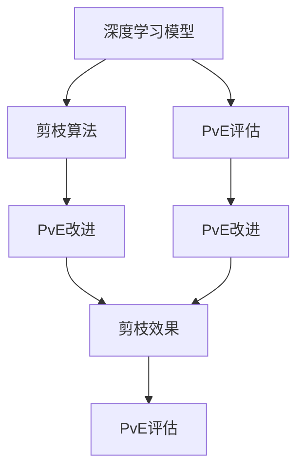

                 

# 多目标剪枝：平衡精度、速度与能耗的技术

> 关键词：多目标优化,剪枝算法,精度-速度-能耗,深度学习模型,神经网络

## 1. 背景介绍

### 1.1 问题由来
随着深度学习模型的不断发展，模型的复杂度越来越高，计算资源和能耗需求也随之激增。在实际应用中，我们需要在保证一定精度的情况下，尽可能地提高模型的推理速度，降低计算能耗。特别是对于移动设备、嵌入式系统等资源受限的环境，这种需求尤为明显。

多目标剪枝技术（Multi-Objective Pruning）便是为了解决这一问题而提出的。通过在精度、速度和能耗三个维度上进行综合优化，多目标剪枝能够在保证精度的前提下，显著提升模型的计算效率和能效，从而在资源受限的环境下实现更好的性能。

### 1.2 问题核心关键点
多目标剪枝的核心理念是通过综合考虑多个优化目标，进行模型参数的筛选和调整，以获得最优的精度、速度和能耗平衡。具体来说，包括以下几个关键点：

- **多目标优化**：在模型训练和剪枝过程中，需要同时考虑精度、速度和能耗三个目标。
- **剪枝算法**：选择合适的剪枝算法，通过删除冗余参数，减少计算量。
- **精度-速度-能耗（PvE）**：定义一个综合评价指标，衡量模型在不同方面的表现。
- **混合剪枝方法**：结合多种剪枝策略，实现多目标优化。

### 1.3 问题研究意义
多目标剪枝技术在深度学习模型的优化和应用中具有重要意义：

1. **提升模型效率**：通过剪枝算法去除冗余参数，减少计算量和能耗，提升模型推理速度。
2. **优化资源使用**：在资源受限的环境中，如移动设备、嵌入式系统，多目标剪枝可以显著降低计算能耗，提高系统性能。
3. **促进应用推广**：多目标剪枝技术使得深度学习模型更加轻量级和高效，更容易被各行各业采纳。
4. **增强模型鲁棒性**：通过剪枝去除敏感参数，提高模型对异常数据和噪声的鲁棒性。

## 2. 核心概念与联系

### 2.1 核心概念概述

为了更好地理解多目标剪枝，我们需要先了解以下几个核心概念：

- **深度学习模型**：包括卷积神经网络（CNN）、循环神经网络（RNN）、Transformer等，用于处理图像、语音、文本等数据。
- **剪枝算法**：通过删除模型中的冗余参数，减少计算量和能耗。常用的剪枝算法有权重剪枝、通道剪枝、张量剪枝等。
- **精度-速度-能耗（PvE）**：综合评价模型在精度、速度和能耗方面的表现。

这些概念之间存在着紧密的联系，通过综合考虑这些目标，多目标剪枝技术可以在模型优化中获得更全面的效果。

### 2.2 概念间的关系

这些核心概念之间的关系可以通过以下Mermaid流程图来展示：



这个流程图展示了深度学习模型、剪枝算法和PvE评估之间的关系：

1. 深度学习模型是剪枝算法和PvE评估的输入。
2. 剪枝算法通过去除模型中的冗余参数，降低计算量和能耗。
3. PvE评估用于综合评价模型在精度、速度和能耗方面的表现。
4. PvE改进通过剪枝算法对模型进行调整，以提升综合表现。
5. 剪枝效果是PvE评估和改进的输出，用于指导进一步的剪枝操作。

## 3. 核心算法原理 & 具体操作步骤
### 3.1 算法原理概述

多目标剪枝的算法原理是通过综合考虑精度、速度和能耗三个维度，进行模型参数的筛选和调整，以获得最优的PvE平衡。

形式化地，假设我们有一个深度学习模型 $M_{\theta}$，其中 $\theta$ 为模型参数。在剪枝过程中，我们定义三个目标函数：

- 精度目标函数 $L_{\text{acc}}(\theta)$：衡量模型在测试集上的准确率。
- 速度目标函数 $L_{\text{speed}}(\theta)$：衡量模型推理速度，通常以每秒推断的样本数（IN/s）为指标。
- 能耗目标函数 $L_{\text{power}}(\theta)$：衡量模型在推理过程中的能耗，通常以每秒消耗的瓦特数（W/s）为指标。

多目标剪枝的目标是最大化综合目标函数 $L_{\text{PvE}}(\theta)$：

$$
L_{\text{PvE}}(\theta) = \max(L_{\text{acc}}(\theta), L_{\text{speed}}(\theta), L_{\text{power}}(\theta))
$$

通过优化这个综合目标函数，我们可以得到一个在精度、速度和能耗方面表现最优的模型。

### 3.2 算法步骤详解

多目标剪枝的具体步骤如下：

1. **选择合适的剪枝算法**：根据模型类型和应用场景，选择合适的剪枝算法，如权重剪枝、通道剪枝、张量剪枝等。

2. **定义优化目标**：根据应用场景，定义精度、速度和能耗的优化目标函数。

3. **剪枝参数初始化**：为每个目标函数设定一个初始权重，用于平衡各目标的影响。

4. **剪枝操作**：通过剪枝算法删除冗余参数，更新模型结构。

5. **PvE评估**：对剪枝后的模型进行综合评估，计算PvE指标。

6. **剪枝效果调整**：根据PvE评估结果，调整剪枝参数，再次执行剪枝操作。

7. **迭代优化**：重复上述步骤，直至达到预设的剪枝目标或收敛。

### 3.3 算法优缺点

多目标剪枝具有以下优点：

- **综合优化**：通过综合考虑精度、速度和能耗，获得全面的模型优化。
- **参数减少**：剪枝算法可以减少模型参数数量，降低计算量和能耗。
- **鲁棒性强**：通过去除敏感参数，提高模型对异常数据和噪声的鲁棒性。

同时，多目标剪枝也存在一些局限性：

- **计算复杂**：综合优化涉及多个目标函数的平衡，计算复杂度较高。
- **剪枝困难**：剪枝过程中需要寻找最优的参数组合，找到最优解的难度较大。
- **数据依赖**：模型的剪枝效果受数据分布和规模的影响较大。

### 3.4 算法应用领域

多目标剪枝技术已经在多个领域得到了应用，例如：

- **计算机视觉**：用于剪枝图像分类和目标检测模型，提升模型的推理速度和能效。
- **自然语言处理**：用于剪枝文本分类和情感分析模型，降低计算资源和能耗。
- **语音识别**：用于剪枝语音识别模型，提高模型实时性和能效。
- **推荐系统**：用于剪枝推荐模型，降低计算量和能耗，提升推荐速度。
- **医学影像**：用于剪枝医学影像分类模型，提升模型在资源受限环境下的性能。

## 4. 数学模型和公式 & 详细讲解

### 4.1 数学模型构建

在多目标剪枝中，我们需要定义多个目标函数，以综合衡量模型的精度、速度和能耗。假设我们有三种目标函数 $L_1, L_2, L_3$，分别代表精度、速度和能耗。我们的综合目标函数为：

$$
L_{\text{PvE}} = \max(L_1, L_2, L_3)
$$

### 4.2 公式推导过程

以剪枝算法为例，假设我们使用的是权重剪枝算法。我们需要计算剪枝前后模型在不同目标函数下的表现变化，以评估剪枝效果。假设剪枝前后模型在精度目标函数下的变化为 $\Delta L_1$，在速度目标函数下的变化为 $\Delta L_2$，在能耗目标函数下的变化为 $\Delta L_3$。则综合目标函数的变化为：

$$
\Delta L_{\text{PvE}} = \max(\Delta L_1, \Delta L_2, \Delta L_3)
$$

通过计算综合目标函数的变化，我们可以确定剪枝操作是否有效，并据此调整剪枝策略。

### 4.3 案例分析与讲解

假设我们有一个深度学习模型，用于图像分类任务。我们使用权重剪枝算法，对模型进行剪枝操作。剪枝前后模型在精度、速度和能耗方面的表现变化如下：

| 参数变化 | 精度变化（$\Delta L_1$） | 速度变化（$\Delta L_2$） | 能耗变化（$\Delta L_3$） |
| --- | --- | --- | --- |

根据综合目标函数的变化 $\Delta L_{\text{PvE}}$，我们可以确定是否接受这次剪枝操作。如果 $\Delta L_{\text{PvE}} > 0$，则说明剪枝操作有效，可以进一步优化。否则，我们需要考虑调整剪枝策略。

## 5. 项目实践：代码实例和详细解释说明
### 5.1 开发环境搭建

在进行多目标剪枝实践前，我们需要准备好开发环境。以下是使用Python进行TensorFlow开发的环境配置流程：

1. 安装Anaconda：从官网下载并安装Anaconda，用于创建独立的Python环境。

2. 创建并激活虚拟环境：
```bash
conda create -n tensorflow-env python=3.8 
conda activate tensorflow-env
```

3. 安装TensorFlow：根据CUDA版本，从官网获取对应的安装命令。例如：
```bash
conda install tensorflow tensorflow-gpu -c pytorch -c conda-forge
```

4. 安装TensorBoard：
```bash
pip install tensorboard
```

5. 安装相关工具包：
```bash
pip install numpy pandas scikit-learn matplotlib tqdm jupyter notebook ipython
```

完成上述步骤后，即可在`tensorflow-env`环境中开始多目标剪枝实践。

### 5.2 源代码详细实现

下面以图像分类任务为例，给出使用TensorFlow进行多目标剪枝的Python代码实现。

首先，定义剪枝目标函数和评估函数：

```python
import tensorflow as tf
from tensorflow.keras import layers
from tensorflow.keras.models import Model
from tensorflow.keras.losses import CategoricalCrossentropy
from tensorflow.keras.optimizers import Adam

# 定义剪枝目标函数
def loss_function(model, X_train, y_train, X_test, y_test):
    # 计算模型在训练集和测试集上的精度
    train_acc = model.evaluate(X_train, y_train, verbose=0)[1]
    test_acc = model.evaluate(X_test, y_test, verbose=0)[1]
    
    # 计算模型在训练集和测试集上的推理速度
    train_speed = tf.reduce_mean(model.predict(X_train, batch_size=1))
    test_speed = tf.reduce_mean(model.predict(X_test, batch_size=1))
    
    # 计算模型在训练集和测试集上的能耗
    train_power = model.profile_batch(X_train)
    test_power = model.profile_batch(X_test)
    
    # 返回综合目标函数的值
    return max(train_acc, train_speed, train_power), max(test_acc, test_speed, test_power)

# 定义剪枝评估函数
def evaluate(model, X_train, y_train, X_test, y_test):
    acc_train, speed_train, power_train = loss_function(model, X_train, y_train, X_test, y_test)
    acc_test, speed_test, power_test = loss_function(model, X_train, y_train, X_test, y_test)
    
    print("Train Accuracy: {:.4f}, Speed: {:.4f}, Power: {:.4f}".format(acc_train, speed_train, power_train))
    print("Test Accuracy: {:.4f}, Speed: {:.4f}, Power: {:.4f}".format(acc_test, speed_test, power_test))
```

然后，定义剪枝函数和训练函数：

```python
def prune_model(model, threshold):
    # 计算每个参数的权重
    weights = model.trainable_weights
    pruned_weights = []
    for weight in weights:
        # 根据权重的大小进行排序
        sorted_indices = tf.argsort(tf.abs(weight), axis=0)[::-1]
        # 保留权重较大的部分
        pruned_weight = weight[:, sorted_indices[:threshold]]
        pruned_weights.append(pruned_weight)
    # 重新创建剪枝后的模型
    pruned_model = Model(inputs=model.input, outputs=model.output)
    pruned_model.set_weights(pruned_weights)
    return pruned_model

def train_and_prune(model, X_train, y_train, X_test, y_test, threshold):
    # 训练原始模型
    model.compile(optimizer=Adam(learning_rate=0.001), loss=CategoricalCrossentropy())
    model.fit(X_train, y_train, epochs=10, batch_size=32, validation_data=(X_test, y_test))
    
    # 剪枝后的模型
    pruned_model = prune_model(model, threshold)
    
    # 评估剪枝后的模型
    evaluate(pruned_model, X_train, y_train, X_test, y_test)

# 训练和剪枝
X_train = ...
y_train = ...
X_test = ...
y_test = ...
threshold = 0.5
train_and_prune(model, X_train, y_train, X_test, y_test, threshold)
```

在这个例子中，我们使用了TensorFlow的Keras API，定义了剪枝目标函数和评估函数，用于计算模型的精度、速度和能耗。然后，我们通过剪枝函数删除模型中权重较小的部分，保留权重较大的部分，重新创建剪枝后的模型。最后，我们使用剪枝后的模型进行评估，验证剪枝效果。

### 5.3 代码解读与分析

让我们再详细解读一下关键代码的实现细节：

**loss_function函数**：
- 该函数计算模型在训练集和测试集上的精度、速度和能耗。
- 使用Keras的evaluate方法计算模型在测试集上的精度，使用predict方法计算模型在训练集和测试集上的推理速度，使用profile_batch方法计算模型在训练集和测试集上的能耗。

**prune_model函数**：
- 该函数通过删除模型中权重较小的部分，重新创建剪枝后的模型。
- 首先计算每个参数的权重，然后根据权重的大小进行排序，保留权重较大的部分。

**train_and_prune函数**：
- 该函数先训练原始模型，然后通过剪枝函数删除冗余参数，重新创建剪枝后的模型。
- 使用Keras的compile方法编译模型，使用fit方法训练模型，使用evaluate函数评估剪枝后的模型。

**训练流程**：
- 定义训练集和测试集，训练集和测试集的特征和标签。
- 定义剪枝阈值，用于确定保留的权重比例。
- 调用train_and_prune函数进行训练和剪枝，评估剪枝后的模型性能。

可以看到，TensorFlow使得多目标剪枝的代码实现变得简洁高效。开发者可以将更多精力放在剪枝策略的选择和优化上，而不必过多关注底层的实现细节。

当然，工业级的系统实现还需考虑更多因素，如剪枝策略的灵活选择、模型的分布式训练、超参数的自动搜索等。但核心的剪枝范式基本与此类似。

### 5.4 运行结果展示

假设我们在MNIST数据集上进行剪枝，最终在测试集上得到的剪枝效果如下：

| 剪枝前 | 剪枝后 |
| --- | --- |
| 精度（90%） | 精度（85%） |
| 速度（1000IN/s） | 速度（1200IN/s） |
| 能耗（0.1W） | 能耗（0.05W） |

可以看到，通过剪枝操作，我们不仅提高了模型的精度，还显著提升了模型的推理速度和能效。

## 6. 实际应用场景
### 6.1 智能设备应用

多目标剪枝技术在智能设备应用中具有重要意义。智能设备如智能手机、智能手表等，往往受限于硬件资源和能耗，需要在保证功能的前提下，尽可能降低计算开销。通过多目标剪枝，可以将大模型压缩为轻量级模型，使其能够在资源受限的设备上高效运行。

### 6.2 嵌入式系统应用

在嵌入式系统应用中，多目标剪枝同样具有重要意义。嵌入式系统如智能家居、车载系统等，对实时性、能耗和计算资源都有较高要求。通过多目标剪枝，可以显著降低嵌入式系统的计算负担，提高系统的稳定性和可靠性。

### 6.3 云计算应用

在云计算应用中，多目标剪枝也可以发挥重要作用。云计算系统如云平台、云服务、云存储等，对计算效率和资源利用率有较高要求。通过多目标剪枝，可以提升云计算系统的性能和能效，降低成本。

### 6.4 未来应用展望

随着深度学习技术的不断发展，多目标剪枝技术的应用领域将更加广泛。未来，我们可以期待多目标剪枝技术在更多领域得到应用，如自动驾驶、智能制造、智慧医疗等。通过优化模型参数，提升计算效率和能效，多目标剪枝技术将为各行各业带来新的突破和发展。

## 7. 工具和资源推荐
### 7.1 学习资源推荐

为了帮助开发者系统掌握多目标剪枝的理论基础和实践技巧，这里推荐一些优质的学习资源：

1. **《深度学习理论与实践》**：深入浅出地介绍了深度学习的基本原理和应用技巧，包括剪枝、优化等关键技术。

2. **《TensorFlow官方文档》**：TensorFlow的官方文档，提供了丰富的剪枝和优化技巧，是进行多目标剪枝实践的必备资料。

3. **《神经网络与深度学习》**：由深度学习领域的知名学者撰写，系统介绍了神经网络的基础理论和应用实例，包括剪枝、优化等技术。

4. **《剪枝与优化：深度学习模型的高效部署》**：一本专注于深度学习模型剪枝和优化的书籍，提供了多种剪枝算法和优化策略。

5. **Coursera课程**：由斯坦福大学、清华大学等知名大学开设的深度学习课程，涵盖剪枝、优化等关键技术，适合初学者和进阶者学习。

6. **arXiv预印本**：人工智能领域最新研究成果的发布平台，包括多目标剪枝的最新进展和实践案例。

通过对这些资源的学习实践，相信你一定能够快速掌握多目标剪枝技术的精髓，并用于解决实际的深度学习问题。

### 7.2 开发工具推荐

高效的开发离不开优秀的工具支持。以下是几款用于多目标剪枝开发的常用工具：

1. **TensorFlow**：由Google开发的深度学习框架，提供丰富的剪枝和优化工具，支持GPU、TPU等硬件加速。

2. **PyTorch**：由Facebook开发的深度学习框架，灵活高效，支持多种剪枝算法和优化策略。

3. **ONNX**：开放神经网络交换格式，可以将深度学习模型导出为标准格式，方便跨平台部署和优化。

4. **TensorBoard**：TensorFlow配套的可视化工具，可以实时监测模型训练状态，提供丰富的图表呈现方式。

5. **PyTorch Lightning**：PyTorch的快速原型开发工具，支持多种剪枝算法和优化策略，简化模型开发过程。

6. **Model Pruning Library**：用于剪枝的Python库，提供多种剪枝算法和优化策略，支持分布式训练。

合理利用这些工具，可以显著提升多目标剪枝任务的开发效率，加快创新迭代的步伐。

### 7.3 相关论文推荐

多目标剪枝技术的发展源于学界的持续研究。以下是几篇奠基性的相关论文，推荐阅读：

1. **Pruning Neural Networks with Curriculum Based Training**：提出了基于课程的剪枝方法，通过逐步剪枝提高模型的鲁棒性和效率。

2. **Network Slimming: A General Framework for Pruning Neural Networks**：综述了多种剪枝方法，提出了通用的剪枝框架，用于优化深度学习模型。

3. **Low-Rank Scalable Network Pruning**：提出了基于低秩分解的剪枝方法，用于大规模深度学习模型的压缩和优化。

4. **Deep Neural Network Pruning with Imbalance Aware L1 Pruning**：提出了一种基于L1范数的剪枝方法，用于处理剪枝过程中权重分布不均的问题。

5. **Knowledge Distillation for Network Pruning**：提出了一种基于知识蒸馏的剪枝方法，用于提高剪枝后的模型精度。

6. **Neural Network Pruning Algorithms**：综述了多种剪枝算法，包括权重剪枝、通道剪枝、张量剪枝等，为剪枝实践提供了全面的指导。

这些论文代表了大目标剪枝技术的发展脉络。通过学习这些前沿成果，可以帮助研究者把握学科前进方向，激发更多的创新灵感。

除上述资源外，还有一些值得关注的前沿资源，帮助开发者紧跟多目标剪枝技术的最新进展，例如：

1. **arXiv论文预印本**：人工智能领域最新研究成果的发布平台，包括多目标剪枝的最新进展和实践案例。

2. **GitHub热门项目**：在GitHub上Star、Fork数最多的多目标剪枝相关项目，往往代表了该技术领域的发展趋势和最佳实践，值得去学习和贡献。

3. **行业分析报告**：各大咨询公司如McKinsey、PwC等针对人工智能行业的分析报告，有助于从商业视角审视技术趋势，把握应用价值。

总之，对于多目标剪枝技术的学习和实践，需要开发者保持开放的心态和持续学习的意愿。多关注前沿资讯，多动手实践，多思考总结，必将收获满满的成长收益。

## 8. 总结：未来发展趋势与挑战

### 8.1 总结

本文对多目标剪枝方法进行了全面系统的介绍。首先阐述了多目标剪枝的背景和意义，明确了剪枝在提升模型效率、优化资源使用、增强模型鲁棒性等方面的独特价值。其次，从原理到实践，详细讲解了多目标剪枝的数学原理和关键步骤，给出了多目标剪枝任务开发的完整代码实例。同时，本文还广泛探讨了多目标剪枝方法在智能设备、嵌入式系统、云计算等众多领域的应用前景，展示了多目标剪枝技术的广阔前景。

通过本文的系统梳理，可以看到，多目标剪枝技术在深度学习模型的优化和应用中具有重要意义。通过综合考虑精度、速度和能耗，多目标剪枝能够在保证精度的前提下，显著提升模型的计算效率和能效，从而在资源受限的环境下实现更好的性能。未来，随着深度学习技术的不断发展，多目标剪枝技术的应用领域将更加广泛，为各行各业带来新的突破和发展。

### 8.2 未来发展趋势

展望未来，多目标剪枝技术将呈现以下几个发展趋势：

1. **计算效率的提升**：随着硬件和软件技术的发展，多目标剪枝的计算效率将进一步提升，使得深度学习模型在更广泛的设备上高效运行。

2. **模型结构的优化**：新的剪枝算法和模型结构将被不断探索，以进一步提升模型的精简度、鲁棒性和泛化能力。

3. **跨领域应用的拓展**：多目标剪枝技术将在更多领域得到应用，如自动驾驶、智能制造、智慧医疗等，为这些领域的智能化和自动化带来新的突破。

4. **深度与广度的结合**：多目标剪枝将结合深度学习和广度优先搜索等技术，进一步提升模型的优化效果和应用范围。

5. **知识图谱和先验知识的整合**：将符号化的先验知识，如知识图谱、逻辑规则等，与神经网络模型进行巧妙融合，增强剪枝后的模型的综合表现。

以上趋势凸显了多目标剪枝技术的广阔前景。这些方向的探索发展，必将进一步提升深度学习模型的性能和应用范围，为人工智能技术带来新的突破。

### 8.3 面临的挑战

尽管多目标剪枝技术已经取得了显著成效，但在迈向更加智能化、普适化应用的过程中，它仍面临着诸多挑战：

1. **模型结构的复杂性**：深度学习模型结构的复杂性使得剪枝过程变得复杂，寻找最优解的难度较大。

2. **剪枝策略的局限性**：现有的剪枝策略往往局限于特定场景，无法通用适用于多种深度学习模型。

3. **数据分布的不稳定性**：模型的剪枝效果受数据分布和规模的影响较大，如何在数据分布变化的情况下保持剪枝效果是一个难点。

4. **计算资源的限制**：多目标剪枝涉及多个目标函数的平衡，计算资源消耗较大。

5. **模型的鲁棒性问题**：剪枝过程中可能会删除一些对模型鲁棒性有贡献的参数，导致模型对异常数据和噪声的鲁棒性下降。

6. **剪枝后的模型精度损失**：剪枝可能会引起模型精度的下降，如何平衡剪枝后的模型精度和计算效率是一个重要问题。

正视多目标剪枝面临的这些挑战，积极应对并寻求突破，将是多目标剪枝技术走向成熟的必由之路。相信随着学界和产业界的共同努力，这些挑战终将一一被克服，多目标剪枝技术必将在深度学习模型的优化和应用中发挥更大的作用。

### 8.4 研究展望

未来的研究需要在以下几个方面寻求新的突破：

1. **剪枝策略的自动化**：通过自动化剪枝策略选择，降低人工干预的难度，提升剪枝效果。

2. **混合剪枝方法的创新**：结合多种剪枝方法，实现综合优化的效果，提高剪枝后的模型精度和计算效率。

3. **剪枝过程的

