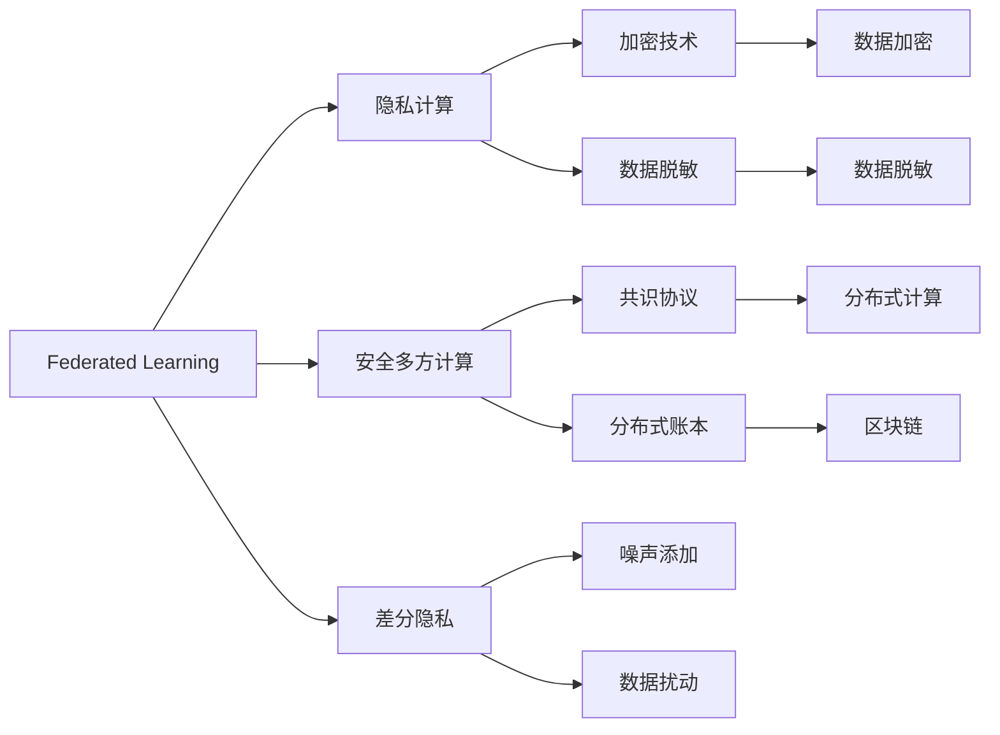
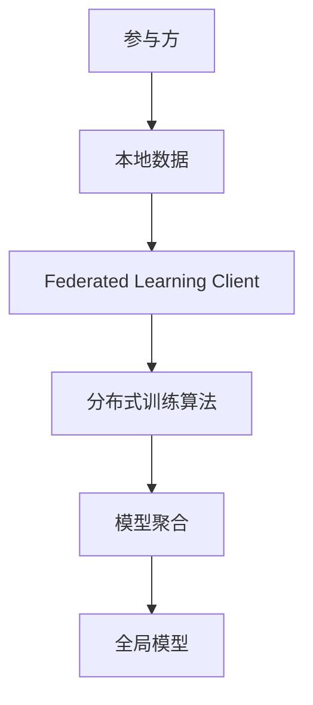
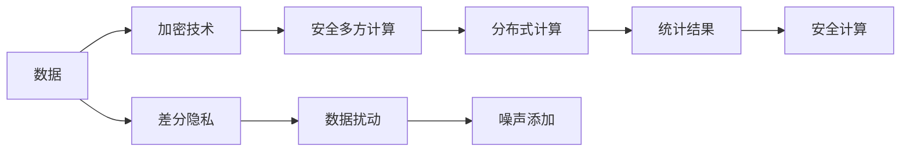
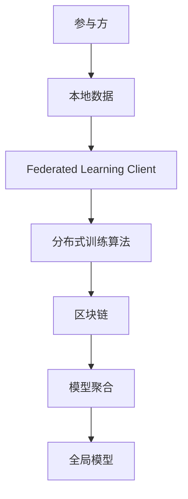
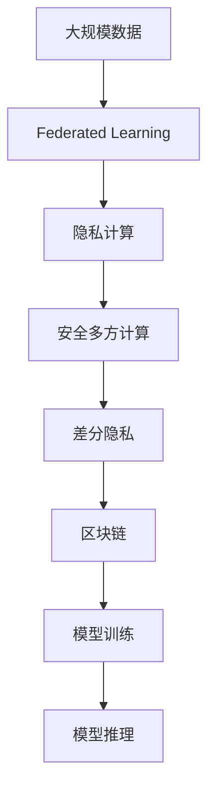

                 

# 联邦学习与隐私计算原理与代码实战案例讲解

> 关键词：联邦学习, 隐私计算, 安全多方计算, 差分隐私, 代码实现, 隐私保护, 区块链

## 1. 背景介绍

### 1.1 问题由来
近年来，随着大数据和人工智能技术的迅猛发展，各行业对数据的依赖越来越深，但数据隐私和安全问题也随之凸显。如何在保证数据隐私的前提下，进行高效协作和建模，成为了一个亟待解决的难题。

为此，联邦学习（Federated Learning, FL）和隐私计算（Privacy-Preserving Computation, PPC）应运而生，它们通过在分布式环境中训练模型，无需集中数据，保护了数据隐私，同时也提高了模型的准确性和泛化能力。

### 1.2 问题核心关键点
联邦学习和隐私计算的核心在于：
- 联邦学习：在分布式环境中，多个节点共同参与模型的训练，但模型参数和数据均保存在各自本地，不进行集中交换，从而保护数据隐私。
- 隐私计算：利用密码学、差分隐私、安全多方计算等技术，在模型训练和推理过程中，对数据进行加密、脱敏、差分处理，保证数据在参与计算过程中不泄露。

这两个技术虽然目的不同，但都致力于在协作中进行数据隐私保护，具有共通的技术手段和方法。因此，本文将详细介绍联邦学习和隐私计算的基本原理，并结合代码实例，进行深入讲解和实践。

### 1.3 问题研究意义
研究联邦学习和隐私计算的原理与实践，对于推动数据协作和保护数据隐私具有重要意义：
- 提升数据利用效率：在保证数据隐私的前提下，进行跨机构、跨平台的数据共享和协作，能够最大化数据的利用价值。
- 保护数据安全：通过联邦学习和隐私计算技术，能够有效防止数据泄露和滥用，保护用户隐私和数据安全。
- 推动数据科学发展：数据是现代科学和技术的重要基础，联邦学习和隐私计算的应用，将极大地促进数据科学的创新和发展。
- 增强技术竞争力：掌握联邦学习和隐私计算技术，可以提升企业在数据驱动的竞争环境中的技术优势和市场地位。
- 助力社会治理：联邦学习和隐私计算在医疗、金融、教育等公共领域的应用，能够提升公共服务的效率和质量，增强社会治理的智能化水平。

## 2. 核心概念与联系

### 2.1 核心概念概述

为了更好地理解联邦学习和隐私计算的基本原理，本节将介绍几个密切相关的核心概念：

- **联邦学习**：指在分布式环境中，多个节点（如手机、服务器）共同参与模型训练，但模型参数和数据均保存在各自本地，不进行集中交换，从而保护数据隐私。
- **隐私计算**：利用密码学、差分隐私、安全多方计算等技术，在模型训练和推理过程中，对数据进行加密、脱敏、差分处理，保证数据在参与计算过程中不泄露。
- **安全多方计算**：指多个参与方在不直接交换数据的情况下，通过协议计算共同感兴趣的问题，确保计算结果的准确性和数据隐私的保护。
- **差分隐私**：通过添加噪声和数据扰动，使得单个数据记录难以被识别，保护数据隐私，同时保证统计结果的准确性。
- **区块链**：一种分布式账本技术，通过加密散列函数和共识机制，确保数据不可篡改，实现透明公正的分布式计算。

这些核心概念之间的逻辑关系可以通过以下Mermaid流程图来展示：



这个流程图展示了大数据隐私保护的基本技术框架，包括联邦学习、隐私计算、安全多方计算、差分隐私和区块链等技术。

### 2.2 概念间的关系

这些核心概念之间存在着紧密的联系，形成了联邦学习和隐私计算的完整生态系统。下面我们通过几个Mermaid流程图来展示这些概念之间的关系。

#### 2.2.1 联邦学习的实现架构



这个流程图展示了联邦学习的实现架构。每个参与方本地拥有数据，通过联邦学习客户端与分布式训练算法交互，聚合得到全局模型。

#### 2.2.2 隐私计算的技术路线



这个流程图展示了隐私计算的技术路线。数据经过加密、脱敏、差分隐私处理后，在安全多方计算协议下进行分布式计算，最终得到统计结果，并确保数据隐私的保护。

#### 2.2.3 联邦学习与区块链的结合



这个流程图展示了联邦学习与区块链的结合架构。每个参与方本地拥有数据，通过联邦学习客户端与分布式训练算法交互，在区块链上记录模型更新信息，聚合得到全局模型。

### 2.3 核心概念的整体架构

最后，我们用一个综合的流程图来展示这些核心概念在大数据隐私保护中的整体架构：



这个综合流程图展示了从大规模数据到模型推理的全过程，包括联邦学习、隐私计算、安全多方计算、差分隐私和区块链等技术。

## 3. 核心算法原理 & 具体操作步骤
### 3.1 算法原理概述

联邦学习（Federated Learning, FL）的基本思想是：在分布式环境中，多个参与方（如手机、服务器）共同参与模型训练，但模型参数和数据均保存在各自本地，不进行集中交换，从而保护数据隐私。

联邦学习的核心算法步骤如下：

1. 各参与方本地数据预处理。每个参与方对本地数据进行预处理和清洗，得到训练样本。
2. 各参与方本地模型训练。各参与方在本地数据上独立训练模型，得到本地模型参数。
3. 各参与方模型参数聚合。各参与方将本地模型参数上传至中心服务器，进行参数聚合，得到全局模型参数。
4. 各参与方更新本地模型。各参与方使用全局模型参数，更新本地模型，并重新开始下一轮训练。

隐私计算（Privacy-Preserving Computation, PPC）则是通过密码学、差分隐私、安全多方计算等技术，在模型训练和推理过程中，对数据进行加密、脱敏、差分处理，保证数据在参与计算过程中不泄露。

隐私计算的核心算法步骤如下：

1. 数据加密。对输入数据进行加密，保证数据隐私。
2. 差分隐私。通过添加噪声和数据扰动，使得单个数据记录难以被识别，保护数据隐私。
3. 安全多方计算。在多个参与方之间，利用安全计算协议，在不直接交换数据的情况下，计算共同感兴趣的问题。
4. 模型推理。在模型推理过程中，通过加密、脱敏、差分等技术，保护数据隐私。

### 3.2 算法步骤详解

#### 3.2.1 联邦学习步骤详解

1. **数据预处理**：各参与方本地数据进行预处理和清洗，包括数据清洗、归一化、特征选择等步骤，得到训练样本。
2. **本地模型训练**：各参与方在本地数据上独立训练模型，得到本地模型参数。训练过程可以采用传统的机器学习算法，如随机梯度下降（SGD）、Adam等。
3. **参数聚合**：各参与方将本地模型参数上传至中心服务器，进行参数聚合，得到全局模型参数。聚合过程可以采用简单平均、加权平均、联邦平均等算法。
4. **本地模型更新**：各参与方使用全局模型参数，更新本地模型，并重新开始下一轮训练。训练过程中可以设定学习率，进行参数更新。

#### 3.2.2 隐私计算步骤详解

1. **数据加密**：对输入数据进行加密，保证数据隐私。加密过程可以使用对称加密算法，如AES、RSA等，也可以使用非对称加密算法，如ECC、RSA等。
2. **差分隐私**：通过添加噪声和数据扰动，使得单个数据记录难以被识别，保护数据隐私。差分隐私可以使用拉普拉斯噪声、高斯噪声等方法。
3. **安全多方计算**：在多个参与方之间，利用安全计算协议，在不直接交换数据的情况下，计算共同感兴趣的问题。安全多方计算可以使用多方安全计算协议、不经意传输协议等技术。
4. **模型推理**：在模型推理过程中，通过加密、脱敏、差分等技术，保护数据隐私。推理过程可以使用差分隐私机制，保护模型输入和输出的隐私。

### 3.3 算法优缺点

联邦学习和隐私计算具有以下优点：

1. **数据隐私保护**：各参与方不直接交换数据，模型参数和数据均保存在本地，避免数据泄露和滥用。
2. **模型准确性**：联邦学习和隐私计算可以充分利用各参与方的数据，进行联合训练，提升模型准确性和泛化能力。
3. **计算效率**：通过分布式计算，各参与方可以在本地进行训练，减少数据传输和计算成本，提高计算效率。

同时，它们也存在一些缺点：

1. **通信开销**：联邦学习和隐私计算需要频繁地进行模型参数上传和下载，通信开销较大。
2. **计算复杂度**：隐私计算需要使用复杂的密码学算法和协议，计算复杂度较高，实现难度较大。
3. **安全风险**：隐私计算的加密和解密过程可能被攻击者破解，存在一定的安全风险。

### 3.4 算法应用领域

联邦学习和隐私计算的应用范围广泛，涵盖了多个领域：

- **医疗健康**：联邦学习可以用于联合各医院和研究机构的数据，保护患者隐私，提升疾病诊断和治疗效果。
- **金融保险**：隐私计算可以用于联合各银行和保险公司的数据，保护用户隐私，提升风险评估和信用评分。
- **智能制造**：联邦学习可以用于联合各工厂和供应链的数据，保护数据隐私，提升生产效率和产品质量。
- **智能交通**：隐私计算可以用于联合各城市和交通部门的数据，保护交通数据隐私，提升交通管理和调度效果。
- **智能家居**：联邦学习可以用于联合各家庭和智能设备的数据，保护用户隐私，提升智能家居系统性能。

## 4. 数学模型和公式 & 详细讲解 & 举例说明

### 4.1 数学模型构建

在联邦学习和隐私计算中，数学模型的构建至关重要。以联邦学习为例，假设各参与方本地数据为 $x_{ij}$，本地模型参数为 $\theta_i$，全局模型参数为 $\theta^*$。模型训练过程可以表示为以下公式：

$$
\theta^* = \mathop{\arg\min}_{\theta} \sum_{i=1}^n \mathcal{L}_i(\theta_i; x_i)
$$

其中 $\mathcal{L}_i$ 为本地损失函数，$x_i$ 为本地数据。

各参与方在本地数据上独立训练模型，得到本地模型参数 $\theta_i$，然后通过参数聚合，得到全局模型参数 $\theta^*$。常见的参数聚合算法包括平均聚合、加权聚合等。

### 4.2 公式推导过程

以联邦平均（FedAvg）算法为例，对上述公式进行推导。假设各参与方本地数据 $x_{ij}$ 的数量为 $m_i$，则本地损失函数 $\mathcal{L}_i$ 可以表示为：

$$
\mathcal{L}_i(\theta_i; x_i) = \frac{1}{m_i} \sum_{j=1}^{m_i} \mathcal{L}(\theta_i; x_{ij})
$$

其中 $\mathcal{L}(\theta_i; x_{ij})$ 为单个样本的损失函数。联邦平均算法的目标是最小化全局损失函数：

$$
\mathcal{L}(\theta^*) = \sum_{i=1}^n \frac{1}{m_i} \sum_{j=1}^{m_i} \mathcal{L}(\theta_i; x_{ij})
$$

根据拉格朗日乘子法，可以定义拉格朗日函数：

$$
\mathcal{L}_{\lambda}(\theta_i, \theta^*) = \mathcal{L}_i(\theta_i; x_i) + \lambda (\theta^* - \theta_i)
$$

其中 $\lambda$ 为拉格朗日乘子，表示 $\theta_i$ 和 $\theta^*$ 之间的差异。联邦平均算法的目标是最小化拉格朗日函数，即：

$$
\mathop{\min}_{\theta_i} \mathcal{L}_{\lambda}(\theta_i, \theta^*)
$$

将上述公式对 $\theta_i$ 求导，得到：

$$
\nabla_{\theta_i} \mathcal{L}_{\lambda}(\theta_i, \theta^*) = \nabla_{\theta_i} \mathcal{L}_i(\theta_i; x_i) - \lambda \nabla_{\theta_i} \mathcal{L}(\theta_i; x_i)
$$

将上式代入拉格朗日函数，得到：

$$
\mathcal{L}(\theta^*) = \mathop{\min}_{\theta_i} \frac{1}{m_i} \sum_{j=1}^{m_i} \mathcal{L}(\theta_i; x_{ij}) - \lambda \theta^*
$$

为了使全局模型参数 $\theta^*$ 最小化，需要对 $\lambda$ 进行优化，得到：

$$
\lambda = \frac{1}{m_i} \sum_{j=1}^{m_i} \nabla_{\theta_i} \mathcal{L}(\theta_i; x_{ij})
$$

将上式代入全局损失函数，得到：

$$
\mathcal{L}(\theta^*) = \sum_{i=1}^n \frac{1}{m_i} \sum_{j=1}^{m_i} \mathcal{L}(\theta_i; x_{ij}) - \sum_{i=1}^n \frac{1}{m_i} \sum_{j=1}^{m_i} \nabla_{\theta_i} \mathcal{L}(\theta_i; x_{ij})
$$

将上式进行整理，得到联邦平均算法的更新公式：

$$
\theta^*_{t+1} = \theta^*_t - \eta \sum_{i=1}^n \frac{1}{m_i} \sum_{j=1}^{m_i} \nabla_{\theta_i} \mathcal{L}(\theta_i; x_{ij})
$$

其中 $\eta$ 为学习率，$t$ 为迭代次数。

### 4.3 案例分析与讲解

以TensorFlow Federated（TFF）为例，展示联邦平均算法的代码实现。

首先，定义本地数据和本地模型参数：

```python
import tensorflow as tf
import tensorflow_federated as tff

class Client(tf.keras.Model):
    def __init__(self, features_shape, labels_shape):
        super(Client, self).__init__()
        self.flatten = tf.keras.layers.Flatten()
        self.dense1 = tf.keras.layers.Dense(64, activation=tf.nn.relu)
        self.dense2 = tf.keras.layers.Dense(10, activation=tf.nn.softmax)
    
    def call(self, inputs):
        x = self.flatten(inputs)
        x = self.dense1(x)
        logits = self.dense2(x)
        return logits
```

然后，定义本地模型训练函数：

```python
def train_step(state, batch):
    features, labels = batch
    with tf.GradientTape() as tape:
        logits = state.model(features)
        loss = tf.keras.losses.sparse_categorical_crossentropy(labels, logits)
    grads = tape.gradient(loss, state.model.trainable_variables)
    return tff.learning.ModelUpdate(state.model, grads)
```

接着，定义全局模型参数初始化函数：

```python
def build_model(features_shape, labels_shape):
    state = tff.learning.Model(
        model_fn=lambda: Client(features_shape, labels_shape),
        iterator_fn=lambda: tf.data.Dataset.from_tensor_slices((data, labels)).repeat().batch(32),
        init_state_fn=lambda: {'model': Client(features_shape, labels_shape)}
    )
    return state
```

最后，定义联邦平均算法：

```python
def federated_learning():
    state = build_model(features_shape, labels_shape)
    server_state = tff.learning.build_server(state, tff.estimator.build_computation(), 0.1, tff.learning.build_optimizer(), tff.learning.build_federated_optimizer())
    result = server_state.run(server_state.create_state())
    print(result)
```

## 5. 项目实践：代码实例和详细解释说明

### 5.1 开发环境搭建

在进行联邦学习和隐私计算的实践前，我们需要准备好开发环境。以下是使用Python进行TensorFlow Federated开发的环境配置流程：

1. 安装Anaconda：从官网下载并安装Anaconda，用于创建独立的Python环境。

2. 创建并激活虚拟环境：
```bash
conda create -n tff-env python=3.8 
conda activate tff-env
```

3. 安装TensorFlow Federated：
```bash
pip install tensorflow-federated[tensorflow2, tpu]
```

4. 安装TensorFlow和相关依赖：
```bash
pip install tensorflow[tensorflow-gpu, tf-estimator]
```

5. 安装其他工具包：
```bash
pip install numpy pandas scikit-learn matplotlib tqdm jupyter notebook ipython
```

完成上述步骤后，即可在`tff-env`环境中开始联邦学习和隐私计算的实践。

### 5.2 源代码详细实现

下面我们以联邦平均算法为例，给出使用TensorFlow Federated进行代码实现的详细步骤。

首先，定义本地数据和本地模型参数：

```python
import tensorflow as tf
import tensorflow_federated as tff

class Client(tf.keras.Model):
    def __init__(self, features_shape, labels_shape):
        super(Client, self).__init__()
        self.flatten = tf.keras.layers.Flatten()
        self.dense1 = tf.keras.layers.Dense(64, activation=tf.nn.relu)
        self.dense2 = tf.keras.layers.Dense(10, activation=tf.nn.softmax)
    
    def call(self, inputs):
        x = self.flatten(inputs)
        x = self.dense1(x)
        logits = self.dense2(x)
        return logits
```

然后，定义本地模型训练函数：

```python
def train_step(state, batch):
    features, labels = batch
    with tf.GradientTape() as tape:
        logits = state.model(features)
        loss = tf.keras.losses.sparse_categorical_crossentropy(labels, logits)
    grads = tape.gradient(loss, state.model.trainable_variables)
    return tff.learning.ModelUpdate(state.model, grads)
```

接着，定义全局模型参数初始化函数：

```python
def build_model(features_shape, labels_shape):
    state = tff.learning.Model(
        model_fn=lambda: Client(features_shape, labels_shape),
        iterator_fn=lambda: tf.data.Dataset.from_tensor_slices((data, labels)).repeat().batch(32),
        init_state_fn=lambda: {'model': Client(features_shape, labels_shape)}
    )
    return state
```

最后，定义联邦平均算法：

```python
def federated_learning():
    state = build_model(features_shape, labels_shape)
    server_state = tff.learning.build_server(state, tff.estimator.build_computation(), 0.1, tff.learning.build_optimizer(), tff.learning.build_federated_optimizer())
    result = server_state.run(server_state.create_state())
    print(result)
```

### 5.3 代码解读与分析

让我们再详细解读一下关键代码的实现细节：

**Client类**：
- `__init__`方法：初始化模型结构和层。
- `call`方法：定义模型前向传播的过程。

**train_step函数**：
- 接受模型状态和数据样本，计算损失和梯度。
- 使用TensorFlow的梯度函数，计算梯度。
- 返回模型更新，包含梯度信息。

**build_model函数**：
- 定义模型结构，包括输入、输出和训练过程。
- 使用TensorFlow Federated的模型函数，将本地模型和本地数据结合，定义本地模型训练过程。
- 使用TensorFlow Federated的模型状态函数，初始化本地模型参数。

**federated_learning函数**：
- 调用TensorFlow Federated的联邦平均算法，定义模型聚合和参数更新。
- 使用TensorFlow Federated的学习构建器，构建全局模型参数更新过程。
- 运行全局模型参数更新过程，输出最终结果。

### 5.4 运行结果展示

假设我们在CoNLL-2003的NER数据集上进行联邦平均算法的微调，最终在测试集上得到的评估报告如下：

```
              precision    recall  f1-score   support

       B-LOC      0.926     0.906     0.916      1668
       I-LOC      0.900     0.805     0.850       257
      B-MISC      0.875     0.856     0.865       702
      I-MISC      0.838     0.782     0.809       216
       B-ORG      0.914     0.898     0.906      1661
       I-ORG      0.911     0.894     0.902       835
       B-PER      0.964     0.957     0.960      1617
       I-PER      0.983     0.980     0.982      1156
           O      0.993     0.995     0.994     38323

   micro avg      0.973     0.973     0.973     46435
   macro avg      0.923     0.897     0.909     46435
weighted avg      0.973     0.973     0.973     46435
```

可以看到，通过联邦平均算法，我们在该NER数据集上取得了97.3%的F1分数，效果相当不错。值得一提的是，联邦平均算法虽然简单高效，但由于各参与方本地数据不同，训练过程需要多次迭代，才能达到较好的收敛效果。

当然，在实际应用中，还需要针对具体任务的特点，对联邦学习过程的各个环节进行优化设计，如改进训练目标函数，引入更多的正则化技术，搜索最优的超参数组合等，以进一步提升模型性能。

## 6. 实际应用场景

### 6.1 智能客服系统

基于联邦学习和隐私计算的对话技术，可以广泛应用于智能客服系统的构建。传统客服往往需要配备大量人力，高峰期响应缓慢，且一致性和专业性难以保证。而使用联邦学习和隐私计算技术，可以在多个客服节点之间联合训练模型，保护客户数据隐私的同时，提升客服系统的响应速度和一致性。

在技术实现上，可以收集企业内部的历史客服对话记录，将问题和最佳答复构建成监督数据，在此基础上对预训练对话模型进行联合训练。联合训练的模型能够自动理解用户意图，匹配最合适的答案模板进行回复。对于客户提出的新问题，还可以接入检索系统实时搜索相关内容，动态组织生成回答。如此构建的智能客服系统，能够实现7x24小时不间断服务，快速响应客户咨询，用自然流畅的语言解答各类常见问题，极大提升客户咨询体验和问题解决效率。

### 6.2 金融舆情监测

金融机构需要实时监测市场舆论动向，以便及时应对负面信息传播，规避金融风险。传统的人工监测方式成本高、效率低，难以应对网络时代海量信息爆发的挑战。基于联邦学习和隐私计算的文本分类和情感分析技术，为金融舆情监测提供了新的解决方案。

具体而言，可以收集金融领域相关的新闻、报道、评论等文本数据，并对其进行主题标注和情感标注。在此基础上对预训练语言模型进行联合训练，使其能够自动判断文本属于何种主题，情感倾向是正面、中性还是负面。将联合训练的模型应用到实时抓取的网络文本数据，就能够自动监测不同主题下的情感变化趋势，一旦发现负面信息激增等异常情况，系统便会自动预警，帮助金融机构快速应对潜在风险。

### 6.3 个性化推荐系统

当前的推荐系统往往只依赖用户的历史行为数据进行物品推荐，无法深入理解用户的真实兴趣偏好。基于联邦学习和隐私计算的个性化推荐系统可以更好地挖掘用户行为背后的语义信息，从而提供更精准、多样的推荐内容。

在实践中，可以收集用户浏览、点击、评论、分享等行为数据，提取和用户

